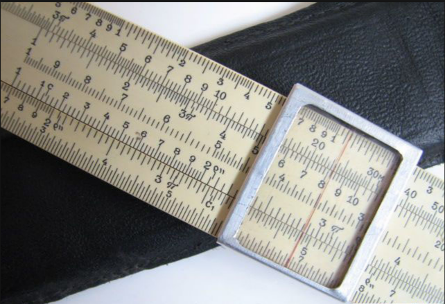
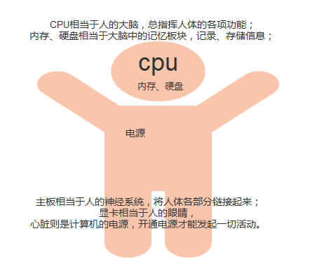
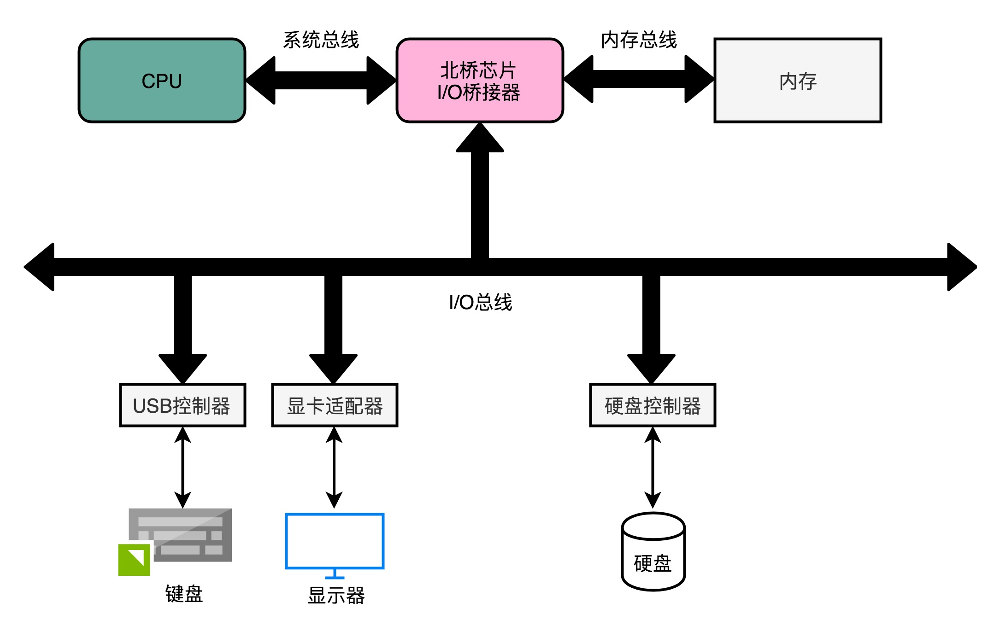
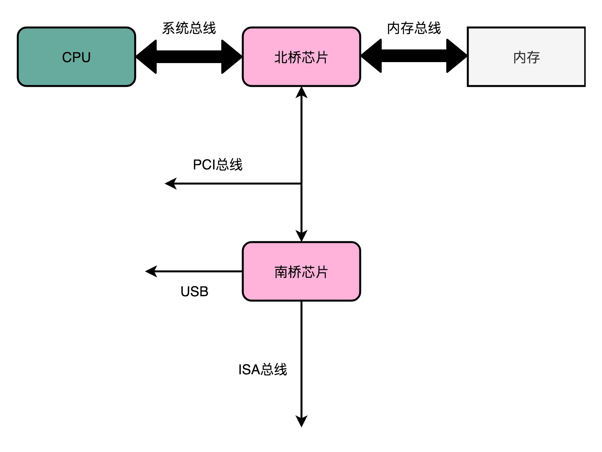
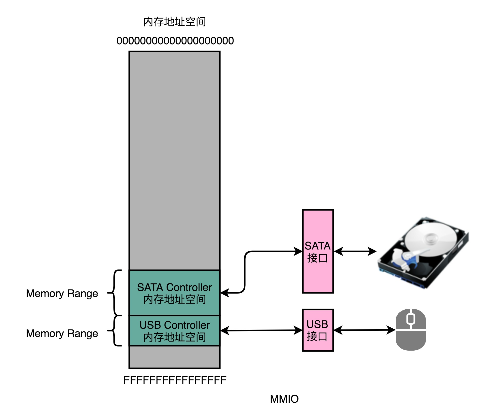
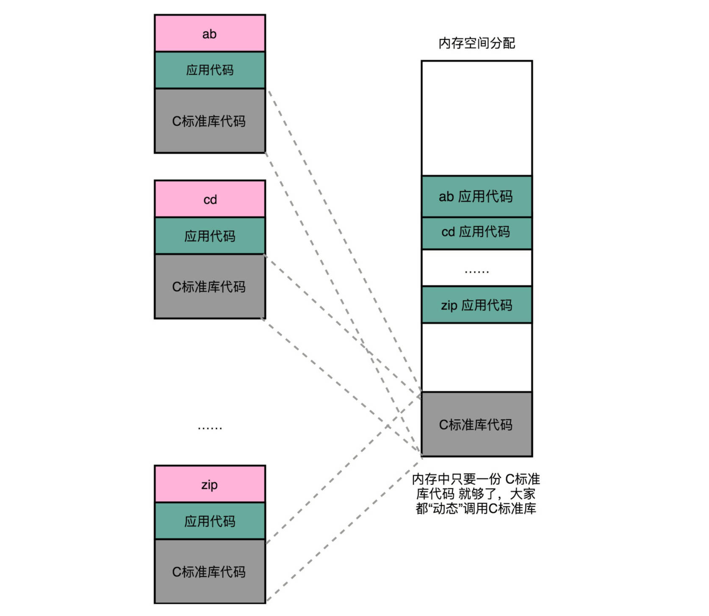

[TOC]


# 第1章 计算机的发展历史

## 早期的计算器

### 算盘

在计算机没有制造出来时，计算器是最早的计算工具。早期的计算器为纯手动式，如算盘、算筹等。算盘通常是以滑动的珠子制成。在西方，算盘在印度阿拉伯数字流行前使用了数个世纪，且在近代中国的记帐与商务上仍广泛使用。后来出现机械计算器。


**算盘，西亚人的发明**

和一般人想象的不同，算盘并非中国人的发明。最早的算盘出现在公元前2700年到2300年左右的苏美尔文明（**人类已知的最早文明**），最初只是一个有横隔的泥板，摆上泥丸或者石子，按位累加，放满清空，并在下一列加1——这就是进位制的最初起源。

> 苏美尔文明，是比传统四大古文明更加久远甚至先进的文明。苏美尔文明，指的是苏美尔地区以苏美尔语文献为主要标志的文明。古代地名苏美尔，位于今伊拉克东南部幼发拉底河和底格里斯河下游。苏美尔文明的时间大致是始于公元前4000-5500年，距今六千到七千年前，比古埃及更早，是目前考古能确认的最早的人类文明。苏美尔文明拥有今天考古学家所能确定的最早的五大城市。其中Eridu（考古遗迹位于伊拉克）建成于公元前5400年，距今七千年历史。


很难说中国的算盘是否是独立发明的，它与西方算盘非常类似，**很可能是丝绸之路东西交流的产物**。

中国算盘最早见载于东汉末年的《数术记遗》，是像罗马算盘一样的游珠算盘，到唐代改良为现在的串珠算盘；而现存最早的算盘图像见于北宋张择端的《清明上河图》，卷左赵太丞家药铺柜台上有一个十五档一四算盘，和现代会计算盘几乎一样。

### 算筹

算筹，是第一种有进位的10进制记数法。

> 它最早出现在何时，已经不可查考了，但是到春秋战国，算筹的使用已经非常普遍了。算筹在中国的起
>
> 源很早，中国著名科学家 祖冲之（429-500）借助算筹为计算工具，计算出圆周率在  3.1415926 到
>
> 3.1415927 之间，成为了世界上最早把圆周率数值算到 7 位数字以上的科学家
>
> 这种计数系统经过南北朝、宋朝的改进，能够标明小数和正负数，是当时最为先进的计数系统之一。

它的领先到了什么程度？印度-阿拉伯数字传入古代中国时，根本不受重视，因为它的功能在中国人看来，没什么新鲜的。


### 纳皮尔算筹

17世纪初，西方国家的计算工具有了较大的发展，英国数学家纳皮尔发明的"纳皮尔算筹"。

这套工具主要用来计算乘除法，计算时先用算码凑成一个因数，再根据行号读出与另一个因数每一位的乘积，最后在纸上相加，本质上就是一副活字九九表，如果加入其它扩充的算码还可以用来开方。

之后的三个多世纪里，它不断改良，是近代早期欧洲最流行的计算工具，并曾东传中国，被清代数学家当作筹算的分支


### 计算尺

但约翰•纳皮尔的数学贡献不只是一副“骨头”，他还是对数概念的提出人，这直接引出了另一种沿用至今的计算工具——计算尺。

17世纪的大不列颠开始对外殖民扩张，航海、测绘、天文定位都出现了难以完成的计算需求，而对数可以化幂运算为乘除法、化乘除法为加减法，法国数学家和天文学家拉普拉斯（Pierre Simon Laplace，1749-1827）曾赞叹：“对数，可以缩短计算时间，在实效上等于把天文学家的寿命延长了许多倍。”

1620年到1630年间，牛津大学和剑桥大学根据**纳皮尔的对数原理**，发明了更方便的滑尺，分直形和圆形两种，可通过对齐尺子上的刻度查询计算结果——这就是中文“对数”一词的由来。

随后的两个世纪里，工程师和数学家不断为计算尺引入新的刻度，并添加了滑动的游标，发展成现代的多相算尺，可以进行加减法之外所有的算术运算，以及三角函数等超越计算，不同工程领域还常常研发出自己的专业型号。

20世纪70年代出现电子科学计算器以前，计算尺都是工程师的身份象征。




## 机械计算机

### 契克卡德计算钟（1623年）

**1623 年**，德国科学家 契克卡德(W.Schickard) 制造了人类有史以来的第一台机械式计算机，这台计算机能

够进行六位数的加减乘除运算，它比帕斯卡机的诞生早了约20年。

契克卡德这台传说中的机器后来被称为Rechenuhr，德语中Rechnen表示「算术」，uhr表示「时钟」，Rechenuhr便通常译为「计算钟」。跟「钟」有什么关系呢？因为当计算结果溢出（超出6位数）时，机器会发出响铃警告，这样的设计在当时可谓相当智能。

契克卡德的手稿被辨认之后，图宾根大学一位名叫布鲁诺·冯·弗雷塔格-洛林霍夫（Bruno von Freytag-Löringhoff）的学者立刻开展了相关研究，并于1960年做出了计算钟的复制品。


契克卡德计算钟复制品，我标注了组成部件，方便下面解说。（原图来自维基「Wilhelm Schickard」词条）

计算钟支持六位整数计算，主要分为加法器、乘法器和中间结果记录装置三部分，它们虽然集成在同一台机器上，但相互之间没有任何物理关联。位于机器底座的中间结果记录装置是一组简单的置数旋钮，主要是为了省去计算过程中笔和纸的参与

### 帕斯卡计算器（1642年）

钟表指针的齿轮转动天然地具有进位功能。**1642年**，法国数学家、物理学家和化学家帕斯卡（Blaise Pascal，1623-1662）借此设计了一台“帕斯卡计算器”（Pascal&# 39;s calculator）。长方形的黄铜盒子上开有一列读数窗，下面对应着一行带辐条和指针的齿轮。操作时先像拨盘电话一样逐位输入一个加数，这将显示在上方的读数窗里；再用同样的方式输入另一个加数，读数窗里就会显示出和了。


帕斯卡计算器虽然在功能上远远不及算筹和算盘，却是一次彻底的革命——算筹和算盘本身不包含任何算法，只能存储计算的中间结果，操作依赖熟记指令的人，本质上只是寄存器。帕斯卡计算器却用内部的齿轮机构预存了算法，操作者完全不需要知道计算方法就能操作。


这才是真正的计算器，而不止是计算用的工具。

尽管占有许多历史第一，但帕斯卡的计算器并没有充分推广，他的设计初衷只是帮助父亲计算税收，造价非常高昂，最后沦为有钱人的机械玩具，前后只卖出约20件。

### 莱布尼兹步进计算器（1674 年）

与帕斯卡类似，德国大数学家、哲学家莱布尼兹（Gottfried Wilhelm Leibniz，1646-1716）也对机械化的计算工具颇有兴趣，他在1672年到1694年之间发明了一种“步进计算器”（Stepped Reckoner），采用了他独创的“莱布尼兹轮”（Leibniz wheel），可以控制齿轮只转动需要的角度。这产生了相当复杂的运算能力，除了普通的加减法意外，还能将两个8位数字相乘为一个16位数字，或者用一个16位的数字除以一个8位数字。


保存在德意志博物馆的步进计算器复制品（图片来自维基「Stepped reckoner」词条）


**步进计算器是有史以来第一台具有完整的四则运算能力的机械式计算机**，「步进（stepped）」这个名字，来自于其乘除法的实现原理。

最开始的时候，莱布尼茨尝试在帕斯卡那台只能做加减运算的算术机上进行改进，但很快发现，现有的结构实在无法实现他心目中的自动化，只好重新设计。

### 查尔斯·巴贝奇：现代计算机真正的鼻祖

机械计算时代，却仅仅在和加、减、乘、除——简单到不能再简单的基本运算打交道。难道机器只能用来做运算吗？为了解决一个数学问题，人们往往需要将多步运算串联起来，每一次串联不过是将上一步的运算结果直接或经过简单处理后交给下一步而已，而既然运算可以由机器完成，为什么步骤就不可以呢？


#### 差分思想

差分机这个名字，源自其所使用的算法，是帕斯卡在1654年提出的差分思想：n次多项式的n次数值差分为同一常数。这句话概括性高，不太好理解，让我们用几个例子来详细说明。

选用经典数字1024，构造一次函数F(x)：


同时定义差分∆F(x)：


在x取0～6时，F(x)及∆F(x)的值如下表所示：


不难发现，对于一次多项式，每个相邻的x所对应的F(x)之差都是一个常数，这个常数正是x的系数。那么二次多项式呢？

构造二次函数F(x)：


同时定义一次差分与二次差分：


在x取0～6时，F(x)及其一次、二次差分的值如下表所示：


对于二次多项式，每个相邻的x所对应的一次差分之差（即二次差分）是一个常数。


一次多项式和二次多项式的规律如此，三次、四次，乃至任意多次的多项式都遵循这样的差分规律——n次多项式的n次差分为常数。


差分规律是一项伟大的发现，有了差分，在计算多项式时就可以用加法代替乘法，我们只需要准备好x=0时F(x)及各次差分的值，后面任意x所对应的F(x)值均可通过加法得出。只要有了第1列F(0)、和的值，第2列的F(1)即可通过得到、可通过得到，同理，第3列的F(2)和也可根据第2列的数据得到，以此类推，任意列的数据都可通过前一列的数据得到。意即，求解F(n)，只需前n列数据的不断迭代。而这整个过程，只涉及加法。

这可了不得！要知道，许多常见的函数在数学上称为解析函数，它们都可以用多项式逼近（幂级数展开），常用的三角函数、对数函数都可以转换为多项式。借助差分思想，这些函数可以进一步转换为重复的加法。而加法运算正是机械计算器的“拿手好戏”，这样一来，绝大部分数学运算就都可以交给机器了。

#### 差分机（1822年）：一种高度自动化的计算机器

1822年6月14日，查尔斯·巴贝奇（Charles Babbage）向皇家天文学会递交了一篇名为《论机械在天文及数学用表计算中的应用》的论文，差分机的概念正式问世。


与论文一起亮相的，是一台简单的原型机——差分机0号。英国政府对它很有兴趣，并于次年拨款1700英镑，希望巴贝奇能做出实用产品，彻底解决制表难题。


拿到启动资金的巴贝奇如鱼得水，立即着手差分机1号的研制，并宣称只需两三年就能完成任务。谁知实行起来要比想象中困难得多，那个时代的机械制造水平实在满足不了差分机的精密要求，巴贝奇跑遍整个欧洲也没找到多少能用的零件，于是在制造机器之前，还要先考虑怎么制造各类零件。在当时一位顶尖的英国机械师约瑟夫·克莱门特（Joseph Clement）的帮助下，巴贝奇不但做出了差分机能用的零件，还培养出大批优秀的技师。

也正因如此，他们无意间将一个项目的摊子铺到了一个行业的尺度，尽管实施的过程精雕细琢、尽善尽美，却没能交付一件满足要求的产品。1832年，项目启动10年过去了，巴贝奇却只完成了设计稿的七分之一——一台支持6位数、2次差分的小模型（设计稿为20位数、6次差分）。


差分机1号的七分之一模型（图片来自维基百科）

巴贝奇作为差分机的鼻祖，反倒没有留下实际可用的机器。1846～1849年，他升级了设计，提出支持31位、7次差分的差分机2号（Difference Engine No.2）方案，但没了政府的资助，只能停留于稿纸。于是，巴贝奇的设计是否真的可行，其人作为“差分机之父”是否名副其实，成为学术界长久以来的一大争论。直到1985～1991年，伦敦科学博物馆为了纪念巴贝奇诞辰200周年，根据其1849年的设计，用纯19世纪的技术成功造出了差分机2号，才彻底巩固了他的历史地位。（博物馆发现，巴贝奇的设计稿中仅存在少量错误，而且基本可以断定它们是巴贝奇刻意设置的防盗措施。）


伦敦科学博物馆的差分机2号（图片来自维基百科）

#### 分析机（1833年）

差分机的建造虽然夭折了，但巴贝奇从未停止过对设计稿的改进。直到有一天，一个惊人的想法从他脑中掠过，如同神祇，如同有史以来所有人类对计算的诉求结晶——差分机固然强大，但终究只能计算多项式而已，何不建造一台可以解决所有计算问题的通用机器呢！


1833年，巴贝奇就着手开始了这种通用机器的设计，并不断改进直至离世。这台被他称作分析机（Analytical Engine）的机器，直接将机械计算的理念从地表推上云天。

**组成结构**

巴贝奇将分析机划分为5大部分：

1. 由差分机的计数装置改进而来的数据存储器，可存储1000个40位十进制数；
2. 支持四则运算、比较大小和开平方根的算术单元，巴贝奇称之为“工厂”（mill）；

3. 实现逻辑控制的圆柱形“控制筒”，身周固定着许多销钉，随着“控制筒”的旋转，通过销钉推动杠杆实现控制；

4. 3种用于输入的读卡装置，其一输入运算指令，其二输入常量数据，其三输入控制数据（在存储器和算术单元之间）传输的指令，承载这些输入信息的是一种名为穿孔卡片（punched card/punch card）的经典载体，3种读卡装置分别识别3种类型（运算、数据和控制）的穿孔卡片；

5. 4种输出装置，其一为打印装置，其二为曲线绘图仪，其三为响铃，其四为打孔机，用于制造穿孔卡片。


分析机使用的穿孔卡片——上：数据类卡片｜下：运算类卡片（图片来自维基百科）

后人惊讶地发现，这种组成结构竟和现代计算机如出一辙（现代计算机的五大组成部件是由冯·诺依曼在1945年才明确提出的）。


5大部件的协作过程大体是这样的：读卡装置从穿孔卡片上读取数据和运算指令，数据进入存储器，随后被传送至“工厂”进行处理，处理结果进入存储器并通过输出装置呈现给用户。在控制类穿孔卡片的指引下，“控制筒”可以实现顺序、循环、条件等多种控制逻辑，读取数据的读卡装置则不但可以按照正常顺序读卡，还可以反序读卡，乃至跳过部分卡片。


巴贝奇首次将运行步骤从机器身上剥离，靠随时可以替换的穿孔卡片来指挥机器，成就了机器的可编程性。这其中，穿孔卡片的引入功不可没。这种经典的数据载体跨越了机械、机电和电子3个时代，一直沿用至20世纪80年代中期。

仿佛是老天爷一个玩笑式的魔咒，分析机的研制不幸步了差分机的后尘，巴贝奇付出了几十年的努力，却仍只建成了它的一小部分。


巴贝奇抱憾而终，留给后世的仅仅只有小小的模型和两千多张图纸。

#### 第一位程序员：艾达·洛芙莱斯（Ada Lovelace）

1840年，巴贝奇应邀来到意大利都灵大学分享分析机的设计，当时一位年轻的工程师、后来的意大利首相路易吉·费德里科·梅纳布雷亚（Luigi Federico Menabrea）用法语记下了详细的笔记并于1842年整理出版。1843年，著名诗人乔治·戈登·拜伦（George Gordon Byron）的女儿艾达·洛芙莱斯（Ada Lovelace）将这份笔记译成英文，并在巴贝奇的提议下扩充了许多自己的理解。此时的艾达其实已经对分析机痴迷了8年，结果她留下的注解篇幅足有译文本身的2倍！其中一处在分析机上计算伯努利数的描述被后人视为史上第一个计算机程序，这篇名为《关于巴贝奇先生发明的分析机简讯》的译文被视为程序设计方面的第一篇著作，艾达其人则被视为第一位程序员，尽管当时连编程语言都没有，连实物机器都没有。


纵观整个机械时期，巴贝奇的思想远远超出了其他几位先驱者，他如同一个从20世纪穿越回去的先知，把一百年后的思想“剧透”给了世人。唯一缺憾的，是不论差分机还是分析机，巴贝奇都终究没能实现。人类的技术发展错过了一次“跳级”的机会，巴贝奇在计算机领域的成就逐渐没入历史的浓雾，等待百年之后再被另一批天才重新发明。

## 穿孔制表机（1884）

穿孔卡是早期计算机输入信息的设备，通常可以储存80列数据。它是一种很薄的纸片，面积为190×84毫米。首次使用穿孔卡技术的数据处理机器，是美国统计专家霍列瑞斯博士（H.Hollerith）的伟大发明。Hollerith机(Hollerith Machine)，是美国人口普查催生的计算器。1880年以前，美国的人口普查都是人工做的。1880的普查完成之后，美国人意识到按照当时的人口增长速度，下一次1890年的普查十年也不可能完成统计，而美国的法律规定必须在十年内完成。于是招标寻找解决办法。Herman Hollerith设计了这种在纸板上打孔(punched card)的技术，帮助解决了统计局的难题。但是他本人并没有赚到钱。1896年他成立了一个公司(TabulatingMachine Company)，向其它国家卖他的产品。后来在他老了以后，他把公司卖给了手下的一个主管。最后成了成立IBM的三家公司之一。

**制表机**

他发明的机器叫制表机（tabulator/tabulating machine），顾名思义，就是专门用来制作数据统计表的机器。制表机主要由示数装置、穿孔机、读卡装置和分类箱组成。


示数装置包含4行、10列共40个示数表盘，每个盘面被均匀地分成100格，并装有两根指针，和钟表十分相像，“分针”转一圈可计100，“时针”转一圈则计10000。可见，整个示数装置可以表达很庞大的数据。


制表机（原图来自维基百科）

制表机的工作是围绕穿孔卡片展开的：操作员先使用穿孔机制作穿孔卡片，再使用读卡装置识别卡片上的信息，机器自动完成统计并在示数表盘上实时显示结果，最后，将卡片投入分类箱的某一格中，进行分类存放，以供下次统计使用。

**穿孔卡片的应用**

此前的某一天，霍尔瑞斯正在火车站排队检票，目光不经意落到检票员手中咔咔直响的打孔机上。他发现，检票员会特意根据乘客的性别和年龄段，在车票的不同地方打孔。越来越多的人过检，他进一步确认了这个规律。一个灵感朝他袭来：如果有一张更大的卡，上面有更多的位置可以打孔，就可以用来表示更多的身份信息，包括国籍、人种、性别、生日等等。

这就是用在1890年人口普查中的穿孔卡片，一张卡片记录一个居民的信息。卡片设计长约18.73cm，宽约8.26cm，正好是当时一张美元纸币的尺寸，因为霍尔瑞斯直接用财政部装钱的盒子来装卡片。


霍尔瑞斯的穿孔卡片（图片来自维基百科）

卡片设有300多个孔位，与雅卡尔和巴贝奇的做法一样，靠每个孔位打孔与否来表示信息。尽管这种形式颇有几分二进制的意味，但当时的设计还远不够成熟，并没有用到二进制真正的价值。举个例子，我们现在一般用1位数据就可以表示性别，比如1表示男性，0表示女性，而霍尔瑞斯在卡片上用了两个孔位，表示男性就其中一处打孔，表示女性就在另一处打孔。其实性别还凑合，表示日期时浪费得就多了，12个月需要12个孔位，而常规的二进制编码只需要4位。当然，这样的局限也与制表机中简单的电路实现有关。


是霍尔瑞斯将穿孔卡片作为数据存储介质推广了开来，并开启了一个崭新的数据处理纪元。后来人们也把这类卡片称为霍尔瑞斯卡片，穿孔卡片和穿孔纸带作为输入输出载体，统治了计算领域整整一个世纪。

## 图灵机：计算机世界的理论基石


艾伦·麦席森·图灵（Alan Mathison Turing），1912-1954，英国数学家、计算机学家、逻辑学家、密码学家、哲学家、理论生物学家。（图片来自维基百科）


**图灵机**工作原理

图灵机是图灵受打字机的启发而假想出来的一种抽象机器，其处理对象是一条无限长的一维纸带。纸带被划分为一个个大小相等的小方格，每个小方格可以存放一个符号（可以是数字、字母或其他符号）。有个贴近纸带的读写头，可以对单个小方格进行读取、擦除和打印操作。为了让读写头能访问到纸带上的所有小方格，可以固定纸带，让读写头沿着纸带左右移动，每次移动一格，或者固定读写头，让纸带左右移动——后一种方式类似当时穿孔带以及后来磁带和磁盘的做法，但在纯理论讨论时为了方便说明，我们通常选用前一种方式。


图灵机纸带示意图
那么读写头该如何移动，移动之前或移动之后又该作何操作呢？这取决于机器当前的状态，以及读写头当前所指小方格中的内容，机器中有着一张应对各种情况的策略表。这就好比有一只小猫，你往它碗里放些食物，它会根据自己饿不饿以及食物的类别判断吃还是不吃，我们可以大体列出一张策略表：


小猫进食策略表
在这个例子中，小猫就好比图灵机，碗就是纸带上的小方格，食物就是小方格中的符号。当然这只是一个简化的类比，也有很多不挑食的小猫会吃白米饭，或者贪食的小猫即使吃饱了看见鱼还是会继续吃。在理想情况下，当我们提供一排足够多的碗，并在碗中放置更多种类的食物和玩具，猫在碗与碗间来回走动，就更像一台图灵机了。

为了更精确地说明，我们构造一台简单的图灵机，实现对纸带上所有3位二进制数的+1操作（超过3位的进位将被丢弃），相邻两个二进制数之间通过一个空的小方格隔开，形如下图所示，读写头从最右侧二进制数的最低位开始扫描，遇到连续2个空方格时认为已处理完所有数，机器停机。


图灵机示例纸带

策略表如下表所示，其中E表示擦除、P表示打印、L表示左移。


图灵机示例策略表
该图灵机有3种工作状态：

1. S1是+1状态，也是机器的初始状态。如果读写头遇到的是0，则直接将0改为1即完成了+1任务，左移一格后进入状态S2；如果遇到的是1，则将1改为0，由于需要进位，即对下一位+1，左移一格后仍留在状态S1；如果遇到的是一个空方格，即使当前需要进位，也不做处理（将进位丢弃），左移一格后进入状态S3。
2. S2是左移状态，此时已实现当前二进制数的+1，需要将读写头移到下一个数的最低位。如果遇到0或1，说明读写头还在当前二进制数上，继续左移；如果遇到空方格，后面等着它的可能是下一个二进制数，也可能是永无止境的空方格，左移一格之后进入状态S3。
3. S3是判断状态，根据情况判断是否还有二进制数要处理。如果读写头遇到的是0或1，说明当前位置是一个新的二进数的最低位，直接交给S1处理；如果遇到的仍是空方格，说明后续不再有数据，停机。
    根据以上策略，该图灵机处理纸带的过程为：


如法炮制，我们可以设计出具有各种功能的图灵机，而策略表的制定则类似于编程。图灵想到，如果把策略表中的信息以统一的格式写成符号串（比如上表可以表达成S1/0/EP1L/S2 S1/1/EP0L/S1 S1//L/S3 ……），然后放在纸带的头部，再设计一台能在运行伊始时从纸带上读取这些策略的图灵机，那么针对不同的任务，就不需要设计不同的图灵机，而只需改变纸带上的策略即可。这种能靠纸带定制策略的图灵机，称为通用图灵机UTM（universal Turing machine）。

不单是策略表，其实用于描述图灵机的所有信息（包括所使用的符号、初始状态等）都可以表达成纸带上的符号串。这就意味着，一台图灵机可以成为另一台图灵机的输入。

**深远的意义**

从图灵开始，计算机有了真正坚实的理论基础，更多人开始投身计算机的理论研究，而不仅是尝试构建一台机器。从如今的应用来看，图灵机之于计算机领域的价值远高于数学领域，计算机的原始公式，只有图灵机这一个。

如今的所有通用计算机都是图灵机的一种实现，两者的能力是等价的。当一个计算系统可以模拟任意图灵机（或者说通用图灵机）时，我们称其是图灵完备的（Turing complete）；当一个图灵完备的系统可以被图灵机模拟时，我们称其是图灵等效的（Turing equivalent）。图灵完备和图灵等效成为衡量计算机和编程语言能力的基础指标，如今几乎所有的编程语言也都是图灵完备的，这意味着它们可以相互取代，一款语言能写出的程序用另一款也照样可以实现

1966年，美国计算机协会ACM（Association for Computing Machinery）设立计算机领域的最高奖项，命名为图灵奖。图灵奖素有“计算机界的诺贝尔奖”之称，图灵的名字当之无愧。

## ENIAC（1945年）：第一台通用电子计算机

在20世纪40年代，由于当时进行的二战急需高速准确的计算工具，来解决弹道计算问题，在美国陆军部的主持下，美国宾夕法尼亚大学莫尔学院的莫克利、艾克特等人于1945年年底设计制造了世界上第一台电子计算机ENIAC，并为美国军方使用。


ENIAC（中文名：埃尼阿克）计算器使用了17840支电子管，大小为80英尺×8英尺，重达28t（吨），功耗为170kW，其运算速度为每秒5000次的加法运算，造价约为487000美元。ENIAC的问世具有划时代的意义，表明电子计算机时代的到来。


电子管


## 冯·诺依曼结构：现代计算机的诞生


二战期间，冯·诺依曼加入曼哈顿计划，此时的他已经拥有极高的学术地位。原子弹的研制涉及大量运算，洛斯·阿拉莫斯国家实验室在体验过机电计算机Harvard Mark I之后，对ENIAC寄予了更高的期望。1944年的夏天，冯·诺依曼作为顾问加入ENIAC项目，提出了许多建设性意见，并深度参与到EDVAC的讨论中。


这期间，冯·诺依曼在EDVAC上投入了许多思考，他愈发觉得，EDVAC不单是一个平凡的计算机项目，它潜藏着更深的理论意义。他想起图灵的论文，通用图灵机能够根据纸带上的策略信息模拟任意图灵机的行为，纸带是它是存储器[1]，策略信息就是程序，这正是存储程序最早的思想萌芽。而他们现在所尝试的，正是用电子管将它变成现实！1945年6月，在一趟返回洛斯·阿拉莫斯国家实验室的列车上，完整的EDVAC已在冯·诺依曼脑中清晰可见，他奋笔疾书，写出了那篇长达101页，影响计算机历史走向的《EDVAC报告书的第一份草案》。


草案不仅详述了EDVAC的设计，还为现代计算机的发展指明了道路：

1. 机器内部使用二进制表示数据；
2. 像存储数据一样存储程序；

3. 计算机由运算器、控制器、存储器、输入模块和输出模块5部分组成。

这些在现在看来似乎是理所应当的原则，在当时却是一次划时代的总结。这份草案与其说是冯·诺依曼对EDVAC的设计描述，不如说是他对当时全世界计算机建造经验集大成式的高度提炼。

冯·诺依曼将计算机与神经细胞类比，运算器、控制器和存储器相当于联络神经元，输入模块和输出模块相当于感觉神经元和运动神经元。通俗地讲，就好比人拥有可以思考（处理信息）的大脑，并通过“感觉”获取来自世界的信息，通过“运动”去改变世界。计算机同样需要这样一个世界，那就是当时的穿孔介质、开关、旋钮、接插件，等等，统称外部记录媒体。


这种基于存储程序思想的计算机结构，后来被称为冯·诺依曼结构。冯诺依曼结构奠定了现代计算机的基调，放到今天，运算器和控制器就是CPU的主要组成部分，存储器主要对应为内存，输入和输出模块也被芯片化后集成到主板，外部记录媒体变得丰富多样，比如鼠标、键盘、显示器、触屏、手柄、硬盘、U盘、音箱、话筒，等等。


如果说图灵描绘了计算机的灵魂，那么冯·诺依曼则框定了计算机的骨架，后人所做的只是不断丰富计算机的血肉罢了。

## 第二代电子计算机

50年代后期，随着晶体管技术的成熟，各个计算机制造公司开始纷纷淘汰电子管，大量地生产各种型号的晶体管计算机，即第二代电子计算机。


## 第三代集成电路计算机（1964年）

1964年，IBM公司成功地研制出大型集成电路通用计算机IBM360，拉开了第三代集成电路计算机的序幕，IBM360计算机推出的系列化、通用性和标准化极大地影响了世界各国计算机工业的发展，成为计算机产业发展史上的一个重要里程碑。


## 第 4 代大规模集成电路计算机(1971 - 至今)

大规模、超大规模的半导体集成电路的发展，使电子计算机在速度上不断地提高，体积不断地缩小、价格逐年地下降。随着电子计算机硬件技术进一步成熟，速度越来越快、通用性越来越好的计算机在各个行业被广泛应用。


## 私人电脑

对于数百万电游玩家而言，个人电脑现在首先是将他们与虚幻世界相联系的一个平台。这个世界充斥着来自世界各地的对手和盟友。


## 移动计算机


移动计算是随着移动通信、互联网、数据库、分布式计算等技术的发展而兴起的新技术。移动计算技术将使计算机或其它信息智能终端设备在无线环境下实现数据传输及资源共享。它的作用是将有用、准确、及时的信息提供给任何时间、任何地点的任何客户。这将极大地改变人们的生活方式和工作方式。

在这个技术下诞生了我们现在生活中不可缺少的移动手机。


（2007年第一代iPhone面市）

## 云计算

云计算是基于互联网的相关服务的增加、使用和交付模式，通常涉及通过互联网来提供动态易扩展且经常是虚拟化的资源，是继1980年代大型计算机到客户端-服务器的大转变之后的又一种巨变。


分布式计算（Distributed Computing）、并行计算（Parallel Computing）、效用计算（Utility Computing）、网络存储（Network Storage Technologies）、虚拟化（Virtualization）、负载均衡（Load Balance）、热备份冗余（High Available）等传统计算机和网络技术发展相互融合产生了云计算。


2006年8月9日，Google首席执行官埃里克·施密特（Eric Schmidt）在搜索引擎大会（SES San Jose 2006）首次提出“云计算”的概念，而Google“云端计算”源于Google工程师克里斯托弗·比希利亚所做的“Google 101”项目。

# **第2章 计算机基本组成**

## 计算机的基本硬件组成


CPU相当于人的大脑，总指挥人体的各项功能；内存、硬盘相当于大脑中的记忆板块，记录、存储信息的，主板相当于人的神经系统，将人体各部分链接起来；显卡相当于人的眼睛，心脏则是计算机的电源，开通电源才能发起一切活动。



### CPU

CPU 的全称是 `Central Processing Unit`，它是你的电脑中最`硬核`的组件，这种说法一点不为过。CPU 是能够让你的计算机叫`计算机`的核心组件，但是它却不能代表你的电脑，CPU 与计算机的关系就相当于大脑和人的关系。CPU 的核心是从程序或应用程序获取指令并执行计算。此过程可以分为三个关键阶段：**提取，解码和执行**。CPU从系统的主存中提取指令，然后解码该指令的实际内容，然后再由 CPU 的相关部分执行该指令。

### 内存

内存（Memory）是计算机中最重要的部件之一，它是程序与CPU进行沟通的桥梁。计算机中所有程序的运行都是在内存中进行的，因此内存对计算机的影响非常大，内存又被称为`主存`，其作用是存放 CPU 中的运算数据，以及与硬盘等外部存储设备交换的数据。只要计算机在运行中，CPU 就会把需要运算的数据调到主存中进行运算，当运算完成后CPU再将结果传送出来，主存的运行也决定了计算机的稳定运行。

### 主板

主板上集成了各种电子元件、插槽和接口等，为CPU、内存和各种功能卡，如声卡、网卡等提供了安装插槽，为各种多媒体和通信设备提供了接口。如下图所示为主板的结构图。


下面将对主板的各元件、插槽和接口分别进行介绍。

北桥芯片：北桥芯片是主板芯片组中最重要的一块芯片。电脑中的CPU、内存和显卡都是由北桥芯片控制，因此北桥芯片的优劣在一定程度上决定了主板的性能。由于北桥芯片处理的数据较多，为降低其工作时散发出的热量，一般情况下还会在其上方安装散热片。

北桥芯片


南桥芯片：南桥芯片是主板的第二大芯片（第一大芯片是北桥芯片）。南桥芯片控制了输入/输出设备和外部设备，如USB设备、IDE设备、SATA设备、音频控制器、键盘控制器、实时时钟控制器和高级电源管理等设备。

南桥芯片


主板是一个有着各种各样，有时候多达数十乃至上百个插槽的配件。我们的 CPU 要插在主板上，内存也要插在主板上。主板的**芯片组**（Chipset）和**总线**（Bus）解决了 CPU 和内存之间如何通信的问题。芯片组控制了数据传输的流转，也就是数据从哪里到哪里的问题。总线则是实际数据传输的高速公路。因此，**总线速度**（Bus Speed）决定了数据能传输得多快。


系统总线和IO总线

一般主机板芯片组有分北桥与南桥， 北桥的系统总线称为系统总线，因为是CPU、内存、显卡传输的主要通道，所以速度较快。南桥就是所谓的输入输出(I/O)总线，主要在联系硬盘、USB、网络卡等周边设备，最常见的是PCI总线。这两条总线之间用桥接的芯片或者说电路连接起来。

 

举个形象的例子，就好比一个城市里，有两条主干道，一条属于行政区，一条属于商业区，中间有个环岛，将两条主干道连接到了一起，系统总线就好比行政区里的主干道，而I/O总线就好比商业区的主干道。系统总线和I/O总线的带宽的单位都是以Gbyte来记，但是显而易见的是，行政区的主干道和商业区的主干道相比的话，前者肯定更“核心”，更宽，更顺畅，设计的要求也高  

**CPU总线的功能**

[CPU](https://baike.baidu.com/item/CPU/120556)总线，又称为FSB（[前端总线](https://baike.baidu.com/item/%E5%89%8D%E7%AB%AF%E6%80%BB%E7%BA%BF/103633)，Front Side Bus），是PC系统中最快的总线，也是芯片组与主板的核心


通常，总线可分为三类：数据总线，地址总线，控制总线，当然这也适合于CPU总线。在微型机中，CPU作为总线主控，通过控制总线，向各个部件发送控制信号，通过地址总线用地址信号指定其需要访问的部件，如存储器，数据总线上传送数据信息，数据总线是双向的，即，数据信息可由CPU至其它部件（写），也可由其它部件至CPU（读）。CPU总线处于芯片组与CPU之间，负责CPU与外界所有部件的通信，因为CPU是通过芯片组联系各个部件的。此外，CPU总线还负责CPU与Cache之间的通信。正如前面所说，CPU总线像一条主干道，数据和信号从这主干道上流到各个部件和外部设备，也从各个部件流回CPU（主要是数据）。


### I/O 设备

有了三大件，只要配上**电源**供电，计算机差不多就可以跑起来了。但是现在还缺少各类输入（Input）/ 输出（Output）设备，也就是我们常说的**I/O 设备**。如果你用的是自己的个人电脑，那显示器肯定必不可少，只有有了显示器我们才能看到计算机输出的各种图像、文字，这也就是所谓的**输出设备**。

同样的，鼠标和键盘也都是必不可少的配件。这样我才能输入文本，写下这篇文章。它们也就是所谓的**输入设备**。

### 显卡

还有一个很特殊的设备，就是**显卡**（Graphics Card）。现在，使用图形界面操作系统的计算机，无论是 Windows、Mac OS 还是 Linux，显卡都是必不可少的。有人可能要说了，我装机的时候没有买显卡，计算机一样可以正常跑起来啊！那是因为，现在的主板都带了内置的显卡。如果你用计算机玩游戏，做图形渲染或者跑深度学习应用，你多半就需要买一张单独的显卡，插在主板上。显卡之所以特殊，是因为显卡里有除了 CPU 之外的另一个“处理器”，也就是**GPU**（Graphics Processing Unit，图形处理器），GPU 一样可以做各种“计算”的工作。

## 冯若依曼和哈佛

### 冯·诺依曼体系结构概述

数学家冯·诺依曼提出了计算机制造的三个基本原则（采用二进制、程序存储、顺序执行），以及计算机的五个组成部分（运算器、控制器、存储器、输入设备、输出设备），这套理论被称为冯·诺依曼体系结构，根据这一原理制造的计算机被称为冯·诺依曼结构计算机。

冯·诺依曼最先提出程序存储的思想，并成功将其运用在计算机的设计之中。冯·诺伊曼体系结构是现代计算机的基础，现在大多计算机仍是冯·诺伊曼计算机的组织结构，因此冯·诺依曼又被称为“现代计算机之父”。


**冯·诺依曼体系结构特点：**

（1）计算机处理的数据和指令一律用二进制数表示。

（2）指令和数据不加区别混合存储在同一个 存储器 中（硬盘）

（3）顺序执行程序的每一条指令。(重点是“顺序”)

**冯·诺依曼体系结构的计算机必须具备功能：**

（1）把需要的程序和数据送至计算机中（复制）

（2）必须具有长期记忆程序、数据、中间结果及最终运算结果的能力（硬盘）

（3）能够完成各种算术、逻辑运算和数据传送等数据加工处理的能力（ALU）

（4）能够根据需要控制程序的走向，并能根据指令控制机器的各部件协调操作。

（5）能够按照要求将处理的结果输出给用户。

### 冯·诺依曼体系工作原理（CPU工作原理）

程序的执行过程实际上是不断地取出指令、分析指令、执行指令的过程。冯·诺依曼型计算机从本质上讲是采用串行顺序处理的工作机制，即使有关数据已经准备好了，也必须逐条执行指令序列，如下图所示：


具体过程：

（1）预先把指挥计算机如何进行操作的指令序列（就是程序）和原始数据输入到计算机内存中（拷贝），每条指令中明确规定了计算机从哪个地址取数，进行什么操作，然后送到什么地方去等步骤。

（2）计算机在执行时，先从内存中取出第一条指令，通过控制器的译码器接收指令的要求，再从存储器中取出数据进行指定的运算和逻辑操作等，然后再按地址把结果送到内存中，如果需要向硬盘等存储设备存储数据，还需要将内存中的该数据存储到硬盘中。接下来取出第2条指令，在控制器的指挥下完成规定操作，依次进行下去，直到遇到停止指令。

（3）计算机中基本上有两股信息在流动，一种是数据，即各种原始数据、中间结果和程序等，另一种信息是控制信息，它控制机器的各种部件执行指令规定的各种操作。


### 哈佛结构

哈佛结构是一种将程序指令存储和数据存储分开的存储器结构，它的主要特点是将程序和数据存储在不同的存储空间中，即程序存储器和数据存储器是两个独立的存储器，每个存储器独立编址、独立访问，目的是为了减轻程序运行时的访存瓶颈。


### 哈佛结构和冯诺依曼结构区别

**哈佛结构和冯诺依曼结构主要区别在是否区分指令与数据**。实际上在内存里，指令和数据是在一起的。而在CPU内的缓存中，还是会区分指令缓存和数据缓存，最终执行的时候，指令和数据是从两个不同的地方出来的。在CPU外部，采用的是冯诺依曼模型，而在CPU内部用的是哈佛结构。大部分的DSP都没有缓存，因而直接就是哈佛结构。哈佛结构设计复杂，但效率高。冯诺依曼结构则比较简单，但也比较慢。CPU厂商为了提高处理速度，在CPU内增加了高速缓存。也基于同样的目的，区分了指令缓存和数据缓存。

# **第3章 计算机如何执行指令（一）**

## 计算机指令

如果我们从**软件**工程师的角度来讲，CPU 就是一个执行各种**计算机指令**（Instruction Code）的逻辑机器。这里的计算机指令，就好比一门 CPU 能够听得懂的语言，我们也可以把它叫作**机器语言**（Machine Language）。

不同的 CPU 能够听懂的语言不太一样。比如，我们的个人电脑用的是 Intel 的 CPU，苹果手机用的是 ARM 的 CPU。这两者能听懂的语言就不太一样。类似这样两种 CPU 各自支持的语言，就是两组不同的**计算机指令集**，英文叫 Instruction Set。这里面的“Set”，其实就是数学上的集合，代表不同的单词、语法。

不同的 CPU 有不同的指令集，也就对应着不同的汇编语言和不同的机器码。为了方便你快速理解这个机器码的计算方式，我们选用最简单的 MIPS 指令集，来看看机器码是如何生成的。


MIPS 是一组由 MIPS 技术公司在 80 年代中期设计出来的 CPU 指令集。就在最近，MIPS 公司把整个指令集和芯片架构都完全开源了。


MIPS 的指令是一个 32 位的整数，高 6 位叫**操作码**（Opcode），也就是代表这条指令具体是一条什么样的指令，剩下的 26 位有三种格式，分别是 R、I 和 J。


**R 指令**是一般用来做算术和逻辑操作，里面有读取和写入数据的寄存器的地址。如果是逻辑位移操作，后面还有位移操作的位移量，而最后的功能码，则是在前面的操作码不够的时候，扩展操作码表示对应的具体指令的。


**I 指令**，则通常是用在数据传输、条件分支，以及在运算的时候使用的并非变量还是常数的时候。这个时候，没有了位移量和操作码，也没有了第三个寄存器，而是把这三部分直接合并成了一个地址值或者一个常数。


**J 指令**就是一个跳转指令，高 6 位之外的 26 位都是一个跳转后的地址。

```c
// test.c
int main()
{
  int a = 1; 
  int b = 2;
  a = a + b;
}
```

要让这段在一个 Linux 操作系统上跑起来，我们需要把整个程序翻译成一个**汇编语言**（ASM，Assembly Language）的程序，这个过程我们一般叫编译（Compile）成汇编代码。

针对汇编代码，我们可以再用汇编器（Assembler）翻译成机器码（Machine Code）。这些机器码由“0”和“1”组成的机器语言表示。这一条条机器码，就是一条条的**计算机指令**。这样一串串的 16 进制数字，就是我们 CPU 能够真正认识的计算机指令。


因为汇编代码其实就是“给程序员看的机器码”，也正因为这样，机器码和汇编代码是一一对应的。我们人类很容易记住 add、mov 这些用英文表示的指令，而 8b 45 f8 这样的指令，由于很难一下子看明白是在干什么，所以会非常难以记忆。


从高级语言到汇编代码，再到机器码，就是一个日常开发程序，最终变成了 CPU 可以执行的计算机指令的过程。

## CPU如何执行指令

### CPU 内部处理过程

下图展示了一般程序的运行流程（以 C 语言为例），可以说了解程序的运行流程是掌握程序运行机制的基础和前提。


在这个流程中，CPU 负责的就是解释和运行最终转换成机器语言的内容。

CPU 主要由两部分构成：`控制单元` 和 `算术逻辑单元（ALU）`

- 控制单元：从内存中提取指令并解码执行
- 算数逻辑单元（ALU）：处理算数和逻辑运算


CPU 是计算机的心脏和大脑，它和内存都是由许多晶体管组成的电子部件。它接收数据输入，执行指令并处理信息。它与输入/输出（I / O）设备进行通信，这些设备向 CPU 发送数据和从 CPU 接收数据。

从功能来看，CPU 的内部由**寄存器、控制器、运算器和时钟**四部分组成，各部分之间通过电信号连通。


- `寄存器`是中央处理器内的组成部分。它们可以用来暂存指令、数据和地址。可以将其看作是内存的一种。根据种类的不同，一个 CPU 内部会有 20 – 100个寄存器。
- `控制器`负责把内存上的指令、数据读入寄存器，并根据指令的结果控制计算机

- `运算器`负责运算从内存中读入寄存器的数据
- `时钟` 负责发出 CPU 开始计时的时钟信号

也可以说它包括三个部分，运算单元、数据单元和控制单元。

**运算单元**只管算，例如做加法、做位移等等。但是，它不知道应该算哪些数据，运算结果应该放在哪里。

运算单元计算的数据如果每次都要经过总线，到内存里面现拿，这样就太慢了，所以就有了**数据单元**。数据单元包括 **CPU 内部的缓存和寄存器组**，空间很小，但是速度飞快，可以暂时存放数据和运算结果。

有了放数据的地方，也有了算的地方，还需要有个指挥到底做什么运算的地方，这就是**控制单元**。控制单元是一个统一的指挥中心，它可以获得下一条指令，然后执行这条指令。这个指令会指导运算单元取出数据单元中的某几个数据，计算出个结果，然后放在数据单元的某个地方。


CPU 的控制单元里面，有一个**指令指针寄存器**，它里面存放的是下一条指令在内存中的地址。控制单元会不停地将代码段的指令拿进来，先放入指令寄存器。

当前的指令分两部分，一部分是做什么操作，例如是加法还是位移；一部分是操作哪些数据。

要执行这条指令，就要把第一部分交给运算单元，第二部分交给数据单元。

数据单元根据数据的地址，从数据段里读到数据寄存器里，就可以参与运算了。运算单元做完运算，产生的结果会暂存在数据单元的数据寄存器里。最终，会有指令将数据写回内存中的数据段。


你可能会问，上面算来算去执行的都是进程 A 里的指令，那进程 B 呢？CPU 里有两个寄存器，专门保存当前处理进程的代码段的起始地址，以及数据段的起始地址。这里面写的都是进程 A，那当前执行的就是进程 A 的指令，等切换成进程 B，就会执行 B 的指令了，这个过程叫作**进程切换**（Process Switch）。


到这里，你会发现，CPU 和内存来来回回传数据，靠的都是总线。其实总线上主要有两类数据，一个是地址数据，也就是我想拿内存中哪个位置的数据，这类总线叫**地址总线**（Address Bus）；另一类是真正的数据，这类总线叫**数据总线**（Data Bus）。


地址总线的位数，决定了能访问的地址范围到底有多广。例如只有两位，那 CPU 就只能认 00，01，10，11 四个位置，超过四个位置，就区分不出来了。位数越多，能够访问的位置就越多，能管理的内存的范围也就越广。

而数据总线的位数，决定了一次能拿多少个数据进来。例如只有两位，那 CPU 一次只能从内存拿两位数。要想拿八位，就要拿四次。位数越多，一次拿的数据就越多，访问速度也就越快。

### CPU 是一系列寄存器的集合体

拿我们用的 Intel CPU 来说，里面差不多有几百亿个晶体管。我们先不管几百亿的晶体管的背后是怎么通过电路运转起来的，逻辑上，我们可以认为，CPU 其实就是由一堆寄存器组成的。而寄存器就是 CPU 内部，由多个触发器（Flip-Flop）或者锁存器（Latches）组成的简单电路。


触发器和锁存器，其实就是两种不同原理的数字电路组成的逻辑门。


一个 CPU 里面会有很多种不同功能的寄存器。我这里给你介绍三种比较特殊的。

一个是**PC 寄存器**（Program Counter Register），我们也叫**指令地址寄存器**（Instruction Address Register）。顾名思义，它就是用来存放下一条需要执行的计算机指令的内存地址。

第二个是**指令寄存器**（Instruction Register），用来存放当前正在执行的指令。

第三个是**条件码寄存器**（Status Register），用里面的一个一个标记位（Flag），存放 CPU 进行算术或者逻辑计算的结果。

除了这些特殊的寄存器，CPU 里面还有更多用来存储数据和内存地址的寄存器。这样的寄存器通常一类里面不止一个。我们通常根据存放的数据内容来给它们取名字，比如整数寄存器、浮点数寄存器、向量寄存器和地址寄存器等等。有些寄存器既可以存放数据，又能存放地址，我们就叫它通用寄存器。


### 程序计数器

`程序计数器(Program Counter)`是用来存储下一条指令所在单元的地址。

程序执行时，PC的初值为程序第一条指令的地址，在顺序执行程序时，`控制器`首先按程序计数器所指出的指令地址从内存中取出一条指令，然后分析和执行该指令，同时将PC的值加1指向下一条要执行的指令。

我们还是以一个事例为准来详细的看一下程序计数器的执行过程


这是一段进行相加的操作，程序启动，在经过编译解析后会由操作系统把硬盘中的程序复制到内存中，示例中的程序是将 123 和 456 执行相加操作，并将结果输出到显示器上。

地址 `0100` 是程序运行的起始位置。Windows 等操作系统把程序从硬盘复制到内存后，会将程序计数器作为设定为起始位置 0100，然后执行程序，每执行一条指令后，程序计数器的数值会增加1（或者直接指向下一条指令的地址），然后，CPU 就会根据程序计数器的数值，从内存中读取命令并执行，也就是说，**程序计数器控制着程序的流程**。

### 条件分支和循环机制

高级语言中的条件控制流程主要分为三种：`顺序执行、条件分支、循环判断`三种，顺序执行是按照地址的内容顺序的执行指令。条件分支是根据条件执行任意地址的指令。循环是重复执行同一地址的指令。

- 顺序执行的情况比较简单，每执行一条指令程序计数器的值就是 + 1。
- 条件和循环分支会使程序计数器的值指向任意的地址，这样一来，程序便可以返回到上一个地址来重复执行同一个指令，或者跳转到任意指令。

下面以条件分支为例来说明程序的执行过程（循环也很相似）


条件和循环分支会使用到 `jump（跳转指令）`

程序的开始过程和顺序流程是一样的，CPU 从0100处开始执行命令，在0100和0101都是顺序执行，PC 的值顺序+1，执行到0102地址的指令时，判断0106寄存器的数值大于0，跳转（jump）到0104地址的指令，将数值输出到显示器中，然后结束程序，0103 的指令被跳过了，这就和我们程序中的 `if()` 判断是一样的，在不满足条件的情况下，指令会直接跳过。所以 PC 的执行过程也就没有直接+1，而是下一条指令的地址。

### 函数调用机制

接下来，我们继续介绍函数调用机制，哪怕是高级语言编写的程序，函数调用处理也是通过把程序计数器的值设定成函数的存储地址来实现的。函数执行跳转指令后，必须进行返回处理，单纯的指令跳转没有意义，下面是一个实现函数跳转的例子


函数的调用和返回很重要的两个指令是 `call` 和 `return` 指令，再将函数的入口地址设定到程序计数器之前，call 指令会把调用函数后要执行的指令地址存储在名为栈的主存内。函数处理完毕后，再通过函数的出口来执行 return 指令。return 指令的功能是把保存在栈中的地址设定到程序计数器。MyFun 函数在被调用之前，0154 地址保存在栈中，MyFun 函数处理完成后，会把 0154 的地址保存在程序计数器中。

### CPU 指令执行过程

几乎所有的冯·诺伊曼型计算机的CPU，其工作都可以分为5个阶段：**取指令、指令译码、执行指令、访存取数、结果写回**。

- `取指令`阶段是将内存中的指令读取到 CPU 中寄存器的过程，程序寄存器用于存储下一条指令所在的地址
- `指令译码`阶段，在取指令完成后，立马进入指令译码阶段，在指令译码阶段，指令译码器按照预定的指令格式，对取回的指令进行拆分和解释，识别区分出不同的指令类别以及各种获取操作数的方法。

- `执行指令`阶段，译码完成后，就需要执行这一条指令了，此阶段的任务是完成指令所规定的各种操作，具体实现指令的功能。
- `访问取数`阶段，根据指令的需要，有可能需要从内存中提取数据，此阶段的任务是：根据指令地址码，得到操作数在主存中的地址，并从主存中读取该操作数用于运算。

- `结果写回`阶段，作为最后一个阶段，结果写回（Write Back，WB）阶段把执行指令阶段的运行结果数据“写回”到某种存储形式：结果数据经常被写到CPU的内部寄存器中，以便被后续的指令快速地存取；

## 内存

CPU 和 内存就像是一堆不可分割的恋人一样，是无法拆散的一对儿，没有内存，CPU 无法执行程序指令，那么计算机也就失去了意义；只有内存，无法执行指令，那么计算机照样无法运行。

内存和 CPU 如何进行交互？下面就来介绍一下

### 内存的物理结构

在了解一个事物之前，你首先得先需要`见`过它，你才会有印象，才会有想要了解的兴趣，所以我们首先需要先看一下什么是内存以及它的物理结构是怎样的。


内存的内部是由各种 IC 电路组成的，它的种类很庞大，但是其主要分为三种存储器

- 随机存储器（RAM）：内存中最重要的一种，表示既可以从中读取数据，也可以写入数据。当机器关闭时，内存中的信息会 `丢失`。
- 只读存储器（ROM）：ROM 一般只能用于数据的读取，不能写入数据，但是当机器停电时，这些数据不会丢失。

- 高速缓存（Cache）：Cache 也是我们经常见到的，它分为一级缓存（L1 Cache）、二级缓存（L2 Cache）、三级缓存（L3 Cache）这些数据，它位于内存和 CPU 之间，是一个读写速度比内存`更快`的存储器。当 CPU 向内存写入数据时，这些数据也会被写入高速缓存中。当 CPU 需要读取数据时，会直接从高速缓存中直接读取，当然，如需要的数据在Cache中没有，CPU会再去读取内存中的数据。

内存 IC 是一个完整的结构，它内部也有电源、地址信号、数据信号、控制信号和用于寻址的 IC 引脚来进行数据的读写。下面是一个虚拟的 IC 引脚示意图


图中 VCC 和 GND 表示电源，A0 – A9 是地址信号的引脚，D0 – D7 表示的是控制信号、RD 和 WR 都是好控制信号，我用不同的颜色进行了区分，将电源连接到 VCC 和 GND 后，就可以对其他引脚传递 0 和 1 的信号，大多数情况下，**+5V 表示1，0V 表示 0**。


我们都知道内存是用来存储数据，那么这个内存 IC 中能存储多少数据呢？D0 – D7 表示的是数据信号，也就是说，一次可以输入输出 8 bit = 1 byte 的数据。A0 – A9 是地址信号共十个，表示可以指定 00000 00000 – 11111 11111 共 2 的 10次方 = `1024个地址`。每个地址都会存放 1 byte 的数据，因此我们可以得出内存 IC 的容量就是 1 KB。

### 内存的读写过程

让我们把关注点放在内存 IC 对数据的读写过程上来吧！我们来看一个对内存IC 进行数据写入和读取的模型


来详细描述一下这个过程，假设我们要向内存 IC 中写入 1byte 的数据的话，它的过程是这样的：

- 首先给 VCC 接通 +5V 的电源，给 GND 接通 0V 的电源，使用 `A0 - A9` 来指定数据的存储场所，然后再把数据的值输入给 `D0 - D7` 的数据信号，并把 `WR（write）`的值置为 1，执行完这些操作后，即可以向内存 IC 写入数据
- 读出数据时，只需要通过 A0 – A9 的地址信号指定数据的存储场所，然后再将 RD 的值置为 1 即可。

- 图中的 RD 和 WR 又被称为控制信号。其中当WR 和 RD 都为 0 时，无法进行写入和读取操作。

### 内存的现实模型

为了便于记忆，我们把内存模型映射成为我们现实世界的模型，在现实世界中，内存的模型很想我们生活的楼房。在这个楼房中，1层可以存储一个字节的数据，楼层号就是`地址`，下面是内存和楼层整合的模型图


我们知道，程序中的数据不仅只有数值，还有`数据类型`的概念，从内存上来看，就是占用内存大小（占用楼层数）的意思。即使物理上强制以 1 个字节为单位来逐一读写数据的内存，在程序中，通过指定其数据类型，也能实现以特定字节数为单位来进行读写。


下面是一个以特定字节数为例来读写指令字节的程序的示例

```java
// 定义变量
char a;
short b;
long c;

// 变量赋值
a = 123;
b = 123;
c = 123;
```

我们分别声明了三个变量 a,b,c ，并给每个变量赋上了相同的 123，这三个变量表示内存的特定区域。通过变量，即使不指定物理地址，也可以直接完成读写操作，操作系统会自动为变量分配内存地址。


这三个变量分别表示 1 个字节长度的 char，2 个字节长度的 short，表示4 个字节的 long。因此，虽然数据都表示的是 123，但是其存储时所占的内存大小是不一样的。如下所示


这里的 123 都没有超过每个类型的最大长度，所以 short 和 long 类型为所占用的其他内存空间分配的数值是0，这里我们采用的是`低字节序列`的方式存储


> 低字节序列：将数据低位存储在内存低位地址。
>
> 高字节序列：将数据的高位存储在内存地位的方式称为高字节序列。

### 内存的使用

#### 指针

指针是 C 语言非常重要的特征，指针也是一种变量，只不过它所表示的不是数据的值，而是内存的地址。通过使用指针，可以对任意内存地址的数据进行读写。

在了解指针读写的过程前，我们先需要了解如何定义一个指针，和普通的变量不同，在定义指针时，我们通常会在变量名前加一个 `*` 号。例如我们可以用指针定义如下的变量

```c
char *d; // char类型的指针 d 定义
short *e; // short类型的指针 e 定义
long *f; // long类型的指针 f 定义
```

我们以`32`位计算机为例，32位计算机的内存地址是 4 字节，在这种情况下，指针的长度也是 32 位。然而，变量 d e f 却代表了不同的字节长度，这是为什么呢？


实际上，这些数据表示的是从内存中一次读取的字节数，比如 d e f 的值都为 100，那么使用 char 类型时就能够从内存中读写 1 byte 的数据，使用 short 类型就能够从内存读写 2 字节的数据， 使用 long 就能够读写 4 字节的数据，下面是一个完整的类型字节表

| 类型          | 32位 | 64位 |
| ------------- | ---- | ---- |
| char          | 1    | 1    |
| short int     | 2    | 2    |
| int           | 4    | 4    |
| unsigned int  | 4    | 4    |
| float         | 4    | 4    |
| double        | 8    | 8    |
| long          | 4    | 8    |
| long long     | 8    | 8    |
| unsigned long | 4    | 8    |

我们可以用图来描述一下这个读写过程


#### 数组是内存的实现

数组是指多个`相同`的数据类型在内存中连续排列的一种形式。作为数组元素的各个数据会通过`下标编号`来区分，这个编号也叫做`索引`，如此一来，就可以对指定索引的元素进行读写操作。


首先先来认识一下数组，我们还是用 char、short、long 三种元素来定义数组，数组的元素用`[value]` 扩起来，里面的值代表的是数组的长度，就像下面的定义

```C
char g[100];
short h[100];
long i[100];
```

数组定义的数据类型，也表示一次能够读写的内存大小，char 、short 、long 分别以 1 、2 、4 个字节为例进行内存的读写。


数组是内存的实现，数组和内存的物理结构完全一致，尤其是在读写1个字节的时候，当字节数超过 1 时，只能通过逐个字节来读取，下面是内存的读写过程


数组是我们学习的第一个数据结构，我们都知道数组的检索效率是比较快的，至于数组的检索效率为什么这么快并不是我们这篇文章讨论的重点。

## 磁盘

### 磁盘的物理结构

之前我们介绍了CPU、内存的物理结构，现在我们来介绍一下磁盘的物理结构。**磁盘的物理结构指的是磁盘存储数据的形式**。


一块机械硬盘是由盘面、磁头和悬臂三个部件组成的。


把磁盘表面分成若干个同心圆的空间就是 `磁道`，把磁道按照固定大小的存储空间划分而成的就是 `扇区`


`扇区`是对磁盘进行物理读写的最小单位。Windows 中使用的磁盘，一般是一个扇区 512 个字节。不过，Windows 在逻辑方面对磁盘进行读写的单位是扇区整数倍簇。根据磁盘容量不同功能，1簇可以是 512 字节（1 簇 = 1扇区）、1KB（1簇 = 2扇区）、2KB、4KB、8KB、16KB、32KB( 1 簇 = 64 扇区)。簇和扇区的大小是相等的。


硬盘的基本存储单位为扇区（Sector），每个扇区一般为512字节。一个硬盘往往有多个磁片，每面按照同心圆划分若干个磁道，每个磁道划分为若干个扇区。


通常，我们的一个盘面上会有两个磁头，分别在盘面的正反面。盘面在正反两面都有对应的磁性涂层来存储数据，而且一块硬盘也不是只有一个盘面，而是上下堆叠了很多个盘面，各个盘面之间是平行的。每个盘面的正反两面都有对应的磁头。


我们的数据并不能直接从盘面传输到总线上，而是通过磁头，从盘面上读取到，然后再通过电路信号传输给控制电路、接口，再到总线上的。


读取数据，其实就是两个步骤。一个步骤，就是把盘面旋转到某一个位置。在这个位置上，我们的悬臂可以定位到整个盘面的某一个子区间。这个子区间的形状有点儿像一块披萨饼，我们一般把这个区间叫作**几何扇区**（Geometrical Sector），意思是，在“几何位置上”，所有这些扇区都可以被悬臂访问到。另一个步骤，就是把我们的悬臂移动到特定磁道的特定扇区，也就在这个“几何扇区”里面，找到我们实际的扇区。找到之后，我们的磁头会落下，就可以读取到正对着扇区的数据。


### 磁盘缓存

我们上面提到，磁盘往往和内存是互利共生的关系，相互协作，彼此持有良好的合作关系。每次内存都需要从磁盘中读取数据，必然会读到相同的内容，所以一定会有一个角色负责存储我们经常需要读到的内容。我们大家做软件的时候经常会用到`缓存技术`，那么硬件层面也不例外，磁盘也有缓存，磁盘的缓存叫做`磁盘缓存`。


磁盘缓存指的是把从磁盘中读出的数据存储到内存的方式，这样一来，当接下来需要读取相同的内容时，就不会再通过实际的磁盘，而是通过磁盘缓存来读取。某一种技术或者框架的出现势必要解决某种问题的，那么磁盘缓存就大大**改善了磁盘访问的速度**。


### 虚拟内存

`虚拟内存`是内存和磁盘交互的第二个媒介。虚拟内存是指把磁盘的一部分作为`假想内存`来使用。这与磁盘缓存是假想的磁盘（实际上是内存）相对，虚拟内存是假想的内存（实际上是磁盘）。


虚拟内存是计算机系统内存管理的一种技术。它使得应用程序认为它拥有`连续可用`的内存（一个完整的地址空间），但是实际上，它通常被分割成多个物理碎片，还有部分存储在外部磁盘管理器上，必要时进行数据交换。


通过借助虚拟内存，在内存不足时仍然可以运行程序。例如，在只剩 5MB 内存空间的情况下仍然可以运行 10MB 的程序。由于 CPU 只能执行加载到内存中的程序，因此，虚拟内存的空间就需要和内存中的空间进行`置换（swap）`，然后运行程序。


虚拟内存的方法有`分页式` 和 `分段式` 两种。Windows 采用的是分页式。该方式是指在不考虑程序构造的情况下，把运行的程序按照一定大小的页进行分割，并以`页`为单位进行置换。在分页式中，我们把磁盘的内容读到内存中称为 `Page In`，把内存的内容写入磁盘称为 `Page Out`。Windows 计算机的页大小为 4KB ，也就是说，需要把应用程序按照 4KB 的页来进行切分，以页（page）为单位放到磁盘中，然后进行置换。


为了实现内存功能，Windows 在磁盘上提供了虚拟内存使用的文件（page file，页文件）。该文件由 Windows 生成和管理，文件的大小和虚拟内存大小相同，通常大小是内存的 1 – 2 倍。

## 总线

计算机是由五大部件组成的：**运算器、存储器、控制器、输入设备和输出设备**，这个概念比较抽象，简单一点来说就是 CPU 包含运算器和控制器，存储器也就指的是内存，而输入输出设备分别指的是键盘和显示器。计算机这几个部件之间是需要共同协作完成信息处理的，那么，这几大部件之间如何进行通信呢？靠的是总线


现代的 Intel CPU 的体系结构里面，通常有好几条总线。


首先，CPU 和内存以及高速缓存通信的总线，这里面通常有两种总线。这种方式，我们称之为**双独立总线**（Dual Independent Bus，缩写为 DIB）。CPU 里，有一个快速的**本地总线**（Local Bus），以及一个速度相对较慢的**前端总线**（Front-side Bus）。


我们在前面几讲刚刚讲过，现代的 CPU 里，通常有专门的高速缓存芯片。这里的高速本地总线，就是用来和高速缓存通信的。而前端总线，则是用来和主内存以及输入输出设备通信的。有时候，我们会把本地总线也叫作后端总线（Back-side Bus），和前面的前端总线对应起来。而前端总线也有很多其他名字，比如处理器总线（Processor Bus）、内存总线（Memory Bus）。



除了前端总线呢，我们常常还会听到 PCI 总线、I/O 总线或者系统总线（System Bus）。看到这么多总线的名字，你是不是已经有点晕了。这些名词确实容易混为一谈。其实各种总线的命名一直都很混乱，我们不如直接来看一看**CPU 的硬件架构图**。对照图来看，一切问题就都清楚了。

CPU 里面的北桥芯片，把我们上面说的前端总线，一分为二，变成了三个总线。


我们的前端总线，其实就是**系统总线**。CPU 里面的内存接口，直接和系统总线通信，然后系统总线再接入一个 I/O 桥接器（I/O Bridge）。这个 I/O 桥接器，一边接入了我们的内存总线，使得我们的 CPU 和内存通信；另一边呢，又接入了一个 I/O 总线，用来连接 I/O 设备。


事实上，真实的计算机里，这个总线层面拆分得更细。根据不同的设备，还会分成独立的 PCI 总线、ISA 总线等等。



在物理层面，其实我们完全可以把总线看作一组“电线”。不过呢，这些电线之间也是有分工的，我们通常有三类线路。

1. 数据线（Data Bus），用来传输实际的数据信息，也就是实际上了公交车的“人”。
2. 地址线（Address Bus），用来确定到底把数据传输到哪里去，是内存的某个位置，还是某一个 I/O 设备。这个其实就相当于拿了个纸条，写下了上面的人要下车的站点。

3. 控制线（Control Bus），用来控制对于总线的访问。虽然我们把总线比喻成了一辆公交车。那么有人想要做公交车的时候，需要告诉公交车司机，这个就是我们的控制信号。


### 地址总线

地址总线主要用于传输源数据或者目的数据在主存单元中的地址。

CPU 通过`地址总线`来指定存储单元的位置的，地址总线上能传送多少信息，CPU 就可以对多少个存储单元进行寻址。


上图中 CPU 和内存中间信息交换通过了 10 条地址总线，每一条线能够传递的数据都是 0 或 1 ，所以上图一次 CPU 和内存传递的数据是 2 的十次方。

所以，如果 CPU 有 N 条地址总线，那么可以说这个地址总线的宽度是 N 。这样 CPU 可以寻找 2 的 N 次方个内存单元。

### 数据总线

数据线顾名思义就是一次传递数据的位数，数据总线的位数就是数据总线宽度。

CPU 与内存或其他部件之间的数据传送是由`数据总线`来完成的。数据总线的宽度决定了 CPU 和外界的数据传输速度。8 根数据总线可以一次传送一个 8 位二进制数据（即一个字节）。16 根数据总线一次可以传输两个字节，32 根数据总线可以一次传输四个字节。。。。。。

### 控制总线

控制总线是在总线上发出控制信号的传输线，常见的控制信号有：时钟（同步操作）、复位（初始化操作）、中断请求/响应、存储器读写、IO 读写等。

CPU 与其他部件之间的控制是通过 `控制总线` 来完成的。有多少根控制总线，就意味着 CPU 提供了对外部器件的多少种控制。所以，控制总线的宽度决定了 CPU 对外部部件的控制能力。

## 输入输出设备


### CPU如何控制I/O设备

#### 程序直接控制和中断控制方式


1. 首先是数据寄存器（Data Register）。CPU 向 I/O 设备写入需要传输的数据，比如要打印的内容是“GeekTime”，我们就要先发送一个“G”给到对应的 I/O 设备。
2. 然后是命令寄存器（Command Register）。CPU 发送一个命令，告诉打印机，要进行打印工作。这个时候，打印机里面的控制电路会做两个动作。第一个，是去设置我们的状态寄存器里面的状态，把状态设置成 not-ready。第二个，就是实际操作打印机进行打印。

3. 而状态寄存器（Status Register），就是告诉了我们的 CPU，现在设备已经在工作了，所以这个时候，CPU 你再发送数据或者命令过来，都是没有用的。直到前面的动作已经完成，状态寄存器重新变成了 ready 状态，我们的 CPU 才能发送下一个字符和命令。

对于快速的I/O设备，如“磁盘”，每准备好一个字就给CPU发送一次中断请求，会导致什么问题？


答：CPU需要花大量的时间来处理中断服务程序，CPU利用率严重下降。

#### DMA存取方式


#### 通道控制方式


### 信号和地址

搞清楚了实际的 I/O 设备和接口之间的关系，一个新的问题就来了。那就是，我们的 CPU 到底要往总线上发送一个什么样的命令，才能和 I/O 接口上的设备通信呢？


CPU 和 I/O 设备的通信，一样是通过 CPU 支持的机器指令来执行的。


为了让已经足够复杂的 CPU 尽可能简单，计算机会把 I/O 设备的各个寄存器，以及 I/O 设备内部的内存地址，都映射到主内存地址空间里来。主内存的地址空间里，会给不同的 I/O 设备预留一段一段的内存地址。CPU 想要和这些 I/O 设备通信的时候呢，就往这些地址发送数据。


而我们的 I/O 设备呢，就会监控地址线，并且在 CPU 往自己地址发送数据的时候，把对应的数据线里面传输过来的数据，接入到对应的设备里面的寄存器和内存里面来。CPU 无论是向 I/O 设备发送命令、查询状态还是传输数据，都可以通过这样的方式。这种方式呢，叫作**内存映射**IO（Memory-Mapped I/O，简称 MMIO）。



### CPU 和 I/O 设备之间的通信

在计算机系统里面，CPU 和 I/O 设备之间的通信，是这么来解决的。


首先，在 I/O 设备这一侧，我们把 I/O 设备拆分成，能和 CPU 通信的接口电路，以及实际的 I/O 设备本身。接口电路里面有对应的状态寄存器、命令寄存器、数据寄存器、数据缓冲区和设备内存等等。接口电路通过总线和 CPU 通信，接收来自 CPU 的指令和数据。而接口电路中的控制电路，再解码接收到的指令，实际去操作对应的硬件设备。


而在 CPU 这一侧，对 CPU 来说，它看到的并不是一个个特定的设备，而是一个个内存地址或者端口地址。CPU 只是向这些地址传输数据或者读取数据。所需要的指令和操作内存地址的指令其实没有什么本质差别。通过软件层面对于传输的命令数据的定义，而不是提供特殊的新的指令，来实际操作对应的 I/O 硬件。

# **第4章 计算机如何执行指令（二）**

## 二进制

我们都知道，计算机的底层都是使用二进制数据进行数据流传输的，那么为什么会使用二进制表示计算机呢？或者说，什么是二进制数呢？在拓展一步，如何使用二进制进行加减乘除？下面就来看一下

### 什么是二进制数

那么什么是二进制数呢？为了说明这个问题，我们先把 `00100111` 这个数转换为十进制数看一下，二进制数转换为十进制数，直接将各位置上的值 * 位权即可，那么我们将上面的数值进行转换


也就是说，二进制数代表的 `00100111` 转换成十进制就是 39，这个 39 并不是 3 和 9 两个数字连着写，而是 3 * 10 + 9 * 1，这里面的 `10 , 1` 就是位权，以此类推，上述例子中的位权从高位到低位依次就是 `7 6 5 4 3 2 1 0`。这个位权也叫做次幂，那么最高位就是2的7次幂，2的6次幂 等等。二进制数的运算每次都会以2为底，这个2 指得就是基数，那么十进制数的基数也就是 10 。在任何情况下位权的值都是 **数的位数 – 1**，那么第一位的位权就是 1 – 1 = 0， 第二位的位权就睡 2 – 1 = 1，以此类推

### 移位运算和乘除的关系

在了解过二进制之后，下面我们来看一下二进制的运算，和十进制数一样，加减乘除也适用于二进制数，只要注意逢 2 进位即可。二进制数的运算，也是计算机程序所特有的运算，因此了解二进制的运算是必须要掌握的。

首先我们来介绍`移位` 运算，移位运算是指将二进制的数值的各个位置上的元素坐左移和右移操作，见下图


### 补数

刚才我们没有介绍右移的情况，是因为右移之后空出来的高位数值，有 0 和 1 两种形式。要想区分什么时候补0什么时候补1，首先就需要掌握二进制数表示`负数`的方法。

**二进制数中表示负数值时，一般会把最高位作为符号来使用，因此我们把这个最高位当作符号位。** 符号位是 0 时表示`正数`，是 1 时表示 `负数`。那么 -1 用二进制数该如何表示呢？可能很多人会这么认为：因为 1 的二进制数是 `0000 0001`，最高位是符号位，所以正确的表示 -1 应该是 `1000 0001`，但是这个答案真的对吗？

计算机世界中是没有减法的，计算机在做减法的时候其实就是在做加法，也就是用加法来实现的减法运算。比如 100 – 50 ，其实计算机来看的时候应该是 100 +  (-50)，为此，在表示负数的时候就要用到`二进制补数`，补数就是用正数来表示的负数。

为了获得`补数`，我们需要将二进制的各数位的数值全部取反，然后再将结果 + 1 即可，先记住这个结论，下面我们来演示一下。


具体来说，就是需要先获取某个数值的二进制数，然后对二进制数的每一位做取反操作(0 —> 1 , 1 —> 0)，最后再对取反后的数 +1 ，这样就完成了补数的获取。

补数的获取，虽然直观上不易理解，但是逻辑上却非常严谨，比如我们来看一下 1 – 1 的这个过程，我们先用上面的这个 `1000 0001`(它是1的补数，不知道的请看上文，正确性先不管，只是用来做一下计算)来表示一下


奇怪，1 – 1 会变成 130 ，而不是0，所以可以得出结论 `1000 0001` 表示 -1 是完全错误的。

那么正确的该如何表示呢？其实我们上面已经给出结果了，那就是 `1111 1111`，来论证一下它的正确性


我们可以看到 1 – 1 其实实际上就是 1 + (-1)，对 -1 进行上面的取反 + 1 后变为 `1111 1111`, 然后与 1 进行加法运算，得到的结果是九位的 `1 0000 0000`，结果发生了`溢出`，计算机会直接忽略掉溢出位，也就是直接抛掉 最高位 1 ，变为 `0000 0000`。也就是 0，结果正确，所以 `1111 1111` 表示的就是 -1 。

**所以负数的二进制表示就是先求其补数，补数的求解过程就是对原始数值的二进制数各位取反，然后将结果 + 1**。

### 算数右移和逻辑右移的区别

在了解完补数后，我们重新考虑一下右移这个议题，右移在移位后空出来的最高位有两种情况 `0 和 1`。

将二进制数作为带符号的数值进行右移运算时，移位后需要在最高位填充移位前符号位的值( 0 或 1)。这就被称为`算数右移`。如果数值使用补数表示的负数值，那么右移后在空出来的最高位补 1，就可以正确的表示 `1/2,1/4,1/8`等的数值运算。如果是正数，那么直接在空出来的位置补 0 即可。

下面来看一个右移的例子。将 -4 右移两位，来各自看一下移位示意图


如上图所示，在逻辑右移的情况下， -4 右移两位会变成 `63`， 显然不是它的 1/4，所以不能使用逻辑右移，那么算数右移的情况下，右移两位会变为 `-1`，显然是它的 1/4，故而采用算数右移。

那么我们可以得出来一个结论：**左移时，无论是图形还是数值，移位后，只需要将低位补 0 即可；右移时，需要根据情况判断是逻辑右移还是算数右移。**


下面介绍一下符号扩展：**将数据进行符号扩展是为了产生一个位数加倍、但数值大小不变的结果，以满足有些指令对操作数位数的要求，例如倍长于除数的被除数，再如将数据位数加长以减少计算过程中的误差。**

以8位二进制为例，符号扩展就是指在保持值不变的前提下将其转换成为16位和32位的二进制数。将`0111 1111`这个正的 8位二进制数转换成为 16位二进制数时，很容易就能够得出`0000 0000 0111 1111`这个正确的结果，但是像 `1111 1111`这样的补数来表示的数值，该如何处理？直接将其表示成为`1111 1111 1111 1111`就可以了。也就是说，不管正数还是补数表示的负数，只需要将 0 和 1 填充高位即可。

### 字符编码和字符集

#### 字符编码

计算机中储存的信息都是用二进制数表示的，而我们在屏幕上看到的数字、英文、标点符号、汉字等字符是二进制数转换之后的结果。按照某种规则，将字符存储到计算机中，称为**编码** 。反之，将存储在计算机中的二进制数按照某种规则解析显示出来，称为**解码** 。比如说，按照A规则存储，同样按照A规则解析，那么就能显示正确的文本符号。反之，按照A规则存储，再按照B规则解析，就会导致乱码现象。

编码:字符(能看懂的)--字节(看不懂的)

解码:字节(看不懂的)-->字符(能看懂的)

- **字符编码**`Character Encoding` : 就是一套自然语言的字符与二进制数之间的对应规则。
  编码表:生活中文字和计算机中二进制的对应规则


ASCII 码就好比一个字典，用 8 位二进制中的 128 个不同的数，映射到 128 个不同的字符里。比如，小写字母 a 在 ASCII 里面，就是第 97 个，也就是二进制的 0110 0001，对应的十六进制表示就是 61。而大写字母 A，就是第 65 个，也就是二进制的 0100 0001，对应的十六进制表示就是 41。


在 ASCII 码里面，数字 9 不再像整数表示法里一样，用 0000 1001 来表示，而是用 0011 1001 来表示。字符串 15 也不是用 0000 1111 这 8 位来表示，而是变成两个字符 1 和 5 连续放在一起，也就是 0011 0001 和 0011 0101，需要用两个 8 位来表示。

#### 字符集

- **字符集** `Charset`：也叫编码表。是一个系统支持的所有字符的集合，包括各国家文字、标点符号、图形符号、数字等。

计算机要准确的存储和识别各种字符集符号，需要进行字符编码，一套字符集必然至少有一套字符编码。常见字符集有ASCII字符集、GBK字符集、Unicode字符集等。

可见，当指定了**编码**，它所对应的**字符集**自然就指定了，所以**编码**才是我们最终要关心的。

- **ASCII字符集** ：

- - ASCII（American Standard Code for Information Interchange，美国信息交换标准代码）是基于拉丁字母的一套电脑编码系统，用于显示现代英语，主要包括控制字符（回车键、退格、换行键等）和可显示字符（英文大小写字符、阿拉伯数字和西文符号）。
  - 基本的ASCII字符集，使用7位（bits）表示一个字符，共128字符。ASCII的扩展字符集使用8位（bits）表示一个字符，共256字符，方便支持欧洲常用字符。

- **ISO-8859-1字符集**：

- - 拉丁码表，别名Latin-1，用于显示欧洲使用的语言，包括荷兰、丹麦、德语、意大利语、西班牙语等。
  - ISO-8859-1使用单字节编码，兼容ASCII编码。

- **GBxxx字符集**：

- - GB就是国标的意思，是为了显示中文而设计的一套字符集。
  - **GB2312**：简体中文码表。一个小于127的字符的意义与原来相同。但两个大于127的字符连在一起时，就表示一个汉字，这样大约可以组合了包含7000多个简体汉字，此外数学符号、罗马希腊的字母、日文的假名们都编进去了，连在ASCII里本来就有的数字、标点、字母都统统重新编了两个字节长的编码，这就是常说的"全角"字符，而原来在127号以下的那些就叫"半角"字符了。

- - **GBK**：最常用的中文码表。是在GB2312标准基础上的扩展规范，使用了双字节编码方案，共收录了21003个汉字，完全兼容GB2312标准，同时支持繁体汉字以及日韩汉字等。
  - **GB18030**：最新的中文码表。收录汉字70244个，采用多字节编码，每个字可以由1个、2个或4个字节组成。支持中国国内少数民族的文字，同时支持繁体汉字以及日韩汉字等。

- **Unicode字符集** ：

- - Unicode编码系统为表达任意语言的任意字符而设计，是业界的一种标准，也称为统一码、标准万国码。
  - 它最多使用4个字节的数字来表达每个字母、符号，或者文字。有三种编码方案，UTF-8、UTF-16和UTF-32。最为常用的UTF-8编码。

- - UTF-8编码，可以用来表示Unicode标准中任何字符，它是电子邮件、网页及其他存储或传送文字的应用中，优先采用的编码。互联网工程工作小组（IETF）要求所有互联网协议都必须支持UTF-8编码。所以，我们开发Web应用，也要使用UTF-8编码。它使用一至四个字节为每个字符编码，编码规则：

1. 1. 1. 128个US-ASCII字符，只需一个字节编码。
      2. 拉丁文等字符，需要二个字节编码。 

1. 1. 1. 大部分常用字（含中文），使用三个字节编码。
      2. 其他极少使用的Unicode辅助字符，使用四字节编码。

## 静态链接过程

平常一个不起眼的编译过程，例如一个hello_world.c，它在编译器上经历了四个步骤，分别是，预处理、编译、汇编和链接。


预处理主要处理那些源代码中以'#'开头的预编译指令，例如"#include"、"#define"、"#if"、"#ifdef"、"#pragma"等。


接着由编译程序将程序输出为汇编语言的文件，再由汇编器将汇编代码转换成机器可执行的指令。经过预编译、编译和汇编后，输出了一个目标文件即.o文件。


最后再由链接器将所有目标文件(.o文件)链接成一个可执行文件。


实际上，“**C 语言代码 - 汇编代码 - 机器码**” 这个过程，在我们的计算机上进行的时候是由两部分组成的。

第一个部分由编译（Compile）、汇编（Assemble）以及链接（Link）三个阶段组成。在这三个阶段完成之后，我们就生成了一个可执行文件。

第二部分，我们通过装载器（Loader）把可执行文件装载（Load）到内存中。CPU 从内存中读取指令和数据，来开始真正执行程序。


现代流行的操作系统分Windows和Linux两种，因此我们主要介绍这两种平台下的文件格式。在Windows下的可执行文件格式称为PE（Portable Executable），在Linux下则称为ELF（Executable Linkable Format），其实它们都是COFF（Common file format）格式的变种。


不光是可执行文件，动态链接库（DLL，Dynamic Linking Library）和静态链接库（Static Linking Library）都是按照可执行文件格式存储的。


**静态链接库稍有不同，它把很多目标文件捆绑在一起形成一个文件，可以简单把它理解为一个包含很多目标文件的文件包。**


我们先以目标文件为例，来举一个简单的文件ELF结构。目标文件是最常见的编译单位，它将指令代码、数据以Section的形式存储在文件中。


类似的Section段有很多，我们列举一些重要的来说：

```
.bss：包含程序运行时未初始化的数据（全局变量和静态变量）。当程序运行时，这些数据初始化为0。
.data和.data1，包含初始化的全局变量和静态变量。
.dynamic，包含了动态链接的信息，包括链接器地址、需要的动态库、段地址信息，类型为SHT_DYNAMIC。
.dynstr，包含了动态链接用的字符串，通常是和符号表中的符号关联的字符串，类型为SHT_STRTAB。
.dynsym，包含动态链接函数符号表和地址，没有地址的则为0，标志SHF_ALLOC，类型为SHT_DYNSYM。
.fini，正常结束时要执行的析构程序，类型为SHT_PROGBITS。
.got，全局偏移表(global offset table)，类型为SHT_PROGBITS。
.hash，包含符号hash表，用于快速查找函数名的。标志SHF_ALLOC，类型为SHT_HASH。
.init，程序运行或加载时初始化程序。类型为SHT_PROGBITS。
.interp，该节内容是一个字符串，指定了程序链接器的路径名。如果文件中有一个可加载的segment包含该节，属性就包含SHF_ALLOC，否则不包含。类型为SHT_PROGBITS。
.plt 过程链接表（Procedure Linkage Table），类型为SHT_PROGBITS。
.rodata和.rodata1， 包含只读数据，组成不可写的段。标志SHF_ALLOC，类型为SHT_PROGBITS。
.shstrtab，包含section的名字，真正的字符串存储在.shstrtab中，其他都是索引。类型为SHT_STRTAB。
.strtab，包含字符串，通常是符号表中符号对应的变量名字和函数名。类型为SHT_STRTAB。
.symtab，Symbol Table，符号表。包含了所有符号信息，包括变量、函数、定位、重定位符号定义和引用时需要的信息。符号表是一个数组，Index 0 第一个入口，它的含义是undefined symbol index， STN_UNDEF。
.rela.dyn，包含了除PLT以外的 RELA 类型的动态库重定向信息。
.rela.plt，包含了PLT中的 RELA 类型的动态库重定向信息
.rela.text 代码重定位表
.rela.data 数据重定位表
.line，调试时的行号表，即源代码行号与编译后指令的对应表
```

ELF 文件格式把各种信息，分成一个一个的 Section 保存起来。ELF 有一个基本的文件头（File Header），用来表示这个文件的基本属性，比如是否是可执行文件，对应的 CPU、操作系统等等。


ELF Header描述了Program header table 和 Section header table，Program header table 又描述了Segment摘要，Section header table 又描述了Section摘要。

我们来看下它们的结构体，Program header结构：


Section header结构：


除了这些基本属性之外，大部分程序还有这么一些 Section：

1. 首先是.text Section，也叫作**代码段**或者指令段（Code Section），用来保存程序的代码和指令；
2. 接着是.data Section，也叫作**数据段**（Data Section），用来保存程序里面设置好的初始化数据信息；

3. 然后就是.rel.text Secion，叫作**重定位表**（Relocation Table）。重定位表里，保留的是当前的文件里面，哪些跳转地址其实是我们不知道的。

4. 最后是.symtab Section，叫作**符号表**（Symbol Table）。符号表保留了我们所说的当前文件里面定义的函数名称和对应地址的地址簿。


链接器会扫描所有输入的目标文件，然后把所有符号表里的信息收集起来，构成一个全局的符号表。然后再根据重定位表，把所有不确定要跳转地址的代码，根据符号表里面存储的地址，进行一次修正。最后，把所有的目标文件的对应段进行一次合并，变成了最终的可执行代码。这也是为什么，可执行文件里面的函数调用的地址都是正确的。


## 动态链接和装载

### 可执行文件装载

装载器会把对应的指令和数据加载到内存里面来，让 CPU 去执行。

说起来只是装载到内存里面这一句话的事儿，实际上装载器需要满足两个要求。


**第一，可执行程序加载后占用的内存空间应该是连续的**。执行指令的时候，程序计数器是顺序地一条一条指令执行下去。这也就意味着，这一条条指令需要连续地存储在一起。


**第二，我们需要同时加载很多个程序，并且不能让程序自己规定在内存中加载的位置。**虽然编译出来的指令里已经有了对应的各种各样的内存地址，但是实际加载的时候，我们其实没有办法确保，这个程序一定加载在哪一段内存地址上。因为我们现在的计算机通常会同时运行很多个程序，可能你想要的内存地址已经被其他加载了的程序占用了。


要满足这两个基本的要求，我们很容易想到一个办法。那就是我们可以在内存里面，找到一段连续的内存空间，然后分配给装载的程序，然后把这段连续的内存空间地址，和整个程序指令里指定的内存地址做一个映射。


我们把指令里用到的内存地址叫作**虚拟内存地址**（Virtual Memory Address），实际在内存硬件里面的空间地址，我们叫**物理内存地址**（Physical Memory Address）**。**


每个进程都拥有一个自己想象的虚拟空间，**地址从0到0xFFFFFFFFF（32位设备）**

程序里有指令和各种内存地址，我们只需要关心虚拟内存地址就行了。对于任何一个程序来说，它看到的都是同样的内存地址。我们维护一个虚拟内存到物理内存的映射表，这样实际程序指令执行的时候，会通过虚拟内存地址，找到对应的物理内存地址，然后执行。因为是连续的内存地址空间，所以我们只需要维护映射关系的起始地址和对应的空间大小就可以了。


**操作系统上的使用的内存空间都是虚拟地址空间，而非实际物理空间，它是由操作系统虚构出来的一个地址空间。**


这就像是操作系统给了每个进程一个世界那样，在这个世界里，进程可以自由的申请和释放内存，而不需要理会物理内存如何分配和释放。


每个进程中的内存从虚拟地址都从0开始，到0xFFFFFFFF结束，其中有1G的空间专门为内核空间所用，用户空间也做了不同的分段。因此整个虚拟空间地址可以分为：

.kernel 内核空间段

.stack 栈内存段

.libraries 动态库映射段（文件映射段）

.heap 堆内存段

.bass 未初始化的全局/静态变量段

.data 已初始化全局/静态变量段

.text 程序指令字节段


**Linux和Windows操作系统都使用页映射方式管理虚拟内存和物理内存之间的关系**


**虚拟内存与物理内存之间由一个页表作为映射连接它们之间的关系**


当我们访问一块虚拟空间时，操作系统发现没有这块地址没有被连接到真实的物理地址，此时才真正从真实物理内存中找到一块内存块用页表连接起来，这才真正分配成功并且可以使用。


每次分配实际物理内存，也并不是分配一整块申请的虚拟内存空间，而是按页大小来分配。即，实际物理空间在使用到时才真正分配，而虚拟空间则已经先行分配。


**因此我们在虚拟内存上申请的连续内存，有可能在物理内存上是不连续的。当然，申请连续内存获得实际连续内存的概率要大很多。**


对虚拟空间来说，一块内存只是一个数据结构，没有实际的占用，也没有真正的空间之说，只是我们说起来容易理解一些。


**程序启动时虚拟内存中很多内存地址都没有被用到，因此也没有对应的物理页，只有当使用到该虚拟内存页时，发现有物理内存缺页的情况，才会发起物理内存申请和映射。**


除了虚拟内存，不一定有实际的物理内存外，实际的物理地址上的内存，也不一定在实际物理内存中。

操作系统又在实际物理内存上加了一个系统用于更好的利用实际物理内存空间，即Swap。

当检测到某些物理内存上一次使用时间过长时，则会被Swap置换到硬盘空间，为实际物理内存腾出更多空间给其他进程使用。


**那么执行文件是怎么被装载进进程的呢？**


大致过程为，先创建一个进程，然后将可执行文件装载进进程。

其中装载可执行文件时需要分三步：

1. **创建一个独立的虚拟地址空间**
2. **读取可执行文件头，并建立虚拟空间与可执行文件的映射关系**

1. **将CPU的指令寄存器设置成可执行文件的入口地址，开始运行**

**注意，创建一个虚拟空间实际上并不是创建空间，而是创建映射函数所需要的相应的数据结构。在i386的Linux下，创建虚拟地址空间实际上只是分配一个页目录就可以了。**


当要读取特定的页，却发现数据并没有加载到物理内存里的时候，就会触发一个来自于 CPU 的**缺页错误**（Page Fault）。我们的操作系统会捕捉到这个错误，然后将对应的页，从存放在硬盘上的虚拟内存里读取出来，加载到物理内存里。这种方式，使得我们可以运行那些远大于我们实际物理内存的程序。同时，这样一来，任何程序都不需要一次性加载完所有指令和数据，只需要加载当前需要用到就行了。

### 动态链接

程序的链接，是把对应的不同文件内的代码段，合并到一起，成为最后的可执行文件。这个链接的方式，让我们在写代码的时候做到了“复用”。同样的功能代码只要写一次，然后提供给很多不同的程序进行链接就行了。


但是，如果我们有很多个程序都要通过装载器装载到内存里面，那里面链接好的同样的功能代码，也都需要再装载一遍，再占一遍内存空间。这就好比，假设每个人都有骑自行车的需要，那我们给每个人都生产一辆自行车带在身边，固然大家都有自行车用了，但是马路上肯定会特别拥挤。


如果我们能够让同样功能的代码，在不同的程序里面，不需要各占一份内存空间，那该有多好啊！


这个思路就引入一种新的链接方法，叫作**动态链接**（Dynamic Link）。相应的，我们之前说的合并代码段的方法，就是**静态链接**（Static Link）。


在动态链接的过程中，我们想要“链接”的，不是存储在硬盘上的目标文件代码，而是加载到内存中的**共享库**（Shared Libraries）。顾名思义，这里的共享库重在“共享“这两个字。


这个加载到内存中的共享库会被很多个程序的指令调用到。在 Windows 下，这些共享库文件就是.dll 文件，也就是 Dynamic-Link Libary（DLL，动态链接库）。在 Linux 下，这些共享库文件就是.so 文件，也就是 Shared Object（一般我们也称之为动态链接库）。这两大操作系统下的文件名后缀，一个用了“动态链接”的意思，另一个用了“共享”的意思，正好覆盖了两方面的含义。



我们在开启一个进程时，在装载完执行文件后，进程首先会把控制权交给动态链接器，由它完成所有的动态链接工作，再把控制权交给进程开始执行。

当我们在代码中写下动态库的函数时，在程序模块动态装载时，应该不需要因为装载地址的改变而改变。

所以实现动态链接的基本想法就是把指令中那些需要被修改的部分分离出来，放到数据那里去，这样指令部分就可以保持不变，而数据部分可以在每个进程中拥有一个副本。

这种方案称为，地址无关代码（PIC，Position-independent Code）技术方案，通常我们在编译时会加上PIC这个标记，就是告诉编译器，我们这个库是地址无关的。

如果一个库不是以地址无关（PIC）模式编译的，那么毫无疑问，它需要在装载时被重定位，即在启动执行时就需要装载库文件并且重定位所有与库文件有关的函数调用地址。
如果一个库是以地址无关（PIC）模式编译的，那么就不会在装载时对整个库函数相关调用进行重定位，而是会用延迟绑定（PLT）的方式实时定位函数。

```C

static int a;
extern int b;
extern void ext();
void bar()
{
  a = 1; // 模块内数据访问
  b = 2; // 外部模块数据访问
}
void foo()
{
  bar(); // 模块内函数调用
  ext(); // 外部模块函数调用
}
```

以上面这段代码为例模块内和模块间的数据访问和函数调用方法，

1. 模块内的函数调用使用相对地址调用
2. 模块内的数据访问使用相对寻址方式

3. 模块外的数据访问，由于无法知道外部数据的具体地址，所以需要借助**全局偏移表（GOT）**获取外部数据

1. 模块外的函数调用，由于无法知道外部函数的具体地址，所以需要借助**全局偏移表（GOT）**获取外部函数地址后再调用


大致的方案得从编译说起，我们知道在使用printf，scanf()，strlen()这样的公用库函数时都需要加载公共库libc.so，但公共库并没有被合并到可执行文件中，也就没有可依赖的地址规则。


所以编译器在编译这些外部函数的时候，其实并不知道它们的调用地址是多少，无法填充真实地址。


但编译器会填充一个地址指向一段动态程序，当这个函数真正被调用时，先调用到动态程序，再由动态程序去寻找真正的调用地址，最后再调用真实地址的函数。


这种方法就是延迟绑定（PLT）**程序链接表**（Procedure Link Table）


**全局偏移表**（GOT，Global Offset Table）


在动态链接对应的共享库，我们在共享库的 data section 里面，保存了一张**全局偏移表**（GOT，Global Offset Table）。**虽然共享库的代码部分的物理内存是共享的，但是数据部分是各个动态链接它的应用程序里面各加载一份的。**所有需要引用当前共享库外部的地址的指令，都会查询 GOT，来找到当前运行程序的虚拟内存里的对应位置。而 GOT 表里的数据，则是在我们加载一个个共享库的时候写进去的。


不同的进程，调用同样的 lib.so，各自 GOT 里面指向最终加载的动态链接库里面的虚拟内存地址是不同的。


这样，虽然不同的程序调用的同样的动态库，各自的内存地址是独立的，调用的又都是同一个动态库，但是不需要去修改动态库里面的代码所使用的地址，而是各个程序各自维护好自己的 GOT，能够找到对应的动态库就好了。


我们的 GOT 表位于共享库自己的数据段里。GOT 表在内存里和对应的代码段位置之间的偏移量，始终是确定的。这样，我们的共享库就是地址无关的代码，对应的各个程序只需要在物理内存里面加载同一份代码。而我们又要通过各个可执行程序在加载时，生成的各不相同的 GOT 表，来找到它需要调用到的外部变量和函数的地址。
