[TOC]

# 1.1计算机网络定义

​	利用通信线路将地理上分散的、具有独立功能的计算机系统和通信设备按不同的形式连接起来，以功能完善的网络软件及协议实现资源共享和信息传递的系统。

# 1.2计算机网络的组成

（1）构件

硬件、软件、协议

（2）功能

通信子网和资源子网

（3）工作方式

边缘部分和核心部分

因特网的边缘部分主要指主机，因特网的核心部分主要指路由器、网络。

# 1.3计算机网络的功能

- 数据通信

  它是计算机网络最基本和最重要的功能，用来实现联网计算机之间的各种信息的传输，并实现将分散在不同地理位置的计算机联系起来，进行统一的调控、控制和管理。

- 资源共享

  即资源共享。可以是信息共享、软件共享，也可以是硬件共享。

- 负载均衡与分布式处理

- 提高可靠性

- 连通性

  计算机网络使上网用户之间都可以交换信息，好像这些用户的计算机都可以彼此直接连通一样。

# 1.4计算机网络的分类

（1）按分布范围分类

广域网WAN(Wide Area Network)

局域网LAN(Local Area Network)

城域网MAN(Metropolitan Area Network)

个人区域网PAN(Personal Area Network)

（2）按拓扑结构分类

总线型网络（Bus）

星型网络（Star）

环形网络（Ring）

网状型网络（Mesh）

（3）按交换技术分类

电路交换网络

报文交换网络

分组交换网络

（4）按传输技术分类

广播式网络

点对点网络

（5）按传输介质分类

有线网络

无线网络

（6）按网络的使用者进行分类

公用网（public network）

专用网（private network）

# 1.5计算机网络的体系结构

- 计算机网络的体系结构（architecture）是计算机网络的各层及其协议的集合。
- 体系结构就是这个计算机及其部件所应完成的功能的精确定义。
- 实现（implementation）是遵循这种体系结构的前提下用何种硬件或软件完成这些功能的问题。
- 体系结构是抽象的，而实现是具体的，是真正在运行的计算机硬件和软件。
- 相互通信的两个计算机系统必须高度协调工作才行，而这种“协调”是相当复杂的。
- “分层”可将庞大而复杂的问题，转化为若干较小的局部问题，而这些较小的局部问题就比较易于研究和处理。

分层的好处：

1. 各层之间是独立的
2. 灵活性好
3. 结构上可分割开。
4. 易于实现和维护
5. 能促进标准化工作。


SDSL:对称数字用户线

ADSL:非对称数字用户线

CABLE:光缆

RADSL:速率自适应数字用户线


VLAN的划分：

- 基于端口
- 基于MAC地址
- 基于协议

# 1.6协议、服务和接口

**协议**

- 计算机网络中的数据交换必须遵守事先约定好的规则。
- 这些规则明确规定了所交换的数据的格式以及有关的同步问题（同步含有时序的意思）。
- 网络协议（network protocol），简称为协议，是为进行网络中的数据交换而建立的规则、标准或约定。

**网络协议的组成要素**

- 语法：数据和控制信息的结构或格式
- 语义：需要发出何种控制信息，完成何种动作以及做出何种响应。
- 同步：事件实现顺序的详细说明。

**服务**

——面向连接服务

- 面向连接服务的数据传输过程必须经过连接建立、连接维护与释放连接的三个过程（TCP）（不管是逻辑连接还是物理连接）；
- 面向连接数据传输的收发数据顺序不变，传输可靠性好，但是协议复杂，通信效率不高（有连接，一定可靠）。

——无连接服务

- 无连接服务的每个分组都携带完整的目的结点地址，各分组在系统中独立传送的；
- 无连接服务中的数据传输过程不需要经过连接建立、连接维护和释放连接的三个过程。
- 数据分组传输过程中，目的结点接收的数据分组可能出现乱序、重复与丢失的现象；
- 无连接服务的可靠性不好，但是协议相对简单，通信效率较高（比如UDP）（无连接，不一定可靠）。

——有应答服务

- 是指接收方在收到数据后向发送方给出相应的应答（文件传输服务）

——无应答服务

- 是指接收方收到数据后不自动给出应答。

——可靠服务

- 是指具有纠错、检错、应答机制，能保证数据正确、可靠地传送到目的地。

——不可靠服务

- 是网络不保证数据正确、可靠地传送到目的地，只是尽量正确、可靠地传送，是一种尽力而为的服务。

**接口**

- 接口是同一结点内相邻层（逻辑上的相邻层）之间交换信息的连接点；
- 同一结点相邻两层的实体通过服务访问点（Service Access Point，SAP）进行交互
- 同一个结点的相邻层之间存在着明确规定的接口，低层向高层通过接口提供服务；
- 只要接口条件不变、低层功能不变，低层功能的具体实现方法与技术的变化不会影响整个系统的工作。
- PDU = PCI + SDU

# 1.7OSI与TCP/IP参考模型

因特网的正式标准有以下的四个阶段：

1. 因特网草案（Internet Draft）——在这个阶段还不是RFC文档。
2. 建议标准（Proposed Standard）——从这个阶段开始就成为RFC文档。
3. 草案标准（Draft Standard）
4. 因特网标准（Internet Standard）

两种国际标准：

- 国际标准OSI并没有得到市场的认可。
- 非国际标准TCP/IP现在获得了最广泛的应用。
  - TCP/IP常被称为事实上的国际标准。

OSI参考模型共七层，作为框架来协调组织各层协议的指定，定义了开发系统的层次结构，详细说明了各层所提供的服务及层与层之间的接口。但并不涉及各层接口的具体实现。

**OSI的体系结构**

<font color="red">OSI参考模型从下到上依次是：物理层、数据链路层、网络层、传输层、会话层、表示层、应用层。其中物理层、数据链路层和网络层这三层被称为通信子网。应用层、表示层和会话层这三层被称为资源子网。</font>

传输层可以说是资源子网的最低层，也可以说是通信子网的最高层（承上启下的作用）。

各层的作用：

- 物理层的传输单位是比特，任务是透明的传输比特流，功能是在物理媒体上为据端设备透明的传输原始比特流。（物理层的设备叫做集线器和中继器）（物理媒体通常被称为计算机体系结构中的第0层）

- 数据链路层的传输单位是帧，任务是将网络层传下来的IP数据报组装成帧。数据链路层的功能可以概括为：成帧、差错控制、流量控制和传输管理等。（数据链路层的设备叫做网桥和交换机）（网桥不能实现局域网和广域网的互连）

- 网络层的传输单位是数据报，主要任务是把网络层的协议数据单元（分组）从源端传到目的端，为分组交换网上的不同主机提供通信服务。关键问题是对分组进行路由选择，并实现流量控制、拥塞控制、差错控制和网际互联等功能。（网络层的设备叫做路由器）

- 传输层也叫运输层，传输单位是报文段（TCP）或用户数据报（UDP），传输层的任务是负责主机中两个进程之间的通信。功能是为端到端连接提供可靠的传输服务；为端到端连接提供流量控制、差错控制、服务质量、数据传输管理等服务。

- 会话层（Session Layer）是OSI模型的第5层，是用户应用程序和网络之间的接口，主要任务是：向两个实体的表示层提供建立和使用连接的方法。会话层的任务就是组织和协调两个会话进程之间的通信，并对数据交换进行管理。

  会话层的具体功能是会话管理：允许用户在两个实体设备之间建立、维持和终止会话，并支持它们之间的数据交换。

- 表示层是OSI模型的第6层，它对来自应用层的命令和数据进行解释，对各种语法赋予相应的含义，并按照一定的格式传送给会话层。其主要功能是“处理用户信息的表示问题”，如编码、数据格式转换和加密解密等。表示层的具体功能如下：数据格式处理、数据的编码、压缩和解压缩、数据的加密和解密。
- 应用层（Application Layer）是OSI参考模型的最高层，它是计算机用户，以及各种应用程序和网络之间的接口，其功能是直接向用户提供服务，完成用户希望在网络上完成的各种工作。应用层为用户提供的服务和协议有：文件服务、目录服务、文件传输服务（FTP）、远程登录服务（Telnet）、电子邮件服务（E-mail）、打印服务、安全服务、网络管理服务、数据库服务等。

**TCP/IP的体系结构**

包含：应用层、运输层、网际层和网络接口层。

路由器在转发分组时最高只用到网络层而没有使用运输层和应用层。

TCP/IP 协议族：

应用层：HTTP、SMTP、DNS、RTP

运输层：TCP、UDP

网际层：IP

网络接口层：网络接口1、网络接口2、。。。。网络接口3

IP可为各式各样的应用程序提供服务。

- 网络接口层包括用于协助IP数据在已有网络介质上传输的协议。实际上TCP/IP标准并不定义与ISO数据链路层和物理层相对应的功能。相反，它定义像地址解析协议（Address Resolution Protocol,ARP）这样的协议，提供TCP/IP协议的数据结构和实际物理硬件之间的接口。
- 网间层，又叫网际层，对应于OSI七层参考模型的网络层。本层包含IP协议、RIP协议（Routing Information Protocol,路由信息协议），负责数据的包装、寻址和路由。同时还包含网间控制报文协议（Internet Control Message Protocol,ICMP）用来提供网络诊断信息。
- 传输层，对应于OSI七层参考模型的传输层，它提供两种端到端的通信服务。其中TCP协议（Transmission Control Protocol）提供可靠的数据流运输服务，UDP协议（Use Datagram Protocol）提供不可靠的用户数据报服务。
- 应用层，对应于OSI七层参考模型的应用层、表示层、会话层。因特网的应用层协议包括Finger、Whois、FTP（文件传输协议）、Gopher、HTTP（超文本传输协议）、Telent（远程终端协议）、SMTP（简单邮件传送协议）、IRC（因特网中继会话）、NNTP（网络新闻传输协议）等

TCP/IP模型  VS OSI参考模型

|          | TCP/IP                             | OSI/RM                       |
| -------- | ---------------------------------- | ---------------------------- |
| 流量控制 | 3层和4层                           | 2，3，4，5，6，7层           |
| 网络层   | 只有不可靠尽最大努力的传输         | 具有可靠传输与不可靠传输两种 |
| 传输层   | 具有可靠传输TCP，具有不可靠传输UDP | 只有可靠传输                 |

具有五层协议的体系结构：

- TCP/IP是四层的体系结构：一应用层、运输层、网际层和网络接口层。
- 但最下面的网络接口层并没有具体内容。
- 因此往往采取折中的办法，即综合OSI和TCP/IP的优点，采用一种只有五层协议的体系结构。

| 应用层（application layer）   |
| ----------------------------- |
| 运输层（transport layer）     |
| 网络层（network layer）       |
| 数据链路层（data link layer） |
| 物理层（physical layer）      |

在五层模型中，第三层是网络层，路由器位于网络的关键节点，通过优化关键节点的处理能力来优化整个网络。

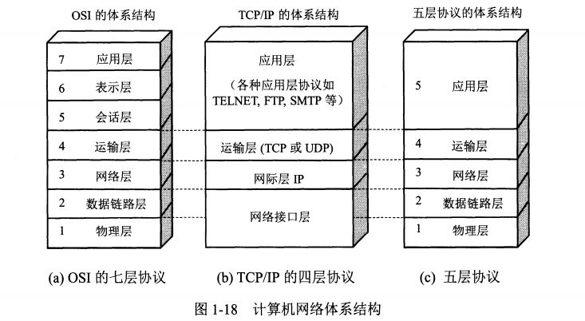

# 1.8计网性能指标

**速率**

- 比特（bit）是计算机中数据量的单位，也是信息论中使用的信息量的单位。
- Bit来源于binary digit，意思是一个“二进制数字”，因此一个比特就是二进制数字中的一个1或0.
- 速率即数据率（data rate）或比特率（bit rale）是计算机网络中最重要的一个性能指标。速率的单位是b/s,或kb/s，Mb/s，Gb/s等
- 速率往往是指额定速率或标称速率。

**带宽**

- “带宽”（bandwidth）本来是指信号具有的频带宽度，单位是赫（或千赫、兆赫、吉赫等）。
- 现在“带宽”是数字信道所能传送的“最高数据率”的同义语，单位是“比特每秒”，或b/s（bit/s）。

常用的带宽单位：

- 更常用的带宽单位是：

  千比每秒，即kb/s（10的三次方b/s）

  兆比每秒，即Mb/s（10的六次方b/s）

  吉比每秒，即Gb/s（10的九次方b/s）

  太比每秒，即Tb/s（10的十二次方b/s）

- 请注意：在计算机界，K=2的十次方 = 1024
- M = 2的二十次方，G = 2的三十次方，T = 2的四十次方。

**吞吐量**

- 吞吐量（throughput）表示在单位时间内通过某个网络（或信道、接口）的数据量。
- 吞吐量更经常地用于对现实世界中的网络的一种测量，以便知道实际上到底有多少数据量能够通过网络。
- 吞吐量受网络的带宽或网络的额定速率的限制。

**时延（delay 或latency）**

发送时延

- 发送时延   发送数据时，数据帧从结点进入到传输媒体所需要的时间。
- 也就是从发送数据帧的第一个比特算起，到该帧的最后一个比特发送完毕所需的时间。
- 发送时延 = 数据帧长度（b） /  发送速率（b/s）

传播时延

- 传播时延   电磁波在信道中需要传播一定的距离而花费的时间。
- 信号发送速率和信号在信道上的传播速率是完全不同的概念。
- 传播时延 = 信道长度（米） / 信号在信道上的传播速率（米/秒）

处理时延

- 处理时延  交换结点为存储转发而进行一些必要的处理所花费的时间。

排队时延

- 排队时延  结点缓存队列中分组排队所经历的时延。
- 排队时延的长短往往取决于网络中当时的通信量。

总时延

- 总时延  数据经历的总时延就是发送时延、传播时延、处理时延和排队时延之和；

**时延带宽积**

- 时延带宽积 = 传播时延 * 带宽
- 链路的时延带宽积又称为以比特为单位的链路长度。

**利用率**

- 信道利用率指出某信道有百分之几的时间是被利用的（有数据通过）。完全空闲的信道的利用率是零。
- 网络利用率则是全网络的信道利用率的加权平均值。
- 信道利用率并非越高越好。

时延与网络利用率的关系

- 根据排队论的理论，当某信道的利用率增大时，该信道引起的时延也就迅速增加。

- 若令D0表示网络空闲时的时延，D表示网络当前的时延，则在适当的假定条件下，可以用下面的简单公式表示D和D0之间的关系：D = D0 / （1- U）

  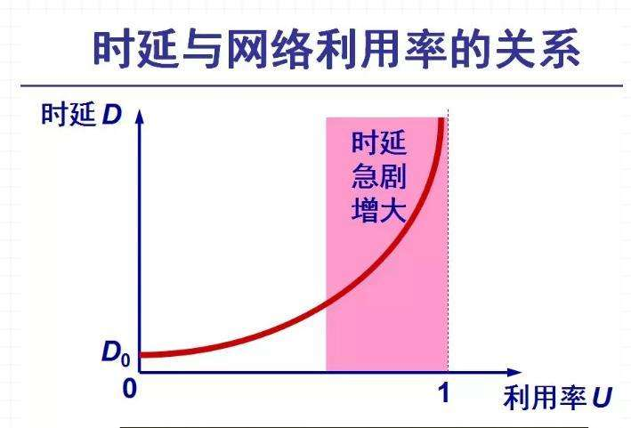

- U是网络的利用率，数值在0到1之间。

# 1.9计算机网络的非性能特征

- 费用
- 质量
- 标准化
- 可靠性
- 可扩展性和可升级性
- 易于管理和维护

# 2.1通信基础基本概念

在网络中，计算机输出的信号均为数字信号。

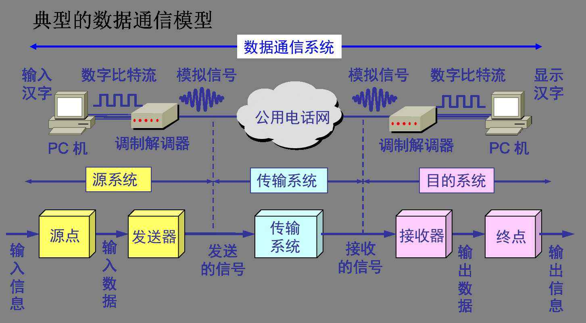

几个术语：

- 数据（data）——运送消息的实体。
- 信号（signal）——数据的电气的或电磁的表现。
- “模拟的”（analogous）——代表消息的参数的取值是连续的。
- “数字的”（digital）——代表消息的参数的取值是离散的。
- 码元（code）——在使用时间域（或简称为时域）的波形表示数字信号时，代表不同离散数值的基本波形。

在数字通信中常用时间间隔相同的符号来表示一个二进制数字，这样的时间间隔内的信号称为（二进制）码元。而这个间隔被称为码元长度。值得注意的是当码元的离散状态大于2个时（如M大于2）时，此时码元为M进制码元。

- 码元传播速率    单位时间内数字通信系统所传输的码元个数（也可称为脉冲个数或信号变化的次数），单位是波特（Baud）
- 信息传输速率  它表示单位时间内数字通信系统传输的二进制码元个数（即比特数），单位是比特/秒 （bit/s或b/s）
- 若一个码元携带n bit的信息量，则M Baud的码元传输速率所对应的信息传输速率为M*n bit/s。
- 带宽：最大比特率，单位是bit/s或b/s
- 单向通信（单工通信）——只能有一个方向的通信而没有反方向的交互。
- 双向交替通信（半双工通信）——通信的双方都可以发送信息，但不能双方同时发送（当然也就不能同时接收）。
- 双向同时通信（全双工通信）——通信的双方可以同时发送和接收信息。
- 信源——产生和发送数据的源头，也称为源站。
- 信宿——信息的归宿，一般是接受数据的终点，也称为目的站。
- 信道——传输数据的通道   可分为物理信道和逻辑信道。

# 2.2奈奎斯特定理和香农定理

信道能够通过的频率范围

- 奈奎斯特（Nyquist）就推导出了著名的奈氏准则。他给出了在假定的理想条件下，为了避免码间串扰，码元的传输速率的上限值。
- 极限码元传输速率 = 2W
- 因此，极限数据传输速率 = 2 W log以2为底的V   b/s
- W为信道的带宽（以Hz为单位），<font color="red">两个W单位是Baud</font>；
- V为每个码元离散电平的数目；
- 码元离散电平的数目 = 有多少种不同的码元 = 码元的有效值 = 一个码元包含的信息量


- 在任何信道中，码元传输的速率是有上限的，否则就会出现码间串扰的问题，使接收端对码元的判决（即识别）成为不可能。
- 如果信道的频带越宽，也就是能够通过的信号高频分量越多，那么就可以用更高的速率传送码元而不出现码间串扰。
- 对于频带宽度已确定的信道，如果信噪比不能再提高了，并且码元传输速率也达到了上限值，那么还有办法提高信息的传输速率。这就是用编码的方法让每一个码元携带更多比特的信息量。
- 任何实际的信道都不是理想的，在传输信号时会产生各种失真以及带来多种干扰。
- 码元传输的速率越高，或信号传输的距离越远，在信道的输出端的波形的失真就越严重。

**信噪比**

- 香农（Shannon）用信息论的理论推导出了带宽受限且有高斯白噪声干扰的信道的极限、无差错的信息传输速率。
- 信道的极限信息传输速率C可表达为：C = W log以2为底的（1 + S / N） b/s
- W为信道的带宽（以Hz为单位）；
- S为信道内所传信号的平均功率；
- N为信道内部的高斯噪声功率。
- 信噪比 = 10 log 以10为底的（S / N）

香农公式表明

- 信道的带宽或信道中的信噪比越大，则信息的极限传输速率就越高。
- 只要信息传输速率低于信道的极限信息传输速率，就一定可以找到某种办法来实现无差错的传输。
- 若信道带宽W或信噪比S/N没有上限（当然实际信道不可能是这样的），则信道的极限信息传输速率C也就没有上限。
- 实际信道上能够达到的信息传输速率要比香农的极限传输速率低不少。

# 2.3编码与调制

**基带信号和带通信号**

- 基带信号（即基本频带信号）——来自信源的信号。像计算机输出的代表各种文字或图像文件的数据信号都属于基带信号。
- 基带信号往往含有较多的低频成分，甚至有直流成分，而许多信道并不能传输这种低频分量或直流分量。因此必须对基带信号进行调制（modulation）。
- 带通信号——把基带信号经过载波调制后，把信号的频率范围搬移到较高的频段以便在信道中传输（即仅在一段频率范围内能够通过信道）。

**基本的调制方法**

- 基带信号往往包含较多的低频成分，甚至有直流成分，而许多信道并不能传输这种低频分量或直流分量。为了解决这一问题，就必须对基带信号进行调制（modulation).

- 最基本的二元制调制方法有以下几种：

  - 调幅（AM）：载波的振幅随基带数字信号而变化。

  - 调频（FM）：载波的频率随基带数字信号而变化。

  - 调相（PM）：载波的初始相位随基带数字信号而变化。

    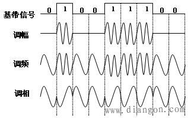

**正交振幅调制QAM（Quadrature Amplitude Modulation）**

设波特率为B，采用m个相位，每个相位有n种振幅，则该QAM技术的数据传输率R为：

R = B log以2为底的(m * n) （b/s）

若每一个码元可表示的比特数越多，则在接收端进行解调时要正确识别每一种状态就越困难。

**数字数据编码为数字信号**

- 把数据变换为模拟信号的过程称为调制，把数据变换为数字信号的过程为编码。

- 几种编码方式（数字数据编码为数字信号）

  - 非归零码（NRZ）是用两个电压来代表两个二进制数字，如用低电平表示0，高电平表示1；或者相反。
  - 曼彻斯特编码（Manchester Encoding）将一个码元分成两个相等的间隔，前一个间隔为低电平，后一个间隔为高电平表示码元1；码元0则正好相反。也可以采用相反的规定。（以太网就是用这种）
  - 差分曼彻斯特编码常用于局域网传输，其规则是：若码元为1，则前半个码元的电平与上一个码元的后半个码元的电平相同，若为0，则相反

  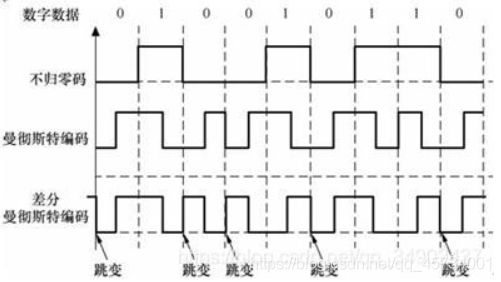

**模拟数据的编码与调制**

- 模拟数据编码为数字信号

  典型例子PCM，主要步骤：抽样、量化、编码

  采样定理：在通信领域带宽是指信号最高频率与最低频率之差。

- 模拟数据调制为模拟信号

# 2.4交换技术

**数据交换**

通常将数据在通信子网中各节点间的数据传输过程称为数据交换。

交换技术是采用交换机（或结点交换机）等交换系统，通过路由选择技术在进行通信的双方之间建立物理的/逻辑的连接，形成一条通信电路，实现通信双方的信息传输和交换的一种技术。

**网络分类**

按交换技术分类

- 电路交换网络
- 报文交换网络
- 分组交换网络

**电路交换**

- 两部电话机只需要用一对电线就能够互相连接起来。
- 从通信资源的分配角度来看，“交换”就是按照某种方式分配专用物理线路。
- 特点：
  - 电路交换必定是面向连接的。
  - 电路交换的三个阶段：
    - 建立连接
    - 通信
    - 释放连接

- 优点：
  - 由于通信线路为通信双方专用，数据直达，所以传输数据的时延非常小。
  - 通信双方之间的物理通路一旦建立，双方可以随时通信，实时性强。
  - 双方通信时按发送顺序传送数据，不存在失序问题。
  - 电路交换既适用于传输模拟信号，也适用于传输数字信号。
  - 电路交换的交换设备及控制均比较简单。
- 缺点：
  - 电路交换平均连接建立时间对计算机通信来说较长。
  - 电路交换建立连接后，物理通路被通信双方独占，即使通信线路空闲，也不能供其他用户使用，因而信道利用率低。
  - 电路交换时，数据直达、不同类型，不同规格，不同速率的终端很难相互进行通信，也难以在通信过程中进行差错控制。
  - 这种通信方式非常适合语音（如打电话）这种对实时性要求高的业务。但不适合数据通信业务，由于物理通路是被通信独占的，不能供其他用户使用，因而信道利用低。

**报文交换**

- 数据交换的单位是报文，报文携带有目的地址、源地址等信息。
- 报文交换在交换结点采用的是存储转发的传输方式（存储转发是不知道路线的）。

- 优点：
  - 报文交换不需要为通信双方预先建立一条专用的通信线路，不存在连接建立时延，用户可随时发送报文。
  - 由于采用存储转发的传输方式，使之具有下列优点：
    - 在报文交换中便于设置代码校验和数据重发设施，加之交换结点还具有路径选择，就可以做到某条传输路径发送故障时，重新选择另一条路径传输数据，提高了传输的可靠性；
    - 在存储转发中容易实现代码转换和速率匹配，便于类型、规格和速度不同的计算机之间进行通信；
    - 提供多目标服务，即一个报文可以同时发送到多个目的地址
    - 允许建立数据传输的优先级，使优先级高的报文优先转换
  - 通信双方不是固定占有一条通信线路，而是在不同的时间一段一段地部分占有这条物理通路，因而大大提高了通信线路的利用率。
- 缺点：
  - 由于数据进入交换结点后要经历存储、转发这一过程，从而引起转发时延（包括接收报文、检验正确性、排队、发送时间等），而且网络的通信量愈大，造成的时延就愈大，因此报文交换的实时性差，不适合传送实时或交互式业务的数据
  - 报文交互只适用于数字信号。
  - 由于报文长度没有限制，而每个中间结点都要完整地接收传来的整个报文，增加了传送时延。

**分组交换**

- 同报文交换一样，分组交换也采用了存储转发方式，但解决了报文交换中大报文传输的问题。
- 分组交换限制了每次传送的数据块大小的上限，把大的数据划分为合理的小数据块
- 再加上一些必要的控制信息（如源地址、目的地址和编号信息等），构成分组。
- 优点：
  - 因为分组是逐个传输，可以使后一个分组的存储操作与前一个分组的转发操作并行，这种流水线式传输方式减少了传输时间。
  - 分组长度固定，相应的缓冲区的大小也固定，所以交换节点中对存储器的管理被简化为对缓冲区的管理，相对比较容易。
  - 分组较短，出错几率减少，每次重发的数据量也减少，不仅提高了可靠性，也减少了时延。

- 缺点：
  - 尽管分组交换比报文交换的传输时延少，但仍存在存储转发时延，而且其结点交换机必须具有更强的处理能力。
  - 分组交换与报文交换一样，每个分组都要加上源、目的地址和分组编号等信息，使传送的信息量大约增大5%-10%，一定程度上降低了通信效率，增加了处理的时间，使控制复杂，时延增加。
  - 当分组交换采用数据报服务时，可能出现失序、丢失、或重复分组，分组到达目的结点时，要对分组按编号进行排序等工作，增加了麻烦。

添加首部构成分组

- 每一个数据段前面添加上首部构成分组

分组交换的传输单元

- 分组交换网以“分组”作为数据传输单元。
- 依次把各分组发送到接收端（假定接收端在左边）。

**三种交换的比较**

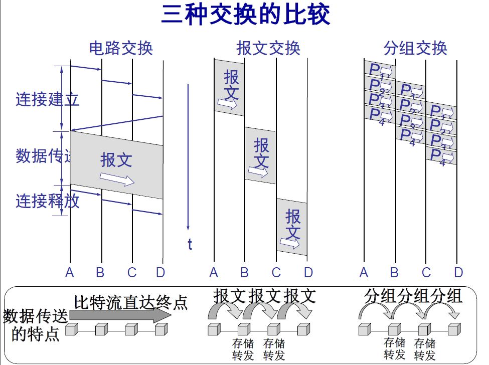

**分组交换的实现**

1. 数据报（Datagram）：无连接的数据传输，工作过程类似于报文交换。采用数据报方式传输时，被传输的分组称为数据报。当一对站点之间需要传输多个数据报时，由于每个数据报均被独立地传输和路由，因此在网络中可能会走不同的路径，具有不同的时间延迟，按序发送的多个数据报可能以不同的顺序达到终点，但多数都是同顺序的，所以UDP并不对其数据报进行排序，以提高传输速度。
2. 虚电路（Virtual Circuit）：虚电路是面向连接的数据传输，工作过程类似于电路交换，不同之处在于此时的电路是虚拟的。它的传输路径是确定的（但不一直占有，按照确定的传输路径，从一个节点到下一个节点不断的储存转发，直到目的地为止），不存在路由选择和数据包排序的问题。但是需要建立呼叫请求建立线路，由于虚电路的建立和释放需要占用一定的时间，因此虚电路方式不适合站点之间具有频繁连接和交换短小数据的应用。

|                    | 虚电路服务                                     | 数据报服务                                         |
| ------------------ | ---------------------------------------------- | -------------------------------------------------- |
| 思路               | 可靠通信应当由网络来保证                       | 可靠通讯应当由用户主机来保证                       |
| 连接的建立         | 必须有                                         | 不需要                                             |
| 终地址             | 仅在连接建立阶段使用，每个分组使用短的虚电路号 | 每个分组都有终点的完整地址                         |
| 分组的转发         | 属于同一条虚电路的分组均按照同一路由进行转发   | 每个分组独立选择路由进行转发                       |
| 当结点出故障时     | 所有通过出故障的结点的虚电路均不能工作         | 出故障的结点可能会丢失分组，一些路由可能会发生变化 |
| 分组的顺序         | 总是按发送顺序到达终点                         | 到达终点时不一定按发送顺序                         |
| 差错处理和流量控制 | 由网络负责，也可以由用户主机负责               | 由用户主机负责                                     |

# 2.5传输介质

**物理层的基本特性**

物理层的主要任务描述为确定与传输媒体的接口的一些特性，即：

- 机械特性 	指明接口所用接线器的形状和尺寸、引线数目和排列、固定和锁定装置等等。
- 电器特性	指明在接口电缆的各条线上出现的电压的范围。
- 功能特性	指明某条线上出现的某一电平的电压表示何种意义。
- 过程特性	指明对于不同功能的各种可能事件的出现顺序。

**物理层下面的传输媒体**

​	 

**导引型传输媒体**

- 双绞线

  - 屏蔽双绞线STP（Shielded Twisted Pair）
  - 无屏蔽双绞线UTP（Unshielded Twisted Pair）

  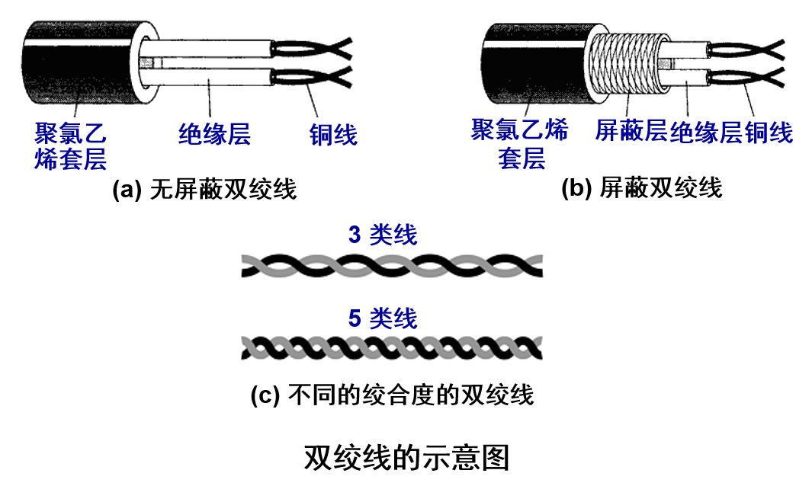

- 同轴电缆

  - 50Ω同轴电缆
  - 75Ω同轴电缆（宽带同轴电缆）

  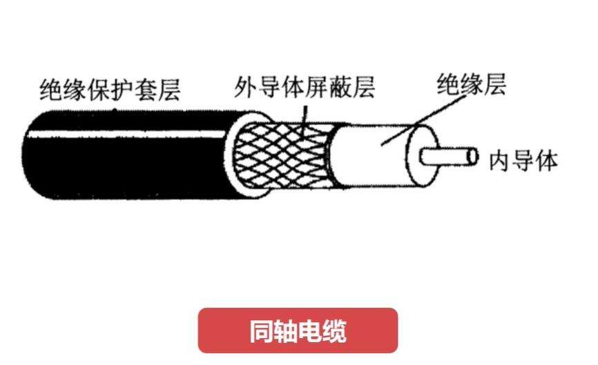

- 光纤

**无线传输介质**

1. 无线电波
2. 微波、红外线和激光

# 2.6物理层设备

- 中继器：又称为转发器，主要功能是将信号整型并放大再转发出去，以消除信号由于经过一长段电缆，因噪声或其他原因而造成的失真和衰减，使信号的波形和强度达到所需要的要求，来扩大网络传输的距离。

- 主机使用光纤和一对光纤调制解调器连接到集线器

- 这种以太网采用星形拓扑，在星形的中心则增加了一种可靠性非常高的设备，叫做集线器（hub）

  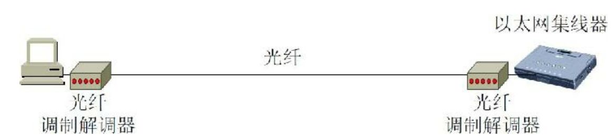

**用集线器扩展局域网**

优点：

1. 使原来属于不同碰撞域的局域网上的计算机能够进行跨碰撞域的通信。
2. 扩大了局域网覆盖的地理范围。

缺点：

1. 碰撞域增大了，但总的吞吐量并未提高。
2. 如果不同的碰撞域使用不同的数据率，那么就不能用集线器（多端口的中继器）将它们互连起来。

# 第1章 计算机网络基础篇

要摸清网络，那么第一步肯定是要清楚网络协议的分层结构，看分层结构相当于从上帝视角来看网络，这样后续针对每一个层深入学习就不会摸不着头脑。


对于同一台设备上的进程间通信，有很多种方式，比如有管道、消息队列、共享内存、信号等方式，而对于不同设备上的进程间通信，就需要网络通信，而设备是多样性的，所以要兼容多种多样的设备，就协商出了一套**通用的网络协议**。

## OSI 标准模型

OSI(Open System Interconnect),即开放式系统互联。

互联⽹的通信协议都对应了 7 层中的某⼀层，通过这⼀点，可以了解协议在整个⽹络模型中的作⽤，⼀般来说，各个分层的主要作⽤如下


**应⽤层** ：应⽤层是 OSI 标准模型的最顶层，是直接为应⽤进程提供服务的。其作⽤是在实现多个系统应⽤进

程相互通信的同时，完成⼀系列业务处理所需的服务。包括⽂件传输、电⼦邮件远程登录和远端接⼝调⽤等

协议。


**表示层** : 表示层向上对应⽤进程服务，向下接收会话层提供的服务，表示层位于 OSI 标准模型的第六层，表

示层的主要作⽤就是将设备的固有数据格式转换为⽹络标准传输格式。


**会话层** ：会话层位于 OSI 标准模型的第五层，它是建⽴在传输层之上，利⽤传输层提供的服务建⽴和维持会

话。


**传输层** ：传输层位于 OSI 标准模型的第四层，它在整个 OSI 标准模型中起到了⾄关重要的作⽤。传输层涉

及到两个节点之间的数据传输，向上层提供可靠的数据传输服务。传输层的服务⼀般要经历传输连接建⽴阶

段，数据传输阶段，传输连接释放阶段 3 个阶段才算完成⼀个完整的服务过程。


**⽹络层** ：⽹络层位于 OSI 标准模型的第三层，它位于传输层和数据链路层的中间，将数据设法从源端经过若

⼲个中间节点传送到另⼀端，从⽽向运输层提供最基本的端到端的数据传送服务。


**数据链路层** ：数据链路层位于物理层和⽹络层中间，数据链路层定义了在单个链路上如何传输数据。


**物理层** ：物理层是 OSI 标准模型中最低的⼀层，物理层是整个 OSI 协议的基础，就如同房屋的地基⼀样，

物理层为设备之间的数据通信提供传输媒体及互连设备，为数据传输提供可靠的环境。

## TCP/IP ⽹络模型

TCP/IP网络协议通常是由上到下，分成 5 层，分别是应用层、传输层、网络层、数据链路层和物理层。

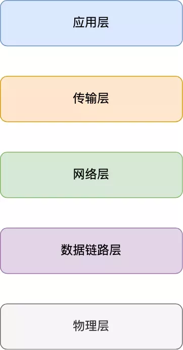

这个网络协议是分层的，每一层都有各自的作用和职责，接下来就分别对每一层进行介绍。

## 应用层

最上层的，也是我们能直接接触到的就是**应用层**（*Application Layer*），我们电脑或手机使用的应用软件都是在应用层实现。那么，当两个不同设备的应用需要通信的时候，应用就把应用数据传给下一层，也就是传输层。


所以，应用层只需要专注于为用户提供应用功能，不用去关心数据是如何传输的，就类似于，我们寄快递的时候，只需要把包裹交给快递员，由他负责运输快递，我们不需要关心快速是如何被运输的。


而且应用层是工作在操作系统中的用户态，传输层及以下则工作在内核态。

## 传输层

应用层的数据包会传给传输层，**传输层**（**Transport Layer**）是为应用层提供网络支持的。


在传输层会有两个传输协议，分别是 TCP 和 UDP。

TCP 的全称叫传输层控制协议（*Transmission Control Protocol*），大部分应用使用的正是 TCP 传输层协议，比如 HTTP 应用层协议。TCP 相比 UDP 多了很多特性，比如流量控制、超时重传、拥塞控制等，这些都是为了保证数据包能可靠地传输给对方。 


UDP 就相对很简单，简单到只负责发送数据包，不保证数据包是否能抵达对方，但它实时性相对更好，传输效率也高。当然，UDP 也可以实现可靠传输，把 TCP 的特性在应用层上实现就可以，不过要实现一个商用的可靠 UDP 传输协议，也不是一件简单的事情。


应用需要传输的数据可能会非常大，如果直接传输就不好控制，因此当传输层的数据包大小超过 MSS（TCP 最大报文段长度） ，就要将数据包分块，这样即使中途有一个分块丢失或损坏了，只需要重新这一个分块，而不用重新发送整个数据包。在 TCP 协议中，我们把每个分块称为一个 **TCP 段**（*TCP Segment*）。


当设备作为接收方时，传输层则要负责把数据包传给应用，但是一台设备上可能会有很多应用在接收或者传输数据，因此需要用一个编号将应用区分开来，这个编号就是**端口**。


比如 80 端口通常是 Web 服务器用的，22 端口通常是远程登录服务器用的。而对于浏览器（客户端）中的每个标签栏都是一个独立的进程，操作系统会为这些进程分配临时的端口号。


由于传输层的报文中会携带端口号，因此接收方可以识别出该报文是发送给哪个应用。

## 网络层

网络层的主要任务是实现网络互连，进而实现数据包在各网络之间的传输。


传输层可能大家刚接触的时候，会认为它负责将数据从一个设备传输到另一个设备，事实上它并不负责。


实际场景中的网络环节是错综复杂的，中间有各种各样的线路和分叉路口，如果一个设备的数据要传输给另一个设备，就需要在各种各样的路径和节点进行选择，而传输层的设计理念是简单、高效、专注，如果传输层还负责这一块功能就有点违背设计原则了。


也就是说，我们不希望传输层协议处理太多的事情，只需要服务好应用即可，让其作为应用间数据传输的媒介，帮助实现应用到应用的通信，而实际的传输功能就交给下一层，也就是**网络层**（*Internet Layer*）。


网络层最常使用的是 IP 协议（*Internet Protocol*），IP 协议会将传输层的报文作为数据部分，再加上 IP 包头组装成 IP 报文，如果 IP 报文大小超过 MTU（以太网中一般为 1500 字节）就会**再次进行分片**，得到一个即将发送到网络的 IP 报文。

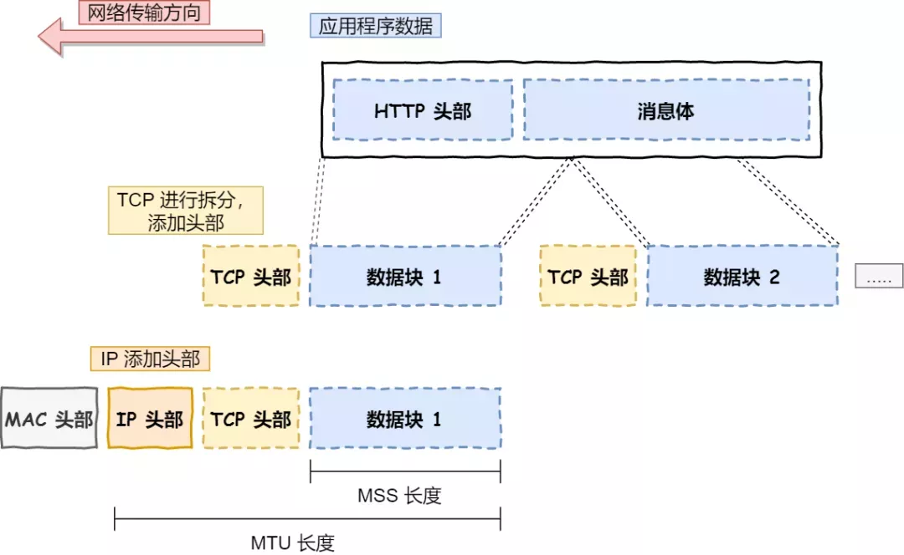

网络层负责将数据从一个设备传输到另一个设备，世界上那么多设备，又该如何找到对方呢？因此，网络层需要有区分设备的编号。


我们一般用 IP 地址给设备进行编号，对于 IPv4 协议， IP 地址共 32 位，分成了四段，每段是 8 位。只有一个单纯的 IP 地址虽然做到了区分设备，但是寻址起来就特别麻烦，全世界那么多台设备，难道一个一个去匹配？这显然不科学。


因此，需要将 IP 地址分成两种意义：

- 一个是**网络号**，负责标识该 IP 地址是属于哪个子网的；
- 一个是**主机号**，负责标识同一子网下的不同主机；


怎么分的呢？这需要配合**子网掩码**才能算出 IP 地址 的网络号和主机号。那么在寻址的过程中，先匹配到相同的网络号，才会去找对应的主机。

除了寻址能力， IP 协议还有另一个重要的能力就是**路由**。实际场景中，两台设备并不是用一条网线连接起来的，而是通过很多网关、路由器、交换机等众多网络设备连接起来的，那么就会形成很多条网络的路径，因此当数据包到达一个网络节点，就需要通过算法决定下一步走哪条路径。


所以，**IP 协议的寻址作用是告诉我们去往下一个目的地该朝哪个方向走，路由则是根据「下一个目的地」选择路径。寻址更像在导航，路由更像在操作方向盘**。

## 数据链路层

实际场景中，网络并不是一个整体，比如你家和我家就不属于一个网络，所以数据不仅可以在同一个网络中设备间进行传输，也可以跨网络进行传输。


一旦数据需要跨网络传输，就需要有一个设备同时在两个网络当中，这个设备一般是路由器，路由器可以通过路由表计算出下一个要去的 IP 地址。


那问题来了，路由器怎么知道这个 IP 地址是哪个设备的呢？

于是，就需要有一个专门的层来标识网络中的设备，让数据在一个链路中传输，这就是**数据链路层**（*Data Link Layer*），它主要为网络层提供链路级别传输的服务。

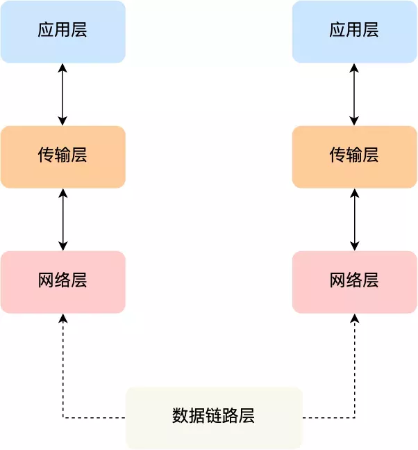

每一台设备的网卡都会有一个 MAC 地址，它就是用来唯一标识设备的。路由器计算出了下一个目的地 IP 地址，再通过 ARP 协议找到该目的地的 MAC 地址，这样就知道这个 IP 地址是哪个设备的了。


链路：就是从一个节点到相邻节点的一段物理线路，而中间没有任何其他的交换节点。

数据链路：就是吧实现通信协议的硬件和软件加到链路上，就构成了数据链路。

数据链路层以帧为单位传输和处理数据。

## 物理层

当数据准备要从设备发送到网络时，需要把数据包转换成电信号，让其可以在物理介质中传输，这一层就是**物理层**（*Physical Layer*），它主要是为数据链路层提供二进制传输的服务。


物理层考虑的是怎样才能在连接各种计算机的传输媒体上传输数据比特流


物理层为数据链路层屏蔽了各种传输媒体的差异，是数据链路层只需要考虑如何完成本层的协议和服务，而不必考虑网络具体的传输媒体是什么


### 物理媒介

⽹络的传输是需要介质的。⼀个⽐特数据包从⼀个端系统开始传输，经过⼀系列的链路和路由器，从⽽到达另外⼀个端系统。这个⽐特会被转发了很多次，那么这个⽐特经过传输的过程所跨越的媒介就被称为 物理媒介(phhysical medium) ，物理媒介有很多种，⽐如双绞铜线、同轴电缆、多模光纤榄、陆地⽆线电频谱和卫星⽆线电频谱。其实⼤致分为两种：引导性媒介和⾮引导性媒介。

**双绞铜线**

最便宜且最常⽤的引导性传输媒介就是 双绞铜线 ，多年以来，它⼀直应⽤于电话⽹。从电话机到本地电话交换机的连线超过 99% 都是使⽤的双绞铜线，例如下⾯就是双绞铜线的实物图


双绞铜线由两根绝缘的铜线组成，每根⼤约 1cm 粗，以规则的螺旋形状排列，通常许多双绞线捆扎在⼀起形成电缆，并在双绞馅的外⾯套上保护层。⼀对电缆构成了⼀个通信链路。 ⽆屏蔽双绞线 ⼀般常⽤在局域⽹（LAN）中。


**同轴电缆**

与双绞线类似，同轴电缆也是由两个铜导体组成，下⾯是实物图

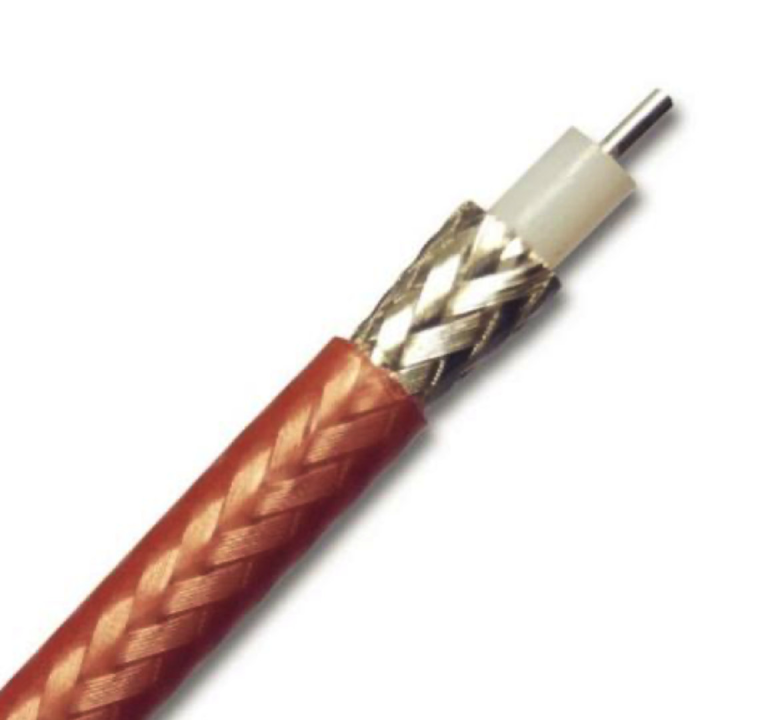

借助于这种结构以及特殊的绝缘体和保护层，同轴电缆能够达到较⾼的传输速率，同轴电缆普遍应⽤在在电缆电视系统中。同轴电缆常被⽤户引导型共享媒介。


**光纤**

光纤是⼀种细⽽柔软的、能够引导光脉冲的媒介，每个脉冲表示⼀个⽐特。⼀根光纤能够⽀持极⾼的⽐特率，⾼达数⼗甚⾄数百 Gbps。它们不受电磁⼲扰。光纤是⼀种引导型物理媒介，下⾯是光纤的实物图

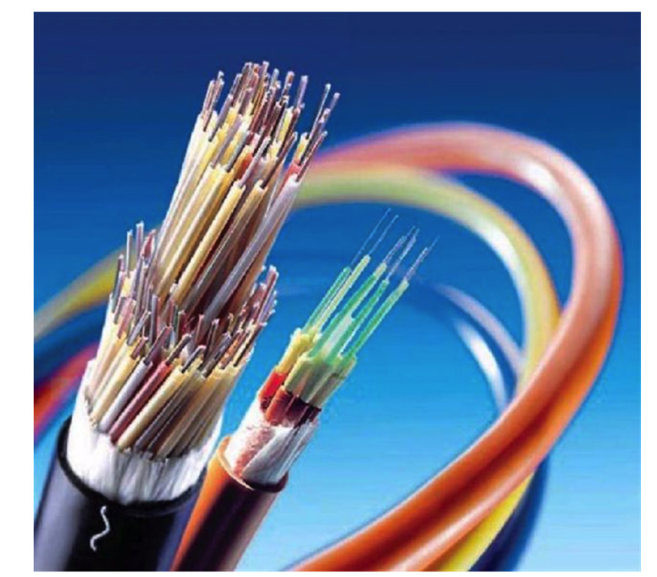

⼀般⻓途电话⽹络全⾯使⽤光纤，光纤也⼴泛应⽤于因特⽹的主⼲。


**陆地⽆线电信道**

⽆线电信道承载电磁频谱中的信号。它不需要安装物理线路，并具有穿透墙壁、提供与移动⽤户的连接以及⻓距离承载信号的能⼒。


**卫星⽆线电信道**

⼀颗卫星电信道连接地球上的两个或多个微博发射器/接收器，它们称为地⾯站。通信中经常使⽤两类卫星：同步卫星和近地卫星。

# 第2章 计算机网络之HTTP

应用层：解决通过应用进程的交互来实现特定网络应用的问题。


我们在浏览器的地址中输入某个网站的域名后，就可以访问该网站的内容，这个就是**万维网WWW应用**，其相关的应用层协议为**超文本传送协议HTTP**

## HTTP基本概念

HTTP 是超文本传输协议，也就是**H**yperText **T**ransfer **P**rotocol。

HTTP的名字「超文本协议传输」，它可以拆成三个部分：

- 超文本
- 传输

- 协议

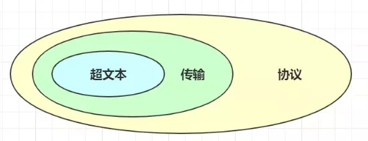

### 1. 「协议」

在生活中，我们也能随处可见「协议」，例如：

- 刚毕业时会签一个「三方协议」；
- 找房子时会签一个「租房协议」；

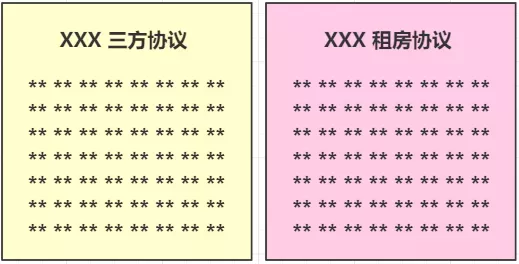

生活中的协议，本质上与计算机中的协议是相同的，协议的特点:

- 「**协**」字，代表的意思是必须有**两个以上的参与者**。例如三方协议里的参与者有三个：你、公司、学校三个；租房协议里的参与者有两个：你和房东。
- 「**仪**」字，代表的意思是对参与者的一种**行为约定和规范**。例如三方协议里规定试用期期限、毁约金等；租房协议里规定租期期限、每月租金金额、违约如何处理等。

针对 HTTP **协议**，我们可以这么理解。

HTTP 是一个用在计算机世界里的**协议**。它使用计算机能够理解的语言确立了一种计算机之间交流通信的规范（**两个以上的参与者**），以及相关的各种控制和错误处理方式（**行为约定和规范**）。

### 2. 「传输」

所谓的「传输」，很好理解，就是把一堆东西从 A 点搬到 B 点，或者从 B 点 搬到 A 点。

别轻视了这个简单的动作，它至少包含两项重要的信息。

HTTP 协议是一个**双向协议**。

我们在上网冲浪时，浏览器是请求方 A ，百度网站就是应答方 B。双方约定用 HTTP 协议来通信，于是浏览器把请求数据发送给网站，网站再把一些数据返回给浏览器，最后由浏览器渲染在屏幕，就可以看到图片、视频了。

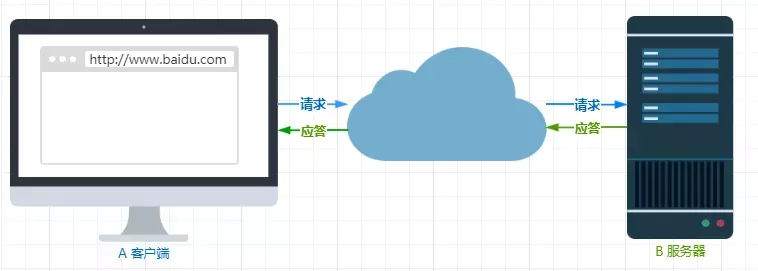

数据虽然是在 A 和 B 之间传输，但允许中间有**中转或接力**。

就好像第一排的同学想穿递纸条给最后一排的同学，那么传递的过程中就需要经过好多个同学（中间人），这样的传输方式就从「A < --- > B」，变成了「A <-> N <-> M <-> B」。


而在 HTTP 里，需要中间人遵从 HTTP 协议，只要不打扰基本的数据传输，就可以添加任意额外的东西。

针对**传输**，我们可以进一步理解了 HTTP。

HTTP 是一个在计算机世界里专门用来在**两点之间传输数据**的约定和规范。

### 3. 「超文本」

HTTP 传输的内容是「超文本」。

我们先来理解「文本」，在互联网早期的时候只是简单的字符文字，但现在「文本」。的涵义已经可以扩展为图片、视频、压缩包等，在 HTTP 眼里这些都算做「文本」。

再来理解「超文本」，它就是**超越了普通文本的文本**，它是文字、图片、视频等的混合体最关键有超链接，能从一个超文本跳转到另外一个超文本。

HTML 就是最常见的超文本了，它本身只是纯文字文件，但内部用很多标签定义了图片、视频等的链接，在经过浏览器的解释，呈现给我们的就是一个文字、有画面的网页了。

OK，经过了对 HTTP 里这三个名词的详细解释，就可以给出比「超文本传输协议」这七个字更准确更有技术含量的答案：

**HTTP 是一个在计算机世界里专门在「两点」之间「传输」文字、图片、音频、视频等「超文本」数据的「约定和规范」。**

## HTTP 请求响应过程

让我们通过⼀个例⼦来探讨⼀下 HTTP 的请求响应过程，我们假设访问的 URL 地址为

http://www.someSchool.edu/someDepartment/home.index ，当我们输⼊⽹址并点击回⻋时，浏览器内部会

进⾏如下操作

- DNS服务器会⾸先进⾏域名的映射，找到访问 www.someSchool.edu 所在的地址，然后HTTP 客户端进程在80 端⼝发起⼀个到服务器  www.someSchool.edu 的 TCP 连接（80 端⼝是 HTTP 的默认端⼝）。在客户和服务器进程中都会有⼀个 套接字 与其相连。


- HTTP 客户端通过它的套接字向服务器发送⼀个 HTTP 请求报⽂。该报⽂中包含了路径someDepartment/home.index 的资源，我们后⾯会详细讨论 HTTP 请求报⽂。


- HTTP 服务器通过它的套接字接收该报⽂，进⾏请求的解析⼯作，并从其 存储器(RAM 或磁盘) 中检索出对象www.someSchool.edu/someDepartment/home.index，然后把检索出来的对象进⾏封装，封装到 HTTP响应报⽂中，并通过套接字向客户进⾏发送。


- HTTP 服务器随即通知 TCP 断开 TCP 连接，实际上是需要等到客户接受完响应报⽂后才会断开 TCP 连接。


- HTTP 客户端接受完响应报⽂后，TCP 连接会关闭。客户端会从报⽂中提取响应⽂件，并检查该 HTML ⽂件，然后循环检查报⽂中其他内部对象。


- 检查完成后，HTTP 客户端会把对应的资源通过显示器呈现给⽤户。


⾄此，键⼊⽹址再按下回⻋的全过程就结束了。上述过程描述的是⼀种简单的 请求-响应 全过程，真实的请求-响应情况可能要⽐上⾯描述的过程复杂很多。

## HTTP 请求特征

HTTP 最凸出的优点是「简单、灵活和易于扩展、应⽤⼴泛和跨平台」。

1. 简单

HTTP 基本的报⽂格式就是 header + body ，头部信息也是 key-value 简单⽂本的形式，易于理解，降低了学习和使⽤的⻔槛。

2. 灵活和易于扩展

HTTP协议⾥的各类请求⽅法、URI/URL、状态码、头字段等每个组成要求都没有被固定死，都允许开发⼈员⾃定义和扩充。

同时 HTTP 由于是⼯作在应⽤层（ OSI 第七层），则它下层可以随意变化。

HTTPS 也就是在 HTTP 与 TCP 层之间增加了 SSL/TLS 安全传输层，HTTP/3 甚⾄把 TCP 层换成了基于 UDP 的QUIC。

3. 应⽤⼴泛和跨平台

互联⽹发展⾄今，HTTP 的应⽤范围⾮常的⼴泛，从台式机的浏览器到⼿机上的各种 APP，从看新闻、刷贴吧到购物、理财、吃鸡，HTTP 的应⽤⽚地开花，同时天然具有跨平台的优越性。

## 持久性连接和⾮持久性连接

我们上⾯描述的 HTTP 请求响应过程就是⼀种 ⾮持久连接 ，因为每次 TCP 在传递完报⽂后，都会关闭 TCP 连接，每个 TCP 连接只传输⼀个请求报⽂和响应报⽂。

**⾮持久性连接**有⼀些 缺点 。

第⼀，必须为每个请求的对象建⽴和维护⼀个全新的连接。

第⼆，对于每个这样的连接来说，在客户端和服务器中都要分配 TCP 的缓冲区和保持 TCP 变量，这给 Web

服务器带来了严重的负担。因为⼀台 Web 服务器可能要同时服务于数百甚⾄上千个客户请求。


早期 HTTP/1.0 性能上的⼀个很⼤的问题，那就是每发起⼀个请求，都要新建⼀次 TCP 连接（三次握⼿），⽽且是串⾏请求，做了⽆谓的 TCP 连接建⽴和断开，增加了通信开销。


为了解决上述 TCP 连接问题，HTTP/1.1 提出了⻓连接的通信⽅式，也叫**持久连接**。这种⽅式的好处在于减少了TCP 连接的重复建⽴和断开所造成的额外开销，减轻了服务器端的负载。

持久连接的特点是，只要任意⼀端没有明确提出断开连接，则保持 TCP 连接状态。

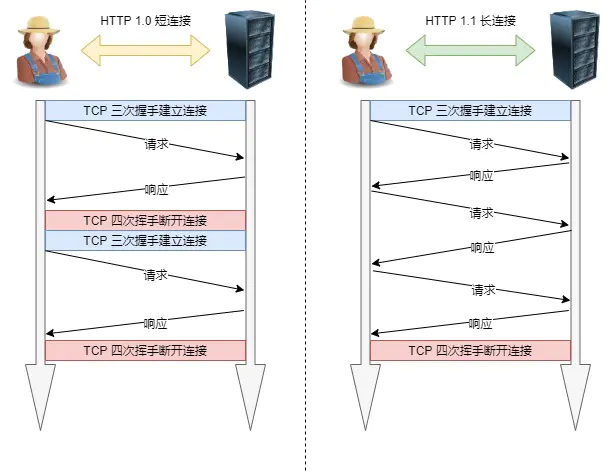

## HTTP 报⽂格式

我们上⾯描述了⼀下 HTTP 的请求响应过程，相信你对 HTTP 有了更深的认识，下⾯我们就来⼀起认识⼀下 HTTP

的报⽂格式是怎样的。

HTTP 协议主要由三⼤部分组成：

起始⾏（start line） ：描述请求或响应的基本信息；

头部字段（header） ：使⽤ key-value 形式更详细地说明报⽂；

消息正⽂（entity） ：实际传输的数据，它不⼀定是纯⽂本，可以是图⽚、视频等⼆进制数据。

其中起始⾏和头部字段并成为  请求头 或者  响应头 ，统称为  Header ；消息正⽂也叫做实体，称为  body 。

HTTP 协议规定每次发送的报⽂必须要有 Header，但是可以没有 body，也就是说头信息是必须的，实体信息可以没有。⽽且在 header 和 body 之间必须要有⼀个空⾏（CRLF）。

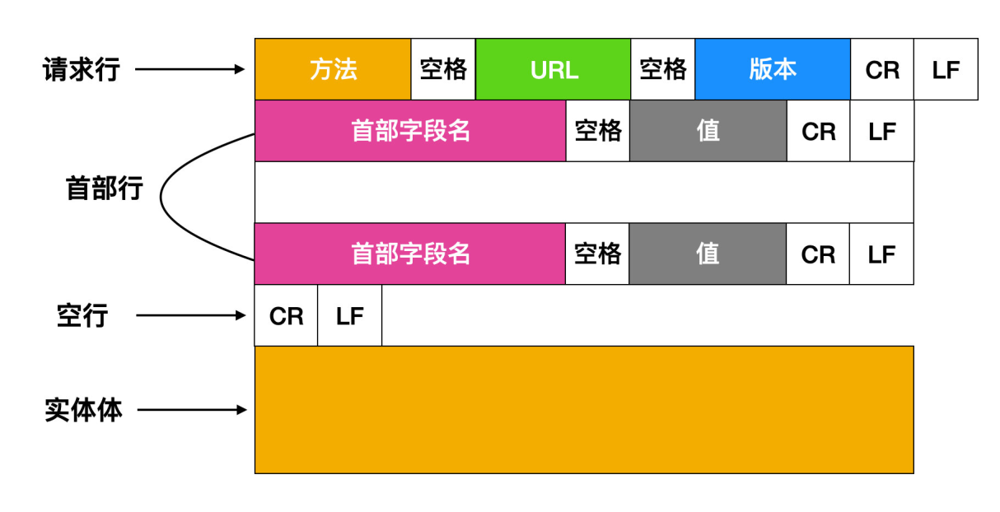

这幅图需要注意⼀下，如果使⽤  GET ⽅法，是没有实体体的，如果你使⽤的是  POST ⽅法，才会有实体体。当⽤户提交表单时，HTTP 客户端通常使⽤ POST ⽅法；与此相反，HTML 表单的获取通常使⽤ GET ⽅法。HEAD⽅法类似于 GET ⽅法，只不过 HEAD ⽅法不会返回对象。


下⾯我们来看⼀下 HTTP 响应报⽂

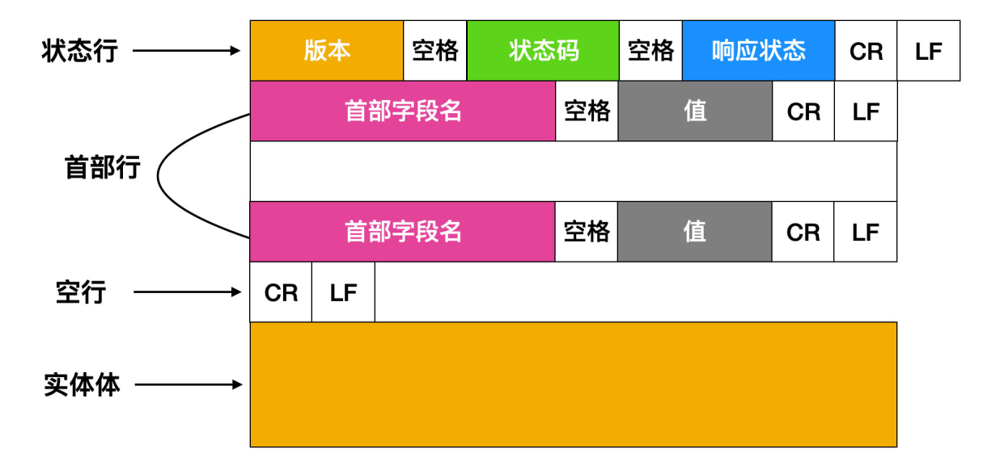

可以看到，请求报⽂和响应报⽂只有请求头是不同的，其他信息均⼀致。

请求报⽂请求⾏：

```
GET /some/page.html HTTP/1.1 
```

响应报⽂：

```
HTTP/1.1 200 OK 
```

# **第3章 计算机网络之TCP**

1. TCP(Transmission Control Protocol，传输控制协议) 是一种面向连接的、可靠的、基于字节流的通信协议，数据在传输前建立连接，传输完毕后还要断开连接。
2. 客户端在收发数据前要使用connect()函数和服务器建立连接。建立连接的目的是保证IP地址、端口、物理链路等正确无误，为数据的传输开辟通道。
3. TCP建立连接时要传输三个数据包，俗称三次握手（Three-way Handshaking）

TCP数据报结构如下：

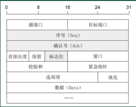

①序号：Seq(Sequence Number) 序号占32位，用来标识从计算机A发送到计算机B的数据包的序号，计算机发送数据时对此进行标记。

②确认号：Ack(Acknowledge Number) 确认号占32位，客户端和服务端都可以发送，Ack = Seq + 1.

③标志位：每个标志位占用1Bit，共有6个，分别为URG、ACK、PSH、RST、SYN、FIN，具体含义如下：

URG：紧急指针有效。

ACK：确认序号有效。

PSH：接收方应该尽快将这个报文交给应用层。

RST：重置连接。

SYN：建立一个新连接。

FIN：断开一个连接。

## **三次握手过程**

（1）客户端发送的第一个数据包是一个连接请求报文段，这个报文的内容如图，是一个同步位SYN=1，另一个是一个初始序号seq=x（随机产生一个序号）。TCP规定，SYN=1的报文段不能携带数据，但是消耗一个序列号。客户端发送了这个报文之后，进入SYN-SENT（同步已发送）状态。SYN是请求报文标志。

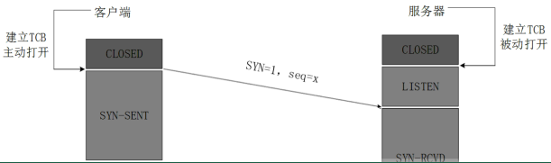

（2）服务端已收到这个数据包之后，知道有客户端请求连接。如果当前有资源，可以同意连接，则给客户端发送确认报文。这个确认报文的内容有：SYN=1（没有变化），seq=y（变成了服务端的序列号，随机产生），新增ACK=1，ack=x+1（客户端序号+1）。这里SYN=1，所以报文不能携带数据，同样消耗了服务端的一个序列号。然后服务端进入了SYN-RCVD（同步收到）状态。ACK是应答报文标志。

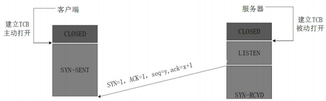

（3）客户端收到服务端的确认报文之后，还需要给服务端发送一个客户端的确认报文。这个报文的内容是ACK=1，seq=x+1，ack=y+1。这里没有了SYN这个字段，所以这个报文可以携带数据。这个客户端确认报文发送出去之后，客户端进入ESTAB LISHED(已建立连接)状态。服务端接收到这个数据包之后，也进入了ESTAB LISHED（已建立连接）状态。

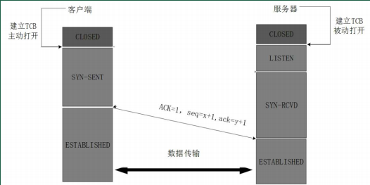

整个过程：

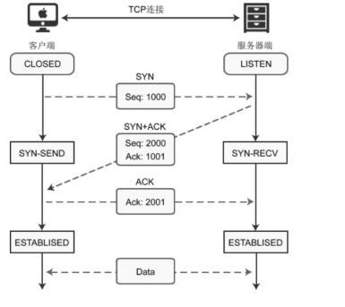

为什么是三次握手？

1. 三次握手才可以阻止重复历史连接的初始化（主要原因）
2. 三次握手才可以同步双方的初始序列号
3. 三次握手才可以避免资源浪费

## **四次挥手**

建立连接非常重要，它是数据正确传输的前提；断开连接同样重要，它让计算机释放不再使用的资源。如果连接不能正常断开，不仅会造成数据传输错误，还会导致套接字不能关闭，持续占用资源，如果并发量高，服务器压力堪忧。

四次挥手过程：

（1）客户端数据发送完毕，想要结束连接了，主动发出连接释放请求数据包。这个数据包内容：Fin=1，seq=u（这个u是这个数据包之前一个数据包的序列号+1），客户端进入FIN-WAIT-1(终止等待1)状态，不在发送数据包，等待服务端的确认。

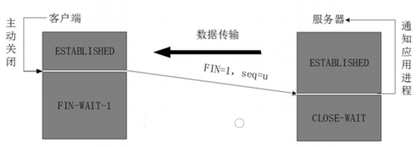

（2）服务端接收到释放数据包之后发出确认，确认包中内容：确认号ack=u+1，序列号seq=v（这个v是服务端上一个发送的数据包的序列号+1），另一个是ACK=1。然后服务端进入CLOSE-WAIT（关闭等待）。这个时候客户端到服务端的连接已经结束了。但是TCP是全双工通信，因为这个时候是客户端主动发起的结束，在服务端这边可能还存在着数据没有完全发送给客户端，所以服务端到客户端仍然没有结束。客户端已经不能再发送数据了，如果服务端还有数据发送过来，客户端仍然要接收。


（3）客户端收到服务端的确认之后，进入FIN-2(终止等待2)状态，等待服务端发送服务端发起的连接释放数据包。这时候服务端可能还有一些数据包要发送给客户端，客户端一一接收。最后，没有数据要发送了之后，服务端发送连接释放数据包，这个数据包内容：FIN=1，ACK=1，seq=w（因为在服务端回复客户端的连接请求（数据包的序列号是v）之后，可能仍然有其他数据包要发送，所以这里的w不一定是v+1），ack=u+1（确认号和上次回复客户端的请求释放连接的确认号一样）。接着服务端进入LAST-ACK（最后确认状态），等待客户端的确认。

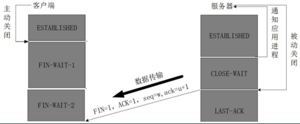

（4）客户端收到服务端的连接释放数据包之后，发出一个确认数据包，内容：ACK=1,seq=u+1，ack=w+1。然后客户端进入TIME-WAIT(时间等待)状态。这个时候TCP还没有释放。仍需要经过时间等待计时器设置的时间2MSL后，客户端才会进入CLOSED状态。MSL称为最长报文段寿命。

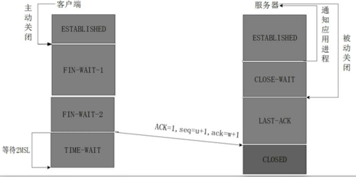

之所以客户端需要等待2MSL时间才完全结束TCP连接，原因有两个：

一、为了保证客户端发送的最后一个确认包能正确到达服务端。因为如果由于网络原因丢失的话，服务端会重新发送连接释放数据包，在等待过程中，如果真的发生这种情况就可以得到处理。客户端每接收到一次服务端发送来的连接释放数据包都会重新设置时间等待计时器，然后等待2MSL时间才完全结束TCP连接。

二、等待才2MSL时间完全结束TCP连接，可以避免再次开启TCP连接的时候收到上一次TCP连接存在网络中的数据包，显然这样的数据包不是属于本次连接的，是无效的数据包。

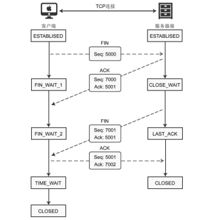

为什么要四次挥手？

再来回顾下四次挥手双方发FIN包的过程，就能理解为什么需要四次了。关闭连接时，客户端向服务端发送FIN时，仅仅标识客户端不再发送数据了但是还能接收数据。服务端收到客户端的FIN报文时，先回一个ACK应答报文，而服务端可能还有数据需要处理和发送，等服务端不再发送数据时，才发送FIN报文给客户端来表示同意现在关闭连接。从上面过程可知，服务端通常需要等待完成数据的发送和处理，所以服务端的ACK和FIN一般都会分开发送，从而比三次握手导致多了一次。

TIME_WAIT等待2倍的MSL，比较合理的解释是：网络中可能存在来自发送方的数据包，当这些发送方的数据包被接收方处理后又会向对方发送响应，所以一来一回需要等待2倍的时间。

