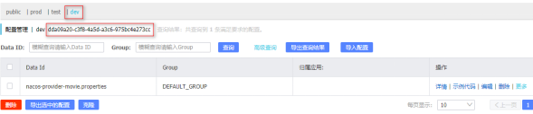
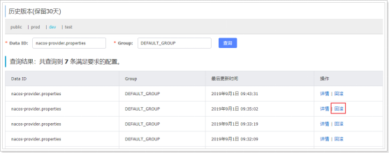

# SpringCloud Alibaba

## 简介

由于性能关系，Eureka停止更新，Hystrix和Ribbon进入维护模式，不再继续更新。


2018.10.31，Spring Cloud Alibaba正式入驻了Spring Cloud官网孵化器，并在Maven中央库发布了第一个版本。Spring Cloud Alibaba 致力于提供微服务开发的一站式解决方案。此项目包含开发分布式应用微服务的必需组件，方便开发者通过 Spring Cloud 编程模型轻松使用这些组件来开发分布式应用服务。依托 Spring Cloud Alibaba，您只需要添加一些注解和少量配置，就可以将 Spring Cloud 应用接入阿里微服务解决方案，通过阿里中间件来迅速搭建分布式应用系统。


参考：<https://github.com/alibaba/spring-cloud-alibaba/blob/master/README-zh.md>

常见的注册中心：

- Eureka（原生，2.0遇到性能瓶颈，停止维护）

- Zookeeper（支持，专业的独立产品。例如：dubbo）

- Consul（原生，GO语言开发）

- Nacos

相对于 Spring Cloud Eureka 来说，Nacos 更强大。

**Nacos = Spring Cloud Eureka + Spring Cloud Config**

Nacos 可以与 Spring, Spring Boot, Spring Cloud 集成，并能代替 Spring Cloud Eureka, Spring Cloud Config。

通过 Nacos Server 和 spring-cloud-starter-alibaba-nacos-config 实现配置的动态变更。

通过 Nacos Server 和 spring-cloud-starter-alibaba-nacos-discovery 实现服务的注册与发现。

nacos在阿里巴巴内部有超过10万的实例运行，已经过了类似双十一等各种大型流量的考验。

## Nacos主要功能

Nacos主要提供以下四大功能：

- 服务发现和服务健康监测

- 动态配置服务

- 动态DNS服务

- 服务及其元数据管理

面试题：微服务间远程交互的过程？

- 先去注册中心查询服务的服务器地址

- 调用方给对方发送http请求

## Nacos-Helloworld案例开发

### 案例分析

需求：电影查询系统

- 用户访问用户服务可以查询用户信息或者查询用户信息+电影信息

- 电影服务可以查询电影信息

### SpringCloud Alibaba Nacos 服务发现和配置中心

#### Nacos简介

Nacos：Dynamic Naming and Configuration Service

一个更易于构建云原生应用的动态服务发现，配置管理和服务管理中心

Nacos就是注册中心+配置中心的组合     等价于    <font color="red"> Nacos = Eureka+Config+Bus</font>

#### 下载Nacos

下载地址： <https://github.com/alibaba/nacos/archive/1.1.4.tar.gz>

下载nacos-server-1.1.4.zip后解压即可


#### 启动Nacos

对于Linux、Unix、Mac：

启动命令(standalone代表着单机模式运行，非集群模式):

```
sh startup.sh -m standalone
```

对于Windows：

启动命令：

```
cmd startup.cmd
```

或者双击startup.cmd运行文件。


#### 访问Nacos

浏览器访问：<http://localhost:8848/nacos>

会跳转到登录页面，账号密码默认都是nacos，端口号为8848


注册中心已经准备完毕，我们再基于Nacos注册中心创建服务提供者和消费者

### 基于Nacos创建服务提供者

新建工程: nacos-provider-movie


引入模块 spring web


pom文件添加依赖，注意：nacos版本 0.2.x.RELEASE 对应的是 Spring Boot 2.x 版本，版本 0.1.x.RELEASE 对应的是 Spring Boot 1.x 版本。

```xml
<dependencies>
    <dependency>
        <groupId>org.springframework.boot</groupId>
        <artifactId>spring-boot-starter-web</artifactId>
    </dependency>
    <dependency>
        <groupId>org.springframework.cloud</groupId>
        <artifactId>spring-cloud-starter-alibaba-nacos-discovery</artifactId>
        <version>0.2.1.RELEASE</version>
    </dependency>
    <dependency>
        <groupId>org.springframework.boot</groupId>
        <artifactId>spring-boot-starter-test</artifactId>
        <scope>test</scope>
    </dependency>
</dependencies>
<!-- SpringCloud的依赖 -->
<dependencyManagement>
    <dependencies>
        <dependency>
            <groupId>org.springframework.cloud</groupId>
            <artifactId>spring-cloud-dependencies</artifactId>
            <version>Greenwich.SR2</version>
            <type>pom</type>
            <scope>import</scope>
        </dependency>
    </dependencies>
</dependencyManagement>
```

yml添加配置

```yaml
server:
  port: 8000
spring:
  application:
    name: nacos-provider
  cloud:
    nacos:
      discovery:
        server-addr: localhost:8848
```

主程序添加注解：EnableDiscoveryClient

多实例启动，查看Nacos控制台


浏览器访问：<http://localhost:8488/nacos>


### 基于Nacos创建服务消费者

新建工程: nacos-consumer-user

引入模块和依赖参考服务提供者


yml添加配置

```yaml
server.port=9000
spring.application.name=nacos-consumer-user
spring.cloud.nacos.discovery.server-addr=localhost:8848
```

主程序添加注解：EnableDiscoveryClient

查看Nacos控制台


### 使用Feign实现服务调用

在nacos-consumer-user项目中引入feign的依赖

```xml
<dependency>
    <groupId>org.springframework.cloud</groupId>
    <artifactId>spring-cloud-starter-openfeign</artifactId>
</dependency>
```

在nacos-consumer-user项目主程序类名上添加@EnableFeignClients注解

在nacos-consumer-user项目中编写要调用nacos-provider-movie项目Controller对应的FeignClient

在nacos-consumer-user项目中使用FeignClient远程调用完成业务

浏览器访问测试: http://localhost:9000/consumer/test

## Nacos 配置中心

在系统开发过程中，开发者通常会将一些需要变更的参数、变量等从代码中分离出来独立管理，以独立的配置文件的形式存在。目的是让静态的系统工件或者交付物（如 WAR，JAR 包等）更好地和实际的物理运行环境进行适配。配置管理一般包含在系统部署的过程中，由系统管理员或者运维人员完成。配置变更是调整系统运行时的行为的有效手段。


如果微服务架构中没有使用统一配置中心时，所存在的问题：

- 配置文件分散在各个项目里，不方便维护

- 配置内容安全与权限

- 更新配置后，项目需要重启


nacos配置中心：系统配置的集中管理（编辑、存储、分发）、动态更新不重启、回滚配置（变更管理、历史版本管理、变更审计）等所有与配置相关的活动。

案例：改造生产者中的动态配置项，由配置中心统一管理。

nacos创建统一配置


dataId 的完整格式如下：

```
 ${prefix}-${spring.profile.active}.${file-extension}
```

- prefix 默认为所属工程配置spring.application.name 的值（即：nacos-provider），也可以通过配置项 spring.cloud.nacos.config.prefix来配置。

- spring.profile.active 即为当前环境对应的 profile，详情可以参考 [Spring Boot文档](#boot-features-profiles)。 注意：当 spring.profile.active 为空时，对应的连接符 - 也将不存在，dataId 的拼接格式变成 ${prefix}.${file-extension}

- file-exetension 为配置内容的数据格式，可以通过配置项 spring.cloud.nacos.config.file-extension 来配置。目前只支持properties 和 yaml 类型。


  总结：配置所属工程的spring.application.name的值 + "." + properties/yml

配置内容说明：

  项目中易变的内容。例如：myName

当前案例中，nacos-provider-movie工程的spring.application.name= nacos-provider-movie，没有配置spring.profiles.active。所以这里的dataId填写的是nacos-provider.properties


从配置中心读取配置

nacos-provider-movie项目引入依赖

```xml
<dependency>
    <groupId>org.springframework.cloud</groupId>
    <artifactId>spring-cloud-starter-alibaba-nacos-config</artifactId>
    <version>0.2.1.RELEASE</version>
</dependency>
```

在bootstrap.properties中配置nacos

```yaml
spring.cloud.nacos.config.server-addr=127.0.0.1:8848
# 该配置影响统一配置中心中的dataId，之前已经配置过
spring.application.name=nacos-provider-movie
```

在需要加载nacos配置的Controller上添加注解@RefreshScope实现自动更新

```java
@RefreshScope
@RestController
public class ProviderController {
    @Value("${myName}")
    private String name;
    @GetMapping("/hello")
    public String hello(){
        return "hello " + name;
    }
}
```


测试

- 修改配置中心的配置，服务提供者会自动刷新修改的属性的属性值。


名称空间切换环境

在实际开发中，通常有多套不同的环境（默认只有public），那么这个时候可以根据指定的环境来创建不同的 namespce，例如，开发、测试和生产三个不同的环境，那么使用一套 nacos 集群可以分别建以下三个不同的 namespace。以此来实现多环境的隔离。


创建名称空间


切换到配置列表：


可以发现有四个名称空间：public（默认）以及我们自己添加的3个名称空间（prod、dev、test），可以点击查看每个名称空间下的配置文件，当然现在只有public下有一个配置。

默认情况下，项目会到public下找 服务名.properties文件。

接下来，在dev名称空间中也添加一个nacos-provider-movie.properties配置。这时有两种方式：

**1** **切换到dev名称空间，添加一个新的配置文件。缺点：每个环境都要重复配置类似的项目**

**2** **直接通过clone方式添加配置，并修改即可。推荐**


点击编辑：修改配置内容，以作区分


在服务提供方nacos-provider-movie中切换命名空间

修改bootstrap.properties添加如下配置

```yaml
spring.cloud.nacos.config.namespace=dda09a20-c3f8-4a5d-a3c6-975bc4e273cc
```

namespace的值为：



重启服务提供方服务，在浏览器中访问测试：


回滚配置

回滚配置只需要两步：

1. 查看历史版本


2. 回滚到某个历史版本




加载多配置文件

偶尔情况下需要加载多个配置文件。假如现在dev名称空间下有三个配置文件：nacos-provider.properties、redis.properties、jdbc.properties。


nacos-provider-movie.properties默认加载，怎么加载另外两个配置文件？

在bootstrap.properties文件中添加如下配置：

```yaml
spring.cloud.nacos.config.ext-config[0].data-id=redis.properties
# 开启动态刷新配置，否则配置文件修改，工程无法感知
spring.cloud.nacos.config.ext-config[0].refresh=true
spring.cloud.nacos.config.ext-config[1].data-id=jdbc.properties
spring.cloud.nacos.config.ext-config[1].refresh=true
```

修改ProviderController读取redis.properties和jdbc.properties配置文件中的参数：

```java
@RefreshScope
@RestController
public class ProviderController {
    @Value("${myName}")
    private String name;
    @Value("${jdbc.url}")
    private String url;
    @Value("${redis.host}")
    private String host;
    @GetMapping("/hello")
    public String hello(){
        return "hello " + name+", redis:"+ host+", jdbc: "+url ;
    }
}
```

测试效果：


问题：

 修改一下配置中心中redis.properties中的配置，不重启服务。能否加载配置信息

 删掉spring.cloud.nacos.config.ext-config[0].refresh=true，再修改redis.properties中的配置试试


配置的分组

在实际开发中，除了不同的环境外。不同的微服务或者业务功能，可能有不同的redis及mysql数据库。区分不同的环境我们使用名称空间（namespace），区分不同的微服务或功能，使用分组（group）。

当然，你也可以反过来使用，名称空间和分组只是为了更好的区分配置，提供的两个维度而已。

新增一个redis.properties，所属分组为provider：


现在开发环境中有两个redis.propertis配置文件，一个是默认分组（DEFAULT_GROUP），一个是provider组,默认情况下从DEFAULT_GROUP分组中读取redis.properties，如果要切换到provider分组下的redis.properties，需要添加如下配置：

```yaml
# 指定分组
spring.cloud.nacos.config.ext-config[0].group=provider
```

缺点：

 将来每个分组下会有太多的配置文件，不利于维护。

最佳实践：

 命名空间区分业务功能，分组区分环境。

## Sentinel实现熔断与限流

### Spring Alibaba Sentinel 简介

官网：<https://github.com/alibaba/Sentinel/wiki/%E4%BB%8B%E7%BB%8D>

随着微服务的流行，服务和服务之间的稳定性变得越来越重要。在大规模微服务架构的场景下，避免服务出现雪崩，要减少停机时间，要尽可能的提高服务可用性。限流和降级是一个非常重要的手段，具体实施方法可以归纳为八字箴言，分别是限流，降级，熔断和隔离。Sentinel 以流量为切入点，从流量控制、熔断降级、系统负载保护等多个维度保护服务的稳定性。

Sentinel 具有以下特征:

- 丰富的应用场景：Sentinel 承接了阿里巴巴近 10 年的双十一大促流量的核心场景，例如秒杀（即突发流量控制在系统容量可以承受的范围）、消息削峰填谷、集群流量控制、实时熔断下游不可用应用等。

- 完备的实时监控：Sentinel 同时提供实时的监控功能。您可以在控制台中看到接入应用的单台机器秒级数据，甚至 500 台以下规模的集群的汇总运行情况。

- 广泛的开源生态：Sentinel 提供开箱即用的与其它开源框架/库的整合模块，例如与 Spring Cloud、Dubbo、gRPC 的整合。您只需要引入相应的依赖并进行简单的配置即可快速地接入 Sentinel。

- 完善的 SPI 扩展点：Sentinel 提供简单易用、完善的 SPI 扩展接口。您可以通过实现扩展接口来快速地定制逻辑。例如定制规则管理、适配动态数据源等。

Sentinel 的主要特性：


Sentinel 目前已经针对 Servlet、Dubbo、Spring Boot/Spring Cloud、gRPC 等进行了适配，用户只需引入相应依赖并进行简单配置即可非常方便地享受 Sentinel 的高可用流量防护能力。

### Sentinel与Hystrix的区别

详情参考：<https://yq.aliyun.com/articles/633786/>

Hystrix常用的线程池隔离会造成线程上下切换的overhead比较大；

Hystrix使用的信号量隔离对某个资源调用的并发数进行控制，效果不错，但是无法对慢调用进行自动降级；

Sentinel通过并发线程数的流量控制提供信号量隔离的功能；

Sentinel支持的熔断降级维度更多，可对多种指标进行流控、熔断，且提供了实时监控和控制面板，功能更为强大。

### 下载安装Sentinel

**Sentinel组成**

Sentinel 分为两个部分:

1 核心库（Java 客户端）不依赖任何框架/库，能够运行于所有 Java 运行时环境，同时对 Dubbo / Spring Cloud 等框架也有较好的支持。

2 控制台（Dashboard）基于 Spring Boot 开发，打包后可以直接运行，不需要额外的 Tomcat 等应用容器。

**下载**

地址：<https://github.com/alibaba/Sentinel/releases/tag/1.7.2>


**运行**

```
java  -jar sentinel-dashboard-1.7.2.jar
```


**访问sentinel控制台**

<http://localhost:8080>,登录账号密码都是sentinel


**消费者服务整合Sentinel**

修改：cloudalibaba-sentinel-service8401

POM添加nacos依赖

```xml
<dependency>
    <groupId>com.alibaba.csp</groupId>
    <artifactId>sentinel-datasource-nacos</artifactId>
</dependency>
```

**YML**

```yaml
server:
  port: 8401
 
spring:
  application:
    name: cloudalibaba-sentinel-service
  cloud:
    nacos:
      discovery:
        server-addr: localhost:8848 #Nacos服务注册中心地址
    sentinel:
      transport:
        dashboard: localhost:8080 #配置Sentinel dashboard地址
        port: 8719
      datasource:
        ds1:
          nacos:
            server-addr: localhost:8848
            dataId: cloudalibaba-sentinel-service
            groupId: DEFAULT_GROUP
            data-type: json
            rule-type: flow
 
management:
  endpoints:
    web:
      exposure:
        include: '*'
 
feign:
  sentinel:
    enabled: true # 激活Sentinel对Feign的支持
```

**添加Nacos业务规则配置**


· 内容解析

```json
[
    {
         "resource": "/retaLimit/byUrl",
         "limitApp": "default",
         "grade":   1,
         "count":   1,
         "strategy": 0,
         "controlBehavior": 0,
         "clusterMode": false    
    }
]
```


启动8401后刷新sentinel发现业务规则有了


快速访问测试接口

<http://localhost:8401/rateLimit/byUrl>

默认


停止8401再看sentinel


重新启动8401再看sentinel

扎一看还是没有，稍等一会儿

多次调用

 <http://localhost:8401/rateLimit/byUrl>

重新配置出现了，持久化验证通过

## Zuul网关

不同的微服务一般有不同的网络地址，而外部的客户端可能需要调用多个服务的接口才能完成一个业务需求。比如一个电影购票的手机APP，可能会调用电影分类微服务，用户微服务，支付微服务等。如果客户端直接和微服务进行通信，会存在以下问题：

Ø 客户端会多次请求不同微服务，增加客户端的复杂性

Ø 存在跨域请求，在一定场景下处理相对复杂

Ø 认证复杂，每一个服务都需要独立认证

Ø 难以重构，随着项目的迭代，可能需要重新划分微服务，如果客户端直接和微服务通信，那么重构会难以实施

Ø 某些微服务可能使用了其他协议，直接访问有一定困难

Zuul包含了对请求的路由和过滤两个最主要的功能：

其中路由功能负责将外部请求转发到具体的微服务实例上，是实现外部访问统一入口的基础而过滤器功能则负责对请求的处理过程进行干预，是实现请求校验、服务聚合等功能的基础。 

Zuul和Eureka进行整合，将Zuul自身注册为Eureka服务治理下的应用，同时从Eureka中获得其他微服务的信息，也即以后的访问微服务都是通过Zuul跳转后获得。

总体来说，Zuul提供了**代理**、**路由**和**过滤**的功能。


**创建Zuul工程**

Springboot项目：cloud-zuul ， 并引入Eureka client、config、zuul依赖


创建后依赖如下：

```xml
<dependency>
    <groupId>org.springframework.cloud</groupId>
    <artifactId>spring-cloud-starter-config</artifactId>
</dependency>
<dependency>
    <groupId>org.springframework.cloud</groupId>
    <artifactId>spring-cloud-starter-netflix-eureka-client</artifactId>
</dependency>
<dependency>
    <groupId>org.springframework.cloud</groupId>
    <artifactId>spring-cloud-starter-netflix-zuul</artifactId>
</dependency>
```

配置applicaton.yml

```yaml
server:
  port: 10000
spring:
  application:
    name: cloud-zuul
eureka:
  client:
    serviceUrl:
      defaultZone: http://192.168.200.1:8761/eureka/
```

主程序添加注解启用zuul代理功能：@EnableZuulProxy

启动cloud-zuul项目

**访问测试**

初步访问

<http://192.168.200.1:10000/cloud-provider-movie/movie>

\- http:// 192.168.200.1:10000/ ：zuul网关项目地址端口号

\- cloud-provider-movie/movie : 需要访问的目标服务的服务名+路径

此时：通过Zuul可以访问，也可以不经过Zuul直接访问目标微服务。

<http://192.168.200.1:8002/movie>


使用指定地址代替微服务名称

```yaml
zuul:
  routes:
    helloworld:       # 自定义路由规则的名称，在底层的数据结构中是Map的键
      serviceId: cloud-provider-movie   #目标微服务名称，ZuulRoute类型的一个属性
      path: /zuul-movie/**      # 用来代替目标微服务名称的路径，ZuulRoute类型的一个属性
      # /**表示匹配多层路径，如果没有加/**则不能匹配后续的多层路径了
```

效果：使用微服务自己的地址、微服务名称和新配置的地址都可以访问

<http://192.168.200.1:10000/cloud-provider-movie/movie>

<http://192.168.200.1:8002/movie>

<http://192.168.200.1:10000/zuul-movie/movie>


**让用户不能通过微服务名称访问**

```yaml
zuul:
  ignored-services:         # 忽略指定微服务名称，让用户不能通过微服务名称访问
  - cloud-provider-movie
```

效果：微服务名称不能访问，只有新配置的地址可以访问

访问失败：<http://192.168.200.1:10000/cloud-provider-movie/movie>

访问成功：<http://192.168.200.1:10000/zuul-movie/movie>

​		<http://192.168.200.1:8002/movie>


**忽略所有微服务名称**

```yaml
zuul:
  ignored-services: '*'     # 忽略所有微服务名称
```


**给访问路径添加统一前缀**

```yaml
zuul:
  prefix: /atguigu    # 给访问路径添加统一前缀
```

<http://192.168.200.1:10000/atguigu/zuul-movie/movie>


**过滤功能：ZuulFilter**

```java
@Component
public class MyZuulFilter extends ZuulFilter {
    //判断是否需要过滤本次请求
    @Override
    public boolean shouldFilter() {
        // 1.获取当前RequestContext对象
        RequestContext context = RequestContext.getCurrentContext();
        // 2.获取当前请求对象
        HttpServletRequest request = context.getRequest();
        // 3.获取当前请求要访问的目标地址
        String servletPath = request.getServletPath();
        // 4.打印
        System.err.println("servletPath="+servletPath);
        // 5.当前方法返回值
        // true：表示应该过滤，下面继续执行run()方法
        // false：表示不过滤，直接放行
        return true;
    }
    //需要过滤请求的过滤逻辑
    @Override
    public Object run() throws ZuulException {
        System.err.println("run() ...");
        // 官方文档：目前版本会忽略这个返回值，返回null即可
        return null;
    }
    // 返回当前过滤器类型：过滤时机
    @Override
    public String filterType() {
        /*
        Zuul 中的过滤器总共有 4 种类型，且每种类型都有对应的使用场景。
     “pre” 预过滤器 - 在路由分发一个请求之前调用。
     “post” 后过滤器 - 在路由分发一个请求后调用。
     “route” 路由过滤器 - 用于路由请求分发。
     “error” 错误过滤器 - 在处理请求时发生错误时调用
        */
       return "pre";
    }
    // 过滤器执行顺序
    @Override
    public int filterOrder() {
        return 0;
    }
}
```


**案例：使用zuul网关实现ip黑名单**

```java
private List<String> blackIpList = Arrays.asList("127.0.0.1","192.168.200.1");
@Override
public Object run() {
    RequestContext ctx = RequestContext.getCurrentContext();
    String ip = ctx.getRequest().getRemoteHost();
    System.out.println("ip = " + ip);
    // 判断是不是黑名单ip访问
    if (!StringUtils.isEmpty(ip) && blackIpList.contains(ip)) {
        ctx.setSendZuulResponse(false);
        ctx.setResponseBody("{\"code\":10001 , \"data\":\"请求被拒绝\"}");
        ctx.getResponse().setContentType("application/json; charset=utf-8");
        return null;
    }
    return null;
}
```

