# 微信小程序介绍


​		微信⼩程序，简称⼩程序，英⽂名 Mini Program ，是⼀种不需要下载安装即可使⽤的应⽤，它实现 了应⽤“触⼿可及”的梦想，⽤⼾扫⼀扫或搜⼀下即可打开应⽤。

## 为什么是微信⼩程序 ？ 

1. 微信有海量⽤⼾，⽽且粘性很⾼，在微信⾥开发产品更容易触达⽤⼾； 

2. 推⼴app 或公众号的成本太⾼。 

3. 开发适配成本低。 

4. 容易⼩规模试错，然后快速迭代。 

5. 跨平台。

## 微信⼩程序历史

- 2016年1⽉11⽇，微信之⽗张⼩⻰时隔多年的公开亮相，解读了微信的四⼤价值观。张⼩⻰指出， 越来越多产品通过公众号来做，因为这⾥开发、获取⽤⼾和传播成本更低。拆分出来的服务号并没有提供更好的服务，所以微信内部正在研究新的形态，叫「微信⼩程序」 需要注意的是，之前是叫做应⽤号 

- 2016年9⽉21⽇，微信⼩程序正式开启内测。在微信⽣态下，触⼿可及、⽤完即⾛的微信⼩程序引起⼴泛关注。腾讯云正式上线微信⼩程序解决⽅案，提供⼩程序在云端服务器的技术⽅案。 

- 2017年1⽉9⽇，微信推出的“⼩程序”正式上线。“⼩程序”是⼀种⽆需安装，即可使⽤的⼿机“应⽤”。不需要像往常⼀样下载App，⽤⼾在微信中“⽤完即⾛”。

## 疯狂的微信⼩程序 

1. 微信⽉活已经达到10.82亿。其中55岁以上的⽤⼾也达到6300万 

2. 信息传达数达到450亿，较去年增⻓18%;视频通话4.1亿次,增⻓100% 

3. ⼩程序覆盖超过200+⾏业，交易额增⻓超过6倍，服务1000亿+⼈次,创造出了5000亿+的商业价值

##  还有其他的⼩程序 不容忽视

1. ⽀付宝⼩程序 

2. 百度⼩程序 

3. QQ⼩程序 

4. 今⽇头条 + 抖⾳⼩程序 

## 体验 

### 官⽅微信⼩程序体验 


### 其他优秀的第三⽅⼩程序 

拼多多

滴滴出⾏ 

欢乐⽃地主 

智⾏⽕⻋票 

唯品会

。。。

# 环境准备

开发微信⼩程序之前，必须要准备好相应的环境

## 注册账号

建议使用全新的邮箱，没有注册过其他小程序或者公众号的。

访问注册⻚⾯，耐⼼完成注册即可。 

## 获取APPID 

由于后期调⽤微信⼩程序的接⼝等功能，需要索取开发者的⼩程序中的 APPID ，所以在注册成功后， 可登录，然后获取APPID。 

登录，成功后可看到如下界⾯。然后复制你的APPID,悄悄的保存起来，不要给别⼈看到😄。

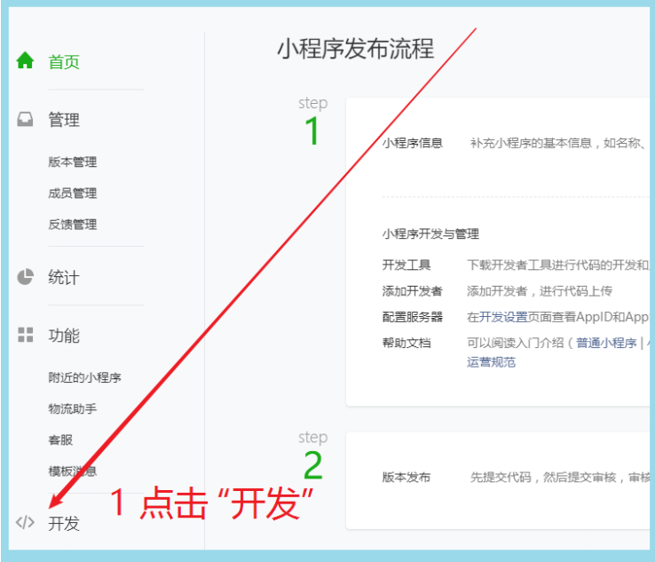

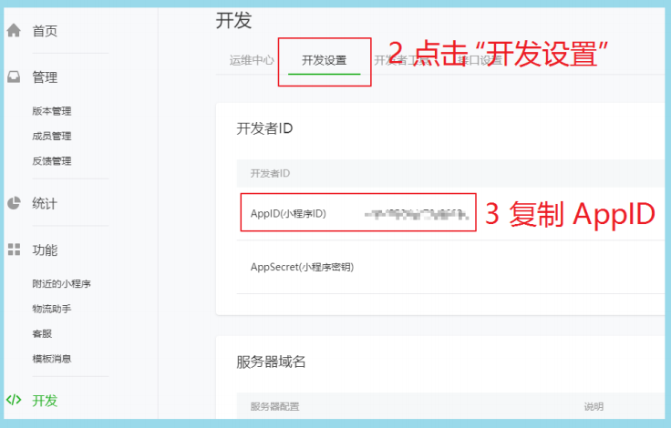

## 开发⼯具 

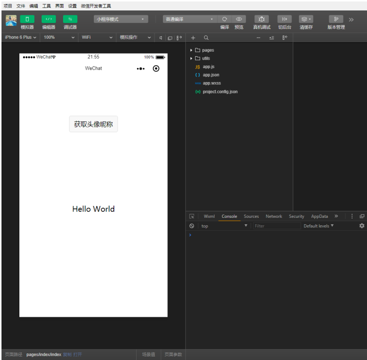

微信⼩程序⾃带开发者⼯具，集 开发 预览 调试 发布 于⼀⾝的 完整环境。 

但是由于编码的体验不算好，因此 建议使⽤ vs code + 微信小程序编辑工具 来实现编码

vs code 负责敲代码， 微信编辑工具负责预览 

# 第⼀个微信⼩程序 

## 打开微信开发者⼯具 

注意 第⼀次登录的时候 需要扫码登录


## 新建⼩程序项⽬

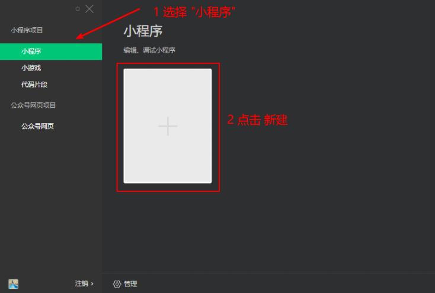

## 填写项⽬信息

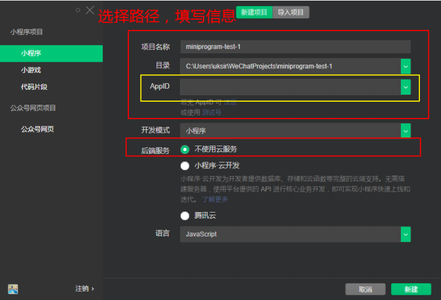

## 成功

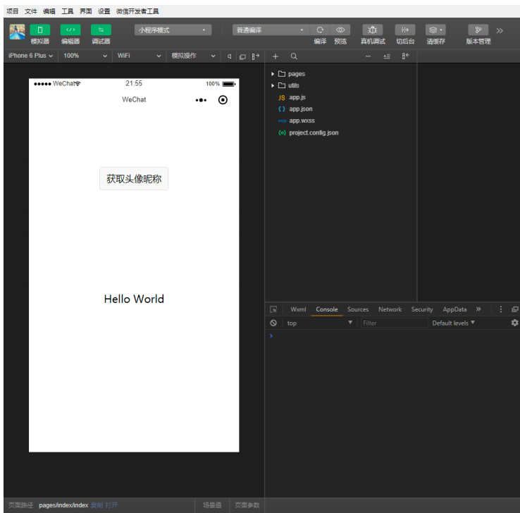

# 微信开发者⼯具介绍

详细的使⽤，可以查看官⽹

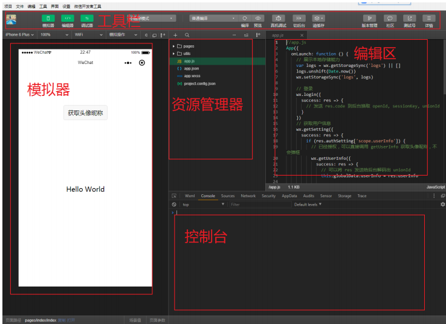

# ⼩程序结构⽬录 

⼩程序框架的⽬标是通过尽可能简单、⾼效的⽅式让开发者可以在微信中开发具有原⽣APP体验的服务。

⼩程序框架提供了⾃⼰的视图层描述语⾔ WXML和 WXSS，以及 JavaScript，并在视图层与逻辑层间提供了数据传输和事件系统，让开发者能够专注于数据与逻辑。 

## ⼩程序⽂件结构和传统web对⽐

| 结构 | 传统web    | 微信小程序 |
| ---- | ---------- | ---------- |
| 结构 | HTML       | WXML       |
| 样式 | CSS        | WXSS       |
| 逻辑 | Javascript | Javascript |
| 配置 | 无         | JSON       |

通过以上对⽐得出，传统web 是三层结构。⽽微信⼩程序 是四层结构，多了⼀层 配置.json 

## 基本的项⽬⽬录

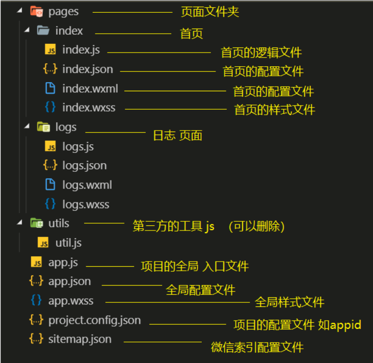

# ⼩程序配置⽂件

⼀个⼩程序应⽤程序会包括最基本的两种配置⽂件。⼀种是全局的 app.json和 ⻚⾯⾃⼰的page.json

注意：配置文件中不能出现注释

##  全局配置app.json

app.json 是当前⼩程序的全局配置，包括了⼩程序的所有⻚⾯路径、界⾯表现、⽹络超时时间、底部 tab 等。普通快速启动项⽬⾥边的 app.json 配置。

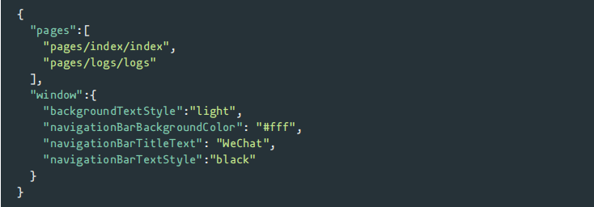

字段的含义 

1. pages字段⸺⽤于描述当前⼩程序所有⻚⾯路径，这是为了让微信客⼾端知道当前你的⼩程序⻚⾯定义在哪个⽬录。 
2. window字段⸺定义⼩程序所有⻚⾯的顶部背景颜⾊，⽂字颜⾊定义等。 
3. 完整的配置信息请参考 app.json配置 

### tabbar 

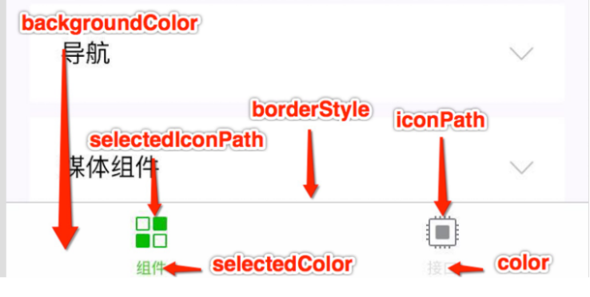

## ⻚⾯配置page.json 

这⾥的 page.json其实⽤来表⽰⻚⾯⽬录下的 page.json这类和⼩程序⻚⾯相关的配置。开发者可以独⽴定义每个⻚⾯的⼀些属性，如顶部颜⾊、是否允许下拉刷新等等。

⻚⾯的配置只能设置 app.json中部分 window配置项的内容，⻚⾯中配置项会覆盖 app.json的 window中相同的配置项。 

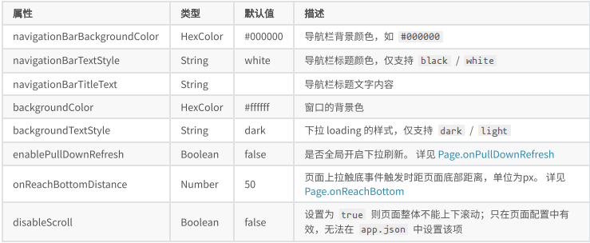

## sitemap 配置-了解即可 

⼩程序根⽬录下的 sitemap.json⽂件⽤于配置⼩程序及其⻚⾯是否允许被微信索引。 

# 模板语法

WXML（WeiXin Markup Language）是框架设计的⼀套标签语⾔，结合基础组件、事件系统，可以构建出⻚⾯的结构。

## 数据绑定

### 普通写法

```
<view> {{ message }} </view>
```

```
Page({
  data: {
    message: 'Hello MINA!'
 }
})
```

### 组件属性

```
<view id="item-{{id}}"> </view>
```

```
Page({
  data: {
    id: 0
 }
})
```

### bool类型 

不要直接写 checked=false，其计算结果是⼀个字符串 

```
<checkbox checked="{{false}}"> </checkbox>
```

## 运算 

### 三元运算 

```
<view hidden="{{flag ? true : false}}"> Hidden </view>
```

### 算数运算 

```
<view> {{a + b}} + {{c}} + d </view>
```

```
Page({
  data: {
    a: 1,
    b: 2,
    c: 3
 }
})
```

### 逻辑判断 

```
<view wx:if="{{length > 5}}"> </view>
```

### 字符串运算 

```
<view>{{"hello" + name}}</view>
```

```
Page({
  data:{
    name: 'MINA'
 }
})
```

### 注意

花括号和引号之间如果有空格，将最终被解析成为字符串 

## 列表渲染 

### wx:for 

项的变量名默认为 item wx:for-\-item 可以指定数组当前元素的变量名 

下标变量名默认为 index wx:for--index 可以指定数组当前下标的变量名

wx:key ⽤来提⾼数组渲染的性能

wx:key 绑定的值 有如下选择 

1. string 类型，表⽰ 循环项中的唯⼀属性 如

```
list:[{id:0,name:"炒饭"},{id:1,name:"炒面"}]
wx:key="id"
```

2. 保留字 *this ，它的意思是 item 本⾝ ，*this 代表的必须是 唯⼀的字符串和数组。

```
list:[1,2,3,4,5]
wx:key="*this"
```

代码：

```
<view wx:for="{{array}}" wx:key="id">
 {{index}}: {{item.message}}
</view>
```

```
Page({
  data: {
    array: [{
      id:0,
      message: 'foo',
   }, {
      id:1,
      message: 'bar'
   }]
 }
})
```

### block 

渲染⼀个包含多节点的结构块 block最终不会变成真正的dom元素 

```
<block wx:for="{{[1, 2, 3]}}" wx:key="*this" >
  <view> {{index}}: </view>
  <view> {{item}} </view>
</block>
```

## 条件渲染 

### wx:if 

在框架中，使⽤ wx:if="{{condition}}" 来判断是否需要渲染该代码块：

```
 <view wx:if="{{false}}">1</view>
 <view wx:elif="{{true}}">2</view>
 <view wx:else>3</view>
```

### hidden 

```
<view hidden="{{condition}}"> True </view>
```

类似 wx:if
频繁切换 ⽤ hidden

不常使⽤ ⽤ wx:if

# ⼩程序事件的绑定

⼩程序中绑定事件，通过bind关键字来实现。如 bindtap bindinput bindchange 等 不同的组件⽀持不同的事件，具体看组件的说明即可。

## wxml 

```
<input bindinput="handleInput" />
```

## page 

```
Page({
  // 绑定的事件
  handleInput: function(e) {
    console.log(e);
    console.log("值被改变了");
 }
})
```

## 特别注意 

1. 绑定事件时不能带参数 不能带括号 以下为错误写法

```
<input bindinput="handleInput(100)" />
```

2. 事件传值 通过标签⾃定义属性的⽅式 和 value

```
<input bindinput="handleInput" data-item="100" />
```

3. 事件触发时获取数据

```
 handleInput: function(e) {
    // {item:100}
   console.log(e.currentTarget.dataset)
      
    // 输入框的值
   console.log(e.detail.value);
 }
```

#  样式 WXSS

WXSS( WeiXin Style Sheets )是⼀套样式语⾔，⽤于描述 WXML 的组件样式。 

与 CSS 相⽐，WXSS 扩展的特性有： 

- 响应式⻓度单位 rpx
- 样式导⼊

## 尺⼨单位

rpx （responsive pixel）: 可以根据屏幕宽度进⾏⾃适应。规定屏幕宽为 750rpx 。如在iPhone6 上，屏幕宽度为 375px ，共有750个物理像素，则 750rpx = 375px = 750物理像, 750rpx = 375px = 750物理像素 ， 1rpx = 0.5px = 1物理像素 ,1rpx = 0.5px = 1物理像素 。

| 设备         | rpx换算px（屏幕宽度/750) | px换算rpx（750/屏幕宽度) |
| ------------ | ------------------------ | ------------------------ |
| iphone5      | 1rpx=0.42px              | 1px=2.34rpx              |
| iphone6      | 1rpx=0.5px               | 1px=2rpx                 |
| iphone6 plus | 1rpx=0.552px             | 1px=1.81rpx              |

建议： 开发微信⼩程序时设计师可以⽤ iPhone6 作为视觉稿的标准。 

使⽤步骤： 

1. 确定设计稿宽度 pageWidth
2. 计算⽐例 750rpx = pageWidth px ,因此 1px=750rpx/pageWidth 。 
3. 在less⽂件中，只要把设计稿中的 px => 750/pageWidth rpx 即可。

## 样式导⼊ 

wxss中直接就⽀持，样式导⼊功能。

也可以和 less中的导⼊混⽤。 

使⽤ @import 语句可以导⼊外联样式表，只⽀持相对路径。 

⽰例代码：

```
/** common.wxss **/
.small-p {
  padding:5px; }
```

```
/** app.wxss **/
@import "common.wxss";
.middle-p {
  padding:15px; }
```

## 选择器 

特别需要注意的是 ⼩程序 不⽀持通配符 * 因此以下代码⽆效！

```
*{
    margin:0;
    padding:0;
    box-sizing:border-box; }
```

⽬前⽀持的选择器有：

| 选择器           | 样例              | 样例描述                                       |
| ---------------- | ----------------- | ---------------------------------------------- |
| .class           | .intro            | 选择所有拥有 class="intro" 的组件              |
| \#id             | \#firstname       | 选择拥有 id="firstname "的组件                 |
| element          | view              | 选择所有 view 组件                             |
| element, element | view,checkbox     | 选择所有⽂档的 view 组件和所有的 checkbox 组件 |
| nth-child(n)     | view:nth-child(n) | 选择某个索引的标签                             |
| ::after          | view::after       | 在 view 组件后边插⼊内容                       |
| ::before         | view::before      | 在 view 组件前边插⼊内容                       |

## ⼩程序中使⽤less 

原⽣⼩程序不⽀持 less ，其他基于⼩程序的框架⼤体都⽀持，如 wepy ， mpvue ， taro 等。 但是仅仅因为⼀个less功能，⽽去引⼊⼀个框架，肯定是不可取的。因此可以⽤以下⽅式来实现 

1. 编辑器是 vscode

2. 安装插件 easy less

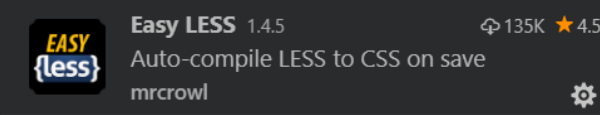

3. 在vs code的设置中加⼊如下，配置

```
  "less.compile": {
        "outExt":       ".wxss"
   }
```

4. 在要编写样式的地⽅，新建 less ⽂件，如 index.less ,然后正常编辑即可。

