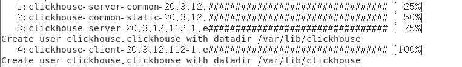

# 简介

​	Clickhouse是由俄国Yandex在2016年发布的一个分布式数据分析型数据库，其效率要比Veritca快约5倍，其不依赖于Hadoop生态软件和基础及高可用的特性适用于许多数据分析场景。

# 安装与部署

Clickhouse 仅支持Linux 且必须支持SSE4.2 指令集

这里用Centos7进行演示

```shell
grep -q sse4_2 /proc/cpuinfo && echo "SSE 4.2 supported" || echo "SSE 4.2 not supported"
```

得出下列结果

```shell
SSE 4.2 supported
```

如果服务器不支持SSE指令集，则不能直接下载预编译安装包，需要通过源码编译特定版本进行安装

关闭防火墙以及防火墙自启动。

```
systemctl stop firewalld.service 
systemctl disable firewalld.service 
```

## 版本选择及下载

先创建目录存放下载的文件

```shell
mkdir -p /opt/software/clickhouse/
```

然后选择所需要的的版本进行下载

https://packagecloud.io/Altinity/clickhouse

选择所需的安装包，只需要下面四种即可，其中el/7表示为centos7版本
(此处为示例版本)：

| **包名**                                              |
| ----------------------------------------------------- |
| clickhouse-server-common-20.3.12.112-1.el7.x86_64.rpm |
| clickhouse-server-20.3.12.112-1.el7.x86_64.rpm el/7   |
| clickhouse-common-static-20.3.12.112-1.el7.x86_64.rpm |
| clickhouse-client-20.3.12.112-1.el7.x86_64.rpm        |

在该页面中找到下载链接即可，示例：

```shell
wget --content-disposition https://packagecloud.io/Altinity/clickhouse/packages/el/7/clickhouse-server-common-20.3.12.112-1.el7.x86_64.rpm/download.rpm

wget --content-disposition https://packagecloud.io/Altinity/clickhouse/packages/el/7/clickhouse-server-20.3.12.112-1.el7.x86_64.rpm/download.rpm

wget --content-disposition https://packagecloud.io/Altinity/clickhouse/packages/el/7/clickhouse-common-static-20.3.12.112-1.el7.x86_64.rpm/download.rpm

wget --content-disposition https://packagecloud.io/Altinity/clickhouse/packages/el/7/clickhouse-client-20.3.12.112-1.el7.x86_64.rpm/download.rpm
```

更多安装方法请参照官方安装文档，此处不再阐述.

## 安装

下载上述4类安装包后到对应目录中，进行安装

```
rpm -ivh ./*.rpm
```



全部安装完无错误信息即可，在过程中可能会出现缺少安装包的情况，此时需要将缺失的依赖补齐即可。

## Clickhouse目录结构

1. **/etc/clickhouse-server** : 服务端的配置文件目录，包括全局配置config.xml 和用户配置users.xml，其中如需要**外网访问**则需要打开config.xml中更改配置：

```shell
# vi /etc/clickhouse-server/config.xml
```

```xml
<interserver_http_host>example.yandex.ru</interserver_http_host>
    -->

    <!-- Listen specified host. use :: (wildcard IPv6 address), if you want to accept connections both with IPv4 and IPv6 from everywhere. -->
    <!-- <listen_host>::</listen_host> -->
    <!-- Same for hosts with disabled ipv6: -->
    <!-- <listen_host>0.0.0.0</listen_host> -->

    <!-- Default values - try listen localhost on ipv4 and ipv6: -->
    <!--
    <listen_host>::1</listen_host>
    <listen_host>127.0.0.1</listen_host>
    -->
    <!-- Don't exit if ipv6 or ipv4 unavailable, but listen_host with this protocol specified -->
    <!-- <listen_try>0</listen_try> -->
```

其中需要放开<listen_host>::</listen_host>的注释即可

1. **/var/lib/clickhouse** : 默认的数据存储目录，通常会修改，将数据保存到大容量磁盘路径中
2. **/var/log/cilckhouse-server** : 默认保存日志的目录，通常会修改，将数据保存到大容量磁盘路径中

## 启动服务

```shell
sudo service clickhouse-server start
Start clickhouse-server service: Path to data directory in /etc/clickhouse-server/config.xml: /var/lib/clickhouse/
DONE
```

可以在/var/log/clickhouse-server/目录中查看日志。

如果服务没有启动，请检查配置文件 /etc/clickhouse-server/config.xml。

你也可以在控制台中直接启动服务：

```shell
clickhouse-server --config-file=/etc/clickhouse-server/config.xml
```

在这种情况下，日志将被打印到控制台中，这在开发过程中很方便。
如果配置文件在当前目录中，你可以不指定’–config-file’参数。它默认使用’./config.xml’。


你可以使用命令行客户端连接到服务：

```shell
clickhouse-client
```

```sql
ClickHouse client version 20.3.12.112.
Connecting to localhost:9000 as user default.
Connected to ClickHouse server version 20.3.12 revision 54433.

wbl.clickhouse :) 
```

验证sql

```sql
wbl.clickhouse :) select 1 

SELECT 1

┌─1─┐
│ 1 │
└───┘

1 rows in set. Elapsed: 0.003 sec. 
```

# 分片

ClickHouse的集群由分片 ( Shard ) 组成，而每个分片又通过副本 ( Replica ) 组成。这种分层的概念，在一些流行的分布式系统中十分普遍。例如，在Elasticsearch的概念中，一个索引由分片和副本组成，副本可以看作一种特殊的分片。如果一个索引由5个分片组成，副本的基数是1，那么这个索引一共会拥有10个分片 ( 每1个分片对应1个副本 )。

如果你用同样的思路来理解ClickHouse的分片，那么很可能会在这里栽个跟头。ClickHouse的某些设计总是显得独树一帜，而集群与分片就是其中之一。这里有几个与众不同的特性。

ClickHouse的1个节点只能拥有1个分片，也就是说如果要实现1分片、1副本，则至少需要部署2个服务节点。

注意：一个节点通常就是一台机器。

分片只是一个逻辑概念(类似于Hbase中的region的概念,表的范围数据)，其物理承载还是由副本承担的。

# 分区

ClickHouse支持PARTITION BY子句，在建表时可以指定按照任意合法表达式进行数据分区操作，比如通过toYYYYMM()将数据按月进行分区、toMonday()将数据按照周几进行分区、对Enum类型的列直接每种取值作为一个分区等。

类似于hive中的分区表 。

# 集群安装

clickhouse的集群安装就是在每台机器上安装CH的服务端以及客户端!!所以在每台机器上重复单机安装步骤!

1) 修改/etc/clickhouse-server/目录下的config.xml

```xml
<listen_host>::</listen_host>
<!-- <listen_host>::1</listen_host> -->
<!-- <listen_host>127.0.0.1</listen_host> -->
```

2) 将修改好的配置文件分发到其他CH节点上

3) 在/etc/下创建集群配置文件metrika.xml文件(这个文件需要创建),在CH启动的时候会加载这个配置文件以集群的形式启动CH

```xml
<yandex>
<clickhouse_remote_servers>
    <doit_ch_cluster1>
        <shard>
            <internal_replication>true</internal_replication>
            <replica>
                <host>doit01</host>
                <port>9000</port>
            </replica>
        </shard>
        <shard>
            <replica>
                <internal_replication>true</internal_replication>
                <host>doit02</host>
                <port>9000</port>
            </replica>
        </shard>
        <shard>
            <internal_replication>true</internal_replication>
            <replica>
                <host>doit03</host>
                <port>9000</port>
            </replica>
        </shard>
    </doit_ch_cluster1>
</clickhouse_remote_servers>

<zookeeper-servers>
  <node index="1">
    <host>doit01</host>
    <port>2181</port>
  </node>

  <node index="2">
    <host>doit02</host>
    <port>2181</port>
  </node>
  <node index="3">
    <host>doit03</host>
    <port>2181</port>
  </node>
</zookeeper-servers>

<macros>
    <replica>doit01</replica> //这里每个节点的配置添加当前节点ip
</macros>
<networks>
   <ip>::/0</ip>
</networks>

<clickhouse_compression>
<case>
  <min_part_size>10000000000</min_part_size>                                        
  <min_part_size_ratio>0.01</min_part_size_ratio>                                           <method>lz4</method>
</case>
</clickhouse_compression>
</yandex>
```

4) 将配置文件分发到其他的CH节点上,并修改< macros> < /macros>内为自己的主机映射名!

在每台机器上启动CH服务.以集群的形式启动 , 如果想要再以单节点的形式启动那么就删除/etc/下的metrika.xml文件即可单节点的形式启动!

5) 查看CH的集群情况

```sql
select * from system.clusters
```


# ClickHouse数据类型


**整型**

固定长度的整型，包括有符号整型或无符号整型。

整型范围（-2n-1~2n-1-1）：

Int8 - [-128 : 127]

Int16 - [-32768 : 32767]

Int32 - [-2147483648 : 2147483647]

Int64 - [-9223372036854775808 : 9223372036854775807]

无符号整型范围（0~2n-1）：

UInt8 - [0 : 255]

UInt16 - [0 : 65535]

UInt32 - [0 : 4294967295]

UInt64 - [0 : 18446744073709551615]

**浮点型**

Float32 - float

Float64 – double

建议尽可能以整数形式存储数据。例如，将固定精度的数字转换为整数值，如时间用毫秒为单位表示，因为浮点型进行计算时可能引起四舍五入的误差。

```sql
:) select 1-0.9
┌───────minus(1, 0.9)─┐
│ 0.09999999999999998 │
└─────────────────────┘
```

与标准SQL相比，ClickHouse 支持以下类别的浮点数：

Inf-正无穷：

```sql
:) select 1/0
┌─divide(1, 0)─┐
│          inf │
└──────────────┘
```

-Inf-负无穷：

```sql
:) select -1/0
┌─divide(1, 0)─┐
│          -inf│
└──────────────┘
```

NaN-非数字：

```sql
:) select 0/0
┌─divide(0, 0)─┐
│          nan │
└──────────────┘
```

**布尔型**

没有单独的类型来存储布尔值。可以使用 UInt8 类型，取值限制为 0 或 1。

**字符串**

1）String

字符串可以任意长度的。它可以包含任意的字节集，包含空字节。

2）FixedString(N)

固定长度 N 的字符串，N 必须是严格的正自然数。当服务端读取长度小于 N 的字符串时候，通过在字符串末尾添加空字节来达到 N 字节长度。 当服务端读取长度大于 N 的字符串时候，将返回错误消息。

与String相比，极少会使用FixedString，因为使用起来不是很方便。

**枚举类型**

包括 Enum8 和 Enum16 类型。Enum 保存 'string'= integer 的对应关系。

Enum8 用 'String'= Int8 对描述。

Enum16 用 'String'= Int16 对描述。

用法演示：

创建一个带有一个枚举 Enum8('hello' = 1, 'world' = 2) 类型的列：

```sql
CREATE TABLE t_enum
(
    x Enum8('hello' = 1, 'world' = 2)
)
ENGINE = TinyLog
```

这个 x 列只能存储类型定义中列出的值：'hello'或'world'。如果尝试保存任何其他值，ClickHouse 抛出异常。

```sql
:) INSERT INTO t_enum VALUES ('hello'), ('world'), ('hello')

INSERT INTO t_enum VALUES

Ok.

3 rows in set. Elapsed: 0.002 sec.

:) insert into t_enum values('a')

INSERT INTO t_enum VALUES


Exception on client:
Code: 49. DB::Exception: Unknown element 'a' for type Enum8('hello' = 1, 'world' = 2)
```

从表中查询数据时，ClickHouse 从 Enum 中输出字符串值。

```sql
SELECT * FROM t_enum

┌─x─────┐
│ hello │
│ world │
│ hello │
└───────┘
```

如果需要看到对应行的数值，则必须将 Enum 值转换为整数类型。

```sql
SELECT CAST(x, 'Int8') FROM t_enum

┌─CAST(x, 'Int8')─┐
│               1 │
│               2 │
│               1 │
└─────────────────┘
```

