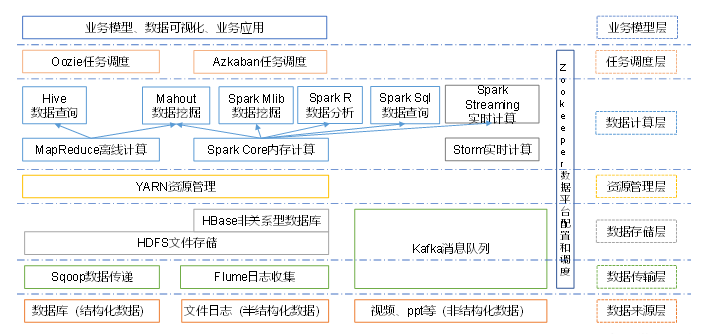

# 大数据概论

大数据：主要解决，海量数据的存储和海量数据的分析计算问题。

按顺序给出数据存储单位：bit、Byte、KB、MB、GB、TB、PB、EB、ZB、YB、BB、NB、DB。

1Byte=8bit

1K=1024Byte

1M=1024K

1G=1024M

1T=1024G

1P=1024T

**大数据特点**

1. Volume大量

   截至目前，人类生产的所有印刷材料的数据量是200PB，而历史上全人类总共说过的话的数据量大约是5EB。当前，典型个人计算机硬盘的容量为TB量级，而一些大企业的数据量以及接近EB量级。

2. Velocity高速

   这是大数据区分于传统数据挖掘的最显著特征。根据IDC的“数字宇宙”的报告，预计到2020年，全球数据使用量将达到35.2ZB。在如此海量的数据面前，处理数据的效率就是企业的生命。

3. Variety多样

   这种类型的多样性也让数据被分为结构化数据和非结构化数据。相对于以往便于存储的以数据库/文本为主的结构化数据，非结构化数据越来越多，包括网络日志、音频、视频、图片、地理位置信息等，这些多类型的数据对数据的处理能力提出了更高要求。

4. Value低价值密度

   价值密度的高低与数据总量的大小成反比。

# **大数据部门组织结构**


# 从Hadoop框架讨论大数据生态

**Hadoop是什么？**

1. Hadoop是一个由Apache基金会所开发的分布式系统基础架构。
2. 主要解决，海量数据的存储和海量数据的分析计算问题。
3. 广义上来说，Hadoop通常是指一个更广泛的概念——Hadoop生态圈。

**Hadoop发展历史？**

1. Lucene框架是Doug Cutting开创的开源软件，用Java书写代码，实现Google类似的全文搜索功能，它提供了全文检索引擎的架构，包括完整的查询引擎和索引引擎。

2. 2001年年底Lucene成为Apache基金会的一个子项目。

3. 对于海量数据的场景，Lucene面对与Google同样的困难，存储数据困难，检索速度慢。

4. 学习和模仿Google解决这些问题的办法：微型版Nutch。

5. 可以说Google是Hadoop的思想之源（GFS->HDFS,Map Reduce->MR,BigTable->HBase）

6. 2003-2004年，Google公开了部分GFS和Map Reduce思想的细节，以此为基础Doug Cutting等人用了2年业余时间实现了DFS和Map Reduce机制，使Nutch性能飙升。

7. 2005年Hadoop作为Lucene的子项目Nutch的一部分正式引入Apache基金会。
8. 2006年3月份，Map-Reduce和Nutch Distrbuted File System（NDFS)分别被纳入到Hadoop项目中，Hadoop就此正式诞生，标志者大数据时代来临。
9. 名字来源于Doug Cutting儿子的玩具大象，如图：


## Hadoop三大发行版本

Hadoop三大发行版本：Apache、Cloudera、Hortonworks。

​	Apache版本最原始（最基础）的版本，对于入门学习最好。

​	Cloudera在大型互联网企业中用的较多。

​	Hortonworks文档较好。

1. **Apache Hadoop**

官网地址：http://hadoop.apache.org/releases.html

下载地址：<https://archive.apache.org/dist/hadoop/common/>

2. **Cloudera Hadoop** 

官网地址：https://www.cloudera.com/downloads/cdh/5-10-0.html

下载地址：http://archive-primary.cloudera.com/cdh5/cdh/5/

（1）2008年成立的Cloudera是最早将Hadoop商用的公司，为合作伙伴提供Hadoop的商用解决方案，主要是包括支持、咨询服务、培训。

（2）2009年Hadoop的创始人Doug Cutting也加盟Cloudera公司。Cloudera产品主要为CDH，Cloudera Manager，Cloudera Support

（3）CDH是Cloudera的Hadoop发行版，完全开源，比Apache Hadoop在兼容性，安全性，稳定性上有所增强。

（4）Cloudera Manager是集群的软件分发及管理监控平台，可以在几个小时内部署好一个Hadoop集群，并对集群的节点及服务进行实时监控。Cloudera Support即是对Hadoop的技术支持。

（5）Cloudera的标价为每年每个节点4000美元。Cloudera开发并贡献了可实时处理大数据的Impala项目。

3. **Hortonworks Hadoop**

官网地址：https://hortonworks.com/products/data-center/hdp/

下载地址：https://hortonworks.com/downloads/#data-platform

（1）2011年成立的Hortonworks是雅虎与硅谷风投公司Benchmark Capital合资组建。

（2）公司成立之初就吸纳了大约25名至30名专门研究Hadoop的雅虎工程师，上述工程师均在2005年开始协助雅虎开发Hadoop，贡献了Hadoop80%的代码。

（3）雅虎工程副总裁、雅虎Hadoop开发团队负责人Eric Baldeschwieler出任Hortonworks的首席执行官。

（4）Hortonworks的主打产品是Hortonworks Data Platform（HDP），也同样是100%开源的产品，HDP除常见的项目外还包括了Ambari，一款开源的安装和管理系统。

（5）HCatalog，一个元数据管理系统，HCatalog现已集成到Facebook开源的Hive中。Hortonworks的Stinger开创性的极大的优化了Hive项目。Hortonworks为入门提供了一个非常好的，易于使用的沙盒。

（6）Hortonworks开发了很多增强特性并提交至核心主干，这使得Apache Hadoop能够在包括Window Server和Windows Azure在内的Microsoft Windows平台上本地运行。定价以集群为基础，每10个节点每年为12500美元。

## Hadoop的优势

1. 高可靠性：Hadoop底层维护了多个数据节点，所以即使Hadoop某个计算元素或存储出现故障，也不会导致数据的丢失。
2. 高扩展性：在集群间分配任务数据，可方便的扩展数以千计的节点。
3. 高效性：在MapReduce的思想下，Hadoop是并行工作的，以加快任务处理速度。
4. 高容错性：能够自动将失败的任务重新分配。

## Hadoop组成（面试重点）

Hadoop1.x和Hadoop2.x区别？


## HDFS架构概述

HDFS（Hadoop Distributed File System）的架构概述：

1. NameNode（nn）：存储文件的元数据，如文件名，文件目录结构，文件属性（生成时间，副本数，文件权限），以及每个文件的块列表和块所在的DataNode等。
2. DataNode（dn）：在本地文件系统存储文件块数据，以及块数据的校验和。
3. Secondary NameNode（2nn）：用来监控HDFS状态的辅助后台程序，每隔一段时间获取HDFS元数据的快照。

## YARN架构概述

节点=服务器/电脑。


## MapReduce架构概述

MapReduce将计算过程分为两个阶段：Map和Reduce

1）Map阶段并行处理输入数据

2）Reduce阶段对Map结果进行汇总

## 大数据技术生态体系



图中涉及的技术名词解释如下：

1）Sqoop：Sqoop是一款开源的工具，主要用于在Hadoop、Hive与传统的数据库(MySql)间进行数据的传递，可以将一个关系型数据库（例如 ：MySQL，Oracle 等）中的数据导进到Hadoop的HDFS中，也可以将HDFS的数据导进到关系型数据库中。

2）Flume：Flume是Cloudera提供的一个高可用的，高可靠的，分布式的海量日志采集、聚合和传输的系统，Flume支持在日志系统中定制各类数据发送方，用于收集数据；同时，Flume提供对数据进行简单处理，并写到各种数据接受方（可定制）的能力。

3）Kafka：Kafka是一种高吞吐量的分布式发布订阅消息系统，有如下特性：

（1）通过O(1)的磁盘数据结构提供消息的持久化，这种结构对于即使数以TB的消息存储也能够保持长时间的稳定性能。

（2）高吞吐量：即使是非常普通的硬件Kafka也可以支持每秒数百万的消息。

（3）支持通过Kafka服务器和消费机集群来分区消息。

（4）支持Hadoop并行数据加载。

4）Storm：Storm用于“连续计算”，对数据流做连续查询，在计算时就将结果以流的形式输出给用户。

5）Spark：Spark是当前最流行的开源大数据内存计算框架。可以基于Hadoop上存储的大数据进行计算。

6）Oozie：Oozie是一个管理Hdoop作业（job）的工作流程调度管理系统。

7）Hbase：HBase是一个分布式的、面向列的开源数据库。HBase不同于一般的关系数据库，它是一个适合于非结构化数据存储的数据库。

8）Hive：Hive是基于Hadoop的一个数据仓库工具，可以将结构化的数据文件映射为一张数据库表，并提供简单的SQL查询功能，可以将SQL语句转换为MapReduce任务进行运行。 其优点是学习成本低，可以通过类SQL语句快速实现简单的MapReduce统计，不必开发专门的MapReduce应用，十分适合数据仓库的统计分析。

10）R语言：R是用于统计分析、绘图的语言和操作环境。R是属于GNU系统的一个自由、免费、源代码开放的软件，它是一个用于统计计算和统计制图的优秀工具。

11）Mahout：Apache Mahout是个可扩展的机器学习和数据挖掘库。

12）ZooKeeper：Zookeeper是Google的Chubby一个开源的实现。它是一个针对大型分布式系统的可靠协调系统，提供的功能包括：配置维护、名字服务、 分布式同步、组服务等。ZooKeeper的目标就是封装好复杂易出错的关键服务，将简单易用的接口和性能高效、功能稳定的系统提供给用户。

**推荐系统框架图**


# Hadoop运行环境搭建（开发重点）

虚拟机环境准备：

1. 克隆虚拟机

2. 修改克隆虚拟机的静态IP

3. 修改主机名

4. 关闭防火墙

5. 创建用户

6. 配置用户具有root权限

7. 在/opt目录下创建文件夹

   （1）在/opt目录下创建module、software文件夹

   ```shell
   [atguigu@hadoop101 opt]$ sudo mkdir module
   [atguigu@hadoop101 opt]$ sudo mkdir software
   ```

   （2）修改module、software文件夹的所有者cd

   ```shell
   [atguigu@hadoop101 opt]$ sudo chown atguigu:atguigu module/ software/
   [atguigu@hadoop101 opt]$ ll
   总用量 8
   drwxr-xr-x. 2 atguigu atguigu 4096 1月  17 14:37 module
   drwxr-xr-x. 2 atguigu atguigu 4096 1月  17 14:38 software
   ```

**安装JDK**

1. 卸载现有JDK

（1）查询是否安装Java软件：

```shell
[atguigu@hadoop101 opt]$ rpm -qa | grep java
```

（2）如果安装的版本低于1.7，卸载该JDK：

```shell
[atguigu@hadoop101 opt]$ sudo rpm -e 软件包
```

（3）查看JDK安装路径：

```shell
[atguigu@hadoop101 ~]$ which java
```

2.	用SecureCRT工具将JDK导入到opt目录下面的software文件夹下面，如图


“alt+p”进入sftp模式，如图


选择jdk1.8拖入，如图


3. 在Linux系统下的opt目录中查看软件包是否导入成功

```shell
[atguigu@hadoop101 opt]$ cd software/
[atguigu@hadoop101 software]$ ls
hadoop-2.7.2.tar.gz  jdk-8u144-linux-x64.tar.gz
```

4. 解压JDK到/opt/module目录下

```shell
[atguigu@hadoop101 software]$ tar -zxvf jdk-8u144-linux-x64.tar.gz -C /opt/module/
```

5. 配置JDK环境变量

（1）先获取JDK路径

```shell
[atguigu@hadoop101 jdk1.8.0_144]$ pwd
/opt/module/jdk1.8.0_144
```

（2）打开/etc/profile文件

```shell
[atguigu@hadoop101 software]$ sudo vi /etc/profile
```

​	在profile文件末尾添加JDK路径

```shell
#JAVA_HOME
export JAVA_HOME=/opt/module/jdk1.8.0_144
export PATH=$PATH:$JAVA_HOME/bin
```

（3）保存后退出

```shell
:wq
```

（4）让修改后的文件生效

```shell
[atguigu@hadoop101 jdk1.8.0_144]$ source /etc/profile
```

6. 测试JDK是否安装成功

```shell
[atguigu@hadoop101 jdk1.8.0_144]# java -version
java version "1.8.0_144"
```

  注意：重启（如果java -version可以用就不用重启）

```shell
[atguigu@hadoop101 jdk1.8.0_144]$ sync
[atguigu@hadoop101 jdk1.8.0_144]$ sudo reboot
```

## 安装Hadoop

0. Hadoop下载地址：<https://archive.apache.org/dist/hadoop/common/hadoop-2.7.2/>

1. 用SecureCRT工具将hadoop-2.7.2.tar.gz导入到opt目录下面的software文件夹下面。

   切换到sftp连接页面，选择Linux下编译的hadoop jar包拖入，如图


2. 进入到Hadoop安装包路径下

```shell
[atguigu@hadoop101 ~]$ cd /opt/software/
```

3. 解压安装文件到/opt/module下面

```shell
[atguigu@hadoop101 software]$ tar -zxvf hadoop-2.7.2.tar.gz -C /opt/module/
```

4. 查看是否解压成功

```shell
[atguigu@hadoop101 software]$ ls /opt/module/
hadoop-2.7.2
```

5. 将Hadoop添加到环境变量

   （1）获取Hadoop安装路径

```shell
[atguigu@hadoop101 hadoop-2.7.2]$ pwd
/opt/module/hadoop-2.7.2
```

​	（2）打开/etc/profile文件

```shell
[atguigu@hadoop101 hadoop-2.7.2]$ sudo vi /etc/profile
```

​	在profile文件末尾添加JDK路径：（shift+g）

```shell
##HADOOP_HOME
export HADOOP_HOME=/opt/module/hadoop-2.7.2
export PATH=$PATH:$HADOOP_HOME/bin
export PATH=$PATH:$HADOOP_HOME/sbin
```

​	（3）保存后退出

```shell
：wq
```

​	（4）让修改后的文件生效

```shell
[atguigu@ hadoop101 hadoop-2.7.2]$ source /etc/profile
```

6. 测试是否安装成功

```shell
[atguigu@hadoop101 hadoop-2.7.2]$ hadoop version
Hadoop 2.7.2
```

7. 重启(如果Hadoop命令不能用再重启)

```shell
[atguigu@ hadoop101 hadoop-2.7.2]$ sync
[atguigu@ hadoop101 hadoop-2.7.2]$ sudo reboot
```

## Hadoop目录结构

1、查看Hadoop目录结构

```shell
[atguigu@hadoop101 hadoop-2.7.2]$ ll
总用量 52
drwxr-xr-x. 2 atguigu atguigu  4096 5月  22 2017 bin
drwxr-xr-x. 3 atguigu atguigu  4096 5月  22 2017 etc
drwxr-xr-x. 2 atguigu atguigu  4096 5月  22 2017 include
drwxr-xr-x. 3 atguigu atguigu  4096 5月  22 2017 lib
drwxr-xr-x. 2 atguigu atguigu  4096 5月  22 2017 libexec
-rw-r--r--. 1 atguigu atguigu 15429 5月  22 2017 LICENSE.txt
-rw-r--r--. 1 atguigu atguigu   101 5月  22 2017 NOTICE.txt
-rw-r--r--. 1 atguigu atguigu  1366 5月  22 2017 README.txt
drwxr-xr-x. 2 atguigu atguigu  4096 5月  22 2017 sbin
drwxr-xr-x. 4 atguigu atguigu  4096 5月  22 2017 share
```

2、重要目录

（1）bin目录：存放对Hadoop相关服务（HDFS,YARN）进行操作的脚本

（2）etc目录：Hadoop的配置文件目录，存放Hadoop的配置文件

（3）lib目录：存放Hadoop的本地库（对数据进行压缩解压缩功能）

（4）sbin目录：存放启动或停止Hadoop相关服务的脚本

（5）share目录：存放Hadoop的依赖jar包、文档、和官方案例

# Hadoop运行模式

Hadoop运行模式包括：本地模式、伪分布式模式以及完全分布式模式。

Hadoop官方网站：<http://hadoop.apache.org/>

## 本地运行模式

**官方Grep案例**

1.	创建在hadoop-2.7.2文件下面创建一个input文件夹

```shell
[atguigu@hadoop101 hadoop-2.7.2]$ mkdir input
```

2.	将Hadoop的xml配置文件复制到input

```shell
[atguigu@hadoop101 hadoop-2.7.2]$ cp etc/hadoop/*.xml input
```

3.	执行share目录下的MapReduce程序

```shell
[atguigu@hadoop101 hadoop-2.7.2]$ bin/hadoop jar
share/hadoop/mapreduce/hadoop-mapreduce-examples-2.7.2.jar grep input output 'dfs[a-z.]+'
//output目录必须是不存在，还没创建的目录。
```

4. 查看输出结果

```shell
[atguigu@hadoop101 hadoop-2.7.2]$ cat output/*
```

**官方WordCount案例**

1.	创建在hadoop-2.7.2文件下面创建一个wcinput文件夹

```shell
[atguigu@hadoop101 hadoop-2.7.2]$ mkdir wcinput
```

2.	在wcinput文件下创建一个wc.input文件

```shell
[atguigu@hadoop101 hadoop-2.7.2]$ cd wcinput
[atguigu@hadoop101 wcinput]$ touch wc.input
```

3.	编辑wc.input文件

```shell
[atguigu@hadoop101 wcinput]$ vi wc.input
```

​	在文件中输入如下内容

```shell
hadoop yarn
hadoop mapreduce
atguigu
atguigu
```

保存退出：`:wq`

4.	回到Hadoop目录/opt/module/hadoop-2.7.2

5.	执行程序

```shell
[atguigu@hadoop101 hadoop-2.7.2]$ hadoop jar
 share/hadoop/mapreduce/hadoop-mapreduce-examples-2.7.2.jar wordcount wcinput wcoutput
```

6.	查看结果

```shell
[atguigu@hadoop101 hadoop-2.7.2]$ cat wcoutput/part-r-00000
atguigu 2
hadoop  2
mapreduce       1
yarn    1
```

## 伪分布式运行模式

### **启动HDFS并运行MapReduce程序**

1.	分析

​	（1）配置集群

​	（2）启动、测试集群增、删、查

​	（3）执行WordCount案例

2.	执行步骤

​	（1）配置集群

​		（a）配置：hadoop-env.sh

​		  Linux系统中获取JDK的安装路径：

```shell
[atguigu@ hadoop101 ~]# echo $JAVA_HOME
/opt/module/jdk1.8.0_144
```

​		修改hadoop-env.sh文件里面的JAVA_HOME 路径：

```shell
export JAVA_HOME=/opt/module/jdk1.8.0_144
```

​	     （b）配置：core-site.xml

```xml
<!-- 指定HDFS中NameNode的地址 -->
<property>
	<name>fs.defaultFS</name>
    <value>hdfs://hadoop101:9000</value>
</property>

<!-- 指定Hadoop运行时产生文件的存储目录 -->
<property>
	<name>hadoop.tmp.dir</name>
	<value>/opt/module/hadoop-2.7.2/data/tmp</value>
</property>
```

​	    （c）配置：hdfs-site.xml

```xml
<!-- 指定HDFS副本的数量，默认是3 -->
<property>
	<name>dfs.replication</name>
	<value>1</value>
</property>
```

​	（2）启动集群

​		（a）格式化NameNode（第一次启动时格式化，以后就不要总格式化）

```shell
[atguigu@hadoop101 hadoop-2.7.2]$ bin/hdfs namenode -format
```

​		（b）启动NameNode

```shell
[atguigu@hadoop101 hadoop-2.7.2]$ sbin/hadoop-daemon.sh start namenode
```

​		（c）启动DataNode

```shell
[atguigu@hadoop101 hadoop-2.7.2]$ sbin/hadoop-daemon.sh start datanode
```

​	（3）查看集群

​		（a）查看是否启动成功

```shell
[atguigu@hadoop101 hadoop-2.7.2]$ jps
13586 NameNode
13668 DataNode
13786 Jps
```

注意：jps是JDK中的命令，不是Linux命令。不安装JDK不能使用jps

​		（b）web端查看HDFS文件系统

​		<http://hadoop101:50070/dfshealth.html#tab-overview>

​		注意：如果不能查看，看如下帖子处理

​		<http://www.cnblogs.com/zlslch/p/6604189.html>

​		（c）查看产生的Log日志

​		说明：在企业中遇到Bug时，经常根据日志提示信息去分析问题、解决Bug。

​		当前目录：/opt/module/hadoop-2.7.2/logs

```shell
[atguigu@hadoop101 logs]$ ls
hadoop-atguigu-datanode-hadoop.atguigu.com.log
hadoop-atguigu-datanode-hadoop.atguigu.com.out
hadoop-atguigu-namenode-hadoop.atguigu.com.log
hadoop-atguigu-namenode-hadoop.atguigu.com.out
SecurityAuth-root.audit
[atguigu@hadoop101 logs]# cat hadoop-atguigu-datanode-hadoop101.log
```

​		（d）思考：为什么不能一直格式化NameNode，格式化NameNode，要注意什么？

```shell
[atguigu@hadoop101 hadoop-2.7.2]$ cd data/tmp/dfs/name/current/
[atguigu@hadoop101 current]$ cat VERSION
clusterID=CID-f0330a58-36fa-4a2a-a65f-2688269b5837

[atguigu@hadoop101 hadoop-2.7.2]$ cd data/tmp/dfs/data/current/
clusterID=CID-f0330a58-36fa-4a2a-a65f-2688269b5837
```

​		注意：格式化NameNode，会产生新的集群id,导致NameNode和DataNode的集群id不一致，集群找不到已往数据。所以，格式NameNode时，一定要先删除data数据和log日志，然后再格式化NameNode。


​	（4）操作集群

​		（a）在HDFS文件系统上创建一个input文件夹

```shell
[atguigu@hadoop101 hadoop-2.7.2]$ bin/hdfs dfs -mkdir -p /user/atguigu/input
```

​		（b）将测试文件内容上传到文件系统上

```shell
[atguigu@hadoop101 hadoop-2.7.2]$bin/hdfs dfs -put wcinput/wc.input
/user/atguigu/input/
```

​		（c）查看上传的文件是否正确

```shell
[atguigu@hadoop101 hadoop-2.7.2]$ bin/hdfs dfs -ls  /user/atguigu/input/
[atguigu@hadoop101 hadoop-2.7.2]$ bin/hdfs dfs -cat  /user/atguigu/ input/wc.input
```

​		（d）运行MapReduce程序

```shell
[atguigu@hadoop101 hadoop-2.7.2]$ bin/hadoop jar
share/hadoop/mapreduce/hadoop-mapreduce-examples-2.7.2.jar wordcount /user/atguigu/input/ /user/atguigu/output
```

​		（e）查看输出结果

​			 命令行查看：

```shell
[atguigu@hadoop101 hadoop-2.7.2]$ bin/hdfs dfs -cat /user/atguigu/output/*
```

​			浏览器查看，如图


​		（f）将测试文件内容**下载**到本地

```shell
[atguigu@hadoop101 hadoop-2.7.2]$ hdfs dfs -get /user/atguigu/output/part-r-00000 ./wcoutput/
```

​		（g）**删除**输出结果

```shell
[atguigu@hadoop101 hadoop-2.7.2]$ hdfs dfs -rm -r /user/atguigu/output
```

### 启动YARN并运行MapReduce程序

1.	分析

​	（1）配置集群在YARN上运行MR

​	（2）启动、测试集群增、删、查

​	（3）在YARN上执行WordCount案例

2.	执行步骤	

​	（1）配置集群

​		（a）配置yarn-env.sh文件中的JAVA_HOME环境变量。

```shell
export JAVA_HOME=/opt/module/jdk1.8.0_144
```

​		（b）配置yarn-site.xml

```xml
<!-- Reducer获取数据的方式 -->
<property>
    <name>yarn.nodemanager.aux-services</name>
    <value>mapreduce_shuffle</value>
</property>

<!-- 指定YARN的ResourceManager的地址 -->
<property>
    <name>yarn.resourcemanager.hostname</name>
    <value>hadoop101</value>
</property>
```

​		（c）配置：mapred-env.sh文件中JAVA_HOME环境变量。

```shell
export JAVA_HOME=/opt/module/jdk1.8.0_144
```

​		（d）配置： (对mapred-site.xml.template重新命名为) mapred-site.xml

```shell
[atguigu@hadoop101 hadoop]$ mv mapred-site.xml.template mapred-site.xml
[atguigu@hadoop101 hadoop]$ vi mapred-site.xml

<!-- 指定MR运行在YARN上 -->
<property>
		<name>mapreduce.framework.name</name>
		<value>yarn</value>
</property>
```

​	（2）启动集群

​		（a）启动前必须保证NameNode和DataNode已经启动

​		（b）启动ResourceManager

```shell
[atguigu@hadoop101 hadoop-2.7.2]$ sbin/yarn-daemon.sh start resourcemanager
```

​		（c）启动NodeManager

```shell
[atguigu@hadoop101 hadoop-2.7.2]$ sbin/yarn-daemon.sh start nodemanager
```

​	（3）集群操作

​		（a）YARN的浏览器页面查看，如图

​		http://hadoop101:8088/cluster


​		（b）删除文件系统上的output文件

```shell
[atguigu@hadoop101 hadoop-2.7.2]$ bin/hdfs dfs -rm -R /user/atguigu/output
```

​		（c）执行MapReduce程序

```shell
[atguigu@hadoop101 hadoop-2.7.2]$ bin/hadoop jar
 share/hadoop/mapreduce/hadoop-mapreduce-examples-2.7.2.jar wordcount /user/atguigu/input  /user/atguigu/output
```

​		（d）查看运行结果，如图所示

```shell
[atguigu@hadoop101 hadoop-2.7.2]$ bin/hdfs dfs -cat /user/atguigu/output/*
```


### 配置历史服务器

为了查看程序的历史运行情况，需要配置一下历史服务器。具体配置步骤如下：

1.	配置mapred-site.xml

```shell
[atguigu@hadoop101 hadoop]$ vi mapred-site.xml
```

在该文件里面增加如下配置。

```xml
<!-- 历史服务器端地址 -->
<property>
    <name>mapreduce.jobhistory.address</name>
    <value>hadoop101:10020</value>
</property>
<!-- 历史服务器web端地址 -->
<property>
    <name>mapreduce.jobhistory.webapp.address</name>
    <value>hadoop101:19888</value>
</property>
```

2.	启动历史服务器

```shell
[atguigu@hadoop101 hadoop-2.7.2]$ sbin/mr-jobhistory-daemon.sh start historyserver
```

3.	查看历史服务器是否启动

```shell
[atguigu@hadoop101 hadoop-2.7.2]$ jps
```

4.	查看JobHistory

<http://hadoop101:19888/jobhistory>

### 配置日志的聚集

日志聚集概念：应用运行完成以后，将程序运行日志信息上传到HDFS系统上。

日志聚集功能好处：可以方便的查看到程序运行详情，方便开发调试。

注意：开启日志聚集功能，需要重新启动NodeManager 、ResourceManager和HistoryManager。

开启日志聚集功能具体步骤如下：

1. 配置yarn-site.xml

```shell
[atguigu@hadoop101 hadoop]$ vi yarn-site.xml
```

在该文件里面增加如下配置。

```xml
<!-- 日志聚集功能使能,默认是false -->
<property>
    <name>yarn.log-aggregation-enable</name>
    <value>true</value>
</property>

<!-- 日志保留时间设置7天 -->
<property>
    <name>yarn.log-aggregation.retain-seconds</name>
    <value>604800</value>
</property>
```

2. 关闭NodeManager 、ResourceManager和HistoryManager

```shell
[atguigu@hadoop101 hadoop-2.7.2]$ sbin/yarn-daemon.sh stop resourcemanager
[atguigu@hadoop101 hadoop-2.7.2]$ sbin/yarn-daemon.sh stop nodemanager
[atguigu@hadoop101 hadoop-2.7.2]$ sbin/mr-jobhistory-daemon.sh stop historyserver
```

3. 启动NodeManager 、ResourceManager和HistoryManager

```shell
[atguigu@hadoop101 hadoop-2.7.2]$ sbin/yarn-daemon.sh start resourcemanager
[atguigu@hadoop101 hadoop-2.7.2]$ sbin/yarn-daemon.sh start nodemanager
[atguigu@hadoop101 hadoop-2.7.2]$ sbin/mr-jobhistory-daemon.sh start historyserver
```

4. 删除HDFS上已经存在的输出文件

```shell
[atguigu@hadoop101 hadoop-2.7.2]$ bin/hdfs dfs -rm -R /user/atguigu/output
```

5. 执行WordCount程序

```shell
[atguigu@hadoop101 hadoop-2.7.2]$ hadoop jar
 share/hadoop/mapreduce/hadoop-mapreduce-examples-2.7.2.jar wordcount /user/atguigu/input /user/atguigu/output
```

6. 查看日志，如图

<http://hadoop101:19888/jobhistory>


### **配置文件说明**

Hadoop配置文件分两类：默认配置文件和自定义配置文件，只有用户想修改某一默认配置值时，才需要修改自定义配置文件，更改相应属性值。

（1）默认配置文件：

| 要获取的默认文件     | 文件存放在Hadoop的jar包中的位置                            |
| -------------------- | ---------------------------------------------------------- |
| [core-default.xml]   | hadoop-common-2.7.2.jar/ core-default.xml                  |
| [hdfs-default.xml]   | hadoop-hdfs-2.7.2.jar/ hdfs-default.xml                    |
| [yarn-default.xml]   | hadoop-yarn-common-2.7.2.jar/ yarn-default.xml             |
| [mapred-default.xml] | hadoop-mapreduce-client-core-2.7.2.jar/ mapred-default.xml |

（2）自定义配置文件：

core-site.xml、hdfs-site.xml、yarn-site.xml、mapred-site.xml四个配置文件存放在$HADOOP_HOME/etc/hadoop这个路径上，用户可以根据项目需求重新进行修改配置。

## 完全分布式运行模式（开发重点)

分析：

​	1）准备3台客户机（关闭防火墙、静态ip、主机名称）

​	2）安装JDK

​	3）配置环境变量

​	4）安装Hadoop

​	5）配置环境变量

​	6）配置集群

​	7）单点启动

​	8）配置ssh

​	9）群起并测试集群

虚拟机准备

编写集群分发脚本xsync

1.	scp（secure copy）安全拷贝

（1）scp定义：

​	scp可以实现服务器与服务器之间的数据拷贝。（from server1 to server2）

（2）基本语法

​	scp    -r          $pdir/$fname              $user@hadoop$host:$pdir/$fname

​	命令   递归       要拷贝的文件路径/名称    目的用户@主机:目的路径/名称

（3）案例实操

​	（a）在hadoop101上，将hadoop101中/opt/module目录下的软件拷贝到hadoop102上。

```shell
[atguigu@hadoop101 /]$ scp -r /opt/module  root@hadoop102:/opt/module
```

​	（b）在hadoop103上，将hadoop101服务器上的/opt/module目录下的软件拷贝到hadoop103上。

```shell
[atguigu@hadoop103 opt]$sudo scp -r atguigu@hadoop101:/opt/module root@hadoop103:/opt/module
```

​	（c）在hadoop103上操作将hadoop101中/opt/module目录下的软件拷贝到hadoop104上。

```shell
[atguigu@hadoop103 opt]$ scp -r atguigu@hadoop101:/opt/module root@hadoop104:/opt/module
```

注意：拷贝过来的/opt/module目录，别忘了在hadoop102、hadoop103、hadoop104上修改所有文件的，所有者和所有者组。sudo chown atguigu:atguigu -R /opt/module

​	（d）将hadoop101中/etc/profile文件拷贝到hadoop102的/etc/profile上。

```shell
[atguigu@hadoop101 ~]$ sudo scp /etc/profile root@hadoop102:/etc/profile
```

​	（e）将hadoop101中/etc/profile文件拷贝到hadoop103的/etc/profile上。

```shell
[atguigu@hadoop101 ~]$ sudo scp /etc/profile root@hadoop103:/etc/profile
```

​	（f）将hadoop101中/etc/profile文件拷贝到hadoop104的/etc/profile上。

```shell
[atguigu@hadoop101 ~]$ sudo scp /etc/profile root@hadoop104:/etc/profile
```

注意：拷贝过来的配置文件别忘了source一下/etc/profile，。

2.	 rsync 远程同步工具

rsync主要用于备份和镜像。具有速度快、避免复制相同内容和支持符号链接的优点。

rsync和scp区别：用rsync做文件的复制要比scp的速度快，rsync只对差异文件做更新。scp是把所有文件都复制过去。

（1）基本语法

rsync    -rvl       $pdir/$fname              $user@hadoop$host:$pdir/$fname

命令   选项参数   要拷贝的文件路径/名称    目的用户@主机:目的路径/名称


选项参数说明

| 选项 | 功能         |
| ---- | ------------ |
| -r   | 递归         |
| -v   | 显示复制过程 |
| -l   | 拷贝符号连接 |

（2）案例实操

​		（a）把hadoop101机器上的/opt/software目录同步到hadoop102服务器的root用户下的/opt/目录

```shell
[atguigu@hadoop101 opt]$ rsync -rvl /opt/software/ root@hadoop102:/opt/software
```

3.	xsync集群分发脚本

（1）需求：循环复制文件到所有节点的相同目录下

（2）需求分析：

​	（a）rsync命令原始拷贝：

​	rsync  -rvl     /opt/module  		 root@hadoop103:/opt/

​	（b）期望脚本：

​	xsync要同步的文件名称

​	（c）说明：在/home/atguigu/bin这个目录下存放的脚本，atguigu用户可以在系统任何地方直接执行。

（3）脚本实现

​	（a）在/home/atguigu目录下创建bin目录，并在bin目录下xsync创建文件，文件内容如下：

```shell
[atguigu@hadoop102 ~]$ mkdir bin
[atguigu@hadoop102 ~]$ cd bin/
[atguigu@hadoop102 bin]$ touch xsync
[atguigu@hadoop102 bin]$ vi xsync
```

在该文件中编写如下代码

```shell
#!/bin/bash
#1 获取输入参数个数，如果没有参数，直接退出
pcount=$#
if((pcount==0)); then
echo no args;
exit;
fi

#2 获取文件名称
p1=$1
fname=`basename $p1`
echo fname=$fname

#3 获取上级目录到绝对路径
pdir=`cd -P $(dirname $p1); pwd`
echo pdir=$pdir

#4 获取当前用户名称
user=`whoami`

#5 循环
for((host=103; host<105; host++)); do
        echo ------------------- hadoop$host --------------
        rsync -rvl $pdir/$fname $user@hadoop$host:$pdir
done
```

（b）修改脚本 xsync 具有执行权限

```shell
[atguigu@hadoop102 bin]$ chmod 777 xsync
```

（c）调用脚本形式：xsync 文件名称

```shell
[atguigu@hadoop102 bin]$ xsync /home/atguigu/bin
```

注意：如果将xsync放到/home/atguigu/bin目录下仍然不能实现全局使用，可以将xsync移动到/usr/local/bin目录下。

### 集群配置

1.	集群部署规划

|      | hadoop102         | hadoop103                   | hadoop104                  |
| ---- | ----------------- | --------------------------- | -------------------------- |
| HDFS | NameNode DataNode | DataNode                    | SecondaryNameNode DataNode |
| YARN | NodeManager       | ResourceManager NodeManager | NodeManager                |

2.	配置集群

​	（1）核心配置文件

​	配置core-site.xml

```shell
[atguigu@hadoop102 hadoop]$ vi core-site.xml
```

在该文件中编写如下配置

```xml
<!-- 指定HDFS中NameNode的地址 -->
<property>
		<name>fs.defaultFS</name>
      <value>hdfs://hadoop102:9000</value>
</property>

<!-- 指定Hadoop运行时产生文件的存储目录 -->
<property>
		<name>hadoop.tmp.dir</name>
		<value>/opt/module/hadoop-2.7.2/data/tmp</value>
</property>
```

（2）HDFS配置文件

配置hadoop-env.sh

```shell
[atguigu@hadoop102 hadoop]$ vi hadoop-env.sh
export JAVA_HOME=/opt/module/jdk1.8.0_144
```

配置hdfs-site.xml

```shell
[atguigu@hadoop102 hadoop]$ vi hdfs-site.xml
```

在该文件中编写如下配置

```xml
<property>
		<name>dfs.replication</name>
		<value>3</value>
</property>

<!-- 指定Hadoop辅助名称节点主机配置 -->
<property>
      <name>dfs.namenode.secondary.http-address</name>
      <value>hadoop104:50090</value>
</property>
```

（3）YARN配置文件

配置yarn-env.sh

```shell
[atguigu@hadoop102 hadoop]$ vi yarn-env.sh
export JAVA_HOME=/opt/module/jdk1.8.0_144
```

配置yarn-site.xml

```shell
[atguigu@hadoop102 hadoop]$ vi yarn-site.xml
```

在该文件中增加如下配置

```xml
<!-- Reducer获取数据的方式 -->
<property>
		<name>yarn.nodemanager.aux-services</name>
		<value>mapreduce_shuffle</value>
</property>

<!-- 指定YARN的ResourceManager的地址 -->
<property>
		<name>yarn.resourcemanager.hostname</name>
		<value>hadoop103</value>
</property>
```

（4）MapReduce配置

配置mapred-env.sh

```shell
[atguigu@hadoop102 hadoop]$ vi mapred-env.sh
export JAVA_HOME=/opt/module/jdk1.8.0_144
```

配置mapred-site.xml

```shell
[atguigu@hadoop102 hadoop]$ cp mapred-site.xml.template mapred-site.xml

[atguigu@hadoop102 hadoop]$ vi mapred-site.xml
```

在该文件中增加如下配置

```xml
<!-- 指定MR运行在Yarn上 -->
<property>
		<name>mapreduce.framework.name</name>
		<value>yarn</value>
</property>
```

3．在集群上分发配置好的Hadoop配置文件

```shell
[atguigu@hadoop102 hadoop]$ xsync /opt/module/hadoop-2.7.2/
```

4．查看文件分发情况

```shell
[atguigu@hadoop103 hadoop]$ cat /opt/module/hadoop-2.7.2/etc/hadoop/core-site.xml
```

### **集群单点启动**

（1）如果集群是第一次启动，需要格式化NameNode

```shell
[atguigu@hadoop102 hadoop-2.7.2]$ hadoop namenode -format
```

（2）在hadoop102上启动NameNode

```shell
[atguigu@hadoop102 hadoop-2.7.2]$ hadoop-daemon.sh start namenode

[atguigu@hadoop102 hadoop-2.7.2]$ jps
3461 NameNode
```

（3）在hadoop102、hadoop103以及hadoop104上分别启动DataNode

```shell
[atguigu@hadoop102 hadoop-2.7.2]$ hadoop-daemon.sh start datanode

[atguigu@hadoop102 hadoop-2.7.2]$ jps

3461 NameNode

3608 Jps

3561 DataNode

[atguigu@hadoop103 hadoop-2.7.2]$ hadoop-daemon.sh start datanode

[atguigu@hadoop103 hadoop-2.7.2]$ jps

3190 DataNode

3279 Jps

[atguigu@hadoop104 hadoop-2.7.2]$ hadoop-daemon.sh start datanode

[atguigu@hadoop104 hadoop-2.7.2]$ jps

3237 Jps

3163 DataNode
```

（4）思考：每次都一个一个节点启动，如果节点数增加到1000个怎么办？

​	早上来了开始一个一个节点启动，到晚上下班刚好完成，下班？

### SSH无密登录配置

1.	配置ssh

（1）基本语法

ssh另一台电脑的ip地址

（2）ssh连接时出现Host key verification failed的解决方法

```shell
[atguigu@hadoop102 opt] $ ssh 192.168.1.103
The authenticity of host '192.168.1.103 (192.168.1.103)' can't be established.
RSA key fingerprint is cf:1e:de:d7:d0:4c:2d:98:60:b4:fd:ae:b1:2d:ad:06.
Are you sure you want to continue connecting (yes/no)? 
Host key verification failed.
```

（3）解决方案如下：直接输入yes

2.	无密钥配置

（1）免密登录原理，如图


（2）生成公钥和私钥：

```shell
[atguigu@hadoop102 .ssh]$ ssh-keygen -t rsa
```

然后敲（三个回车），就会生成两个文件id_rsa（私钥）、id_rsa.pub（公钥）

（3）将公钥拷贝到要免密登录的目标机器上

```shell
[atguigu@hadoop102 .ssh]$ ssh-copy-id hadoop102
[atguigu@hadoop102 .ssh]$ ssh-copy-id hadoop103
[atguigu@hadoop102 .ssh]$ ssh-copy-id hadoop104
```

注意：

还需要在hadoop102上采用root账号，配置一下无密登录到hadoop102、hadoop103、hadoop104；

还需要在hadoop103上采用atguigu账号配置一下无密登录到hadoop102、hadoop103、hadoop104服务器上。

3.	.ssh文件夹下（~/.ssh）的文件功能解释

| known_hosts     | 记录ssh访问过计算机的公钥(public key) |
| --------------- | ------------------------------------- |
| id_rsa          | 生成的私钥                            |
| id_rsa.pub      | 生成的公钥                            |
| authorized_keys | 存放授权过得无密登录服务器公钥        |

### 群起集群

1.	配置slaves

```shell
/opt/module/hadoop-2.7.2/etc/hadoop/slaves
[atguigu@hadoop102 hadoop]$ vi slaves
```

在该文件中增加如下内容：

```shell
hadoop102
hadoop103
hadoop104
```

注意：该文件中添加的内容结尾不允许有空格，文件中不允许有空行。

同步所有节点配置文件

```shell
[atguigu@hadoop102 hadoop]$ xsync slaves
```

2.	启动集群

（1）如果集群是第一次启动，需要格式化NameNode（注意格式化之前，一定要先停止上次启动的所有namenode和datanode进程，然后再删除data和log数据）

```shell
[atguigu@hadoop102 hadoop-2.7.2]$ bin/hdfs namenode -format
```

（2）启动HDFS

```shell
[atguigu@hadoop102 hadoop-2.7.2]$ sbin/start-dfs.sh
[atguigu@hadoop102 hadoop-2.7.2]$ jps
4166 NameNode
4482 Jps
4263 DataNode
[atguigu@hadoop103 hadoop-2.7.2]$ jps
3218 DataNode
3288 Jps
```

```shell
[atguigu@hadoop104 hadoop-2.7.2]$ jps
3221 DataNode
3283 SecondaryNameNode
3364 Jps
```

（3）启动YARN

```shell
[atguigu@hadoop103 hadoop-2.7.2]$ sbin/start-yarn.sh
```

注意：NameNode和ResourceManger如果不是同一台机器，不能在NameNode上启动 YARN，应该在ResouceManager所在的机器上启动YARN。

（4）Web端查看SecondaryNameNode

​	（a）浏览器中输入：<http://hadoop104:50090/status.html>

​	（b）查看SecondaryNameNode信息，如图


3.	集群基本测试

（1）上传文件到集群

​	  上传小文件

```shell
[atguigu@hadoop102 hadoop-2.7.2]$ hdfs dfs -mkdir -p /user/atguigu/input
[atguigu@hadoop102 hadoop-2.7.2]$ hdfs dfs -put wcinput/wc.input /user/atguigu/input
```

​	 上传大文件

```shell
[atguigu@hadoop102 hadoop-2.7.2]$ bin/hadoop fs -put
 /opt/software/hadoop-2.7.2.tar.gz  /user/atguigu/input
```

（2）上传文件后查看文件存放在什么位置

​	（a）查看HDFS文件存储路径

```shell
[atguigu@hadoop102 subdir0]$ pwd
/opt/module/hadoop-2.7.2/data/tmp/dfs/data/current/BP-938951106-192.168.10.107-1495462844069/current/finalized/subdir0/subdir0
```

​	（b）查看HDFS在磁盘存储文件内容

```shell
[atguigu@hadoop102 subdir0]$ cat blk_1073741825
hadoop yarn
hadoop mapreduce 
atguigu
atguigu
```

（3）拼接

```
-rw-rw-r--. 1 atguigu atguigu 134217728 5月  23 16:01 blk_1073741836
-rw-rw-r--. 1 atguigu atguigu   1048583 5月  23 16:01 blk_1073741836_1012.meta
-rw-rw-r--. 1 atguigu atguigu  63439959 5月  23 16:01 blk_1073741837
-rw-rw-r--. 1 atguigu atguigu    495635 5月  23 16:01 blk_1073741837_1013.meta
```

```
[atguigu@hadoop102 subdir0]$ cat blk_1073741836>>tmp.file
[atguigu@hadoop102 subdir0]$ cat blk_1073741837>>tmp.file
[atguigu@hadoop102 subdir0]$ tar -zxvf tmp.file
```

（4）下载

```shell
[atguigu@hadoop102 hadoop-2.7.2]$ bin/hadoop fs -get
 /user/atguigu/input/hadoop-2.7.2.tar.gz ./
```

### 集群启动/停止方式总结

1.	各个服务组件逐一启动/停止

​	（1）分别启动/停止HDFS组件

```shell
hadoop-daemon.sh  start / stop  namenode / datanode / secondarynamenode
```

​	（2）启动/停止YARN

```shell
yarn-daemon.sh  start / stop  resourcemanager / nodemanager
```

2.	各个模块分开启动/停止（配置ssh是前提）常用

（1）整体启动/停止HDFS

```shell
	start-dfs.sh   /  stop-dfs.sh
```

（2）整体启动/停止YARN

```shell
start-yarn.sh  /  stop-yarn.sh
```

### **集群时间同步**

时间同步的方式：找一个机器，作为时间服务器，所有的机器与这台集群时间进行定时的同步，比如，每隔十分钟，同步一次时间。


配置时间同步具体实操：

1.	时间服务器配置（必须root用户）

（1）检查ntp是否安装

```shell
[root@hadoop102 桌面]# rpm -qa|grep ntp
```

ntp-4.2.6p5-10.el6.centos.x86_64

fontpackages-filesystem-1.41-1.1.el6.noarch

ntpdate-4.2.6p5-10.el6.centos.x86_64

（2）修改ntp配置文件

```
[root@hadoop102 桌面]# vi /etc/ntp.conf
```

修改内容如下

a）修改1（授权192.168.1.0-192.168.1.255网段上的所有机器可以从这台机器上查询和同步时间）

**#**restrict 192.168.1.0 mask 255.255.255.0 nomodify notrap为

restrict 192.168.1.0 mask 255.255.255.0 nomodify notrap

b）修改2（集群在局域网中，不使用其他互联网上的时间）

server 0.centos.pool.ntp.org iburst

server 1.centos.pool.ntp.org iburst

server 2.centos.pool.ntp.org iburst

server 3.centos.pool.ntp.org iburst为

**#**server 0.centos.pool.ntp.org iburst

**#**server 1.centos.pool.ntp.org iburst

**#**server 2.centos.pool.ntp.org iburst

**#**server 3.centos.pool.ntp.org iburst

c）添加3（当该节点丢失网络连接，依然可以采用本地时间作为时间服务器为集群中的其他节点提供时间同步）

server 127.127.1.0

fudge 127.127.1.0 stratum 10

（3）修改/etc/sysconfig/ntpd 文件

```
[root@hadoop102 桌面]# vim /etc/sysconfig/ntpd
```

增加内容如下（让硬件时间与系统时间一起同步）

```
SYNC_HWCLOCK=yes
```

（4）重新启动ntpd服务

```
[root@hadoop102 桌面]# service ntpd status
```

ntpd 已停

```
[root@hadoop102 桌面]# service ntpd start
```

正在启动 ntpd： 

（5）设置ntpd服务开机启动

```
[root@hadoop102 桌面]# chkconfig ntpd on
```

2.	其他机器配置（必须root用户）

（1）在其他机器配置10分钟与时间服务器同步一次

```
[root@hadoop103桌面]# crontab -e
```

编写定时任务如下：

```
*/10 * * * * /usr/sbin/ntpdate hadoop102
```

（2）修改任意机器时间

```
[root@hadoop103桌面]# date -s "2017-9-11 11:11:11"
```

（3）十分钟后查看机器是否与时间服务器同步

```
[root@hadoop103桌面]# date
```

说明：测试的时候可以将10分钟调整为1分钟，节省时间。

# Hadoop编译源码（面试重点）

**前期准备工作**

1.	CentOS联网 

配置CentOS能连接外网。Linux虚拟机ping [www.baidu.com](http://www.baidu.com) 是畅通的

注意：采用root角色编译，减少文件夹权限出现问题

2.	jar包准备(hadoop源码、JDK8、maven、ant 、protobuf)

（1）hadoop-2.7.2-src.tar.gz

（2）jdk-8u144-linux-x64.tar.gz

（3）apache-ant-1.9.9-bin.tar.gz（build工具，打包用的）

（4）apache-maven-3.0.5-bin.tar.gz

（5）protobuf-2.5.0.tar.gz（序列化的框架）

 **jar包安装**

注意：所有操作必须在root用户下完成

1. JDK解压、配置环境变量 JAVA_HOME和PATH，验证java-version(如下都需要验证是否配置成功)

```
[root@hadoop101 software] # tar -zxf jdk-8u144-linux-x64.tar.gz -C /opt/module/

[root@hadoop101 software]# vi /etc/profile
#JAVA_HOME：
export JAVA_HOME=/opt/module/jdk1.8.0_144
export PATH=$PATH:$JAVA_HOME/bin

[root@hadoop101 software]#source /etc/profile
```

验证命令：java -version

2. Maven解压、配置  MAVEN_HOME和PATH

```
[root@hadoop101 software]# tar -zxvf apache-maven-3.0.5-bin.tar.gz -C /opt/module/

[root@hadoop101 apache-maven-3.0.5]# vi conf/settings.xml

<mirrors>
    <!-- mirror
     | Specifies a repository mirror site to use instead of a given repository. The repository that
     | this mirror serves has an ID that matches the mirrorOf element of this mirror. IDs are used
     | for inheritance and direct lookup purposes, and must be unique across the set of mirrors.
     |
<mirror>
       <id>mirrorId</id>
       <mirrorOf>repositoryId</mirrorOf>
       <name>Human Readable Name for this Mirror.</name>
       <url>http://my.repository.com/repo/path</url>
      </mirror>
     -->
        <mirror>
                <id>nexus-aliyun</id>
                <mirrorOf>central</mirrorOf>
                <name>Nexus aliyun</name>
                <url>http://maven.aliyun.com/nexus/content/groups/public</url>
        </mirror>
</mirrors>
```

```
[root@hadoop101 apache-maven-3.0.5]# vi /etc/profile
#MAVEN_HOME
export MAVEN_HOME=/opt/module/apache-maven-3.0.5
export PATH=$PATH:$MAVEN_HOME/bin

[root@hadoop101 software]#source /etc/profile
```

验证命令：mvn -version

3. ant解压、配置  ANT _HOME和PATH

```
[root@hadoop101 software]# tar -zxvf apache-ant-1.9.9-bin.tar.gz -C /opt/module/

[root@hadoop101 apache-ant-1.9.9]# vi /etc/profile
#ANT_HOME
export ANT_HOME=/opt/module/apache-ant-1.9.9
export PATH=$PATH:$ANT_HOME/bin

[root@hadoop101 software]#source /etc/profile
```

验证命令：ant -version

4. 安装  glibc-headers 和  g++  命令如下

```
[root@hadoop101 apache-ant-1.9.9]# yum install glibc-headers
[root@hadoop101 apache-ant-1.9.9]# yum install gcc-c++
```

5. 安装make和cmake

```
[root@hadoop101 apache-ant-1.9.9]# yum install make
[root@hadoop101 apache-ant-1.9.9]# yum install cmake
```

6. 解压protobuf ，进入到解压后protobuf主目录，/opt/module/protobuf-2.5.0，然后相继执行命令

```
[root@hadoop101 software]# tar -zxvf protobuf-2.5.0.tar.gz -C /opt/module/
[root@hadoop101 opt]# cd /opt/module/protobuf-2.5.0/
[root@hadoop101 protobuf-2.5.0]#./configure 
[root@hadoop101 protobuf-2.5.0]# make 
[root@hadoop101 protobuf-2.5.0]# make check 
[root@hadoop101 protobuf-2.5.0]# make install 
[root@hadoop101 protobuf-2.5.0]# ldconfig 

[root@hadoop101 hadoop-dist]# vi /etc/profile
#LD_LIBRARY_PATH
export LD_LIBRARY_PATH=/opt/module/protobuf-2.5.0
export PATH=$PATH:$LD_LIBRARY_PATH

[root@hadoop101 software]#source /etc/profile
```

验证命令：protoc --version

7. 安装openssl库

```
[root@hadoop101 software]#yum install openssl-devel
```

8. 安装 ncurses-devel库

```
[root@hadoop101 software]#yum install ncurses-devel
```

到此，编译工具安装基本完成。

**编译源码**

1.	解压源码到/opt/目录

```
[root@hadoop101 software]# tar -zxvf hadoop-2.7.2-src.tar.gz -C /opt/
```

2.	进入到hadoop源码主目录

```
[root@hadoop101 hadoop-2.7.2-src]# pwd
/opt/hadoop-2.7.2-src
```

3.	通过maven执行编译命令

```
[root@hadoop101 hadoop-2.7.2-src]#mvn package -Pdist,native -DskipTests -Dtar
```

等待时间30分钟左右，最终成功是全部SUCCESS，如图2-42所示。


4. 成功的64位hadoop包在/opt/hadoop-2.7.2-src/hadoop-dist/target下

```
[root@hadoop101 target]# pwd
/opt/hadoop-2.7.2-src/hadoop-dist/target
```

5. 编译源码过程中常见的问题及解决方案

（1）MAVEN install时候JVM内存溢出

处理方式：在环境配置文件和maven的执行文件均可调整MAVEN_OPT的heap大小。（详情查阅MAVEN 编译 JVM调优问题，如：http://outofmemory.cn/code-snippet/12652/maven-outofmemoryerror-method）

（2）编译期间maven报错。可能网络阻塞问题导致依赖库下载不完整导致，多次执行命令（一次通过比较难）：

```
[root@hadoop101 hadoop-2.7.2-src]#mvn package -Pdist,nativeN -DskipTests -Dtar
```

（3）报ant、protobuf等错误，插件下载未完整或者插件版本问题，最开始链接有较多特殊情况，同时推荐

2.7.0版本的问题汇总帖子 <http://www.tuicool.com/articles/IBn63qf>

# **常见错误及解决方案**

1）防火墙没关闭、或者没有启动YARN

*INFO client.RMProxy: Connecting to ResourceManager at hadoop108/192.168.10.108:8032*

2）主机名称配置错误

3）IP地址配置错误

4）ssh没有配置好

5）root用户和atguigu两个用户启动集群不统一

6）配置文件修改不细心

7）未编译源码

*Unable to load native-hadoop library for your platform... using builtin-java classes where applicable*

*17/05/22 15:38:58 INFO client.RMProxy: Connecting to ResourceManager at hadoop108/192.168.10.108:8032*

8）不识别主机名称

```
java.net.UnknownHostException: hadoop102: hadoop102
        at java.net.InetAddress.getLocalHost(InetAddress.java:1475)
        at org.apache.hadoop.mapreduce.JobSubmitter.submitJobInternal(JobSubmitter.java:146)
        at org.apache.hadoop.mapreduce.Job$10.run(Job.java:1290)
        at org.apache.hadoop.mapreduce.Job$10.run(Job.java:1287)
        at java.security.AccessController.doPrivileged(Native Method)
at javax.security.auth.Subject.doAs(Subject.java:415)
```

解决办法：

​	（1）在/etc/hosts文件中添加192.168.1.102 hadoop102

​	（2）主机名称不要起hadoop  hadoop000等特殊名称

9）DataNode和NameNode进程同时只能工作一个。


10）执行命令不生效，粘贴word中命令时，遇到-和长–没区分开。导致命令失效

解决办法：尽量不要粘贴word中代码。

11）jps发现进程已经没有，但是重新启动集群，提示进程已经开启。原因是在linux的根目录下/tmp目录中存在启动的进程临时文件，将集群相关进程删除掉，再重新启动集群。

12）jps不生效。

原因：全局变量hadoop java没有生效。解决办法：需要source /etc/profile文件。

13）8088端口连接不上

```shell
[atguigu@hadoop102 桌面]$ cat /etc/hosts
```

注释掉如下代码

```shell
#127.0.0.1   localhost localhost.localdomain localhost4 localhost4.localdomain4
#::1         hadoop102
```


# HDFS 概述

**HDFS产生背景**

​	随着数据量越来越大，在一个操作系统存不下所有的数据，那么就分配到更多的操作系统管理的磁盘中，但是不方便管理和维护，迫切需要一种系统来管理多台机器上的文件，这就是分布式文件管理系统。HDFS只是分布式文件管理系统中的一种。

**HDFS定义**

​	HDFS（Hadoop Distributed File System），它是一个文件系统，用于存储文件，通过目录树来定位文件；其次，它是分布式的，由很多服务器联合起来实现其功能，集群中的服务器有各自的角色。

​	HDFS的使用场景：适合一次写入，多次读出的场景，且不支持文件的修改。适合用来做数据分析，并不适合用来做网盘应用。

**HDFS优缺点**

**优点：**

1. 高容错性
   1. 数据自动保存多个副本。它通过增加副本的形式，提高容错性。
   2. 某个副本丢失以后，它可以自动恢复。
2. 适合处理大数据
   1. 数据规模：能够处理数据规模达到GB、TB、甚至PB级别的数据；
   2. 文件规模：能够处理百万规模以上的文件数量，数量相当之大。

3. 可构建在廉价机器上，通过多副本机制，提高可靠性。

**缺点：**

1. 不适合低延时数据访问，比如毫秒级的存储数据，是做不到的。
2. 无法高效的对大量小文件进行存储。
   1. 存储大量小文件的话，它会占用NameNode大量的内存来存储文件目录和块信息。这样是不可取的，因为NameNode的内存总是有限的；
   2. 小文件存储的寻址时间会超过读取时间，它违反了HDFS的设计目标。
3. 不支持并发写入、文件随机修改。
   1. 一个文件只能有一个写，不允许多个线程同时写；
   2. 仅支持数据append（追加），不支持文件的随机修改。

# HDFS组成架构


3）Client：就是客户端。

​	1）文件切分。文件上传HDFS的时候，Client将文件切分成一个一个的Block，然后进行上传；

​	2）与NameNode交互，获取文件的位置信息；

​	3）与DataNode交互，读取或者写入数据；

​	4）Client提供一些命令来管理HDFS，比如NameNode格式化；

​	5）Client可以通过一些命令来访问HDFS，比如对HDFS增删查改操作；

4）Secondary NameNode：并非NameNode的热备。当NameNode挂掉的时候，它并不是马上替换NameNode并提供服务。

​	1）辅助NameNode，分担其工作量，比如定期合并Fsimage和Edits，并推送给NameNode；

​	2）在紧急情况下，可辅助恢复NameNode。

# HDFS文件块大小（面试重点）

​	HDFS中的文件在物理上是分块存储（Block），块的大小可以通过配置参数（dfs.blocksize）来规定的，默认大小在Hadoop2.x版本中是128M，老版本中是64M。


思考：为什么块的大小不能设置太小，也不能设置太大？

1）HDFS的块设置太小，会增加寻址时间，程序一直在找块的开始位置；

2）如果块设置的太大，从磁盘传输数据的时间会明显大于定位这个块开始位置所需的时间。导致程序在处理这块数据时，会非常慢。

总结：HDFS块的大小设置主要取决于磁盘传输速率。

# HDFS的shell操作（开发重点）

1. 基本语法

   bin/hadoop fs 具体命令      OR     bin/hdfs dfs 具体命令

   dfs是fs的实现类。

2. 命令大全

   ```shell
   [atguigu@hadoop102 hadoop-2.7.2]$ bin/hadoop fs
   
   [-appendToFile <localsrc> ... <dst>]
           [-cat [-ignoreCrc] <src> ...]
           [-checksum <src> ...]
           [-chgrp [-R] GROUP PATH...]
           [-chmod [-R] <MODE[,MODE]... | OCTALMODE> PATH...]
           [-chown [-R] [OWNER][:[GROUP]] PATH...]
           [-copyFromLocal [-f] [-p] <localsrc> ... <dst>]
           [-copyToLocal [-p] [-ignoreCrc] [-crc] <src> ... <localdst>]
           [-count [-q] <path> ...]
           [-cp [-f] [-p] <src> ... <dst>]
           [-createSnapshot <snapshotDir> [<snapshotName>]]
           [-deleteSnapshot <snapshotDir> <snapshotName>]
           [-df [-h] [<path> ...]]
           [-du [-s] [-h] <path> ...]
           [-expunge]
           [-get [-p] [-ignoreCrc] [-crc] <src> ... <localdst>]
           [-getfacl [-R] <path>]
           [-getmerge [-nl] <src> <localdst>]
           [-help [cmd ...]]
           [-ls [-d] [-h] [-R] [<path> ...]]
           [-mkdir [-p] <path> ...]
           [-moveFromLocal <localsrc> ... <dst>]
           [-moveToLocal <src> <localdst>]
           [-mv <src> ... <dst>]
           [-put [-f] [-p] <localsrc> ... <dst>]
           [-renameSnapshot <snapshotDir> <oldName> <newName>]
           [-rm [-f] [-r|-R] [-skipTrash] <src> ...]
           [-rmdir [--ignore-fail-on-non-empty] <dir> ...]
           [-setfacl [-R] [{-b|-k} {-m|-x <acl_spec>} <path>]|[--set <acl_spec> <path>]]
           [-setrep [-R] [-w] <rep> <path> ...]
           [-stat [format] <path> ...]
           [-tail [-f] <file>]
           [-test -[defsz] <path>]
           [-text [-ignoreCrc] <src> ...]
           [-touchz <path> ...]
           [-usage [cmd ...]]
   ```

   

3. 常用命令实操

   （0）启动Hadoop集群（方便后续的测试）

   ```shell
   [atguigu@hadoop102 hadoop-2.7.2]$ sbin/start-dfs.sh
   [atguigu@hadoop103 hadoop-2.7.2]$ sbin/start-yarn.sh
   ```

   （1）-help：输出这个命令参数

   ```shell
   [atguigu@hadoop102 hadoop-2.7.2]$ hadoop fs -help rm
   ```

   （2）-ls：显示目录信息

   ```shell
   [atguigu@hadoop102 hadoop-2.7.2]$ hadoop fs -ls /
   ```

   （3）-mkdir：在HDFS上创建目录

   ```shell
   [atguigu@hadoop102 hadoop-2.7.2]$ hadoop fs -mkdir -p /sanguo/shuguo
   ```

   （4）-moveFromLocal：从本地剪切粘贴到HDFS

   ```SHELL
   [atguigu@hadoop102 hadoop-2.7.2]$ touch kongming.txt
   [atguigu@hadoop102 hadoop-2.7.2]$ hadoop fs  -moveFromLocal  ./kongming.txt  /sanguo/shuguo
   ```

     (5)-appendFile：追加一个文件到已经存在的文件末尾

   ```shell
   [atguigu@hadoop102 hadoop-2.7.2]$ touch liubei.txt
   [atguigu@hadoop102 hadoop-2.7.2]$ vi liubei.txt
   输入
   san gu mao lu
   [atguigu@hadoop102 hadoop-2.7.2]$ hadoop fs -appendToFile liubei.txt /sanguo/shuguo/kongming.txt
   ```

   （6）-cat：显示文件内容

   ```shell
   [atguigu@hadoop102 hadoop-2.7.2]$ hadoop fs -cat /sanguo/shuguo/kongming.txt
   ```

   （7）-chgrp、-chmod、-chown：linux文件系统中的用法一样，修改文件所属权限

   ```shell
   [atguigu@hadoop102 hadoop-2.7.2]$ hadoop fs  -chmod  666  /sanguo/shuguo/kongming.txt
   [atguigu@hadoop102 hadoop-2.7.2]$ hadoop fs  -chown  atguigu:atguigu   /sanguo/shuguo/kongming.txt
   ```

   （8）-copyFromLocal：从本地文件系统中拷贝文件到HDFS路径去

   ```shell
   [atguigu@hadoop102 hadoop-2.7.2]$ hadoop fs -copyFromLocal README.txt /
   ```

   （9）-copyToLocal：从HDFS拷贝到本地

   ```shell
   [atguigu@hadoop102 hadoop-2.7.2]$ hadoop fs -copyToLocal /sanguo/shuguo/kongming.txt ./
   ```

   （10）-cp: 从HDFS的一个路径拷贝到HDFS的另一个路径

   ```shell
   [atguigu@hadoop102 hadoop-2.7.2]$ hadoop fs -cp /sanguo/shuguo/kongming.txt /zhuge.txt
   ```

   （11）-mv：在HDFS目录中移动文件

   ```shell
   [atguigu@hadoop102 hadoop-2.7.2]$ hadoop fs -mv /zhuge.txt /sanguo/shuguo/
   ```

   （12）-get：等同于copyToLocal，就是从HDFS下载文件到本地

   ```shell
   [atguigu@hadoop102 hadoop-2.7.2]$ hadoop fs -get /sanguo/shuguo/kongming.txt ./
   ```

   （13）-getmerge：合并下载多个文件，比如HDFS的目录 /user/atguigu/test下有多个文件:log.1, log.2,log.3,...

   ```shell
   [atguigu@hadoop102 hadoop-2.7.2]$ hadoop fs -getmerge /user/atguigu/test/* ./zaiyiqi.txt
   ```

   （14）-put：等同于copyFromLocal

   ```shell
   [atguigu@hadoop102 hadoop-2.7.2]$ hadoop fs -put ./zaiyiqi.txt /user/atguigu/test/
   ```

   （15）-tail：显示一个文件的末尾

   ```shell
   [atguigu@hadoop102 hadoop-2.7.2]$ hadoop fs -tail /sanguo/shuguo/kongming.txt
   ```

   （16）-rm：删除文件或文件夹

   ```shell
   [atguigu@hadoop102 hadoop-2.7.2]$ hadoop fs -rm /user/atguigu/test/jinlian2.txt
   ```

   （17）-rmdir：删除空目录

   ```shell
   [atguigu@hadoop102 hadoop-2.7.2]$ hadoop fs -mkdir /test
   [atguigu@hadoop102 hadoop-2.7.2]$ hadoop fs -rmdir /test
   ```

   （18）-du统计文件夹的大小信息

   ```shell
   [atguigu@hadoop102 hadoop-2.7.2]$ hadoop fs -du -s -h /user/atguigu/test
   2.7 K  /user/atguigu/test
   
   [atguigu@hadoop102 hadoop-2.7.2]$ hadoop fs -du  -h /user/atguigu/test
   1.3 K  /user/atguigu/test/README.txt
   15     /user/atguigu/test/jinlian.txt
   1.4 K  /user/atguigu/test/zaiyiqi.txt
   ```

   （19）-setrep：设置HDFS中文件的副本数量

   ```shell
   [atguigu@hadoop102 hadoop-2.7.2]$ hadoop fs -setrep 10 /sanguo/shuguo/kongming.txt
   ```

   

   ​	这里设置的副本数只是记录在NameNode的元数据中，是否真的会有这么多副本，还得看DataNode的数量。因为目前只有3台设备，最多也就3个副本，只有节点数的增加到10台时，副本数才能达到10。

# HDFS客户端操作（开发重点）

1. 根据自己电脑的操作系统拷贝对应的编译后的hadoop jar包到非中文路径（例如：D:\Develop\hadoop-2.7.2），如图所示。


2．配置HADOOP_HOME环境变量，如图所示。


3. 配置Path环境变量，如图所示。


4．创建一个Maven工程HdfsClientDemo

5．导入相应的依赖坐标+日志添加

```xml
<dependencies>
		<dependency>
			<groupId>junit</groupId>
			<artifactId>junit</artifactId>
			<version>RELEASE</version>
		</dependency>
		<dependency>
			<groupId>org.apache.logging.log4j</groupId>
			<artifactId>log4j-core</artifactId>
			<version>2.8.2</version>
		</dependency>
		<dependency>
			<groupId>org.apache.hadoop</groupId>
			<artifactId>hadoop-common</artifactId>
			<version>2.7.2</version>
		</dependency>
		<dependency>
			<groupId>org.apache.hadoop</groupId>
			<artifactId>hadoop-client</artifactId>
			<version>2.7.2</version>
		</dependency>
		<dependency>
			<groupId>org.apache.hadoop</groupId>
			<artifactId>hadoop-hdfs</artifactId>
			<version>2.7.2</version>
		</dependency>
		<dependency>
			<groupId>jdk.tools</groupId>
			<artifactId>jdk.tools</artifactId>
			<version>1.8</version>
			<scope>system</scope>
			<systemPath>${JAVA_HOME}/lib/tools.jar</systemPath>
		</dependency>
</dependencies>
```

注意：如果Eclipse/Idea打印不出日志，在控制台上只显示

```properties
1.log4j:WARN No appenders could be found for logger (org.apache.hadoop.util.Shell).  
2.log4j:WARN Please initialize the log4j system properly.  
3.log4j:WARN See http://logging.apache.org/log4j/1.2/faq.html#noconfig for more info.
```

需要在项目的src/main/resources目录下，新建一个文件，命名为“log4j.properties”，在文件中填入

```properties
log4j.rootLogger=INFO, stdout
log4j.appender.stdout=org.apache.log4j.ConsoleAppender
log4j.appender.stdout.layout=org.apache.log4j.PatternLayout
log4j.appender.stdout.layout.ConversionPattern=%d %p [%c] - %m%n
log4j.appender.logfile=org.apache.log4j.FileAppender
log4j.appender.logfile.File=target/spring.log
log4j.appender.logfile.layout=org.apache.log4j.PatternLayout
log4j.appender.logfile.layout.ConversionPattern=%d %p [%c] - %m%n
```

6．创建包名：com.atguigu.hdfs

7．创建HdfsClient类

```java
public class HdfsClient{	
@Test
public void testMkdirs() throws IOException, InterruptedException, URISyntaxException{
		
		// 1 获取文件系统
		Configuration configuration = new Configuration();
		// 配置在集群上运行
		// configuration.set("fs.defaultFS", "hdfs://hadoop102:9000");
		// FileSystem fs = FileSystem.get(configuration);

		FileSystem fs = FileSystem.get(new URI("hdfs://hadoop102:9000"), configuration, "atguigu");
		
		// 2 创建目录
		fs.mkdirs(new Path("/1108/daxian/banzhang"));
		
		// 3 关闭资源
		fs.close();
	}
}
```

8．执行程序

运行时需要配置用户名称，如图所示


​	客户端去操作HDFS时，是有一个用户身份的。默认情况下，HDFS客户端API会从JVM中获取一个参数来作为自己的用户身份：-DHADOOP_USER_NAME=atguigu，atguigu为用户名称。

# HDFS的API操作

## HDFS文件上传（测试参数优先级）

1．编写源代码

```java
@Test
public void testCopyFromLocalFile() throws IOException, InterruptedException, URISyntaxException {

		// 1 获取文件系统
		Configuration configuration = new Configuration();
		configuration.set("dfs.replication", "2");
		FileSystem fs = FileSystem.get(new URI("hdfs://hadoop102:9000"), configuration, "atguigu");

		// 2 上传文件
		fs.copyFromLocalFile(new Path("e:/banzhang.txt"), new Path("/banzhang.txt"));

		// 3 关闭资源
		fs.close();

		System.out.println("over");
}
```

2．将hdfs-site.xml拷贝到项目的根目录下

```xml
<?xml version="1.0" encoding="UTF-8"?>
<?xml-stylesheet type="text/xsl" href="configuration.xsl"?>

<configuration>
	<property>
		<name>dfs.replication</name>
        <value>1</value>
	</property>
</configuration>
```

3．参数优先级

​	参数优先级排序：（1）客户端代码中设置的值 >（2）ClassPath下的用户自定义配置文件 >（3）然后是服务器的默认配置

## HDFS文件下载

```java
@Test
public void testCopyToLocalFile() throws IOException, InterruptedException, URISyntaxException{

		// 1 获取文件系统
		Configuration configuration = new Configuration();
		FileSystem fs = FileSystem.get(new URI("hdfs://hadoop102:9000"), configuration, "atguigu");
		
		// 2 执行下载操作
		// boolean delSrc 指是否将原文件删除
		// Path src 指要下载的文件路径
		// Path dst 指将文件下载到的路径
		// boolean useRawLocalFileSystem 是否开启文件校验
		fs.copyToLocalFile(false, new Path("/banzhang.txt"), new Path("e:/banhua.txt"), true);
		
		// 3 关闭资源
		fs.close();
}
```

## HDFS文件夹删除

```java
@Test
public void testDelete() throws IOException, InterruptedException, URISyntaxException{

	// 1 获取文件系统
	Configuration configuration = new Configuration();
	FileSystem fs = FileSystem.get(new URI("hdfs://hadoop102:9000"), configuration, "atguigu");
		
	// 2 执行删除
	fs.delete(new Path("/0508/"), true);
		
	// 3 关闭资源
	fs.close();
}
```

## HDFS文件名更改

```java
@Test
public void testRename() throws IOException, InterruptedException, URISyntaxException{

	// 1 获取文件系统
	Configuration configuration = new Configuration();
	FileSystem fs = FileSystem.get(new URI("hdfs://hadoop102:9000"), configuration, "atguigu"); 
		
	// 2 修改文件名称
	fs.rename(new Path("/banzhang.txt"), new Path("/banhua.txt"));
		
	// 3 关闭资源
	fs.close();
}
```

## HDFS文件详情查看

查看文件名称、权限、长度、块信息

```java
@Test
public void testListFiles() throws IOException, InterruptedException, URISyntaxException{

	// 1获取文件系统
	Configuration configuration = new Configuration();
	FileSystem fs = FileSystem.get(new URI("hdfs://hadoop102:9000"), configuration, "atguigu"); 
		
	// 2 获取文件详情
	RemoteIterator<LocatedFileStatus> listFiles = fs.listFiles(new Path("/"), true);
		
	while(listFiles.hasNext()){
		LocatedFileStatus status = listFiles.next();
			
		// 输出详情
		// 文件名称
		System.out.println(status.getPath().getName());
		// 长度
		System.out.println(status.getLen());
		// 权限
		System.out.println(status.getPermission());
		// 分组
		System.out.println(status.getGroup());
			
		// 获取存储的块信息
		BlockLocation[] blockLocations = status.getBlockLocations();
			
		for (BlockLocation blockLocation : blockLocations) {
				
			// 获取块存储的主机节点
			String[] hosts = blockLocation.getHosts();
				
			for (String host : hosts) {
				System.out.println(host);
			}
		}
			
		System.out.println("-----------班长的分割线----------");
	}

// 3 关闭资源
fs.close();
}
```

## HDFS文件和文件夹判断

```java
@Test
public void testListStatus() throws IOException, InterruptedException, URISyntaxException{
		
	// 1 获取文件配置信息
	Configuration configuration = new Configuration();
	FileSystem fs = FileSystem.get(new URI("hdfs://hadoop102:9000"), configuration, "atguigu");
		
	// 2 判断是文件还是文件夹
	FileStatus[] listStatus = fs.listStatus(new Path("/"));
		
	for (FileStatus fileStatus : listStatus) {
		
		// 如果是文件
		if (fileStatus.isFile()) {
				System.out.println("f:"+fileStatus.getPath().getName());
			}else {
				System.out.println("d:"+fileStatus.getPath().getName());
			}
		}
		
	// 3 关闭资源
	fs.close();
}
```

## HDFS的I/O流操作

​	上面我们学的API操作HDFS系统都是框架封装好的。那么如果我们想自己实现上述API的操作该怎么实现呢？

​	我们可以采用IO流的方式实现数据的上传和下载。

**HDFS文件上传**

1．需求：把本地e盘上的banhua.txt文件上传到HDFS根目录

2．编写代码

```java
@Test
public void putFileToHDFS() throws IOException, InterruptedException, URISyntaxException {

	// 1 获取文件系统
	Configuration configuration = new Configuration();
	FileSystem fs = FileSystem.get(new URI("hdfs://hadoop102:9000"), configuration, "atguigu");

	// 2 创建输入流
	FileInputStream fis = new FileInputStream(new File("e:/banhua.txt"));

	// 3 获取输出流
	FSDataOutputStream fos = fs.create(new Path("/banhua.txt"));

	// 4 流对拷
	IOUtils.copyBytes(fis, fos, configuration);

	// 5 关闭资源
	IOUtils.closeStream(fos);
	IOUtils.closeStream(fis);
    fs.close();
}
```

**HDFS文件下载**

1．需求：从HDFS上下载banhua.txt文件到本地e盘上

2．编写代码

```java
// 文件下载
@Test
public void getFileFromHDFS() throws IOException, InterruptedException, URISyntaxException{

	// 1 获取文件系统
	Configuration configuration = new Configuration();
	FileSystem fs = FileSystem.get(new URI("hdfs://hadoop102:9000"), configuration, "atguigu");
		
	// 2 获取输入流
	FSDataInputStream fis = fs.open(new Path("/banhua.txt"));
		
	// 3 获取输出流
	FileOutputStream fos = new FileOutputStream(new File("e:/banhua.txt"));
		
	// 4 流的对拷
	IOUtils.copyBytes(fis, fos, configuration);
		
	// 5 关闭资源
	IOUtils.closeStream(fos);
	IOUtils.closeStream(fis);
	fs.close();
}
```

**定位文件读取**

1．需求：分块读取HDFS上的大文件，比如根目录下的/hadoop-2.7.2.tar.gz

2．编写代码

（1）下载第一块

```java
@Test
public void readFileSeek1() throws IOException, InterruptedException, URISyntaxException{

	// 1 获取文件系统
	Configuration configuration = new Configuration();
	FileSystem fs = FileSystem.get(new URI("hdfs://hadoop102:9000"), configuration, "atguigu");
		
	// 2 获取输入流
	FSDataInputStream fis = fs.open(new Path("/hadoop-2.7.2.tar.gz"));
		
	// 3 创建输出流
	FileOutputStream fos = new FileOutputStream(new File("e:/hadoop-2.7.2.tar.gz.part1"));
		
	// 4 流的拷贝
	byte[] buf = new byte[1024];
		
	for(int i =0 ; i < 1024 * 128; i++){
		fis.read(buf);
		fos.write(buf);
	}
		
	// 5关闭资源
	IOUtils.closeStream(fis);
	IOUtils.closeStream(fos);
fs.close();
}
```

（2）下载第二块

```java
@Test
public void readFileSeek2() throws IOException, InterruptedException, URISyntaxException{

	// 1 获取文件系统
	Configuration configuration = new Configuration();
	FileSystem fs = FileSystem.get(new URI("hdfs://hadoop102:9000"), configuration, "atguigu");
		
	// 2 打开输入流
	FSDataInputStream fis = fs.open(new Path("/hadoop-2.7.2.tar.gz"));
		
	// 3 定位输入数据位置
	fis.seek(1024*1024*128);
		
	// 4 创建输出流
	FileOutputStream fos = new FileOutputStream(new File("e:/hadoop-2.7.2.tar.gz.part2"));
		
	// 5 流的对拷
	IOUtils.copyBytes(fis, fos, configuration);
		
	// 6 关闭资源
	IOUtils.closeStream(fis);
	IOUtils.closeStream(fos);
}
```

（3）合并文件

在Window命令窗口中进入到目录E:\，然后执行如下命令，对数据进行合并

type hadoop-2.7.2.tar.gz.part2 >> hadoop-2.7.2.tar.gz.part1

合并完成后，将hadoop-2.7.2.tar.gz.part1重新命名为hadoop-2.7.2.tar.gz。解压发现该tar包非常完整。

# HDFS的数据流（面试重点）

## **HDFS写数据流程**

**剖析文件写入**

HDFS写数据流程，如图所示。


1）客户端通过Distributed FileSystem模块向NameNode请求上传文件，NameNode检查目标文件是否已存在，父目录是否存在。

2）NameNode返回是否可以上传。

3）客户端请求第一个 Block上传到哪几个DataNode服务器上。

4）NameNode返回3个DataNode节点，分别为dn1、dn2、dn3。

5）客户端通过FSDataOutputStream模块请求dn1上传数据，dn1收到请求会继续调用dn2，然后dn2调用dn3，将这个通信管道建立完成。

6）dn1、dn2、dn3逐级应答客户端。

7）客户端开始往dn1上传第一个Block（先从磁盘读取数据放到一个本地内存缓存），以Packet为单位，dn1收到一个Packet就会传给dn2，dn2传给dn3；dn1每传一个packet会放入一个应答队列等待应答。

8）当一个Block传输完成之后，客户端再次请求NameNode上传第二个Block的服务器。（重复执行3-7步）。

**网络拓扑-节点距离计算**

​	在HDFS写数据的过程中，NameNode会选择距离待上传数据最近距离的DataNode接收数据。那么这个最近距离怎么计算呢？

​	节点距离：两个节点到达最近的共同祖先的距离总和。

例如，假设有数据中心d1机架r1中的节点n1。该节点可以表示为/d1/r1/n1。利用这种标记，这里给出四种距离描述，如图所示。


大家算一算每两个节点之间的距离，如图所示。


**机架感知（副本存储节点选择）**

1. 官方ip地址

机架感知说明

<http://hadoop.apache.org/docs/r2.7.2/hadoop-project-dist/hadoop-hdfs/HdfsDesign.html#Data_Replication>

For the common case, when the replication factor is three, HDFS’s placement policy is to put one replica on one node in the local rack, another on a different node in the local rack, and the last on a different node in a different rack.

2. Hadoop2.7.2副本节点选择


## HDFS读数据流程

HDFS的读数据流程，如图所示。


1）客户端通过Distributed FileSystem向NameNode请求下载文件，NameNode通过查询元数据，找到文件块所在的DataNode地址。

2）挑选一台DataNode（就近原则，然后随机）服务器，请求读取数据。

3）DataNode开始传输数据给客户端（从磁盘里面读取数据输入流，以Packet为单位来做校验）。

4）客户端以Packet为单位接收，先在本地缓存，然后写入目标文件。

# NameNode和SecondaryNameNode（面试开发重点）

## NN和2NN工作机制

思考：NameNode中的元数据是存储在哪里的？

​	首先，我们做个假设，如果存储在NameNode节点的磁盘中，因为经常需要进行随机访问，还有响应客户请求，必然是效率过低。因此，元数据需要存放在内存中。但如果只存在内存中，一旦断电，元数据丢失，整个集群就无法工作了。因此产生在磁盘中备份元数据的FsImage。

​	这样又会带来新的问题，当在内存中的元数据更新时，如果同时更新FsImage，就会导致效率过低，但如果不更新，就会发生一致性问题，一旦NameNode节点断电，就会产生数据丢失。因此，引入Edits文件(只进行追加操作，效率很高)。每当元数据有更新或者添加元数据时，修改内存中的元数据并追加到Edits中。这样，一旦NameNode节点断电，可以通过FsImage和Edits的合并，合成元数据。

​	但是，如果长时间添加数据到Edits中，会导致该文件数据过大，效率降低，而且一旦断电，恢复元数据需要的时间过长。因此，需要定期进行FsImage和Edits的合并，如果这个操作由NameNode节点完成，又会效率过低。因此，引入一个新的节点SecondaryNamenode，专门用于FsImage和Edits的合并。

NN和2NN工作机制，如图3-14所示。


1. 第一阶段：NameNode启动

（1）第一次启动NameNode格式化后，创建Fsimage和Edits文件。如果不是第一次启动，直接加载编辑日志和镜像文件到内存。

（2）客户端对元数据进行增删改的请求。

（3）NameNode记录操作日志，更新滚动日志。

（4）NameNode在内存中对数据进行增删改。

2. 第二阶段：Secondary NameNode工作

​	（1）Secondary NameNode询问NameNode是否需要CheckPoint。直接带回NameNode是否检查结果。

​	（2）Secondary NameNode请求执行CheckPoint。

​	（3）NameNode滚动正在写的Edits日志。

​	（4）将滚动前的编辑日志和镜像文件拷贝到Secondary NameNode。

​	（5）Secondary NameNode加载编辑日志和镜像文件到内存，并合并。

​	（6）生成新的镜像文件fsimage.chkpoint。

​	（7）拷贝fsimage.chkpoint到NameNode。

​	（8）NameNode将fsimage.chkpoint重新命名成fsimage。

```
NN和2NN工作机制详解：
Fsimage：NameNode内存中元数据序列化后形成的文件。
Edits：记录客户端更新元数据信息的每一步操作（可通过Edits运算出元数据）。
NameNode启动时，先滚动Edits并生成一个空的edits.inprogress，然后加载Edits和Fsimage到内存中，此时NameNode内存就持有最新的元数据信息。Client开始对NameNode发送元数据的增删改的请求，这些请求的操作首先会被记录到edits.inprogress中（查询元数据的操作不会被记录在Edits中，因为查询操作不会更改元数据信息），如果此时NameNode挂掉，重启后会从Edits中读取元数据的信息。然后，NameNode会在内存中执行元数据的增删改的操作。
由于Edits中记录的操作会越来越多，Edits文件会越来越大，导致NameNode在启动加载Edits时会很慢，所以需要对Edits和Fsimage进行合并（所谓合并，就是将Edits和Fsimage加载到内存中，照着Edits中的操作一步步执行，最终形成新的Fsimage）。SecondaryNameNode的作用就是帮助NameNode进行Edits和Fsimage的合并工作。
SecondaryNameNode首先会询问NameNode是否需要CheckPoint（触发CheckPoint需要满足两个条件中的任意一个，定时时间到和Edits中数据写满了）。直接带回NameNode是否检查结果。SecondaryNameNode执行CheckPoint操作，首先会让NameNode滚动Edits并生成一个空的edits.inprogress，滚动Edits的目的是给Edits打个标记，以后所有新的操作都写入edits.inprogress，其他未合并的Edits和Fsimage会拷贝到SecondaryNameNode的本地，然后将拷贝的Edits和Fsimage加载到内存中进行合并，生成fsimage.chkpoint，然后将fsimage.chkpoint拷贝给NameNode，重命名为Fsimage后替换掉原来的Fsimage。NameNode在启动时就只需要加载之前未合并的Edits和Fsimage即可，因为合并过的Edits中的元数据信息已经被记录在Fsimage中。
```

## Fsimage和Edits解析

1. 概念

   

2. oiv查看Fsimage文件

   （1）查看oiv和oev命令

```shell
[atguigu@hadoop102 current]$ hdfs
oiv            apply the offline fsimage viewer to an fsimage
oev            apply the offline edits viewer to an edits file
```

​	（2）基本语法

hdfs oiv -p 文件类型 -i镜像文件 -o 转换后文件输出路径

​	（3）案例实操

```shell
[atguigu@hadoop102 current]$ pwd
/opt/module/hadoop-2.7.2/data/tmp/dfs/name/current

[atguigu@hadoop102 current]$ hdfs oiv -p XML -i fsimage_0000000000000000025 -o /opt/module/hadoop-2.7.2/fsimage.xml

[atguigu@hadoop102 current]$ cat /opt/module/hadoop-2.7.2/fsimage.xml
```

​	将显示的xml文件内容拷贝到Eclipse中创建的xml文件中，并格式化。部分显示结果如下。

```xml
<inode>
	<id>16386</id>
	<type>DIRECTORY</type>
	<name>user</name>
	<mtime>1512722284477</mtime>
	<permission>atguigu:supergroup:rwxr-xr-x</permission>
	<nsquota>-1</nsquota>
	<dsquota>-1</dsquota>
</inode>
<inode>
	<id>16387</id>
	<type>DIRECTORY</type>
	<name>atguigu</name>
	<mtime>1512790549080</mtime>
	<permission>atguigu:supergroup:rwxr-xr-x</permission>
	<nsquota>-1</nsquota>
	<dsquota>-1</dsquota>
</inode>
<inode>
	<id>16389</id>
	<type>FILE</type>
	<name>wc.input</name>
	<replication>3</replication>
	<mtime>1512722322219</mtime>
	<atime>1512722321610</atime>
	<perferredBlockSize>134217728</perferredBlockSize>
	<permission>atguigu:supergroup:rw-r--r--</permission>
	<blocks>
		<block>
			<id>1073741825</id>
			<genstamp>1001</genstamp>
			<numBytes>59</numBytes>
		</block>
	</blocks>
</inode >
```

思考：可以看出，Fsimage中没有记录块所对应DataNode，为什么？

在集群启动后，要求DataNode上报数据块信息，并间隔一段时间后再次上报。

3. oev查看Edits文件

（1）基本语法

```shell
hdfs oev -p 文件类型 -i编辑日志 -o 转换后文件输出路径
```

（2）案例实操

```shell
[atguigu@hadoop102 current]$ hdfs oev -p XML -i edits_0000000000000000012-0000000000000000013 -o /opt/module/hadoop-2.7.2/edits.xml

[atguigu@hadoop102 current]$ cat /opt/module/hadoop-2.7.2/edits.xml
```

将显示的xml文件内容拷贝到Eclipse中创建的xml文件中，并格式化。显示结果如下。

```xml
<?xml version="1.0" encoding="UTF-8"?>
<EDITS>
	<EDITS_VERSION>-63</EDITS_VERSION>
	<RECORD>
		<OPCODE>OP_START_LOG_SEGMENT</OPCODE>
		<DATA>
			<TXID>129</TXID>
		</DATA>
	</RECORD>
	<RECORD>
		<OPCODE>OP_ADD</OPCODE>
		<DATA>
			<TXID>130</TXID>
			<LENGTH>0</LENGTH>
			<INODEID>16407</INODEID>
			<PATH>/hello7.txt</PATH>
			<REPLICATION>2</REPLICATION>
			<MTIME>1512943607866</MTIME>
			<ATIME>1512943607866</ATIME>
			<BLOCKSIZE>134217728</BLOCKSIZE>
			<CLIENT_NAME>DFSClient_NONMAPREDUCE_-1544295051_1</CLIENT_NAME>
			<CLIENT_MACHINE>192.168.1.5</CLIENT_MACHINE>
			<OVERWRITE>true</OVERWRITE>
			<PERMISSION_STATUS>
				<USERNAME>atguigu</USERNAME>
				<GROUPNAME>supergroup</GROUPNAME>
				<MODE>420</MODE>
			</PERMISSION_STATUS>
			<RPC_CLIENTID>908eafd4-9aec-4288-96f1-e8011d181561</RPC_CLIENTID>
			<RPC_CALLID>0</RPC_CALLID>
		</DATA>
	</RECORD>
	<RECORD>
		<OPCODE>OP_ALLOCATE_BLOCK_ID</OPCODE>
		<DATA>
			<TXID>131</TXID>
			<BLOCK_ID>1073741839</BLOCK_ID>
		</DATA>
	</RECORD>
	<RECORD>
		<OPCODE>OP_SET_GENSTAMP_V2</OPCODE>
		<DATA>
			<TXID>132</TXID>
			<GENSTAMPV2>1016</GENSTAMPV2>
		</DATA>
	</RECORD>
	<RECORD>
		<OPCODE>OP_ADD_BLOCK</OPCODE>
		<DATA>
			<TXID>133</TXID>
			<PATH>/hello7.txt</PATH>
			<BLOCK>
				<BLOCK_ID>1073741839</BLOCK_ID>
				<NUM_BYTES>0</NUM_BYTES>
				<GENSTAMP>1016</GENSTAMP>
			</BLOCK>
			<RPC_CLIENTID></RPC_CLIENTID>
			<RPC_CALLID>-2</RPC_CALLID>
		</DATA>
	</RECORD>
	<RECORD>
		<OPCODE>OP_CLOSE</OPCODE>
		<DATA>
			<TXID>134</TXID>
			<LENGTH>0</LENGTH>
			<INODEID>0</INODEID>
			<PATH>/hello7.txt</PATH>
			<REPLICATION>2</REPLICATION>
			<MTIME>1512943608761</MTIME>
			<ATIME>1512943607866</ATIME>
			<BLOCKSIZE>134217728</BLOCKSIZE>
			<CLIENT_NAME></CLIENT_NAME>
			<CLIENT_MACHINE></CLIENT_MACHINE>
			<OVERWRITE>false</OVERWRITE>
			<BLOCK>
				<BLOCK_ID>1073741839</BLOCK_ID>
				<NUM_BYTES>25</NUM_BYTES>
				<GENSTAMP>1016</GENSTAMP>
			</BLOCK>
			<PERMISSION_STATUS>
				<USERNAME>atguigu</USERNAME>
				<GROUPNAME>supergroup</GROUPNAME>
				<MODE>420</MODE>
			</PERMISSION_STATUS>
		</DATA>
	</RECORD>
</EDITS >
```

思考：NameNode如何确定下次开机启动的时候合并哪些Edits？

## CheckPoint时间设置

（1）通常情况下，SecondaryNameNode每隔一小时执行一次。

[hdfs-default.xml]

```xml
<property>
  <name>dfs.namenode.checkpoint.period</name>
  <value>3600</value>
</property>
```

（2）一分钟检查一次操作次数，3当操作次数达到1百万时，SecondaryNameNode执行一次。

```xml
<property>
  <name>dfs.namenode.checkpoint.txns</name>
  <value>1000000</value>
<description>操作动作次数</description>
</property>

<property>
  <name>dfs.namenode.checkpoint.check.period</name>
  <value>60</value>
<description> 1分钟检查一次操作次数</description>
</property >
```

## NameNode故障处理

NameNode故障后，可以采用如下两种方法恢复数据。
方法一：将SecondaryNameNode中数据拷贝到NameNode存储数据的目录；
1. kill -9 NameNode进程
2. 删除NameNode存储的数据（/opt/module/hadoop-2.7.2/data/tmp/dfs/name）

```shell
[atguigu@hadoop102 hadoop-2.7.2]$ rm -rf /opt/module/hadoop-2.7.2/data/tmp/dfs/name/*
```

3. 拷贝SecondaryNameNode中数据到原NameNode存储数据目录

```shell
[atguigu@hadoop102 dfs]$ scp -r atguigu@hadoop104:/opt/module/hadoop-2.7.2/data/tmp/dfs/namesecondary/* ./name/
```

4. 重新启动NameNode

```shell
[atguigu@hadoop102 hadoop-2.7.2]$ sbin/hadoop-daemon.sh start namenode
```

方法二：使用-importCheckpoint选项启动NameNode守护进程，从而将SecondaryNameNode中数据拷贝到NameNode目录中。
1.修改hdfs-site.xml中的

```xml
<property>
  <name>dfs.namenode.checkpoint.period</name>
  <value>120</value>
</property>

<property>
  <name>dfs.namenode.name.dir</name>
  <value>/opt/module/hadoop-2.7.2/data/tmp/dfs/name</value>
</property>
```

2.  kill -9 NameNode进程
3.  删除NameNode存储的数据（/opt/module/hadoop-2.7.2/data/tmp/dfs/name）

```shell
[atguigu@hadoop102 hadoop-2.7.2]$ rm -rf /opt/module/hadoop-2.7.2/data/tmp/dfs/name/*
```

4.	如果SecondaryNameNode不和NameNode在一个主机节点上，需要将SecondaryNameNode存储数据的目录拷贝到NameNode存储数据的平级目录，并删除in_use.lock文件

```shell
[atguigu@hadoop102 dfs]$ scp -r atguigu@hadoop104:/opt/module/hadoop-2.7.2/data/tmp/dfs/namesecondary ./

[atguigu@hadoop102 namesecondary]$ rm -rf in_use.lock

[atguigu@hadoop102 dfs]$ pwd
/opt/module/hadoop-2.7.2/data/tmp/dfs

[atguigu@hadoop102 dfs]$ ls
data  name  namesecondary
```

5.	导入检查点数据（等待一会ctrl+c结束掉）

```shell
[atguigu@hadoop102 hadoop-2.7.2]$ bin/hdfs namenode -importCheckpoint
```

6.	启动NameNode

```shell
[atguigu@hadoop102 hadoop-2.7.2]$ sbin/hadoop-daemon.sh start namenode
```

## 集群安全模式

1. 概述

   

2. 基本语法

   集群处于安全模式，不能执行重要操作（写操作）。集群启动完成后，自动退出安全模式。

   （1）bin/hdfs dfsadmin -safemode get		（功能描述：查看安全模式状态）

   （2）bin/hdfs dfsadmin -safemode enter  	（功能描述：进入安全模式状态）

   （3）bin/hdfs dfsadmin -safemode leave	（功能描述：离开安全模式状态）

   （4）bin/hdfs dfsadmin -safemode wait	（功能描述：等待安全模式状态）

3. 案例

模拟等待安全模式

（1）查看当前模式

```shell
[atguigu@hadoop102 hadoop-2.7.2]$ hdfs dfsadmin -safemode get
Safe mode is OFF
```

（2）先进入安全模式

```shell
[atguigu@hadoop102 hadoop-2.7.2]$ bin/hdfs dfsadmin -safemode enter
```

（3）创建并执行下面的脚本

在/opt/module/hadoop-2.7.2路径上，编辑一个脚本safemode.sh

```shell
[atguigu@hadoop102 hadoop-2.7.2]$ touch safemode.sh
[atguigu@hadoop102 hadoop-2.7.2]$ vim safemode.sh

#!/bin/bash
hdfs dfsadmin -safemode wait
hdfs dfs -put /opt/module/hadoop-2.7.2/README.txt /

[atguigu@hadoop102 hadoop-2.7.2]$ chmod 777 safemode.sh

[atguigu@hadoop102 hadoop-2.7.2]$ ./safemode.sh 
```

（4）再打开一个窗口，执行

```shell
[atguigu@hadoop102 hadoop-2.7.2]$ bin/hdfs dfsadmin -safemode leave
```

（5）观察

（a）再观察上一个窗口

​	Safe mode is OFF

（b）HDFS集群上已经有上传的数据了。

## NameNode多目录配置

1.	NameNode的本地目录可以配置成多个，且每个目录存放内容相同，增加了可靠性
2.	具体配置如下
   （1）在hdfs-site.xml文件中增加如下内容

```xml
<property>
    <name>dfs.namenode.name.dir</name>
<value>file:///${hadoop.tmp.dir}/dfs/name1,file:///${hadoop.tmp.dir}/dfs/name2</value>
</property>
```

（2）停止集群，删除data和logs中所有数据。

```shell
[atguigu@hadoop102 hadoop-2.7.2]$ rm -rf data/ logs/
[atguigu@hadoop103 hadoop-2.7.2]$ rm -rf data/ logs/
[atguigu@hadoop104 hadoop-2.7.2]$ rm -rf data/ logs/
```

（3）格式化集群并启动。

```shell
[atguigu@hadoop102 hadoop-2.7.2]$ bin/hdfs namenode –format
[atguigu@hadoop102 hadoop-2.7.2]$ sbin/start-dfs.sh
```

（4）查看结果

```shell
[atguigu@hadoop102 dfs]$ ll
总用量 12
drwx------. 3 atguigu atguigu 4096 12月 11 08:03 data
drwxrwxr-x. 3 atguigu atguigu 4096 12月 11 08:03 name1
drwxrwxr-x. 3 atguigu atguigu 4096 12月 11 08:03 name2
```

# DataNode（面试开发重点）

## DataNode工作机制

DataNode工作机制，如图3-15所示。


1）一个数据块在DataNode上以文件形式存储在磁盘上，包括两个文件，一个是数据本身，一个是元数据包括数据块的长度，块数据的校验和，以及时间戳。

2）DataNode启动后向NameNode注册，通过后，周期性（1小时）的向NameNode上报所有的块信息。

3）心跳是每3秒一次，心跳返回结果带有NameNode给该DataNode的命令如复制块数据到另一台机器，或删除某个数据块。如果超过10分钟没有收到某个DataNode的心跳，则认为该节点不可用。

4）集群运行中可以安全加入和退出一些机器。

## 数据完整性

​	思考：如果电脑磁盘里面存储的数据是控制高铁信号灯的红灯信号（1）和绿灯信号（0），但是存储该数据的磁盘坏了，一直显示是绿灯，是否很危险？同理DataNode节点上的数据损坏了，却没有发现，是否也很危险，那么如何解决呢？

如下是DataNode节点保证数据完整性的方法。

1）当DataNode读取Block的时候，它会计算CheckSum。

2）如果计算后的CheckSum，与Block创建时值不一样，说明Block已经损坏。

3）Client读取其他DataNode上的Block。

4）DataNode在其文件创建后周期验证CheckSum，如图3-16所示。


## 掉线时限参数设置


​	需要注意的是hdfs-site.xml 配置文件中的heartbeat.recheck.interval的单位为毫秒，dfs.heartbeat.interval的单位为秒。

```xml
<property>
    <name>dfs.namenode.heartbeat.recheck-interval</name>
    <value>300000</value>
</property>
<property>
    <name>dfs.heartbeat.interval</name>
    <value>3</value>
</property>
```

## 服役新数据节点

0. 需求
   随着公司业务的增长，数据量越来越大，原有的数据节点的容量已经不能满足存储数据的需求，需要在原有集群基础上动态添加新的数据节点。

1. 环境准备
   （1）在hadoop104主机上再克隆一台hadoop105主机
   （2）修改IP地址和主机名称
   （3）删除原来HDFS文件系统留存的文件（/opt/module/hadoop-2.7.2/data和log）
   （4）source一下配置文件

   ```shell
   [atguigu@hadoop105 hadoop-2.7.2]$ source /etc/profile
   ```

2. 服役新节点具体步骤
   （1）直接启动DataNode，即可关联到集群

```shell
[atguigu@hadoop105 hadoop-2.7.2]$ sbin/hadoop-daemon.sh start datanode
[atguigu@hadoop105 hadoop-2.7.2]$ sbin/yarn-daemon.sh start nodemanager
```


（2）在hadoop105上上传文件

```shell
[atguigu@hadoop105 hadoop-2.7.2]$ hadoop fs -put /opt/module/hadoop-2.7.2/LICENSE.txt /
```

（3）如果数据不均衡，可以用命令实现集群的再平衡

```shell
[atguigu@hadoop102 sbin]$ ./start-balancer.sh
starting balancer, logging to /opt/module/hadoop-2.7.2/logs/hadoop-atguigu-balancer-hadoop102.out
Time Stamp               Iteration#  Bytes Already Moved  Bytes Left To Move  Bytes Being Moved
```

## 退役旧数据节点

**添加白名单**

添加到白名单的主机节点，都允许访问NameNode，不在白名单的主机节点，都会被退出。
配置白名单的具体步骤如下：
（1）在NameNode的/opt/module/hadoop-2.7.2/etc/hadoop目录下创建dfs.hosts文件

```shell
[atguigu@hadoop102 hadoop]$ pwd
/opt/module/hadoop-2.7.2/etc/hadoop
[atguigu@hadoop102 hadoop]$ touch dfs.hosts
[atguigu@hadoop102 hadoop]$ vi dfs.hosts
```

添加如下主机名称（不添加hadoop105）

```
hadoop102
hadoop103
hadoop104
```

（2）在NameNode的hdfs-site.xml配置文件中增加dfs.hosts属性

```xml
<property>
<name>dfs.hosts</name>
<value>/opt/module/hadoop-2.7.2/etc/hadoop/dfs.hosts</value>
</property>
```

（3）配置文件分发

```shell
[atguigu@hadoop102 hadoop]$ xsync hdfs-site.xml
```

（4）刷新NameNode

```shell
[atguigu@hadoop102 hadoop-2.7.2]$ hdfs dfsadmin -refreshNodes
```

Refresh nodes successful

（5）更新ResourceManager节点

```shell
[atguigu@hadoop102 hadoop-2.7.2]$ yarn rmadmin -refreshNodes
17/06/24 14:17:11 INFO client.RMProxy: Connecting to ResourceManager at hadoop103/192.168.1.103:8033
```

（6）在web浏览器上查看


4.	如果数据不均衡，可以用命令实现集群的再平衡

```shell
[atguigu@hadoop102 sbin]$ ./start-balancer.sh
starting balancer, logging to /opt/module/hadoop-2.7.2/logs/hadoop-atguigu-balancer-hadoop102.out
Time Stamp               Iteration#  Bytes Already Moved  Bytes Left To Move  Bytes Being Moved
```

**黑名单退役**

在黑名单上面的主机都会被强制退出。
1.在NameNode的/opt/module/hadoop-2.7.2/etc/hadoop目录下创建dfs.hosts.exclude文件

```shell
[atguigu@hadoop102 hadoop]$ pwd
/opt/module/hadoop-2.7.2/etc/hadoop
[atguigu@hadoop102 hadoop]$ touch dfs.hosts.exclude
[atguigu@hadoop102 hadoop]$ vi dfs.hosts.exclude
```

添加如下主机名称（要退役的节点）

```
hadoop105
```

2．在NameNode的hdfs-site.xml配置文件中增加dfs.hosts.exclude属性

```
<property>
<name>dfs.hosts.exclude</name>
      <value>/opt/module/hadoop-2.7.2/etc/hadoop/dfs.hosts.exclude</value>
</property>
```

3．刷新NameNode、刷新ResourceManager

```shell
[atguigu@hadoop102 hadoop-2.7.2]$ hdfs dfsadmin -refreshNodes
Refresh nodes successful

[atguigu@hadoop102 hadoop-2.7.2]$ yarn rmadmin -refreshNodes
17/06/24 14:55:56 INFO client.RMProxy: Connecting to ResourceManager at hadoop103/192.168.1.103:8033
```

4.		检查Web浏览器，退役节点的状态为decommission in progress（退役中），说明数据节点正在复制块到其他节点，如图3-17所示


5. 等待退役节点状态为decommissioned（所有块已经复制完成），停止该节点及节点资源管理器。注意：如果副本数是3，服役的节点小于等于3，是不能退役成功的，需要修改副本数后才能退役，如图3-18所示


```shell
[atguigu@hadoop105 hadoop-2.7.2]$ sbin/hadoop-daemon.sh stop datanode
```

stopping datanode

```shell
[atguigu@hadoop105 hadoop-2.7.2]$ sbin/yarn-daemon.sh stop nodemanager
```

stopping nodemanager

6.	如果数据不均衡，可以用命令实现集群的再平衡

```shell
[atguigu@hadoop102 hadoop-2.7.2]$ sbin/start-balancer.sh 
starting balancer, logging to /opt/module/hadoop-2.7.2/logs/hadoop-atguigu-balancer-hadoop102.out
Time Stamp               Iteration#  Bytes Already Moved  Bytes Left To Move  Bytes Being Moved
```

注意：不允许白名单和黑名单中同时出现同一个主机名称。

## Datanode多目录配置

1.	DataNode也可以配置成多个目录，每个目录存储的数据不一样。即：数据不是副本
2.	具体配置如下
   hdfs-site.xml

```xml
<property>
        <name>dfs.datanode.data.dir</name>
<value>file:///${hadoop.tmp.dir}/dfs/data1,file:///${hadoop.tmp.dir}/dfs/data2</value>
</property>
```

# HDFS2.X新特性

## 集群间数据拷贝

1．scp实现两个远程主机之间的文件复制
	scp -r hello.txt root@hadoop103:/user/atguigu/hello.txt		// 推 push
	scp -r root@hadoop103:/user/atguigu/hello.txt  hello.txt		// 拉 pull
	scp -r root@hadoop103:/user/atguigu/hello.txt root@hadoop104:/user/atguigu   //是通过本地主机中转实现两个远程主机的文件复制；如果在两个远程主机之间ssh没有配置的情况下可以使用该方式。
2．采用distcp命令实现两个Hadoop集群之间的递归数据复制

```shell
[atguigu@hadoop102 hadoop-2.7.2]$  bin/hadoop distcp
hdfs://haoop102:9000/user/atguigu/hello.txt hdfs://hadoop103:9000/user/atguigu/hello.txt
```

## 小文件存档


3．案例实操

（1）需要启动YARN进程

```shell
[atguigu@hadoop102 hadoop-2.7.2]$ start-yarn.sh
```

（2）归档文件

​	把/user/atguigu/input目录里面的所有文件归档成一个叫input.har的归档文件，并把归档后文件存储到/user/atguigu/output路径下。

```shell
[atguigu@hadoop102 hadoop-2.7.2]$ bin/hadoop archive -archiveName input.har –p  /user/atguigu/input   /user/atguigu/output
```

（3）查看归档

```shell
[atguigu@hadoop102 hadoop-2.7.2]$ hadoop fs -lsr /user/atguigu/output/input.har
[atguigu@hadoop102 hadoop-2.7.2]$ hadoop fs -lsr har:///user/atguigu/output/input.har
```

（4）解归档文件

```shell
[atguigu@hadoop102 hadoop-2.7.2]$ hadoop fs -cp har:/// user/atguigu/output/input.har/*    /user/atguigu
```

## 回收站

开启回收站功能，可以将删除的文件在不超时的情况下，恢复原数据，起到防止误删除、备份等作用。

1．回收站参数设置及工作机制


2．启用回收站

修改core-site.xml，配置垃圾回收时间为1分钟。

```xml
<property>
   <name>fs.trash.interval</name>
<value>1</value>
</property>
```

3．查看回收站
回收站在集群中的路径：/user/atguigu/.Trash/….
4．修改访问垃圾回收站用户名称
	进入垃圾回收站用户名称，默认是dr.who，修改为atguigu用户

[core-site.xml]

```xml
<property>
  <name>hadoop.http.staticuser.user</name>
  <value>atguigu</value>
</property>
```

5.	通过程序删除的文件不会经过回收站，需要调用moveToTrash()才进入回收站
   Trash trash = New Trash(conf);
   trash.moveToTrash(path);
6.	恢复回收站数据

```shell
[atguigu@hadoop102 hadoop-2.7.2]$ hadoop fs -mv
/user/atguigu/.Trash/Current/user/atguigu/input    /user/atguigu/input
```

7. 清空回收站

```shell
[atguigu@hadoop102 hadoop-2.7.2]$ hadoop fs -expunge
```

## **快照管理**


2．案例实操

​	（1）开启/禁用指定目录的快照功能

```shell
[atguigu@hadoop102 hadoop-2.7.2]$ hdfs dfsadmin -allowSnapshot /user/atguigu/input

[atguigu@hadoop102 hadoop-2.7.2]$ hdfs dfsadmin -disallowSnapshot /user/atguigu/input
```

（2）对目录创建快照

```shell
[atguigu@hadoop102 hadoop-2.7.2]$ hdfs dfs -createSnapshot /user/atguigu/input
```

通过web访问hdfs://hadoop102:50070/user/atguigu/input/.snapshot/s…..// 快照和源文件使用相同数据

```shell
[atguigu@hadoop102 hadoop-2.7.2]$ hdfs dfs -lsr /user/atguigu/input/.snapshot/
```

（3）指定名称创建快照

```shell
[atguigu@hadoop102 hadoop-2.7.2]$ hdfs dfs -createSnapshot /user/atguigu/input  miao170508
```

（4）重命名快照

```shell
[atguigu@hadoop102 hadoop-2.7.2]$ hdfs dfs -renameSnapshot /user/atguigu/input/  miao170508 atguigu170508
```

（5）列出当前用户所有可快照目录

```shell
[atguigu@hadoop102 hadoop-2.7.2]$ hdfs lsSnapshottableDir
```

（6）比较两个快照目录的不同之处

```shell
[atguigu@hadoop102 hadoop-2.7.2]$ hdfs snapshotDiff
 /user/atguigu/input/  .  .snapshot/atguigu170508	
```

（7）恢复快照

```shell
[atguigu@hadoop102 hadoop-2.7.2]$ hdfs dfs -cp
/user/atguigu/input/.snapshot/s20170708-134303.027 /user
```

# HDFS HA高可用

