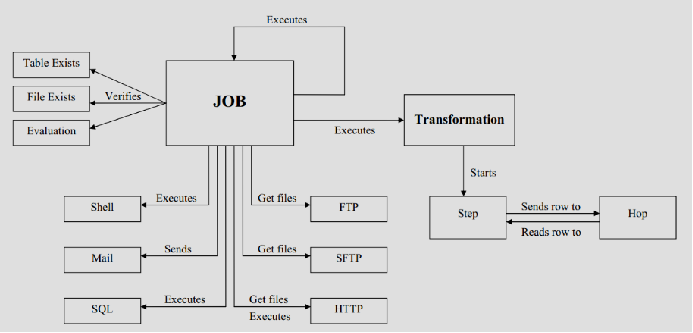
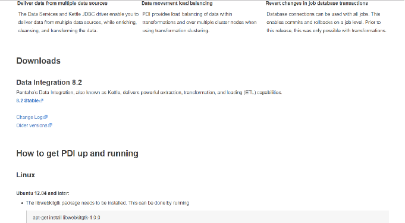
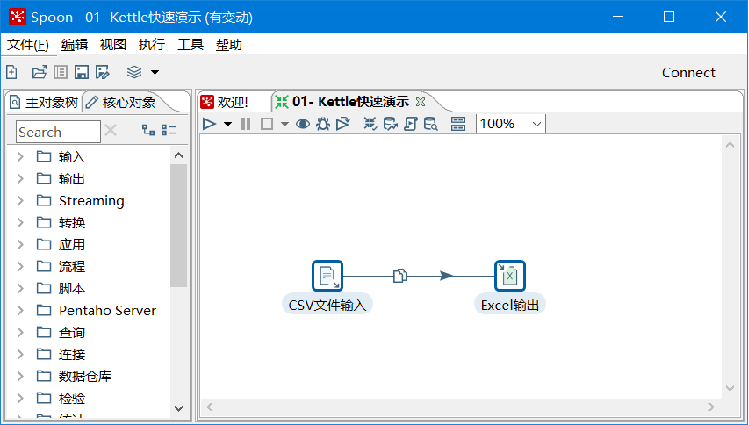
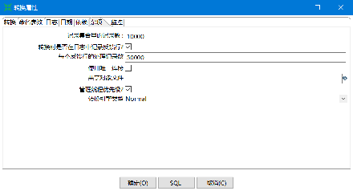
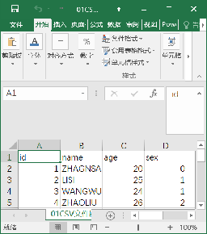
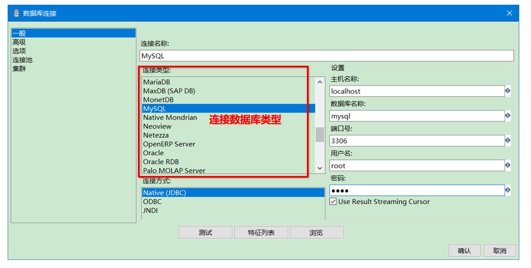
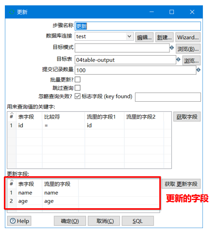
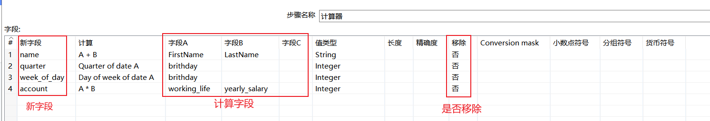
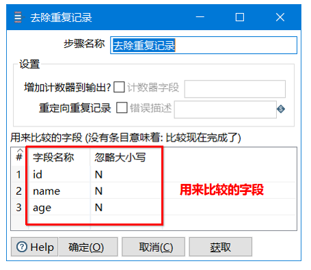
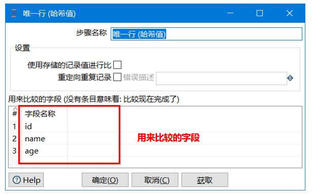

[TOC]


# kettle简介

## 企业数据仓库模型

企业数据仓库模型主要包含：数据仓库构建、数据仓库管理、数据分析。

## ETL简介

ETL（Extract-Transform-Load的缩写，即数据抽取、转换、装载的过程），对于企业或行业应用来说，我们经常会遇到各种数据的处理，转换，迁移，所以了解并掌握一种etl工具的使用，必不可少，这里我要学习的ETL工具是Kettle！

## Kettle简介

1. Kettle是一款国外开源的ETL工具，纯java编写，可以在Window、Linux、Unix上运行，绿色无需安装，数据抽取高效稳定。
2. Kettle 中文名称叫水壶，该项目的主程序员MATT 希望把各种数据放到一个壶里，然后以一种指定的格式流出。
3. Kettle这个ETL工具集，它允许你管理来自不同数据库的数据，通过提供一个图形化的用户环境来描述你想做什么，而不是你想怎么做。
4. Kettle中有两种脚本文件，transformation和job，transformation完成针对数据的基础转换，job则完成整个工作流的控制。
5. Kettle(现在已经更名为PDI，Pentaho Data Integration-Pentaho数据集成)。

## Kettle的结构


**Kettle的结构-Spoon和Data Integration Server**

- Spoon是构建ETL Jobs和Transformations的工具。Spoon以拖拽的方式图形化设计，能够通过spoon调用专用的数据集成引擎或者集群。

- Data Integration Server是一个专用的ETL Server，它的主要功能有：


**Kettle的结构-Enterprise Console**

- Enterprise Console（企业控制台）提供了一个小型的客户端，用于管理Pentaho Data Integration企业版的部署。
- 包括企业版本的证书管理、监控和控制远程Pentaho Data Integration服务器上的活动、分析已登记的作业和转换的动态绩效。

## kettle的核心组件


## Kettle概念模型



- Kettle的执行分为两个层次：Job（作业）和Transformation（转换）。

# Kettle下载

下载网址：https://community.hitachivantara.com/docs/DOC-1009855



## Kettle目录文件


classes:生命周期监听、注册表扩展、日志的配置文件
Data Integration.app:数据集成应用
Data Service JDBC Driver: JDBC驱动程序的数据服务
docs:文档
launcher:Kettle的启动配置
lib:支持库 jar包
libswt：Kettle图形库jar
plugins：插件
pwd：kettle集群配置文件
samples：自带例子
simple-jndi:jndi连接配置
system:系统目录
ui:软件界面


Carte.bat/Carte.sh:启动集群命令
Encr.bat/encr.sh：kettle提供的加密算法

Import.bat/import.sh：导入命令


Kitchen.bat/kitchen:运行Job的命令

Pan.bat/pan.sh:运行转换的命令


set-pentaho-env.bat/set-pentaho-env.sh：设置环境变量脚本

Spoon.bat/spoon.sh：启动KettleUI界面

SpoonDebug.bat/spoonDebug.sh：以Debug的方式运行Kettle

# Kettle部署

## 安装JDK

- 由于Kettle是Java语言开发的，该软件的允许需要Java运行环境的依赖。
- 需要先安装JDK,准备好Java软件的运行环境。

## 配置环境变量

JAVA_HOME：JDK的安装目录

KETTLE_HOME:kettle的解压目录


## 运行


# Kettle界面简介

## 工具栏  


## 工具图标


## 树形列表


## 工作区


# Kettle快速体验

任务：把数据从CSV文件复制到Excel文件

分析：


转换控件：


CSV文件输入：


Excel输出：


转换文件：


运行：



# 执行结果

## 日志  


## 步骤度量 


## Metrics

中文意思：度量、指标


## Preview data


# Kettle核心概念

## 可视化编程

- Kettle可以被归类为可视化编程语言(Visula Programming Languages,VPL),因为Kettle可以使用图形化的方式定义复杂的ETL程序和工作流。
- Kettle里的图就是转换和作业。
- 可视化编程一直是Kettle里的核心概念，它可以让你快速构建复杂的ETL作业和减低维护工作量。它通过隐藏很多技术细节，使IT领域更贴近于商务领域。

## 转换

- 转换(transaformation)是ETL解决方案中最主要的部分，它处理抽取、转换、加载各种对数据行的操作。
- 转换包含一个或多个步骤(step)，如读取文件、过滤数据行、数据清洗或将数据加载到数据库。
- 转换里的步骤通过跳(hop)来连接，跳定义一个单向通道，允许数据从一个步骤向另一个步骤流动。
- 在Kettle里，数据的单位是行，数据流就是数据行从一个步骤到另一个步骤的移动。
- 数据流有的时候也被称之为记录流。

## 步骤

- 步骤（控件）是转换里的基本的组成部分。

- 快速入门的案例中就存在两个步骤，“CSV文件输入”和“Excel输出”。

- 一个步骤有如下几个关键特性：
  ①步骤需要有一个名字，这个名字在转换范围内唯一。
  ②每个步骤都会读、写数据行(唯一例外是“生成记录”步骤，该步骤只写数据)。
  ③步骤将数据写到与之相连的一个或多个输出跳，再传送到跳的另一端的步骤。
  ④大多数的步骤都可以有多个输出跳。一个步骤的数据发送可以被被设置为分发和复制，分发是目标步骤轮流接收记录，复制是所有的记录被同时发送到所有的目标步骤。


## 跳


- 跳就是步骤之间带箭头的连线，跳定义了步骤之间的数据通路。

- 跳实际上是两个步骤之间的被称之为行集的数据行缓存（行集的大小可以在转换的设置里定义）。

  

- 当行集满了，向行集写数据的步骤将停止写入，直到行集里又有了空间。

- 当行集空了，从行集读取数据的步骤停止读取，直到行集里又有可读的数据行。

## 数据行

### 数据类型

- 数据以数据行的形式沿着步骤移动。一个数据行是零到多个字段的集合，字段包含下面几种数据类型。
  ①String:字符类型数据
  ②Number:双精度浮点数。
  ③Integer:带符号长整型（64位）。
  ④BigNumber:任意精度数据。
  ⑤Date:带毫秒精度的日期时间值。
  ⑥Boolean:取值为true和false的布尔值。
  ⑦Binary:二进制字段可以包含图像、声音、视频及其他类型的二进制数据。


### 元数据

每个步骤在输出数据行时都有对字段的描述，这种描述就是数据行的元数据。
通常包含下面一些信息。
①名称：行里的字段名应用是唯一的。
②数据类型：字段的数据类型。
③格式：数据显示的方式，如Integer的#、0.00。
④长度：字符串的长度或者BigNumber类型的长度。
⑤精度：BigNumber数据类型的十进制精度。
⑥货币符号：￥
⑦小数点符号:十进制数据的小数点格式。不同文化背景下小数点符号是不同的，一般是点（.）或逗号（，）。
⑧分组符号：数值类型数据的分组符号，不同文化背景下数字里的分组符号也是不同的，一般是点（.）或逗号（，）或单引号（’）


## 并行

- 跳的这种基于行集缓存的规则允许每个步骤都是由一个独立的线程运行，这样并发程度最高。这一规则也允许数据以最小消耗内存的数据流的方式来处理。在数据仓库里，我们经常要处理大量数据，所以这种并发低消耗内存的方式也是ETL工具的核心需求。
- 对于kettle的转换，不可能定义一个执行顺序，因为所有步骤都以并发方式执行：当转换启动后，所有步骤都同时启动，从它们的输入跳中读取数据，并把处理过的数据写到输入跳，直到输入跳里不再有数据，就中止步骤的运行。当所有的步骤都中止了，整个转换就中止了。 （要与数据流向区分开）

- 如果你想要一个任务沿着指定的顺序执行，那么就要使用后面所讲的“作业”！

# CSV文件输入

## 输入简介


## CSV文件输入

- CSV文件是一种带有固定格式的文本文件。




# 文本文件输入

- 提取日志信息的数据是开发常见的操作，日志信息基本都是文本类型。


任务：把文本文件的数据复制到excel文件。

# Excel输入

微软的Excel目前有两种后缀名的文件分别为：xls和xlsx。
xls:2007年之前
xlsx:2007年之后


任务：把Excel文件的数据复制到Excel文件

分析：

- 输入：Excel输入
- 输出：Excel输出


# 多文件合并

- 数据往往也是以多个文件的形式出现，有的数据还会分散在多个子文件夹。
- 所以合并数据也是开发中非常常见的操作。


任务：读取input目录下以04多文件合并开头的所有Excel数据合并到一个Excel。

分析：

- Excel输入
- Excel输出

# Get data from XML

## xml

- XML 指可扩展标记语言（EXtensible Markup Language）, XML 被设计用来传输和存储数据。

```xml
<messages>
	<note id="501">
		<to>George</to>
		<from>John</from>
		<heading>Reminder</heading>
		<body>Dont't forget the meeting!</body>
	</note>
	<note id="502">
		<to>John</to>
		<from>George</from>
		<heading>Re: Reminder</heading>
		<body>I will not</body>
	</note>
</messages>
```

## XPath

- XPath即为XML路径语言（XML Path Language），它是一种用来确定XML文档中某部分位置的语言。
- XPath基于XML的树状结构，提供在数据结构树中找寻节点的能力。

- 选取节点 XPath 使用路径表达式在 XML 文档中选取节点。节点是通过沿着路径或者 step 来选取的。

- 下面列出了最有用的路径表达式：

| 表达式   | 描述                                                       |
| -------- | ---------------------------------------------------------- |
| nodename | 选取此节点的所有子节点                                     |
| /        | 从根节点选取                                               |
| //       | 从匹配选择的当前节点选择文档中的节点，而不考虑它们的位置。 |
| .        | 选取当前节点                                               |
| ..       | 选取当前节点的父节点                                       |
| @        | 选取属性                                                   |

**XPath-路径表达式-示例**

| 路径表达式     | 结果                                                         |
| -------------- | ------------------------------------------------------------ |
| bookstore      | 选取bookstore元素的所有子节点                                |
| /bookstore     | 选取根元素bookstore。注释：假如路径起始于正斜杠（/），则此路径始终代表到某元素的绝对路径！ |
| bookstore/book | 选取属于bookstore的子元素的所有book元素                      |
| //book         | 选取所有book子元素，而不管它们在文档中的位置                 |
| bookstore/book | 选择属于bookstore元素的后代的所有book元素，而不管它们位于bookstore之下的什么位置。 |
| //@lang        | 选取名为lang的所有属性。                                     |

## Get data from XML


任务：从xml文件中提取testDescription、rowID、v1、v2数据保存到excel中

循环读取的路径/AllRows/Rows/Row

分析：

- 输入：Get data from XML
- 输出：Excel输出


# JSON Input

## JSON

- JSON(JavaScript Object Notation, JS 对象简谱) 是一种轻量级的数据交换格式。
- JSON核心概念：数组、对象、属性
  - 数组：[ ]
  - 对象：{ }
  - 属性：key:value

## JSONPath

- JSONPath类似于XPath在xml文档中的定位，JsonPath表达式通常是用来路径检索或设置Json的。
- 其表达式可以接受“dot–notation”（点记法）和“bracket–notation”（括号记法）格式

- 点记法：$.store.book[0].title
- 括号记法：$ [ ‘store’ ] [ ‘book’ ] [0] [ ‘title’ ]

**JSONPath-操作符**


## JSON Input


任务：从json文件提取id、field和value数据到excel

分析：

- 输入：JSON Input （两次）
- 输出：Excel输出


# 生成记录

## 静态数据

- 数据仓库中绝大多数的数据都是业务系统生成的动态数据，但是其中一部分维度数据不是动态的，比如：日期维度。
- 静态维度数据就可以提前生成。


任务：往excel文件中插入1000条记录：id为1，name为itheima，age为18

分析：

- 输入：生成记录
- 输出：Excel输出


# 表输入

## 数据库驱动

- 数据库驱动是不同数据库开发商（比如oracle mysql等）为了某一种开发语言环境（比如java）能够实现统一的数据库调用而开发的一个程序，他的作用相当于一个翻译人员。


## MySQL和Navicat for MySQL

- 根据MySQL数据库不同的版本，下载对应的Java驱动程序。

**MySQL驱动下载**：https://dev.mysql.com/downloads/connector/j/


## 表输入





任务：从MySql数据库的mysql库的user表获取所有数据插入到Excel文件

分析：

- 输入：表输入
- 输出：Excel输出


# Excel输出

## 输出


- 输出是转换里面的第二个分类。
- 输出属于ETL的L，L就是Load加载。

##  Excel

- 微软的Excel目前有两种后缀名的文件分别为：xls和xlsx。
  - xls:2007年之前
  - xlsx:2007年之后

## Excel输出


任务：从mysql数据库的mysql库的user表读取数据插入到excel的.xls和.xlsx的文件中

分析：

- 输入：表输入
- 输出：Excel输出和Microsoft Excel输出


# 文本文件输出

- 数据操作常见的格式是：TXT和CSV。


任务：从mysql数据库的mysql库的user表读取数据插入到.txt和.csv的文件中

分析：

- 输入：表输入
- 输出：文本文件输出


# SQL文件输出

- SQL文件输出可以导出数据库表的结构和数据。


任务：获取mysql库的user表的结构和数据的SQL文件

分析：

- 输入：表输入
- 输出：SQL文件输出


# 表输出

- 表输出就是把数据写入到指定的表！


任务：从excel中读取id,name,age字段的数据，并写入到mysql数据库的04table-output表中

分析：

- 输入：Excel输入
- 输出：表输出


# 更新

- 更新就是把数据库已经存在的记录与数据流里面的记录进行比对，如果不同就进行更新。
- 注意：如果记录不存在，则会出现错误！





任务：从Excel读取数据，并把数据更新到test数据库的04table-output中

分析：

- 输入：Excel输入
- 输出：更新


# 插入更新

- 插入更新就是把数据库已经存在的记录与数据流里面的记录进行比对，如果不同就进行更新。
- 如果记录不存在，则会插入数据！


任务：从excel中读取id,name,age字段的数据，并插入更新到mysql数据库的04table-output表中

分析：

- 输入：Excel输入
- 输出：插入更新


# 删除

## 自定义常量数据

- 自定义常量数据就是生成key-value形式的常量数据。


## 删除

- 删除就是删除数据库表中指定条件的数据。


任务：从mysql数据库04table-output表中删除指定id为1的数据

分析：

- 输入：自定义常量数据
- 输出：删除


# kettle转换控件

## Concat fields

### 转换


- 转换属于ETL的T，T就是Transform清洗、转换。
- ETL三个部分中，T花费时间最长,是“一般情况下这部分工作量是整个ETL的2/3。

### Concat fields

- Concat fields就是多个字段连接起来形成一个新的字段。


任务：从Excel中获取FirstName和LastName并把FirstName和LastName连接起来，输出到Excel。

分析：

- 输入：表输入
- 转换：Concat fields
- 输出：Microsoft Excel输出


## 值映射

- 值映射就是把字段的一个值映射成其他的值。

- 在数据质量规范上使用非常多，比如很多系统对应性别gender字段的定义不同。
  系统1：1 男、2女
  系统2：f 男、m 女
  数据仓库统一为：female 男、male女


任务：从Excel中读取数据，并把gender里面的f和m转换为female和male,写入到Excel文件。

分析：

- 输入：Excel输入
- 转换：值映射
- 输出：Microsoft Excel输出


## 增加常量

- 增加常量就是在本身的数据流里面添加一列数据，该列的数据都是相同的值。


任务：从Excel读取数据，增加一个新列language值为en，把数据保存在Excel中。

分析：

- 输入：Excel输入
- 转换：增加常量
- 输出：Microsoft Excel输出


## 增加序列

- 增加序列是给数据流添加一个序列字段。


任务：从Excel读取数据，并添加序列，把数据保存到Excel。

分析：

- 输入：Excel输入
- 转换：增加序列
- 输出：Microsoft Excel输出


## 字段选择

- 字段选择是从数据流中选择字段、改变名称、修改数据类型。


任务：从Excel读取数据，移除language和country，并把phone列名该为telphone，id列名改为key，把gender列名该为sex。

分析：

- 输入：Excel输入
- 转换：字段选择
- 输出：Microsoft Excel输出


## 计算器

计算器是一个函数集合来创建新的字段，还可以设置字段是否移除（临时字段）。



任务：从Excel中读取数据，生成name,quarter,week_of_day,account列，把数据存在到Excel中间中。

分析：

- 输入：Excel输入
- 转换：计算器
- 输出：Microsoft Excel输出


## 字符串-剪切-操作-替换

### 剪切字符串

- 剪切字符串是指定输入流字段裁剪的位置剪切出新的字段。


### 字符串替换

- 字符串替换是指定搜索内容和替换内容，如果输入流的字段匹配上搜索内容就进行替换生成新字段。


### 字符串操作

- 字符串操作是去除字符串两端的空格和大小写切换，并生成新的字段。


任务：从Excel中读取数据，获取title的首位字符，生成title_begin字段，把description中的1111替换为itheima生成desc字段，去除author两边的空格，字符变大写，生成author_update，保存到Excel。

分析：

- 输入：Excel输入
- 转换：剪切字符串、字符串替换、字符串操作
- 输出：Microsoft Excel输出


## 去除重复记录+排序记录

### 去除重复记录

- 去除重复记录是去除数据流里面相同的数据行。
- 注意：必须先对数据流进行排序！



### 排序记录

- 排序记录是按照指定的字段的升序或降序对数据流排序。


任务：从Excel中读取数据，去除重复的数据，并保存到Excel。

分析：

- 输入：Excel输入
- 转换：排序记录、去除重复记录
- 输出：Microsoft Excel输出


## 唯一行（哈希值）

- 唯一行（哈希值）就是删除数据流重复的行（不包含排序）。
- 注意：唯一行（哈希值）和（排序记录+去除重复记录）效果一样的，但是实现的原理不同！
- 唯一行（哈希值）执行的效率会高一些！



任务：从Excel中读取数据，去除重复的数据，并保存到Excel。

分析：

- 输入：Excel输入
- 转换：唯一行（哈希值）
- 输出：Microsoft Excel输出


## 拆分字段

- 拆分字段是把字段按照分隔符拆分成两个或多个字段。
- 注意：拆分字段后，原字段就不存在于数据流中！


任务：从Excel读取数据，把name拆分为FirstName和LastName,并保存数据到Excel。

分析：

- 输入：Excel输入
- 转换：拆分字段
- 输出：Microsoft Excel输出


## 列拆分为多行

