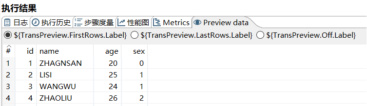
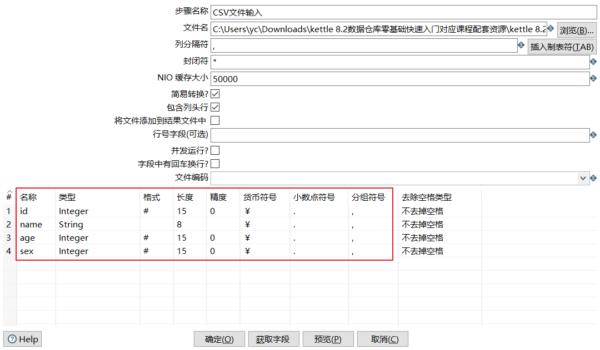

[TOC]

# kettle简介

## 企业数据仓库模型

企业数据仓库模型主要包含：数据仓库构建、数据仓库管理、数据分析。

## ETL简介

ETL（Extract-Transform-Load的缩写，即数据抽取、转换、装载的过程），对于企业或行业应用来说，我们经常会遇到各种数据的处理，转换，迁移，所以了解并掌握一种etl工具的使用，必不可少，这里我要学习的ETL工具是Kettle！

## Kettle简介

1. Kettle是一款国外开源的ETL工具，纯java编写，可以在Window、Linux、Unix上运行，绿色无需安装，数据抽取高效稳定。
2. Kettle 中文名称叫水壶，该项目的主程序员MATT 希望把各种数据放到一个壶里，然后以一种指定的格式流出。
3. Kettle这个ETL工具集，它允许你管理来自不同数据库的数据，通过提供一个图形化的用户环境来描述你想做什么，而不是你想怎么做。
4. Kettle中有两种脚本文件，transformation和job，transformation完成针对数据的基础转换，job则完成整个工作流的控制。
5. Kettle(现在已经更名为PDI，Pentaho Data Integration-Pentaho数据集成)。

## Kettle的结构

**Kettle的结构-Spoon和Data Integration Server**

- Spoon是构建ETL Jobs和Transformations的工具。Spoon以拖拽的方式图形化设计，能够通过spoon调用专用的数据集成引擎或者集群。

- Data Integration Server是一个专用的ETL Server，它的主要功能有：

**Kettle的结构-Enterprise Console**

- Enterprise Console（企业控制台）提供了一个小型的客户端，用于管理Pentaho Data Integration企业版的部署。
- 包括企业版本的证书管理、监控和控制远程Pentaho Data Integration服务器上的活动、分析已登记的作业和转换的动态绩效。

## kettle的核心组件

## Kettle概念模型

- Kettle的执行分为两个层次：Job（作业）和Transformation（转换）。

# Kettle下载

下载网址：https://community.hitachivantara.com/docs/DOC-1009855

## Kettle目录文件

classes:生命周期监听、注册表扩展、日志的配置文件
Data Integration.app:数据集成应用
Data Service JDBC Driver: JDBC驱动程序的数据服务
docs:文档
launcher:Kettle的启动配置
lib:支持库 jar包
libswt：Kettle图形库jar
plugins：插件
pwd：kettle集群配置文件
samples：自带例子
simple-jndi:jndi连接配置
system:系统目录
ui:软件界面

Carte.bat/Carte.sh:启动集群命令
Encr.bat/encr.sh：kettle提供的加密算法

Import.bat/import.sh：导入命令

Kitchen.bat/kitchen:运行Job的命令

Pan.bat/pan.sh:运行转换的命令

set-pentaho-env.bat/set-pentaho-env.sh：设置环境变量脚本

Spoon.bat/spoon.sh：启动KettleUI界面

SpoonDebug.bat/spoonDebug.sh：以Debug的方式运行Kettle

# Kettle部署

## 安装JDK

- 由于Kettle是Java语言开发的，该软件的允许需要Java运行环境的依赖。
- 需要先安装JDK,准备好Java软件的运行环境。

## 配置环境变量

JAVA_HOME：JDK的安装目录

KETTLE_HOME:kettle的解压目录

## 运行

# Kettle界面简介

## 工具栏  

## 工具图标

## 树形列表

## 工作区

# Kettle快速体验

任务：把数据从CSV文件复制到Excel文件

分析：

转换控件：

CSV文件输入：

Excel输出：

转换文件：

运行：

# 执行结果

## 日志  

## 步骤度量 

## Metrics

中文意思：度量、指标

## Preview data

# Kettle核心概念

## 可视化编程

- Kettle可以被归类为可视化编程语言(Visula Programming Languages,VPL),因为Kettle可以使用图形化的方式定义复杂的ETL程序和工作流。
- Kettle里的图就是转换和作业。
- 可视化编程一直是Kettle里的核心概念，它可以让你快速构建复杂的ETL作业和减低维护工作量。它通过隐藏很多技术细节，使IT领域更贴近于商务领域。

## 转换

- 转换(transaformation)是ETL解决方案中最主要的部分，它处理抽取、转换、加载各种对数据行的操作。
- 转换包含一个或多个步骤(step)，如读取文件、过滤数据行、数据清洗或将数据加载到数据库。
- 转换里的步骤通过跳(hop)来连接，跳定义一个单向通道，允许数据从一个步骤向另一个步骤流动。
- 在Kettle里，数据的单位是行，数据流就是数据行从一个步骤到另一个步骤的移动。
- 数据流有的时候也被称之为记录流。

## 步骤

- 步骤（控件）是转换里的基本的组成部分。

- 快速入门的案例中就存在两个步骤，“CSV文件输入”和“Excel输出”。

- 一个步骤有如下几个关键特性：
  ①步骤需要有一个名字，这个名字在转换范围内唯一。
  ②每个步骤都会读、写数据行(唯一例外是“生成记录”步骤，该步骤只写数据)。
  ③步骤将数据写到与之相连的一个或多个输出跳，再传送到跳的另一端的步骤。
  ④大多数的步骤都可以有多个输出跳。一个步骤的数据发送可以被被设置为分发和复制，分发是目标步骤轮流接收记录，复制是所有的记录被同时发送到所有的目标步骤。

## 跳

- 跳就是步骤之间带箭头的连线，跳定义了步骤之间的数据通路。

- 跳实际上是两个步骤之间的被称之为行集的数据行缓存（行集的大小可以在转换的设置里定义）。

  

- 当行集满了，向行集写数据的步骤将停止写入，直到行集里又有了空间。

- 当行集空了，从行集读取数据的步骤停止读取，直到行集里又有可读的数据行。

## 数据行

### 数据类型

- 数据以数据行的形式沿着步骤移动。一个数据行是零到多个字段的集合，字段包含下面几种数据类型。
  ①String:字符类型数据
  ②Number:双精度浮点数。
  ③Integer:带符号长整型（64位）。
  ④BigNumber:任意精度数据。
  ⑤Date:带毫秒精度的日期时间值。
  ⑥Boolean:取值为true和false的布尔值。
  ⑦Binary:二进制字段可以包含图像、声音、视频及其他类型的二进制数据。

### 元数据

每个步骤在输出数据行时都有对字段的描述，这种描述就是数据行的元数据。
通常包含下面一些信息。
①名称：行里的字段名应用是唯一的。
②数据类型：字段的数据类型。
③格式：数据显示的方式，如Integer的#、0.00。
④长度：字符串的长度或者BigNumber类型的长度。
⑤精度：BigNumber数据类型的十进制精度。
⑥货币符号：￥
⑦小数点符号:十进制数据的小数点格式。不同文化背景下小数点符号是不同的，一般是点（.）或逗号（，）。
⑧分组符号：数值类型数据的分组符号，不同文化背景下数字里的分组符号也是不同的，一般是点（.）或逗号（，）或单引号（’）

## 并行

- 跳的这种基于行集缓存的规则允许每个步骤都是由一个独立的线程运行，这样并发程度最高。这一规则也允许数据以最小消耗内存的数据流的方式来处理。在数据仓库里，我们经常要处理大量数据，所以这种并发低消耗内存的方式也是ETL工具的核心需求。
- 对于kettle的转换，不可能定义一个执行顺序，因为所有步骤都以并发方式执行：当转换启动后，所有步骤都同时启动，从它们的输入跳中读取数据，并把处理过的数据写到输入跳，直到输入跳里不再有数据，就中止步骤的运行。当所有的步骤都中止了，整个转换就中止了。 （要与数据流向区分开）

- 如果你想要一个任务沿着指定的顺序执行，那么就要使用后面所讲的“作业”！

# CSV文件输入

## 输入简介

## CSV文件输入

- CSV文件是一种带有固定格式的文本文件。

# 文本文件输入

- 提取日志信息的数据是开发常见的操作，日志信息基本都是文本类型。

任务：把文本文件的数据复制到excel文件。