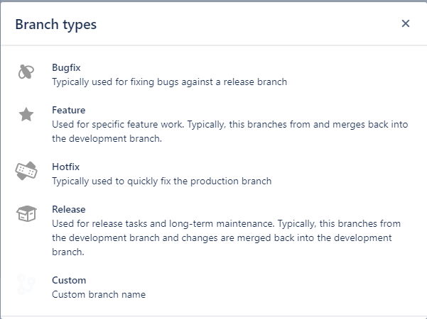

# Jira介绍

每次提需求或者bug，都会进行下列五项操作。

TO DO: 待办事项（新需求、bug等）

IN PROGRESS: 进行中（正在开发）

IN REVIEW: 检查中（自测、合并中）

TO VERIFY: 验证（QA测试中）

DONE: 完成（已解决）

在创建分支时，会定义一些分支类型，通常如下：

Bugfix:错误修复（通常用于针对发布分支修复bug）

Feature：指定功能（用于特定的功能工作，通常，该分支的创建来源于开发分支并且合并到开发分支中去。

Hotfix：修补程序（通常用于快速修复生产分支）

Release：发布（用于发布任务和长期维护。通常，这些分支来自开发分支，并且更改被合并回开发分支。）

Custom：自定义分支名称

常用简称：

RD：研发（Research and Development）

QA：测试（QUALITY ASSURANCE，中文意思是“质量保证”）

PO：产品运营(Product Operation)

