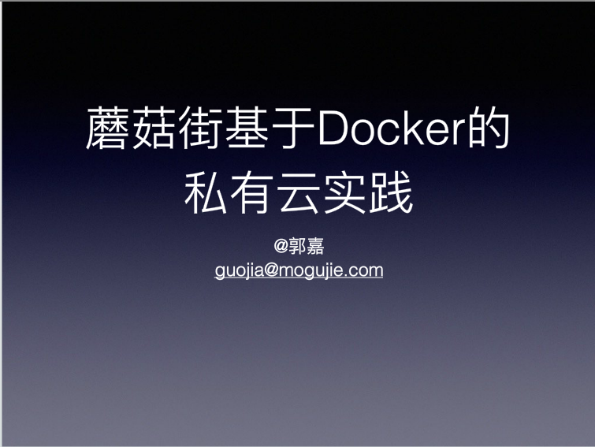

# 1. 概述

## 1.1.   现实问题

一款产品从开发到上线，从操作系统到运行环境，再到应用配置。作为开发+运维之间的协作我们需要关心很多东西，这也是很多互联网公司都不得不面对的问题，特别是各种版本的迭代之后，不同版本**环境的兼容**，对运维人员都是考验

之前在服务器配置一个应用的运行环境，要安装各种软件，就拿实际做过的项目的环境来说吧，Java/Tomcat/MySQL/JDBC驱动包等。安装和配置这些东西有多麻烦就不说了，它还不能跨平台。假如我们是在 Windows 上安装的这些环境，到了 Linux 又得重新装。况且就算不跨操作系统，换另一台同样操作系统的服务器，要移植应用也是非常麻烦的。

传统上认为，软件编码开发/测试结束后，所产出的成果即是程序或是能够编译执行的二进制字节码等(java为例)。而为了让这些程序可以顺利执行，开发团队也得准备完整的部署文件，让维运团队得以部署应用程式，**开发需要清楚的告诉运维部署团队，用的全部配置文件+所有软件环境。**不过，即便如此，仍然常常发生部署失败的状况。

环境配置如此麻烦，换一台机器，就要重来一次，旷日费时。很多人想到，能不能从根本上解决问题，软件可以带环境安装？也就是说，安装的时候，把原始环境一模一样地复制过来。


## 1.2.   虚拟机技术

虚拟机（virtual machine）就是带环境安装的一种解决方案。
它可以在一种操作系统里面运行另一种操作系统，比如在Windows 系统里面运行Linux 系统。应用程序对此毫无感知，因为虚拟机看上去跟真实系统一模一样，而对于底层系统来说，虚拟机就是一个普通文件，不需要了就删掉，对其他部分毫无影响。这类虚拟机完美的运行了另一套系统，能够使应用程序，操作系统和硬件三者之间的逻辑不变。  


虚拟机的缺点：
1    资源占用多               2    冗余步骤多                 3    启动慢


## 1.3.   Linux 容器

由于前面虚拟机存在这些缺点，Linux 发展出了另一种虚拟化技术：Linux 容器（Linux Containers，缩写为 LXC）。
**Linux 容器不是模拟一个完整的操作系统，而是对进程进行隔离。**有了容器，就可以**将软件运行所需的所有资源打包到一个隔离的容器中**。容器与虚拟机不同，不需要捆绑一整套操作系统，只需要软件工作所需的库资源和设置。系统因此而变得高效轻量并保证部署在任何环境中的软件都能始终如一地运行。


由于容器是进程级别的，相比虚拟机有很多优势。

**（1）启动快**

传统虚拟机技术是虚拟出一套硬件后，在其上运行一个完整操作系统，在该系统上再运行所需应用进程；而**容器内的应用进程直接运行于宿主的内核**，容器内没有自己的内核，而且也没有进行硬件虚拟。因此容器要比传统虚拟机更为轻便。所以，启动容器相当于启动本机的一个进程，而不是启动一个操作系统，速度就快很多。

**（2）资源占用少**

容器只占用需要的资源，不占用那些没有用到的资源；虚拟机由于是完整的操作系统，不可避免要占用所有资源。另外，**多个容器可以共享资源，虚拟机都是独享资源**。

**（3）体积小**

容器只要包含用到的组件即可，而虚拟机是整个操作系统的打包，所以容器文件比虚拟机文件要小很多。

总之，容器有点像轻量级的虚拟机，能够提供虚拟化的环境，但是成本开销小得多。


## 1.4.   docker介绍

**Docker 属于 Linux 容器的一种封装，提供简单易用的容器使用接口。**它是目前最流行的 Linux 容器解决方案。


Docker是基于Go语言实现的云开源项目。
Docker的主要目标是“Build，Ship and Run Any App,Anywhere”，也就是通过对应用组件的封装、分发、部署、运行等生命周期的管理，使用户的APP（可以是一个WEB应用或数据库应用等等）及其运行环境能够做到“**一次封装，到处运行**”。


Docker镜像的设计，使得Docker得以打破过去「程序即应用」的观念。**通过镜像(images)将系统核心之外，应用程序运作所需要的系统环境，由下而上打包，达到应用程式跨平台间的无缝接轨运作。**

Docker 将应用程序与该程序的依赖，打包在一个文件里面。运行这个文件，就会生成一个虚拟容器。程序在这个虚拟容器里运行，就好像在真实的物理机上运行一样。有了 Docker，就不用担心环境问题，这就实现了跨平台、跨服务器。**只需要一次配置好环境，换到别的机子上就可以一键部署好，大大简化了操作**


## 1.5.   docker的优势

符合企业级开发中的devops思想，可以做到一次构建、随处运行：

1. **更快速的应用交付和部署**

   传统的应用开发完成后，需要提供一堆安装程序和配置说明文档，安装部署后需根据配置文档进行繁杂的配置才能正常运行。Docker化之后**只需要交付少量容器镜像文件，在正式生产环境加载镜像并运行即可**，应用安装配置在镜像里已经内置好，大大节省部署配置和测试验证时间。

2. **更便捷的升级和扩缩容**

   随着微服务架构和Docker的发展，大量的应用会通过微服务方式架构，应用的开发构建将变成搭乐高积木一样，每个Docker容器将变成一块“积木”，应用的升级将变得非常容易。当现有的容器不足以支撑业务处理时，**可通过镜像运行新的容器进行快速扩容，使应用系统的扩容从原先的天级变成分钟级甚至秒级。**

3. **更简单的系统运维**

   应用容器化运行后，**生产环境运行的应用可与开发、测试环境的应用高度一致**，容器会将应用程序相关的环境和状态完全封装起来，不会因为底层基础架构和操作系统的不一致性给应用带来影响，产生新的BUG。当出现程序异常时，也可以通过测试环境的相同容器进行快速定位和修复。

4. **更高效的计算资源利用**

   **Docker是内核级虚拟化，其不像传统的虚拟化技术一样需要额外的Hypervisor支持**，所以在一台物理机上可以运行很多个容器实例，可大大提升物理服务器的CPU和内存的利用率。

从下面这张表格很清楚地看到容器相比于传统虚拟机的特性的优势所在：

| 特性       | 容器               | 虚拟机       |
| :--------- | :----------------- | :----------- |
| 启动       | 秒级               | 分钟级       |
| 硬盘使用   | 一般为MB           | 一般为GB     |
| 性能       | 接近原生           | 弱于         |
| 系统支持量 | 单机支持上千个容器 | 一般是几十个 |


## 1.6.   docker企业级实践

docker自2013年诞生起，便迅速在全球范围内火爆起来，当前很多互联网型公司都在使用docker。例如：阿里巴巴、网易、新浪、美团、蘑菇街等等

### 1.6.1.    新浪


### 1.6.2.    美团


### 1.6.3.    蘑菇街




# 2. 下载及安装

docker官网：http://www.docker.com

docker中文网站：https://www.docker-cn.com/

Docker Hub仓库官网: https://hub.docker.com/

Docker 是一个开源的商业产品，有两个版本：社区版（Community Edition，缩写为 CE）和企业版（Enterprise Edition，缩写为 EE）。企业版包含了一些收费服务，个人开发者一般用不到。下面的介绍都针对社区版。

这里我们安装linux centOS版本

 


## 2.1.   环境要求

1. CentOS Docker支持以下的CentOS版本：

- CentOS 7 (64-bit)

- CentOS 6.5 (64-bit) 或更高的版本


2. 前提条件

目前，CentOS 仅发行版本中的内核支持 Docker。

Docker 运行在 CentOS 7 上，要求系统为64位、系统内核版本为 3.10 以上。

Docker 运行在 CentOS-6.5 或更高的版本的 CentOS 上，要求系统为64位、系统内核版本为 2.6.32-431 或者更高版本。


查看自己的内核
uname命令用于打印当前系统相关信息（内核版本号、硬件架构、主机名称和操作系统类型等）。

```shell
uname -r
cat /etc/redhat-release
```


## 2.2.   安装

### 2.2.1.    centos6.8

1. Docker使用EPEL发布，RHEL系的OS首先要确保已经持有EPEL仓库，否则先检查OS的版本，然后安装相应的EPEL包。

```
yum install -y epel-release
```


2. 安装docker

```
yum install -y docker-io
```


3. 配置docker（使用默认配置即可）

安装后的配置文件：/etc/sysconfig/docker


4. 启动Docker后台服务：service docker start
5. docker version验证

 


### 2.2.2.    centos7

可以参考官方文档：https://docs.docker.com/install/linux/docker-ce/centos/

官网中文安装手册：https://docs.docker-cn.com/engine/installation/linux/docker-ce/centos/#prerequisites

确保系统是centOS7系统及以上版本，并且网络连接正常。


1. 如果已经安装过，卸载旧版本：

```shell
yum -y remove docker \
    docker-client \
    docker-client-latest \
    docker-common \
    docker-latest \
    docker-latest-logrotate \
    docker-logrotate \
    docker-engine
```


2. yum安装gcc相关

```shell
yum -y install gcc
yum -y install gcc-c++
```


3. 安装需要的软件包

```shell
yum install -y yum-utils device-mapper-persistent-data lvm2
```


4. 设置yum仓库

```shell
yum-config-manager --add-repo http://mirrors.aliyun.com/docker-ce/linux/centos/docker-ce.repo
```

注意：这里不要使用官方仓库，使用阿里仓库，否则后续yum安装可能报错。

报错：
	1   [Errno 14] curl#35 - TCP connection reset by peer

​	2   [Errno 12] curl#35 - Timeout


5. 更新yum软件包索引（速度可能较慢）

```shell
yum makecache fast
```


6. 安装DOCKER CE（容器管理工具）

```shell
yum -y install docker-ce
```

如果报错，重新执行安装一次

7. 启动docker

```shell
systemctl start docker
```


8. 测试

```shell
docker version
# 或者
docker run hello-world
```


9. 卸载

```shell
systemctl stop docker 
yum -y remove docker-ce
rm -rf /var/lib/docker
```


## 2.3.   基本概念

`Docker` 中包括三个基本的概念：

- `Image`（镜像）
- `Container`（容器）
- `Repository`（仓库）

镜像是 `Docker` 运行容器的前提，仓库是存放镜像的场所，可见镜像更是 `Docker` 的核心。


**镜像（Image）**

​		Docker 镜像（Image）就是一个只读的模板。镜像可以用来创建 Docker 容器，一个镜像可以创建很多容器。

​		`Docker` 镜像可以看作是一个特殊的文件系统，除了提供容器运行时所需的程序、库、资源、配置等文件外，还包含了一些为运行时准备的一些配置参数（如匿名卷、环境变量、用户等）。镜像不包含任何动态数据，其内容在构建之后也不会被改变。


**容器（Container）**

​		Docker 利用容器（Container）独立运行的一个或一组应用。容器是用镜像创建的运行实例。

​		它可以被启动、开始、停止、删除。每个容器都是相互隔离的、保证安全的平台。

​		可以把容器看做是一个简易版的 Linux 环境（包括root用户权限、进程空间、用户空间和网络空间等）和运行在其中的应用程序。

​		容器的定义和镜像几乎一模一样，也是一堆层的统一视角，唯一区别在于容器的最上面那一层是可读可写的。


**仓库（repository）**

​		仓库（Repository）是**集中存放镜像文件的场所。**

​		**仓库**(Repository)和**仓库注册服务器**（Registry）是有区别的。**仓库注册服务器上往往存放着多个仓库，每个仓库中又包含了多个镜像，每个镜像有不同的标签（tag）。标签就是对应软件的各个版本**

​		仓库分为公开仓库（Public）和私有仓库（Private）两种形式。

​		最大的公开仓库是 Docker Hub(https://hub.docker.com/)，存放了数量庞大的镜像供用户下载。国内的公开仓库包括阿里云 、网易云 等


总结：

Docker 本身是一个**容器运行载体或称之为管理引擎**。我们把应用程序和配置依赖打包好形成一个可交付的运行环境，这个打包好的运行环境就是 image镜像文件。只有通过这个镜像文件才能生成 Docker 容器。image 文件可以看作是容器的模板。Docker 根据 image 文件生成容器的实例。同一个 image 文件，可以生成多个同时运行的容器实例。

*  image 文件可以生成容器实例，本身也是一个文件，称为镜像文件。

*  一个容器运行一种服务，当我们需要的时候，就可以通过docker客户端创建一个对应的运行实例，也就是我们的容器

* 至于仓库，就是放了一堆镜像的地方，我们可以把镜像发布到仓库中，需要的时候从仓库中拉下来就可以了。


## 2.4.   配置镜像加速

鉴于国内网络问题，后续拉取 Docker 镜像十分缓慢，我们可以需要配置加速器来解决：

1. 阿里云镜像
2. 网易镜像

### 2.4.1.   获取阿里镜像地址

登陆阿里云开发者平台，找到“容器镜像服务”：


镜像加速器地址，每个人都不一样


### 2.4.2.    centos6.8配置镜像地址

1）vim /etc/sysconfig/docker

   将获得的自己账户下的阿里云加速地址配置进去

other_args="--registry-mirror=https://你自己的账号加速信息.mirror.aliyuncs.com"

2）重新启动Docker后台服务：service docker restart

3）Linux 系统下配置完加速器需要检查是否生效


### 2.4.3.    centos7配置镜像地址

```shell
mkdir -p /etc/docker
vim /etc/docker/daemon.json
systemctl daemon-reload
systemctl restart docker
```

daemon.json文件的内容如下：

```
{"registry-mirrors": ["http://hub-mirror.c.163.com"] }
{
  "registry-mirrors": ["自己的阿里云加速器地址"]
}

```

查看服务状态：能正常启动，说明配置成功了

如果运行失败，执行dockerd命令查看错误


## 2.5.   docker run hello-world


运行流程如下：


## 2.6.   再谈底层原理

**Docker是怎么工作的？**

Docker是一个Client-Server结构的系统，Docker守护进程运行在主机上， 然后通过Socket连接从客户端访问，守护进程从客户端接受命令并管理运行在主机上的容器。 **容器，是一个运行时环境，就是我们前面说到的集装箱**。


**为什么Docker比较比VM快？**

(1)docker有着比虚拟机更少的抽象层。由于docker不需要Hypervisor实现硬件资源虚拟化,运行在docker容器上的程序直接使用的都是实际物理机的硬件资源。因此在CPU、内存利用率上docker将会在效率上有明显优势。

(2)docker利用的是宿主机的内核,而不需要Guest OS。因此,当新建一个容器时,docker不需要和虚拟机一样重新加载一个操作系统内核。仍而避免引寻、加载操作系统内核返个比较费时费资源的过程,当新建一个虚拟机时,虚拟机软件需要加载Guest OS,返个新建过程是分钟级别的。而docker由于直接利用宿主机的操作系统,则省略了返个过程,因此新建一个docker容器只需要几秒钟。


# 3. 常用命令

## 3.1.   基础命令

```shell
docker version # 查看docker版本信息
docker info # 查看docker及环境信息
docker help # 查看帮助文档
```


## 3.2.   镜像命令

```shell
docker images  # 列出本地主机上的镜像
docker search [options] <某个XXX镜像名字>  # 搜索镜像
docker pull <某个XXX镜像名字>  # 下载镜像
docker rmi [options] <某个XXX镜像名字ID>  # 删除镜像
```


### 3.2.1.    查询本机镜像

```shell
docker images  # 列出本地主机上的镜像
	-a #列出本地所有的镜像（含中间映像层）
	-q #只显示镜像ID。
	--digests #显示镜像的摘要信息
	--no-trunc #显示完整的镜像信息
```


各个选项说明:

```
REPOSITORY：表示镜像的仓库源
TAG：镜像的标签
IMAGE ID：镜像ID
CREATED：镜像创建时间
SIZE：镜像大小
```

 同一仓库源可以有多个 TAG，代表这个仓库源的不同个版本，我们使用 

REPOSITORY:TAG 来定义不同的镜像。

如果你不指定一个镜像的版本标签，例如你只使用 ubuntu，docker 将默认使用 ubuntu:latest 镜像


### 3.2.2.    搜索镜像

```shell
docker search [options] <某个XXX镜像名字>  # 搜索镜像
	--no-trunc # 显示完整的镜像描述
	-s # 列出收藏数不小于指定值的镜像。
	--automated # 只列出 automated build类型的镜像
```

镜像的搜索都是到官网搜索（**docker hub**），使用命令搜索的结果和在网站上搜索的结果一致。

下载可以通过镜像加速下载，搜索都是在官网搜索的。


### 3.2.3.    下载镜像

```shell
docker pull 镜像名字[:TAG] # 默认是最新版本，可以指定版本号下载
```

1. 下载centos


2. 下载nginx


3. 下载tomcat


### 3.2.4.    删除镜像

```shell
docker rmi [options] <某个XXX镜像名字ID>  # 删除镜像
	-f <镜像ID>  # 删除单个
	-f <镜像名1:TAG> <镜像名2:TAG>  # 删除多个
    -f $(docker images -qa) # 删除全部
```


## 3.3.   容器命令

**有镜像才能创建容器，这是根本前提(下载一个CentOS镜像演示)**

### 3.3.1.    新建并启动容器

```shell
docker run [OPTIONS] IMAGE [COMMAND] [ARG...]
    --name="容器新名字" # 为容器指定一个名称；
    -d # 后台运行容器，并返回容器ID，也即启动守护式容器；
    -i # 以交互模式运行容器，通常与 -t 同时使用；
    -t # 为容器重新分配一个伪输入终端，通常与 -i 同时使用；
    -P # 随机端口映射，并将容器内部使用的网络端口映射到我们使用的主机上；
    -p # 指定端口映射，有以下四种格式
          ip:hostPort:containerPort
          ip::containerPort
          hostPort:containerPort # 将containerPort映射到主机上的hostPort端口
          containerPort
	-v 主机目录:容器目录 # 挂载 宿主机的目录挂载到容器的指定目录 
```

方式①：以交互方式运行docker，并打开docker内的命令行窗口：`docker run -it centos`


方式②：如果要上传文件到docker容器，可以使用-v参数：docker run -itv /opt:/usr/local/opt centos


### 3.3.2.    查询容器

**列出当前所有正在运行的容器：**

```shell
docker ps [OPTIONS]
	-a # 列出当前所有正在运行的容器+历史上运行过的
    -l # 显示最近创建的容器。
    -n # 显示最近n个创建的容器。   docker ps -n 3
    -q # 静默模式，只显示容器编号。
    --no-trunc # 不截断输出。
```


### 3.3.3.    删除容器

```shell
docker rm 容器ID # 删除指定容器
docker rm -f $(docker ps -a -q) # 删除所有容器，包括正在运行的容器
docker ps -a -q | xargs docker rm # 删除所有容器，不包括正在运行的容器
```


### 3.3.4.    守护式容器命令

以后台模式启动一个容器

docker run -d 容器名

例如：`docker run -d centos`

然后docker ps -a 进行查看, 会发现容器已经退出

很重要的要说明的一点: Docker容器后台运行，就必须有一个前台进程.

容器运行的命令如果不是那些一直挂起的命令（比如运行top，tail），就是会自动退出的。

这个是docker的机制问题：**容器后台启动后，如果他觉得他没事可做会立即自杀**


所有要给我的docker容器干点事儿，否则就会自杀。


### 3.3.5.    查看docker容器日志

```shell
docker logs -f -t --tail 容器ID  # 查看容器日志， 
	-t # 是加入时间戳
	-f # 跟随最新的日志打印
	--tail 数字 # 显示最后多少条
```

创建并启动docker容器：docker run -d centos /bin/sh -c "while true;do echo hello zzyy;sleep 2;done"

查看打印日志：docker logs -f -t --tail 10 7dd1f44842fc


### 3.3.6.    重新进入docker

```shell
docker exec -it 容器ID /bin/bash  # 在容器中打开新的终端，并且可以启动新的进程
docker attach 容器ID  # 直接进入容器启动命令的终端，不会启动新的进程
docker exec -it 容器ID ls -l /tmp # 在容器外执行docker内命令
```


### 3.3.7.    启动tomcat

创建并启动docker：

```shell
docker run -d -p 8888:8080 tomcat  # 虚拟机8888端口，对应的是docker的8080端口
```


通过浏览器访问：


交互方式启动tomcat：

```shell
docker run -it -p 9999:8080 tomcat
```


发布项目到tomcat：

```shell
docker run -it --name mytomcat -p 6666:8080 tomcat /bin/bash
docker run -it -v 项目目录:/usr/local/tomcat/webapps/ -p 7777:8080 tomcat /bin/bash
```

**docker命令**

```shell
docker run IMAGE  # 新建启动容器
docker ps  # 查看所有正在运行的容器
exit # 停止并退出容器
ctrl + P + Q  # 不停止退出容器
docker start 容器ID或者容器名 # 启动容器
docker restart 容器ID或者容器名 # 重启容器
docker stop 容器ID或者容器名 # 停止容器
docker kill 容器ID或者容器名 # 强制停止容器
docker rm 容器ID  # 删除已停止的容器

docker logs 容器ID  # 查看容器日志， 
docker top 容器ID # 查看容器内运行的进程
docker exec -it 容器ID /bin/bash  # 在容器中打开新的终端，并且可以启动新的进程
docker attach 容器ID  # 直接进入容器启动命令的终端，不会启动新的进程
```


# 4. 总结


attach    Attach to a running container                 # 当前 shell 下 attach 连接指定运行镜像
build     Build an image from a Dockerfile              # 通过 Dockerfile 定制镜像
commit    Create a new image from a container changes   # 提交当前容器为新的镜像
cp        Copy files/folders from the containers filesystem to the host path   #从容器中拷贝指定文件或者目录到宿主机中
create    Create a new container                        # 创建一个新的容器，同 run，但不启动容器
diff      Inspect changes on a container's filesystem   # 查看 docker 容器变化
events    Get real time events from the server          # 从 docker 服务获取容器实时事件
exec      Run a command in an existing container        # 在已存在的容器上运行命令
export    Stream the contents of a container as a tar archive   # 导出容器的内容流作为一个 tar 归档文件[对应 import ]
history   Show the history of an image                  # 展示一个镜像形成历史
images    List images                                   # 列出系统当前镜像
import    Create a new filesystem image from the contents of a tarball # 从tar包中的内容创建一个新的文件系统映像[对应export]
info      Display system-wide information               # 显示系统相关信息
inspect   Return low-level information on a container   # 查看容器详细信息
kill      Kill a running container                      # kill 指定 docker 容器
load      Load an image from a tar archive              # 从一个 tar 包中加载一个镜像[对应 save]
login     Register or Login to the docker registry server    # 注册或者登陆一个 docker 源服务器
logout    Log out from a Docker registry server          # 从当前 Docker registry 退出
logs      Fetch the logs of a container                 # 输出当前容器日志信息
port      Lookup the public-facing port which is NAT-ed to PRIVATE_PORT    # 查看映射端口对应的容器内部源端口
pause     Pause all processes within a container        # 暂停容器
ps        List containers                               # 列出容器列表
pull      Pull an image or a repository from the docker registry server   # 从docker镜像源服务器拉取指定镜像或者库镜像
push      Push an image or a repository to the docker registry server    # 推送指定镜像或者库镜像至docker源服务器
restart   Restart a running container                   # 重启运行的容器
rm        Remove one or more containers                 # 移除一个或者多个容器
rmi       Remove one or more images             # 移除一个或多个镜像[无容器使用该镜像才可删除，否则需删除相关容器才可继续或 -f 强制删除]
run       Run a command in a new container              # 创建一个新的容器并运行一个命令
save      Save an image to a tar archive                # 保存一个镜像为一个 tar 包[对应 load]
search    Search for an image on the Docker Hub         # 在 docker hub 中搜索镜像
start     Start a stopped containers                    # 启动容器
stop      Stop a running containers                     # 停止容器
tag       Tag an image into a repository                # 给源中镜像打标签
top       Lookup the running processes of a container   # 查看容器中运行的进程信息
unpause   Unpause a paused container                    # 取消暂停容器
version   Show the docker version information           # 查看 docker 版本号
wait      Block until a container stops, then print its exit code   # 截取容器停止时的退出状态值

