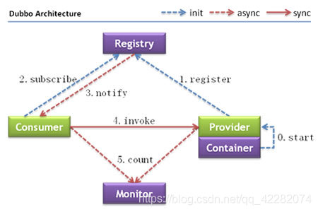

# RPC

RPC（Remote Procedure Call)，远程过程调用。

对于java程序员而言，RPC就是远程方法调用。

远程方法调用和本地方法调用是相对的两个概念，本地⽅法调⽤指的是进程内部的⽅法调⽤，⽽远程⽅法 调⽤指的是两个进程内的⽅法相互调⽤。

如果实现远程⽅法调⽤，基本的就是通过⽹络，通过传输数据来进⾏调⽤。 

所以就有了： 

1. RPC over Http：基于Http协议来传输数据 

2. PRC over Tcp：基于Tcp协议来传输数据 

对于所传输的数据，可以交由RPC的双⽅来协商定义，但基本都会包括： 

1. 调⽤的是哪个类或接⼝ 

2. 调⽤的是哪个⽅法，⽅法名和⽅法参数类型（考虑⽅法重载） 

3. 调⽤⽅法的⼊参 

所以，我们其实可以看到RPC的⾃定义性是很⾼的，各个公司内部都可以实现⾃⼰的⼀套RPC框架，⽽ 

Dubbo就是阿⾥所开源出来的⼀套RPC框架。 

# Dubbo

官⽹地址：http://dubbo.apache.org/zh/

⽬前，官⽹上是这么介绍的：Apache Dubbo 是⼀款⾼性能、轻量级的开源 Java 服务框架 

在⼏个⽉前，官⽹的介绍是：Apache Dubbo 是⼀款⾼性能、轻量级的开源 Java RPC框架 

为什么会将RPC改为服务？ 

Dubbo⼀开始的定位就是RPC，专注于两个服务之间的调⽤。但随着微服务的盛⾏，除开服务调⽤之外， 

Dubbo也在逐步的涉猎服务治理、服务监控、服务⽹关等等，所以现在的Dubbo⽬标已经不⽌是RPC框架 

了，⽽是和Spring Cloud类似想成为了⼀个服务框架。 

Dubbo⽹关参考：https://github.com/apache/dubbo-proxy（社区不是很活跃） 

**节点角色说明：**

| 节点        | 角色说明                               |
| ----------- | -------------------------------------- |
| `Provider`  | 暴露服务的服务提供方                   |
| `Consumer`  | 调用远程服务的服务消费方               |
| `Registry`  | 服务注册与发现的注册中心               |
| `Monitor`   | 统计服务的调用次数和调用时间的监控中心 |
| `Container` | 服务运行容器                           |

调用关系说明：

1. 服务容器负责启动，加载，运行服务提供者。
2. 服务提供者在启动时，向注册中心注册自己提供的服务。
3. 服务消费者在启动时，向注册中心订阅自己所需的服务。
4. 注册中心返回服务提供者地址列表给消费者，如果有变更，注册中心将基于长连接推送变更数据给消费者。
5. 服务消费者，从提供者地址列表中，基于软负载均衡算法，选一台提供者进行调用，如果调用失败，再选另一台调用。
6. 服务消费者和提供者，在内存中累计调用次数和调用时间，定时每分钟发送一次统计数据到监控中心。
   

dubbo官方推荐使用的注册中心是zookeeper

zookeeper的安装过程这里略。。。。。。

**监控中心**

https://github.com/apache/dubbo-admin

启动监控中心：先解压资料中的dubbo-admin-0.1.zip

这是一个前后端分离工程，项目结构如下：

