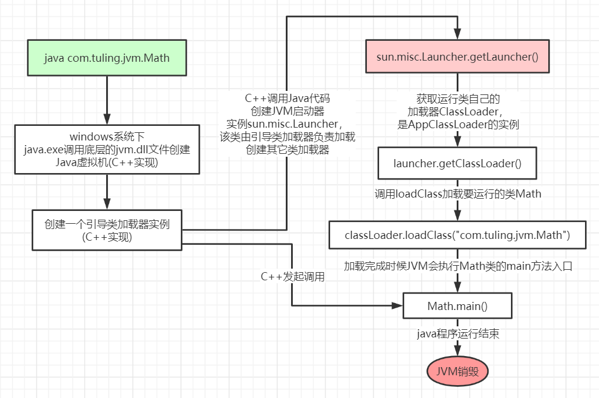

# jvm快速入门

**JVM**是运行在操作系统之上的，它与硬件没有直接的交互。


# 结构图


方法区：存储已被虚拟机加载的类元数据信息(元空间)

堆：存放对象实例，几乎所有的对象实例都在这里分配内存

虚拟机栈：虚拟机栈描述的是Java方法执行的内存模型：每个方法被执行的时候都会同时创建一个栈帧（Stack Frame）用于存储局部变量表、操作栈、动态链接、方法出口等信息

程序计数器：当前线程所执行的字节码的行号指示器

本地方法栈：本地方法栈则是为虚拟机使用到的Native方法服务。

#  类加载器ClassLoader

​	负责加载class文件，class文件在文件开头有特定的文件标识，并且ClassLoader只负责class文件的加载，至于它是否可以运行，则由Execution Engine决定。


类加载器分为四种：前三种为虚拟机自带的加载器。

- 
  启动类加载器（又叫跟类加载器）（Bootstrap）C++

  负责加载$JAVA_HOME中jre/lib/rt.jar等jar包里面的class，由C++实现，不是ClassLoader子类

- 扩展类加载器（Extension）Java

  负责加载java平台中**扩展功能**的一些jar包，包括$JAVA_HOME中jre/lib/*.jar或-Djava.ext.dirs指定目录下的jar包

- 应用程序类加载器（AppClassLoader）Java

  也叫系统类加载器，负责加载**classpath**中指定的jar包及目录中class

- 用户自定义加载器 Java.lang.ClassLoader的子类，用户可以定制类的加载方式

工作过程：

1、当AppClassLoader加载一个class时，它首先不会自己去尝试加载这个类，而是把类加载请求委派给父类加载器ExtClassLoader去完成。
2、当ExtClassLoader加载一个class时，它首先也不会自己去尝试加载这个类，而是把类加载请求委派给BootStrapClassLoader去完成。
3、如果BootStrapClassLoader加载失败（例如在$JAVA_HOME/jre/lib里未查找到该class），会使用ExtClassLoader来尝试加载；
4、若ExtClassLoader也加载失败，则会使用AppClassLoader来加载
5、如果AppClassLoader也加载失败，则会报出异常ClassNotFoundException

其实这就是所谓的**双亲委派模型**。简单来说：如果一个类加载器收到了类加载的请求，它首先不会自己去尝试加载这个类，而是把**请求委托给父加载器去完成，依次向上**。

好处：**防止内存中出现多份同样的字节码**(安全性角度)

写段儿代码演示类加载器：

```java
public class Demo {

    public Demo() {
        super();
    }

    public static void main(String[] args) {
        Object obj = new Object();
        String s = new String();
        Demo demo = new Demo();
        System.out.println(obj.getClass().getClassLoader());
        System.out.println(s.getClass().getClassLoader());
        System.out.println(demo.getClass().getClassLoader().getParent().getParent());
        System.out.println(demo.getClass().getClassLoader().getParent());
        System.out.println(demo.getClass().getClassLoader());
    }
}
```

打印控制台中的sun.misc.Launcher，是一个java虚拟机的入口应用。

# 双亲委派模式

类加载为什么要使用双亲委派模式，有没有什么场景是打破了这个模式？

双亲委派模型的重要用途是为了解决类载入过程中的安全问题。

1. 假设有一个开发者自己编写了一个名为java.lang.Object的类，想借此欺骗JVM。现在他要使用自定义ClassLoader来加载自己编写的java.lang.Object类。

2. 然而幸运的是，双亲委派模型是不会让他成功。因为JVM会优先在BootstrapClassLoader的路径下找到java.lang.Object类，并载入它。

   

Java的类加载是否一定遵循双亲委派模型？

1. 在实际开发中，我们可以通过自定义ClassLoader，并重写父类的loadClass方法，来打破这一机制。

2. SPI就是打破了双亲委派机制的（SPI：服务提供发现）

# 执行引擎Execution Engine

**Execution Engine**执行引擎负责解释命令，提交操作系统执行。

# 本地接口Native Interface

​	本地接口的作用是融合不同的编程语言为 Java 所用，它的初衷是融合 C/C++程序，Java 诞生的时候是 C/C++横行的时候，要想立足，必须有调用 C/C++程序，于是就在内存中专门开辟了一块区域处理标记为native的代码，它的具体做法是 Native Method Stack中登记 native方法，在Execution Engine 执行时加载native libraies。

​	目前该方法使用的越来越少了，除非是与硬件有关的应用，比如通过Java程序驱动打印机或者Java系统管理生产设备，在企业级应用中已经比较少见。因为现在的异构领域间的通信很发达，比如可以使用 Socket通信，也可以使用Web Service等等，不多做介绍。

# Native Method Stack

​	它的具体做法是Native Method Stack中登记native方法，在Execution Engine 执行时加载本地方法库。

# PC寄存器

​	每个线程都有一个**程序计数器**，是**线程私有的**，就是一个指针，指向方法区中的方法字节码（**用来存储指向下一条指令的地址**，即 将要执行的指令代码），由执行引擎读取下一条指令，是一个非常小的内存空间，几乎可以忽略不记。

# Method Area方法区

​	方法区是被所有线程共享，所有字段和方法字节码，以及一些特殊方法如构造函数，接口代码也在此定义。简单说，所有定义的方法的信息都保存在该区域，**此区属于共享区间**。

**静态变量+常量+类信息(构造方法/接口定义)+运行时常量池**存在方法区中。

But  **实例变量存在堆内存**中,和方法区无关

# stack栈

​	栈也叫栈内存，又叫线程栈，**主管Java程序的运行，是在线程创建时创建**，它的生命期是跟随线程的生命期，线程结束栈内存也就释放，**对于栈来说不存在垃圾回收问题**，只要线程一结束该栈就Over，生命周期和线程一致，是线程私有的。**8种基本类型的变量+对象的引用变量+实例方法**都是在函数的栈内存中分配。

​	线程运行过程中，只有一个栈帧是处于活跃状态，称为“当前活跃栈帧”，当前活动栈帧始终是虚拟机栈的栈顶元素。

​	通过jstack工具查看线程状态。

**栈存储什么?**

栈帧中主要保存3 类数据：

- 本地变量（Local Variables）：输入参数和输出参数以及方法内的变量。
- 栈操作（Operand Stack）：记录出栈、入栈的操作。
- 栈帧数据（Frame Data）：包括类文件、方法等等。

**栈运行原理：**

栈中的数据都是以栈帧（Stack Frame）的格式存在，栈帧是一个内存区块，是一个数据集，是一个有关方法(Method)和运行期数据的数据集，当一个方法A被调用时就产生了一个栈帧 F1，并被压入到栈中，

A方法又调用了 B方法，于是产生栈帧 F2 也被压入栈，

B方法又调用了 C方法，于是产生栈帧 F3 也被压入栈，

……

执行完毕后，先弹出F3栈帧，再弹出F2栈帧，再弹出F1栈帧……

遵循“先进后出”或者“后进先出”原则。


图示在一个栈中有两个栈帧：

栈帧 2是最先被调用的方法，先入栈，

然后方法 2 又调用了方法1，栈帧 1处于栈顶的位置，

栈帧 2 处于栈底，执行完毕后，依次弹出栈帧 1和栈帧 2，

线程结束，栈释放。

每执行一个方法都会产生一个栈帧，保存到栈(后进先出)的顶部，顶部栈就是当前的方法，该方法执行完毕
后会自动将此栈帧出栈。

常见问题栈溢出：Exception in thread “main” java.lang.StackOverflowError

通常出现在递归调用时。


请解释StackOverflowError和OutOfMemeryError的区别？

通过之前的分析可以发现，实际上每一块内存中都会存在有一部分的可变伸缩区，其基本流程为：如果空间内存不足，在可变范围之内扩大内存空间，当一段时间之后发现内存充足，会缩小内存空间。

永久代（JDK1.8后消失了）

虽然java的版本是JDK1.8，但是javaEE的版本还是jdk1.7，永久代存在于堆内存之中。

元空间

元空间在jdk1.8之后才有的，其功能实际上和永久代没区别，唯一的区别在于永久代使用的是JVM的堆内存空间，元空间使用的是物理内存，所以元空间的大小受本地内存影响，一般默认在2M左右。

范例：设置一些参数，让元空间出错

java -XX：MetaspaceSize =1m


stackOverflow错误，permgen space错误。

​	stackoverflow错误主要出现：在虚拟机栈中（线程请求的栈深度大于虚拟机栈所允许的最大深度）

​	permgen space错误（针对jdk1.7及之前版本）：1. 大量加载class文件 2. 常量池内存溢出

# 堆

堆栈方法区的关系：


**HotSpot**是使用指针的方式来访问对象：

- Java堆中会存放访问**类元数据**的地址，
- reference存储的就是对象的地址

三种JVM：

•Sun公司的**HotSpot**

•BEA公司的**JRockit**

•IBM公司的**J9 VM**

# 堆体系概述

Java7之前

Heap 堆：一个JVM实例只存在一个堆内存，堆内存的大小是可以调节的。类加载器读取了类文件后，需要把类、方法、常变量放到堆内存中，保存所有引用类型的真实信息，以方便执行器执行，堆内存逻辑上分为三部分：

Young Generation Space 新生区 Young/New

Tenure generation space 养老区 Old/Tenure

Permanent Space 永久区 Perm

也称为：新生代（年轻代）、老年代、永久代（持久代）。
其中**JVM堆分为新生代和老年代**


#  新生代

​	新生区是类的诞生、成长、消亡的区域，一个类在这里产生，应用，最后被垃圾回收器收集，结束生命。新生区又分为两部分： 伊甸区（Eden space）和幸存者区（Survivor pace） ，所有的类都是在伊甸区被new出来的。幸存区有两个： 0区（Survivor 0 space）和1区（Survivor 1 space）。当伊甸园的空间用完时，程序又需要创建对象，JVM的垃圾回收器将对伊甸园区进行垃圾回收(Minor GC)，将伊甸园区中的不再被其他对象所引用的对象进行销毁。然后将伊甸园中的剩余对象移动到幸存 0区。若幸存 0区也满了，再对该区进行垃圾回收，然后移动到 1 区。那如果1 区也满了呢？再次垃圾回收，满足条件后再移动到养老区。若养老区也满了，那么这个时候将产生MajorGC（FullGC），进行养老区的内存清理。若养老区执行了Full GC之后发现依然无法进行对象的保存，就会产生OOM异常“OutOfMemoryError”。

如果出现java.lang.OutOfMemoryError: Java heap space异常，说明Java虚拟机的堆内存不够。原因有二：

（1）Java虚拟机的堆内存设置不够，可以通过参数-Xms、-Xmx来调整。

（2）代码中创建了大量大对象，并且长时间不能被垃圾收集器收集（存在被引用）。


# 老年代

​	经历多次GC仍然存在的对象（默认是15次），老年代的对象比较稳定，不会频繁的GC。


JVM年轻代到年老代的晋升过程的判断条件是什么？

1. 部分对象会在Form和To区域中复制来复制去，如此交换15次（由JVM参数MaxTenuringThreshold决定，这个参数默认是15），最终如果还是存活，就存入到老年代。
2. 如果对象的大小大于Eden的二分之一会直接分配到old，如果old也分配不下，会做一次majorGC，如果小于Eden的一半但是没有足够的空间，就进行minorGC也就是新生代GC。
3. minorGC后，survivor仍然放不下，则存到老年代。
4. 动态年龄判断，大于等于某个年龄的对象超过了survivor空间一半，大于等于某个年龄的对象直接进入到老年代。


# 永久代

​	永久存储区是一个常驻内存区域，用于存放JDK自身所携带的 Class,Interface 的元数据，也就是说它存储的是运行环境必须的类信息，被装载进此区域的数据是不会被垃圾回收器回收掉的，关闭 JVM 才会释放此区域所占用的内存。

​	 如果出现java.lang.OutOfMemoryError: PermGen space，说明是Java虚拟机对永久代Perm内存设置不够。一般出现这种情况，都是程序启动需要加载大量的第三方jar包。例如：在一个Tomcat下部署了太多的应用。或者大量动态反射生成的类不断被加载，最终导致Perm区被占满。

Jdk1.6及之前： 有永久代, 常量池1.6在方法区

Jdk1.7： 有永久代，但已经逐步“去永久代”，常量池1.7在堆

Jdk1.8及之后： 无永久代，常量池1.8在元空间（Metaspace）

​	实际而言，方法区（Method Area）和堆一样，是各个线程共享的内存区域，它用于存储虚拟机加载的：类信息+普通常量+静态常量+编译器编译后的代码等等，虽然JVM规范将方法区描述为堆的一个逻辑部分，但它却还有一个别名叫做Non-Heap(非堆)，目的就是要和堆分开。

​	对于HotSpot虚拟机，很多开发者习惯将方法区称之为“永久代(Parmanent Gen)” ，但严格本质上说两者不同，或者说使用永久代来实现方法区而已，永久代是方法区(相当于是一个接口interface)的一个实现，jdk1.7的版本中，已经将原本放在永久代的字符串常量池移走。

 常量池（Constant Pool）是方法区的一部分，Class文件除了有类的版本、字段、方法、接口等描述信息外，还有一项信息就是常量池，这部分内容将在类加载后进入方法区的运行时常量池中存放。


JVM出现fullGC很频繁，怎么去线上排查问题？

这题就依据fullGC的触发条件来做：

1. 如果有perm gen的话（jdk1.8就没了），要给perm gen分配空间，但没有足够的空间时，会触发full gc。
2. 所以看看是不是perm gen区的值设置得太小了。
3. System.gc（）方法的调用，这个一般没人会调用。
4. 当统计得到的Minor GC晋升到旧生代的平均大小大于老年代的剩余空间，则会触发full gc（这就可以从多个角度上看了）。
5. 是不是频繁创建了大对象（也有可能eden区设置过小）（大对象直接分配在老年代中，导致老年代空间不足--->从而频繁GC）
6. 是不是老年代的空间设置过小了（Minor GC几个对象就大于老年代的剩余空间了）

# 堆参数调优入门

**均以JDK1.8+HotSpot为例**

当young gen中的eden区分配满的时候触发minor gc（新生代的空间不够放的时候）

jdk1.7：


jdk1.8：


# 常用JVM参数

怎么对jvm进行调优？通过**参数配置**

| 参数                      | 备注                                                         |
| ------------------------- | ------------------------------------------------------------ |
| -Xss                      | 等价于-XX：ThreadStackSize，单个线程栈空间大小，默认一般为512k-1024k，通过jinfo查看为0时，表示使用默认值。 |
| -Xms                      | 初始堆大小。只要启动，就占用的堆大小，默认是内存的1/64       |
| -Xmx                      | 最大堆大小。默认是内存的1/4                                  |
| -Xmn                      | 新生区堆大小                                                 |
| -XX:+PrintGCDetails       | 输出详细的GC处理日志                                         |
| -XX：MetaspeaceSize       | 设置元空间大小（默认21M左右，可以设置大一些），元空间的本质和永久代类似，都是对JVM规范中方法区的实现，不过元空间与永久代的最大区别在于：元空间不在虚拟机中，而是使用本地内存，因此，默认情况下，元空间大小仅受本地内存大小限制。 |
| -XX：SurvivorRatio        | 调整Eden中survivor区比例，默认-XX：SurvivorRatio=8（8：1：1），调整为-XX：SurvivorRatio=4（4：1：1），一般使用默认值。 |
| -XX：NewRatio             | 调整新生代与老年代的比例，默认为2（新生代为1，老年代为2，年轻代占整个堆的1/3），调整为-XX：NewRatio=4表示（新生代为1，老年代为4，年轻代占堆的1/5），一般使用默认值。 |
| -XX：MaxTenuringThreshold | 设置垃圾的最大年龄（经历多少次垃圾回收进入老年代），默认15（15次垃圾回收后依旧存活的对象进入老年代），JDK1.8设置必须0<-XX：MaxTenuringThreshold <15 |

java代码查看jvm堆的默认值大小：

```java
Runtime.getRuntime().maxMemory()   // 堆的最大值，默认是内存的1/4
Runtime.getRuntime().totalMemory()  // 堆的当前总大小，默认是内存的1/64
```

# 怎么设置JVM参数

程序运行时，可以给该程序设置jvm参数，不同的工具设置方式不同。

如果是命令行运行：

```java
java -Xmx50m -Xms10m HeapDemo
```

eclipse运行的设置方式如下：


idea运行时设置方式如下：


# 查看堆内存详情

```java
public class Demo2 {
    public static void main(String[] args) {

        System.out.print("最大堆大小：");
        System.out.println(Runtime.getRuntime().maxMemory() / 1024.0 / 1024 + "M");
        System.out.print("当前堆大小：");
        System.out.println(Runtime.getRuntime().totalMemory() / 1024.0 / 1024 + "M");
        System.out.println("==================================================");

        byte[] b = null;
        for (int i = 0; i < 10; i++) {
            b = new byte[1 * 1024 * 1024];
        }
    }
}
```

执行前配置参数：-Xmx50m -Xms30m -XX:+PrintGCDetails

执行：看到如下信息


新生代和老年代的堆大小之和是Runtime.getRuntime().totalMemory()

# 内存溢出和内存泄露

内存泄露的原因：对象是可达的（一直被引用），但是对象不会被使用。

内存溢出的原因：

 	1. 内存泄露导致栈堆内存不断增大，从而引发内存溢出。
 	2. 大量的jar，class文件加载，装载类的空间不够，溢出。
 	3. 操作大量的对象导致堆内存空间已经用满了，溢出。
 	4. nio直接操作内存，内存过大导致溢出。

解决：

 	1. 查看程序是否存在内存泄露的问题。
 	2. 设置参数加大空间
 	3. 代码中是否存在死循环或循环产生过多重复的对象实体
 	4. 查看是否使用了nio直接操作内存。

# GC演示

```java
public class HeapDemo {

    public static void main(String args[]) {

        System.out.println("=====================Begin=========================");
        System.out.print("最大堆大小：Xmx=");
        System.out.println(Runtime.getRuntime().maxMemory() / 1024.0 / 1024 + "M");

        System.out.print("剩余堆大小：free mem=");
        System.out.println(Runtime.getRuntime().freeMemory() / 1024.0 / 1024 + "M");

        System.out.print("当前堆大小：total mem=");
        System.out.println(Runtime.getRuntime().totalMemory() / 1024.0 / 1024 + "M");

        System.out.println("==================First Allocated===================");
        byte[] b1 = new byte[5 * 1024 * 1024];
        System.out.println("5MB array allocated");

        System.out.print("剩余堆大小：free mem=");
        System.out.println(Runtime.getRuntime().freeMemory() / 1024.0 / 1024 + "M");

        System.out.print("当前堆大小：total mem=");
        System.out.println(Runtime.getRuntime().totalMemory() / 1024.0 / 1024 + "M");

        System.out.println("=================Second Allocated===================");
        byte[] b2 = new byte[10 * 1024 * 1024];
        System.out.println("10MB array allocated");

        System.out.print("剩余堆大小：free mem=");
        System.out.println(Runtime.getRuntime().freeMemory() / 1024.0 / 1024 + "M");

        System.out.print("当前堆大小：total mem=");
        System.out.println(Runtime.getRuntime().totalMemory() / 1024.0 / 1024 + "M");

        System.out.println("=====================OOM=========================");
        System.out.println("OOM!!!");
        System.gc();
        byte[] b3 = new byte[40 * 1024 * 1024];
    }
}
```

jvm参数设置成最大堆内存100M，当前堆内存10M：-Xmx100m -Xms10m -XX:+PrintGCDetails

再次运行，可以看到minor GC和full GC日志：


# OOM演示

把上面案例中的jvm参数改成最大堆内存设置成50M，当前堆内存设置成10M，执行测试： -Xmx50m -Xms10m

```java
=====================Begin=========================
最大堆大小：Xmx=44.5M
剩余堆大小：free mem=8.186859130859375M
当前堆大小：total mem=9.5M
=================First Allocated=====================
5MB array allocated
剩余堆大小：free mem=3.1868438720703125M
当前堆大小：total mem=9.5M
================Second Allocated====================
10MB array allocated
剩余堆大小：free mem=3.68682861328125M
当前堆大小：total mem=20.0M
=====================OOM=========================
OOM!!!
Exception in thread "main" java.lang.OutOfMemoryError: Java heap space
	at com.atguigu.demo.HeapDemo.main(HeapDemo.java:40)
```

实际开发中怎么定位这种错误信息？MAT工具

# MAT工具


安装方式：eclipse插件市场下载


# MAT工具的使用

运行参数：-Xmx30m -Xms10m -XX:+HeapDumpOnOutOfMemoryError


重新刷新项目：看到dump文件


打开：


# idea分析dump文件


把上例中运行参数改成：

```java
-Xmx50m -Xms10m -XX:+HeapDumpOnOutOfMemoryError -XX:HeapDumpPath=D:\tmp 
```

-XX:HeapDumpPath：生成dump文件路径。

再次执行：生成C:\tmp\java_pid20328.hprof文件


生成的这个文件怎么打开？jdk自带了该类型文件的解读工具：**jvisualvm.exe**


双击打开：


文件–>装入–>选择要打开的文件即可


装入后：


# GC垃圾回收

面试题：

- JVM内存模型以及分区，需要详细到每个区放什么
- 堆里面的分区：Eden，survival from to，老年代，各自的特点。
- GC的三种收集方法：标记清除、标记整理、复制算法的原理与特点，分别用在什么地方
- Minor GC与Full GC分别在什么时候发生

JVM垃圾判定算法：（对象已死？）

​	引用计数法(Reference-Counting)
​	可达性分析算法（根搜索算法）

GC垃圾回收主要有四大算法：（怎么找到已死对象并清除？）

​	复制算法(Copying)
​	标记清除(Mark-Sweep)
​	标记压缩(Mark-Compact)，又称标记整理
​	分代收集算法(Generational-Collection)

YGC和FGC是什么？

YGC：对新生代堆进行gc。频率比较高，因为大部分对象的存货寿命较短，在新生代里被回收。性能耗费较小。

FGC：全堆范围内的gc。默认堆空间使用到达80%（可调整）的时候会触发fgc。以我们生产环境为例，一般比较少会触发fgc，有时10天或者一周左右会有一次。

什么时候执行YGC和FGC?

1. a.eden空间不足，执行young gc
2. b.old空间不足，perm空间不足，调用方法System.gc（），ygc时的悲观策略，dump.live的内存信息时（jmap -dump:live),都会执行full gc


GC的回收流程是怎样的？

1. 对于整个的GC流程里面，那么最需要处理的就是新生代和老年代的内存清理操作，而元空间（永久代）都不在GC范围内
2. 当现在有一个新的对象产生，那么对象一定需要内存空间，平均每个栈内存存4k，每个堆内存存8k，那么对象一定需要进行堆空间的申请。
3. 首先会判断Eden区是否有内存空间，如果此时有内存空间，则直接将新对象保存在伊甸园区。
4. 但是如果此时在伊甸园区内存不足，那么会自动执行一个Minor GC操作，将伊甸园区的无用内存空间进行清理，Minor GC的清理范围只在Eden园区，清理之后会继续判断Eden园区的内存空间是否充足？如果内存空间充足，则将新的对象直接在Eden园区进行空间分配。
5. 如果执行Minor GC之后发现伊甸园区的内存空间依然不足，那么这个时候会执行存活区的判断，如果存活区有剩余空间，则将Eden园区部分活跃对象保存到存活区，那么随后继续判断Eden园区的内存空间是否充足，如果充足则将新的对象直接在Eden园区进行空间分配。
6. 此时如果存活区没有内存空间，则继续判断老年区。则将部分存活对象保存到老年区，而后存活区将有空余空间。
7. 如果这个时候老年代也满了，那么这个时候产生Major GC（Full GC），那么这个时候将进行老年代的清理。
8. 如果老年代执行Full GC之后，无法进行对象的保存，则会产生OOM异常，OutOfMemoryError异常。

# JVM复习

JVM结构图：


堆内存结构：


GC的特点：

- 次数上频繁收集Young区
- 次数上较少收集Old区
- 基本不动Perm区

# 垃圾判定

## 引用计数法(Reference-Counting)

引用计数算法是通过判断对象的引用数量来决定对象是否可以被回收。

给对象中添加一个引用计数器，每当有一个地方引用它时，计数器值就加1；当引用失效时，计数器值就减1；任何时刻计数器为0的对象就是不可能再被使用的。

优点：

​	简单，高效，现在的objective-c、python等用的就是这种算法。

缺点：

​	引用和去引用伴随着加减算法，影响性能

​	很难处理循环引用，相互引用的两个对象则无法释放。

因此目前主流的Java虚拟机都摒弃掉了这种算法。

## 可达性分析算法

​	这个算法的基本思想就是通过一系列的称为 **“GC Roots”** 的对象作为起点，从这些节点开始向下搜索，节点所走过的路径称为引用链，当一个对象到 GC Roots 没有任何引用链相连的话，则证明此对象是不可用的。


在Java语言中，可以作为GC Roots的对象包括下面几种：

- 虚拟机栈（栈帧中的本地变量表）中的引用对象。
- 方法区中的类静态属性引用的对象。
- 方法区中的常量引用的对象。
- 本地方法栈中JNI（Native方法）的引用对象

**真正标记以为对象为可回收状态至少要标记两次。**

# 四种引用

平时只会用到强引用和软引用。

强引用：

 类似于 Object obj = new Object(); 只要强引用还存在，垃圾收集器永远不会回收掉被引用的对象。

软引用：

 SoftReference 类实现软引用。在系统要发生内存溢出异常之前，才会将这些对象列进回收范围之中进行二次回收。如果这次回收还没有足够的内存，才会抛出内存溢出异常。软引用可用来实现内存敏感的高速缓存。

弱引用：

 WeakReference 类实现弱引用。对象只能生存到下一次垃圾收集之前。在垃圾收集器工作时，无论内存是否足够都会回收掉只被弱引用关联的对象。

虚引用（幽灵引用）：

 PhantomReference 类实现虚引用。无法通过虚引用获取一个对象的实例，为一个对象设置虚引用关联的唯一目的就是能在这个对象被收集器回收时收到一个系统通知。

# 垃圾回收算法

​	在介绍JVM垃圾回收算法前，先介绍一个概念：Stop-the-World

​	Stop-the-world意味着 JVM由于要执行GC而停止了应用程序的执行，并且这种情形会在任何一种GC算法中发生。当Stop-the-world发生时，除了GC所需的线程以外，所有线程都处于等待状态直到GC任务完成。事实上，GC优化很多时候就是指减少Stop-the-world发生的时间，从而使系统具有高吞吐 、低停顿的特点。

## 复制算法(Copying)

​	该算法将内存平均分成两部分，然后每次只使用其中的一部分，当这部分内存满的时候，将内存中所有存活的对象复制到另一个内存中，然后将之前的内存清空，只使用这部分内存，循环下去。


优点：

​	实现简单
​	不产生内存碎片

缺点：

​	将内存缩小为原来的一半，浪费了一半的内存空间，代价太高；如果不想浪费一半的空间，就需要有额外的空间进行分配担保，以应对被使用的内存中所有对象都100%存活的极端情况，所以在老年代一般不能直接选用这种算法。

​	如果对象的存活率很高，我们可以极端一点，假设是100%存活，那么我们需要将所有对象都复制一遍，并将所有引用地址重置一遍。复制这一工作所花费的时间，在对象存活率达到一定程度时，将会变的不可忽视。 所以从以上描述不难看出，复制算法要想使用，最起码对象的存活率要非常低才行，而且最重要的是，我们必须要克服50%内存的浪费。

**年轻代中使用的是Minor GC，这种GC算法采用的是复制算法(Copying)。**

​	HotSpot JVM把年轻代分为了三部分：1个Eden区和2个Survivor区（分别叫from和to）。默认比例为8:1:1,一般情况下，新创建的对象都会被分配到Eden区。因为年轻代中的对象基本都是朝生夕死的(90%以上)，所以在年轻代的垃圾回收算法使用的是复制算法。

​	在GC开始的时候，对象只会存在于Eden区和名为“From”的Survivor区，Survivor区“To”是空的。紧接着进行GC，Eden区中所有存活的对象都会被复制到“To”，而在“From”区中，仍存活的对象会根据他们的年龄值来决定去向。对象在Survivor区中每熬过一次Minor GC，年龄就会增加1岁。年龄达到一定值(年龄阈值，可以通过-XX:MaxTenuringThreshold来设置)的对象会被移动到年老代中，没有达到阈值的对象会被复制到“To”区域。经过这次GC后，Eden区和From区已经被清空。这个时候，“From”和“To”会交换他们的角色，也就是新的“To”就是上次GC前的“From”，新的“From”就是上次GC前的“To”。不管怎样，都会保证名为To的Survivor区域是空的。Minor GC会一直重复这样的过程，直到“To”区被填满，“To”区被填满之后，会将所有对象移动到年老代中。


​	因为Eden区对象一般存活率较低，一般的，使用两块10%的内存作为空闲和活动区间，而另外80%的内存，则是用来给新建对象分配内存的。一旦发生GC，将10%的from活动区间与另外80%中存活的eden对象转移到10%的to空闲区间，接下来，将之前90%的内存全部释放，以此类推。

## 标记清除(Mark-Sweep)

“标记-清除”(Mark Sweep)算法是几种GC算法中最基础的算法，是因为后续的收集算法都是基于这种思路并对其不足进行改进而得到的。正如名字一样，算法分为2个阶段：

1. 标记出需要回收的对象，使用的标记算法均为**可达性分析算法**。
2. 回收被标记的对象。


缺点：

- 效率问题（两次遍历）
- 空间问题（标记清除后会产生大量不连续的碎片。JVM就不得不维持一个内存的空闲列表，这又是一种开销。而且在分配数组对象的时候，寻找连续的内存空间会不太好找。）

## 标记压缩(Mark-Compact)

​	标记压缩法（标记-整理法）是标记-清除法的一个改进版。同样，在标记阶段，该算法也将所有对象标记为存活和死亡两种状态；不同的是，在第二个阶段，该算法并没有直接对死亡的对象进行清理，而是通过**所有存活对像都向一端移动，然后直接清除边界以外的内存。**


优点：

​	标记/整理算法不仅可以弥补标记/清除算法当中，内存区域分散的缺点，也消除了复制算法当中，内存减半的高额代价。

缺点：

​	 如果存活的对象过多，整理阶段将会执行较多复制操作，导致算法效率降低。

**老年代一般是由标记清除或者是标记清除与标记整理的混合实现。**


## 分代收集算法(Generational-Collection)

内存效率：复制算法>标记清除算法>标记整理算法（此处的效率只是简单的对比时间复杂度，实际情况不一定如此）。
内存整齐度：复制算法=标记整理算法>标记清除算法。
内存利用率：标记整理算法=标记清除算法>复制算法。

可以看出，效率上来说，复制算法是当之无愧的老大，但是却浪费了太多内存，而为了尽量兼顾上面所提到的三个指标，标记/整理算法相对来说更平滑一些，但效率上依然不尽如人意，它比复制算法多了一个标记的阶段，又比标记/清除多了一个整理内存的过程

难道就没有一种最优算法吗？

回答：无，没有最好的算法，只有最合适的算法。==========>分代收集算法。

分代回收算法实际上是把复制算法和标记整理法的结合，并不是真正一个新的算法，一般分为：老年代（Old Generation）和新生代（Young Generation），老年代就是很少垃圾需要进行回收的，新生代就是有很多的内存空间需要回收，所以不同代就采用不同的回收算法，以此来达到高效的回收算法。

年轻代(Young Gen)

​	 年轻代特点是区域相对老年代较小，对像存活率低。

 	这种情况复制算法的回收整理，速度是最快的。复制算法的效率只和当前存活对象大小有关，因而很适用于年轻代的回收。而复制算法内存利用率不高的问题，通过hotspot中的两个survivor的设计得到缓解。

老年代(Tenure Gen)

​	老年代的特点是区域较大，对像存活率高。

​	这种情况，存在大量存活率高的对像，复制算法明显变得不合适。一般是由标记清除或者是标记清除与标记整理的混合实现。

# 垃圾收集器（了解）

如果说收集算法是内存回收的方法论，垃圾收集器就是内存回收的具体实现。

## Serial收集器

​	串行收集器是最古老，最稳定以及效率高的收集器，可能会产生较长的停顿，只使用一个线程去回收。新生代、老年代使用串行回收；新生代复制算法、老年代标记-压缩；垃圾收集的过程中会Stop The World（服务暂停）

```
参数控制： -XX:+UseSerialGC 串行收集器
```


## ParNew收集器

ParNew收集器其实就是Serial收集器的多线程版本。新生代并行，老年代串行；新生代复制算法、老年代标记-压缩

参数控制：

`-XX:+UseParNewGC` ParNew收集器
`-XX:ParallelGCThreads` 限制线程数量


## Parallel收集器

​	Parallel Scavenge收集器类似ParNew收集器，Parallel收集器更关注系统的吞吐量。可以通过参数来打开自适应调节策略，虚拟机会根据当前系统的运行情况收集性能监控信息，动态调整这些参数以提供最合适的停顿时间或最大的吞吐量；也可以通过参数控制GC的时间不大于多少毫秒或者比例；新生代复制算法、老年代标记-压缩

参数控制： `-XX:+UseParallelGC `使用Parallel收集器+ 老年代串行

## Parallel Old 收集器

Parallel Old是Parallel Scavenge收集器的老年代版本，使用多线程和“标记－整理”算法。这个收集器是在JDK 1.6中才开始提供

参数控制： `-XX:+UseParallelOldGC` 使用Parallel收集器+ 老年代并行

## CMS收集器

​	CMS（Concurrent Mark Sweep）收集器是一种以获取最短回收停顿时间为目标的收集器。它需要消耗额外的CPU和内存资源，在CPU和内存资源紧张，CPU较少时，会加重系统负担。CMS无法处理浮动垃圾。CMS的“标记清楚”算法，会导致大量空间碎片的产生。目前很大一部分的Java应用都集中在互联网站或B/S系统的服务端上，这类应用尤其重视服务的响应速度，希望系统停顿时间最短，以给用户带来较好的体验。

​	从名字（包含“Mark Sweep”）上就可以看出CMS收集器是基于“标记-清除”算法实现的，它的运作过程相对于前面几种收集器来说要更复杂一些，整个过程分为4个步骤，包括：

​	初始标记（CMS initial mark）
​	并发标记（CMS concurrent mark）
​	重新标记（CMS remark）
​	并发清除（CMS concurrent sweep）

​	其中初始标记、重新标记这两个步骤仍然需要“Stop The World”。初始标记仅仅只是标记一下GC Roots能直接关联到的对象，速度很快，并发标记阶段就是进行GC Roots Tracing的过程，而重新标记阶段则是为了修正并发标记期间，因用户程序继续运作而导致标记产生变动的那一部分对象的标记记录，这个阶段的停顿时间一般会比初始标记阶段稍长一些，但远比并发标记的时间短。

​	由于整个过程中耗时最长的并发标记和并发清除过程中，收集器线程都可以与用户线程一起工作，所以总体上来说，CMS收集器的内存回收过程是与用户线程一起并发地执行。老年代收集器（新生代使用ParNew）

优点: 并发收集、低停顿
缺点: 产生大量空间碎片、并发阶段会降低吞吐量

参数控制：

`-XX:+UseConcMarkSweepGC` 使用CMS收集器
`-XX:+ UseCMSCompactAtFullCollection` Full GC后，进行一次碎片整理；整理过程是独占的，会引起停顿时间变长
`-XX:+CMSFullGCsBeforeCompaction` 设置进行几次Full GC后，进行一次碎片整理
`-XX:ParallelCMSThreads` 设定CMS的线程数量（一般情况约等于可用CPU数量）


## G1收集器

G1（Garbage -First）是目前技术发展的最前沿成果之一，HotSpot开发团队赋予它的使命是未来可以替换掉JDK1.5中发布的CMS收集器。与CMS收集器相比G1收集器有以下特点：

1. 空间整合，G1收集器采用标记整理算法，不会产生内存空间碎片。分配大对象时不会因为无法找到连续空间而提前触发下一次GC。
2. 可预测停顿，这是G1的另一大优势，降低停顿时间是G1和CMS的共同关注点，但G1除了追求低停顿外，还能建立可预测的停顿时间模型，能让使用者明确指定在一个长度为N毫秒的时间片段内，消耗在垃圾收集上的时间不得超过N毫秒，这几乎已经是实时Java（RTSJ）的垃圾收集器的特征了。

上面提到的垃圾收集器，收集的范围都是整个新生代或者老年代，而G1不再是这样。使用G1收集器时，Java堆的内存布局与其他收集器有很大差别，它将整个Java堆划分为多个大小相等的独立区域（Region），虽然还保留有新生代和老年代的概念，但新生代和老年代不再是物理隔阂了，它们都是一部分（可以不连续）Region的集合。


G1的新生代收集跟ParNew类似，当新生代占用达到一定比例的时候，开始触发收集。和CMS类似，G1收集器收集老年代对象会有短暂停顿。

收集步骤：

1、标记阶段，首先初始标记(Initial-Mark),这个阶段是停顿的(Stop the World Event)，并且会触发一次普通Mintor GC。对应GC log:GC pause (young) (inital-mark)

2、Root Region Scanning，程序运行过程中会回收survivor区(存活到老年代)，这一过程必须在young GC之前完成。

3、Concurrent Marking，在整个堆中进行并发标记(和应用程序并发执行)，此过程可能被young GC中断。在并发标记阶段，若发现区域对象中的所有对象都是垃圾，那个这个区域会被立即回收(图中打X)。同时，并发标记过程中，会计算每个区域的对象活性(区域中存活对象的比例)。


4、Remark, 再标记，会有短暂停顿(STW)。再标记阶段是用来收集 并发标记阶段 产生新的垃圾(并发阶段和应用程序一同运行)；G1中采用了比CMS更快的初始快照算法:snapshot-at-the-beginning (SATB)。

5、Copy/Clean up，多线程清除失活对象，会有STW。G1将回收区域的存活对象拷贝到新区域，清除Remember Sets，并发清空回收区域并把它返回到空闲区域链表中。


6、复制/清除过程后。回收区域的活性对象已经被集中回收到深蓝色和深绿色区域。


# 类的实例化顺序

1. 父类静态成员和静态初始化块，按在代码中出现的顺序依次执行
2. 子类静态成员和静态初始化块，按在代码中出现的顺序依次执行
3. 父类实例成员和实例初始化块，按在代码中出现的顺序依次执行
4. 父类构造方法
5. 子类实例成员和实例初始化块，按在代码中出现的顺序依次执行
6. 子类构造方法

# 从JDK源码级别彻底剖析JVM类加载机制

**类加载运行全过程**

当我们用java命令运行某个类的main函数启动程序时，首先需要通过**类加载器**把主类加载到JVM。

```
package com.tuling.jvm;

public class Math {
    public static final int initData = 666;
    public static User user = new User();

    public int compute() {  //一个方法对应一块栈帧内存区域
        int a = 1;
        int b = 2;
        int c = (a + b) * 10;
        return c;
    }

    public static void main(String[] args) {
        Math math = new Math();
        math.compute();
    }

}
```

**通过Java命令执行代码的大体流程如下：**



其中loadClass的类加载过程有如下几步：

**加载 >> 验证 >> 准备 >> 解析 >> 初始化 >>** 使用 >> 卸载

- 加载：在硬盘上查找并通过IO读入字节码文件，使用到类时才会加载，例如调用类的main()方法，new对象等等，在加载阶段会在内存中生成一个**代表这个类的java.lang.Class对象**，作为方法区这个类的各种数据的访问入口
- 验证：校验字节码文件的正确性
- 准备：给类的静态变量分配内存，并赋予默认值
- 解析：将**符号引用**替换为直接引用，该阶段会把一些静态方法(符号引用，比如main()方法)替换为指向数据所存内存的指针或句柄等(直接引用)，这是所谓的**静态链接**过程(类加载期间完成)，**动态链接**是在程序运行期间完成的将符号引用替换为直接引用，下节课会讲到动态链接
- **初始化**：对类的静态变量初始化为指定的值，执行静态代码块


类被加载到方法区中后主要包含 **运行时常量池、类型信息、字段信息、方法信息、类加载器的引用、对应class实例的引用**等信息。

**类加载器的引用**：这个类到类加载器实例的引用

**对应class实例的引用**：类加载器在加载类信息放到方法区中后，会创建一个对应的Class 类型的对象实例放到堆(Heap)中, 作为开发人员访问方法区中类定义的入口和切入点。

**注意，**主类在运行过程中如果使用到其它类，会逐步加载这些类。

jar包或war包里的类不是一次性全部加载的，是使用到时才加载。

```java
public class TestDynamicLoad {

    static {
        System.out.println("*************load TestDynamicLoad************");
    }

    public static void main(String[] args) {
        new A();
        System.out.println("*************load test************");
        B b = null;  //B不会加载，除非这里执行 new B()
    }
}

class A {
    static {
        System.out.println("*************load A************");
    }

    public A() {
        System.out.println("*************initial A************");
    }
}

class B {
    static {
        System.out.println("*************load B************");
    }

    public B() {
        System.out.println("*************initial B************");
    }
}

运行结果：
*************load TestDynamicLoad************
*************load A************
*************initial A************
*************load test************
```

**类加载器和双亲委派机制**

上面的类加载过程主要是通过类加载器来实现的，Java里有如下几种类加载器


- 引导类加载器：负责加载支撑JVM运行的位于JRE的lib目录下的核心类库，比如rt.jar、charsets.jar等
- 扩展类加载器：负责加载支撑JVM运行的位于JRE的lib目录下的ext扩展目录中的JAR类包
- 应用程序类加载器：负责加载ClassPath路径下的类包，主要就是加载你自己写的那些类
- 自定义加载器：负责加载用户自定义路径下的类包

看一个**类加载器**示例：

```java
public class TestJDKClassLoader {

    public static void main(String[] args) {
        System.out.println(String.class.getClassLoader());
        System.out.println(com.sun.crypto.provider.DESKeyFactory.class.getClassLoader().getClass().getName());
        System.out.println(TestJDKClassLoader.class.getClassLoader().getClass().getName());

        System.out.println();
        ClassLoader appClassLoader = ClassLoader.getSystemClassLoader();
        ClassLoader extClassloader = appClassLoader.getParent();
        ClassLoader bootstrapLoader = extClassloader.getParent();
        System.out.println("the bootstrapLoader : " + bootstrapLoader);
        System.out.println("the extClassloader : " + extClassloader);
        System.out.println("the appClassLoader : " + appClassLoader);

        System.out.println();
        System.out.println("bootstrapLoader加载以下文件：");
        URL[] urls = Launcher.getBootstrapClassPath().getURLs();
        for (int i = 0; i < urls.length; i++) {
            System.out.println(urls[i]);
        }

        System.out.println();
        System.out.println("extClassloader加载以下文件：");
        System.out.println(System.getProperty("java.ext.dirs"));

        System.out.println();
        System.out.println("appClassLoader加载以下文件：");
        System.out.println(System.getProperty("java.class.path"));

    }
}

运行结果：
null
sun.misc.Launcher$ExtClassLoader
sun.misc.Launcher$AppClassLoader

the bootstrapLoader : null
the extClassloader : sun.misc.Launcher$ExtClassLoader@3764951d
the appClassLoader : sun.misc.Launcher$AppClassLoader@14dad5dc

bootstrapLoader加载以下文件：
file:/D:/dev/Java/jdk1.8.0_45/jre/lib/resources.jar
file:/D:/dev/Java/jdk1.8.0_45/jre/lib/rt.jar
file:/D:/dev/Java/jdk1.8.0_45/jre/lib/sunrsasign.jar
file:/D:/dev/Java/jdk1.8.0_45/jre/lib/jsse.jar
file:/D:/dev/Java/jdk1.8.0_45/jre/lib/jce.jar
file:/D:/dev/Java/jdk1.8.0_45/jre/lib/charsets.jar
file:/D:/dev/Java/jdk1.8.0_45/jre/lib/jfr.jar
file:/D:/dev/Java/jdk1.8.0_45/jre/classes

extClassloader加载以下文件：
D:\dev\Java\jdk1.8.0_45\jre\lib\ext;C:\Windows\Sun\Java\lib\ext

appClassLoader加载以下文件：
D:\dev\Java\jdk1.8.0_45\jre\lib\charsets.jar;D:\dev\Java\jdk1.8.0_45\jre\lib\deploy.jar;D:\dev\Java\jdk1.8.0_45\jre\lib\ext\access-bridge-64.jar;D:\dev\Java\jdk1.8.0_45\jre\lib\ext\cldrdata.jar;D:\dev\Java\jdk1.8.0_45\jre\lib\ext\dnsns.jar;D:\dev\Java\jdk1.8.0_45\jre\lib\ext\jaccess.jar;D:\dev\Java\jdk1.8.0_45\jre\lib\ext\jfxrt.jar;D:\dev\Java\jdk1.8.0_45\jre\lib\ext\localedata.jar;D:\dev\Java\jdk1.8.0_45\jre\lib\ext\nashorn.jar;D:\dev\Java\jdk1.8.0_45\jre\lib\ext\sunec.jar;D:\dev\Java\jdk1.8.0_45\jre\lib\ext\sunjce_provider.jar;D:\dev\Java\jdk1.8.0_45\jre\lib\ext\sunmscapi.jar;D:\dev\Java\jdk1.8.0_45\jre\lib\ext\sunpkcs11.jar;D:\dev\Java\jdk1.8.0_45\jre\lib\ext\zipfs.jar;D:\dev\Java\jdk1.8.0_45\jre\lib\javaws.jar;D:\dev\Java\jdk1.8.0_45\jre\lib\jce.jar;D:\dev\Java\jdk1.8.0_45\jre\lib\jfr.jar;D:\dev\Java\jdk1.8.0_45\jre\lib\jfxswt.jar;D:\dev\Java\jdk1.8.0_45\jre\lib\jsse.jar;D:\dev\Java\jdk1.8.0_45\jre\lib\management-agent.jar;D:\dev\Java\jdk1.8.0_45\jre\lib\plugin.jar;D:\dev\Java\jdk1.8.0_45\jre\lib\resources.jar;D:\dev\Java\jdk1.8.0_45\jre\lib\rt.jar;D:\ideaProjects\project-all\target\classes;C:\Users\zhuge\.m2\repository\org\apache\zookeeper\zookeeper\3.4.12\zookeeper-3.4.12.jar;C:\Users\zhuge\.m2\repository\org\slf4j\slf4j-api\1.7.25\slf4j-api-1.7.25.jar;C:\Users\zhuge\.m2\repository\org\slf4j\slf4j-log4j12\1.7.25\slf4j-log4j12-1.7.25.jar;C:\Users\zhuge\.m2\repository\log4j\log4j\1.2.17\log4j-1.2.17.jar;C:\Users\zhuge\.m2\repository\jline\jline\0.9.94\jline-0.9.94.jar;C:\Users\zhuge\.m2\repository\org\apache\yetus\audience-annotations\0.5.0\audience-annotations-0.5.0.jar;C:\Users\zhuge\.m2\repository\io\netty\netty\3.10.6.Final\netty-3.10.6.Final.jar;C:\Users\zhuge\.m2\repository\com\google\guava\guava\22.0\guava-22.0.jar;C:\Users\zhuge\.m2\repository\com\google\code\findbugs\jsr305\1.3.9\jsr305-1.3.9.jar;C:\Users\zhuge\.m2\repository\com\google\errorprone\error_prone_annotations\2.0.18\error_prone_annotations-2.0.18.jar;C:\Users\zhuge\.m2\repository\com\google\j2objc\j2objc-annotations\1.1\j2objc-annotations-1.1.jar;C:\Users\zhuge\.m2\repository\org\codehaus\mojo\animal-sniffer-annotations\1.14\animal-sniffer-annotations-1.14.jar;D:\dev\IntelliJ IDEA 2018.3.2\lib\idea_rt.jar

```

**类加载器初始化过程：**

参见类运行加载全过程图可知其中会创建JVM启动器实例sun.misc.Launcher。

在Launcher构造方法内部，其创建了两个类加载器，分别是sun.misc.Launcher.ExtClassLoader(扩展类加载器)和sun.misc.Launcher.AppClassLoader(应用类加载器)。

JVM默认使用Launcher的getClassLoader()方法返回的类加载器AppClassLoader的实例加载我们的应用程序。

```java
//Launcher的构造方法
public Launcher() {
    Launcher.ExtClassLoader var1;
    try {
        //构造扩展类加载器，在构造的过程中将其父加载器设置为null
        var1 = Launcher.ExtClassLoader.getExtClassLoader();
    } catch (IOException var10) {
        throw new InternalError("Could not create extension class loader", var10);
    }

    try {
        //构造应用类加载器，在构造的过程中将其父加载器设置为ExtClassLoader，
        //Launcher的loader属性值是AppClassLoader，我们一般都是用这个类加载器来加载我们自己写的应用程序
        this.loader = Launcher.AppClassLoader.getAppClassLoader(var1);
    } catch (IOException var9) {
        throw new InternalError("Could not create application class loader", var9);
    }

    Thread.currentThread().setContextClassLoader(this.loader);
    String var2 = System.getProperty("java.security.manager");
    。。。 。。。 //省略一些不需关注代码

}
```

**双亲委派机制**

JVM类加载器是有亲子层级结构的，如下图


这里类加载其实就有一个**双亲委派机制**，加载某个类时会先委托父加载器寻找目标类，找不到再委托上层父加载器加载，如果所有父加载器在自己的加载类路径下都找不到目标类，则在自己的类加载路径中查找并载入目标类。

比如我们的Math类，最先会找应用程序类加载器加载，应用程序类加载器会先委托扩展类加载器加载，扩展类加载器再委托引导类加载器，顶层引导类加载器在自己的类加载路径里找了半天没找到Math类，则向下退回加载Math类的请求，扩展类加载器收到回复就自己加载，在自己的类加载路径里找了半天也没找到Math类，又向下退回Math类的加载请求给应用程序类加载器，应用程序类加载器于是在自己的类加载路径里找Math类，结果找到了就自己加载了。。

**双亲委派机制说简单点就是，先找父亲加载，不行再由儿子自己加载**

我们来看下应用程序类加载器AppClassLoader加载类的双亲委派机制源码，AppClassLoader的loadClass方法最终会调用其父类ClassLoader的loadClass方法，该方法的大体逻辑如下：

1. 首先，检查一下指定名称的类是否已经加载过，如果加载过了，就不需要再加载，直接返回。
2. 如果此类没有加载过，那么，再判断一下是否有父加载器；如果有父加载器，则由父加载器加载（即调用parent.loadClass(name, false);）.或者是调用bootstrap类加载器来加载。
3. 如果父加载器及bootstrap类加载器都没有找到指定的类，那么调用当前类加载器的findClass方法来完成类加载。

```java
//ClassLoader的loadClass方法，里面实现了双亲委派机制
protected Class<?> loadClass(String name, boolean resolve)
    throws ClassNotFoundException
{
    synchronized (getClassLoadingLock(name)) {
        // 检查当前类加载器是否已经加载了该类
        Class<?> c = findLoadedClass(name);
        if (c == null) {
            long t0 = System.nanoTime();
            try {
                if (parent != null) {  //如果当前加载器父加载器不为空则委托父加载器加载该类
                    c = parent.loadClass(name, false);
                } else {  //如果当前加载器父加载器为空则委托引导类加载器加载该类
                    c = findBootstrapClassOrNull(name);
                }
            } catch (ClassNotFoundException e) {
                // ClassNotFoundException thrown if class not found
                // from the non-null parent class loader
            }

            if (c == null) {
                // If still not found, then invoke findClass in order
                // to find the class.
                long t1 = System.nanoTime();
                //都会调用URLClassLoader的findClass方法在加载器的类路径里查找并加载该类
                c = findClass(name);

                // this is the defining class loader; record the stats
                sun.misc.PerfCounter.getParentDelegationTime().addTime(t1 - t0);
                sun.misc.PerfCounter.getFindClassTime().addElapsedTimeFrom(t1);
                sun.misc.PerfCounter.getFindClasses().increment();
            }
        }
        if (resolve) {  //不会执行
            resolveClass(c);
        }
        return c;
    }
}
```

**为什么要设计双亲委派机制？**

- 沙箱安全机制：自己写的java.lang.String.class类不会被加载，这样便可以防止核心API库被随意篡改
- 避免类的重复加载：当父亲已经加载了该类时，就没有必要子ClassLoader再加载一次，保证**被加载类的唯一性**

看一个类加载示例：

```java
package java.lang;

public class String {
    public static void main(String[] args) {
        System.out.println("**************My String Class**************");
    }
}

运行结果：
错误: 在类 java.lang.String 中找不到 main 方法, 请将 main 方法定义为:
   public static void main(String[] args)
否则 JavaFX 应用程序类必须扩展javafx.application.Application
```

**全盘负责委托机制**

**“全盘负责”是指当一个ClassLoder装载一个类时，除非显示的使用另外一个ClassLoder，该类所依赖及引用的类也由这个ClassLoder载入。**


**自定义类加载器示例：**

自定义类加载器只需要继承 java.lang.ClassLoader 类，该类有两个核心方法，一个是loadClass(String, boolean)，实现了**双亲委派机制**，还有一个方法是findClass，默认实现是空方法，所以我们自定义类加载器主要是重写findClass方法。

```java
public class MyClassLoaderTest {
    static class MyClassLoader extends ClassLoader {
        private String classPath;

        public MyClassLoader(String classPath) {
            this.classPath = classPath;
        }

        private byte[] loadByte(String name) throws Exception {
            name = name.replaceAll("\\.", "/");
            FileInputStream fis = new FileInputStream(classPath + "/" + name
                    + ".class");
            int len = fis.available();
            byte[] data = new byte[len];
            fis.read(data);
            fis.close();
            return data;
        }

        protected Class<?> findClass(String name) throws ClassNotFoundException {
            try {
                byte[] data = loadByte(name);
                //defineClass将一个字节数组转为Class对象，这个字节数组是class文件读取后最终的字节数组。
                return defineClass(name, data, 0, data.length);
            } catch (Exception e) {
                e.printStackTrace();
                throw new ClassNotFoundException();
            }
        }

    }

    public static void main(String args[]) throws Exception {
        //初始化自定义类加载器，会先初始化父类ClassLoader，其中会把自定义类加载器的父加载器设置为应用程序类加载器AppClassLoader
        MyClassLoader classLoader = new MyClassLoader("D:/test");
        //D盘创建 test/com/tuling/jvm 几级目录，将User类的复制类User1.class丢入该目录
        Class clazz = classLoader.loadClass("com.tuling.jvm.User1");
        Object obj = clazz.newInstance();
        Method method = clazz.getDeclaredMethod("sout", null);
        method.invoke(obj, null);
        System.out.println(clazz.getClassLoader().getClass().getName());
    }
}

运行结果：
=======自己的加载器加载类调用方法=======
com.tuling.jvm.MyClassLoaderTest$MyClassLoader
```

**打破双亲委派机制**

再来一个沙箱安全机制示例，尝试打破双亲委派机制，用自定义类加载器加载我们自己实现的 java.lang.String.class

```java
public class MyClassLoaderTest {
    static class MyClassLoader extends ClassLoader {
        private String classPath;

        public MyClassLoader(String classPath) {
            this.classPath = classPath;
        }

        private byte[] loadByte(String name) throws Exception {
            name = name.replaceAll("\\.", "/");
            FileInputStream fis = new FileInputStream(classPath + "/" + name
                    + ".class");
            int len = fis.available();
            byte[] data = new byte[len];
            fis.read(data);
            fis.close();
            return data;

        }

        protected Class<?> findClass(String name) throws ClassNotFoundException {
            try {
                byte[] data = loadByte(name);
                return defineClass(name, data, 0, data.length);
            } catch (Exception e) {
                e.printStackTrace();
                throw new ClassNotFoundException();
            }
        }

        /**
         * 重写类加载方法，实现自己的加载逻辑，不委派给双亲加载
         * @param name
         * @param resolve
         * @return
         * @throws ClassNotFoundException
         */
        protected Class<?> loadClass(String name, boolean resolve)
                throws ClassNotFoundException {
            synchronized (getClassLoadingLock(name)) {
                // First, check if the class has already been loaded
                Class<?> c = findLoadedClass(name);

                if (c == null) {
                    // If still not found, then invoke findClass in order
                    // to find the class.
                    long t1 = System.nanoTime();
                    c = findClass(name);

                    // this is the defining class loader; record the stats
                    sun.misc.PerfCounter.getFindClassTime().addElapsedTimeFrom(t1);
                    sun.misc.PerfCounter.getFindClasses().increment();
                }
                if (resolve) {
                    resolveClass(c);
                }
                return c;
            }
        }
    }

    public static void main(String args[]) throws Exception {
        MyClassLoader classLoader = new MyClassLoader("D:/test");
        //尝试用自己改写类加载机制去加载自己写的java.lang.String.class
        Class clazz = classLoader.loadClass("java.lang.String");
        Object obj = clazz.newInstance();
        Method method= clazz.getDeclaredMethod("sout", null);
        method.invoke(obj, null);
        System.out.println(clazz.getClassLoader().getClass().getName());
    }
}

运行结果：
java.lang.SecurityException: Prohibited package name: java.lang
	at java.lang.ClassLoader.preDefineClass(ClassLoader.java:659)
	at java.lang.ClassLoader.defineClass(ClassLoader.java:758)
```

**Tomcat打破双亲委派机制**

以Tomcat类加载为例，Tomcat 如果使用默认的双亲委派类加载机制行不行？

我们思考一下：Tomcat是个web容器， 那么它要解决什么问题： 

\1. 一个web容器可能需要部署两个应用程序，不同的应用程序可能会**依赖同一个第三方类库的不同版本**，不能要求同一个类库在同一个服务器只有一份，因此要保证每个应用程序的类库都是独立的，保证相互隔离。 

\2. 部署在同一个web容器中**相同的类库相同的版本可以共享**。否则，如果服务器有10个应用程序，那么要有10份相同的类库加载进虚拟机。 

\3. **web容器也有自己依赖的类库，不能与应用程序的类库混淆**。基于安全考虑，应该让容器的类库和程序的类库隔离开来。 

\4. web容器要支持jsp的修改，我们知道，jsp 文件最终也是要编译成class文件才能在虚拟机中运行，但程序运行后修改jsp已经是司空见惯的事情， web容器需要支持 jsp 修改后不用重启。


再看看我们的问题：**Tomcat 如果使用默认的双亲委派类加载机制行不行？** 

答案是不行的。为什么？

第一个问题，如果使用默认的类加载器机制，那么是无法加载两个相同类库的不同版本的，默认的类加器是不管你是什么版本的，只在乎你的全限定类名，并且只有一份。

第二个问题，默认的类加载器是能够实现的，因为他的职责就是保证**唯一性**。

第三个问题和第一个问题一样。

我们再看第四个问题，我们想我们要怎么实现jsp文件的热加载，jsp 文件其实也就是class文件，那么如果修改了，但类名还是一样，类加载器会直接取方法区中已经存在的，修改后的jsp是不会重新加载的。那么怎么办呢？我们可以直接卸载掉这jsp文件的类加载器，所以你应该想到了，每个jsp文件对应一个唯一的类加载器，当一个jsp文件修改了，就直接卸载这个jsp类加载器。重新创建类加载器，重新加载jsp文件。

**Tomcat自定义加载器详解**


tomcat的几个主要类加载器：

- commonLoader：Tomcat最基本的类加载器，加载路径中的class可以被Tomcat容器本身以及各个Webapp访问；
- catalinaLoader：Tomcat容器私有的类加载器，加载路径中的class对于Webapp不可见；
- sharedLoader：各个Webapp共享的类加载器，加载路径中的class对于所有Webapp可见，但是对于Tomcat容器不可见；
- WebappClassLoader：各个Webapp私有的类加载器，加载路径中的class只对当前Webapp可见，比如加载war包里相关的类，每个war包应用都有自己的WebappClassLoader，实现相互隔离，比如不同war包应用引入了不同的spring版本，这样实现就能加载各自的spring版本；


从图中的委派关系中可以看出：

CommonClassLoader能加载的类都可以被CatalinaClassLoader和SharedClassLoader使用，从而实现了公有类库的共用，而CatalinaClassLoader和SharedClassLoader自己能加载的类则与对方相互隔离。

WebAppClassLoader可以使用SharedClassLoader加载到的类，但各个WebAppClassLoader实例之间相互隔离。

而JasperLoader的加载范围仅仅是这个JSP文件所编译出来的那一个.Class文件，它出现的目的就是为了被丢弃：当Web容器检测到JSP文件被修改时，会替换掉目前的JasperLoader的实例，并通过再建立一个新的Jsp类加载器来实现JSP文件的热加载功能。


tomcat 这种类加载机制违背了java 推荐的双亲委派模型了吗？答案是：违背了。 

很显然，tomcat 不是这样实现，tomcat 为了实现隔离性，没有遵守这个约定，**每个webappClassLoader加载自己的目录下的class文件，不会传递给父类加载器，打破了双亲委派机制**。


**模拟实现Tomcat的webappClassLoader加载自己war包应用内不同版本类实现相互共存与隔离**

```java
public class MyClassLoaderTest {
    static class MyClassLoader extends ClassLoader {
        private String classPath;

        public MyClassLoader(String classPath) {
            this.classPath = classPath;
        }

        private byte[] loadByte(String name) throws Exception {
            name = name.replaceAll("\\.", "/");
            FileInputStream fis = new FileInputStream(classPath + "/" + name
                    + ".class");
            int len = fis.available();
            byte[] data = new byte[len];
            fis.read(data);
            fis.close();
            return data;

        }

        protected Class<?> findClass(String name) throws ClassNotFoundException {
            try {
                byte[] data = loadByte(name);
                return defineClass(name, data, 0, data.length);
            } catch (Exception e) {
                e.printStackTrace();
                throw new ClassNotFoundException();
            }
        }

        /**
         * 重写类加载方法，实现自己的加载逻辑，不委派给双亲加载
         * @param name
         * @param resolve
         * @return
         * @throws ClassNotFoundException
         */
        protected Class<?> loadClass(String name, boolean resolve)
                throws ClassNotFoundException {
            synchronized (getClassLoadingLock(name)) {
                // First, check if the class has already been loaded
                Class<?> c = findLoadedClass(name);

                if (c == null) {
                    // If still not found, then invoke findClass in order
                    // to find the class.
                    long t1 = System.nanoTime();

                    //非自定义的类还是走双亲委派加载
                    if (!name.startsWith("com.tuling.jvm")){
                        c = this.getParent().loadClass(name);
                    }else{
                        c = findClass(name);
                    }

                    // this is the defining class loader; record the stats
                    sun.misc.PerfCounter.getFindClassTime().addElapsedTimeFrom(t1);
                    sun.misc.PerfCounter.getFindClasses().increment();
                }
                if (resolve) {
                    resolveClass(c);
                }
                return c;
            }
        }
    }

    public static void main(String args[]) throws Exception {
        MyClassLoader classLoader = new MyClassLoader("D:/test");
        Class clazz = classLoader.loadClass("com.tuling.jvm.User1");
        Object obj = clazz.newInstance();
        Method method= clazz.getDeclaredMethod("sout", null);
        method.invoke(obj, null);
        System.out.println(clazz.getClassLoader());
        
        System.out.println();
        MyClassLoader classLoader1 = new MyClassLoader("D:/test1");
        Class clazz1 = classLoader1.loadClass("com.tuling.jvm.User1");
        Object obj1 = clazz1.newInstance();
        Method method1= clazz1.getDeclaredMethod("sout", null);
        method1.invoke(obj1, null);
        System.out.println(clazz1.getClassLoader());
    }
}

运行结果：
=======自己的加载器加载类调用方法=======
com.tuling.jvm.MyClassLoaderTest$MyClassLoader@266474c2

=======另外一个User1版本：自己的加载器加载类调用方法=======
com.tuling.jvm.MyClassLoaderTest$MyClassLoader@66d3c617
```

注意：同一个JVM内，两个相同包名和类名的类对象可以共存，因为他们的类加载器可以不一样，所以看两个类对象是否是同一个，除了看类的包名和类名是否都相同之外，还需要他们的类加载器也是同一个才能认为他们是同一个。


**模拟实现Tomcat的JasperLoader热加载**

原理：后台启动线程监听jsp文件变化，如果变化了找到该jsp对应的servlet类的加载器引用(gcroot)，重新生成新的**JasperLoader**加载器赋值给引用，然后加载新的jsp对应的servlet类，之前的那个加载器因为没有gcroot引用了，下一次gc的时候会被销毁。


附下User类的代码：

```java
package com.tuling.jvm;

public class User {

    private int id;
    private String name;
    
    public User() {
    }

    public User(int id, String name) {
        super();
        this.id = id;
        this.name = name;
    }

    public int getId() {
        return id;
    }

    public void setId(int id) {
        this.id = id;
    }

    public String getName() {
        return name;
    }

    public void setName(String name) {
        this.name = name;
    }

    public void sout() {
        System.out.println("=======自己的加载器加载类调用方法=======");
    }
}
```

**补充：Hotspot源码JVM启动执行main方法流程**


