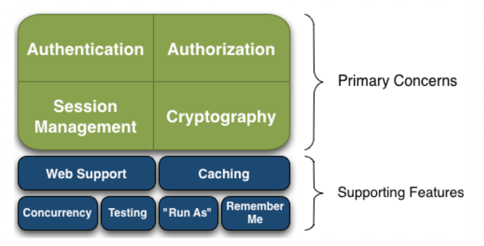
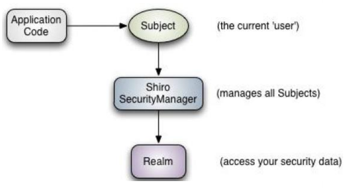
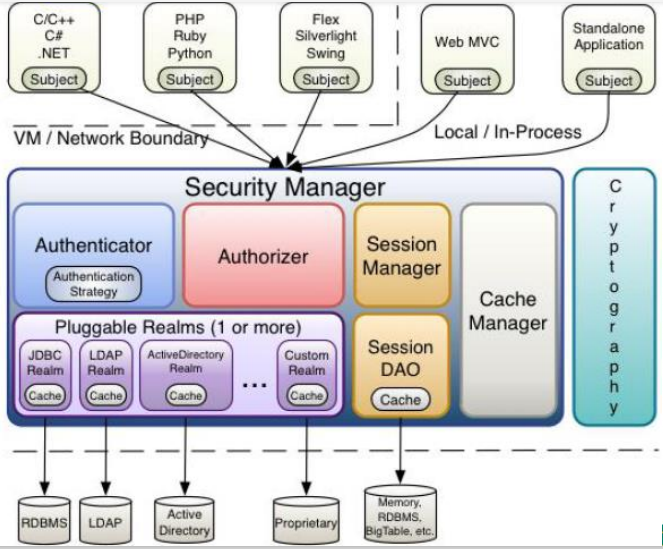

# shiro简介

- Apache Shiro 是 **Java 的一个安全（权限）框架**。 
- Shiro 可以非常容易的开发出足够好的应用，其不仅可以用在 **JavaSE** 环境，也可以用在 **JavaEE** 环境。
- Shiro 可以完成：认证、授权、加密、会话管理、与Web 集成、缓存等。
- 下载：http://shiro.apache.org/

- **Authentication**：身份认证/登录，验证用户是不是拥有相应的身份； 

- **Authorization**：授权，即权限验证，验证某个已认证的用户是否拥有某个权限；即判断用户是否能进行什么操作，如：验证某个用户是否拥有某个角色。或者细粒度的验证某个用户对某个资源是否具有某个权限；  

- **Session Manager**：**会话管理**，即用户登录后就是一次会话，在没有退出之前，它的所有信息都在会话中；**会话可以是普通 JavaSE 环境，也可以是 Web 环境的**； 

- **Cryptography**：**加密**，保护数据的安全性，如密码加密存储到数据库，而不是明文存储； 

- **Web Support**：**Web 支持**，可以非常容易的集成到Web 环境；  

- **Caching**：**缓存**，比如用户登录后，其用户信息、拥有的角色/权限不必每次去查，这样可以提高效率；
- **Concurrency**：Shiro 支持**多线程应用的并发验证**，即如在一个线程中开启另一个线程，能把权限自动传播过去； 

- **Testing**：提供**测试**支持； 

- **Run As**：**允许一个用户假装为另一个用户**（如果他们允许）**的身份进行访问**； 

- **Remember Me**：**记住我**，这个是非常常见的功能，即一次登录后，下次再来的话不用登录了

- shiro架构从外部来看：即从应用程序角度的来观察如何使用 Shiro 完成工作：

- **Subject**：**应用代码直接交互的对象是 Subject**，也就是说 Shiro 的对外API 核心就是 Subject。**Subject 代表了当前“用户”**， 这个用户不一定是一个具体的人，与当前应用交互的任何东西都是 Subject，如网络爬虫，机器人等；**与 Subject 的所有交互都会委托给 SecurityManager**；**Subject 其实是一个门面，SecurityManager 才是实际的执行者**； 

-  **SecurityManager**：**安全管理器；即**所有与安全有关的操作都会与**SecurityManager 交互**；且其管理着所有 Subject；可以看出它是 **Shiro** 

**的核心**，它**负责与 Shiro 的其他组件进行交互**，它相当于 SpringMVC 中DispatcherServlet 的角色 

-  **Realm**：Shiro从 Realm 获取安全数据（如用户、角色、权限），就是说SecurityManager 要验证用户身份，那么它需要从 Realm 获取相应的用户进行比较以确定用户身份是否合法；也需要从 Realm 得到用户相应的角色/权限进行验证用户是否能进行操作；可以把 Realm 看成 DataSource。

- shiro架构从内部来看：

- **Subject**：任何可以与应用交互的“用户”； 
- **SecurityManager** ：相当于SpringMVC 中的 DispatcherServlet；是 Shiro 的心脏；所有具体的交互都通过 SecurityManager 进行控制；它管理着所有 Subject、且负责进行认证、授权、会话及缓存的管理。 
- **Authenticator**：**负责 Subject 认证**，是一个扩展点，可以自定义实现；可以使用认证策略（Authentication Strategy），即什么情况下算用户认证通过了； 
- **Authorizer**：**授权器**、**即访问控制器，用来决定主体是否有权限进行相应的操作；即**控**制着用户能访问应用中的哪些功能**；
- **Realm**：可以有 1 个或多个 Realm，可以认为是安全实体数据源，即用于获取安全实体的；可以是JDBC 实现，也可以是内存实现等等；由用户提供；所以一般在应用中都需要实现自己的 Realm； 
- **SessionManager**：**管理 Session 生命周期的组件**；而 Shiro 并不仅仅可以用在 Web 环境，也可以用在如普通的 JavaSE 环境 
- **CacheManager**：**缓存控制器**，来管理如用户、角色、权限等的缓存的；因为这些数据基本上很少改变，放到缓存中后可以提高访问的性能 
- **Cryptography**：**密码模块**，Shiro 提高了一些常见的加密组件用于如密码加密/解密。

# 

