# SpringBoot概述

​	Spring Boot（2013年开始研发、2014年4月发布第一个版本）是由Pivotal团队提供的全新框架，其设计目的是用来简化Spring（于2004年3月24日，发布了1.0正式版）应用的初始搭建以及开发过程。

​	一站式整合所有应用框架的框架；并且完美整合Spring技术栈； <https://spring.io/projects> 

​	Spring Boot来简化Spring应用开发，约定大于配置，去繁从简，just run就能创建一个独立的，产品级别的应用。

# SpringBoot解决了哪些Spring开发缺点

谈到 Spring Boot，就让我们先来了解它的优点 。 依据官方的文档， Spring Boot 的优点如下：

​	· 快速创建独立运行的Spring项目以及与主流框架集成

​	· 使用嵌入式的Servlet容器，应用无需打成WAR包

​	· starters自动依赖与版本控制

​	· 大量的自动配置，简化开发，也可修改默认值

​	· 无需配置XML，无代码生成，开箱即用

​	· 准生产环境的运行时应用监控

​	· 与云计算的天然集成

​	这段描述告诉我们，首先 Spring Boot 是一个基于 Spring 框架搭建起来的应用，其次它会嵌入Tomcat 、 Jetty 或者 Undertow 等服务器 ，并且不需要传统 的 WAR 文件进行部署 ，也就是说搭建 SpringBoot 项目并不需要单独下载 Tomcat 等传统的服务器，而无须其他服务器配置。

​	对于配置， Spring Boot 提供 Spring 框架的最大自动化配置，大量使用自动配置，使得开发者对 Spring 的配置尽量减少。

​	约定优于配置，这是 Spring Boot 的主导思想 。 对于 Spring Boot 而言 ，大部分情况下存在默认配置 ，你甚至可 以在没有任何定义的情况下使用 SpringBoot 框架，如果需要自定义也只需要在配置文件配置一些属性便可以，十分便捷 。

# SpringBoot的特点

o 为基于Spring的开发提供更快的入门体验

o 开箱即用，没有代码生成，也无需XML配置。同时也可以修改默认值来满足特定的需求

o 提供了一些大型项目中常见的非功能性特性，如嵌入式服务器、外部配置等

o SpringBoot不是对Spring功能上的增强，而是提供了一种快速使用Spring的方式

# SpringBoot的核心功能

**o** **起步依赖**
起步依赖本质上是一个Maven项目对象模型（Project Object Model，POM），定义了对其他库的传递依赖，这些东西加在一起即支持某项功能。
简单的说，起步依赖就是将具备某种功能的坐标打包到一起，并提供一些默认的功能。

**o** **自动配置**
Spring Boot的自动配置是一个运行时（更准确地说，是应用程序启动时）的过程，考虑了众多因素，才决定Spring配置应该用哪个，不该用哪个。该过程是Spring自动完成的。

# SpringBoot版本说明

```
/**
其中2：表示的主版本号，表示是我们的SpringBoot第二代产品
其中1：表示的是次版本号，增加了一些新的功能但是主体的架构没有变化的，是兼容的
其中6：表示的是bug修复版
所以2.1.6合起来就是SpringBoot的第二代版本的第一个小版本的第6次bug修复版本
RELEASE：存在哪些取值了①snapshot（开发版本）②M1...M2(里程碑版本，在正式版发布之前，会出几个里程碑的版本)③：release（正式版本）
**/
<parent>
	<groupId>org.springframework.boot</groupId>
	<artifactId>spring-boot-starter-parent<artifactId>
	<version>2.1.6.RELEASE</version>
</parent>
```

# 环境要求

https://docs.spring.io/spring-boot/docs/2.2.2.BUILD-SNAPSHOT/reference/htmlsingle/#getting-started-system-requirements#getting-started-system-requirements

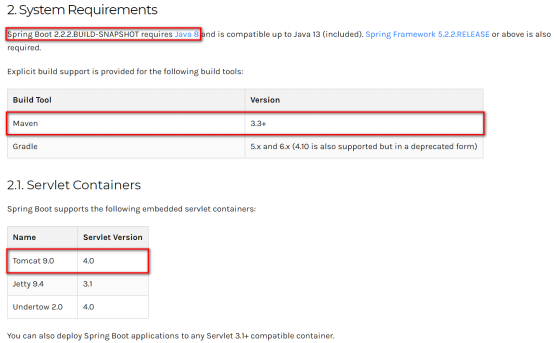

# SpringBoot快速入门

**SpringBoot快速入门**

需求：完成页面发送/hello 请求，服务器响应 "OK" 字符串

**创建maven工程**

**引入如下依赖**

```xml
<?xml version="1.0" encoding="UTF-8"?>
<project xmlns="http://maven.apache.org/POM/4.0.0"
         xmlns:xsi="http://www.w3.org/2001/XMLSchema-instance"
         xsi:schemaLocation="http://maven.apache.org/POM/4.0.0 http://maven.apache.org/xsd/maven-4.0.0.xsd">
    <modelVersion>4.0.0</modelVersion>
 
    <groupId>com.atguigu.springboot</groupId>
    <artifactId>springboot-helloworld</artifactId>
    <version>1.0-SNAPSHOT</version>
 
    <parent>
        <groupId>org.springframework.boot</groupId>
        <artifactId>spring-boot-starter-parent</artifactId>
        <version>2.2.2.RELEASE</version>
    </parent>
    <dependencies>
        <dependency>
            <groupId>org.springframework.boot</groupId>
            <artifactId>spring-boot-starter-web</artifactId>
        </dependency>
    </dependencies>
</project>
```

**编写主程序**

```java
package com.atguigu.springboot;
 
import org.springframework.boot.SpringApplication;
import org.springframework.boot.autoconfigure.SpringBootApplication;
 
// 声明该类是一个SpringBoot引导类
@SpringBootApplication
public class MySpringBootApplication {
    // main是java程序的入口
    public static void main(String[] args) {
        // run方法 表示运行SpringBoot的引导类 run参数就是SpringBoot引导类的字节码对象
        SpringApplication.run(MySpringBootApplication.class,args);
    }
}
```

**增加控制器**

```java
package com.atguigu.springboot.controller;
 
import org.springframework.web.bind.annotation.RequestMapping;
import org.springframework.web.bind.annotation.RestController;
 
@RestController //等价于@Controller + @ResponseBody
public class QuickStartController {
 
    @RequestMapping("/quick")
    public String quick(){
        return "springboot 访问成功!";
    }
}
```

**测试**

执行SpringBoot主程序

通过日志发现，Tomcat started on port(s): 8080 (http) with context path '' ，tomcat启动监听8080端口，web应用的上下文名称为空（默认“/”）

打开浏览器访问url地址为：http://localhost:8080/quick

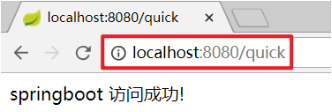

## **快速入门解析**

**SpringBoot代码解析**

· @SpringBootApplication：标注SpringBoot的启动类，该注解具备多种功能（后面详细剖析）

· SpringApplication.run(MySpringBootApplication.class) 代表运行SpringBoot的启动类，参数为SpringBoot启动类的字节码对象

## SpringBoot工程热部署

​	我们在开发中反复修改类、页面等资源，每次修改后都是需要重新启动才生效，这样每次启动都很麻烦，浪费了大量的时间，我们可以在修改代码后不重启就能生效，在 pom.xml 中添加如下配置就可以实现这样的功能，我们称之为热部署。

**增加依赖配置**

```xml
<!--热部署配置-->
<dependency>
    <groupId>org.springframework.boot</groupId>
    <artifactId>spring-boot-devtools</artifactId>
</dependency>
<build>
    <plugins>
        <plugin>
            <groupId>org.springframework.boot</groupId>
            <artifactId>spring-boot-maven-plugin</artifactId>
        </plugin>
    </plugins>
</build>
```

**自动编译设置**

开启 Intellij IEDA 自动编译，需要对IDEA进行自动编译的设置，如下：

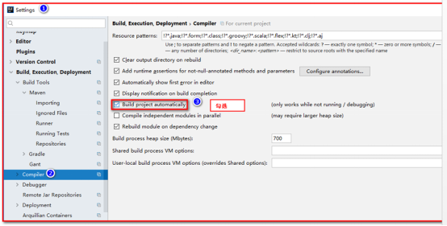

Shift+Ctrl+Alt+/，选择Registry

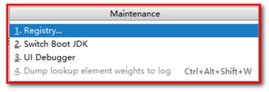

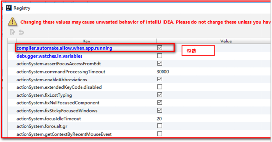

**使用idea快速创建SpringBoot项目**

创建Spring Starter Project  ; 必须联网创建

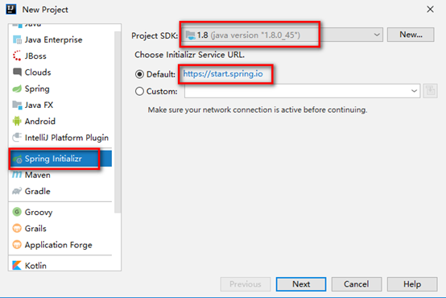

**选择版本，引入需要的依赖**

注意选择相应版本，这里版本只能选择IDEA提供的。可以在创建项目后，自行修改需要的版本。

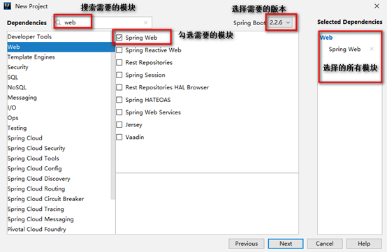

**项目结构**

​	自动生成主程序类，用于启动项目

​	自动生成静态资源目录及属性配置文件

​	自动生成测试类

​	自动增加pom.xml相关依赖配置

**增加控制器类**

@RestController注解组合了@ResponseBody和@Controller。

```java
@RestController 
public class HelloController {
 
    //@RequestMapping(value = "/hello", method = RequestMethod.GET) 
    //@PostMapping("/hello") //只处理POST请求
    //@DeleteMapping("/hello") //只处理DELETE请求
    //@PutMapping("/hello") //只处理PUT请求
    @GetMapping("/hello") //只处理GET请求
    public String handle01() {
        return "OK!+哈哈";
    }
}
```

**运行测试**

<http://localhost:8080/hello>

 **SpringBoot打包运行**

1) 引入springboot插件

```xml
<!-- 引入springboot插件；打包插件 -->
    <build>
        <plugins>
            <plugin>
                <groupId>org.springframework.boot</groupId>
                <artifactId>spring-boot-maven-plugin</artifactId>
            </plugin>
        </plugins>
    </build> 
```

2) 将应用打包：package命令，使用插件和不使用插件打成的jar包是有区别的。

java -jar xxx.jar

3) 直接双击或者使用java -jar 命令运行 ;里面已经有嵌入式的tomcat

# SpringBoot-原理分析

**starters依赖原理**

Ø 分析spring-boot-starter-parent

[https://docs.spring.io/spring-boot/docs/2.2.2.BUILD-SNAPSHOT/reference/htmlsingle/#using-boot-starter](#using-boot-starter)

```xml
<project xmlns="http://maven.apache.org/POM/4.0.0" xmlns:xsi="http://www.w3.org/2001/XMLSchema-instance"
xsi:schemaLocation="http://maven.apache.org/POM/4.0.0 http://maven.apache.org/xsd/maven-4.0.0.xsd">
<modelVersion>4.0.0</modelVersion>
<groupId>com.atguigu</groupId>
<artifactId>spring-boot-01</artifactId>
<version>0.0.1-SNAPSHOT</version>
 
<!-- 用来做依赖管理，所有依赖的版本都声明好了-->
<parent>
<groupId>org.springframework.boot</groupId>
<artifactId>spring-boot-starter-parent</artifactId>
<version>2.2.2.RELEASE</version>
</parent>
<!-- spring-boot-starter-xxx：场景启动器；
开发web程序就引用web场景spring-boot-starter-web;
SpringBoot自定引入这个场景所需要的所有依赖；-->
<dependencies>
<dependency>
<groupId>org.springframework.boot</groupId>
<artifactId>spring-boot-starter-web</artifactId>
</dependency>
</dependencies>
</project>
```

Ø 跟踪父工程的依赖配置，总结如下：

根据spring-boot-starter-dependencies的pom.xml中我们可以发现，一部分坐标的版本、依赖管理、插件管理已经定义好，所以，我们的SpringBoot工程继承spring-boot-starter-parent后已经具备版本锁定等配置了（不会出现版本冲突的问题）。所以起步依赖的作用就是进行依赖的传递。

## **starters依赖原理之web模块**

· 不是所有的jar都传递，需要指定，用到哪个jar包，导入哪个jar包。

例如：

```xml
        <dependency>
            <groupId>org.springframework.boot</groupId>
            <artifactId>spring-boot-starter-web</artifactId>
        </dependency>
```

· 按住Ctrl点击pom.xml中的spring-boot-starter-web，跳转到了spring-boot-starter-web的pom.xml，xml配置如下（只摘抄了部分重点配置）：

```xml
<?xml version="1.0" encoding="UTF-8"?>
<project xsi:schemaLocation="http://maven.apache.org/POM/4.0.0 http://maven.apache.org/xsd/maven-4.0.0.xsd" xmlns="http://maven.apache.org/POM/4.0.0"
    xmlns:xsi="http://www.w3.org/2001/XMLSchema-instance">
          <modelVersion>4.0.0</modelVersion>
          <parent>
            <groupId>org.springframework.boot</groupId>
            <artifactId>spring-boot-starters</artifactId>
            <version>2.0.1.RELEASE</version>
          </parent>
          <groupId>org.springframework.boot</groupId>
          <artifactId>spring-boot-starter-web</artifactId>
          <version>2.0.1.RELEASE</version>
          <name>Spring Boot Web Starter</name>
  
          <dependencies>
            <dependency>
                      <groupId>org.springframework.boot</groupId>
                      <artifactId>spring-boot-starter</artifactId>
                      <version>2.0.1.RELEASE</version>
                      <scope>compile</scope>
            </dependency>
            <dependency>
                      <groupId>org.springframework.boot</groupId>
                      <artifactId>spring-boot-starter-json</artifactId>
                      <version>2.0.1.RELEASE</version>
                      <scope>compile</scope>
            </dependency>
            <dependency>
                      <groupId>org.springframework.boot</groupId>
                      <artifactId>spring-boot-starter-tomcat</artifactId>
                      <version>2.0.1.RELEASE</version>
                      <scope>compile</scope>
            </dependency>
            <dependency>
                      <groupId>org.hibernate.validator</groupId>
                      <artifactId>hibernate-validator</artifactId>
                      <version>6.0.9.Final</version>
                      <scope>compile</scope>
            </dependency>
            <dependency>
                      <groupId>org.springframework</groupId>
                      <artifactId>spring-web</artifactId>
                      <version>5.0.5.RELEASE</version>
                      <scope>compile</scope>
            </dependency>
            <dependency>
                      <groupId>org.springframework</groupId>
                      <artifactId>spring-webmvc</artifactId>
                      <version>5.0.5.RELEASE</version>
                      <scope>compile</scope>
            </dependency>
          </dependencies>
</project>
```

· 总结：

从上面的spring-boot-starter-web的pom.xml中我们可以发现，spring-boot-starter-web就是将web开发要使用的spring-web、spring-webmvc等坐标进行了“打包”，这样我们的工程只要引入spring-boot-starter-web起步依赖的坐标就可以进行web开发了，同样体现了依赖传递的作用，同时加载tomcat，只要启动main方法，就相当于起到tomcat进行开发；同时加载json，支持springmvc的数据请求和响应。

## 自动配置原理

**自动配置原理解析**

```java
@SpringBootApplication
public class SpringbootDemo02Application {
 
    public static void main(String[] args) {
        ApplicationContext act = SpringApplication.run(SpringbootDemo02Application.class, args);
        for (String name : act.getBeanDefinitionNames()) {
            System.out.println(name);
        }
    }
 
}
```

 **运行默认自动配置加载的对象**

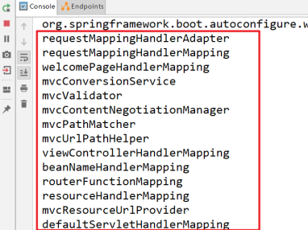

**按住Ctrl点击查看启动类的注解**

@SpringBootApplication

**注解@SpringBootApplication的源码**

@SpringBootApplication是封装了spring注解的复合注解，包含@ComponentScan，@SpringBootConfiguration，@EnableAutoConfiguration

```java
@Target(ElementType.TYPE)
@Retention(RetentionPolicy.RUNTIME)
@Documented
@Inherited
@SpringBootConfiguration
@EnableAutoConfiguration
@ComponentScan(excludeFilters = {
@Filter(type = FilterType.CUSTOM, classes = TypeExcludeFilter.class),
@Filter(type = FilterType.CUSTOM, classes = AutoConfigurationExcludeFilter.class) })
public @interface SpringBootApplication {
 
/**
 * Exclude specific auto-configuration classes such that they will never be applied.
 * @return the classes to exclude
 */
@AliasFor(annotation = EnableAutoConfiguration.class)
Class<?>[] exclude() default {};
 
... ... ...
 
}
```

其中，点进 @SpringBootApplication 注解后我们重点关注最后三个注解

@ComponentScan（包扫描）

component是组件，scan是扫描，所以这个注解的含义就是用来扫描组件的，componentScan 扫描当前包及其子包下被 @Component，@Controller，@Service，@Repository注解标记的类并纳入到spring容器中进行管理，所以这个注解会自动注入所有在主程序所在包下的组件。默认把当前启动类所在的包作为扫描包的起点。

相当于：

```
<context:component-scan base-package="com.xxx"></context:component-scan>
```

@SpringBootConfiguration : 表示当前类具有配置类的作用

@EnableAutoConfiguration：自动配置

o 根据当前引入的依赖包，猜测需要创建的工程类型，以及工程中有可能创建的对象，根据猜测自动创建工程所需的相关实例bean程序启动，会自动加载扫描所有 classpath:/META-INF/**spring.factories**文件 ，并且创建对应实例

```java
@Target(ElementType.TYPE)
@Retention(RetentionPolicy.RUNTIME)
@Documented
@Inherited
@AutoConfigurationPackage
@Import(AutoConfigurationImportSelector.class)
public @interface EnableAutoConfiguration {
... ... ...
}
```

o 其中，@Import(AutoConfigurationImportSelector.class) 导入了 AutoConfigurationImportSelector 类

按住Ctrl点击查看 AutoConfigurationImportSelector 源码 , 加载元数据

```java
public String[] selectImports(AnnotationMetadata annotationMetadata) {
        ..................
AutoConfigurationEntry autoConfigurationEntry = getAutoConfigurationEntry(autoConfigurationMetadata,
annotationMetadata);
..................
return StringUtils.toStringArray(autoConfigurationEntry.getConfigurations());
}
 
protected AutoConfigurationEntry getAutoConfigurationEntry(AutoConfigurationMetadata autoConfigurationMetadata,
AnnotationMetadata annotationMetadata) {
 
....................
List<String> configurations = getCandidateConfigurations(annotationMetadata, attributes);
....................
}
 
protected List<String> getCandidateConfigurations(AnnotationMetadata metadata, AnnotationAttributes attributes) {
// 在META-INF/spring.factories中找不到自动配置类。需要看看文件是否正确
"No auto configuration classes found in META-INF/spring.factories. If you "
+ "are using a custom packaging, make sure that file is correct.");
return configurations;
}
```

o 其中，SpringFactoriesLoader.loadFactoryNames 方法的作用就是从META-INF/spring.factories文件中读取指定类对应的类名称列表 

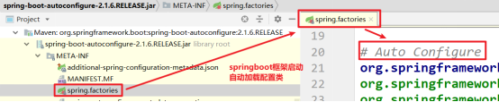

spring.factories (重点包spring-boot-autoconfigure-2.2.2.RELEASE.jar)文件中有关自动配置的配置信息如下：摘抄重点，springboot 启动之后，会自动加载 dispatcherServlet

```
... ... ...
 
org.springframework.boot.autoconfigure.EnableAutoConfiguration=\
org.springframework.boot.autoconfigure.web.servlet.DispatcherServletAutoConfiguration,\
... ... ...
```

o 上面配置文件存在大量的以 Configuration 为结尾的类名称，这些类就是存有自动配置信息的类，而SpringApplication 在获取这些类名后再加载

o 我们以 DispatcherServletAutoConfiguration 为例来分析：

```java
@AutoConfigureOrder(Ordered.HIGHEST_PRECEDENCE)
@Configuration
@ConditionalOnWebApplication(type = Type.SERVLET)
@ConditionalOnClass(DispatcherServlet.class)
@AutoConfigureAfter(ServletWebServerFactoryAutoConfiguration.class)
public class DispatcherServletAutoConfiguration {
 
/*
 * The bean name for a DispatcherServlet that will be mapped to the root URL "/"
 */
public static final String DEFAULT_DISPATCHER_SERVLET_BEAN_NAME = "dispatcherServlet";
```

# **SpringBoot的配置文件**

## SpringBoot配置文件类型

SpringBoot配置文件类型和作用

SpringBoot是基于约定的，所以很多配置都有默认值，但如果想修改默认配置的话，就可以使用**application.properties**或**application.yml**（application.yaml）进行配置。

[https://docs.spring.io/spring-boot/docs/2.2.2.BUILD-SNAPSHOT/reference/htmlsingle/#appendix](#appendix)

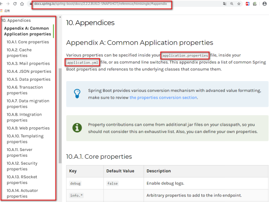

· SpringBoot默认会从Resources目录下加载application.properties或application.yml（application.yaml）

· application.properties

```
# tomcat 端口号
server.port=18081
# 配置项目所在的根目录
server.servlet.context-path=/springboot-demo02
```

· application.yml（application.yaml）

```
server:
    port: 8081
    servlet: 
        context-path=/springboot-demo02
```

· 为什么可以在resources下创建application.properties文件呢？

· 我们查看springboot的启动依赖：点击spring-boot-starter-parent，查看父项目中配置。

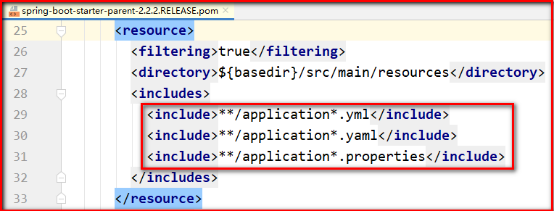

发现除了可以使用 application.propertes 文件，也可以使用 application.yml 或者 application.yaml 文件。

## **SpringBoot-YML配置文件**

**配置文件**

l YML文件格式是YAML (YAML Ain't Markup Language)编写的文件格式，YAML是一种直观的数据序列化格式，可读性高，容易和脚本语言交互的， C/C++, Ruby, Python, Java, Perl, C#, PHP等都支持。YML文件是以数据为核心的，比传统的xml方式更加简洁。YML文件的扩展名可以使用.yml或者.yaml。

它是一个标记语言，比json、xml等更适合做配置文件；

 **YAML语法：**

1、YAML基本语法

o 使用缩进表示层级关系

o 缩进时不允许使用Tab键，只允许使用空格。

o 缩进的空格数目不重要，只要相同层级的元素左侧对齐即可

o 大小写敏感

2、YAML 支持的三种数据结构

o 对象：键值对的集合

o 数组：一组按次序排列的值

o 字面量：单个的、不可再分的值

**值的写法**

· 字面量：普通的值（数字，字符串，布尔）

o k: v：字面直接来写；

· 字符串默认不用加上单引号或者双引号；

o name: "zhangsan \n lisi"：输出；zhangsan 换行 lisi

· ""：双引号；不会转义字符串里面的特殊字符；特殊字符会作为本身想表示的意思

o name: ‘zhangsan \n lisi’：输出；zhangsan \n lisi

· ''：单引号；会转义特殊字符，特殊字符最终只是一个普通的字符串数据

· 对象、Map（属性和值）（键值对）：

o k: v：在下一行来写对象的属性和值的关系；注意缩进

o 对象还是k: v的方式

```
user:
lastName: zhangsan
age: 20
```

o 行内写法：

```
user: {lastName: zhangsan,age: 18}
```

· 数组（List、Set）：

o 用- 值表示数组中的一个元素

```
pets:
‐ cat
‐ dog
‐ pig
```

o 行内写法

```
pets: [cat,dog,pig]
```

## 配置属性

在resource文件夹下面新建 application.yml 文件

```
server:
  port: 18082
user:
  username: zhangsan
  password: 123
```

user类，通过注解 @ConfigurationProperties (prefix="配置文件中的key的前缀")可以将配置文件中的配置自动与实体进行映射

```java
package com.atguigu.springboot.entities;
 
import org.springframework.boot.context.properties.ConfigurationProperties;
import org.springframework.stereotype.Component;
 
@Component
@ConfigurationProperties(value = "user")
public class User implements Serializable{
 
    private String username;
    private String password;
 
    //生成 set get  tostring
}
```

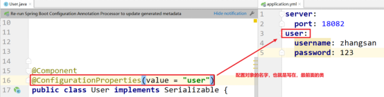

报错提示，请在pom文件添加配置信息

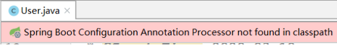

在pom文件添加如下配置

```xml
# 读取配置文件注解
<dependency>
    <groupId>org.springframework.boot</groupId>
    <artifactId>spring-boot-configuration-processor</artifactId>
    <optional>true</optional>
</dependency>
```

修改 SpringbootDemo02Application

```java
@SpringBootApplication
public class SpringbootDemo02Application {
    public static void main(String[] args) {
        ApplicationContext act = SpringApplication.run(SpringbootDemo02Application.class, args);
        User user = (User) act.getBean("user");
        System.out.println(user);
    }
}
```

运行程序

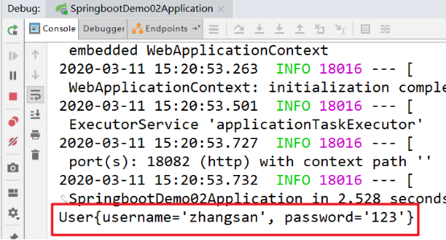

## 配置文件与配置类的属性映射方式

使用注解@Value映射

我们可以通过@Value注解将配置文件中的值映射到一个Spring管理的Bean的字段上

例如：

o application.yml配置如下：

```
person:
  name: zhangsan
  age: 18
```

o 实体Bean代码如下：

```
package com.atguigu.controller;
 
import org.springframework.beans.factory.annotation.Value;
import org.springframework.stereotype.Controller;
import org.springframework.web.bind.annotation.RequestMapping;
import org.springframework.web.bind.annotation.ResponseBody;
 
@Controller
public class Quick2Controller {
 
    @Value("${person.name}")
    private String name;
 
    @Value("${person.addr}")
    private String addr;
 
    @RequestMapping("/quick")
    @ResponseBody
    public String quick(){
        //获得配置文件的信息
        return "name:"+name+",addr="+addr;
    }
 
}
```

浏览器访问地址：<http://localhost:8080/quick> 结果如下：


##  文件加载规则

· SpringBoot使用一个全局的配置文件，配置文件名是固定的（application.properties 、application.yml）

· 源码参考：

org.springframework.boot.context.config.ConfigFileApplicationListener

```
// Note the order is from least to most specific (last one wins)
privatestaticfinalStringDEFAULT_SEARCH_LOCATIONS="classpath:/,classpath:/config/,file:./,file:./config/";
privatestaticfinalStringDEFAULT_NAMES="application";
```

## 自定义配置类

注：Spring创建Bean三种声明方式

标签

< bean id=user" class="com.atguigu.bean.User">< /bean>

组件注解

@Component @Controller @Service @Repository

自定义配置类

```
@Configuration
public class AppConfig {
    @Bean
    public User user(){
return new User();
    }
}
```

# SpringBoot整合mybatis

## **SpringBoot整合mybatis-配置版**

1.创建Spring Starter Project
增加web，jdbc，mybatis，mysql相关组件

2.添加Mybatis的起步依赖

```
    <parent>
        <groupId>org.springframework.boot</groupId>
        <artifactId>spring-boot-starter-parent</artifactId>
        <version>2.2.2.RELEASE</version>
        <relativePath/> <!-- lookup parent from repository -->
    </parent>
 
    <properties>
        <project.build.sourceEncoding>UTF-8</project.build.sourceEncoding>
        <project.reporting.outputEncoding>UTF-8</project.reporting.outputEncoding>
        <java.version>1.8</java.version>
    </properties>
 
    <dependencies>
        <dependency>
            <groupId>org.springframework.boot</groupId>
            <artifactId>spring-boot-starter-web</artifactId>
        </dependency>
 
        <!--SpingBoot集成junit测试的起步依赖-->
        <dependency>
            <groupId>org.springframework.boot</groupId>
            <artifactId>spring-boot-starter-test</artifactId>
            <scope>test</scope>
        </dependency>
 
        <!--mybatis起步依赖-->
        <dependency>
            <groupId>org.mybatis.spring.boot</groupId>
            <artifactId>mybatis-spring-boot-starter</artifactId>
            <version>1.1.1</version>
        </dependency>
 
        <!-- MySQL连接驱动 -->
        <dependency>
            <groupId>mysql</groupId>
            <artifactId>mysql-connector-java</artifactId>
        </dependency>
 
    </dependencies>
 
    <build>
        <plugins>
            <plugin>
                <groupId>org.springframework.boot</groupId>
                <artifactId>spring-boot-maven-plugin</artifactId>
            </plugin>
        </plugins>
    </build>
```

3.增加application.yml

```
spring:
  datasource:
    username: root
    password: root
    url: jdbc:mysql://192.168.137.3:3306/springboot?useSSL=false&useUnicode=true&characterEncoding=UTF-8&serverTimezone=Asia/Shanghai
    driver-class-name: com.mysql.jdbc.Driver
mybatis:
  config-location: classpath:/mybatis/mybatis-config.xml #指定主配置文件
  mapper-locations: classpath:/mybatis/mapper/*.xml # 指定xml映射文件路径
  type-aliases-package: com.atguigu.domain # 指定mybatis别名包
logging:
  level:
    com.atguigu.dao: debug # 配置日志
```

4.创建user表

```
DROP TABLE IF EXISTS `user`;
CREATE TABLE `user` (
  `id` int(11) NOT NULL AUTO_INCREMENT,
  `username` varchar(50) DEFAULT NULL,
  `password` varchar(50) DEFAULT NULL,
  `name` varchar(50) DEFAULT NULL,
  PRIMARY KEY (`id`)
) ENGINE=InnoDB AUTO_INCREMENT=10 DEFAULT CHARSET=utf8;
 
INSERT INTO `user` VALUES ('1', 'zhangsan', '123', '张三');
INSERT INTO `user` VALUES ('2', 'lisi', '123', '李四');
```

5.增加实体类：TAdmin （Alt+insert）

```
package com.atguigu.domain;
 
public class User implements Serializable {
    // 主键
    private Long id;
    // 用户名
    private String username;
    // 密码
    private String password;
    // 姓名
    private String name;
    //此处省略getter和setter方法 .. ..
    
}
```

6.增加Mapper接口

```
@Mapper
public interface UserDao{
public List<User> findAll();
}
```

注意：

@Mapper标记该类是一个mybatis的mapper接口，可以被spring boot自动扫描到spring上下文中

7.增加映射配置文件

在resource文件夹下面新建 /mybatis/mapper/UserDao.xml 加入配置

```
<?xml version="1.0" encoding="utf-8" ?>
<!DOCTYPE mapper PUBLIC "-//mybatis.org//DTD Mapper 3.0//EN"
        "http://mybatis.org/dtd/mybatis-3-mapper.dtd" >
<mapper namespace="com.atguigu.dao.UserDao">
    <select id="findAll" resultType="user">
        select * from user
    </select>
</mapper>
```

8.增加mybatis主配置文件

```
<?xml version="1.0" encoding="UTF-8" ?>
<!DOCTYPE configuration
  PUBLIC "-//mybatis.org//DTD Config 3.0//EN"
  "http://mybatis.org/dtd/mybatis-3-config.dtd">
<configuration>
</configuration>
```

9.增加Service

```
public interface UserService {
    List<User> findAll();
} 
@Service
public class UserServiceImpl implements UserService {
 
    @Autowired
    private UserDao userDao;
 
    @Override
    public List<User> findAll() {
        return userDao.findAll();
    }
}
```

10.增加控制器

```
@RestController
@RequestMapping("/user")
public class UserController {
    @Autowired
    private UserService userService;
 
    @RequestMapping("/findAll")
    private List<User> findAll(){
        return userService.findAll();
    }
}
```

11.增加mapper扫描

```
/**
 * @MapperScan(basePackages = "com.atguigu.dao")
 * 扫描指定包下的所有Mapper接口，将动态代理的实现类对象注入Spring容器中
 * basePackages属性：指定扫描的包路径地址
 * 作用相当于：
 * <bean class="org.mybatis.spring.mapper.MapperScannerConfigurer">
 *     <property name="basePackage" value="com.atguigu.dao"/>
 * </bean>
 */
@MapperScan("com.atguigu.dao")
@SpringBootApplication
public class SpringBoot03Application {
public static void main(String[] args) {
SpringApplication.run(SpringBoot03Application.class, args);
}
}
```

12.测试

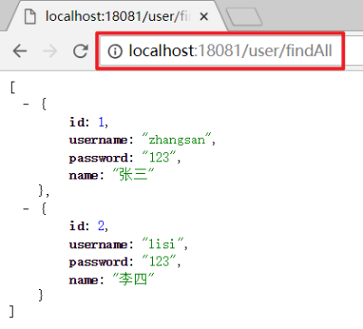

13.如果运行报错：说明jar冲突

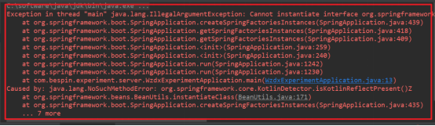

解决方案：

因为pom.xml中引入了spring-boot-starter-web ，同时pom.xml也引入了spring-core，spring-beans，这里去掉spring-core，spring-beans即可。 

##  SpringBoot-整合mybatis-注解版

增加Mapper接口

```
@Mapper
public interface UserDao {
@Select("SELECT * FROM `user` WHERE id=#{id}")
public User getUserById(Integer id);
 
@Insert("INSERT INTO `user`  (username,userpswd,name) VALUES(#{username},#{userpswd},#{name}")
public void insertUser(User user);
}
```

# SpringBoot整合Junit

1.添加Junit的起步依赖

```
<!--测试的起步依赖-->
<dependency>
    <groupId>org.springframework.boot</groupId>
    <artifactId>spring-boot-starter-test</artifactId>
    <scope>test</scope>
</dependency>
```

2.编写测试类
在test文件夹下面新建测试类

```
package com.atguigu;
 
import com.atguigu.domain.User;
import com.atguigu.service.UserService;
import org.junit.Test;
import org.junit.runner.RunWith;
import org.springframework.beans.factory.annotation.Autowired;
import org.springframework.boot.test.context.SpringBootTest;
import org.springframework.test.context.junit4.SpringRunner;
import java.util.List;
 
@RunWith(SpringRunner.class)
@SpringBootTest
public class MapperTest {
 
    @Autowired
    private UserService userService;
 
    @Test
    public void testUser(){
        List<User> users = userService.findAll();
        for (User user : users) {
            System.out.println(user);
        }
    }
 
}
```

3.控制台打印信息

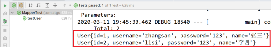

# SpringBoot整合Druid数据源

使用方式一

1.增依赖

```
<!-- https://mvnrepository.com/artifact/com.alibaba/druid -->
<dependency>
    <groupId>com.alibaba</groupId>
    <artifactId>druid</artifactId>
    <version>1.1.12</version>
</dependency>
```

2.配置数据源

```
spring:
  datasource:
    username: root
    password: root
    url: jdbc:mysql://192.168.137.3:3306/atcrowdfunding?useSSL=false&useUnicode=true&characterEncoding=UTF-8
    driver-class-name: com.mysql.jdbc.Driver
    type: com.alibaba.druid.pool.DruidDataSource
```

3.测试

```
@RunWith(SpringRunner.class)
@SpringBootTest
public class SpringBoot03ApplicationTests {
 
@Autowired
DataSource dataSource;
 
/*
 * HikariDataSource 默认数据源，性能很高
 * DruidDataSource 使用很高，很稳定
 */
@Test
public void contextLoads() throws SQLException {
System.out.println(dataSource.getClass());
Connection connection = dataSource.getConnection();
System.out.println(connection);
connection.close();
}
}
```

 使用方式二

1.配置数据源

```
spring:
  datasource:
    username: root
    password: root
    url: jdbc:mysql://192.168.137.3:3306/atcrowdfunding?useSSL=false&useUnicode=true&characterEncoding=UTF-8
    driver-class-name: com.mysql.jdbc.Driver
    filters: stat #用于统计监控信息
```

2.创建数据源

```
@Configuration
public class AppConfig {
@ConfigurationProperties(prefix = "spring.datasource") //将数据库连接信息直接封装到数据源对象中
@Bean
public DataSource dataSource() throws SQLException {
DruidDataSource dataSource = new DruidDataSource();
dataSource.setFilters("stat");
return dataSource;
}
}
```

## Druid监控使用情况

1.增加配置

```
//配置Druid的监控
//1、配置一个管理后台的Servlet
@Bean
public ServletRegistrationBean statViewServlet() {
ServletRegistrationBean bean = new ServletRegistrationBean(new StatViewServlet(), "/druid/*");
 
Map<String, String> initParams = new HashMap<>();
initParams.put("loginUsername", "admin");
initParams.put("loginPassword", "123456");
initParams.put("allow", "");// 默认就是允许所有访问
initParams.put("deny", "192.168.15.21");
 
bean.setInitParameters(initParams);
return bean;
}
//2、配置一个web监控的filter
@Bean
public FilterRegistrationBean webStatFilter() {
FilterRegistrationBean bean = new FilterRegistrationBean();
bean.setFilter(new WebStatFilter());
 
Map<String, String> initParams = new HashMap<>();
initParams.put("exclusions", "*.js,*.css,/druid/*");
 
bean.setInitParameters(initParams);
bean.setUrlPatterns(Arrays.asList("/*"));
 
return bean;
}
```

2.如果无法打印监控语句
可以设置dataSource.setFilters("stat"); 或者spring.datasource.filters=stat

# **SpringBoot集成业务层事务**

1.扫描Dao接口，需要在主程序类中增加扫描注解@MapperScan("com.atguigu.**.dao")及事务管理@EnableTransactionManagement
2.传统的SSM架构中采用的是声明式事务，需要在配置文件中增加AOP事务配置，Spring Boot框架中简化了这种配置，可以在Service类中增加注解@Transactional

#  SpringBoot整合Spring Data JPA

新建项目 springboot_jpa 

添加Spring Data JPA、springWeb、mysql驱动依赖

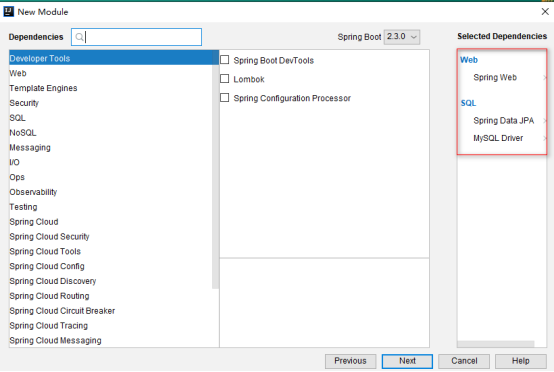

```
     <parent>
        <groupId>org.springframework.boot</groupId>
        <artifactId>spring-boot-starter-parent</artifactId>
        <version>2.0.1.RELEASE</version>
        <relativePath/> <!-- lookup parent from repository -->
    </parent>
 
    <properties>
        <project.build.sourceEncoding>UTF-8</project.build.sourceEncoding>
        <project.reporting.outputEncoding>UTF-8</project.reporting.outputEncoding>
        <java.version>1.8</java.version>
    </properties>
 
    <dependencies>
        <dependency>
            <groupId>org.springframework.boot</groupId>
            <artifactId>spring-boot-starter-web</artifactId>
        </dependency>
 
        <dependency>
            <groupId>org.springframework.boot</groupId>
            <artifactId>spring-boot-starter-test</artifactId>
            <scope>test</scope>
        </dependency>
 
        <!-- springBoot JPA的起步依赖 -->
        <dependency>
            <groupId>org.springframework.boot</groupId>
            <artifactId>spring-boot-starter-data-jpa</artifactId>
        </dependency>
        <!-- MySQL连接驱动 -->
        <dependency>
            <groupId>mysql</groupId>
            <artifactId>mysql-connector-java</artifactId>
        </dependency>
    </dependencies>
```

application.yml中配置数据库和jpa的相关属性

```
logging:
  level:
    com.atguigu: debug # 配置日志
spring:
  datasource:
    username: root
    password: root
    url: jdbc:mysql://127.0.0.1:3306/springboot?useSSL=false&useUnicode=true&characterEncoding=UTF-8&serverTimezone=Asia/Shanghai
    driver-class-name: com.mysql.jdbc.Driver
  jpa:
    database: mysql
    show-sql: true
    generate-ddl: true
    hibernate:
      ddl-auto: update
      naming_strategy: org.hibernate.cfg.ImprovedNamingStrategy
server:
  port: 18081
```

创建实体配置实体

```
package com.atguigu.domain;
 
import javax.persistence.*;
 
@Entity
@Table(name = "user")
public class User{
 
    @Id
    @GeneratedValue(strategy = GenerationType.IDENTITY)
    @Column(name = "id")
    private Long id;
 
    @Column(name = "username")
    private String username;
 
    @Column(name = "password")
    private String password;
 
    @Column(name = "name")
    private String name;
 
    //此处省略setter和getter方法... ...
}
```

编写UserRepository

```
package com.atguigu.dao;
 
import com.atguigu.domain.User;
import org.springframework.data.jpa.repository.JpaRepository;
 
public interface UserDao extends JpaRepository<User,Integer> {
}
```

编写service类

```
package com.atguigu.service;
 
import com.atguigu.domain.User;
import java.util.List;
 
public interface UserService {
    List<User> findUsers();
    User findUserById(Integer id);
    void saveUser(User user);
    void updateUser(User user);
    void deleteUserById(Integer id);
}
package com.atguigu.service.impl;
 
import com.atguigu.dao.UserDao;
import com.atguigu.domain.User;
import com.atguigu.service.UserService;
import org.springframework.beans.factory.annotation.Autowired;
import org.springframework.stereotype.Service;
import java.util.List;
 
@Service
public class UserServiceImpl implements UserService {
 
    @Autowired
    private UserDao userDao;
 
    /**
     * 查询所有
     */
    @Override
    public List<User> findUsers() {
        return userDao.findAll();
    }
    /**
     * 根据id查询
     */
    @Override
    public User findUserById(Integer id) {
        return userDao.findById(id).get();
    }
    /**
     * 保存
     */
    @Override
    public void saveUser(User user) {
        userDao.save(user);
    }
    /**
     * 更新
     */
    @Override
    public void updateUser(User user) {
        userDao.save(user);
    }
    /**
     * 根据id删除
     */
    @Override
    public void deleteUserById(Integer id) {
        userDao.deleteById(id);
    }
}
```

编写controller类

```
package com.atguigu.controller;
 
import com.atguigu.domain.User;
import com.atguigu.service.UserService;
import org.springframework.beans.factory.annotation.Autowired;
import org.springframework.web.bind.annotation.RequestMapping;
import org.springframework.web.bind.annotation.RestController;
import java.util.List;
 
@RestController
@RequestMapping("/user")
public class UserController {
 
    @Autowired
    private UserService userService;
 
    @RequestMapping("/findAll")
    public List<User> findAll(){
        return userService.findUsers();
    }
}
```

控制台打印信息

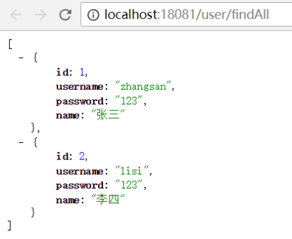

注意：如果是jdk9，执行报错如下：

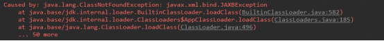

原因：jdk缺少相应的jar

解决方案：手动导入对应的maven坐标，如下：

```
<!--jdk9需要导入如下坐标-->
<dependency>
    <groupId>javax.xml.bind</groupId>
    <artifactId>jaxb-api</artifactId>
    <version>2.3.0</version>
</dependency>
```

# **SpringBoot整合Redis**

找到上面的 springboot_mybatis 项目，添加pom文件

添加redis的起步依赖

```
<!-- 配置使用redis启动器 -->
<dependency>
    <groupId>org.springframework.boot</groupId>
    <artifactId>spring-boot-starter-data-redis</artifactId>
</dependency>
```

配置redis的连接信息

在 application.yml 文件 添加 redis 的配置信息

```
mybatis:
  type-aliases-package: com.atguigu.domain # 指定mybatis别名包
  mapper-locations: classpath:com/atguigu/dao/*.xml # 指定xml映射文件路径
logging:
  level:
    com.atguigu.dao: debug # 配置日志
spring:
  datasource:
    username: root
    password: root
    url: jdbc:mysql://127.0.0.1:3306/springboot?useUnicode=true&characterEncoding=utf8
    driver-class-name: com.mysql.jdbc.Driver
  redis: #Redis
    port: 6379
    host: 127.0.0.1
server:
  port: 8081
```

注入RedisTemplate测试redis操作

在 service 的实现类里面实现业务逻辑

```
@Autowired
RedisTemplate redisTemplate;
@RequestMapping("/findAll")
public List<User> findAll(){
    long start = System.currentTimeMillis();
    //从redis中查询user列表
    List<User> users = (List<User>) redisTemplate.boundValueOps("users").get();
    if(CollectionUtils.isEmpty(users)){
        //如果redis中没有缓存，去数据库查询
        users = userService.findUsers();
        System.out.println("使用数据库查询数据....");
        //将users存到redis中
        redisTemplate.boundValueOps("users").set(users);
    }else{
        System.out.println(" 使用redis缓存数据...." );
    }
    System.out.println("耗时："+(System.currentTimeMillis()-start));
    return users;
}

```

运行程序

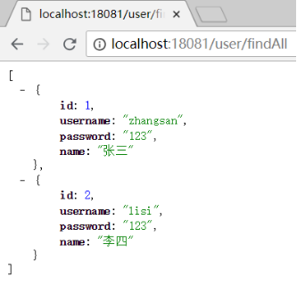

# **SpringBoot整合定时任务**

创建项目 springboot_task，并引入springweb

添加pom文件依赖

```
<dependency>
    <groupId>org.springframework.boot</groupId>
    <artifactId>spring-boot-starter-web</artifactId>
</dependency>
<dependency>
    <groupId>org.springframework</groupId>
    <artifactId>spring-context-support</artifactId>
    <version>5.2.6.RELEASE</version>
</dependency>
```

在主程序类名上添加注解：

@EnableScheduling

创建 TaskController

```
@Component
public class TastService {
    //fixedDelay：距离上一次定时任务执行完毕后N毫秒再执行，
    //  执行A任务花了5秒，比如参数是3000，A任务执行完成之后，再过3秒执行
    @Scheduled(fixedDelay = 3000)
    public void task01(){
        SimpleDateFormat simpleDateFormat = new SimpleDateFormat("yyyy-MM-dd HH:mm:ss");
        System.out.println(simpleDateFormat.format(new Date()));
    }
}

```

运行程序 ， 每隔 3秒钟 执行一次

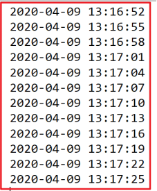

修改程序 ， 增加休眠时间 ， 测试

```
@Scheduled(fixedDelay = 3000)
public void task01(){
    SimpleDateFormat simpleDateFormat = new SimpleDateFormat("yyyy-MM-dd HH:mm:ss");
    try {
        Thread.sleep(3000);
    } catch (InterruptedException e) {
        e.printStackTrace();
    }
    System.out.println(simpleDateFormat.format(new Date()));
}
```

运行程序 ，每隔 6秒 执行一次

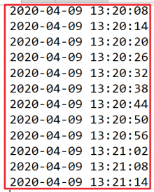

修改程序 ，换成 fixedRate 参数

```
//fixedRate：上一次开始执行时间点之后N毫秒再执行
@Scheduled(fixedRate = 3000)
public void task01(){
    SimpleDateFormat simpleDateFormat = new SimpleDateFormat("yyyy-MM-dd HH:mm:ss");
    try {
        Thread.sleep(2000);
    } catch (InterruptedException e) {
        e.printStackTrace();
    }
    System.out.println(simpleDateFormat.format(new Date()));
}
```

运行程序 ，每隔 3秒 执行一次

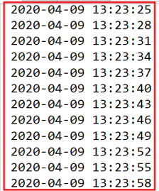

修改程序 , 添加休眠

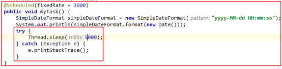

运行程序 ，每隔 5 秒 执行一次

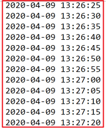

修改程序 ，换成 cron 参数

cron参数接收一个cron表达式，cron表达式是一个字符串，字符串以5或6个空格隔开，分开共6或7个域，每一个域代表一个含义。

| **序号** | **说明** | **必填** | **允许填写的值** | **允许的通配符** |
| -------- | -------- | -------- | ---------------- | ---------------- |
| 1        | 秒       | 是       | 0-59             | , - * /          |
| 2        | 分       | 是       | 0-59             | , - * /          |
| 3        | 时       | 是       | 0-23             | , - * /          |
| 4        | 日       | 是       | 1-31             | , - * ? / L W    |
| 5        | 月       | 是       | 1-12 / JAN-DEC   | , - * /          |
| 6        | 周       | 是       | 1-7 or SUN-SAT   | , - * ? / L #    |
| 7        | 年       | 否       | 1970-2099        | , - * /          |

`*`表示所有值。 例如:在分的字段上设置 *,表示每一分钟都会触发。 

? 表示不指定值。使用的场景为不需要关心当前设置这个字段的值。例如:要在每月的10号触发一个操作，但不关心是周几，所以需要周位置的那个字段设置为”?” 具体设置为 0 0 0 10 * ? 

\- 表示区间。例如 在小时上设置 “10-12”,表示 10,11,12点都会触发。 

, 表示分隔多个值。例如在周字段上设置 “MON,WED,FRI” 表示周一，周三和周五触发 

/ 用于递增触发。如在秒上面设置”5/15” 表示从5秒开始，每增15秒触发(5,20,35,50)。 在日字段上设置’1/3’所示每月1号开始，每隔三天触发一次。 

```
//每5秒执行一次
//cron = "0 */1 * * * *"  每一分钟执行一次
//cron = "5,15,25,45 * * * * *"  第5/15/25/45秒 执行一次
@Scheduled(cron = "*/5 * * * * *")
public void task01(){
    SimpleDateFormat simpleDateFormat = new SimpleDateFormat("yyyy-MM-dd HH:mm:ss");
    System.out.println(simpleDateFormat.format(new Date()));
}

```

运行程序 ， 每隔5秒打印一次

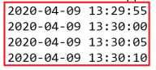

# **SpringBoot整合模板Thymeleaf**

## Thymeleaf介绍

​	SpringBoot支持很多模板引擎技术，包含FreeMarker,Groovy,Thymeleaf,Velocity和Mustache,Spring Boot中推荐使用Thymeleaf作为模板引擎.因为Thymeleaf提供了完美的SpringMVC支持.
​	Thymeleaf是一个java类库，他是一个xml/xhtml/html5的模板引擎，可以作为mvc的web应用的view层。
​	spring Boot通过org.springframework.boot.autoconfigure.thymeleaf包对Thymeleaf进行了自动配置。
​	通过ThymeleafAutoConfiguration类对集成所需要的bean进行自动配置。
​	包括templateResolver，templateEngine，thymeleafViewResolver都有SpringBoot的默认配置。其中视图解析器的prefix是：classpath:/templates/ ， suffix是：.html

##  整合Thymeleaf

1.创建工程

1.1 创建一个独立的工程 springboot-thymeleaf
1.2 引入Spring-web和thymeleaf的依赖

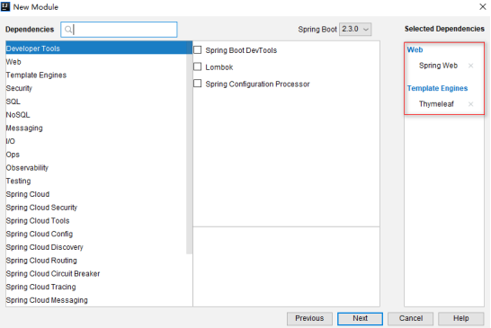

```
<dependency>
    <groupId>org.springframework.boot</groupId>
    <artifactId>spring-boot-starter-thymeleaf</artifactId>
</dependency>
<dependency>
    <groupId>org.springframework.boot</groupId>
    <artifactId>spring-boot-starter-web</artifactId>
</dependency>
```

2.创建html

在templates 目录创建 thymeleaf-helloworld.html 

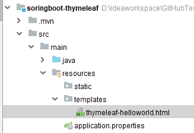

3.thymeleaf配置

 在resources目录下创建application.yml ,并添加 thymeleaf 的配置

```
spring:
  thymeleaf:
    cache: false # 开发禁用缓存，生产环境开启缓存
    prefix: classpath:/templates/   # thymeleaf处理返回视图名称的前缀
    suffix: .html #thymeleaf处理返回视图名称的后缀
```

4.控制层

创建 com.atguigu.controller.HelloController处理请求转发到thymeleaf-hello页面，代码如下：

```
@Controller
@RequestMapping("/thymeleaf")
public class HelloController {
    @GetMapping("/hello")
    public String hello(){
        return "thymeleaf-helloworld";
    }
}
```

5.测试

启动系统，并在浏览器访问 <http://localhost:8080/thymeleaf/hello>

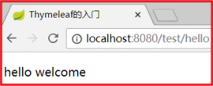

## Thymeleaf基本语法

1.获取域中的属性值

1.1简单类型数据
在HelloController中创建方法，向域中存入简单类型数据、自定义类型的对象。

```
@GetMapping("/helloScope")
public String helloScope(Model model , HttpSession session){
    model.addAttribute("reqStrKey" , "string...");
    model.addAttribute("reqIntKey" , "62");
    model.addAttribute("reqUserKey" , new User(1,"anni" , "123456"));
    session.setAttribute("sessionStrKey","string........");
    session.setAttribute("sessionUserKey",new User(2,"guoge" , "123456"));
    ServletContext app = session.getServletContext();
    app.setAttribute("appStrKey","enheng");
    return "thymeleaf-scope";
}
```

在themeleaf-scope.html页面中获取域中数据并显示

```
<!-- 必须引入thymeleaf命名空间 -->
<html lang="en"  xmlns:th="http://www.thymeleaf.org">
<head>
    <meta charset="UTF-8">
    <title>获取域中简单类型数据</title>
</head>
<body>
    <h2>获取req域中的数据</h2>
    <!-- th:text : 双标签显示文本内容 -->
    <!-- th:text="${reqStrKey}==null?_:${reqStrKey}"
        ${reqKey} :默认从request域获取属性值，_代表不替换双标签内部文本
     -->
    <div th:text="${reqStrKey}==null?_:${reqStrKey}">默认值</div>
    <!-- 数值型可以直接相加   -->
    <div th:text="${reqIntKey}+100"></div>
    <!-- 如果是引用类型可以直接获取属性 -->
    <div th:text="${reqUserKey.id}"></div>

    <h2>获取session域中的数据</h2>
    <!-- 字符串拼接，字面量需要用引号引起 -->
    <div th:text="'从session域中获取到的字符串:'+${session.sessionStrKey}">默认值</div>
    <!-- session域必须使用session. 获取 -->
    <div th:text="${session.sessionUserKey.username}"></div>
    <h2>获取application域中的数据</h2>
    <!-- 一般thymeleaf语法都是在标签属性中使用，也可以通过两对中括号写thymeleaf语法直接显示内容-->
    <!-- application域也必须指定 -->
    [[${application.appStrKey}]]
    <br>
    <!-- 如果希望由thymeleaf自动解析字符串拼接，使用两个管道符 -->
    <div th:text="|从app域中获取的属性值: ${application.appStrKey}|"></div>
</body>
</html>
```

1.2集合类型数据

创建User类

```
public class User {
    private Integer id;
    private String username;
    private String password;

    public User(Integer id, String username, String password) {
        this.id = id;
        this.username = username;
        this.password = password;
    }

    @Override
    public String toString() {
        return "User{" +
                "id=" + id +
                ", username='" + username + '\'' +
                ", password='" + password + '\'' +
                '}';
    }
    public User() {
    }
    public Integer getId() {
        return id;
    }

    public void setId(Integer id) {
        this.id = id;
    }

    public String getUsername() {
        return username;
    }

    public void setUsername(String username) {
        this.username = username;
    }

    public String getPassword() {
        return password;
    }

    public void setPassword(String password) {
        this.password = password;
    }
}
```

在HelloController中创建方法，向域中存入集合数据

```
@GetMapping("/helloScope2")
public String helloScope(Model model , HttpSession session){
    List<User> users = new ArrayList<User>();
    users.add(new User(9527,"guoge","123456"));
    users.add(new User(9528,"guodi","123456"));
    users.add(new User(9529,"guojie","123456"));
    session.setAttribute("users" , users);

    Map<Integer , User> userMap = new HashMap<Integer , User>();
    userMap.put(9527,new User(9527,"guoge","123456"));
    userMap.put(9528,new User(9528,"guodi","123456"));
    userMap.put(9529,new User(9529,"guomei","123456"));
    session.setAttribute("userMap" , userMap);
    return "thymeleaf-scope2";
}
```

页面获取域中集合数据显示

```
<!-- 必须引入thymeleaf命名空间 -->
<html lang="en"  xmlns:th="http://www.thymeleaf.org">
<head>
    <meta charset="UTF-8">
    <title>获取域中集合类型数据遍历显示</title>
</head>
<body>
    <h3>显示list数据到表格中</h3>
    <!-- th:if="${not #lists.isEmpty(session.users)} 集合非空判断
        th:if="${#lists.isEmpty(session.users)}  集合空值判断
     -->
    <table th:if="${not #lists.isEmpty(session.users)}">
        <th>
            <td>序号</td>
            <td>ID</td>
            <td>账号</td>
            <td>密码</td>
        </th>
        <!-- th:each="user,vs:${session.users}" 遍历取出的集合
               user：正在遍历的元素
               vs：varstatus 正在遍历的状态对象
        -->
        <tr th:each="user,vs:${session.users}">
            <td>[[${vs.count}]]</td>
            <td th:text="${user.id}==null?_:${user.id}">00000</td>
            <td th:text="${user.username}">游客</td>
            <td th:text="${user.password}">***</td>
        </tr>
    </table>
    <h3>遍历Map集合</h3>
    <!-- 每次遍历会将所在的标签整体创建一次 -->
    <div th:each="map:${session.userMap}">
        <span th:text="${map.key}"></span>:<span th:text="${map.value}"></span>
    </div>
</body>
</html>
```

2.动态设置标签的属性值

使用指定的 th:* 可以给标签动态设置属性值,比如 th:text, th:value, th:id,th:href ...

几乎所有的 html 元素属性都有对应的 th:* 版本.

```
<tr th:each="user,vs:${session.users}">
    <td>[[${vs.count}]]</td>
    <td th:text="${user.id}==null?_:${user.id}">00000</td>
    <td th:text="${user.username}">游客</td>
    <td th:text="${user.password}">***</td>
    <!-- th:id的值会覆盖原有属性id的值 -->
    <td><a id="11" th:id="${user.id}" th:href="'/project/delUser?id='+${user.id}" href="#">删除</a></td>
</tr>
```

3.Date输出

```
session.setAttribute("date",new Date());
<div th:text="${#dates.format(session.date,'yyyy-MM-dd HH:mm:ss')}"></div>
```

4.Thymeleaf表达式

4.1 ${表达式}
	用来获取域中属性值 
	${key}、${session.key}
4.2 @{绝对路径}
	用来在绝对路径前拼接项目名

1、在项目application.yml文件中配置上下文路径

```
server:
  servlet:
    context-path: /app #上下文路径
```

2、在页面中测试路径的拼接

```
<a id="11" th:id="${user.id}" href="delUser" th:href="@{'/user/delUser?id='+${user.id}}">删除</a>
```

3、效果：

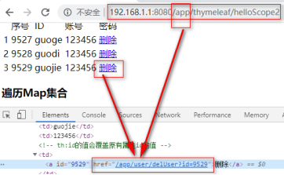

4.3 ~{pagename::fragment选择器字符串}

用来在页面中引入页面碎片
	Pagename指的是要引入的页面碎片所在的页面路径名称，由thymeleaf视图解析器解析。选择器字符串指的是页面碎片的id或class或fragement表达式。
1、在templates下创建base_include.html页面,以后需要抽取的页面碎片可以存入到此页面中

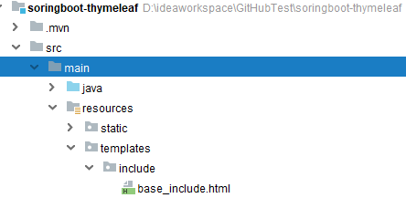

```
<html lang="en" xmlns:th="http://www.thymeleaf.org">
<head>
    <meta charset="UTF-8">
    <title>Title</title>
</head>
<body>
    <!-- th:fragment="heheFragement" 定义页面碎片名称 -->
    <div th:fragment="heheFragement">
        <h5>hehe</h5>
    </div>
    <!-- 定义id值，不能使用th:前缀 -->
    <div id="hahaId">
        <h5>haha</h5>
    </div>
    <div class="heiheiClass">
        <h5>heihei</h5>
    </div>
</body>
</html>
```

2、页面中引入页面碎片

```
<!--
    th:include="~{include/base_include::heheFragement}" 在页面中引入页面碎片
    include/base_include  ：包含碎片的页面，有thymeleaf拼接前后缀查找
    heheFragement   ：选择器字符串
  -->
<div th:include="~{include/base_include::heheFragement}"></div>
<div th:include="~{include/base_include::#hahaId}"></div>
<div th:include="~{include/base_include::.heiheiClass}"></div>

```

3、效果


# SpringBoot-整合Web组件

## 监听器

```
package com.atguigu.listener;
 
import javax.servlet.ServletContextEvent;
import javax.servlet.ServletContextListener;
import javax.servlet.annotation.WebListener;
 
@WebListener
public class HelloListener implements ServletContextListener {
@Override
public void contextDestroyed(ServletContextEvent arg0) {
System.out.println("应用销毁了....HelloListener");
}
 
@Override
public void contextInitialized(ServletContextEvent arg0) {
System.out.println("应用启动了....HelloListener");
}
}
```

## 过滤器

```
package com.atguigu.filter;
 
import java.io.IOException;
 
import javax.servlet.Filter;
import javax.servlet.FilterChain;
import javax.servlet.FilterConfig;
import javax.servlet.ServletException;
import javax.servlet.ServletRequest;
import javax.servlet.ServletResponse;
import javax.servlet.annotation.WebFilter;
 
 
@WebFilter(urlPatterns="/*")
public class HelloFilter implements Filter {
 
@Override
public void destroy() {
 
}
 
@Override
public void doFilter(ServletRequest arg0, ServletResponse arg1, FilterChain arg2)
throws IOException, ServletException {
System.out.println("HelloFilter............放行之前");
arg2.doFilter(arg0, arg1);
System.out.println("HelloFilter............放行之后");
}
 
@Override
public void init(FilterConfig arg0) throws ServletException {
 
}
 
}
```

## Servlet

```
package com.atguigu.servlet;
 
import java.io.IOException;
 
import javax.servlet.ServletException;
import javax.servlet.annotation.WebServlet;
import javax.servlet.http.HttpServlet;
import javax.servlet.http.HttpServletRequest;
import javax.servlet.http.HttpServletResponse;
 
@WebServlet(urlPatterns="/my")
public class MyServlet extends HttpServlet {
 
@Override
protected void doGet(HttpServletRequest req, HttpServletResponse resp) throws ServletException, IOException {
resp.getWriter().write("MyServlet do.......");
}
 
}
```

##  扫描组件

```
@ServletComponentScan
@MapperScan("com.atguigu.mapper")
@SpringBootApplication
public class SpringBoot03Application {
 
public static void main(String[] args) {
SpringApplication.run(SpringBoot03Application.class, args);
}
 
}
```

