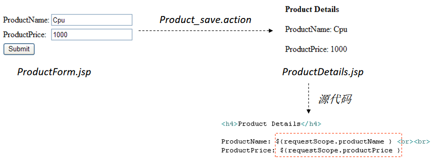
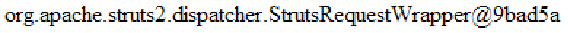
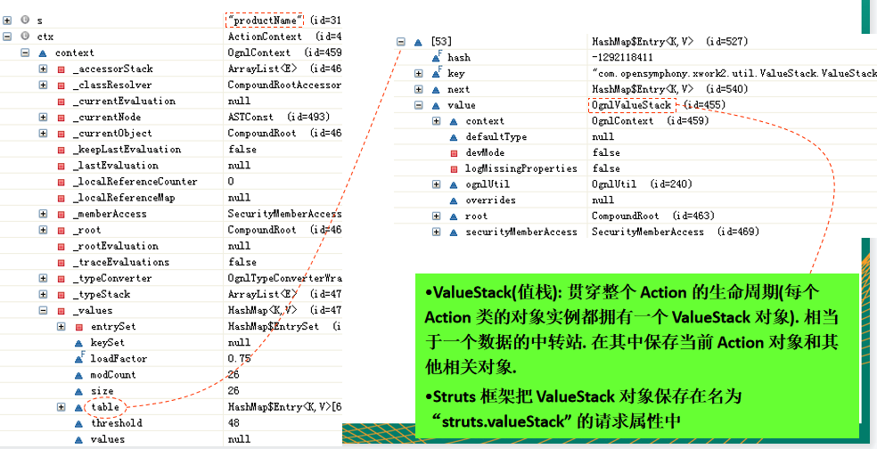
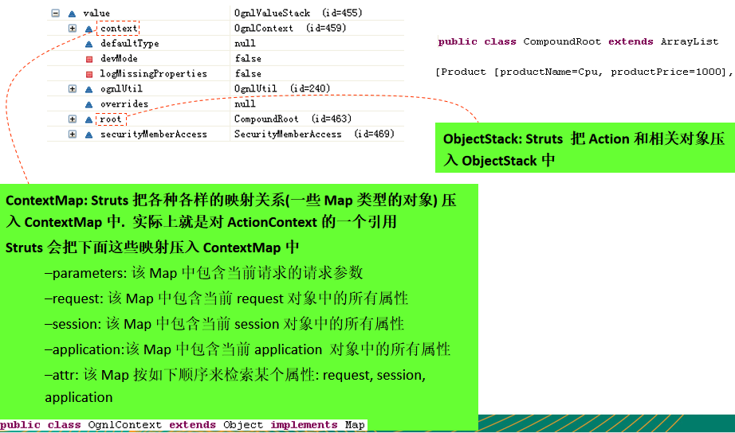
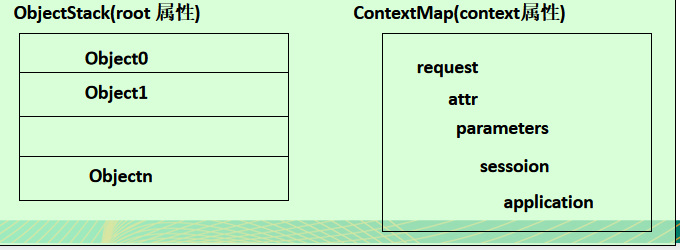
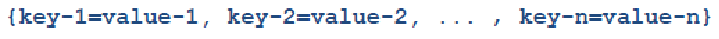

[TOC]

# 第一章 MVC设计模式概览

实现 MVC(Model、View、Controller) 模式的应用程序由 3 大部分构成：

- 模型：封装应用程序的数据和业务逻辑（POJO 即plain old java object）

- 视图：实现应用程序的信息显示功能 (JSP)
- 控制器：接收来自用户的输入，调用模型层，响应对应的视图组件(servlet，filter)

# 第二章 使用Filter作为控制器的MVC

需求：


目录结构：


代码实现：

- index.jsp

```html
<%@ page language="java" contentType="text/html; charset=UTF-8"
    pageEncoding="UTF-8"%>
<!DOCTYPE html PUBLIC "-//W3C//DTD HTML 4.01 Transitional//EN" "http://www.w3.org/TR/html4/loose.dtd">
<html>
<head>
<meta http-equiv="Content-Type" content="text/html; charset=UTF-8">
<title>Insert title here</title>
</head>
<body>
	
	<a href="product-input.action">Product Input</a>
	
</body>
</html>
```

- web.xml

```xml
<?xml version="1.0" encoding="UTF-8"?>
<web-app xmlns:xsi="http://www.w3.org/2001/XMLSchema-instance" xmlns="http://java.sun.com/xml/ns/javaee" xmlns:web="http://java.sun.com/xml/ns/javaee/web-app_2_5.xsd" xsi:schemaLocation="http://java.sun.com/xml/ns/javaee http://java.sun.com/xml/ns/javaee/web-app_2_5.xsd" id="WebApp_ID" version="2.5">
  <display-name>struts2-1</display-name>
  <welcome-file-list>
    <welcome-file>index.html</welcome-file>
    <welcome-file>index.htm</welcome-file>
    <welcome-file>index.jsp</welcome-file>
    <welcome-file>default.html</welcome-file>
    <welcome-file>default.htm</welcome-file>
    <welcome-file>default.jsp</welcome-file>
  </welcome-file-list>
  <filter>
    <display-name>FilterDispatcher</display-name>
    <filter-name>FilterDispatcher</filter-name>
    <filter-class>com.atguigu.struts2.helloworld.FilterDispatcher</filter-class>
  </filter>
  <filter-mapping>
    <filter-name>FilterDispatcher</filter-name>
    <url-pattern>*.action</url-pattern>
  </filter-mapping>
</web-app>
```

- Product.java

  ```java
  package com.atguigu.struts2.helloworld;
  
  public class Product {
  	
  	private Integer productId;
  	private String productName;
  	private String productDesc;
  	
  	private double productPrice;
  
  	public Integer getProductId() {
  		return productId;
  	}
  
  	public void setProductId(Integer productId) {
  		this.productId = productId;
  	}
  
  	public String getProductName() {
  		return productName;
  	}
  
  	public void setProductName(String productName) {
  		this.productName = productName;
  	}
  
  	public String getProductDesc() {
  		return productDesc;
  	}
  
  	public void setProductDesc(String productDesc) {
  		this.productDesc = productDesc;
  	}
  
  	public double getProductPrice() {
  		return productPrice;
  	}
  
  	public void setProductPrice(double productPrice) {
  		this.productPrice = productPrice;
  	}
  
  	public Product(Integer productId, String productName, String productDesc,
  			double productPrice) {
  		super();
  		this.productId = productId;
  		this.productName = productName;
  		this.productDesc = productDesc;
  		this.productPrice = productPrice;
  	}
  	
  	public Product() {
  		// TODO Auto-generated constructor stub
  	}
  
  	@Override
  	public String toString() {
  		return "Product [productId=" + productId + ", productName="
  				+ productName + ", productDesc=" + productDesc
  				+ ", productPrice=" + productPrice + "]";
  	}
      
  	
  }
  
  ```

- FilterDispatcher.java

```java
package com.atguigu.struts2.helloworld;

import java.io.IOException;
import javax.servlet.Filter;
import javax.servlet.FilterChain;
import javax.servlet.FilterConfig;
import javax.servlet.ServletException;
import javax.servlet.ServletRequest;
import javax.servlet.ServletResponse;
import javax.servlet.http.HttpServletRequest;

/**
 * Servlet Filter implementation class FilterDispatcher
 */
public class FilterDispatcher implements Filter {

	public void destroy() {}

	public void doFilter(ServletRequest request, ServletResponse response, FilterChain chain) throws IOException, ServletException {
		
		HttpServletRequest req = (HttpServletRequest) request;
		
		//1. 获取 servletPath
		String servletPath = req.getServletPath();
		System.out.println(servletPath);
		
		String path = null;
		
		//2. 判断 servletPath, 若其等于 "/product-input.action", 则转发到
		///WEB-INF/pages/input.jsp
		if("/product-input.action".equals(servletPath)){
			path = "/WEB-INF/pages/input.jsp";
		}
		
		//3. 若其等于 "/product-save.action", 则
		if("/product-save.action".equals(servletPath)){
			//1). 获取请求参数
			String productName = request.getParameter("productName");
			String productDesc = request.getParameter("productDesc");
			String productPrice = request.getParameter("productPrice");
			
			//2). 把请求信息封装为一个 Product 对象
			Product product = new Product(null, productName, productDesc, Double.parseDouble(productPrice));
			
			//3). 执行保存操作
			System.out.println("Save Product: " + product);
			product.setProductId(1001);
			
			//4). 把 Product 对象保存到 request 中. ${param.productName} -> ${requestScope.product.productName}
			request.setAttribute("product", product);
			
			path = "/WEB-INF/pages/details.jsp";
		}
		
		if(path != null){
			request.getRequestDispatcher(path).forward(request, response);
			return;
		}
		
		chain.doFilter(request, response);
	}

	public void init(FilterConfig fConfig) throws ServletException {}

}
```

- input.jsp

```html
<%@ page language="java" contentType="text/html; charset=UTF-8"
    pageEncoding="UTF-8"%>
<!DOCTYPE html PUBLIC "-//W3C//DTD HTML 4.01 Transitional//EN" "http://www.w3.org/TR/html4/loose.dtd">
<html>
<head>
<meta http-equiv="Content-Type" content="text/html; charset=UTF-8">
<title>Insert title here</title>
</head>
<body>

	<form action="product-save.action" method="post">
		
		ProductName: <input type="text" name="productName"/>
		<br><br>

		ProductDesc: <input type="text" name="productDesc"/>
		<br><br>
		
		ProductPrice: <input type="text" name="productPrice" />
		<br><br>
		
		<input type="submit" value="Submit"/>
		<br><br>
	
	</form>

</body>
</html>
```

- details.jsp

```html
<%@ page language="java" contentType="text/html; charset=UTF-8"
    pageEncoding="UTF-8"%>
<!DOCTYPE html PUBLIC "-//W3C//DTD HTML 4.01 Transitional//EN" "http://www.w3.org/TR/html4/loose.dtd">
<html>
<head>
<meta http-equiv="Content-Type" content="text/html; charset=UTF-8">
<title>Insert title here</title>
</head>
<body>
	
	ProductId: ${requestScope.product.productId }
	<br><br>

	ProductName: ${requestScope.product.productName }
	<br><br>
	
	ProductDesc: ${requestScope.product.productDesc }
	<br><br>
	
	ProductPrice: ${requestScope.product.productPrice }
	<br><br>
	
</body>
</html>
```

使用 Filter 作为控制器的好处：

- 使用一个过滤器来作为控制器, 可以方便地在应用程序里对所有资源(包括静态资源)进行控制访问. 

```xml
<url-pattern>*.action</url-pattern>
```

Servlet VS Filter

1. Servlet 能做的 Filter 是否都可以完成 ? 嗯。
2. Filter 能做的 Servlet 都可以完成吗 ? 拦截资源却不是 Servlet 所擅长的! Filter 中有一个 FilterChain，这个 API 在 Servlet 中没有！

# 第三章 Hello Struts2

## Struts2概述

Struts2 是一个用来开发 MVC 应用程序的框架. 它提供了 Web 应用程序开发过程中的一些常见问题的解决方案: 

- 对来自用户的输入数据进行合法性验证
- 统一的布局
- 可扩展性
- 国际化和本地化
- 支持 Ajax
- 表单的重复提交
- 文件的上传下载
- …..

## Struts2 VS Struts1

在体系结构方面更优秀:

- 类更少, 更高效:  在 Struts2 中无需使用 “ActionForm” 来封装请求参数. 
- 扩展更容易:  Struts2 通过拦截器完成了框架的大部分工作. 在 Struts2 中插入一个拦截器对象相当简便易行. 

更容易测试:

- 即使不使用浏览器也可以对基于 Struts2 的应用进行测试

## 从 Struts1 升级到 Struts2

1. Struts2 从本质上讲已不是从 Struts1 扩展而来的, 说它是一个换了品牌标签的 WebWork 更合适
2. 从 Struts1 升级到 Struts2:
   - Struts1 里使用 ActionServlet 作为控制器; Struts2 使用了一个过滤器作为控制器
   - Struts1 中每个 HTML 表单都对应一个 ActionForm 实例. Struts2 中, HTML 表单将被直接映射到一个 POJO.
   - Struts1 的验证逻辑编写在 ActionForm 中; Struts2 中的验证逻辑编写在 Action 中.
   - Struts1 中, Action 类必须继承 org.apache.struts.action.Action 类; Struts2 中任何一个 POJO 都可以是一个 Action 类. 
   - Struts2 在页面里使用 OGNL 来显示各种对象模型, 可以不再使用 EL 和 JSTL 

## 下载Struts2

1. 打开浏览器输入 http://struts.apache.org/
2. 点击超链接 “Struts 2.3.x”, 打开下载页面
   
   
3. 点击 “struts-2.3.x-all.zip” 下载 

## Struts2 的 Hello World

需求：


目录结构：


搭建 Struts2 的环境:

1. 加入 jar 包: 复制 struts\apps\struts2-blank\WEB-INF\lib 下的所有 jar 包到当前 web 应用的 lib 目录下.
2. 在 web.xml 文件中配置 struts2: 复制 struts\apps\struts2-blank1\WEB-INF\web.xml 文件中的过滤器的配置到当前 web 应用的 web.xml 文件中
3. 在当前 web 应用的 classpath 下添加 struts2 的配置文件 struts.xml: 复制 struts1\apps\struts2-blank\WEB-INF\classes 下的 struts.xml 文件到当前 web 应用的 src 目录下. 

添加DTD约束：

- 在下载的struts架包中包含了dtd文件。
- 路径在：struts-2.3.4-all\struts-2.3.4\src\core\src\main\resources


编辑 struts.xml 文件: struts.xml 文件是对 struts 应用程序里的 Action  进行配置的地方. 
配置 package 元素


配置 action 元素


配置 result 元素


# 第四章 Action类

1. action: 应用程序可以完成的每一个操作. 例如: 显示一个登陆表单; 把产品信息保存起来
2. Action类: 普通的 Java 类, 可以有属性和方法, 同时必须遵守下面这些规则: 
   - 属性的名字必须遵守与 JavaBeans 属性名相同的命名规则. 属性的类型可以是任意类型. 从字符串到非字符串(基本数据库类型)之间的数据转换可以自动发生
   - 必须有一个不带参的构造器
   - 至少有一个供 struts 在执行这个 action 时调用的方法
   - 同一个 Action 类可以包含多个 action 方法. 
   - Struts2 会为每一个 HTTP 请求创建一个新的 Action 实例

# 第五章 访问web资源

在 Action 中, 可以通过以下方式访问 web 的 HttpSession, HttpServletRequest, HttpServletResponse  等资源。

- 与 Servlet API 解耦的访问方式

  通过com.opensymphony.xwork2.ActionContext

  通过Action实现如下接口：

  1. org.apache.struts2.interceptor.ApplicationAware;

  2. org.apache.struts2.interceptor.RequestAware;
  3. org.apache.struts2.interceptor.SessionAware;

- 与Servlet API耦合的访问方式

  1. 通过org.apache.struts2.ServletActionContext
  2. 通过实现对应的XxxAware接口

## 与Servlet API解耦的访问方式 

- 为了避免与 Servlet API 耦合在一起, 方便 Action 做单元测试, Struts2 对 HttpServletRequest, HttpSession 和 ServletContext 进行了封装, 构造了 3 个 Map 对象来替代这 3 个对象, 在 Action 中可以直接使用 HttpServletRequest, HttpServletSession, ServletContext 对应的 Map 对象来保存和读取数据. 

### 通过 ActionContext 访问 Web 资源

- ActionContext 是 Action 执行的上下文对象, 在 ActionContext 中保存了 Action 执行所需要的所有对象, 包括 parameters, request, session, application 等. 
- 获取 HttpSession 对应的 Map 对象:	
  - public Map getSession()
- 获取 ServletContext 对应的 Map 对象:
  - public Map getApplication()
- 获取请求参数对应的 Map 对象:
  - public Map getParameters()
- 获取 HttpServletRequest 对应的 Map 对象:
  public Object get(Object key): ActionContext 类中没有提供类似 getRequest() 这样的方法来获取HttpServletRequest 对应的 Map 对象. 要得到 HttpServletRequest 对应的 Map 对象, 可以通过为 get() 方法传递 “request” 参数实现。

### 通过实现 Aware 接口访问 Web 资源

Action 类通过可以实现某些特定的接口, 让 Struts2 框架在运行时向 Action 实例注入 parameters, request, session 和 application 对应的 Map 对象: 

1. org.apache.struts2.interceptor.ApplicationAware;
2. org.apache.struts2.interceptor.ParameterAware;

2. org.apache.struts2.interceptor.RequestAware;
3. org.apache.struts2.interceptor.SessionAware;

## 与 Servlet 耦合的访问方式

- 直接访问 Servlet API 将使 Action 与 Servlet 环境耦合在一起,  测试时需要有 Servlet 容器, 不便于对 Action 的单元测试. 
- 直接获取 HttpServletRequest 对象: 
  ServletActionContext.getRequest()
- 直接获取 HttpSession 对象
  ServletActionContext.getRequest().getSession()
- 直接获取 ServletContext 对象
  ServletActionContext.getServletContext()
- 通过实现 ServletRequestAware, ServletContextAware 等接口的方式

# 第六章 ActionSupport

- com.opensymphony.xwork2.ActionSupport 类是默认的 Action 类. 
- 在编写 Action 类时, 通常会对这个类进行扩展


# 第七章 result

- 每个 action 方法都将返回一个 String 类型的值, Struts 将根据这个值来决定响应什么结果.
- 每个 action 声明都必须包含有数量足够多的 result 元素, 每个 result 元素分别对应着 action 方法的一个返回值. 
- result 元素可以有下面两个属性
  - name: 结果的名字, 必须与 Action 方法的返回值相匹配, 默认值为 success
  - type: 响应结果的类型. 默认值为 dispatcher

```xml
<action name="Product_input" class="com.opensymphony.xwork2.ActionSupport" method="execute">
	<result name="success" type="dispatcher">/jsp/ProductForm.jsp</result>
</action>
```

```java
public String execute() throws Exception{
	return SUCCESS;
}
```

```XML
<result-types>
            <result-type name="chain" class="com.opensymphony.xwork2.ActionChainResult"/>
            <result-type name="dispatcher" class="org.apache.struts2.dispatcher.ServletDispatcherResult" default="true"/>
            <result-type name="freemarker" class="org.apache.struts2.views.freemarker.FreemarkerResult"/>
            <result-type name="httpheader" class="org.apache.struts2.dispatcher.HttpHeaderResult"/>
            <result-type name="redirect" class="org.apache.struts2.dispatcher.ServletRedirectResult"/>
            <result-type name="redirectAction" class="org.apache.struts2.dispatcher.ServletActionRedirectResult"/>
            <result-type name="stream" class="org.apache.struts2.dispatcher.StreamResult"/>
            <result-type name="velocity" class="org.apache.struts2.dispatcher.VelocityResult"/>
            <result-type name="xslt" class="org.apache.struts2.views.xslt.XSLTResult"/>
            <result-type name="plainText" class="org.apache.struts2.dispatcher.PlainTextResult" />
</result-types>
```

## 结果类型：dispatcher

- dispatcher 结果类型是最常用的结果类型, 也是 struts 框架默认的结果类型
- 该结果类型有一个 location 参数, 它是一个默认参数

```xml
<result name="success">
	<param name="location">/WEB-INFO/jsp/Login.jsp</param>
</result>
这两个是相同的。
<result name="success">/WEB-INFO/jsp/Login.jsp</result>
```

- dispatcher 结果类型将把控制权转发给应用程序里的指定资源. 
- dispatcher 结果类型不能把控制权转发给一个外部资源. 若需要把控制权重定向到一个外部资源, 应该使用 redirect 结果类型。

## 结果类型：redirect

- redirect 结果类型将把响应重定向到另一个资源, 而不是转发给该资源.

- redirect 结果类型接受下面这些参数:

  - location: 用来给出重定向的目的地.它是默认属性

  - parse: 用来表明是否把 location 参数的值视为一个 OGNL 表达式来解释. 默认值为 true

- redirect 结果类型可以把响应重定向到一个外部资源

```xml
<action name="User_logout" class="org.simpleit.struts2.app1.User" method="logout">
	<result name="success" type="redirect">
		<param name="location">/aware-test.jsp?name=${name}</param>
	</result>
</action>
```

## 结果类型：redirectAction

- redirectAction 结果类型把响应重定向到另一个 Action
- redirectAction 结果类型接受下面这些参数:
  - actionName: 指定 “目的地” action 的名字. 它是默认属性
  - namespace: 用来指定 “目的地” action 的命名空间. 如果没有配置该参数, Struts 会把当前 Action 所在的命名空间作为 “目的地” 的命名空间

```xml
<action name="User_logout" class="org.simpleit.struts2.app1.User" method="logout">
	<result type="redirectAction">
		<param name="actionName">Login_Ui</param>
		<param name="nameSpace">/</param>
	</result>
</action>
```

## 结果类型:  chain

- chain 结果类型的基本用途是构成一个 action 链: 前一个 action 把控制权转发给后一个 action, 而前一个 action 的状态在后一个 action 中依然保持

- chain 结果类型接受下面这些参数:

  - actionName: 指定目标 action 的名字. 它是默认属性

  - namespace: 用来指定 “目的地” action 的命名空间. 如果没有配置该参数, Struts 会把当前 action 所在的命名空间作为 “目的地” 的命名空间
  - method: 指定目标 action 方法. 默认值为 execute

## 通配符映射

- 一个 Web 应用可能有成百上千个 action 声明. 可以利用 struts 提供的通配符映射机制把多个彼此相似的映射关系简化为一个映射关系
- 通配符映射规则
  - 若找到多个匹配, 没有通配符的那个将胜出
  - 若指定的动作不存在, Struts 将会尝试把这个 URI 与任何一个包含着通配符 * 的动作名及进行匹配	
  - 被通配符匹配到的 URI 字符串的子串可以用 {1}, {2} 来引用. {1} 匹配第一个子串, {2} 匹配第二个子串…
  - {0} 匹配整个 URI
  - 若 Struts 找到的带有通配符的匹配不止一个, 则按先后顺序进行匹配
  - *可以匹配零个或多个字符, 但不包括 / 字符. 如果想把 / 字符包括在内, 需要使用 **. 如果需要对某个字符进行转义, 需要使用 \ .

通配符映射示例(1)：

- 包声明：

  ```xml
  <package name="struts-app3" namespace="/app3" extends="struts-default">
  	<action name="*_add" class="org.simpleit.app.Book" method="add">
  		<result>/WEB-INFO/jsp/book.jsp</result>
  	</action>
  </package>
  ```

- 上面的包声明可以由正确的命名空间和_add 组成的 URI 来调用, 包括: 

  - /app3/Book_add.action
  - /app3/Author_add.action
  - /app3/_add.action
  - /app3/Whatever_add.action

通配符映射示例(2):

- 包声明：

  ```xml
  <package name="struts-app3" namespace="/app3" extends="struts-default">
  	
  	<action name="Book_add" class="org.simpleit.app.Book" method="add">
  		<result>/WEB-INFO/jsp/Book.jsp</result>
  	</action>
  	
  	<action name="Author_add" class="org.simpleit.app.Author" method="add">
  		<result>/WEB-INFO/jsp/Author.jsp</result>
  	</action>
  	
  </package>
  ```

- 上面的包可以写成：

  ```xml
  <package name="struts-app3" namespace="/app3" extends="struts-default">
  
  	<action name="*_add" class="org.simpleit.app.{1}" method="add">
  		<result>/WEB-INFO/jsp/{1}.jsp</result>
  	</action>
  	
  </package>
  ```

通配符映射示例(3):

- 包声明: 

  ```xml
  <package name="struts-app3" namespace="/app3" extends="struts-default">
  
  	<action name="Book_add" class="org.simpleit.app.Book" method="add">
  		<result>/WEB-INFO/jsp/Book.jsp</result>
  	</action>
  	
  	<action name="Book_delete" class="org.simpleit.app.Book" method="delete">
  		<result>/WEB-INFO/jsp/Book.jsp</result>
  	</action>
  	
  	<action name="Author_add" class="org.simpleit.app.Author" method="add">
  		<result>/WEB-INFO/jsp/Author.jsp</result>
  	</action>
  	
  	<action name="Author_delete" class="org.simpleit.app.Author" method="delete">
  		<result>/WEB-INFO/jsp/Author.jsp</result>
  	</action>
  	
  </package>
  ```

- 上面的包可以改写为：

  ```xml
  <package name="struts-app3" namespace="/app3" extends="struts-default">
  	
  	<action name="*_*" class="org.simpleit.app.{1}" method="{2}">
  		<result>/WEB-INFO/jsp/{1}.jsp</result>
  	</action>
  	
  </package>
  ```

## 动态方法调用

- 动态方法调用: 通过 url 动态调用 Action 中的方法

- URI:  
  - /struts-app2/Product.action: Struts 调用 Product 类的 execute
  - /struts-app2/Product!save.action: Struts 调用 Product 类的 save() 方法
- 默认情况下, Struts 的动态方法调用处于禁用状态 

# 第八章 OGNL

## 从页面显示说起

- Struts2 的 helloWorld 中

  

- 在 ProductDetails.jsp 页面中打印 request 隐含对象:

  

## 值栈

- debug 跟踪 StrutsRequestWrapper 的 getAttribute() 方法, 当传入参数为 “productName” 时, ActionContext 对象的即时状态如下: 

  

- 在 ValueStack 对象的内部有两个逻辑部分:

  

- 在 ValueStack 对象的内部有两个逻辑部分:
  - ObjectStack: Struts  把 Action 和相关对象压入 ObjectStack 中
  - ContextMap: Struts 把各种各样的映射关系(一些 Map 类型的对象) 压入 ContextMap 中.  实际上就是对 ActionContext 的一个引用
- Struts 会把下面这些映射压入 ContextMap 中
  - parameters: 该 Map 中包含当前请求的请求参数
  - request: 该 Map 中包含当前 request 对象中的所有属性
  - session: 该 Map 中包含当前 session 对象中的所有属性
  - application:该 Map 中包含当前 application  对象中的所有属性
  - attr: 该 Map 按如下顺序来检索某个属性: request, session, application



## OGNL

1. 在 JSP 页面上可以可以利用 OGNL(Object-Graph Navigation Language: 对象-图导航语言) 访问到值栈(ValueStack) 里的对象属性.
2. 若希望访问值栈中 ContextMap 中的数据, 需要给 OGNL 表达式加上一个前缀字符 #. 如果没有前缀字符 #, 搜索将在 ObjectStack 里进行. 

## property 标签

- Struts 的 property 标签用来输出值栈中的一个属性值. 

| 名字    | 类型    | 默认值         | 说明                                                |
| ------- | ------- | -------------- | --------------------------------------------------- |
| default | String  |                | 可选，如果value值为null或没有给定，将显示该属性值。 |
| escape  | boolean | true           | 可选，是否需要对HTML特殊字符进行转义                |
| value   | String  | <来自栈顶对象> | 将要显示的值                                        |

## 读取 ObjectStack 里的对象的属性

- 若想访问 Object Stack 里的某个对象的属性. 可以使用以下几种形式之一: 
  1. object.propertyName
  2. object['propertyName']
  3. object["propertyName"]

- ObjectStack 里的对象可以通过一个从零开始的下标来引用. ObjectStack 里的栈顶对象可以用 [0] 来引用, 它下面的那个对象可以用 [1] 引用. 若希望返回栈顶对象的 message 属性值:  [0].message 或 [ 0 ] [ “message” ] 或 [ 0 ] [ ‘message’ ]
- 若在指定的对象里没有找到指定的属性, 则到指定对象的下一个对象里继续搜索. 即 [n] 的含义是从第 n 个开始搜索, 而不是只搜索第 n 个对象
- 若从栈顶对象开始搜索, 则可以省略下标部分

## 读取 Context Map 里的对象的属性

- 若想访问 ContextMap 里的某个对象的属性, 可以使用以下几种形式之一: 
  1. #object.propertyName
  2. #object['propertyName']
  3. #object["propertyName"]

- 示例：
  1. 返回 session 中的 code 属性: #session.code
  2. 返回 request 中的 customer 属性的 name 属性值: #request.customer.name
  3. 返回域对象(按 request, session, application 的顺序)的 lastAccessDate 属性: #attr.lastAccessDate

## 调用字段和方法

- 可以利用 OGNL 调用
  1. 任何一个 Java 类里的静态字段或方法.
  2. 被压入到 ValueStack 栈的对象上的公共字段和方法. 
- 默认情况下, Struts2 不允许调用任意 Java 类静态方法,  需要重新设置 struts.ognl.allowStaticMethodAccess 标记变量的值为 true. 
- 调用静态字段或方法需要使用如下所示的语法:
  1. @fullyQualifiedClassName@fieldName: @java.util.Calendar@DECEMBER
  2. @fullyQualifiedClassName@methodName(argumentList): @app4.Util@now()
- 调用一个实例字段或方法的语法, 其中 object 是 Object Stack 栈里的某个对象的引用:
  1. .object.fieldName: [0].datePattern
  2. .object.methodName(argumentList): [0].repeat(3, “Hello”);

## 访问数组类型的属性

- 有些属性将返回一个对象数组而不是单个对象, 可以像读取任何其他对象属性那样读取它们. 这种数组型属性的各个元素以逗号分隔, 并且不带方括号
- 可以使用下标访问数组中指定的元素: colors[0]
- 可以通过调用其 length 字段查出给定数组中有多少个元素: colors.length

## 访问 List 类型的属性

- 有些属性将返回的类型是 java.util.List, 可以像读取任何其他属性那样读取它们. 这种 List 的各个元素是字符串, 以逗号分隔, 并且带方括号
- 可以使用下标访问 List 中指定的元素: colors[0]
- 可以通过调用其 size 方法或专用关键字 size 的方法查出给定List 的长度: colors.size 或 colors.size()
- 可以通过使用 isEmpty() 方法或专用关键字 isEmpty 来得知给定的 List 是不是空. colors.isEmpty 或 colors.isEmpty()
- 还可以使用 OGNL 表达式来创建 List, 创建一个 List 与声明一个 Java 数组是相同的: {“Red”, “Black”, “Green”}

## 访问 Map 类型的属性

- 读取一个 Map 类型的属性将以如下所示的格式返回它所有的键值对: 
  
- 若希望检索出某个 Map 的值, 需要使用如下格式: map[key] 
- 可以使用 size 或 size() 得出某个给定的 Map 的键值对的个数
- 可以使用 isEmpty 或 isEmpty() 检查某给定 Map 是不是空. 
- 可以使用如下语法来创建一个 Map: 


## 使用 EL 访问值栈中对象的属性 

- <s:property value=“fieldName”> 也可以通过 JSP EL 来达到目的: ${fieldName}
- 原理: Struts2 将包装 HttpServletRequest 对象后的 org.apache.struts2.dispatcher.StrutsRequestWrapper 对象传到页面上, 而这个类重写了 getAttribute() 方法.  

## 异常处理: exception-mapping 元素

- exception-mapping 元素: 配置当前 action 的声明式异常处理
- exception-mapping 元素中有 2 个属性
  1. exception: 指定需要捕获的的异常类型。异常的全类名
  2. result: 指定一个响应结果, 该结果将在捕获到指定异常时被执行, 既可以来自当前 action 的声明, 也可以来自 global-results 声明. 
- 可以通过 global-exception-mappings 元素为应用程序提供一个全局性的异常捕获映射. 但在 global-exception-mappings 元素下声明的任何 exception-mapping 元素只能引用在 global-results 元素下声明的某个 result 元素
- 声明式异常处理机制由  ExceptionMappingInterceptor 拦截器负责处理, 当某个 exception-mapping 元素声明的异常被捕获到时, ExceptionMappingInterceptor 拦截器就会向 ValueStack 中添加两个对象: 
  1. exception: 表示被捕获异常的 Exception 对象
  2. exceptionStack: 包含着被捕获异常的栈
- 可以在视图上通过 < s:property > 标签显示异常消息

# 第 章 整合Spring

## 概述

- Struts2 通过插件实现和 Spring 的整合. 
- Struts2 提供了两种和 Spring整合基本的策略:
  - 将 Action 实例交给 Spring 容器来负责生成, 管理, 通过这种方式, 可以充分利用 Spring 容器的 IOC 特性, 提供最好的解耦
  - 利用  Spring 插件的自动装配功能, 当 Spring 插件创建 Action 实例后, 立即将 Spring 容器中对应的业务逻辑组件注入 Action 实例. 

## 让 Spring 管理控制器

- 将 Action 实例交给 Spring 容器来负责生成, 管理, 通过这种方式, 可以充分利用 Spring 容器的 IOC 特性, 提供最好的解耦
- 整合流程:
  - 安装 Spring 插件: 把 struts2-spring-plugin-2.2.1.jar 复制到当前 WEB 应用的 WEB-INF/lib 目录下
  - 在 Spring 的配置文件中配置 Struts2 的 Action 实例
  - 在 Struts 配置文件中配置 action, 但其 class 属性不再指向该 Action 的实现类, 而是指向 Spring 容器中 Action 实例的 ID

## 自动装配

- 利用  Spring 插件的自动装配功能, 当 Spring 插件创建 Action 实例后, 立即将 Spring 容器中对应的业务逻辑组件注入 Action 实例. 
- 配置自动装配策略: Spring 插件的自动装配可以通过 struts.objectFactory.spring.autoWire 常量指定, 该常量可以接受如下值:
  - name: 根据属性名自动装配. 
  - type: 根据类型自动装配. 若有多个 type 相同的 Bean, 就抛出一个致命异常; 若没有匹配的 Bean, 则什么都不会发生, 属性不会被设置
  - auto: Spring 插件会自动检测需要使用哪种方式自动装配方式
  - constructor: 同 type 类似, 区别是 constructor 使用构造器来构造注入所需的参数
- 整合流程:
  - 安装 Spring 插件
  - 正常编写 struts 配置文件
  - 编写 spring 配置文件, 在该配置文件中不需要配置 Action 实例

