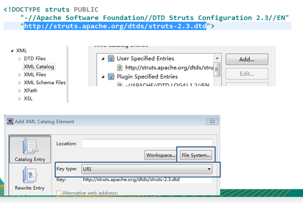
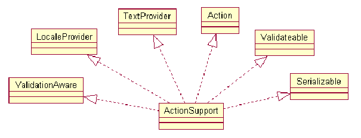

[TOC]

# MVC设计模式概览

实现 MVC(Model、View、Controller) 模式的应用程序由 3 大部分构成：

- 模型：封装应用程序的数据和业务逻辑（POJO 即plain old java object）

- 视图：实现应用程序的信息显示功能 (JSP)
- 控制器：接收来自用户的输入，调用模型层，响应对应的视图组件(servlet，filter)

# 使用Filter作为控制器的MVC

需求：


目录结构：


使用 Filter 作为控制器的好处：

- 使用一个过滤器来作为控制器, 可以方便地在应用程序里对所有资源(包括静态资源)进行控制访问. 

```xml
<url-pattern>*.action</url-pattern>
```

Servlet VS Filter

1. Servlet 能做的 Filter 是否都可以完成 ? 嗯。
2. Filter 能做的 Servlet 都可以完成吗 ? 拦截资源却不是 Servlet 所擅长的! Filter 中有一个 FilterChain，这个 API 在 Servlet 中没有！

# Hello Struts2

## Struts2概述

Struts2 是一个用来开发 MVC 应用程序的框架. 它提供了 Web 应用程序开发过程中的一些常见问题的解决方案: 

- 对来自用户的输入数据进行合法性验证
- 统一的布局
- 可扩展性
- 国际化和本地化
- 支持 Ajax
- 表单的重复提交
- 文件的上传下载
- …..

## Struts2 VS Struts1

在体系结构方面更优秀:

- 类更少, 更高效:  在 Struts2 中无需使用 “ActionForm” 来封装请求参数. 
- 扩展更容易:  Struts2 通过拦截器完成了框架的大部分工作. 在 Struts2 中插入一个拦截器对象相当简便易行. 

更容易测试:

- 即使不使用浏览器也可以对基于 Struts2 的应用进行测试

## 从 Struts1 升级到 Struts2

1. Struts2 从本质上讲已不是从 Struts1 扩展而来的, 说它是一个换了品牌标签的 WebWork 更合适
2. 从 Struts1 升级到 Struts2:
   - Struts1 里使用 ActionServlet 作为控制器; Struts2 使用了一个过滤器作为控制器
   - Struts1 中每个 HTML 表单都对应一个 ActionForm 实例. Struts2 中, HTML 表单将被直接映射到一个 POJO.
   - Struts1 的验证逻辑编写在 ActionForm 中; Struts2 中的验证逻辑编写在 Action 中.
   - Struts1 中, Action 类必须继承 org.apache.struts.action.Action 类; Struts2 中任何一个 POJO 都可以是一个 Action 类. 
   - Struts2 在页面里使用 OGNL 来显示各种对象模型, 可以不再使用 EL 和 JSTL 

## 下载Struts2

1. 打开浏览器输入 http://struts.apache.org/
2. 点击超链接 “Struts 2.3.x”, 打开下载页面
   
   
3. 点击 “struts-2.3.x-all.zip” 下载 

## Struts2 的 Hello World

需求：


目录结构：


搭建 Struts2 的环境:

1. 加入 jar 包: 复制 struts\apps\struts2-blank\WEB-INF\lib 下的所有 jar 包到当前 web 应用的 lib 目录下.
2. 在 web.xml 文件中配置 struts2: 复制 struts\apps\struts2-blank1\WEB-INF\web.xml 文件中的过滤器的配置到当前 web 应用的 web.xml 文件中
3. 在当前 web 应用的 classpath 下添加 struts2 的配置文件 struts.xml: 复制 struts1\apps\struts2-blank\WEB-INF\classes 下的 struts.xml 文件到当前 web 应用的 src 目录下. 

添加DTD约束：

- 在下载的struts架包中包含了dtd文件。
- 路径在：struts-2.3.4-all\struts-2.3.4\src\core\src\main\resources




编辑 struts.xml 文件: struts.xml 文件是对 struts 应用程序里的 Action  进行配置的地方. 
配置 package 元素


配置 action 元素


配置 result 元素


# Action类

1. action: 应用程序可以完成的每一个操作. 例如: 显示一个登陆表单; 把产品信息保存起来
2. Action类: 普通的 Java 类, 可以有属性和方法, 同时必须遵守下面这些规则: 
   - 属性的名字必须遵守与 JavaBeans 属性名相同的命名规则. 属性的类型可以是任意类型. 从字符串到非字符串(基本数据库类型)之间的数据转换可以自动发生
   - 必须有一个不带参的构造器
   - 至少有一个供 struts 在执行这个 action 时调用的方法
   - 同一个 Action 类可以包含多个 action 方法. 
   - Struts2 会为每一个 HTTP 请求创建一个新的 Action 实例

# 访问web资源

在 Action 中, 可以通过以下方式访问 web 的 HttpSession, HttpServletRequest, HttpServletResponse  等资源。

- 与 Servlet API 解耦的访问方式

  通过com.opensymphony.xwork2.ActionContext

  通过Action实现如下接口：

  1. org.apache.struts2.interceptor.ApplicationAware;

  2. org.apache.struts2.interceptor.RequestAware;
  3. org.apache.struts2.interceptor.SessionAware;

- 与Servlet API耦合的访问方式

  1. 通过org.apache.struts2.ServletActionContext
  2. 通过实现对应的XxxAware接口

## 与Servlet API解耦的访问方式 

- 为了避免与 Servlet API 耦合在一起, 方便 Action 做单元测试, Struts2 对 HttpServletRequest, HttpSession 和 ServletContext 进行了封装, 构造了 3 个 Map 对象来替代这 3 个对象, 在 Action 中可以直接使用 HttpServletRequest, HttpServletSession, ServletContext 对应的 Map 对象来保存和读取数据. 

### 通过 ActionContext 访问 Web 资源

- ActionContext 是 Action 执行的上下文对象, 在 ActionContext 中保存了 Action 执行所需要的所有对象, 包括 parameters, request, session, application 等. 
- 获取 HttpSession 对应的 Map 对象:	
  - public Map getSession()
- 获取 ServletContext 对应的 Map 对象:
  - public Map getApplication()
- 获取请求参数对应的 Map 对象:
  - public Map getParameters()
- 获取 HttpServletRequest 对应的 Map 对象:
  public Object get(Object key): ActionContext 类中没有提供类似 getRequest() 这样的方法来获取HttpServletRequest 对应的 Map 对象. 要得到 HttpServletRequest 对应的 Map 对象, 可以通过为 get() 方法传递 “request” 参数实现。

### 通过实现 Aware 接口访问 Web 资源

Action 类通过可以实现某些特定的接口, 让 Struts2 框架在运行时向 Action 实例注入 parameters, request, session 和 application 对应的 Map 对象: 

1. org.apache.struts2.interceptor.ApplicationAware;
2. org.apache.struts2.interceptor.ParameterAware;

2. org.apache.struts2.interceptor.RequestAware;
3. org.apache.struts2.interceptor.SessionAware;

## 与 Servlet 耦合的访问方式

- 直接访问 Servlet API 将使 Action 与 Servlet 环境耦合在一起,  测试时需要有 Servlet 容器, 不便于对 Action 的单元测试. 
- 直接获取 HttpServletRequest 对象: 
  ServletActionContext.getRequest()
- 直接获取 HttpSession 对象
  ServletActionContext.getRequest().getSession()
- 直接获取 ServletContext 对象
  ServletActionContext.getServletContext()
- 通过实现 ServletRequestAware, ServletContextAware 等接口的方式

# ActionSupport

- com.opensymphony.xwork2.ActionSupport 类是默认的 Action 类. 
- 在编写 Action 类时, 通常会对这个类进行扩展



