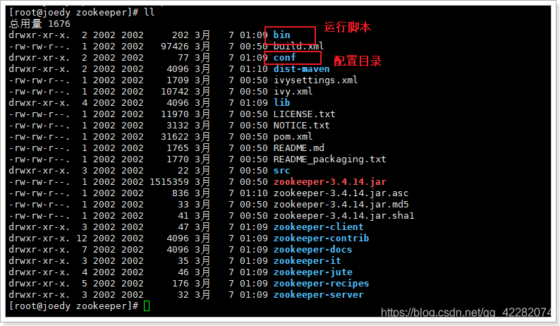
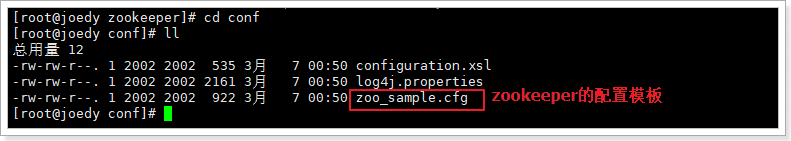
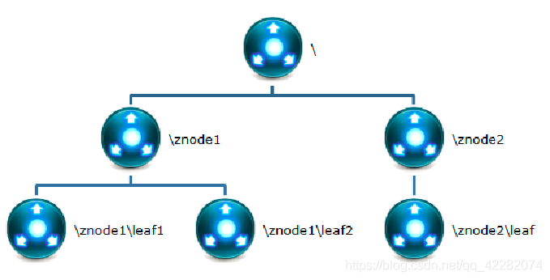
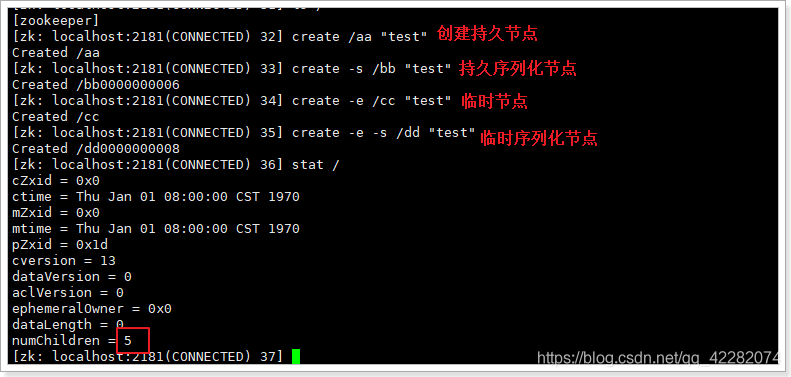
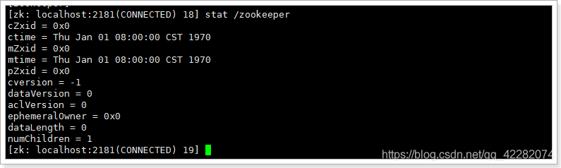
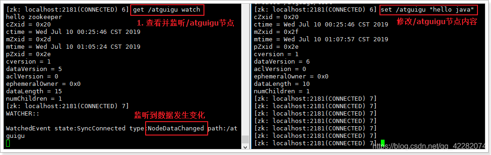

# zookeeper

## 下载

官网首页：https://zookeeper.apache.org/

下载地址：http://archive.apache.org/dist/zookeeper/

## 安装

<font color="red">需要先安装好java环境。</font>

1. 上传到/opt目录下并解压：`tar -zxvf zookeeper-3.4.14.tar.gz`
2. 重命名为zookeeper：`mv zookeeper-3.4.14 zookeeper`

进入zookeeper目录，结构如下：



3. zookeeper启动时会找conf/zoo.cfg配置文件，进入配置目录：`cd conf`



有一个zookeeper的默认配置模板文件，需要复制并重命名为zoo.cfg：`cp zoo_sample.cfg zoo.cfg`

4. 配置文件不需要做任何修改，即可启动。

## 配置文件解读

**tickTime**

通信心跳数，Zookeeper服务器心跳时间，单位毫秒。

 用于集群状态下，服务器之间或客户端与服务器之间维持心跳的时间间隔，也就是每个 tickTime 时间就会发送一个心跳，时间单位为毫秒。

**initLimit**

这个配置项是用来配置Zookeeper接收Follower客户端（这里所说的客户端不是用户链接Zookeeper服务器的客户端，而是Zookeeper服务器集群中连接到leader的Follower服务器，Follower在启动过程中，会从Leader同步所有最新数据，然后确定自己能够对外服务的起始状态。Leader允许Follower在 initLimit 时间内完成这个工作）初始化连接是最长能忍受多少个心跳的时间间隔数。

 当已经超过10个心跳的时间（也就是tickTime）长度后Zookeeper服务器还没有收到客户端返回的信息，那么表明这个客户端连接失败。总的时间长度就是10*2000=20秒

**syncLimit：** LF同步通信时限

 集群中Leader与Follower之间的最大响应时间单位。

 在运行过程中，Leader负责与ZK集群中所有机器进行通信，例如通过一些心跳检测机制，来检测机器的存活状态, 假如响应超过syncLimit * tickTime（假设syncLimit=5 ，请求和应答时间长度，最长不能超过多少个tickTime的时间长度，总的时间长度就是5*2000=10秒。），Leader认为Follwer死掉，从服务器列表中删除Follwer。

 在运行过程中，Leader负责与ZK集群中所有机器进行通信，例如通过一些心跳检测机制，来检测机器的存活状态。如果L发出心跳包在syncLimit之后，还没有从F那收到响应，那么就认为这个F已经不在线了。

**dataDir：**

 数据文件目录+数据持久化路径

保存内存数据库快照信息的位置，如果没有其他说明，更新的事务日志也保存到数据库（可设置dataLogDir参数指定log日志目录）。

**clientPort：**

客户端连接端口（对外服务端口）

## 启动zookeeper

切换到bin目录下：

1. zookeeper命令：

```
启动zookeeper： ./zkServer.sh start
停止zookeeper： ./zkServer.sh stop
查看状态: ./zkServer.sh status
```

2. 如果出现错误：

先stop掉原zk：`./zkServer.sh stop`

然后以`./zkServer.sh start-foreground`方式启动，会看到启动日志。

## 客户端连接

前提：	必须要先启动服务端。

启动客户端命令：

```
zkCli.sh -server {ip}:port
```

本地连接直接：`./zkCli.sh`即可。

这里的参数可以省略，如果省略，默认访问的是本机的zookeeper节点即：`localhost:2181`

使用ls命令来查看当前zookeeper中所包含的内容：`ls /`（显示更节点下的子节点）

查看当前节点数据并能看到更新次数等数据：`ls2 /`

创建节点，并设置初始内容：`create /zk "test"`创建一个新的znode节点“zk”以及与它相关联的字符串。

获取节点内容及状态：`get /zk`

查看节点状态：`stat /zk`

修改节点内容：`set /zk "test22"`

删除无子的节点： `delete /zk` 将刚才创建的 znode 删除

递归删除：`rmr /zk` 如果/zk节点有子子孙孙节点，使用这种方式删除

退出客户端： `quit`

帮助命令： `help`

**一句话：和redis的KV键值对类似，只不过key变成了一个路径节点值，v就是data**

## znode数据模型

Zookeeper维护一个类似文件系统的数据结构。

ZooKeeper数据模型的结构与Unix文件系统很类似，整体上可以看作是一棵树，每个节点称做一个ZNode。每一个znode默认能够存储1MB的数据，每个ZNode都可以通过其路径唯一标识

### 数据结构图

如同 Unix 中的文件路径。路径必须是绝对的，因此他们必须由斜杠字符来开头。除此以外，他们必须是唯一的。



图中的每个节点称为一个 Znode。 每个 Znode 由 3 部分组成：

- **stat：此为状态信息, 描述该 Znode 的版本, 权限等信息**
- **data：与该 Znode 关联的数据**
- **children：该 Znode 下的子节点**

### 节点类型

Znode 有两种，分别为临时节点和永久（持久）节点。

节点的类型在创建时即被确定，并且不能改变。

临时节点：该节点的生命周期依赖于创建它们的会话。一旦会话结束，临时节点将被自动删除，当然可以也可以手动删除。临时节点不允许拥有子节点。

永久节点：又称持久化节点，该节点的生命周期不依赖于会话，并且只有在客户端显式执行删除操作的时候，他们才能被删除。

Znode还有一个序列化的特性，如果创建的时候指定的话，该 Znode 的名字后面会自动追加一个不断增加的序列号。序列号对于此节点的父节点来说是唯一的，这样便会记录每个子节点创建的先后顺序。它的格式为“%10d”(10 位数字，没有数值的数位用 0 补充，例如“0000000001”)。

这样便会存在四种类型的 Znode 节点，分别对应：

PERSISTENT：永久节点。客户端与zookeeper断开连接后，该节点依旧存在

EPHEMERAL：临时节点。客户端与zookeeper断开连接后，该节点被删除

PERSISTENT_SEQUENTIAL：永久节点、序列化。客户端与zookeeper断开连接后，该节点依旧存在，只是Zookeeper给该节点名称进行顺序编号

EPHEMERAL_SEQUENTIAL：临时节点、序列化。客户端与zookeeper断开连接后，该节点被删除，只是Zookeeper给该节点名称进行顺序编号


创建这四种节点：



### 节点属性

 Znode维护了一个stat结构，这个stat包含数据变化的版本号、访问控制列表变化、还有时间戳。版本号和时间戳一起，可让Zookeeper验证缓存和协调更新。每次znode的数据发生了变化，版本号就增加。

 例如，无论何时客户端检索数据，它也一起检索数据的版本号。并且当客户端执行更新或删除时，客户端必须提供他正在改变的znode的版本号。如果它提供的版本号和真实的数据版本号不一致，更新将会失败。


| 参数名         | 说明                                                         |
| -------------- | ------------------------------------------------------------ |
| cZxid          | 创建节点的事务zxid（ZooKeeper Transaction Id）               |
| ctime          | znode创建时间（毫秒数）                                      |
| mZxid          | znode最后更新的事务zxid                                      |
| mtime          | znode最后修改时间(毫秒数)                                    |
| pZxid          | znode最后更新的子节点zxid                                    |
| cversion       | znode子节点版本号。znode的子节点有变化时，cversion 的值就会增加1 |
| dataVersion    | znode数据变化号                                              |
| aclVersion     | znode访问控制列表的变化号（Access Control List，访问控制）   |
| ephemeralOwner | 如果是临时节点，这个是znode拥有者的session id。如果不是临时节点则是0。 |
| dataLength     | znode的数据长度                                              |
| numChildren    | znode子节点数量                                              |

## 通知机制

Watch 说的是 Zookeeper 的**监听机制**。**一个 Watch 事件是一个一次性的触发器**，当被设置了 Watch 的数据发生了**改变**的时候，则服务器将这个改变发送给设置了 Watch 的客户端，以便通知它们。

### watch机制特点

特点：

- 一次性触发

  数据发生改变时，一个 watcher event 会被发送到 client，但是 client 只会收到一次这样的信息。

- Watcher event 异步发送

  watcher 的通知事件从 server 发送到 client 是异步的。

- 数据监视

  Zookeeper 有数据监视和子数据监视

具体玩法：

- 注册 watcher

  get、stat、ls/ls2

- 触发 watcher

  create、delete、set、子节点变更、链接状态变化
  

### shell客户端演示



## java客户端

1. 引入依赖：

```xml
<dependency>
    <groupId>org.apache.zookeeper</groupId>
    <artifactId>zookeeper</artifactId>
    <version>3.4.14</version>
</dependency>
```

2. 常用api及其方法

```java
// 初始化zookeeper客户端类，负责建立与zkServer的会话
new ZooKeeper(connectString, 30000, new Watcher() {
    @Override
    public void process(WatchedEvent event) {
        System.out.println("获取链接成功！！");
    }
});

// 创建一个节点，1-节点路径 2-节点内容 3-访问控制控制 4-节点类型
String fullPath = zooKeeper.create(path, null, ZooDefs.Ids.OPEN_ACL_UNSAFE, CreateMode.PERSISTENT);

// 判断一个节点是否存在
Stat stat = zooKeeper.exists(rootPath, false);
if(stat != null){...}

// 查询一个节点的内容
Stat stat = new Stat();
byte[] data = zooKeeper.getData(path, false, stat);

// 更新一个节点
zooKeeper.setData(rootPath, new byte[]{}, stat.getVersion() + 1);

// 删除一个节点
zooKeeper.delete(path, stat.getVersion());

// 查询一个节点的子节点列表
List<String> children = zooKeeper.getChildren(rootPath, false);

// 关闭链接
if (zooKeeper != null){ zooKeeper.close(); }
```

