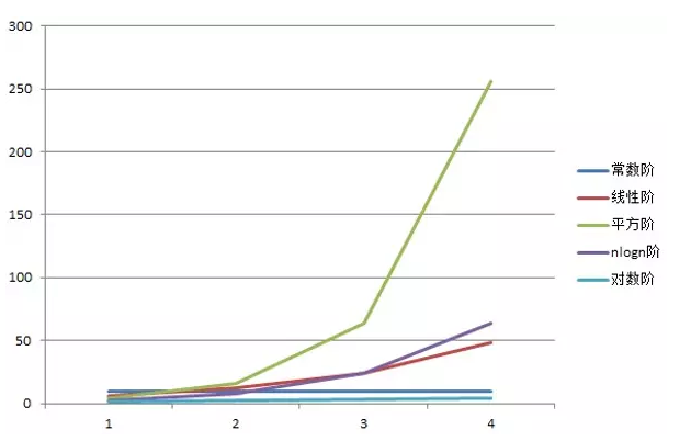
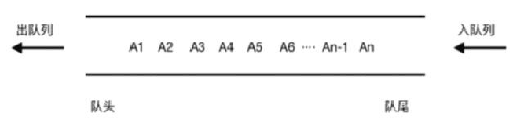
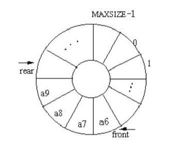

[TOC]

# 算法和数据结构基础知识

什么是数据结构？什么是算法？

- 就是一个能组在一起的集合对象。比如数组 链表 队列等。算法：就是解决问题的。

数据结构相关书籍：

（1）严蔚敏版 数据结构与算法
（2）大话数据结构

算法相关书籍：

（1）基础级：刘汝佳 算法竞赛入门经典（两本，还有一个是习题）
（2）进阶级：刘汝佳黑书 算法导论；非常难，非算法行业慎入

刷题网站：

（1）力扣:https://leetcode-cn.com/
（2）POJ or HDU

算法的五大特性：

- 有穷性、
- 确定性、
- 可行性、
- 有输入、
- 有输出

设计原则：正确性、可读性、健壮性 

bug：写出代码很少有bug，而且系统比较稳定

高效率与低存储: 内存+CPU 堆栈内存OOM

内存占用最小，CPU占用最小，运算速度最快。

评价算法的两个重要指标：

- 时间复杂度:运行一个程序所花费的时间。O()
- 空间复杂度：运行程序所需要的内存  OOM

# 时间复杂度

1. 时间复杂度计算的意义:怎么测试接口的性能的？压测，冒烟。要依赖测试环境吧，流程很长，搞的规模或者数据不准确。排序算法： 1 2 3  / 3 2 1. 你应该自己用代码分析。也就是时间复杂度
   
2. 时间复杂度表示方法：大O表示法。O(n),O(nlogn);O(1),O(n),O(nlogn),O(n^2),O(n+1),O(logn),O(n!)
3. 时间复杂度如何来分析
   （1）找for while 递归。而且要找循环量最大的那一段
   （2）同级循环怎么计算

4. 几种常见的时间复杂度分析：指的是某一段代码。
   计算时间复杂度 往往是计算比较大的 而且是不确定的数，如果已经确定了，那么就不用计算了，也是我们说的常量。

   - 常数：O(1) 1表示是常数，所有能确定的数字我们都用O（1），O(1000)=>o(1)
   - 对数：O(logn),O(nlogn)
   - 线性：O(n)
   - 线性对数：O(nlogn)
   - 平方：O(n^2)
   - N次方：O(n^n)

   我们怎么找时间复杂度：

   1. 找到有循环的地方，
   2. 找有网络请求（RPC，远程调用，分布式，数据库请求）的地方。

   就是测试时间：log打印，计算平均时间。



​	几种常见的时间复杂度总结：

- 学了时间复杂度，那我们的目的就是要把代码写到最优，效率最高；
- O(1)>O(logn)>O(n)>O(nlogn)>O(n^2)>O(n^x)
- O(1)>O(logn)>O(n)>O(nlogn) 效果都是很好的。几乎优化的空间不是很大。
- 登录：判断用户名密码O(1)到数据库里查记录；分布式 缓存。
- 列表的接口：排序，冒泡排序；=>找更优秀的排序算法 快速排序，归并排序，堆排序。
- 优化的目标就是要往O（1）的方向接近。

5. 最坏情况，最好情况，平均情况时间复杂度；

# 空间复杂度

1. 空间复杂度分析的意义：找花了内存的地方。数据
2. 如何找出程序的空间复杂度：开了空间的地方， 比如 数组 链表，缓存对象，递归

# 数组

## 经典面试题

给你一个文件里面包含全国人民（14亿）的年龄数据（0~180），现在要你统计每一个年龄有多少人？
给定机器为 单台+2CPU+2G内存。不得使用现成的容器，比如map等。

生成14亿人的年龄数据：

```java
package com.liquor.demotest;

import java.io.*;
import java.util.Random;

/**
 * Project：demo-test
 * Date：2021/12/8
 * Time：10:05
 * Description：生成14亿人的年龄数据
 *
 * @author Liquor
 * @version 1.0.0
 */
public class Test {
    public static void main(String[] args) throws IOException {
        String fileName = "F:\\age1.txt";
        Random random = new Random();
        // 文件字节输出流
        FileOutputStream fileOutputStream = new FileOutputStream(fileName);
        OutputStreamWriter bufferedOutputStream = new OutputStreamWriter(fileOutputStream);
        // 缓冲输入流
        BufferedWriter bufferedWriter = new BufferedWriter(bufferedOutputStream);

        for (int i = 0; i < 1400000000; i++) {
            // nextInt()该函数会随机生成整数范围内的任意一个整数。整数范围内表示-2的31次方到2的31次方之间。
            int num = random.nextInt();
            // abs()取绝对值
            // % 180 即 算出年龄在0 - 179 岁的
            int age = Math.abs(num) % 180;
            // \r表示回到当前行的行首   \n表示换行符
            bufferedWriter.write(age + "\r\n");
        }
        // 数据是先写入缓冲区中，必须执行flush（）方法，才会放入文件里。
        bufferedWriter.flush();
        // close（）该函数内部其实包含flush（）方法。也可以直接调用close（）方法。
        bufferedWriter.close();
    }
}
```

计算每个年龄多少人：

```java
package com.liquor.demotest;

import java.io.BufferedReader;
import java.io.FileInputStream;
import java.io.InputStreamReader;

/**
 * @author yc
 */
public class AgeStas {

    public static void main(String[] args) throws Exception {
        String str;
        String fileName = "F:\\age1.txt";
        InputStreamReader isr = new InputStreamReader(new FileInputStream(fileName), "UTF8");

        long start = System.currentTimeMillis();
        BufferedReader br = new BufferedReader(isr);
        // int占32位的时候,最大可以赋值为:2147483647，也就是21亿多。
        int tot = 0;
        int[] data = new int[200];
        // 一行一行的读  时间复杂度为O(n)
        while ((str = br.readLine()) != null) {
            int age = Integer.valueOf(str);
            data[age]++;
            tot++;
        }
        //O(n) 14亿. 100万/秒 *1000 = 10亿 100~1000s之间 => 500s以下 60*8=480s
        System.out.println("总共的数据大小: " + tot);

        // 下标从0开始的
        for (int i = 0; i < 200; i++) {
            System.out.println(i + ":" + data[i]);
        }
        //144239ms => 144s
        System.out.println("计算花费的时间为:" + (System.currentTimeMillis() - start) + "ms");
    }
}
```

## 数组定义

​		所谓数组，是有序的元素序列。 若将有限个类型相同的变量的集合命名，那么这个名称为数组名。组成数组的各个变量称为数组的分量，也称为数组的元素，有时也称为下标变量。用于区分数组的各个元素的数字编号称为下标。数组是在程序设计中，为了处理方便， 把具有相同类型的若干元素按无序的形式组织起来的一种形式。这些无序排列的同类数据元素的集合称为数组。

​		数组是用于储存多个相同类型数据的集合。通常用Array表示，也称之为线性表。

## 数组特点

1. 数组是相同数据类型的元素的集合。
2. 数组中的各元素的存储是有先后顺序的，它们在内存中按照这个先后顺序连续存放在一起。内存地址
3. 数组元素用整个数组的名字和它自己在数组中的顺序位置来表示。例如，a[0]表示名字为a的数组中的第一个元素，a[1]代表数组a的第二个元素，以此类推。

4. 数组的表现形式：有一维数组、多维数组

5. 随机访问

   数组是连续的内存空间和相同类型的数据。正是因为这两个限制，它才有了一个非常重要的特性：随机访问。但有利就有弊，这两个限制也让数组的很多操作变得非常低效，比如要想在数组中删除、插入一个数据，为了保证连续性，就需要做大量的数据搬移工作。

6. ArrayList和数组：ArrayList本质就是数组，只是它被JDK封装了一层，使用者不需要考虑扩容等操作。而数组则需要你自己进行扩容操作。

   两者之间如何选用？

   - 不知道数据大小使用ArrayList。

   - 如果你知道数据的大小而且你又非常关注性能那就用数组。

   ```java
   package com.liquor.demotest;
   
   /**
    * Project：demo-test
    * Date：2021/12/8
    * Time：14:55
    * Description：
    *
    * @author Liquor
    * @version 1.0.0
    */
   public class ArrayTest {
       /**
        * 数组的长度
        */
       private int size;
   
       private int[] data;
   
       /**
        * 当前已经存的数据大小
        */
       private int index;
   
       /**
        * 数组初始化过程
        *
        * @param size
        */
       public ArrayTest(int size) {
           this.size = size;
           data = new int[size];
           index = 0;
       }
   
       public void print() {
           System.out.println("index " + index);
           for (int i = 0; i < size; i++) {
               System.out.println(data[i] + "");
           }
           System.out.println();
       }
   
       public void insert(int loc, int n) {
           if (index++ < size) {
               for (int i = size - 1; i > loc; i--) {
                   data[i] = data[i - 1];
               }
               data[loc] = n;
           }
           //扩容 会把size*2 0.75
       }
   
       public void delete(int loc) {
           for (int i = loc; i < size; i++) {
               if (i != size - 1) {
                   // 将后一个的值往前移
                   data[i] = data[i + 1];
               } else {
                   data[i] = 0;
               }
           }
           index--;
       }
   
       public void update(int loc, int n) {
           data[loc] = n;
       }
   
       public int get(int loc) {
           return data[loc];
       }
   }
   ```

## 数组缺点

- 插入和删除的效率慢，需要做大量的数据迁移工作，需要另外开辟新的连续的存储空间。
- 一旦超过数组的最大长度，则访问会报数组下标越界异常。

## 寻址公式

- 对于一维数组的寻址公式为：init_loc(初始内存地址) + index （数组的下表）* size（数据的长度）
- 对于二维数组的寻址公式为：init_loc + (i * n + j) * size
  - a[ i ] [ j ]  (i < n; j < m) n 为一维长度，m为二维长度
  - j 即为 列

## 稀疏数组

- 真正存储的数据远小于我们开的空间。这种情况往往使用链表来代替。

## java字符串

```java
String s1 = "ja";
String s2 = "va";
String s3 = "java";
String s4 = s1 + s2; //java 注意这个+号，java里面重载了+，其实调用了StringBuilder，会new对象。
System.out.println(s3 == s4);	//false
System.out.println(s3.equals(s4));	//true 只是比较值
```

# 链表

## 链表定义

- 链表通过指针将一组零散的内存块串联在一起。其中，我们把内存块称为链表的“结点”。为了将所有的结点串起来，每个链表的结点除了存储数据之外，还需要记录链上的下一个结点的地址。

## 链表特点

- 不需要连续的存储空间。
- 有指针应用。
- 三种常见的链表结构：单链表、双向链表、循环链表
- 其中LinkedList 和ArrayList 底层就使用了链表结构。

```java
package com.my.algorithm.arrays;

public interface MyList<E> {
	public void add(E e);
	
	public void remove(int i);
	
	public void remove(Object e);
	
	public E get(int i);
	
	public int size();
	
	public boolean isEmpty();
	
}
```

```java
package algorithm.list;

public class MyLinkedList {
	
	private ListNode head;
	private int size = 0;		//
	
	public void insertHead(int data){		//插入链表的头部		data就是插入的数据
		ListNode newNode = new ListNode(data);
		//如果原来就有数据呢？
		newNode.next = head;		//栈内存的引用
		head = newNode;
		
		//插入O(1)
	}
	
	public void insertNth(int data,int position){		//插入链表的中间 假设定义在第N个插入 O(n)
		if(position == 0) {		//这个表示插入在头部了
			insertHead(data);
		}else{
			ListNode cur = head;
			for(int i = 1; i < position ; i++){
				cur = cur.next;		//一直往后遍历   p=p->next;  ->是c++里面的往后找指针
			}
			ListNode newNode = new ListNode(data);
			//
			newNode.next = cur.next;		//新加的点指向后面 保证不断链
			cur.next = newNode;			//把当前的点指向新加的点
		}
	}
	/*int a = 1;
	int b = a;
	int a = 2;*/
	
	public void deleteHead(){//O(1)
		head = head.next;
	}
	
	public void deleteNth(int position){//O(n)
		if(position == 0) {
			deleteHead();
		}else{
			ListNode cur = head;
			for(int i = 1; i < position ; i ++){
				cur = cur.next;
			}
			cur.next = cur.next.next; //cur.next 表示的是删除的点，后一个next就是我们要指向的
		}
	}
	
	public void find(int data){//O(n)
		ListNode cur = head;
		while(cur != null){
			if(cur.value == data) break;
			cur = cur.next;
		}
	}
	
	public void print(){
		ListNode cur = head;
		while(cur != null){
			System.out.print(cur.value + " ");
			cur = cur.next;
		}
		System.out.println();
	}
	public static void main(String[] args) {
		MyLinkedList myList = new MyLinkedList();
		myList.insertHead(5);
		myList.insertHead(7);
		myList.insertHead(10);
		myList.print(); // 10 -> 7 -> 5
		myList.deleteNth(0);
		myList.print(); // 7 -> 5
		myList.deleteHead();
		myList.print(); // 5
		myList.insertNth(11, 1);
		myList.print(); // 5 -> 11
		myList.deleteNth(1);
		myList.print(); // 5
	}
}

class ListNode{
	
	int value;		//值
	ListNode next;	//下一个的指针

	ListNode(int value){
		this.value = value;
		this.next = null;
	}
}
```

```java
package com.my.algorithm.arrays;


public class MyArrayList<E> implements MyList<E> {

	private static final int DEFAULT_SIZE = 10;
	private Object data[];
	private int index;
	private int size;

	public MyArrayList() {
		this.data = new Object[DEFAULT_SIZE];
		this.size = DEFAULT_SIZE;
	}

	@Override
	public void add(E e) {
		data[index++] = e;
		if (index == size) { // À©ÈÝ
			this.size = this.size * 2 + 1;
			Object newData[] = new Object[this.size];
			for (int i = 0; i < data.length; i++) {
				newData[i] = data[i];
			}
			this.data = newData;
		}
	}

	@Override
	public void remove(int i) {
		if (i >= 0 && i < index) {
			for (int j = i; j < this.data.length - 1; j++) {
				data[j] = data[j + 1];
			}
			this.index--;
		}
	}

	@Override
	public E get(int i) {
		if (i >= 0 && i < index) {
			return (E) this.data[i];
		}
		return null;
	}

	@Override
	public int size() {
		return index;
	}

	@Override
	public boolean isEmpty() {
		if(index <= 0) return true;
		return false;
	}
	@Override
	public void remove(Object e) {
		if(!isEmpty()) {
			for(int i = 0 ; i < this.data.length ; i ++) {
				if(data[i].equals(e)) {
					remove(i);
					break;
				}
			}
		}
	}

	public static void main(String[] args) {
		MyArrayList<Integer> list = new MyArrayList<>();
		list.add(1);
		list.add(5);
		list.add(4);
		System.out.println(list.size());
		System.out.println(list.isEmpty());
		System.out.println(list.get(0));
		System.out.println(list.get(1));
		Integer integer = new Integer(5);
		list.remove(integer);
		System.out.println(list.get(1));
	}
	
}
```

## 单链表

- 从单链表图可知，有两个结点较特殊，分别是第一个结点和最后一个结点。第一个结点称为头节点，最后一个称为尾结点。其中，头结点用来记录链表的基地址。有了它，我们就可以编历得到整条链表。而尾结点特殊的地方是：指针不是指向下一个结点，而是指向一个空地址null，表示这是链表上最后一个结点。while（p.next != null){}自己记录的。

## 循环链表

- 循环链表是一种特殊的单链表。实际上，循环链表也很简单。它跟单链表唯一的区别就是在尾结点的指针是指向链表的头结点。

## 双向链表

- 单链表只有一个方向，结点只有一个后继指针next指向后面的结点。双向链表，支持两个方向，每个结点有一个后继指针，还有一个前驱指针prev。双向链表需要额外的两个空间来存储后继结点和前驱结点的地址。所以，存储同样多的数据，双向链表要比单链表占用更多的内存空间。虽然两个指针比较浪费存储空间，但是可以支持双向编历，这样也带来了双向链表操作的灵活性。

```java
package algorithm.list;

public class DoubleLinkList {		// 双向链表

	private DNode head;		//头 
	private DNode tail;		// 尾
	
	DoubleLinkList(){
		head = null;
		tail = null;
	}
	
	public void inserHead(int data){
		DNode newNode = new DNode(data);
		if(head == null){
			tail = newNode;
		}else{
			head.pre = newNode;
			newNode.next = head;
		}
		head = newNode;
	}
	public void deleteHead(){
		if(head == null) return ;		//没有数据
		if(head.next == null){		//就一个点
			tail = null;
		}else{
			head.next.pre = null;	
		}
		head = head.next;
	}
	public void deleteKey(int data){
		DNode current = head;
		while (current.value != data) {
			if (current.next == null) {
				System.out.println("没找到节点");
				return ;
			}
			current = current.next;
		}
		if (current == head) {// 指向下个就表示删除第一个
			deleteHead();
		} else {
			current.pre.next = current.next;
			if(current == tail){		//删除的是尾部
				tail = current.pre;
				current.pre = null;
			}else{
				current.next.pre = current.pre;
			}
		}
	}
}

class DNode{
	
	int value;		//值
	DNode next;		//下一个的指针
	DNode pre;		//指向的是前一个指针

	DNode(int value){
		this.value = value;
		this.next = null;
		this.pre = null;
	}
}
```

## 数组vs链表

| 时间复杂度 | 数组   | 链表   |
| ---------- | ------ | ------ |
| 插入删除   | O（n） | O（1） |
| 随机访问   | O（1） | O（n） |

区别：

1. 数组简单易用，在实现上使用的是连续的内存空间，可以借助CPU的缓存机制，预读数组中的数据，所以访问效率更高。
2. 链表在内存中并不是连续存储，所以对CPU缓存不友好，没办法有效预读。
3. 数组的缺点是大小固定的，一经声明就要占用整块连续内存空间。如果声明的数组过大，系统可能没有足够的连续内存空间分配给它，导致“内存不足”（out of memory）。如果声明的数组过小，则可能出现不够用的情况。
4. 动态扩容：数组需要申请一个更大的内存空间，把原数组拷贝进去，非常费时。链表本身没有大小的限制，天然地支持动态扩容。

## 约瑟夫问题

- 约瑟夫问题是个有名的问题：N个人围成一圈，从第一个开始报数，第M个将被杀掉，最后剩下一个，其余人都将被杀掉。例如N=6，M=5，被杀掉的顺序是：5，4，6，2，3，1。使用单向循环链表。
- 1，2，3，4，5，6
- 1，2，3，4， 6
- 1，2，3，6
- 1，2，3
- 1，3
- 1

# 栈

## 栈的特点

- 比如我们在放盘子的时候都是从下往上一个个放，拿的时候是从上往下一个个的拿，不能从中间抽，这就是一种典型的栈型数据结构。后进先出 Last In First Out（LIFO)

- 栈是一个限定仅在表尾进行插入和删除操作的线性表。这一端被称为栈顶，相对地，把另一端称为栈底。向一个栈插入新元素又称为进栈、入栈或压栈，它是把新元素放到栈顶元素的上面，使之称为新的栈顶元素；从一个栈删除元素又称为出栈或退栈，它是把栈顶元素删除掉，使其相邻的元素成为新的栈顶元素。
- 栈其实就是一个特殊的链表或者数组。

## 栈的分类

1. 基于数组的栈——以数组为底层数据结构时，通常以数组头为栈底，数组头到数组尾为栈顶的生长方向。
2. 基于单链表的栈——以链表为底层的数据结构时，以链表头为栈顶，便于结点的插入与删除，压栈产生新的结点将一直出现在链表的头部。

最大的区别就是扩容，链表天然支持动态扩容。可能会出现栈溢出。

```java
package algorithm.stack;

public interface MyStack<Item> {

	MyStack<Item> push(Item item);		//入栈
	
	Item pop();	//出栈
	
	int size();		// 大小
	
	boolean isEmpty();
}
```

```java
package algorithm.stack;

public class ArrayStack<Item> implements MyStack<Item>{
	
	private Item [] a = (Item[]) new Object[1];		//最好就是开始的时候就设置大小
	private int n = 0;		//大小 初始的元素个数
	
	public ArrayStack(int cap) {
		a = (Item[]) new Object[cap];
	}

	public MyStack<Item> push(Item item) {	//入栈就完成了		//时间复杂度 O(1)
		
		judgeSize();
		a[n++] = item;
		
		return null;
	}
	
	private void judgeSize(){
		if(n >= a.length){		//元素个数已经超出了数组的个数
			resize(2 * a.length);		//10*2*2=40个大小了，我出栈了20个了，只剩下20了吧。
		}else if(n > 0 && n <= a.length / 2){
			resize(a.length / 2);
		}
	}
	
	private void resize(int size){		//扩容O（n）
		Item[] temp = (Item[]) new Object[size];
		for(int i = 0 ; i < n; i ++){
			temp[i] = a[i];
		}
		a = temp;
	}

	public Item pop() {		//出栈 O(1)
		if(isEmpty()){
			return null;
		}
		//item[n--]
		//item[--n]
		Item item = a[--n];	//n不是已经--了么 --n和n-- --n是先把n减了在用，n--先用了在减
		a[n] = null;	//为什么要这一步
		return item;
	}

	public int size() {
		return n;
	}

	public boolean isEmpty() {
		return n == 0;
	}

}
```

## 括号匹配问题

```java
package algorithm.stack;

import java.util.Scanner;

public class KuoHaoStack {
	
	public static boolean isOk(String s){		//s表示的就是待匹配的括号串 [}使用字符来表示 时间复杂度 O(n)
		
		MyStack<Character> brackets = new ArrayStack<Character>(20);
		char c[] = s.toCharArray();
		Character top;
		for(char x : c){
			switch (x) {
			case '{':
			case '(':
			case '[':
				brackets.push(x);//O(1)
				break;
			case '}':
				top = brackets.pop();//O(1)
				if(top == null) return false;
				if(top == '{'){
					break;
				}else{
					return false;
				}
			case ')':
				top = brackets.pop();//O(1)
				if(top == null) return false;
				if(top == '('){
					break;
				}else{
					return false;
				}
			case ']':
				top = brackets.pop();//O(1)
				if(top == null) return false;
				if(top ==  '['){
					break;
				}else{
					return false;
				}
			default:
				break;
			}
		}
		return brackets.isEmpty();
	}
	public static void main(String[] args) {
		Scanner scanner = new Scanner(System.in);
		while(scanner.hasNext()){
			String s = scanner.next();
			System.out.println("s的匹配结果:"+isOk(s));
		}
	}
	
}
```

# 队列

CPU：
线程池里面当任务满时，此时又来一个新任务，线程池是如何处理的？具体有哪些策略？这些策略又是如何实现的呢？
有几种处理策略：

1. 排队：阻塞队列。有空闲的时候再拿，不就是那个take和put，如果是在公平的情况下，那肯定就是先进先出。这就是今天讲的队列。这时候我们就有两种方式，一个是无限的排队队列。（链表，千万别用。LinkedBlockingQueue，JDK的），还有一种就是有界（用数组来实现的），只处理我们开的空间大小，多了的继续抛出去。Integer.MAX=?2^32-1=21亿多，但是注意的是这个队列大小，别搞小了。就不够，大了就浪费。在一些小型系统，你知道数据请求量是不大的，可以用。
2. 丢弃：不处理了，直接抛出去。

- 队列定义：队列是一种特殊的线性表，特殊之处在于它只允许在表的前端（front）进行删除操作，而在表的后端（rear）进行插入操作，和栈一样，队列是一种操作受限制的线性表。进行插入操作的端称为队尾，进行删除操作的端称为队头。队列中没有元素时，称为空队列。
  队列的数据元素又称为队列元素。在队列中插入一个队列元素称为入队，从队列中删除一个队列元素称为出队。因为队列只允许在一端插入，在另一端删除，所以只有最早进入队列的元素才能最先从队列中删除，故队列又称为先进先出（FIFO—first in first out）线性表，LIFO。

- 队列这个概念非常好理解。你可以把它想成排队买票，先来的先买，后来的人只能站末尾，不允许插队。先进者先出，这就是典型的“队列”。
- 栈：后进先出。

队列的特点：
（1）线性表：链表或者数组
（2）FIFO

队列的分类：

1. 顺序（单向）队列：（Queue） 只能在一端插入数据，另一端删除数据



2. 循环（双向）队列（Deque）：每一端都可以进行插入数据和删除数据操作



队列的基本操作：

- 我们知道，栈只支持两个基本操作：入栈push()和出栈pop()。
  队列跟栈非常相似，支持的操作也很有限，最基本的操作也是两个：
  入队enqueue()，放一个数据到队列尾部；
  出队dequeue()，从队列头部取一个元素。

- 所以，队列跟栈一样，也是一种操作受限的线性表数据结构。作为一种非常基础的数据结构，队列的应用也非常广泛，特别是一些具有某些额外特性的队列，比如循环队列、阻塞队列、并发队列。它们在很多偏底层系统、框架、中间件的开发中，起着关键性的作用。

队列的实现方式：

- 顺序队列&链式:
- 链表就是可以无限扩容:内存 size大小控制。add 缓存；LRU

```java
package algorithm.queue;

public class ArrayQueue {

	private int data[];		// 数据
	private int head = 0;		//头
	private int tail = 0;		//尾
	private int n = 0;		//数组的大小 最大的空间
	private int size;		//当前已经存了几个数了
	
	public ArrayQueue(int cap){
		data = new int[cap];
		n = cap;
	}
	
	public void push(int m){		//入队列  O(1)
		//判断我们这个队列是不是已经满了
		if(tail == n){	//链表,链表是不能使用CPU缓存的
			//在这里才去移动	最好，最坏。O(1),最坏的情况下才是O(n);项目中如何来进行准确的估算呢？平均时间复杂度，n=1000，前999都是O(1) n*2/n,最坏的情况只有一次
			return ; //n-1
		}
		data[tail] = m;	// 1 2 3 4 5 
		tail ++ ;
	}
	
	public int pop(){		//出队列 1 2 3 4 5 O(1) 很大的空间浪费
		//要判断空，怎么判断空？
		if(isEmpty()) return -1;		//表示空
		int m = data[head];
		head ++ ;
		return m;
	}
	
	public int pop2(){		//出队列 1 2 3 4 5 后没次移动，你们说这个时间复杂度：O(n),我们在入队的时候如果没有空间了我们在集中移动一次
		//要判断空，怎么判断空？
		if(isEmpty()) return -1;		//表示空
		int m = data[head];
		head ++ ;
		//数组移动
		return m;
	}
	
	public boolean isEmpty(){
		if(head == tail) return true;
		return false;
	}

}
```

```java
package algorithm.queue;

public class CircleArrayQueue {

	private int data[];		// 数据
	private int head = 0;		//头
	private int tail = 0;		//尾
	private int n = 0;		//数组的大小 最大的空间
	private int size;		//当前已经存了几个数了
	
	public CircleArrayQueue(int cap){
		data = new int[cap];
		n = cap;
	}
	
	public void push(int m){		//入队列  O(1)		//排序
		if((tail + 1) % n == head){	
			return ; 
		}
		data[tail] = m;	// 1 2 3 4 5 	排序,树形结构
		tail = (tail + 1) % n;		//循环队列 tail=7 8越界了，(7+1)%8==0
	}
	
	public int pop(){		//出队列 1 2 3 4 5 O(1) 很大的空间浪费
		//要判断空，怎么判断空？
		if(isEmpty()) return -1;		//表示空
		int m = data[head];
		head = (head + 1) % n;
		return m;
	}
	
	
	
	public boolean isEmpty(){
		if(head == tail) return true;
		return false;
	}

}
```

