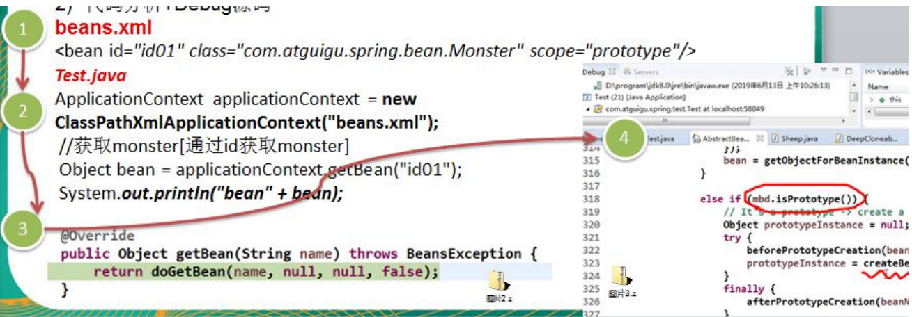
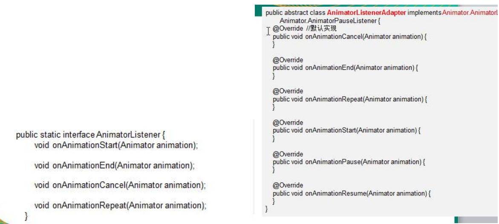
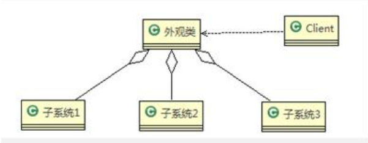

# 设计模式常用七大原则

- 单一职责原则
- 接口隔离原则
- 依赖倒转原则
- 里氏替换原则
- 开闭原则ocp
- 迪米特法则
- 合成服用原则

## 单一职责原则

定义：对类来说的，即一个类应该只负责一项职责。如类A负责两个不同职责：职责1，职责2。当职责1需求变更而改变A时，可能造成职责2执行错误，所以需要将类A的粒度分解为A1，A2.

以交通案例讲解：

方案一

```java
package com.atguigu.principle.singleresponsibility;

public class SingleResponsibility1 {

	public static void main(String[] args) {
		// TODO Auto-generated method stub
		Vehicle vehicle = new Vehicle();
		vehicle.run("摩托车");
		vehicle.run("汽车");
		vehicle.run("飞机");
	}

}

// 交通工具类
// 方式1
// 1. 在方式1 的run方法中，违反了单一职责原则
// 2. 解决的方案非常的简单，根据交通工具运行方法不同，分解成不同类即可
class Vehicle {
	public void run(String vehicle) {
		System.out.println(vehicle + " 在公路上运行....");
	}
}

```

方案二

```java
package com.atguigu.principle.singleresponsibility;

public class SingleResponsibility2 {

	public static void main(String[] args) {
		// TODO Auto-generated method stub
		RoadVehicle roadVehicle = new RoadVehicle();
		roadVehicle.run("摩托车");
		roadVehicle.run("汽车");
		
		AirVehicle airVehicle = new AirVehicle();
		
		airVehicle.run("飞机");
	}

}

//方案2的分析
//1. 遵守单一职责原则
//2. 但是这样做的改动很大，即将类分解，同时修改客户端
//3. 改进：直接修改Vehicle 类，改动的代码会比较少=>方案3

class RoadVehicle {
	public void run(String vehicle) {
		System.out.println(vehicle + "公路运行");
	}
}

class AirVehicle {
	public void run(String vehicle) {
		System.out.println(vehicle + "天空运行");
	}
}

class WaterVehicle {
	public void run(String vehicle) {
		System.out.println(vehicle + "水中运行");
	}
}
```

方案三

```java
package com.atguigu.principle.singleresponsibility;

public class SingleResponsibility3 {

	public static void main(String[] args) {
		// TODO Auto-generated method stub
		Vehicle2 vehicle2  = new Vehicle2();
		vehicle2.run("汽车");
		vehicle2.runWater("轮船");
		vehicle2.runAir("飞机");
	}

}


//方式3的分析
//1. 这种修改方法没有对原来的类做大的修改，只是增加方法
//2. 这里虽然没有在类这个级别上遵守单一职责原则，但是在方法级别上，仍然是遵守单一职责
class Vehicle2 {
	public void run(String vehicle) {
		//处理
		
		System.out.println(vehicle + " 在公路上运行....");
		
	}
	
	public void runAir(String vehicle) {
		System.out.println(vehicle + " 在天空上运行....");
	}
	
	public void runWater(String vehicle) {
		System.out.println(vehicle + " 在水中行....");
	}
	
	//方法2.
	//..
	//..
	
	//...
}

```

单一职责原则注意事项和细节

- 降低类的复杂度，一个类只负责一项职责。
- 提高类的可读性，可维护性。
- 降低变更引起的风险。
- 通常情况下，我们应当遵守单一职责原则，只有逻辑足够简单，才可以在代码级违反单一职责原则；只有类中方法数量足够少，可以在方法级别保持单一职责原则。

## 接口隔离原则

定义：客户端不应该依赖它不需要的接口，即一个类对另一个类的依赖应该建立在最小的接口上。

先看一张图：


没有使用接口隔离的代码：

```java
package com.atguigu.principle.segregation;

public class Segregation1 {

	public static void main(String[] args) {
		// TODO Auto-generated method stub

	}

}

//接口
interface Interface1 {
	void operation1();
	void operation2();
	void operation3();
	void operation4();
	void operation5();
}

class B implements Interface1 {
	public void operation1() {
		System.out.println("B 实现了 operation1");
	}
	
	public void operation2() {
		System.out.println("B 实现了 operation2");
	}
	public void operation3() {
		System.out.println("B 实现了 operation3");
	}
	public void operation4() {
		System.out.println("B 实现了 operation4");
	}
	public void operation5() {
		System.out.println("B 实现了 operation5");
	}
}

class D implements Interface1 {
	public void operation1() {
		System.out.println("D 实现了 operation1");
	}
	
	public void operation2() {
		System.out.println("D 实现了 operation2");
	}
	public void operation3() {
		System.out.println("D 实现了 operation3");
	}
	public void operation4() {
		System.out.println("D 实现了 operation4");
	}
	public void operation5() {
		System.out.println("D 实现了 operation5");
	}
}

class A { //A 类通过接口Interface1 依赖(使用) B类，但是只会用到1,2,3方法
	public void depend1(Interface1 i) {
		i.operation1();
	}
	public void depend2(Interface1 i) {
		i.operation2();
	}
	public void depend3(Interface1 i) {
		i.operation3();
	}
}
  
class C { //C 类通过接口Interface1 依赖(使用) D类，但是只会用到1,4,5方法
	public void depend1(Interface1 i) {
		i.operation1();
	}
	public void depend4(Interface1 i) {
		i.operation4();
	}
	public void depend5(Interface1 i) {
		i.operation5();
	}
}
```

应传统方法的问题和使用接口隔离原则改进：

- 类A通过接口Interface1依赖类B，类C通过接口Interface1依赖类D，如果接口Interface1对于类A和类C来说不是最小接口，那么类B和类D必须去实现他们不需要的方法。
- 将接口Interface1拆分为独立的几个接口，类A和类C分别与他们需要的接口建立依赖关系。也就是采用接口隔离原则。
- 接口Interface1中出现的方法，根据实际情况拆分为三个接口。


采用了接口隔离原则的代码：

```java
package com.atguigu.principle.segregation.improve;

public class Segregation1 {

	public static void main(String[] args) {
		// TODO Auto-generated method stub
		// 使用一把
		A a = new A();
		a.depend1(new B()); // A类通过接口去依赖B类
		a.depend2(new B());
		a.depend3(new B());

		C c = new C();

		c.depend1(new D()); // C类通过接口去依赖(使用)D类
		c.depend4(new D());
		c.depend5(new D());

	}

}

// 接口1
interface Interface1 {
	void operation1();

}

// 接口2
interface Interface2 {
	void operation2();

	void operation3();
}

// 接口3
interface Interface3 {
	void operation4();

	void operation5();
}

class B implements Interface1, Interface2 {
	public void operation1() {
		System.out.println("B 实现了 operation1");
	}

	public void operation2() {
		System.out.println("B 实现了 operation2");
	}

	public void operation3() {
		System.out.println("B 实现了 operation3");
	}

}

class D implements Interface1, Interface3 {
	public void operation1() {
		System.out.println("D 实现了 operation1");
	}

	public void operation4() {
		System.out.println("D 实现了 operation4");
	}

	public void operation5() {
		System.out.println("D 实现了 operation5");
	}
}

class A { // A 类通过接口Interface1,Interface2 依赖(使用) B类，但是只会用到1,2,3方法
	public void depend1(Interface1 i) {
		i.operation1();
	}

	public void depend2(Interface2 i) {
		i.operation2();
	}

	public void depend3(Interface2 i) {
		i.operation3();
	}
}

class C { // C 类通过接口Interface1,Interface3 依赖(使用) D类，但是只会用到1,4,5方法
	public void depend1(Interface1 i) {
		i.operation1();
	}

	public void depend4(Interface3 i) {
		i.operation4();
	}

	public void depend5(Interface3 i) {
		i.operation5();
	}
}
```

## 依赖倒转原则

依赖倒转原则（Dependence Inversion Principle）是指：

1. 高层模块不应该依赖底层模块，二者都应该依赖其抽象
2. 抽象不应该依赖细节，细节应该依赖抽象
3. 依赖倒转（倒置）的中心思想是面向接口编程
4. 依赖倒转原则是基于这样的设计理念：相对于细节的多变性，抽象的东西要稳定的多。以抽象为基础搭建的架构比以细节为基础的架构要稳定的多。在java中，抽象指的是接口或者抽象类，细节就是具体的实现类。
5. 使用接口或者抽象类的目的就是制定好规范，而不涉及任何具体的操作，把展现细节的任务交给他们的实现类去完成。

优化前的代码：

```java
package com.atguigu.principle.inversion;

public class DependecyInversion {

	public static void main(String[] args) {
		Person person = new Person();
		person.receive(new Email());
	}

}


class Email {
	public String getInfo() {
		return "电子邮件信息: hello,world";
	}
}

//完成Person接收消息的功能
//方式1分析
//1. 简单，比较容易想到
//2. 如果我们获取的对象是 微信，短信等等，则新增类，同时Perons也要增加相应的接收方法
//3. 解决思路：引入一个抽象的接口IReceiver, 表示接收者, 这样Person类与接口IReceiver发生依赖
//   因为Email, WeiXin 等等属于接收的范围，他们各自实现IReceiver 接口就ok, 这样我们就符号依赖倒转原则
class Person {
	public void receive(Email email ) {
		System.out.println(email.getInfo());
	}
}

```

优化后的代码：

```java
package com.atguigu.principle.inversion.improve;

public class DependecyInversion {

	public static void main(String[] args) {
		//客户端无需改变
		Person person = new Person();
		person.receive(new Email());
		
		person.receive(new WeiXin());
	}

}

//定义接口
interface IReceiver {
	public String getInfo();
}

class Email implements IReceiver {
	public String getInfo() {
		return "电子邮件信息: hello,world";
	}
}

//增加微信
class WeiXin implements IReceiver {
	public String getInfo() {
		return "微信信息: hello,ok";
	}
}

//方式2
class Person {
	//这里我们是对接口的依赖
	public void receive(IReceiver receiver ) {
		System.out.println(receiver.getInfo());
	}
}

```

依赖关系传递的三种方式和应用案例：

```java
package com.atguigu.principle.inversion.improve;

public class DependencyPass {

	public static void main(String[] args) {
		// TODO Auto-generated method stub
		ChangHong changHong = new ChangHong();
//		OpenAndClose openAndClose = new OpenAndClose();
//		openAndClose.open(changHong);
		
		//通过构造器进行依赖传递
//		OpenAndClose openAndClose = new OpenAndClose(changHong);
//		openAndClose.open();
		//通过setter方法进行依赖传递
		OpenAndClose openAndClose = new OpenAndClose();
		openAndClose.setTv(changHong);
		openAndClose.open();

	}

}

// 方式1： 通过接口传递实现依赖
// 开关的接口
// interface IOpenAndClose {
// public void open(ITV tv); //抽象方法,接收接口
// }
//
// interface ITV { //ITV接口
// public void play();
// }
// 
// class ChangHong implements ITV {
//
//	@Override
//	public void play() {
//		// TODO Auto-generated method stub
//		System.out.println("长虹电视机，打开");
//	}
//	 
// }
//// 实现接口
// class OpenAndClose implements IOpenAndClose{
// public void open(ITV tv){
// tv.play();
// }
// }

// 方式2: 通过构造方法依赖传递
// interface IOpenAndClose {
// public void open(); //抽象方法
// }
// interface ITV { //ITV接口
// public void play();
// }
// class OpenAndClose implements IOpenAndClose{
// public ITV tv; //成员
// public OpenAndClose(ITV tv){ //构造器
// this.tv = tv;
// }
// public void open(){
// this.tv.play();
// }
// }


// 方式3 , 通过setter方法传递
interface IOpenAndClose {
	public void open(); // 抽象方法

	public void setTv(ITV tv);
}

interface ITV { // ITV接口
	public void play();
}

class OpenAndClose implements IOpenAndClose {
	private ITV tv;

	public void setTv(ITV tv) {
		this.tv = tv;
	}

	public void open() {
		this.tv.play();
	}
}

class ChangHong implements ITV {

	@Override
	public void play() {
		// TODO Auto-generated method stub
		System.out.println("长虹电视机，打开");
	}
	 
}
```

依赖倒转原则的注意事项和细节：

1. 低层模块尽量都要有抽象类或接口，或者两者都有，程序稳定性更好。
2. 变量的声明类型尽量是抽象类或者接口，这样我们的变量引用和实际对象间，就存在一个缓冲层，利于程序扩展和优化。
3. 继承时遵循里氏替换原则。

## 里氏替换原则

OO中的继承性的思考和说明：

1. 继承包含这样一层含义：父类中凡是已经实现好的方法，实际上是在设定规范和契约，虽然它不强制要求所有的子类必须遵循这些契约，但是如果子类对这些已经实现的方法任意修改，就会对整个继承体系造成破坏。
2. 继承在给程序设计带来便利的同时，也带来了弊端。比如使用继承会给程序带来侵入性，程序的可移植性降低，增加对象间的耦合性，如果一个类被其他的类所继承，则当这个类需要修改时，必须考虑到所有的子类，并且父类修改后，所有涉及到子类的功能都有可能产生故障。
3. 问题提出：在编程中，如何正确的使用继承？=》里氏替换原则

基本介绍：

1. 里氏替换原则（Liskov Substitution Principle）在1988年，由麻省理工学院的一位姓里的女士提出的。
2. 如果对每个类型为T1的对象o1，都有类型为T2的对象o2，使得以T1定义的所有程序P在所有的对象o1都代换成o2时，程序P的行为没有发生变化，那么类型T2是类型T1的子类型。换句话说，所有引用基类的地方必须能透明地使用其子类的对象。
3. 在使用继承时，遵循里氏替换原则，在子类中尽量不要重写父类的方法。
4. 里氏替换原则告诉我们，继承实际上让两个类耦合性增强了，在适当的情况下，可以通过聚合、组合、依赖、来解决问题。

```java
package com.atguigu.principle.liskov;

public class Liskov {

	public static void main(String[] args) {
		// TODO Auto-generated method stub
		A a = new A();
		System.out.println("11-3=" + a.func1(11, 3));
		System.out.println("1-8=" + a.func1(1, 8));

		System.out.println("-----------------------");
		B b = new B();
		System.out.println("11-3=" + b.func1(11, 3));//这里本意是求出11-3
		System.out.println("1-8=" + b.func1(1, 8));// 1-8
		System.out.println("11+3+9=" + b.func2(11, 3));
		
		

	}

}

// A类
class A {
	// 返回两个数的差
	public int func1(int num1, int num2) {
		return num1 - num2;
	}
}

// B类继承了A
// 增加了一个新功能：完成两个数相加,然后和9求和
class B extends A {
	//这里，重写了A类的方法, 可能是无意识
	public int func1(int a, int b) {
		return a + b;
	}

	public int func2(int a, int b) {
		return func1(a, b) + 9;
	}
}

```

解决方法：

1. 我们发现原来运行正常的相减功能发生了错误。原因就是类B无意中重写了父类的方法，造成原有功能出现错误。在实际编程中，我们常常会通过重写父类的方法完成新的功能，这样写起来虽然简单，但整个继承体系的复用性会比较差。特别是运行多态比较频繁的时候。

2. 通用的做法是：原来的父类和子类都继承一个更通俗的基类，原有的继承关系去掉，采用依赖、聚合、组合等关系代替。

3. 改进方案

   

改进后的代码：

```java
package com.atguigu.principle.liskov.improve;

public class Liskov {

	public static void main(String[] args) {
		// TODO Auto-generated method stub
		A a = new A();
		System.out.println("11-3=" + a.func1(11, 3));
		System.out.println("1-8=" + a.func1(1, 8));

		System.out.println("-----------------------");
		B b = new B();
		//因为B类不再继承A类，因此调用者，不会再func1是求减法
		//调用完成的功能就会很明确
		System.out.println("11+3=" + b.func1(11, 3));//这里本意是求出11+3
		System.out.println("1+8=" + b.func1(1, 8));// 1+8
		System.out.println("11+3+9=" + b.func2(11, 3));
		
		
		//使用组合仍然可以使用到A类相关方法
		System.out.println("11-3=" + b.func3(11, 3));// 这里本意是求出11-3
		

	}

}

//创建一个更加基础的基类
class Base {
	//把更加基础的方法和成员写到Base类
}

// A类
class A extends Base {
	// 返回两个数的差
	public int func1(int num1, int num2) {
		return num1 - num2;
	}
}

// B类继承了A
// 增加了一个新功能：完成两个数相加,然后和9求和
class B extends Base {
	//如果B需要使用A类的方法,使用组合关系
	private A a = new A();
	
	//这里，重写了A类的方法, 可能是无意识
	public int func1(int a, int b) {
		return a + b;
	}

	public int func2(int a, int b) {
		return func1(a, b) + 9;
	}
	
	//我们仍然想使用A的方法
	public int func3(int a, int b) {
		return this.a.func1(a, b);
	}
}

```

## 开闭原则

基本介绍：

1. 开闭原则（Open Closed Principle）是编程中最基础、最重要的设计原则
2. 一个软件实体如类，模块和函数应该对扩展开放（对提供方），对修改关闭（对使用方）。用抽象构建框架，用实现扩展细节。
3. 当软件需要变化时，尽量通过扩展软件实体的行为来实现变化，而不是通过修改已有的代码来实现变化。
4. 编程中遵循其他原则，以及使用设计模式的目的就是遵循开闭原则。


```java
package com.atguigu.principle.ocp;

public class Ocp {

	public static void main(String[] args) {
		//使用看看存在的问题
		GraphicEditor graphicEditor = new GraphicEditor();
		graphicEditor.drawShape(new Rectangle());
		graphicEditor.drawShape(new Circle());
		graphicEditor.drawShape(new Triangle());
	}

}

//这是一个用于绘图的类 [使用方]
class GraphicEditor {
	//接收Shape对象，然后根据type，来绘制不同的图形
	public void drawShape(Shape s) {
		if (s.m_type == 1)
			drawRectangle(s);
		else if (s.m_type == 2)
			drawCircle(s);
		else if (s.m_type == 3)
			drawTriangle(s);
	}

	//绘制矩形
	public void drawRectangle(Shape r) {
		System.out.println(" 绘制矩形 ");
	}

	//绘制圆形
	public void drawCircle(Shape r) {
		System.out.println(" 绘制圆形 ");
	}
	
	//绘制三角形
	public void drawTriangle(Shape r) {
		System.out.println(" 绘制三角形 ");
	}
}

//Shape类，基类
class Shape {
	int m_type;
}

class Rectangle extends Shape {
	Rectangle() {
		super.m_type = 1;
	}
}

class Circle extends Shape {
	Circle() {
		super.m_type = 2;
	}
}

//新增画三角形
class Triangle extends Shape {
	Triangle() {
		super.m_type = 3;
	}
}

```

上面案例的优缺点：

1. 优点是比较好理解，简单易操作。
2. 缺点是违反了设计模式的ocp原则，即对扩展开放（提供方），对修改关闭（使用方）。即当我们给类增加新功能的时候，尽量不修改代码，或者尽可能少修改代码。
3. 比如我们这时要新增一个图形种类三角形，我们需要修改的地方较多。

改进的思路分析：

1. 把创建Shape类做成抽象类，并提供一个抽象的draw方法，让子类去实现即可，这样我们有新的图形种类时，只需要让新的图形类继承Shape，并实现draw方法即可，使用方的代码就不需要修改=》满足了开闭原则。

改进后的代码：

```java
package com.atguigu.principle.ocp.improve;

public class Ocp {

	public static void main(String[] args) {
		//使用看看存在的问题
		GraphicEditor graphicEditor = new GraphicEditor();
		graphicEditor.drawShape(new Rectangle());
		graphicEditor.drawShape(new Circle());
		graphicEditor.drawShape(new Triangle());
		graphicEditor.drawShape(new OtherGraphic());
	}

}

//这是一个用于绘图的类 [使用方]
class GraphicEditor {
	//接收Shape对象，调用draw方法
	public void drawShape(Shape s) {
		s.draw();
	}

	
}

//Shape类，基类
abstract class Shape {
	int m_type;
	
	public abstract void draw();//抽象方法
}

class Rectangle extends Shape {
	Rectangle() {
		super.m_type = 1;
	}

	@Override
	public void draw() {
		// TODO Auto-generated method stub
		System.out.println(" 绘制矩形 ");
	}
}

class Circle extends Shape {
	Circle() {
		super.m_type = 2;
	}
	@Override
	public void draw() {
		// TODO Auto-generated method stub
		System.out.println(" 绘制圆形 ");
	}
}

//新增画三角形
class Triangle extends Shape {
	Triangle() {
		super.m_type = 3;
	}
	@Override
	public void draw() {
		// TODO Auto-generated method stub
		System.out.println(" 绘制三角形 ");
	}
}

//新增一个图形
class OtherGraphic extends Shape {
	OtherGraphic() {
		super.m_type = 4;
	}

	@Override
	public void draw() {
		// TODO Auto-generated method stub
		System.out.println(" 绘制其它图形 ");
	}
}

```

## 迪米特法则

基本介绍：

1. 一个对象应该对其他对象保持最少的了解。
2. 类与类关系越密切，耦合度越大
3. 迪米特法则（Demeter Principle）又叫最少知道原则，即一个类对自己依赖的类知道的越少越好。也就是说，对于被依赖的类不管多么复杂，都尽量将逻辑封装在类的内部。对外除了提供的public方法，不对外泄露任何信息
4. 迪米特法则还有个更简单的定义：只与直接的朋友通信
5. 直接的朋友：每个对象都会与其他对象有耦合关系，只要两个对象之间有耦合关系，我们就说这两个对象之间是朋友关系。耦合的方式很多，依赖，关联，组合，聚合等。其中，我们称出现成员变量，方法参数，方法返回值中的类为直接的朋友，而出现在局部变量中的类不是直接的朋友。也就是说，陌生的类最好不要以局部变量的形式出现在类的内部。

应用实例：有一个学校，下属有各个学院和总部，现要求打印出学校总部员工ID和学院员工的ID

代码演示：

```java
package com.atguigu.principle.demeter;

import java.util.ArrayList;
import java.util.List;

//客户端
public class Demeter1 {

	public static void main(String[] args) {
		//创建了一个 SchoolManager 对象
		SchoolManager schoolManager = new SchoolManager();
		//输出学院的员工id 和  学校总部的员工信息
		schoolManager.printAllEmployee(new CollegeManager());

	}

}


//学校总部员工类
class Employee {
	private String id;

	public void setId(String id) {
		this.id = id;
	}

	public String getId() {
		return id;
	}
}


//学院的员工类
class CollegeEmployee {
	private String id;

	public void setId(String id) {
		this.id = id;
	}

	public String getId() {
		return id;
	}
}


//管理学院员工的管理类
class CollegeManager {
	//返回学院的所有员工
	public List<CollegeEmployee> getAllEmployee() {
		List<CollegeEmployee> list = new ArrayList<CollegeEmployee>();
		for (int i = 0; i < 10; i++) { //这里我们增加了10个员工到 list
			CollegeEmployee emp = new CollegeEmployee();
			emp.setId("学院员工id= " + i);
			list.add(emp);
		}
		return list;
	}
}

//学校管理类

//分析 SchoolManager 类的直接朋友类有哪些 Employee、CollegeManager
//CollegeEmployee 不是 直接朋友 而是一个陌生类，这样违背了 迪米特法则 
class SchoolManager {
	//返回学校总部的员工
	public List<Employee> getAllEmployee() {
		List<Employee> list = new ArrayList<Employee>();
		
		for (int i = 0; i < 5; i++) { //这里我们增加了5个员工到 list
			Employee emp = new Employee();
			emp.setId("学校总部员工id= " + i);
			list.add(emp);
		}
		return list;
	}

	//该方法完成输出学校总部和学院员工信息(id)
	void printAllEmployee(CollegeManager sub) {
		
		//分析问题
		//1. 这里的 CollegeEmployee 不是  SchoolManager的直接朋友
		//2. CollegeEmployee 是以局部变量方式出现在 SchoolManager
		//3. 违反了 迪米特法则 
		
		//获取到学院员工
		List<CollegeEmployee> list1 = sub.getAllEmployee();
		System.out.println("------------学院员工------------");
		for (CollegeEmployee e : list1) {
			System.out.println(e.getId());
		}
		//获取到学校总部员工
		List<Employee> list2 = this.getAllEmployee();
		System.out.println("------------学校总部员工------------");
		for (Employee e : list2) {
			System.out.println(e.getId());
		}
	}
}

```

代码改进：

```java
package com.atguigu.principle.demeter.improve;

import java.util.ArrayList;
import java.util.List;

//客户端
public class Demeter1 {

	public static void main(String[] args) {
		System.out.println("~~~使用迪米特法则的改进~~~");
		//创建了一个 SchoolManager 对象
		SchoolManager schoolManager = new SchoolManager();
		//输出学院的员工id 和  学校总部的员工信息
		schoolManager.printAllEmployee(new CollegeManager());

	}

}


//学校总部员工类
class Employee {
	private String id;

	public void setId(String id) {
		this.id = id;
	}

	public String getId() {
		return id;
	}
}


//学院的员工类
class CollegeEmployee {
	private String id;

	public void setId(String id) {
		this.id = id;
	}

	public String getId() {
		return id;
	}
}


//管理学院员工的管理类
class CollegeManager {
	//返回学院的所有员工
	public List<CollegeEmployee> getAllEmployee() {
		List<CollegeEmployee> list = new ArrayList<CollegeEmployee>();
		for (int i = 0; i < 10; i++) { //这里我们增加了10个员工到 list
			CollegeEmployee emp = new CollegeEmployee();
			emp.setId("学院员工id= " + i);
			list.add(emp);
		}
		return list;
	}
	
	//输出学院员工的信息
	public void printEmployee() {
		//获取到学院员工
		List<CollegeEmployee> list1 = getAllEmployee();
		System.out.println("------------学院员工------------");
		for (CollegeEmployee e : list1) {
			System.out.println(e.getId());
		}
	}
}

//学校管理类

//分析 SchoolManager 类的直接朋友类有哪些 Employee、CollegeManager
//CollegeEmployee 不是 直接朋友 而是一个陌生类，这样违背了 迪米特法则 
class SchoolManager {
	//返回学校总部的员工
	public List<Employee> getAllEmployee() {
		List<Employee> list = new ArrayList<Employee>();
		
		for (int i = 0; i < 5; i++) { //这里我们增加了5个员工到 list
			Employee emp = new Employee();
			emp.setId("学校总部员工id= " + i);
			list.add(emp);
		}
		return list;
	}

	//该方法完成输出学校总部和学院员工信息(id)
	void printAllEmployee(CollegeManager sub) {
		
		//分析问题
		//1. 将输出学院的员工方法，封装到CollegeManager
		sub.printEmployee();
	
		//获取到学校总部员工
		List<Employee> list2 = this.getAllEmployee();
		System.out.println("------------学校总部员工------------");
		for (Employee e : list2) {
			System.out.println(e.getId());
		}
	}
}

```

迪米特法则注意事项和细节：

1. 迪米特法则的核心是降低类之间的耦合
2. 但是注意：由于每个类都减少了不必要的依赖，因此迪米特法则只是要求降低类间（对象间）耦合关系，并不是要求完全没有依赖关系。

## 合成复用原则

英文名：Composite Reuse Principle

基本介绍：原则是尽量使用合成/聚成的方式，而不是使用继承


## 设计原则的核心思想

1. 找出应用中可能需要变化之处，把它们独立出来，不要和那些不需要变化的代码混在一起。
2. 针对接口编程，而不是针对实现编程
3. 为了交互对象之间的松耦合设计而努力

# UML类图

UML基本介绍：

1. UML-Unified modeling language UML（统一建模语言），是一种用于软件系统分析和设计的语言工具，它用于帮助软件开发人员进行思考和记录思考的结果

2. UML本身是一套符号的规定，就像是数学符号和化学符号一样，这些符号用于描述软件模型中的各个元素和他们之间的关系，比如类、接口、实现、泛化、依赖、组合、聚合等，如图：

   


3. 使用UML来建模，常用的工具有Rational Rose,也可以使用一些插件来建模
   - Eclipse按照UML插件，需要搜索下载 AmaterasUML的压缩包。

## UML图

UML图分类：

- 用例图（use case）
- 静态结构图：类图、对象图、包图、组件图、部署图
- 动态行为图：交互图（时序图与协作图）、状态图、活动图

说明：

1. 类图是描述类与类之间的关系的，是UML图中最核心的。

## UML类图

用于描述系统中的类（对象）本身的组成和类（对象）之间的各种静态关系。

类之间的关系：依赖、泛化（继承）、实现、关联、组合与聚合。

类图简单举例：

```java
public class Person{
	private Integer id;
	private String name;
	
	public void setName(String name){
		this.name = name;
	}
	
	public String getName(){
		return name;
	}
}
```


## 类图-依赖关系

英文为：Dependence

只要是在类中用到了对方，那么他们之间就存在依赖关系。如果没有对方，连编译都通过不了。

```
package com.atguigu.uml.dependence;

public class PersonServiceBean {
	private PersonDao personDao;// 类

	public void save(Person person) {
	}

	public IDCard getIDCard(Integer personid) {
		return null;
	}

	public void modify() {
		Department department = new Department();
	}

}

public class PersonDao{}

public class IDCard{}

public class Person{}

public class Department{}
```

对应的类图：


小结：

1. 类中用到了对方
2. 如果是类的成员属性
3. 如果是方法的返回类型
4. 是方法接收的参数类型
5. 方法中使用到

## 类图-泛化关系

英文名：generalization

泛化关系实际上就是继承关系，它是依赖关系的特例

```
public abstract class DaoSupport{
	public void save(Object entity){}
	
	public void delete(Object id){}
}

public class PersonServiceBean extends DaoSupport{}
```

对应的类图：


小结：

1. 泛化关系实际上就是继承关系
2. 如果A类继承了B类，我们就说A和B存在泛化关系。

## 类图-实现关系

英文名：Implementation

实现关系实际上就是A类实现了B接口，它是依赖关系的特例。

```
public interface PersonService{
	public void delete(Integer id);
}

public class PersonServiceBean implements PersonService{
	public void delete(){}
}
```

对应的类图：


## 类图-关联关系

英文名：Association

关联关系实际上就是类与类之间的联系，它是依赖关系的特例。

关联关系具有导航性：即双向关系或者单向关系

关系具有多重性：如”1“（表示有且仅有一个），”0...“（表示0个或者多个），”0，1“（表示0个或者一个），”n...m“（表示n到m个都可以），”m...“（表示至少m个）。

单向一对一关系：

```java
public class Person{
	private IDCard card;
}

public class IDCard{}
```


双向一对一关系：

```java
public class Person{
	private IDCard card;
}

public class IDCard{
	private Person person;
}
```


## 类图-聚合关系

英文名：Aggregation

基本介绍：聚合关系表示的是整体和部分的关系，整体与部分可以分开。聚合关系是关联关系的特例，所以它具有关联的导航性和多重性。

如：一台电脑由键盘（keyboard）、显示器（monitor），鼠标等组成；组成电脑的各个配件是可以从电脑上分离出来的，使用带空心菱形的实线来表示；

```java
public class Computer{
	private Mouse mouse;
	private Monitor monitor;
	
	public void setMouse(Mouse mouse){
		this.mouse = mouse;
	}
	
	public void setMonitor(Monitor monitor){
		this.monitor = monitor;
	}
}
```


## 类图-组合关系

英文名：Composition

基本介绍：也是整体与部分的关系，但是整体与部分不可以分开。

再看一个案例：在程序中我们定义实体：Person与IDCard、Head，Head和Person就是组合，IDCard和Person就是聚合。

但是如果在程序中Person实体定义了对IDCard进行级联删除，即删除Person时连同IDCard一起删除，那么IDCard和Person就是组合了。

```
public class Person{
	private IDCard card;
	private Head head = new Head();
}

public class Head{}

public class IDCard{}
```

对应的类图：


案例2：

```
public class Computer{
	private Mouse mouse = new Mouse();//鼠标可以和computer不能分离
	private Monitor monitor = new Monitor();//显示器可以和computer不能分离
	
	public void setMouse(Mouse mouse){
		this.mouse = mouse;
	}
	
	public void setMonitor(Monitor monitor){
		this.monitor = monitor;
	}
}

public class Mouse{}
public class Monitor{}
```

对应的类图：


# 设计模式概述

掌握设计模式的层次：

1. 刚开始学编程不久，听说过什么是设计模式
2. 有很长时间的编程经验，自己写了很多代码，其中用到了设计模式，但是自己却不知道
3. 学习过了设计模式，发现自己已经在使用了，并且发现了一些新的模式挺好用的
4. 阅读了很多别人写的源码和框架，在其中看到别人设计模式，并且能够领会设计模式的精妙和带来的好处。
5. 代码写着写着，自己都没有意识到使用了设计模式，并且熟练的写了出来。

设计模式介绍：

1. 设计模式是程序员在面对同类软件工程设计问题所总结出来的有用的经验，模式不是代码，而是某类问题的通用解决方案，设计模式代表了最佳的实践。这些解决方案是众多软件开发人员经过相当长的一段时间的试验和错误总结出来的。
2. 设计模式的本质提高 软件的维护性，通用性和扩展性，并降低软件的复杂度。
3. 《设计模式》是经典的书，作者是Erich Gamma、Richard Helm、Ralph Johnson 和John Vlissides Design（俗称“四人组GOF”）
4. 设计模式并不局限于某种语言，java，php，c++都有设计模式。

设计模式的类型：

- 设计模式分为三种类型，共23种。

1. 创建型模式：单例模式、抽象工厂模式、原型模式、建造者模式、工厂模式。
2. 结构型模式：适配器模式、桥接模式、装饰模式、组合模式、外观模式、享元模式、代理模式。
3. 行为型模式：模板方法模式、命令模式、访问者模式、迭代器模式、观察者模式、中介者模式、备忘录模式、解释器模式、状态模式、策略模式、职责链模式。

- 注意：不同的书籍上对分类和名称略有差别。

# 单例模式

单例设计模式介绍：

1. 所谓类的单例设计模式，就是采取一定的方法保证在整个的软件系统中，对某个类只能存在一个对象实例，并且该类只提供一个取得其对象实例的方法（静态方法）。
2. 比如Hibernate的SessionFactory，它充当数据存储源的代理，并负责创建Session对象。SessionFactory并不是轻量级的，一般情况下，一个项目通常只需要一个SessionFactory就够，这时就会使用到单例模式。

单例设计模式八种方式：

1. 饿汉式（静态常量）
2. 饿汉式（静态代码块）
3. 懒汉式（线程不安全）
4. 懒汉式（线程安全，同步方法）
5. 懒汉式（线程安全，同步代码块）
6. 双重检查
7. 静态内部类
8. 枚举

## 饿汉式（静态常量）

1. 构造器私有化（防止new）
2. 类的内部创建对象
3. 向外暴露一个静态的公共方法。getInstance

```java
package com.atguigu.singleton.type1;

public class SingletonTest01 {

	public static void main(String[] args) {
		//测试
		Singleton instance = Singleton.getInstance();
		Singleton instance2 = Singleton.getInstance();
		System.out.println(instance == instance2); // true
		System.out.println("instance.hashCode=" + instance.hashCode());
		System.out.println("instance2.hashCode=" + instance2.hashCode());
	}

}

//饿汉式(静态变量)

class Singleton {
	
	//1. 构造器私有化, 外部能new
	private Singleton() {
		
	}
	
	//2.本类内部创建对象实例
	private final static Singleton instance = new Singleton();
	
	//3. 提供一个公有的静态方法，返回实例对象
	public static Singleton getInstance() {
		return instance;
	}
	
}
```

优缺点说明：

1. 优点：这种写法比较简单，就是在类装载的时候就完成实例化。避免了线程同步问题。
2. 缺点：在类装载的时候就完成初始化，没有达到Lazy Loading的效果。如果从始至终从未使用过这个实例，则会造成内存的浪费。
3. 这种方式基于classloader机制避免了多线程的同步问题，不过，instance在类装载时就实例化，在单例模式中大多数都是调用getInstance方法，但是导致类装载的原有有很多种，因此不能确定有其他的方式（或者其他的静态方法）导致类装载，这时候初始化instance就没有达到lazy loading的效果
4. 结论：这种单例模式可用，可能造成内存浪费。

## 饿汉式（静态代码块）

1. 构造器私有化（防止new）
2. 类的内部创建对象
3. 向外暴露一个静态的公共方法。getInstance

```java
package com.atguigu.singleton.type2;

public class SingletonTest02 {

	public static void main(String[] args) {
		//测试
		Singleton instance = Singleton.getInstance();
		Singleton instance2 = Singleton.getInstance();
		System.out.println(instance == instance2); // true
		System.out.println("instance.hashCode=" + instance.hashCode());
		System.out.println("instance2.hashCode=" + instance2.hashCode());
	}

}

//饿汉式(静态变量)

class Singleton {
	
	//1. 构造器私有化, 外部能new
	private Singleton() {
		
	}
	

	//2.本类内部创建对象实例
	private  static Singleton instance;
	
	static { // 在静态代码块中，创建单例对象
		instance = new Singleton();
	}
	
	//3. 提供一个公有的静态方法，返回实例对象
	public static Singleton getInstance() {
		return instance;
	}
	
}
```

优缺点说明：

1. 这种方式和上面的方式其实类似，只不过将类实例化的过程放在了静态代码块中，也是在类装载的时候，就执行静态代码块中的代码，初始化类的实例。优缺点和上面是一样的。
2. 结论：这种单例模式可用，可能造成内存浪费。

## 懒汉式（线程不安全）

```java
package com.atguigu.singleton.type3;


public class SingletonTest03 {

	public static void main(String[] args) {
		System.out.println("懒汉式1 ， 线程不安全~");
		Singleton instance = Singleton.getInstance();
		Singleton instance2 = Singleton.getInstance();
		System.out.println(instance == instance2); // true
		System.out.println("instance.hashCode=" + instance.hashCode());
		System.out.println("instance2.hashCode=" + instance2.hashCode());
	}

}

class Singleton {
	private static Singleton instance;
	
	private Singleton() {}
	
	//提供一个静态的公有方法，当使用到该方法时，才去创建 instance
	//即懒汉式
	public static Singleton getInstance() {
		if(instance == null) {
			instance = new Singleton();
		}
		return instance;
	}
}
```

优缺点说明：

1. 起到了Lazy Loading的效果，但是只能在单线程下使用。
2. 如果在多线程下，一个线程进入了if（singleton == null）判断语句块，还未来得急往下执行，另一个线程也通过了这个判断语句，这时便会产生多个实例。所以在多线程环境下不可使用这种方式
3. 结论：在实际开发中，不要使用这种方式。

## 懒汉式（线程安全，同步方法）

```java
package com.atguigu.singleton.type4;


public class SingletonTest04 {

	public static void main(String[] args) {
		System.out.println("懒汉式2 ， 线程安全~");
		Singleton instance = Singleton.getInstance();
		Singleton instance2 = Singleton.getInstance();
		System.out.println(instance == instance2); // true
		System.out.println("instance.hashCode=" + instance.hashCode());
		System.out.println("instance2.hashCode=" + instance2.hashCode());
	}

}

// 懒汉式(线程安全，同步方法)
class Singleton {
	private static Singleton instance;
	
	private Singleton() {}
	
	//提供一个静态的公有方法，加入同步处理的代码，解决线程安全问题
	//即懒汉式
	public static synchronized Singleton getInstance() {
		if(instance == null) {
			instance = new Singleton();
		}
		return instance;
	}
}
```

优缺点说明：

1. 解决了线程安全问题
2. 效率太低了，每个线程在想获得类的实例时候，执行getInstance（）方法都要进行同步。而其实这个方法只执行一次实例化代码就够了，后面的想获得该类实例，直接return就行了。方法进行同步效率太低了。
3. 结论：在实际开发中，不推荐使用这种方式

## 懒汉式（线程安全，同步代码块）

```java
class Singleton{
	private static Singleton singleton;
	
	private Singleton(){}
	
	public static Singleton getInstance(){
		if(singleton == null){
			sychronized(Singleton.class){
				singleton = new Singleton();
			}
		}
		return singleton;
	}
}
```

结论：这种写法是错误的，不是线程安全的，不推荐使用。

## 双重检查

```java
package com.atguigu.singleton.type6;


public class SingletonTest06 {

	public static void main(String[] args) {
		System.out.println("双重检查");
		Singleton instance = Singleton.getInstance();
		Singleton instance2 = Singleton.getInstance();
		System.out.println(instance == instance2); // true
		System.out.println("instance.hashCode=" + instance.hashCode());
		System.out.println("instance2.hashCode=" + instance2.hashCode());
		
	}

}

// 懒汉式(线程安全，同步方法)
class Singleton {
	private static volatile Singleton instance;
	
	private Singleton() {}
	
	//提供一个静态的公有方法，加入双重检查代码，解决线程安全问题, 同时解决懒加载问题
	//同时保证了效率, 推荐使用
	
	public static Singleton getInstance() {
		if(instance == null) {
			synchronized (Singleton.class) {
				if(instance == null) {
					instance = new Singleton();
				}
			}
			
		}
		return instance;
	}
}
```

优缺点说明：

1. Double-check概念是多线程开发中常使用到的，如代码中所示，我们进行了两次if（singleton == null）检查，这样就可以保证线程安全了。
2. 这样，实例化代码只用执行一次，后面再次访问时，判断if（singleton == null），直接return实例化对象，也避免的反复进行方法同步。
3. 线程安全；延迟加载；效率较高
4. 结论：在实际开发中，推荐使用这种单例设计模式

## 静态内部类

```java
package com.atguigu.singleton.type7;


public class SingletonTest07 {

	public static void main(String[] args) {
		System.out.println("使用静态内部类完成单例模式");
		Singleton instance = Singleton.getInstance();
		Singleton instance2 = Singleton.getInstance();
		System.out.println(instance == instance2); // true
		System.out.println("instance.hashCode=" + instance.hashCode());
		System.out.println("instance2.hashCode=" + instance2.hashCode());
		
	}

}

// 静态内部类完成， 推荐使用
class Singleton {
	
	//构造器私有化
	private Singleton() {}
	
	//写一个静态内部类,该类中有一个静态属性 Singleton
	private static class SingletonInstance {
		private static final Singleton INSTANCE = new Singleton(); 
	}
	
	//提供一个静态的公有方法，直接返回SingletonInstance.INSTANCE
	
	public static Singleton getInstance() {
		
		return SingletonInstance.INSTANCE;
	}
}
```

优缺点说明：

1. 这种方式采用了类装载的机制来保证初始化实例时只有一个线程。
2. 静态内部类方式在Singleton类被加载时并不会立即实例化，而是在需要实例化时，调用getInstance方法，才会装载SingletonInstance类，从而完成Singleton的实例化。
3. 类的静态属性只会在第一次加载类的时候初始化，所以在这里，JVM帮助我们保证了线程的安全性，在类进行初始化时，别的线程时无法进入的。
4. 优点：避免了线程不安全，利用静态内部类特点实现延迟加载，效率高
5. 结论：推荐使用

## 枚举

```java
package com.atguigu.singleton.type8;

public class SingletonTest08 {
	public static void main(String[] args) {
		Singleton instance = Singleton.INSTANCE;
		Singleton instance2 = Singleton.INSTANCE;
		System.out.println(instance == instance2);
		
		System.out.println(instance.hashCode());
		System.out.println(instance2.hashCode());
		
		instance.sayOK();
	}
}

//使用枚举，可以实现单例, 推荐
enum Singleton {
	INSTANCE; //属性
	public void sayOK() {
		System.out.println("ok~");
	}
}
```

优缺点说明：

1. 这借助JDK1.5中添加的枚举来实现单例模式。不仅能避免多线程同步问题，而且还能防止反序列化重新创建新的对象。
2. 这种方式是Effective Java作者Josh Bloch 提倡的方式
3. 结论：推荐使用

## 单例模式在JDK应用的源码分析

我们JDK中，java.lang.Runtime就是经典的单例模式（饿汉式）


## 单例模式注意事项和细节说明

1. 单例模式保证了系统内存中该类只存在一个对象，节省了系统资源，对于一些需要频繁创建销毁的对象，使用单例模式可以提高系统性能。
2. 当想实例化一个单例类的时候，必须要记住使用相应的获取对象的方法，而不是使用new
3. 单例模式使用的场景：需要频繁的进行创建和销毁的对象、创建对象时消耗过多或耗费资源过多（即：重量级对象），但又经常用到的对象、工具类对象、频繁访问数据库或文件的对象（比如数据源、session工厂等）

# 工厂模式

## 简单工厂模式

看一个披萨的项目：要便于披萨种类的扩展，要便于维护

1. 披萨的种类很多（比如GreekPizz、CheesePizz等）
2. 披萨的制作有prepare，bake，cut，box
3. 完成披萨店订购功能。

使用传统的方式来完成：

1. 思路分析（类图）

   

2. 编写OrderPizza.java去订购需要的各种Pizza

   ```java
   package com.atguigu.factory.simplefactory.pizzastore.order;
   
   import java.io.BufferedReader;
   import java.io.IOException;
   import java.io.InputStreamReader;
   
   
   import com.atguigu.factory.simplefactory.pizzastore.pizza.Pizza;
   
   public class OrderPizza {
   
   	// 构造器
   //	public OrderPizza() {
   //		Pizza pizza = null;
   //		String orderType; // 订购披萨的类型
   //		do {
   //			orderType = getType();
   //			if (orderType.equals("greek")) {
   //				pizza = new GreekPizza();
   //				pizza.setName(" 希腊披萨 ");
   //			} else if (orderType.equals("cheese")) {
   //				pizza = new CheesePizza();
   //				pizza.setName(" 奶酪披萨 ");
   //			} else if (orderType.equals("pepper")) {
   //				pizza = new PepperPizza();
   //				pizza.setName("胡椒披萨");
   //			} else {
   //				break;
   //			}
   //			//输出pizza 制作过程
   //			pizza.prepare();
   //			pizza.bake();
   //			pizza.cut();
   //			pizza.box();
   //			
   //		} while (true);
   //	}
   }
   
   ```

传统方式的优缺点：

1. 优点比较好理解，简单易操作。
2. 缺点是违反了设计模式的ocp原则，即对扩展开放，对修改关闭。即当我们给类增加新功能的时候，尽量不修改代码，或者尽可能少修改代码。
3. 比如我们这时要新增加一个Pizza的种类（Pepper披萨），我们需要做如下修改。如果我们增加一个Pizza类，只要是订购Pizza的代码都需要修改。

```java
//增加一段代码OrderPizza.java
if(ordertype.equals("greek")){
	pizza = new GreekPizza();
}else if(ordertype.equals("pepper")){
	pizza = new PepperPizza();
}else if(ordertype.equals("cheese")){
	pizza = new CheesePizza();
}else{
	break;
}
```

4. 改进的思路分析

   分析：修改代码可以接受，但是如果我们在其他的地方也有创建Pizza的代码，就意味着，也需要修改，而创建Pizza的代码，往往有多处。

   思路：把创建Pizza对象封装到一个类中，这样我们有新的Pizza种类时，只需要修改该类就可，其他有创建到Pizza对象的代码就不需要修改了。=》简单工厂模式

基本介绍：

1. 简单工厂模式是属于创建型模式，是工厂模式的一种。简单工厂模式是由一个工厂对象决定创建出哪一种产品类的实例。简单工厂模式是工厂模式家族中最简单实用的模式
2. 简单工厂模式：定义了一个创建对象的类，由这个类来封装实例化对象的行为(代码)
3. 在软件开发中，当我们会用到大量的创建某种、某类或者某批对象时，就会使用到工厂模式

使用简单工厂模式：

1. 简单工厂模式的设计方案：定义一个可以实例化Pizza对象的类，封装创建对象的代码。

   

2. 看代码示例

   ```java
   package com.atguigu.factory.simplefactory.pizzastore.order;
   
   import com.atguigu.factory.simplefactory.pizzastore.pizza.CheesePizza;
   import com.atguigu.factory.simplefactory.pizzastore.pizza.GreekPizza;
   import com.atguigu.factory.simplefactory.pizzastore.pizza.PepperPizza;
   import com.atguigu.factory.simplefactory.pizzastore.pizza.Pizza;
   
   //简单工厂类
   public class SimpleFactory {
   
   	//更加orderType 返回对应的Pizza 对象
   	public Pizza createPizza(String orderType) {
   
   		Pizza pizza = null;
   
   		System.out.println("使用简单工厂模式");
   		if (orderType.equals("greek")) {
   			pizza = new GreekPizza();
   			pizza.setName(" 希腊披萨 ");
   		} else if (orderType.equals("cheese")) {
   			pizza = new CheesePizza();
   			pizza.setName(" 奶酪披萨 ");
   		} else if (orderType.equals("pepper")) {
   			pizza = new PepperPizza();
   			pizza.setName("胡椒披萨");
   		}
   		
   		return pizza;
   	}
   	
   	//简单工厂模式 也叫 静态工厂模式 
   	
   	public static Pizza createPizza2(String orderType) {
   
   		Pizza pizza = null;
   
   		System.out.println("使用简单工厂模式2");
   		if (orderType.equals("greek")) {
   			pizza = new GreekPizza();
   			pizza.setName(" 希腊披萨 ");
   		} else if (orderType.equals("cheese")) {
   			pizza = new CheesePizza();
   			pizza.setName(" 奶酪披萨 ");
   		} else if (orderType.equals("pepper")) {
   			pizza = new PepperPizza();
   			pizza.setName("胡椒披萨");
   		}
   		
   		return pizza;
   	}
   
   }
   
   ```

   ```java
   package com.atguigu.factory.simplefactory.pizzastore.order;
   
   import java.io.BufferedReader;
   import java.io.IOException;
   import java.io.InputStreamReader;
   
   
   import com.atguigu.factory.simplefactory.pizzastore.pizza.Pizza;
   
   public class OrderPizza {
   
   	// 构造器
   //	public OrderPizza() {
   //		Pizza pizza = null;
   //		String orderType; // 订购披萨的类型
   //		do {
   //			orderType = getType();
   //			if (orderType.equals("greek")) {
   //				pizza = new GreekPizza();
   //				pizza.setName(" 希腊披萨 ");
   //			} else if (orderType.equals("cheese")) {
   //				pizza = new CheesePizza();
   //				pizza.setName(" 奶酪披萨 ");
   //			} else if (orderType.equals("pepper")) {
   //				pizza = new PepperPizza();
   //				pizza.setName("胡椒披萨");
   //			} else {
   //				break;
   //			}
   //			//输出pizza 制作过程
   //			pizza.prepare();
   //			pizza.bake();
   //			pizza.cut();
   //			pizza.box();
   //			
   //		} while (true);
   //	}
   
   	//定义一个简单工厂对象
   	SimpleFactory simpleFactory;
   	Pizza pizza = null;
   	
   	//构造器
   	public OrderPizza(SimpleFactory simpleFactory) {
   		setFactory(simpleFactory);
   	}
   	
   	public void setFactory(SimpleFactory simpleFactory) {
   		String orderType = ""; //用户输入的
   		
   		this.simpleFactory = simpleFactory; //设置简单工厂对象
   		
   		do {
   			orderType = getType(); 
   			pizza = this.simpleFactory.createPizza(orderType);
   			
   			//输出pizza
   			if(pizza != null) { //订购成功
   				pizza.prepare();
   				pizza.bake();
   				pizza.cut();
   				pizza.box();
   			} else {
   				System.out.println(" 订购披萨失败 ");
   				break;
   			}
   		}while(true);
   	}
   	
   	// 写一个方法，可以获取客户希望订购的披萨种类
   	private String getType() {
   		try {
   			BufferedReader strin = new BufferedReader(new InputStreamReader(System.in));
   			System.out.println("input pizza 种类:");
   			String str = strin.readLine();
   			return str;
   		} catch (IOException e) {
   			e.printStackTrace();
   			return "";
   		}
   	}
   
   }
   ```

## 工厂方法模式

看一个新的需求：

​		披萨项目新的需求：客户在点披萨时，可以点不同口味的披萨，比如 北京的奶酪pizza、北京的胡椒pizza 或是伦敦的奶酪pizza、伦敦的胡椒pizza。

思路1：

​		使用简单工厂模式，创建不同的简单工厂类，比如BJPizzaSimpleFactory、LDPizzaSimpleFactory等等。从当前这个案例来说，也是可以的，但是考虑到项目的规模，以及软件的可维护性、可扩展性并不是特别好。

思路2：

​		使用工厂方法模式

工厂方法模式介绍：

1. 工厂方法模式设计方案：将披萨项目的实例化功能抽象成抽象方法，在不同的口味点餐子类中具体实现。
2. 工厂方法模式：定义了一个创建对象的抽象方法，由子类决定要实例化的类。工厂方法模式将对象的实例化推迟到子类。

案例思路分析图解：


代码实现：

```java
package com.atguigu.factory.factorymethod.pizzastore.order;

import java.io.BufferedReader;
import java.io.IOException;
import java.io.InputStreamReader;

import com.atguigu.factory.factorymethod.pizzastore.pizza.Pizza;


public abstract class OrderPizza {

	//定义一个抽象方法，createPizza , 让各个工厂子类自己实现
	abstract Pizza createPizza(String orderType);
	
	// 构造器
	public OrderPizza() {
		Pizza pizza = null;
		String orderType; // 订购披萨的类型
		do {
			orderType = getType();
			pizza = createPizza(orderType); //抽象方法，由工厂子类完成
			//输出pizza 制作过程
			pizza.prepare();
			pizza.bake();
			pizza.cut();
			pizza.box();
			
		} while (true);
	}

	

	// 写一个方法，可以获取客户希望订购的披萨种类
	private String getType() {
		try {
			BufferedReader strin = new BufferedReader(new InputStreamReader(System.in));
			System.out.println("input pizza 种类:");
			String str = strin.readLine();
			return str;
		} catch (IOException e) {
			e.printStackTrace();
			return "";
		}
	}

}
```

```java
package com.atguigu.factory.factorymethod.pizzastore.order;

import com.atguigu.factory.factorymethod.pizzastore.pizza.BJCheesePizza;
import com.atguigu.factory.factorymethod.pizzastore.pizza.BJPepperPizza;
import com.atguigu.factory.factorymethod.pizzastore.pizza.Pizza;


public class BJOrderPizza extends OrderPizza {

	@Override
	Pizza createPizza(String orderType) {
	
		Pizza pizza = null;
		if(orderType.equals("cheese")) {
			pizza = new BJCheesePizza();
		} else if (orderType.equals("pepper")) {
			pizza = new BJPepperPizza();
		}
		// TODO Auto-generated method stub
		return pizza;
	}
}
```

```java
package com.atguigu.factory.factorymethod.pizzastore.order;

import com.atguigu.factory.factorymethod.pizzastore.pizza.BJCheesePizza;
import com.atguigu.factory.factorymethod.pizzastore.pizza.BJPepperPizza;
import com.atguigu.factory.factorymethod.pizzastore.pizza.LDCheesePizza;
import com.atguigu.factory.factorymethod.pizzastore.pizza.LDPepperPizza;
import com.atguigu.factory.factorymethod.pizzastore.pizza.Pizza;


public class LDOrderPizza extends OrderPizza {

	
	@Override
	Pizza createPizza(String orderType) {
	
		Pizza pizza = null;
		if(orderType.equals("cheese")) {
			pizza = new LDCheesePizza();
		} else if (orderType.equals("pepper")) {
			pizza = new LDPepperPizza();
		}
		// TODO Auto-generated method stub
		return pizza;
	}

}
```

## 抽象工厂模式应用实例

使用抽象工厂模式来完成披萨项目。

```java
package com.atguigu.factory.absfactory.pizzastore.order;

import com.atguigu.factory.absfactory.pizzastore.pizza.Pizza;

//一个抽象工厂模式的抽象层(接口)
public interface AbsFactory {
	//让下面的工厂子类来 具体实现
	public Pizza createPizza(String orderType);
}

```

```java
package com.atguigu.factory.absfactory.pizzastore.order;

import com.atguigu.factory.absfactory.pizzastore.pizza.BJCheesePizza;
import com.atguigu.factory.absfactory.pizzastore.pizza.BJPepperPizza;
import com.atguigu.factory.absfactory.pizzastore.pizza.Pizza;

//这是工厂子类
public class BJFactory implements AbsFactory {

	@Override
	public Pizza createPizza(String orderType) {
		System.out.println("~使用的是抽象工厂模式~");
		// TODO Auto-generated method stub
		Pizza pizza = null;
		if(orderType.equals("cheese")) {
			pizza = new BJCheesePizza();
		} else if (orderType.equals("pepper")){
			pizza = new BJPepperPizza();
		}
		return pizza;
	}

}

```

```java
package com.atguigu.factory.absfactory.pizzastore.order;


import com.atguigu.factory.absfactory.pizzastore.pizza.LDCheesePizza;
import com.atguigu.factory.absfactory.pizzastore.pizza.LDPepperPizza;
import com.atguigu.factory.absfactory.pizzastore.pizza.Pizza;


public class LDFactory implements AbsFactory {

	@Override
	public Pizza createPizza(String orderType) {
		System.out.println("~使用的是抽象工厂模式~");
		Pizza pizza = null;
		if (orderType.equals("cheese")) {
			pizza = new LDCheesePizza();
		} else if (orderType.equals("pepper")) {
			pizza = new LDPepperPizza();
		}
		return pizza;
	}

}

```

```java
package com.atguigu.factory.absfactory.pizzastore.order;

import java.io.BufferedReader;
import java.io.IOException;
import java.io.InputStreamReader;

import com.atguigu.factory.absfactory.pizzastore.pizza.Pizza;

public class OrderPizza {

	AbsFactory factory;

	// 构造器
	public OrderPizza(AbsFactory factory) {
		setFactory(factory);
	}

	private void setFactory(AbsFactory factory) {
		Pizza pizza = null;
		String orderType = ""; // 用户输入
		this.factory = factory;
		do {
			orderType = getType();
			// factory 可能是北京的工厂子类，也可能是伦敦的工厂子类
			pizza = factory.createPizza(orderType);
			if (pizza != null) { // 订购ok
				pizza.prepare();
				pizza.bake();
				pizza.cut();
				pizza.box();
			} else {
				System.out.println("订购失败");
				break;
			}
		} while (true);
	}

	// 写一个方法，可以获取客户希望订购的披萨种类
	private String getType() {
		try {
			BufferedReader strin = new BufferedReader(new InputStreamReader(System.in));
			System.out.println("input pizza 种类:");
			String str = strin.readLine();
			return str;
		} catch (IOException e) {
			e.printStackTrace();
			return "";
		}
	}
}

```


## 工厂模式在JDK-Calendar应用的源码分析

1. JDK中的Calendar类中，就使用了简单工厂模式。

2. 源码分析+Debug源码+说明

   ```JAVA
   package com.atguigu.jdk;
   
   import java.util.Calendar;
   
   public class Factory{
   	public static void main(String[] args){
   		//getInstance是Calendar静态方法
   		Calendar cal = Calendar.getInstance();
   		//注意月份下标是从0开始，所以取月份要+1
   		System.out.println("年：" + cal.get(Calendar.YEAR));
   		System.out.println("月：" + (cal.get(Calendar.MONTH) + 1));
   		System.out.println("日：" + cal.get(Calendar.DAY_OF_MONTH));
   		System.out.println("时：" + cal.get(Calendar.HOUR_OF_DAY));
   		System.out.println("分：" + cal.get(Calendar.MINUTE));
   		System.out.println("秒：" + cal.get(Calendar.SECOND));
   	}
   }
   ```

   ```
   //Calendar.java
   public static Calendar getInstance(){
   	return createCalendar(TimeZone.getDefault(),Locale.getDefault(Locale.Category.FORMAT));
   }
   ```

   ```java
   private static Calendar createCalendar(TimeZone zone,
                                              Locale aLocale)
       {
           CalendarProvider provider =
               LocaleProviderAdapter.getAdapter(CalendarProvider.class, aLocale)
                                    .getCalendarProvider();
           if (provider != null) {
               try {
                   return provider.getInstance(zone, aLocale);
               } catch (IllegalArgumentException iae) {
                   // fall back to the default instantiation
               }
           }
   
           Calendar cal = null;
   
           if (aLocale.hasExtensions()) {
               String caltype = aLocale.getUnicodeLocaleType("ca");
               if (caltype != null) {
                   switch (caltype) {
                   case "buddhist":
                   cal = new BuddhistCalendar(zone, aLocale);
                       break;
                   case "japanese":
                       cal = new JapaneseImperialCalendar(zone, aLocale);
                       break;
                   case "gregory":
                       cal = new GregorianCalendar(zone, aLocale);
                       break;
                   }
               }
           }
           if (cal == null) {
               // If no known calendar type is explicitly specified,
               // perform the traditional way to create a Calendar:
               // create a BuddhistCalendar for th_TH locale,
               // a JapaneseImperialCalendar for ja_JP_JP locale, or
               // a GregorianCalendar for any other locales.
               // NOTE: The language, country and variant strings are interned.
               if (aLocale.getLanguage() == "th" && aLocale.getCountry() == "TH") {
                   cal = new BuddhistCalendar(zone, aLocale);
               } else if (aLocale.getVariant() == "JP" && aLocale.getLanguage() == "ja"
                          && aLocale.getCountry() == "JP") {
                   cal = new JapaneseImperialCalendar(zone, aLocale);
               } else {
                   cal = new GregorianCalendar(zone, aLocale);
               }
           }
           return cal;
       }
   ```

## 工厂模式小结

1. 工厂模式的意义：将实例化对象的代码提取出来，放到一个类中统一管理和维护，达到和主项目的依赖关系的解耦。从而提高项目的扩展和维护性。
2. 三种工厂模式（简单工厂模式、工厂方法模式、抽象工厂模式）
3. 设计模式的依赖抽象原则
   - 创建对象实例时，不要直接new类，而是把这个new类的动作放在一个工厂的方法中，并返回。有的书上说，变量不要直接持有具体类的引用。
   - 不要让类继承具体类，而是继承抽象类或者是实现interface（接口）
   - 不要覆盖基类中已经实现的方法。

# 原型模式

克隆羊问题：

​		现在有一只羊tom，姓名为：tom，年龄为：1，颜色为：白色，请编写程序创建和tom羊属性完全相同的10只羊。

传统方式解决克隆羊问题：

思路分析：


代码演示：

```java
package com.atguigu.prototype;

public class Client {

	public static void main(String[] args) {
		// TODO Auto-generated method stub
		//传统的方法
		Sheep sheep = new Sheep("tom", 1, "白色");
		
		Sheep sheep2 = new Sheep(sheep.getName(), sheep.getAge(), sheep.getColor());
		Sheep sheep3 = new Sheep(sheep.getName(), sheep.getAge(), sheep.getColor());
		Sheep sheep4 = new Sheep(sheep.getName(), sheep.getAge(), sheep.getColor());
		Sheep sheep5 = new Sheep(sheep.getName(), sheep.getAge(), sheep.getColor());
		//....
		
		System.out.println(sheep);
		System.out.println(sheep2);
		System.out.println(sheep3);
		System.out.println(sheep4);
		System.out.println(sheep5);
		//...
	}

}

```

```java
package com.atguigu.prototype;

public class Sheep {
	private String name;
	private int age;
	private String color;
	public Sheep(String name, int age, String color) {
		super();
		this.name = name;
		this.age = age;
		this.color = color;
	}
	public String getName() {
		return name;
	}
	public void setName(String name) {
		this.name = name;
	}
	public int getAge() {
		return age;
	}
	public void setAge(int age) {
		this.age = age;
	}
	public String getColor() {
		return color;
	}
	public void setColor(String color) {
		this.color = color;
	}
	@Override
	public String toString() {
		return "Sheep [name=" + name + ", age=" + age + ", color=" + color + "]";
	}
	
	
}

```

传统的方式的优缺点：

1. 优点是比较好理解，简单易操作。
2. 在创建新的对象时，总是需要重新获取原始对象的属性，如果创建的对象比较复杂时，效率较低
3. 总是需要重新初始化对象，而不是动态地获得对象运行时的状态，不够灵活

改进的思路分析：

​		思路：Java中Object类是所有类的根类，Object类提供了一个clone（）方法，该方法可以将一个Java对象复制一份，但是需要实现clone的Java类必须要实现一个接口Cloneable，该接口表示该类能够复制且具有复制的能力=》原型模式

## 原型模式

基本介绍：

1. 原型模式（Prototype模式）是指：用原型实例指定创建对象的种类，并且通过拷贝这些原型，创建新的对象
2. 原型模式是一种创建型设计模式，允许一个对象再创建另一个可定制的对象，无需知道如何创建的细节
3. 工作原理是：通过将一个原型对象传给那个要发动创建的对象，这个要发动创建的对象通过请求原型对象拷贝它们自己来实施创建，即对象.clone()
4. 形象的理解：孙大圣拔出猴毛，变成其他孙大圣

原型模式原理结构图-uml类图：


原理结构图说明：

1. Prototype：原型类，声明一个克隆自己的接口
2. ConcreatePrototype：具体的原型类，实现一个克隆自己的操作
3. Client：让一个原型对象克隆自己，从而创建一个新的对象（属性一样）

原型模式解决克隆羊问题的应用实例：

- 使用原型模式改进传统方式，让程序具有更高的效率和扩展性。

- 代码实现：

  ```java
  package com.atguigu.prototype.improve;
  
  
  
  
  public class Sheep implements Cloneable {
  	private String name;
  	private int age;
  	private String color;
  	private String address = "蒙古羊";
  	public Sheep friend; //是对象, 克隆是会如何处理
  	public Sheep(String name, int age, String color) {
  		super();
  		this.name = name;
  		this.age = age;
  		this.color = color;
  	}
  	public String getName() {
  		return name;
  	}
  	public void setName(String name) {
  		this.name = name;
  	}
  	public int getAge() {
  		return age;
  	}
  	public void setAge(int age) {
  		this.age = age;
  	}
  	public String getColor() {
  		return color;
  	}
  	public void setColor(String color) {
  		this.color = color;
  	}
  	
  	
  	
  	@Override
  	public String toString() {
  		return "Sheep [name=" + name + ", age=" + age + ", color=" + color + ", address=" + address + "]";
  	}
  	//克隆该实例，使用默认的clone方法来完成
  	@Override
  	protected Object clone()  {
  		
  		Sheep sheep = null;
  		try {
  			sheep = (Sheep)super.clone();
  		} catch (Exception e) {
  			// TODO: handle exception
  			System.out.println(e.getMessage());
  		}
  		// TODO Auto-generated method stub
  		return sheep;
  	}
  	
  	
  }
  
  ```

  ```java
  package com.atguigu.prototype.improve;
  
  
  
  public class Client {
  
  	public static void main(String[] args) {
  		System.out.println("原型模式完成对象的创建");
  		// TODO Auto-generated method stub
  		Sheep sheep = new Sheep("tom", 1, "白色");
  		
  		sheep.friend = new Sheep("jack", 2, "黑色");
  		
  		Sheep sheep2 = (Sheep)sheep.clone(); //克隆
  		Sheep sheep3 = (Sheep)sheep.clone(); //克隆
  		Sheep sheep4 = (Sheep)sheep.clone(); //克隆
  		Sheep sheep5 = (Sheep)sheep.clone(); //克隆
  		
  		System.out.println("sheep2 =" + sheep2 + "sheep2.friend=" + sheep2.friend.hashCode());
  		System.out.println("sheep3 =" + sheep3 + "sheep3.friend=" + sheep3.friend.hashCode());
  		System.out.println("sheep4 =" + sheep4 + "sheep4.friend=" + sheep4.friend.hashCode());
  		System.out.println("sheep5 =" + sheep5 + "sheep5.friend=" + sheep5.friend.hashCode());
  	}
  
  }
  ```

## 原型模式在Spring框架中源码分析

1. Spring中原型bean的创建，就是原型模式的应用。

2. 代码分析+Debug源码

   

## 深入讨论-浅拷贝和深拷贝

浅拷贝的介绍：

1. 对于数据类型是基本数据类型的成员变量，浅拷贝会直接进行值传递，也就是将该属性值复制一份给新的对象。
2. 对于数据类型是引用数据类型的成员变量，比如说是某个数组、某个类的对象等，那么浅拷贝会进行引用传递，也就是只是将该成员变量的引用值（内存地址）复制一份给新的对象。因为实际上两个对象的该成员变量都指向同一个实例。在这种情况下，在一个对象中修改该成员变量会影响到另一个对象的该成员变量值。
3. 前面我们克隆羊就是浅拷贝
4. 浅拷贝是使用默认的clone（）方法来实现 sheep = （Sheep）super.clone()；

深拷贝的介绍：

1. 复制对象的所有基本数据类型的成员变量值
2. 为所有引用数据类型的成员变量申请存储空间，并复制每个引用数据类型成员变量所引用的对象，直到该对象可达的所有对象。也就是说：对象进行深拷贝要对整个对象（包括对象的引用类型）进行拷贝
3. 深拷贝实现方式1：重写clone方法来实现深拷贝
4. 深拷贝实现方式2：通过对象序列化实现深拷贝（推荐）

## 深拷贝应用案例

1. 使用重写clone方法实现深拷贝

2. 使用序列化来实现深拷贝

3. 代码演示

   ```java
   package com.atguigu.prototype.deepclone;
   
   import java.io.Serializable;
   
   public class DeepCloneableTarget implements Serializable, Cloneable {
   	
   	/**
   	 * 
   	 */
   	private static final long serialVersionUID = 1L;
   
   	private String cloneName;
   
   	private String cloneClass;
   
   	//构造器
   	public DeepCloneableTarget(String cloneName, String cloneClass) {
   		this.cloneName = cloneName;
   		this.cloneClass = cloneClass;
   	}
   
   	//因为该类的属性，都是String , 因此我们这里使用默认的clone完成即可
   	@Override
   	protected Object clone() throws CloneNotSupportedException {
   		return super.clone();
   	}
   }
   
   ```

   ```java
   package com.atguigu.prototype.deepclone;
   
   import java.io.ByteArrayInputStream;
   import java.io.ByteArrayOutputStream;
   import java.io.ObjectInputStream;
   import java.io.ObjectOutputStream;
   import java.io.Serializable;
   
   public class DeepProtoType implements Serializable, Cloneable{
   	
   	public String name; //String 属性
   	public DeepCloneableTarget deepCloneableTarget;// 引用类型
   	public DeepProtoType() {
   		super();
   	}
   	
   	
   	//深拷贝 - 方式 1 使用clone 方法
   	@Override
   	protected Object clone() throws CloneNotSupportedException {
   		
   		Object deep = null;
   		//这里完成对基本数据类型(属性)和String的克隆
   		deep = super.clone(); 
   		//对引用类型的属性，进行单独处理
   		DeepProtoType deepProtoType = (DeepProtoType)deep;
   		deepProtoType.deepCloneableTarget  = (DeepCloneableTarget)deepCloneableTarget.clone();
   		
   		// TODO Auto-generated method stub
   		return deepProtoType;
   	}
   	
   	//深拷贝 - 方式2 通过对象的序列化实现 (推荐)
   	
   	public Object deepClone() {
   		
   		//创建流对象
   		ByteArrayOutputStream bos = null;
   		ObjectOutputStream oos = null;
   		ByteArrayInputStream bis = null;
   		ObjectInputStream ois = null;
   		
   		try {
   			
   			//序列化
   			bos = new ByteArrayOutputStream();
   			oos = new ObjectOutputStream(bos);
   			oos.writeObject(this); //当前这个对象以对象流的方式输出
   			
   			//反序列化
   			bis = new ByteArrayInputStream(bos.toByteArray());
   			ois = new ObjectInputStream(bis);
   			DeepProtoType copyObj = (DeepProtoType)ois.readObject();
   			
   			return copyObj;
   			
   		} catch (Exception e) {
   			// TODO: handle exception
   			e.printStackTrace();
   			return null;
   		} finally {
   			//关闭流
   			try {
   				bos.close();
   				oos.close();
   				bis.close();
   				ois.close();
   			} catch (Exception e2) {
   				// TODO: handle exception
   				System.out.println(e2.getMessage());
   			}
   		}
   		
   	}
   	
   }
   
   ```

   ```java
   package com.atguigu.prototype.deepclone;
   
   public class Client {
   
   	public static void main(String[] args) throws Exception {
   		// TODO Auto-generated method stub
   		DeepProtoType p = new DeepProtoType();
   		p.name = "宋江";
   		p.deepCloneableTarget = new DeepCloneableTarget("大牛", "小牛");
   		
   		//方式1 完成深拷贝
   		
   //		DeepProtoType p2 = (DeepProtoType) p.clone();
   //		
   //		System.out.println("p.name=" + p.name + "p.deepCloneableTarget=" + p.deepCloneableTarget.hashCode());
   //		System.out.println("p2.name=" + p.name + "p2.deepCloneableTarget=" + p2.deepCloneableTarget.hashCode());
   	
   		//方式2 完成深拷贝
   		DeepProtoType p2 = (DeepProtoType) p.deepClone();
   		
   		System.out.println("p.name=" + p.name + "p.deepCloneableTarget=" + p.deepCloneableTarget.hashCode());
   		System.out.println("p2.name=" + p.name + "p2.deepCloneableTarget=" + p2.deepCloneableTarget.hashCode());
   	
   	}
   
   }
   
   ```

## 原型模式的注意事项和细节

1. 创建新的对象比较复杂时，可以利用原型模式简化对象的创建过程，同时也能够提高效率
2. 不用重新初始化对象，而是动态地获得对象运行时的状态
3. 如果原始对象发生变化（增加或者减少属性），其他克隆对象的也会发生相应的变化，无需修改代码
4. 在实现深克隆的时候可能需要比较复杂的代码
5. 缺点：需要为每一个类配备一个克隆方法，这对全新的类来说不是很难，但对已有的类进行改造时，需要修改其源代码，违背了ocp原则，这点需要注意。

# 建造者模式

盖房项目需求：

1. 需要建房子：这一过程为打桩、砌墙、封顶
2. 房子有各种各样的，比如普通房、高楼、别墅、各种房子的过程虽然一样，但是要求不要相同的
3. 请编写程序，完成需求

传统方式解决盖房需求：

1. 思路分析

   

2. 代码演示

   ```java
   package com.atguigu.builder;
   
   public abstract class AbstractHouse {
   	
   	//打地基
   	public abstract void buildBasic();
   	//砌墙
   	public abstract void buildWalls();
   	//封顶
   	public abstract void roofed();
   	
   	public void build() {
   		buildBasic();
   		buildWalls();
   		roofed();
   	}	
   }
   ```

   ```java
   package com.atguigu.builder;
   
   public class CommonHouse extends AbstractHouse {
   
   	@Override
   	public void buildBasic() {
   		// TODO Auto-generated method stub
   		System.out.println(" 普通房子打地基 ");
   	}
   
   	@Override
   	public void buildWalls() {
   		// TODO Auto-generated method stub
   		System.out.println(" 普通房子砌墙 ");
   	}
   
   	@Override
   	public void roofed() {
   		// TODO Auto-generated method stub
   		System.out.println(" 普通房子封顶 ");
   	}
   }
   ```

   ```java
   package com.atguigu.builder;
   
   public class Client {
   
   	public static void main(String[] args) {
   		// TODO Auto-generated method stub
   		CommonHouse commonHouse = new CommonHouse();
   		commonHouse.build();
   	}
   }
   ```

传统方式的问题分析：

1. 优点是比较好理解，简单易操作。
2. 设计的程序结构，过于简单，没有设计缓存层对象，程序的扩展和维护不好，也就是说，这种设计方案，把产品（即：房子）和创建产品的过程（即：建房子流程）封装在一起，耦合性增强了。
3. 解决方案：将产品和产品建造过程解耦=》建造者模式

## 建造者模式

基本介绍：

1. 建造者模式（Builder Pattern）又叫生成器模式，是一种对象构建模式。它可以将复杂对象的建造过程抽象出来（抽象类别），使这个抽象过程的不同实现方法可以构造出不同表现（属性）的对象。
2. 建造者模式是一步一步创建一个复杂的对象，它允许用户只通过指定复杂对象的类型和内容就可以构建它们，用户不需要知道内部的具体构建细节。

建造者模式的四个角色：

1. Product（产品角色）：一个具体的产品对象。如：House类
2. Builder（抽象建造者）：创建一个Product对象的各个部件指定的接口/抽象类。
3. ConcreateBuilder（具体建造者）：实现接口，构建和装配各个部件。如：普通房子或者别墅
4. Director（负责人）：构建一个使用Builder接口的对象。它主要是用于创建一个复杂的对象。它主要有两个作用，一是：隔离了客户与对象的生产过程，二是：负责控制产品对象的生产过程。

## 建造者模式原理类图


## 建造者模式解决盖房需求应用案例

1. 思路分析：

   

2. 代码实现：

   ```java
   package com.atguigu.builder.improve;
   
   public class Client {
   	public static void main(String[] args) {
   		
   		//盖普通房子
   		CommonHouse commonHouse = new CommonHouse();
   		//准备创建房子的指挥者
   		HouseDirector houseDirector = new HouseDirector(commonHouse);
   		
   		//完成盖房子，返回产品(普通房子)
   		House house = houseDirector.constructHouse();
   		
   		//System.out.println("输出流程");
   		
   		System.out.println("--------------------------");
   		//盖高楼
   		HighBuilding highBuilding = new HighBuilding();
   		//重置建造者
   		houseDirector.setHouseBuilder(highBuilding);
   		//完成盖房子，返回产品(高楼)
   		houseDirector.constructHouse();
   		
   		
   		
   	}
   }
   
   ```

   ```java
   package com.atguigu.builder.improve;
   
   public class CommonHouse extends HouseBuilder {
   
   	@Override
   	public void buildBasic() {
   		// TODO Auto-generated method stub
   		System.out.println(" 普通房子打地基5米 ");
   	}
   
   	@Override
   	public void buildWalls() {
   		// TODO Auto-generated method stub
   		System.out.println(" 普通房子砌墙10cm ");
   	}
   
   	@Override
   	public void roofed() {
   		// TODO Auto-generated method stub
   		System.out.println(" 普通房子屋顶 ");
   	}
   
   }
   
   ```

   ```java
   package com.atguigu.builder.improve;
   
   public class HighBuilding extends HouseBuilder {
   
   	@Override
   	public void buildBasic() {
   		// TODO Auto-generated method stub
   		System.out.println(" 高楼的打地基100米 ");
   	}
   
   	@Override
   	public void buildWalls() {
   		// TODO Auto-generated method stub
   		System.out.println(" 高楼的砌墙20cm ");
   	}
   
   	@Override
   	public void roofed() {
   		// TODO Auto-generated method stub
   		System.out.println(" 高楼的透明屋顶 ");
   	}
   
   }
   
   ```

   ```java
   package com.atguigu.builder.improve;
   
   //产品->Product
   public class House {
   	private String baise;
   	private String wall;
   	private String roofed;
   	public String getBaise() {
   		return baise;
   	}
   	public void setBaise(String baise) {
   		this.baise = baise;
   	}
   	public String getWall() {
   		return wall;
   	}
   	public void setWall(String wall) {
   		this.wall = wall;
   	}
   	public String getRoofed() {
   		return roofed;
   	}
   	public void setRoofed(String roofed) {
   		this.roofed = roofed;
   	}
   	
   }
   
   ```

   ```java
   package com.atguigu.builder.improve;
   
   
   // 抽象的建造者
   public abstract class HouseBuilder {
   
   	protected House house = new House();
   	
   	//将建造的流程写好, 抽象的方法
   	public abstract void buildBasic();
   
   	public abstract void buildWalls();
   	public abstract void roofed();
   	
   	//建造房子好， 将产品(房子) 返回
   	public House buildHouse() {
   		return house;
   	}
   	
   }
   
   ```

   ```java
   package com.atguigu.builder.improve;
   
   //指挥者，这里去指定制作流程，返回产品
   public class HouseDirector {
   	
   	HouseBuilder houseBuilder = null;
   
   	//构造器传入 houseBuilder
   	public HouseDirector(HouseBuilder houseBuilder) {
   		this.houseBuilder = houseBuilder;
   	}
   
   	//通过setter 传入 houseBuilder
   	public void setHouseBuilder(HouseBuilder houseBuilder) {
   		this.houseBuilder = houseBuilder;
   	}
   	
   	//如何处理建造房子的流程，交给指挥者
   	public House constructHouse() {
   		houseBuilder.buildBasic();
   		houseBuilder.buildWalls();
   		houseBuilder.roofed();
   		return houseBuilder.buildHouse();
   	}
   }
   ```

## 建造者模式在JDK的应用和源码分析

1. java.lang.StringBuilder中的建造者模式

2. 代码说明+Debug源码

   

3. 源码中建造者模式角色分析
   - Appendable接口定义了多个append方法（抽象方法），即Appendable为抽象建造者，定义了抽象方法
   - AbstractStringBuilder实现了Appendable接口方法，这里的AbstractStringBuilder 已经是建造者，只是不能实例化
   - StringBuilder即充当了指挥者角色，同时充当了具体的建造者，建造方法的实现是由AbstractStringBuilder完成，而StringBuilder继承了AbstractStringBuilder

## 建造者模式的注意事项和细节

1. 客户端（使用程序）不必知道产品内部组成的细节，将产品本身与产品的创建过程解耦，使得相同的创建过程可以创建不同的产品对象

2. 每一个具体建造者都相对独立，而与其它的具体建造者无关，因此可以很方便地替换具体建造者或增加新的具体建造者，用户使用不同的具体建造者即可得到不同的产品对象

3. 可以更加精细地控制产品的创建过程。将复杂产品的创建步骤分解在不同的方法中，使得创建过程更加清晰，也更方便使用程序来控制创建过程

4. 增加新的具体建造者无需修改原有类库的代码，指挥者类针对抽象建造者类编程，系统扩展方便，符合“开闭原则”

5. 建造者模式所创建的产品一般具有较多的共同点，其组成部分相似，如果产品之间的差异性很大，则不适合使用建造者模式，因此其使用范围受到一定的限制。

6. 如果产品的内部变化复杂，可能会导致需要定义很多具体建造者类来实现这种变化，导致系统变得很庞大，因此在这种情况下，要考虑是否选择建造者模式

7. 抽象工厂模式VS建造者模式

   抽象工厂模式实现对产品家族的创建，一个产品家族是这样的一系列产品：具有不同分类维度的产品组合，采用抽象工厂模式不需要关心构建过程，只关心什么产品由什么工厂生产即可。而建造者模式则是要求按照指定的蓝图建造产品，它的主要目的是通过组装零配件而产生一个新产品。

# 适配器模式

现实生活中的适配器例子：

​		泰国插座用的是两孔的（欧标），可以买个多功能转换插头（适配器），这样就可以使用了。


基本介绍：

1. 适配器模式（Adapter Pattern）将某个类的接口转换成客户端期望的另一个接口表示，主要目的是兼容性，让原本因接口不匹配不能在一起工作的两个类可以协同工作。其别名为包装器（Wrapper）
2. 适配器模式属于结构型模式
3. 主要分为三类：类适配器模式、对象适配器模式、接口适配器模式

工作原理：

1. 适配器模式：将一个类的接口转换成另一种接口，让原本接口不兼容的类可以兼容
2. 从用户的角度看不到被适配者，是解耦的
3. 用户调用适配器转化出来的目标接口方法，适配器再调用被适配者的相关接口方法
4. 用户收到反馈结果，感觉只是和目标接口交互


## 类适配器模式

类适配器模式介绍：

​		基本介绍：Adapter类，通过继承src类，实现dst类接口，完成src-》dst的适配。

类适配器模式应用案例：

1. 应用实例说明：以生活中充电器的例子来讲解适配器，充电器本身相当于Adapter，220V交流电相当于src（即被适配者），我们的目dst（即 目标）是5V直流电

2. 思路分析（类图）

   

3. 代码实现

   ```java
   package com.atguigu.adapter.classadapter;
   
   public class Client {
   
   	public static void main(String[] args) {
   		// TODO Auto-generated method stub
   		System.out.println(" === 类适配器模式 ====");
   		Phone phone = new Phone();
   		phone.charging(new VoltageAdapter());
   	}
   }
   ```

   ```java
   package com.atguigu.adapter.classadapter;
   
   
   //适配接口
   public interface IVoltage5V {
   	public int output5V();
   }
   ```

   ```java
   package com.atguigu.adapter.classadapter;
   
   public class Phone {
   
   	//充电
   	public void charging(IVoltage5V iVoltage5V) {
   		if(iVoltage5V.output5V() == 5) {
   			System.out.println("电压为5V, 可以充电~~");
   		} else if (iVoltage5V.output5V() > 5) {
   			System.out.println("电压大于5V, 不能充电~~");
   		}
   	}
   }
   ```

   ```java
   package com.atguigu.adapter.classadapter;
   
   //被适配的类
   public class Voltage220V {
   	//输出220V的电压
   	public int output220V() {
   		int src = 220;
   		System.out.println("电压=" + src + "伏");
   		return src;
   	}
   }
   ```

   ```java
   package com.atguigu.adapter.classadapter;
   
   //适配器类
   public class VoltageAdapter extends Voltage220V implements IVoltage5V {
   
   	@Override
   	public int output5V() {
   		// TODO Auto-generated method stub
   		//获取到220V电压
   		int srcV = output220V();
   		int dstV = srcV / 44 ; //转成 5v
   		return dstV;
   	}
   
   }
   ```

类适配器模式注意事项和细节：

1. java是单继承机制，所以类适配器需要继承src类这一点算是一个缺点，因为这要求dst必须是接口，有一定局限性；
2. src类的方法再Adapter中都会暴露出来，也增加了使用的成本。
3. 由于继承了src类，所以它可以根据需求重写src类的方法，使得Adapter的灵活性增强了。

## 对象适配器模式

对象适配器模式介绍：

1.  基本思路和类的适配器模式相同，只是将Adapter类作修改，不是继承src类，而是持有src类的实例，以解决兼容性问题。即：持有src类，实现dst接口，完成src-dst的适配
2. 根据”合成复用原则“，在系统中尽量使用关联关系（聚合）来代替继承关系
3. 对象适配器模式是适配器模式常用的一种

对象适配器模式应用案例：

1. 应用实例说明：以生活中充电器的例子来讲解适配器，充电器本身相当于Adapter，220V交流电相当于src（即被适配者），我们的木dst（即目标）是5V直流电，使用对象适配器模式完成。

2. 思路分析（类图）：只需修改适配器即可。

   

3. 代码实现

   ```java
   package com.atguigu.adapter.objectadapter;
   
   public class Client {
   
   	public static void main(String[] args) {
   		// TODO Auto-generated method stub
   		System.out.println(" === 对象适配器模式 ====");
   		Phone phone = new Phone();
   		phone.charging(new VoltageAdapter(new Voltage220V()));
   	}
   
   }
   ```

   ```java
   package com.atguigu.adapter.objectadapter;
   
   
   //适配接口
   public interface IVoltage5V {
   	public int output5V();
   }
   
   ```

   ```java
   package com.atguigu.adapter.objectadapter;
   
   public class Phone {
   
   	//充电
   	public void charging(IVoltage5V iVoltage5V) {
   		if(iVoltage5V.output5V() == 5) {
   			System.out.println("电压为5V, 可以充电~~");
   		} else if (iVoltage5V.output5V() > 5) {
   			System.out.println("电压大于5V, 不能充电~~");
   		}
   	}
   }
   
   ```

   ```java
   package com.atguigu.adapter.objectadapter;
   
   //被适配的类
   public class Voltage220V {
   	//输出220V的电压，不变
   	public int output220V() {
   		int src = 220;
   		System.out.println("电压=" + src + "伏");
   		return src;
   	}
   }
   ```

   ```java
   package com.atguigu.adapter.objectadapter;
   
   //适配器类
   public class VoltageAdapter  implements IVoltage5V {
   
   	private Voltage220V voltage220V; // 关联关系-聚合
   	
   	
   	//通过构造器，传入一个 Voltage220V 实例
   	public VoltageAdapter(Voltage220V voltage220v) {
   		
   		this.voltage220V = voltage220v;
   	}
   
   
   
   	@Override
   	public int output5V() {
   		
   		int dst = 0;
   		if(null != voltage220V) {
   			int src = voltage220V.output220V();//获取220V 电压
   			System.out.println("使用对象适配器，进行适配~~");
   			dst = src / 44;
   			System.out.println("适配完成，输出的电压为=" + dst);
   		}
   		
   		return dst;
   		
   	}
   
   }
   
   ```

对象适配器模式注意事项和细节：

1. 对象适配器和类适配器其实算是同一种思想，只不过实现方式不同。

   根据合成复用原则，使用组合替代继承，所以它解决了类适配器必须继承src的局限性问题，也不再要求dst必须是接口。

2. 使用成本更低，更灵活。

## 接口适配器模式

接口适配器模式介绍：

1. 一些书籍称为：适配器模式（Default Adapter Pattern）或 缺省适配器模式。
2. 核心思路为：当不需要全部实现接口提供的方法时，可先设计一个抽象类实现接口，并为该接口中每个方法提供一个默认实现（空方法），那么该抽象类的子类可有选择地覆盖父类的某些方法来实现需求
3. 适用于一个接口不想使用其所有的方法的情况。

接口适配器模式应用实例：

1. Android中的属性动画ValueAnimator类可以通过addLister（AnimatorListener listener）方法添加监听器，那么常规写法如下：
2. 有时候我们不想实现Animator.AnimatorListener接口的全部方法，我们只想监听onAnimationStart，我们会如下写：


3. AnimatorListenerAdapter类，就是一个接口适配器，代码如图：它空实现了Animator.AnimatorListener类（src）的所有方法。
4. AnimatorListener是一个接口。



5. 程序里的匿名内部类就是Listener具体实现类

   ```java
   new AnimatorListenerAdapter(){
   	@Override
   	public void onAnimatorStart(Animator anmation){
   		//xxxx具体实现
   	}
   }
   ```

6. 案例说明


```java
package com.atguigu.adapter.interfaceadapter;

public interface Interface4 {
	public void m1();
	public void m2();
	public void m3();
	public void m4();
}
```

```java
package com.atguigu.adapter.interfaceadapter;

//在AbsAdapter 我们将 Interface4 的方法进行默认实现
public abstract class AbsAdapter implements Interface4 {

	//默认实现
	public void m1() {

	}

	public void m2() {

	}

	public void m3() {

	}

	public void m4() {

	}
}
```

```java
package com.atguigu.adapter.interfaceadapter;

public class Client {
	public static void main(String[] args) {
		
		AbsAdapter absAdapter = new AbsAdapter() {
			//只需要去覆盖我们 需要使用 接口方法
			@Override
			public void m1() {
				// TODO Auto-generated method stub
				System.out.println("使用了m1的方法");
			}
		};
		
		absAdapter.m1();
	}
}
```

## 适配器模式在SpringMVC框架应用的源码剖析

1. SpringMVC中的HandlerAdapter，就使用了适配器模式

2. SpringMVC处理请求的流程回顾

3. 使用HandlerAdapter的原因分析：

   可以看到处理器的类型不同，有多重实现方式，那么调用方式就不是确定的，如果需要直接调用Controller方法，需要调用的时候就得不断是使用if else来进行判断是哪一种子类然后执行。那么如果后面扩展Controller，就得修改原来的代码，这样就违背了OCP原则

4. 代码分析+Debug源码

   

5. 动手写SpringMVC通过适配器设计模式获取到对应的Controller的源码

   说明：

   1. Spring定义了一个适配接口，使得每一种Controller有一种对应的适配器实现类
   2. 适配器代替controller执行相应的方法
   3. 扩展Controller时，只需要增加一个适配器类就完成了SpringMVC的扩展了，这就是设计模式的力量。

   

## 适配器模式的注意事项和细节

1. 三种命名方式，是根据src是以怎样的形式给到Adapter（在Adapter里的形式）来命名的。

2. 类适配器：以类给到，在Adapter里，就是将src当作类，继承

   对象适配器：以对象给到，在Adapter里，将src作为一个对象，持有

   接口适配器：以接口给到，在Adapter里，将src作为一个接口，实现

3. Adapter模式最大的作用还是将原本不兼容的接口融合在一起工作。
4. 实际工作中，实现起来不拘泥于我们讲解的三种经典形式。

# 桥接模式

手机操作问题：手机有折叠式、直立式、旋转式；折叠式包含华为、小米、Vivo；直立式也包含华为、小米、Vivo。

传统方案解决手机操作问题：


传统方案解决手机操作问题分析：

1. 扩展性问题（类爆炸），如果我们再增加手机的样式（旋转式），就需要增加各个品牌手机的类，同样如果我们增加一个手机品牌，也要在各个手机样式类下增加。
2. 违反了单一职责原则，当我们增加手机样式时，要同时增加所有品牌的手机，这样增加了代码维护成本
3. 解决方案-使用桥接模式

桥接模式（Bridge）-基本介绍

1. 桥接模式（Bridge模式）是指：将实现与抽象放在两个不同的类层次中，使两个层次可以独立改变。
2. 是一种结构型设计模式
3. Bridge模式基于类的最小设计原则，通过使用封装、聚合及继承等行为让不同的类承担不同的职责。它的主要特点是把抽象（Abstraction）与行为实现（Implementation）分离开来，从而可以保持各部分的独立性以及应对他们的功能扩展

桥接模式（Bridge）-原理类图：


上图做了说明

- Client类：桥接模式的调用者
- 抽象类（Abstraction）：维护了Implementor/即它的实现类ConcreateImplementorA...，二者是聚合关系，Abstraction充当桥接类
- RefinedAbstraction：是Abstraction抽象类的子类
- Implementor：行为实现类的接口
- ConcreateImplementorA/B：行为的具体实现类
- 从UML图：这里的抽象类和接口是聚合的关系，其实调用和被调用关系

桥接模式解决手机操作问题：使用桥接模式改进传统方式，让程序具有较高的扩展性，利于程序维护

类图说明：


代码：

```java
package com.atguigu.bridge;

//接口
public interface Brand {
	void open();
	void close();
	void call();
}

```

```java
package com.atguigu.bridge;

public class Client {

	public static void main(String[] args) {
		
		//获取折叠式手机 (样式 + 品牌 )
		
		Phone phone1 = new FoldedPhone(new XiaoMi());
		
		phone1.open();
		phone1.call();
		phone1.close();
		
		System.out.println("=======================");
		
		Phone phone2 = new FoldedPhone(new Vivo());
		
		phone2.open();
		phone2.call();
		phone2.close();
		
		System.out.println("==============");
		
		UpRightPhone phone3 = new UpRightPhone(new XiaoMi());
		
		phone3.open();
		phone3.call();
		phone3.close();
		
		System.out.println("==============");
		
		UpRightPhone phone4 = new UpRightPhone(new Vivo());
		
		phone4.open();
		phone4.call();
		phone4.close();
	}

}

```

```java
package com.atguigu.bridge;


//折叠式手机类，继承 抽象类 Phone
public class FoldedPhone extends Phone {

	//构造器
	public FoldedPhone(Brand brand) {
		super(brand);
	}
	
	public void open() {
		super.open();
		System.out.println(" 折叠样式手机 ");
	}
	
	public void close() {
		super.close();
		System.out.println(" 折叠样式手机 ");
	}
	
	public void call() {
		super.call();
		System.out.println(" 折叠样式手机 ");
	}
}

```

```java
package com.atguigu.bridge;

public abstract class Phone {
	
	//组合品牌
	private Brand brand;

	//构造器
	public Phone(Brand brand) {
		super();
		this.brand = brand;
	}
	
	protected void open() {
		this.brand.open();
	}
	protected void close() {
		brand.close();
	}
	protected void call() {
		brand.call();
	}
	
}

```

```java
package com.atguigu.bridge;

public class UpRightPhone extends Phone {
	
		//构造器
		public UpRightPhone(Brand brand) {
			super(brand);
		}
		
		public void open() {
			super.open();
			System.out.println(" 直立样式手机 ");
		}
		
		public void close() {
			super.close();
			System.out.println(" 直立样式手机 ");
		}
		
		public void call() {
			super.call();
			System.out.println(" 直立样式手机 ");
		}
}
```

```java
package com.atguigu.bridge;

public class Vivo implements Brand {

	@Override
	public void open() {
		// TODO Auto-generated method stub
		System.out.println(" Vivo手机开机 ");
	}

	@Override
	public void close() {
		// TODO Auto-generated method stub
		System.out.println(" Vivo手机关机 ");
	}

	@Override
	public void call() {
		// TODO Auto-generated method stub
		System.out.println(" Vivo手机打电话 ");
	}

}

```

```java
package com.atguigu.bridge;

public class XiaoMi implements Brand {

	@Override
	public void open() {
		// TODO Auto-generated method stub
		System.out.println(" 小米手机开机 ");
	}

	@Override
	public void close() {
		// TODO Auto-generated method stub
		System.out.println(" 小米手机关机 ");
	}

	@Override
	public void call() {
		// TODO Auto-generated method stub
		System.out.println(" 小米手机打电话 ");
	}
}
```

## 桥接模式在JDBC的源码剖析

1. JDBC的Driver接口，如果从桥接模式来看，Driver就是一个接口，下面可以有MySQL的Driver，Oracle的Driver，这些就可以当作实现接口类

2. 代码分析+Debu源码

   

对jdbc源码分析的类图：


## 桥接模式的注意事项和细节

1. 实现了抽象和实现部分的分离，从而极大的提供了系统的灵活性，让抽象部分和实现部分独立开来，这有助于系统进行分层设计，从而产生更好的结构化系统。
2. 对于系统的高层部分，只需要知道抽象部分和实现部分的接口就可以了，其他的部分由具体业务来完成。
3. 桥接模式替代多层继承方案，可以减少子类的个数，降低系统的管理和维护成本。
4. 桥接模式的引入增加了系统的理解和设计维度，由于聚合关联关系建立在抽象层，要求开发者针对抽象进行设计和编程
5. 桥接模式要求正确识别出系统中两个独立变化的维度（抽象、和实现），因此其使用范围有一定的局限性，即需要有这样的应用场景。
6. 对于那些不希望使用继承或因为多层次继承导致系统类的个数急剧增加的系统，桥接模式尤为适用。

常见的应用场景：

1. JDBC驱动程序

2. 银行转账系统

   转账分类：网上转账、柜台转账、AMT转账

   转账用户类型：普通用户、银卡用户、金卡用户

3. 消息管理

   消息类型：即时消息、延时消息

   消息分类：手机短信，邮件消息，QQ消息

# 装饰者模式

星巴克咖啡订单项目（咖啡馆）：

1. 咖啡种类/单品咖啡：Espresso（意大利浓咖啡）、ShortBlack、LongBlack（美式咖啡）、Decaf（无因咖啡）
2. 调料：Milk、Soy（豆浆）、Chocolate
3. 要求在扩展新的咖啡种类时，具有良好的扩展性、改动方便、维护方便
4. 使用OO的来计算不同种类咖啡的费用：客户可以点单品咖啡，也可以单品咖啡+调料组合。

方案一-解决星巴克咖啡订单项目


1. Drink是一个抽象类，表示饮料
2. des就是对咖啡的描述，比如咖啡的名字
3. cost（）方法就是计算费用，Drink类中做成一个抽象方法
4. Decaf就是单品咖啡，继承Drink，并实现cost
5. Espress&&Milk就是单品咖啡+调料，这个组合很多
6. 问题：这样设计，会有很多类，当我们增加一个单品咖啡，或者一个新的调料，类的数量就会倍增，就会出现类爆炸

方案二-解决星巴克咖啡订单（好点）

1. 前面分析到方案1因为咖啡单品+调料组合会造成类的倍增，因此可以做改进，将调料内置到Drink类，这样就不会造成类数量过多。从而提高项目的维护性。

   

2. 说明：milk、soy、chocolate可以设计为Boolean，表示是否要添加相应的调料。

方案二-解决星巴克咖啡订单问题分析：

1. 方案二可以控制类的数量，不至于造成很多的类
2. 在增加或者删除调料种类时，代码的维护量很大
3. 考虑到用户可以添加多份调料时，可以将hasMilk返回一个对应int
4. 考虑使用装饰者模式

装饰者模式定义：

1. 装饰者模式：动态的将新功能附加到对象上。在对象功能扩展方面，它比继承更有弹性，装饰者模式也体现了开闭原则（ocp）

装饰者模式原理：

1. 装饰者模式就像打包一个快递

   主体：比如：陶瓷、衣服（Component）//被装饰者

   包装：比如：报纸填充、塑料泡沫、纸板、木板（Decorator）

2. Component主体：比如类似前面的Drink

3. ConcreteComponent和Decorator

   ConcreteComponent：具体的主体，比如前面的各个单品咖啡

   Decorator：装饰者，比如各调料。在如图的Component与ConcreteComponent之间，如果ConcreteComponent类很多，还可以设计一个缓冲层，将共有的部分提取出来，抽象成一个类。

   

装饰者模式解决星巴克咖啡订单：


装饰者模式下的订单：2份巧克力+1份牛奶的LongBlack


代码如下：

```java
package com.atguigu.decorator;

//具体的Decorator， 这里就是调味品
public class Chocolate extends Decorator {

	public Chocolate(Drink obj) {
		super(obj);
		setDes(" 巧克力 ");
		setPrice(3.0f); // 调味品 的价格
	}

}
```

```java
package com.atguigu.decorator;

public class Coffee  extends Drink {

	@Override
	public float cost() {
		// TODO Auto-generated method stub
		return super.getPrice();
	}

	
}
```

```java
package com.atguigu.decorator;

public class CoffeeBar {

	public static void main(String[] args) {
		// TODO Auto-generated method stub
		// 装饰者模式下的订单：2份巧克力+一份牛奶的LongBlack

		// 1. 点一份 LongBlack
		Drink order = new LongBlack();
		System.out.println("费用1=" + order.cost());
		System.out.println("描述=" + order.getDes());

		// 2. order 加入一份牛奶
		order = new Milk(order);

		System.out.println("order 加入一份牛奶 费用 =" + order.cost());
		System.out.println("order 加入一份牛奶 描述 = " + order.getDes());

		// 3. order 加入一份巧克力

		order = new Chocolate(order);

		System.out.println("order 加入一份牛奶 加入一份巧克力  费用 =" + order.cost());
		System.out.println("order 加入一份牛奶 加入一份巧克力 描述 = " + order.getDes());

		// 3. order 加入一份巧克力

		order = new Chocolate(order);

		System.out.println("order 加入一份牛奶 加入2份巧克力   费用 =" + order.cost());
		System.out.println("order 加入一份牛奶 加入2份巧克力 描述 = " + order.getDes());
	
		System.out.println("===========================");
		
		Drink order2 = new DeCaf();
		
		System.out.println("order2 无因咖啡  费用 =" + order2.cost());
		System.out.println("order2 无因咖啡 描述 = " + order2.getDes());
		
		order2 = new Milk(order2);
		
		System.out.println("order2 无因咖啡 加入一份牛奶  费用 =" + order2.cost());
		System.out.println("order2 无因咖啡 加入一份牛奶 描述 = " + order2.getDes());

	
	}

}
```

```java
package com.atguigu.decorator;

public class DeCaf extends Coffee {

	public DeCaf() {
		setDes(" 无因咖啡 ");
		setPrice(1.0f);
	}
}
```

```java
package com.atguigu.decorator;

public class Decorator extends Drink {
	private Drink obj;
	
	public Decorator(Drink obj) { //组合
		// TODO Auto-generated constructor stub
		this.obj = obj;
	}
	
	@Override
	public float cost() {
		// TODO Auto-generated method stub
		// getPrice 自己价格
		return super.getPrice() + obj.cost();
	}
	
	@Override
	public String getDes() {
		// TODO Auto-generated method stub
		// obj.getDes() 输出被装饰者的信息
		return des + " " + getPrice() + " && " + obj.getDes();
	}
	
	

}

```

```java
package com.atguigu.decorator;

public abstract class Drink {

	public String des; // 描述
	private float price = 0.0f;
	public String getDes() {
		return des;
	}
	public void setDes(String des) {
		this.des = des;
	}
	public float getPrice() {
		return price;
	}
	public void setPrice(float price) {
		this.price = price;
	}
	
	//计算费用的抽象方法
	//子类来实现
	public abstract float cost();
	
}
```

```java
package com.atguigu.decorator;

public class Espresso extends Coffee {
	
	public Espresso() {
		setDes(" 意大利咖啡 ");
		setPrice(6.0f);
	}
}
```

```java
package com.atguigu.decorator;

public class LongBlack extends Coffee {

	public LongBlack() {
		setDes(" longblack ");
		setPrice(5.0f);
	}
}
```

```java
package com.atguigu.decorator;

public class Milk extends Decorator {

	public Milk(Drink obj) {
		super(obj);
		// TODO Auto-generated constructor stub
		setDes(" 牛奶 ");
		setPrice(2.0f); 
	}

}
```

```java
package com.atguigu.decorator;

public class ShortBlack extends Coffee{
	
	public ShortBlack() {
		setDes(" shortblack ");
		setPrice(4.0f);
	}
}
```

```java
package com.atguigu.decorator;

public class Soy extends Decorator{

	public Soy(Drink obj) {
		super(obj);
		// TODO Auto-generated constructor stub
		setDes(" 豆浆  ");
		setPrice(1.5f);
	}

}
```

## 装饰者模式在JDK应用的源码分析

Java的IO结构，FilterInputStream就是一个装饰者。


源码说明：

```java
package com.atguigu.jdk;

import java.io.DataInputStream;
import java.io.FileInputStream;
import java.io.InputStream;

public class Decorator {

	public static void main(String[] args) throws Exception{
		// TODO Auto-generated method stub
		
		//说明
		//1. InputStream 是抽象类, 类似我们前面讲的 Drink
		//2. FileInputStream 是  InputStream 子类，类似我们前面的 DeCaf, LongBlack
		//3. FilterInputStream  是  InputStream 子类：类似我们前面 的 Decorator 修饰者
		//4. DataInputStream 是 FilterInputStream 子类，具体的修饰者，类似前面的 Milk, Soy 等
		//5. FilterInputStream 类 有  protected volatile InputStream in; 即含被装饰者
		//6. 分析得出在jdk 的io体系中，就是使用装饰者模式
		
		DataInputStream dis = new DataInputStream(new FileInputStream("d:\\abc.txt"));
		System.out.println(dis.read());
		dis.close();
	}

}
```

# 组合模式

看一个学校院系展示需求：

​		编写程序展示一个学校院系结构：需求是这样，要在一个页面中展示出学院的院系组成，一个学校有多个学院，一个学院有多个系。

​		比如：清华大学有计算机学院、信息工程学院。

​		计算机学院有：软件工程、网络工程、计算机科学与技术。

​		信息工程学院有：通信工程、信息工程

传统方案解决学校院系展示（类图）


传统方案解决学校院系展示存在的问题分析：

1. 将学院看做是学校的子类，系是学院的子类，这样实际上是站在组织大小来进行分层次的
2. 实际上我们的要求是：在一个页面中展示出学校的院系组成，一个学校有多个学院，一个学院有多个系，因此这种方案，不能很好实现的管理的操作，比如对学院、系的添加，删除，遍历等
3. 解决方案：把学校、院、系都看作是组织结构，他们之间没有继承的关系，而是一个树形结构，可以更好的实现管理操作=》组合模式

组合模式基本介绍：

1. 组合模式（Composite Pattern），又叫部分整体模式，它创建了对象组的树形结构，将对象组合成树状结构以表示“整体-部分”的层次关系。
2. 组合模式依据树形结构来组合对象，用来表示部分以及整体层次。
3. 这种类型的设计模式属于结构型模式。
4. 组合模式使得用户对单个对象和组合对象的访问具有一致性，即：组合能让客户以一致的方式处理个别对象以及组合对象

组合模式原理类图：


对原理结构图的说明-即（组合模式的角色及职责）

1. Component：这是组合中对象声明接口，在适当情况下，实现所有类共有的接口默认行为，用于访问和管理Component子部件，Component可以是抽象类或者接口
2. Leaf：在组合中表示叶子节点，叶子节点没有子节点
3. Composite：非叶子节点，用于存储子部件，在Component接口中实现子部件的相关操作，比如增加（add），删除。

组合模式解决学校院系展示的应用实例

1. 类图：

   

2. 代码实现：

   ```java
   package com.atguigu.composite;
   
   public class Client {
   
   	public static void main(String[] args) {
   		// TODO Auto-generated method stub
   		
   		//从大到小创建对象 学校
   		OrganizationComponent university = new University("清华大学", " 中国顶级大学 ");
   		
   		//创建 学院
   		OrganizationComponent computerCollege = new College("计算机学院", " 计算机学院 ");
   		OrganizationComponent infoEngineercollege = new College("信息工程学院", " 信息工程学院 ");
   		
   		
   		//创建各个学院下面的系(专业)
   		computerCollege.add(new Department("软件工程", " 软件工程不错 "));
   		computerCollege.add(new Department("网络工程", " 网络工程不错 "));
   		computerCollege.add(new Department("计算机科学与技术", " 计算机科学与技术是老牌的专业 "));
   		
   		//
   		infoEngineercollege.add(new Department("通信工程", " 通信工程不好学 "));
   		infoEngineercollege.add(new Department("信息工程", " 信息工程好学 "));
   		
   		//将学院加入到 学校
   		university.add(computerCollege);
   		university.add(infoEngineercollege);
   		
   		//university.print();
   		infoEngineercollege.print();
   	}
   
   }
   ```

   ```java
   package com.atguigu.composite;
   
   import java.util.ArrayList;
   import java.util.List;
   
   public class College extends OrganizationComponent {
   
   	//List 中 存放的Department
   	List<OrganizationComponent> organizationComponents = new ArrayList<OrganizationComponent>();
   
   	// 构造器
   	public College(String name, String des) {
   		super(name, des);
   		// TODO Auto-generated constructor stub
   	}
   
   	// 重写add
   	@Override
   	protected void add(OrganizationComponent organizationComponent) {
   		// TODO Auto-generated method stub
   		//  将来实际业务中，Colleage 的 add 和  University add 不一定完全一样
   		organizationComponents.add(organizationComponent);
   	}
   
   	// 重写remove
   	@Override
   	protected void remove(OrganizationComponent organizationComponent) {
   		// TODO Auto-generated method stub
   		organizationComponents.remove(organizationComponent);
   	}
   
   	@Override
   	public String getName() {
   		// TODO Auto-generated method stub
   		return super.getName();
   	}
   
   	@Override
   	public String getDes() {
   		// TODO Auto-generated method stub
   		return super.getDes();
   	}
   
   	// print方法，就是输出University 包含的学院
   	@Override
   	protected void print() {
   		// TODO Auto-generated method stub
   		System.out.println("--------------" + getName() + "--------------");
   		//遍历 organizationComponents 
   		for (OrganizationComponent organizationComponent : organizationComponents) {
   			organizationComponent.print();
   		}
   	}
   
   
   }
   
   ```

   ```java
   package com.atguigu.composite;
   
   public class Department extends OrganizationComponent {
   
   	//没有集合
   	
   	public Department(String name, String des) {
   		super(name, des);
   		// TODO Auto-generated constructor stub
   	}
   
   	
   	//add , remove 就不用写了，因为他是叶子节点
   	
   	@Override
   	public String getName() {
   		// TODO Auto-generated method stub
   		return super.getName();
   	}
   	
   	@Override
   	public String getDes() {
   		// TODO Auto-generated method stub
   		return super.getDes();
   	}
   	
   	@Override
   	protected void print() {
   		// TODO Auto-generated method stub
   		System.out.println(getName());
   	}
   
   }
   
   ```

   ```java
   package com.atguigu.composite;
   
   public abstract class OrganizationComponent {
   
   	private String name; // 名字
   	private String des; // 说明
   	
   	protected  void add(OrganizationComponent organizationComponent) {
   		//默认实现
   		throw new UnsupportedOperationException();
   	}
   	
   	protected  void remove(OrganizationComponent organizationComponent) {
   		//默认实现
   		throw new UnsupportedOperationException();
   	}
   
   	//构造器
   	public OrganizationComponent(String name, String des) {
   		super();
   		this.name = name;
   		this.des = des;
   	}
   
   	public String getName() {
   		return name;
   	}
   
   	public void setName(String name) {
   		this.name = name;
   	}
   
   	public String getDes() {
   		return des;
   	}
   
   	public void setDes(String des) {
   		this.des = des;
   	}
   	
   	//方法print, 做成抽象的, 子类都需要实现
   	protected abstract void print();
   	
   	
   }
   
   ```

   ```java
   package com.atguigu.composite;
   
   import java.util.ArrayList;
   import java.util.List;
   
   //University 就是 Composite , 可以管理College
   public class University extends OrganizationComponent {
   
   	List<OrganizationComponent> organizationComponents = new ArrayList<OrganizationComponent>();
   
   	// 构造器
   	public University(String name, String des) {
   		super(name, des);
   		// TODO Auto-generated constructor stub
   	}
   
   	// 重写add
   	@Override
   	protected void add(OrganizationComponent organizationComponent) {
   		// TODO Auto-generated method stub
   		organizationComponents.add(organizationComponent);
   	}
   
   	// 重写remove
   	@Override
   	protected void remove(OrganizationComponent organizationComponent) {
   		// TODO Auto-generated method stub
   		organizationComponents.remove(organizationComponent);
   	}
   
   	@Override
   	public String getName() {
   		// TODO Auto-generated method stub
   		return super.getName();
   	}
   
   	@Override
   	public String getDes() {
   		// TODO Auto-generated method stub
   		return super.getDes();
   	}
   
   	// print方法，就是输出University 包含的学院
   	@Override
   	protected void print() {
   		// TODO Auto-generated method stub
   		System.out.println("--------------" + getName() + "--------------");
   		//遍历 organizationComponents 
   		for (OrganizationComponent organizationComponent : organizationComponents) {
   			organizationComponent.print();
   		}
   	}
   
   }
   ```

## 组合模式在JDK集合的源码分析

1. Java的集合类HashMap就使用了组合模式

2. 代码分析+Debug源码

   

3. 类图：

   

## 组合模式的注意事项和细节

1. 简化客户端操作。客户端只需要面对一致的对象而不用考虑整体部分或者节点叶子的问题。
2. 具有较强的扩展性。当我们要更改组合对象时，我们只需要调整内部的层次关系，客户端不用做出任何改动。
3. 方便创建出复杂的层次结构。客户端不用理会组合里面的组成细节，容易添加节点或者叶子从而创建出复杂的树形结构

4. 需要遍历组织机构，或者处理的对象具有树形结构时，非常适合使用组合模式
5. 要求较高的抽象性，如果节点和叶子有很多差异性的话，比如很多方法和属性都不一样，不适合使用组合模式。

# 外观模式

影院管理项目

​		组件一个家庭影院：DVD播放器、投影仪、自动屏幕、环绕立体声、爆米花机，要求完成使用家庭影院的功能，其过程为：直接用遥控器：统筹各设备开关、开爆米花机、放下屏幕、开投影仪、开音响、开DVD，选dvd、去拿爆米花、调暗灯光、播放、观影结束后，关闭各种设备。

传统方式解决影院管理：


传统方式解决影院管理问题分析：

1. 在ClientTest的main方法中，创建各个子系统的对象，并直接去调用子系统（对象）相关方法，会造成调用过程混乱，没有清晰的过程。
2. 不利于在ClientTest中，去维护对子系统的操作
3. 解决思路：定义一个高层接口，给子系统中的一组接口提供一个一致的界面（比如在高层接口提供四个方法ready、play、pause、end），用来访问子系统中的一群接口
4. 也就是说，就是通过定义一个一致的接口（界面类），用以屏蔽内部子系统的细节，使得调用端只需跟这个接口发生调用，而无需关心这个子系统的内部细节=》外观模式

外观模式基本介绍：

1. 外观模式（Facade），也叫“过程模式”：外观模式为子系统中的一组接口提供一个一致的界面，此模式定义了一个高层接口，这个接口使得这一子系统更加容易使用
2. 外观模式通过定义一个一致的接口，用以屏蔽内部子系统的细节，使得调用端只需跟这个接口发生调用，而无需关心这个子系统的内部细节

外观模式原理类图：



对类图说明（分类外观模式的角色）

1. 外观类（Facade）：为调用端提供统一的调用接口，外观类知道哪些子系统负责处理请求，从而将调用端的请求代理给适当子系统对象
2. 调用者（Client）：外观接口的调用者
3. 子系统的集合：子模块或者子系统，处理Facade对象指派的任务，他是功能的实际提供者。

外观模式解决影院管理：

1. 外观模式可以理解为转换一群接口，客户只要调用一个接口，而不用调用多个接口才能达到目的。比如：在pc上安装软件的时候经常有一键安装选项（省去选择安装目录、安装的组件等等），还有就是手机的重启功能（把关机和启动命令合为一个操作）。

2. 外观模式就是解决多个复杂接口带来的使用困难，起到简化用户操作的作用

3. 示意图说明

   

外观模式应用案例：

1. 思路分析和图解（类图）

   

2. 代码实现

   ```java
   package com.atguigu.facade;
   
   public class Client {
   
   	public static void main(String[] args) {
   		// TODO Auto-generated method stub
   		//这里直接调用。。 很麻烦
   		HomeTheaterFacade homeTheaterFacade = new HomeTheaterFacade();
   		homeTheaterFacade.ready();
   		homeTheaterFacade.play();
   		
   		
   		homeTheaterFacade.end();
   	}
   
   }
   ```

   ```java
   package com.atguigu.facade;
   
   public class DVDPlayer {
   	
   	//使用单例模式, 使用饿汉式
   	private static DVDPlayer instance = new DVDPlayer();
   	
   	public static DVDPlayer getInstanc() {
   		return instance;
   	}
   	
   	public void on() {
   		System.out.println(" dvd on ");
   	}
   	public void off() {
   		System.out.println(" dvd off ");
   	}
   	
   	public void play() {
   		System.out.println(" dvd is playing ");
   	}
   	
   	//....
   	public void pause() {
   		System.out.println(" dvd pause ..");
   	}
   }
   ```

   ```java
   package com.atguigu.facade;
   
   public class HomeTheaterFacade {
   	
   	//定义各个子系统对象
   	private TheaterLight theaterLight;
   	private Popcorn popcorn;
   	private Stereo stereo;
   	private Projector projector;
   	private Screen screen;
   	private DVDPlayer dVDPlayer;
   	
   	
   	//构造器
   	public HomeTheaterFacade() {
   		super();
   		this.theaterLight = TheaterLight.getInstance();
   		this.popcorn = Popcorn.getInstance();
   		this.stereo = Stereo.getInstance();
   		this.projector = Projector.getInstance();
   		this.screen = Screen.getInstance();
   		this.dVDPlayer = DVDPlayer.getInstanc();
   	}
   
   	//操作分成 4 步
   	
   	public void ready() {
   		popcorn.on();
   		popcorn.pop();
   		screen.down();
   		projector.on();
   		stereo.on();
   		dVDPlayer.on();
   		theaterLight.dim();
   	}
   	
   	public void play() {
   		dVDPlayer.play();
   	}
   	
   	public void pause() {
   		dVDPlayer.pause();
   	}
   	
   	public void end() {
   		popcorn.off();
   		theaterLight.bright();
   		screen.up();
   		projector.off();
   		stereo.off();
   		dVDPlayer.off();
   	}
   
   
   	
   	
   	
   }
   ```

   ```java
   package com.atguigu.facade;
   
   public class Popcorn {
   	
   	private static Popcorn instance = new Popcorn();
   	
   	public static Popcorn getInstance() {
   		return instance;
   	}
   	
   	public void on() {
   		System.out.println(" popcorn on ");
   	}
   	
   	public void off() {
   		System.out.println(" popcorn ff ");
   	}
   	
   	public void pop() {
   		System.out.println(" popcorn is poping  ");
   	}
   }
   ```

   ```java
   package com.atguigu.facade;
   
   public class Projector {
   
   	private static Projector instance = new Projector();
   	
   	public static Projector getInstance() {
   		return instance;
   	}
   	
   	public void on() {
   		System.out.println(" Projector on ");
   	}
   	
   	public void off() {
   		System.out.println(" Projector ff ");
   	}
   	
   	public void focus() {
   		System.out.println(" Projector is Projector  ");
   	}
   	
   	//...
   }
   ```

   ```java
   package com.atguigu.facade;
   
   public class Screen {
   
   	private static Screen instance = new Screen();
   	
   	public static Screen getInstance() {
   		return instance;
   	}
   	
   	
   	
   	
   	public void up() {
   		System.out.println(" Screen up ");
   	}
   	
   	public void down() {
   		System.out.println(" Screen down ");
   	}
   	
   
   }
   ```

   ```java
   package com.atguigu.facade;
   
   public class Stereo {
   
   	private static Stereo instance = new Stereo();
   	
   	public static Stereo getInstance() {
   		return instance;
   	}
   	
   	public void on() {
   		System.out.println(" Stereo on ");
   	}
   	
   	public void off() {
   		System.out.println(" Screen off ");
   	}
   	
   	public void up() {
   		System.out.println(" Screen up.. ");
   	}
   	
   	//...
   }
   ```

   ```java
   package com.atguigu.facade;
   
   public class TheaterLight {
   
   	private static TheaterLight instance = new TheaterLight();
   
   	public static TheaterLight getInstance() {
   		return instance;
   	}
   
   	public void on() {
   		System.out.println(" TheaterLight on ");
   	}
   
   	public void off() {
   		System.out.println(" TheaterLight off ");
   	}
   
   	public void dim() {
   		System.out.println(" TheaterLight dim.. ");
   	}
   
   	public void bright() {
   		System.out.println(" TheaterLight bright.. ");
   	}
   }
   ```

## 外观模式在MyBatis框架应用的源码分析

1. MyBatis中的Configuration去创建MetaObject对象使用到外观模式

2. 代码分析+Debug源码+示意图

   

3. 对源码中使用到的外观模式的角色类图


## 外观模式的注意事项和细节

1. 外观模式对外屏蔽了子系统的细节，因此外观模式降低了客户端对子系统使用的复杂性
2. 外观模式对客户端与子系统的耦合关系-解耦，让子系统内部的模块更易维护和扩展
3. 通过合理的使用外观模式，可以帮我们更好的划分访问的层次
4. 当系统需要进行分层设计时，可以考虑使用Facade模式
5. 在维护一个遗留的大型系统时，可能这个系统已经变得非常难以维护和扩展，此时可以考虑为新系统开发一个Facade类，来提供遗留系统的比较清晰简单的接口，让新系统与Facade类交互，提高复用性
6. 不能过多的或者不合理的使用外观模式，使用外观模式好，还是直接调用模块好。要以让系统有层次，利于维护为目的。
