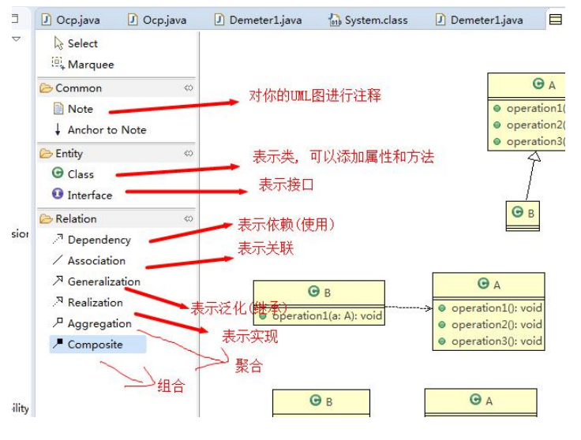
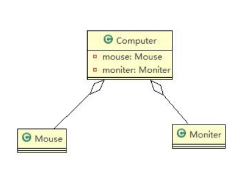

# 设计模式常用七大原则

- 单一职责原则
- 接口隔离原则
- 依赖倒转原则
- 里氏替换原则
- 开闭原则ocp
- 迪米特法则
- 合成服用原则

## 单一职责原则

定义：对类来说的，即一个类应该只负责一项职责。如类A负责两个不同职责：职责1，职责2。当职责1需求变更而改变A时，可能造成职责2执行错误，所以需要将类A的粒度分解为A1，A2.

以交通案例讲解：

方案一

```java
package com.atguigu.principle.singleresponsibility;

public class SingleResponsibility1 {

	public static void main(String[] args) {
		// TODO Auto-generated method stub
		Vehicle vehicle = new Vehicle();
		vehicle.run("摩托车");
		vehicle.run("汽车");
		vehicle.run("飞机");
	}

}

// 交通工具类
// 方式1
// 1. 在方式1 的run方法中，违反了单一职责原则
// 2. 解决的方案非常的简单，根据交通工具运行方法不同，分解成不同类即可
class Vehicle {
	public void run(String vehicle) {
		System.out.println(vehicle + " 在公路上运行....");
	}
}

```

方案二

```java
package com.atguigu.principle.singleresponsibility;

public class SingleResponsibility2 {

	public static void main(String[] args) {
		// TODO Auto-generated method stub
		RoadVehicle roadVehicle = new RoadVehicle();
		roadVehicle.run("摩托车");
		roadVehicle.run("汽车");
		
		AirVehicle airVehicle = new AirVehicle();
		
		airVehicle.run("飞机");
	}

}

//方案2的分析
//1. 遵守单一职责原则
//2. 但是这样做的改动很大，即将类分解，同时修改客户端
//3. 改进：直接修改Vehicle 类，改动的代码会比较少=>方案3

class RoadVehicle {
	public void run(String vehicle) {
		System.out.println(vehicle + "公路运行");
	}
}

class AirVehicle {
	public void run(String vehicle) {
		System.out.println(vehicle + "天空运行");
	}
}

class WaterVehicle {
	public void run(String vehicle) {
		System.out.println(vehicle + "水中运行");
	}
}
```

方案三

```java
package com.atguigu.principle.singleresponsibility;

public class SingleResponsibility3 {

	public static void main(String[] args) {
		// TODO Auto-generated method stub
		Vehicle2 vehicle2  = new Vehicle2();
		vehicle2.run("汽车");
		vehicle2.runWater("轮船");
		vehicle2.runAir("飞机");
	}

}


//方式3的分析
//1. 这种修改方法没有对原来的类做大的修改，只是增加方法
//2. 这里虽然没有在类这个级别上遵守单一职责原则，但是在方法级别上，仍然是遵守单一职责
class Vehicle2 {
	public void run(String vehicle) {
		//处理
		
		System.out.println(vehicle + " 在公路上运行....");
		
	}
	
	public void runAir(String vehicle) {
		System.out.println(vehicle + " 在天空上运行....");
	}
	
	public void runWater(String vehicle) {
		System.out.println(vehicle + " 在水中行....");
	}
	
	//方法2.
	//..
	//..
	
	//...
}

```

单一职责原则注意事项和细节

- 降低类的复杂度，一个类只负责一项职责。
- 提高类的可读性，可维护性。
- 降低变更引起的风险。
- 通常情况下，我们应当遵守单一职责原则，只有逻辑足够简单，才可以在代码级违反单一职责原则；只有类中方法数量足够少，可以在方法级别保持单一职责原则。

## 接口隔离原则

定义：客户端不应该依赖它不需要的接口，即一个类对另一个类的依赖应该建立在最小的接口上。

先看一张图：


没有使用接口隔离的代码：

```java
package com.atguigu.principle.segregation;

public class Segregation1 {

	public static void main(String[] args) {
		// TODO Auto-generated method stub

	}

}

//接口
interface Interface1 {
	void operation1();
	void operation2();
	void operation3();
	void operation4();
	void operation5();
}

class B implements Interface1 {
	public void operation1() {
		System.out.println("B 实现了 operation1");
	}
	
	public void operation2() {
		System.out.println("B 实现了 operation2");
	}
	public void operation3() {
		System.out.println("B 实现了 operation3");
	}
	public void operation4() {
		System.out.println("B 实现了 operation4");
	}
	public void operation5() {
		System.out.println("B 实现了 operation5");
	}
}

class D implements Interface1 {
	public void operation1() {
		System.out.println("D 实现了 operation1");
	}
	
	public void operation2() {
		System.out.println("D 实现了 operation2");
	}
	public void operation3() {
		System.out.println("D 实现了 operation3");
	}
	public void operation4() {
		System.out.println("D 实现了 operation4");
	}
	public void operation5() {
		System.out.println("D 实现了 operation5");
	}
}

class A { //A 类通过接口Interface1 依赖(使用) B类，但是只会用到1,2,3方法
	public void depend1(Interface1 i) {
		i.operation1();
	}
	public void depend2(Interface1 i) {
		i.operation2();
	}
	public void depend3(Interface1 i) {
		i.operation3();
	}
}
  
class C { //C 类通过接口Interface1 依赖(使用) D类，但是只会用到1,4,5方法
	public void depend1(Interface1 i) {
		i.operation1();
	}
	public void depend4(Interface1 i) {
		i.operation4();
	}
	public void depend5(Interface1 i) {
		i.operation5();
	}
}
```

应传统方法的问题和使用接口隔离原则改进：

- 类A通过接口Interface1依赖类B，类C通过接口Interface1依赖类D，如果接口Interface1对于类A和类C来说不是最小接口，那么类B和类D必须去实现他们不需要的方法。
- 将接口Interface1拆分为独立的几个接口，类A和类C分别与他们需要的接口建立依赖关系。也就是采用接口隔离原则。
- 接口Interface1中出现的方法，根据实际情况拆分为三个接口。


采用了接口隔离原则的代码：

```java
package com.atguigu.principle.segregation.improve;

public class Segregation1 {

	public static void main(String[] args) {
		// TODO Auto-generated method stub
		// 使用一把
		A a = new A();
		a.depend1(new B()); // A类通过接口去依赖B类
		a.depend2(new B());
		a.depend3(new B());

		C c = new C();

		c.depend1(new D()); // C类通过接口去依赖(使用)D类
		c.depend4(new D());
		c.depend5(new D());

	}

}

// 接口1
interface Interface1 {
	void operation1();

}

// 接口2
interface Interface2 {
	void operation2();

	void operation3();
}

// 接口3
interface Interface3 {
	void operation4();

	void operation5();
}

class B implements Interface1, Interface2 {
	public void operation1() {
		System.out.println("B 实现了 operation1");
	}

	public void operation2() {
		System.out.println("B 实现了 operation2");
	}

	public void operation3() {
		System.out.println("B 实现了 operation3");
	}

}

class D implements Interface1, Interface3 {
	public void operation1() {
		System.out.println("D 实现了 operation1");
	}

	public void operation4() {
		System.out.println("D 实现了 operation4");
	}

	public void operation5() {
		System.out.println("D 实现了 operation5");
	}
}

class A { // A 类通过接口Interface1,Interface2 依赖(使用) B类，但是只会用到1,2,3方法
	public void depend1(Interface1 i) {
		i.operation1();
	}

	public void depend2(Interface2 i) {
		i.operation2();
	}

	public void depend3(Interface2 i) {
		i.operation3();
	}
}

class C { // C 类通过接口Interface1,Interface3 依赖(使用) D类，但是只会用到1,4,5方法
	public void depend1(Interface1 i) {
		i.operation1();
	}

	public void depend4(Interface3 i) {
		i.operation4();
	}

	public void depend5(Interface3 i) {
		i.operation5();
	}
}
```

## 依赖倒转原则

依赖倒转原则（Dependence Inversion Principle）是指：

1. 高层模块不应该依赖底层模块，二者都应该依赖其抽象
2. 抽象不应该依赖细节，细节应该依赖抽象
3. 依赖倒转（倒置）的中心思想是面向接口编程
4. 依赖倒转原则是基于这样的设计理念：相对于细节的多变性，抽象的东西要稳定的多。以抽象为基础搭建的架构比以细节为基础的架构要稳定的多。在java中，抽象指的是接口或者抽象类，细节就是具体的实现类。
5. 使用接口或者抽象类的目的就是制定好规范，而不涉及任何具体的操作，把展现细节的任务交给他们的实现类去完成。

优化前的代码：

```java
package com.atguigu.principle.inversion;

public class DependecyInversion {

	public static void main(String[] args) {
		Person person = new Person();
		person.receive(new Email());
	}

}


class Email {
	public String getInfo() {
		return "电子邮件信息: hello,world";
	}
}

//完成Person接收消息的功能
//方式1分析
//1. 简单，比较容易想到
//2. 如果我们获取的对象是 微信，短信等等，则新增类，同时Perons也要增加相应的接收方法
//3. 解决思路：引入一个抽象的接口IReceiver, 表示接收者, 这样Person类与接口IReceiver发生依赖
//   因为Email, WeiXin 等等属于接收的范围，他们各自实现IReceiver 接口就ok, 这样我们就符号依赖倒转原则
class Person {
	public void receive(Email email ) {
		System.out.println(email.getInfo());
	}
}

```

优化后的代码：

```java
package com.atguigu.principle.inversion.improve;

public class DependecyInversion {

	public static void main(String[] args) {
		//客户端无需改变
		Person person = new Person();
		person.receive(new Email());
		
		person.receive(new WeiXin());
	}

}

//定义接口
interface IReceiver {
	public String getInfo();
}

class Email implements IReceiver {
	public String getInfo() {
		return "电子邮件信息: hello,world";
	}
}

//增加微信
class WeiXin implements IReceiver {
	public String getInfo() {
		return "微信信息: hello,ok";
	}
}

//方式2
class Person {
	//这里我们是对接口的依赖
	public void receive(IReceiver receiver ) {
		System.out.println(receiver.getInfo());
	}
}

```

依赖关系传递的三种方式和应用案例：

```java
package com.atguigu.principle.inversion.improve;

public class DependencyPass {

	public static void main(String[] args) {
		// TODO Auto-generated method stub
		ChangHong changHong = new ChangHong();
//		OpenAndClose openAndClose = new OpenAndClose();
//		openAndClose.open(changHong);
		
		//通过构造器进行依赖传递
//		OpenAndClose openAndClose = new OpenAndClose(changHong);
//		openAndClose.open();
		//通过setter方法进行依赖传递
		OpenAndClose openAndClose = new OpenAndClose();
		openAndClose.setTv(changHong);
		openAndClose.open();

	}

}

// 方式1： 通过接口传递实现依赖
// 开关的接口
// interface IOpenAndClose {
// public void open(ITV tv); //抽象方法,接收接口
// }
//
// interface ITV { //ITV接口
// public void play();
// }
// 
// class ChangHong implements ITV {
//
//	@Override
//	public void play() {
//		// TODO Auto-generated method stub
//		System.out.println("长虹电视机，打开");
//	}
//	 
// }
//// 实现接口
// class OpenAndClose implements IOpenAndClose{
// public void open(ITV tv){
// tv.play();
// }
// }

// 方式2: 通过构造方法依赖传递
// interface IOpenAndClose {
// public void open(); //抽象方法
// }
// interface ITV { //ITV接口
// public void play();
// }
// class OpenAndClose implements IOpenAndClose{
// public ITV tv; //成员
// public OpenAndClose(ITV tv){ //构造器
// this.tv = tv;
// }
// public void open(){
// this.tv.play();
// }
// }


// 方式3 , 通过setter方法传递
interface IOpenAndClose {
	public void open(); // 抽象方法

	public void setTv(ITV tv);
}

interface ITV { // ITV接口
	public void play();
}

class OpenAndClose implements IOpenAndClose {
	private ITV tv;

	public void setTv(ITV tv) {
		this.tv = tv;
	}

	public void open() {
		this.tv.play();
	}
}

class ChangHong implements ITV {

	@Override
	public void play() {
		// TODO Auto-generated method stub
		System.out.println("长虹电视机，打开");
	}
	 
}
```

依赖倒转原则的注意事项和细节：

1. 低层模块尽量都要有抽象类或接口，或者两者都有，程序稳定性更好。
2. 变量的声明类型尽量是抽象类或者接口，这样我们的变量引用和实际对象间，就存在一个缓冲层，利于程序扩展和优化。
3. 继承时遵循里氏替换原则。

## 里氏替换原则

OO中的继承性的思考和说明：

1. 继承包含这样一层含义：父类中凡是已经实现好的方法，实际上是在设定规范和契约，虽然它不强制要求所有的子类必须遵循这些契约，但是如果子类对这些已经实现的方法任意修改，就会对整个继承体系造成破坏。
2. 继承在给程序设计带来便利的同时，也带来了弊端。比如使用继承会给程序带来侵入性，程序的可移植性降低，增加对象间的耦合性，如果一个类被其他的类所继承，则当这个类需要修改时，必须考虑到所有的子类，并且父类修改后，所有涉及到子类的功能都有可能产生故障。
3. 问题提出：在编程中，如何正确的使用继承？=》里氏替换原则

基本介绍：

1. 里氏替换原则（Liskov Substitution Principle）在1988年，由麻省理工学院的一位姓里的女士提出的。
2. 如果对每个类型为T1的对象o1，都有类型为T2的对象o2，使得以T1定义的所有程序P在所有的对象o1都代换成o2时，程序P的行为没有发生变化，那么类型T2是类型T1的子类型。换句话说，所有引用基类的地方必须能透明地使用其子类的对象。
3. 在使用继承时，遵循里氏替换原则，在子类中尽量不要重写父类的方法。
4. 里氏替换原则告诉我们，继承实际上让两个类耦合性增强了，在适当的情况下，可以通过聚合、组合、依赖、来解决问题。

```java
package com.atguigu.principle.liskov;

public class Liskov {

	public static void main(String[] args) {
		// TODO Auto-generated method stub
		A a = new A();
		System.out.println("11-3=" + a.func1(11, 3));
		System.out.println("1-8=" + a.func1(1, 8));

		System.out.println("-----------------------");
		B b = new B();
		System.out.println("11-3=" + b.func1(11, 3));//这里本意是求出11-3
		System.out.println("1-8=" + b.func1(1, 8));// 1-8
		System.out.println("11+3+9=" + b.func2(11, 3));
		
		

	}

}

// A类
class A {
	// 返回两个数的差
	public int func1(int num1, int num2) {
		return num1 - num2;
	}
}

// B类继承了A
// 增加了一个新功能：完成两个数相加,然后和9求和
class B extends A {
	//这里，重写了A类的方法, 可能是无意识
	public int func1(int a, int b) {
		return a + b;
	}

	public int func2(int a, int b) {
		return func1(a, b) + 9;
	}
}

```

解决方法：

1. 我们发现原来运行正常的相减功能发生了错误。原因就是类B无意中重写了父类的方法，造成原有功能出现错误。在实际编程中，我们常常会通过重写父类的方法完成新的功能，这样写起来虽然简单，但整个继承体系的复用性会比较差。特别是运行多态比较频繁的时候。

2. 通用的做法是：原来的父类和子类都继承一个更通俗的基类，原有的继承关系去掉，采用依赖、聚合、组合等关系代替。

3. 改进方案

   

改进后的代码：

```java
package com.atguigu.principle.liskov.improve;

public class Liskov {

	public static void main(String[] args) {
		// TODO Auto-generated method stub
		A a = new A();
		System.out.println("11-3=" + a.func1(11, 3));
		System.out.println("1-8=" + a.func1(1, 8));

		System.out.println("-----------------------");
		B b = new B();
		//因为B类不再继承A类，因此调用者，不会再func1是求减法
		//调用完成的功能就会很明确
		System.out.println("11+3=" + b.func1(11, 3));//这里本意是求出11+3
		System.out.println("1+8=" + b.func1(1, 8));// 1+8
		System.out.println("11+3+9=" + b.func2(11, 3));
		
		
		//使用组合仍然可以使用到A类相关方法
		System.out.println("11-3=" + b.func3(11, 3));// 这里本意是求出11-3
		

	}

}

//创建一个更加基础的基类
class Base {
	//把更加基础的方法和成员写到Base类
}

// A类
class A extends Base {
	// 返回两个数的差
	public int func1(int num1, int num2) {
		return num1 - num2;
	}
}

// B类继承了A
// 增加了一个新功能：完成两个数相加,然后和9求和
class B extends Base {
	//如果B需要使用A类的方法,使用组合关系
	private A a = new A();
	
	//这里，重写了A类的方法, 可能是无意识
	public int func1(int a, int b) {
		return a + b;
	}

	public int func2(int a, int b) {
		return func1(a, b) + 9;
	}
	
	//我们仍然想使用A的方法
	public int func3(int a, int b) {
		return this.a.func1(a, b);
	}
}

```

## 开闭原则

基本介绍：

1. 开闭原则（Open Closed Principle）是编程中最基础、最重要的设计原则
2. 一个软件实体如类，模块和函数应该对扩展开放（对提供方），对修改关闭（对使用方）。用抽象构建框架，用实现扩展细节。
3. 当软件需要变化时，尽量通过扩展软件实体的行为来实现变化，而不是通过修改已有的代码来实现变化。
4. 编程中遵循其他原则，以及使用设计模式的目的就是遵循开闭原则。


```java
package com.atguigu.principle.ocp;

public class Ocp {

	public static void main(String[] args) {
		//使用看看存在的问题
		GraphicEditor graphicEditor = new GraphicEditor();
		graphicEditor.drawShape(new Rectangle());
		graphicEditor.drawShape(new Circle());
		graphicEditor.drawShape(new Triangle());
	}

}

//这是一个用于绘图的类 [使用方]
class GraphicEditor {
	//接收Shape对象，然后根据type，来绘制不同的图形
	public void drawShape(Shape s) {
		if (s.m_type == 1)
			drawRectangle(s);
		else if (s.m_type == 2)
			drawCircle(s);
		else if (s.m_type == 3)
			drawTriangle(s);
	}

	//绘制矩形
	public void drawRectangle(Shape r) {
		System.out.println(" 绘制矩形 ");
	}

	//绘制圆形
	public void drawCircle(Shape r) {
		System.out.println(" 绘制圆形 ");
	}
	
	//绘制三角形
	public void drawTriangle(Shape r) {
		System.out.println(" 绘制三角形 ");
	}
}

//Shape类，基类
class Shape {
	int m_type;
}

class Rectangle extends Shape {
	Rectangle() {
		super.m_type = 1;
	}
}

class Circle extends Shape {
	Circle() {
		super.m_type = 2;
	}
}

//新增画三角形
class Triangle extends Shape {
	Triangle() {
		super.m_type = 3;
	}
}

```

上面案例的优缺点：

1. 优点是比较好理解，简单易操作。
2. 缺点是违反了设计模式的ocp原则，即对扩展开放（提供方），对修改关闭（使用方）。即当我们给类增加新功能的时候，尽量不修改代码，或者尽可能少修改代码。
3. 比如我们这时要新增一个图形种类三角形，我们需要修改的地方较多。

改进的思路分析：

1. 把创建Shape类做成抽象类，并提供一个抽象的draw方法，让子类去实现即可，这样我们有新的图形种类时，只需要让新的图形类继承Shape，并实现draw方法即可，使用方的代码就不需要修改=》满足了开闭原则。

改进后的代码：

```java
package com.atguigu.principle.ocp.improve;

public class Ocp {

	public static void main(String[] args) {
		//使用看看存在的问题
		GraphicEditor graphicEditor = new GraphicEditor();
		graphicEditor.drawShape(new Rectangle());
		graphicEditor.drawShape(new Circle());
		graphicEditor.drawShape(new Triangle());
		graphicEditor.drawShape(new OtherGraphic());
	}

}

//这是一个用于绘图的类 [使用方]
class GraphicEditor {
	//接收Shape对象，调用draw方法
	public void drawShape(Shape s) {
		s.draw();
	}

	
}

//Shape类，基类
abstract class Shape {
	int m_type;
	
	public abstract void draw();//抽象方法
}

class Rectangle extends Shape {
	Rectangle() {
		super.m_type = 1;
	}

	@Override
	public void draw() {
		// TODO Auto-generated method stub
		System.out.println(" 绘制矩形 ");
	}
}

class Circle extends Shape {
	Circle() {
		super.m_type = 2;
	}
	@Override
	public void draw() {
		// TODO Auto-generated method stub
		System.out.println(" 绘制圆形 ");
	}
}

//新增画三角形
class Triangle extends Shape {
	Triangle() {
		super.m_type = 3;
	}
	@Override
	public void draw() {
		// TODO Auto-generated method stub
		System.out.println(" 绘制三角形 ");
	}
}

//新增一个图形
class OtherGraphic extends Shape {
	OtherGraphic() {
		super.m_type = 4;
	}

	@Override
	public void draw() {
		// TODO Auto-generated method stub
		System.out.println(" 绘制其它图形 ");
	}
}

```

## 迪米特法则

基本介绍：

1. 一个对象应该对其他对象保持最少的了解。
2. 类与类关系越密切，耦合度越大
3. 迪米特法则（Demeter Principle）又叫最少知道原则，即一个类对自己依赖的类知道的越少越好。也就是说，对于被依赖的类不管多么复杂，都尽量将逻辑封装在类的内部。对外除了提供的public方法，不对外泄露任何信息
4. 迪米特法则还有个更简单的定义：只与直接的朋友通信
5. 直接的朋友：每个对象都会与其他对象有耦合关系，只要两个对象之间有耦合关系，我们就说这两个对象之间是朋友关系。耦合的方式很多，依赖，关联，组合，聚合等。其中，我们称出现成员变量，方法参数，方法返回值中的类为直接的朋友，而出现在局部变量中的类不是直接的朋友。也就是说，陌生的类最好不要以局部变量的形式出现在类的内部。

应用实例：有一个学校，下属有各个学院和总部，现要求打印出学校总部员工ID和学院员工的ID

代码演示：

```java
package com.atguigu.principle.demeter;

import java.util.ArrayList;
import java.util.List;

//客户端
public class Demeter1 {

	public static void main(String[] args) {
		//创建了一个 SchoolManager 对象
		SchoolManager schoolManager = new SchoolManager();
		//输出学院的员工id 和  学校总部的员工信息
		schoolManager.printAllEmployee(new CollegeManager());

	}

}


//学校总部员工类
class Employee {
	private String id;

	public void setId(String id) {
		this.id = id;
	}

	public String getId() {
		return id;
	}
}


//学院的员工类
class CollegeEmployee {
	private String id;

	public void setId(String id) {
		this.id = id;
	}

	public String getId() {
		return id;
	}
}


//管理学院员工的管理类
class CollegeManager {
	//返回学院的所有员工
	public List<CollegeEmployee> getAllEmployee() {
		List<CollegeEmployee> list = new ArrayList<CollegeEmployee>();
		for (int i = 0; i < 10; i++) { //这里我们增加了10个员工到 list
			CollegeEmployee emp = new CollegeEmployee();
			emp.setId("学院员工id= " + i);
			list.add(emp);
		}
		return list;
	}
}

//学校管理类

//分析 SchoolManager 类的直接朋友类有哪些 Employee、CollegeManager
//CollegeEmployee 不是 直接朋友 而是一个陌生类，这样违背了 迪米特法则 
class SchoolManager {
	//返回学校总部的员工
	public List<Employee> getAllEmployee() {
		List<Employee> list = new ArrayList<Employee>();
		
		for (int i = 0; i < 5; i++) { //这里我们增加了5个员工到 list
			Employee emp = new Employee();
			emp.setId("学校总部员工id= " + i);
			list.add(emp);
		}
		return list;
	}

	//该方法完成输出学校总部和学院员工信息(id)
	void printAllEmployee(CollegeManager sub) {
		
		//分析问题
		//1. 这里的 CollegeEmployee 不是  SchoolManager的直接朋友
		//2. CollegeEmployee 是以局部变量方式出现在 SchoolManager
		//3. 违反了 迪米特法则 
		
		//获取到学院员工
		List<CollegeEmployee> list1 = sub.getAllEmployee();
		System.out.println("------------学院员工------------");
		for (CollegeEmployee e : list1) {
			System.out.println(e.getId());
		}
		//获取到学校总部员工
		List<Employee> list2 = this.getAllEmployee();
		System.out.println("------------学校总部员工------------");
		for (Employee e : list2) {
			System.out.println(e.getId());
		}
	}
}

```

代码改进：

```java
package com.atguigu.principle.demeter.improve;

import java.util.ArrayList;
import java.util.List;

//客户端
public class Demeter1 {

	public static void main(String[] args) {
		System.out.println("~~~使用迪米特法则的改进~~~");
		//创建了一个 SchoolManager 对象
		SchoolManager schoolManager = new SchoolManager();
		//输出学院的员工id 和  学校总部的员工信息
		schoolManager.printAllEmployee(new CollegeManager());

	}

}


//学校总部员工类
class Employee {
	private String id;

	public void setId(String id) {
		this.id = id;
	}

	public String getId() {
		return id;
	}
}


//学院的员工类
class CollegeEmployee {
	private String id;

	public void setId(String id) {
		this.id = id;
	}

	public String getId() {
		return id;
	}
}


//管理学院员工的管理类
class CollegeManager {
	//返回学院的所有员工
	public List<CollegeEmployee> getAllEmployee() {
		List<CollegeEmployee> list = new ArrayList<CollegeEmployee>();
		for (int i = 0; i < 10; i++) { //这里我们增加了10个员工到 list
			CollegeEmployee emp = new CollegeEmployee();
			emp.setId("学院员工id= " + i);
			list.add(emp);
		}
		return list;
	}
	
	//输出学院员工的信息
	public void printEmployee() {
		//获取到学院员工
		List<CollegeEmployee> list1 = getAllEmployee();
		System.out.println("------------学院员工------------");
		for (CollegeEmployee e : list1) {
			System.out.println(e.getId());
		}
	}
}

//学校管理类

//分析 SchoolManager 类的直接朋友类有哪些 Employee、CollegeManager
//CollegeEmployee 不是 直接朋友 而是一个陌生类，这样违背了 迪米特法则 
class SchoolManager {
	//返回学校总部的员工
	public List<Employee> getAllEmployee() {
		List<Employee> list = new ArrayList<Employee>();
		
		for (int i = 0; i < 5; i++) { //这里我们增加了5个员工到 list
			Employee emp = new Employee();
			emp.setId("学校总部员工id= " + i);
			list.add(emp);
		}
		return list;
	}

	//该方法完成输出学校总部和学院员工信息(id)
	void printAllEmployee(CollegeManager sub) {
		
		//分析问题
		//1. 将输出学院的员工方法，封装到CollegeManager
		sub.printEmployee();
	
		//获取到学校总部员工
		List<Employee> list2 = this.getAllEmployee();
		System.out.println("------------学校总部员工------------");
		for (Employee e : list2) {
			System.out.println(e.getId());
		}
	}
}

```

迪米特法则注意事项和细节：

1. 迪米特法则的核心是降低类之间的耦合
2. 但是注意：由于每个类都减少了不必要的依赖，因此迪米特法则只是要求降低类间（对象间）耦合关系，并不是要求完全没有依赖关系。

## 合成复用原则

英文名：Composite Reuse Principle

基本介绍：原则是尽量使用合成/聚成的方式，而不是使用继承


## 设计原则的核心思想

1. 找出应用中可能需要变化之处，把它们独立出来，不要和那些不需要变化的代码混在一起。
2. 针对接口编程，而不是针对实现编程
3. 为了交互对象之间的松耦合设计而努力

# UML类图

UML基本介绍：

1. UML-Unified modeling language UML（统一建模语言），是一种用于软件系统分析和设计的语言工具，它用于帮助软件开发人员进行思考和记录思考的结果

2. UML本身是一套符号的规定，就像是数学符号和化学符号一样，这些符号用于描述软件模型中的各个元素和他们之间的关系，比如类、接口、实现、泛化、依赖、组合、聚合等，如图：

   



3. 使用UML来建模，常用的工具有Rational Rose,也可以使用一些插件来建模
   - Eclipse按照UML插件，需要搜索下载 AmaterasUML的压缩包。

## UML图

UML图分类：

- 用例图（use case）
- 静态结构图：类图、对象图、包图、组件图、部署图
- 动态行为图：交互图（时序图与协作图）、状态图、活动图

说明：

1. 类图是描述类与类之间的关系的，是UML图中最核心的。

## UML类图

用于描述系统中的类（对象）本身的组成和类（对象）之间的各种静态关系。

类之间的关系：依赖、泛化（继承）、实现、关联、组合与聚合。

类图简单举例：

```java
public class Person{
	private Integer id;
	private String name;
	
	public void setName(String name){
		this.name = name;
	}
	
	public String getName(){
		return name;
	}
}
```


## 类图-依赖关系

英文为：Dependence

只要是在类中用到了对方，那么他们之间就存在依赖关系。如果没有对方，连编译都通过不了。

```
package com.atguigu.uml.dependence;

public class PersonServiceBean {
	private PersonDao personDao;// 类

	public void save(Person person) {
	}

	public IDCard getIDCard(Integer personid) {
		return null;
	}

	public void modify() {
		Department department = new Department();
	}

}

public class PersonDao{}

public class IDCard{}

public class Person{}

public class Department{}
```

对应的类图：


小结：

1. 类中用到了对方
2. 如果是类的成员属性
3. 如果是方法的返回类型
4. 是方法接收的参数类型
5. 方法中使用到

## 类图-泛化关系

英文名：generalization

泛化关系实际上就是继承关系，它是依赖关系的特例

```
public abstract class DaoSupport{
	public void save(Object entity){}
	
	public void delete(Object id){}
}

public class PersonServiceBean extends DaoSupport{}
```

对应的类图：


小结：

1. 泛化关系实际上就是继承关系
2. 如果A类继承了B类，我们就说A和B存在泛化关系。

## 类图-实现关系

英文名：Implementation

实现关系实际上就是A类实现了B接口，它是依赖关系的特例。

```
public interface PersonService{
	public void delete(Integer id);
}

public class PersonServiceBean implements PersonService{
	public void delete(){}
}
```

对应的类图：


## 类图-关联关系

英文名：Association

关联关系实际上就是类与类之间的联系，它是依赖关系的特例。

关联关系具有导航性：即双向关系或者单向关系

关系具有多重性：如”1“（表示有且仅有一个），”0...“（表示0个或者多个），”0，1“（表示0个或者一个），”n...m“（表示n到m个都可以），”m...“（表示至少m个）。

单向一对一关系：

```java
public class Person{
	private IDCard card;
}

public class IDCard{}
```


双向一对一关系：

```java
public class Person{
	private IDCard card;
}

public class IDCard{
	private Person person;
}
```


## 类图-聚合关系

英文名：Aggregation

基本介绍：聚合关系表示的是整体和部分的关系，整体与部分可以分开。聚合关系是关联关系的特例，所以它具有关联的导航性和多重性。

如：一台电脑由键盘（keyboard）、显示器（monitor），鼠标等组成；组成电脑的各个配件是可以从电脑上分离出来的，使用带空心菱形的实线来表示；

```java
public class Computer{
	private Mouse mouse;
	private Monitor monitor;
	
	public void setMouse(Mouse mouse){
		this.mouse = mouse;
	}
	
	public void setMonitor(Monitor monitor){
		this.monitor = monitor;
	}
}
```



## 类图-组合关系

英文名：Composition

基本介绍：也是整体与部分的关系，但是整体与部分不可以分开。

再看一个案例：在程序中我们定义实体：Person与IDCard、Head，Head和Person就是组合，IDCard和Person就是聚合。

但是如果在程序中Person实体定义了对IDCard进行级联删除，即删除Person时连同IDCard一起删除，那么IDCard和Person就是组合了。

```
public class Person{
	private IDCard card;
	private Head head = new Head();
}

public class Head{}

public class IDCard{}
```

对应的类图：


案例2：

```
public class Computer{
	private Mouse mouse = new Mouse();//鼠标可以和computer不能分离
	private Monitor monitor = new Monitor();//显示器可以和computer不能分离
	
	public void setMouse(Mouse mouse){
		this.mouse = mouse;
	}
	
	public void setMonitor(Monitor monitor){
		this.monitor = monitor;
	}
}

public class Mouse{}
public class Monitor{}
```

对应的类图：


