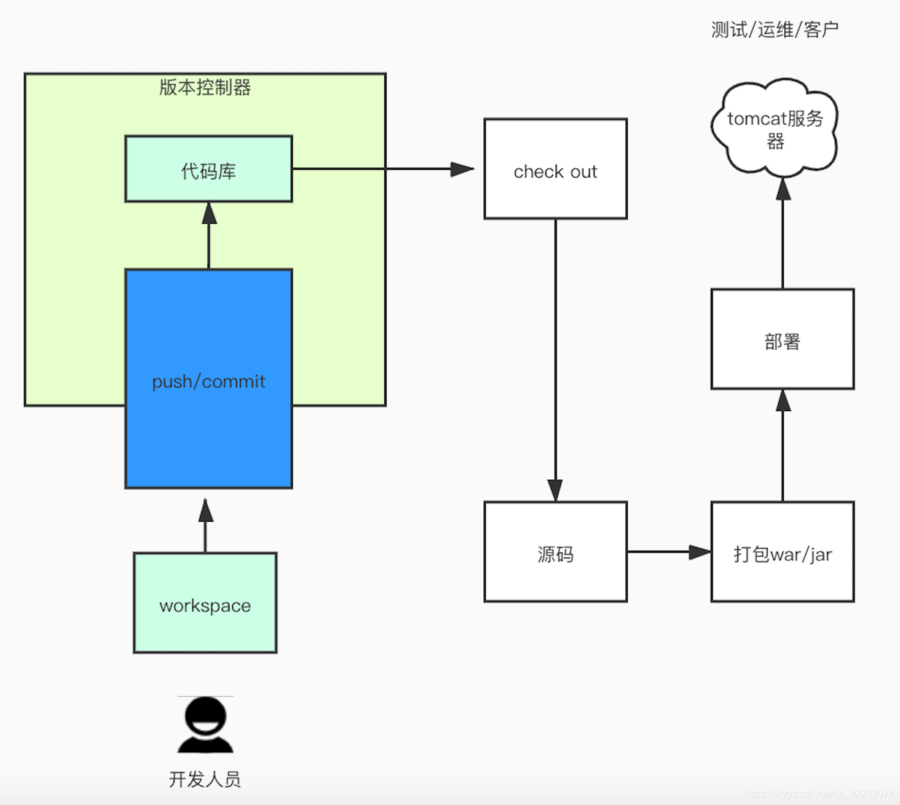
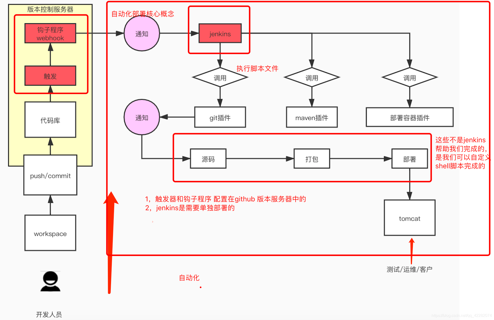

# Jenkins

## 简介

Jenkins是一个开源软件项目，是基于Java开发的一种持续集成工具，用于监控持续重复的工作，旨在提供一个开放易用的软件平台，使软件的持续集成变成可能。

java项目部署方式：

1. 手动部署



2. 自动化部署



搭建上述持续集成环境可以把整个构建、部署过程自动化，很大程度上减轻工作量。对于程序员的日常开发来说不会造成任何额外负担——自己把代码提交上去之后，服务器上运行的马上就是最新版本——一切都发生在无形中。

## 持续集成工具

**Jenkins 和 Hundson**
2009 年，甲骨文收购了 Sun 并继承了 Hudson 代码库。在 2011 年年初，甲骨文和开源社区之间的关系破裂，该项目被分成两个独立的项目：
Jenkins：由大部分原始开发人员组成
Hudson：由甲骨文公司继续管理

所以 Jenkins 和 Hudson 是两款非常相似的产品。

## 基本环境

jenkins的部署需要最最基本的环境如下：

1.jdk环境，Jenkins是java语言开发的，因需要jdk环境。

2.git/svn客户端，因一般代码是放在git/svn服务器上的，我们需要拉取代码。

3.maven客户端，因一般java程序是由maven工程，需要maven打包，当然也有其他打包方式，如：gradle。


以上是自动化部署java程序jenkins需要的基本环境，需提前安装好。

## jenkins下载

下载地址：https://www.jenkins.io/zh/download/

## jenkins安装

1. 下载好安装包jenkins.war包。
2. 在安装包根路径下，运行命令如下命令，（linux环境、Windows环境都一样）；

```java
java -jar jenkins.war --httpPort=8080	//jenkins默认端口号为8080
```

3. 打开浏览器进入链接 http://localhost:8080。
4. 填写初始密码，激活系统
5. 进入插件安装选择（这里建议选择，推荐安装的插件，保证基本常用的功能可以使用。）
6. 设置初始用户和密码
7. 进入系统，安装完成


注意，如果还是进入不了系统，需要稍等一下，或者刷新页面，如果还是进入不了，需要重新启动jenkins服务器。