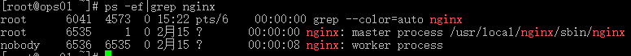

[TOC]
# linux基本命令

从一个服务器传送某个文件到另外一个服务器上：

```
[root@baize-server-a2d4d9ea ~]# scp /root/finwise-allinone-1.0.286.tar.gz   root@172.16.15.117:/root/
```

将某个文件夹压缩成zip压缩包：

```
[root@baize-server-29057eb9 posteval]# zip -r install.zip install/
```

查看ip地址：ip addr 或者ifconfig

清屏：ctrl + L

查看当前目录下的所有的内容：ls （以多列的形式展示） 或者 ls -l （就等于ll，-l 表示以单列的形式展示，-a表示包含隐藏文件) 

进入到某个文件夹下：cd

编辑某个文本：vi 或者vim

查看文件内容：tail -f 文件名 （-f用于查阅正在改变的文件）

显示当前所在的位置：pwd

当前用户的家目录：~

当前目录下：./   默认可以省略

创建单个文件夹：mkdir  文件夹名

创建文件：touch  文件名

## 用户

添加用户：

```
adduser 用户名 -p 密码
```

切换用户：

```
su 用户名
```

## 防火墙

对防火墙进行操作时，需要使用root用户。

查看防火墙的状态：

```
systemctl status firewalld
```

关闭防火墙：

```
systemctl stop firewalld
```

打开防火墙：

```
systemctl start firewalld
```

## 端口号被占用

查看某端口号被哪个进程占用：

```
lsof -i :port
port为对应的端口号
```

## rm命令

-r 表示递归进入子目录进行删除操作

-f 表示强制执行不再提示

-v 表示显示执行的信息

## cat命令

查看文件内容

```
cat filename
```

## tar命令

解压缩：tar -zxvf 压缩包名

## ls命令

-a 表示不要忽略以开头的条目，有显示文件夹或者文件对应的各种权限，所有者等信息。

-l 表示以单列的方式进行显示。

## chown命令

更改文件夹或者文件的权限所属哪个用户和哪个组。

```
chown user[:group] file...
```

# 查询相关进程

ps -ef |grep 进程名




查看某个机器的某个端口号是否可用

```
[root@baize-server-29057eb9 ~]# telnet 172.16.15.147 9080
```

连接某个ip：

```
[root@baize-server-659d96e6 ~]# ssh root@172.16.15.147
```

