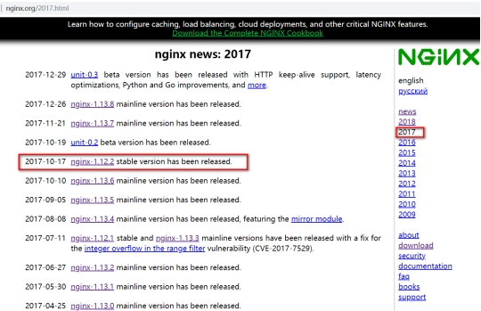
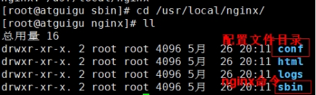
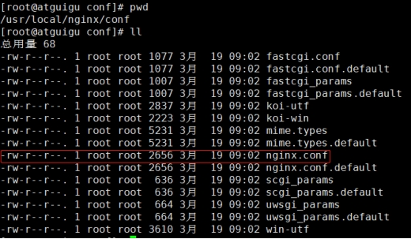
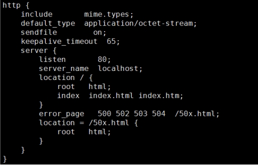
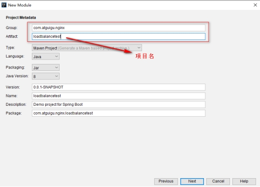

# Nginx简介

## Nginx概述

- Nginx ("engine x") 是一个高性能的HTTP和反向代理服务器,特点是占有内存少，并发能力强，中国大陆使用nginx网站用户有：百度、京东、新浪、网易、腾讯、淘宝等。

## Nginx作为WEB服务器

- Nginx可以作为静态页面的web服务器，同时还支持CGI协议的动态语言，比如perl、php等。但是不支持java。Java程序只能通过与tomcat配合完成。Nginx专为性能优化而开发，性能是其最重要的考量,非常注重效率 ，能经受高负载的考验,有报告表明能支持高达 50,000个并发连接数。

## 正向代理

- Nginx不仅可以做反向代理，实现负载均衡。还能用作正向代理来进行上网等功能。

**正向代理：**如果把局域网外的Internet想象成一个巨大的资源库，则局域网中的客户端要访问Internet，则需要通过代理服务器来访问，这种代理服务就称为正向代理。


## 反向代理

反向代理：其实客户端对代理是无感知的，因为客户端不需要任何配置就可以访问，我们只需要将请求发送到反向代理服务器，由反向代理服务器去选择目标服务器获取数据后，在返回给客户端，此时反向代理服务器和目标服务器对外就是一个服务器，暴露的是代理服务器地址，隐藏了真实服务器IP地址。


## 负载均衡

​	客户端发送多个请求到服务器，服务器处理请求，有一些可能要与数据库进行交互，服务器处理完毕后，再将结果返回给客户端。
　　这种架构模式对于早期的系统相对单一，并发请求相对较少的情况下是比较适合的，成本也低。但是随着信息数量的不断增长，访问量和数据量的飞速增长，以及系统业务的复杂度增加，这种架构会造成服务器相应客户端的请求日益缓慢，并发量特别大的时候，还容易造成服务器直接崩溃。很明显这是由于服务器性能的瓶颈造成的问题，那么如何解决这种情况呢？
　　我们首先想到的可能是升级服务器的配置，比如提高CPU执行频率，加大内存等提高机器的物理性能来解决此问题，但是我们知道摩尔定律的日益失效，硬件的性能提升已经不能满足日益提升的需求了。最明显的一个例子，天猫双十一当天，某个热销商品的瞬时访问量是极其庞大的，那么类似上面的系统架构，将机器都增加到现有的顶级物理配置，都是不能够满足需求的。那么怎么办呢？
​	上面的分析我们去掉了增加服务器物理配置来解决问题的办法，也就是说纵向解决问题的办法行不通了，那么横向增加服务器的数量呢？这时候集群的概念产生了，单个服务器解决不了，我们增加服务器的数量，然后将请求分发到各个服务器上，将原先请求集中到单个服务器上的情况改为将请求分发到多个服务器上，将负载分发到不同的服务器，也就是我们所说的负载均衡。


## 动静分离

为了加快网站的解析速度，可以把动态页面和静态页面由不同的服务器来解析，加快解析速度。降低原来单个服务器的压力。


# Nginx安装

进入nginx官网，下载

http://nginx.org/      nginx-1.17.1.tar.gz




**需要的安装包**

Ø pcre-8.37.tar.gz 

Ø openssl-1.0.1t.tar.gz

Ø zlib-1.2.8.tar.gz

Ø nginx-1.12.2.tar.gz

**在线安装nginx**

第一步，安装pcre

Ø 第一步 联网下载pcre 

```shell
wget http://downloads.sourceforge.net/project/pcre/pcre/8.37/pcre-8.37.tar.gz
```

Ø 第二步 解压压缩文件

使用命令 tar -zxvf pcre-8.37.tar.gz

Ø 第三步 ./configure完成后，回到pcre目录下执行make，最后执行make install

Ø 第四步  pcre-config --version  检查版本

第二步，安装openssl 、zlib 、 gcc 依赖

```shell
yum -y install make zlib zlib-devel gcc-c++ libtool  openssl openssl-devel
```

第三步，安装nginx

Ø 使用命令解压 

Ø ./configure

Ø make && make install

Ø 进入目录 /usr/local/nginx/sbin   执行./nginx 启动服务

第四步，关闭防火墙

Ø 在windows系统中访问linux中nginx，默认不能访问的，因为防火墙问题

Ø 关闭防火墙-开放访问的端口号，**80**端口

 

Ø 查看开放的端口号

Ø firewall-cmd --list-all

Ø 设置开放的服务或端口号

Ø firewall-cmd --add-service=http --permanent

Ø firewall-cmd --add-port=80/tcp --permanent

Ø 重启防火墙

Ø firewall-cmd --reload


**离线安装nginx**

第一步 安装pcre

Ø 解压缩pcre-xx.tar.gz包

Ø 进入解压缩目录，执行./configure

如果提示，需要提前安装gcc++

进入安装光盘目录的软件包(/media/CentOSXX/Package)执行

rpm -ivh libstdc++-devel-4.4.7-17.el6.x86_64.rpm

rpm -ivh gcc-c++-4.4.7-17.el6.x86_64.rpm

Ø ./configure完成后，回到pcre目录下执行make && make install

第二步 安装openssl
解压缩openssl-xx.tar.gz包
进入解压缩目录，执行./config 
make && make install

第三步 安装zlib
解压缩zlib-xx.tar.gz包
进入解压缩目录，执行./configure
make && make install

第四步 安装nginx
解压缩nginx-xx.tar.gz包 
进入解压缩目录，执行./configure 
make && make install

第五步 关闭防火墙，开放端口
访问测试
Nginx安装后的目录：




启动nginx:


注意：访问失败一般是nginx服务启动失败或者防火墙未关闭

# Nginx常用的命令和配置文件

（1）启动命令

在/usr/local/nginx/sbin目录下执行 ./nginx 

（2）关闭命令

在/usr/local/nginx/sbin目录下执行 ./nginx  -s  stop 

（3）重新加载命令 

在/usr/local/nginx/sbin目录下执行 ./nginx  -s  reload

（4）查看版本


（5）查看进程


  (6) 设置nginx启动脚本全局可用

把该文件copy到/usr/local/bin目录下：

cp  /usr/local/nginx/sbin/nginx   /usr/local/bin/

**nginx.conf 配置文件**

nginx 安装目录(/usr/local/nginx/conf/nginx.conf)下，其默认的配置文件都放在这个目录的 conf 目录下，而主配置文件 nginx.conf 也在其中，后续对 nginx 的使用基本上都是对此配置文件进行相应的修改



配置文件中有很多#， 开头的表示注释内容，我们去掉所有以 # 开头的段落，精简之后的内容如下：


根据上述文件，我们可以很明显的将 nginx.conf 配置文件分为三部分：

第一部分：全局块

　　从配置文件开始到 events 块之间的内容，主要会设置一些影响nginx 服务器整体运行的配置指令，主要包括配置运行 Nginx 服务器的用户（组）、允许生成的 worker process 数，进程 PID 存放路径、日志存放路径和类型以及配置文件的引入等。

　　比如上面第一行配置的：


这是 Nginx 服务器并发处理服务的关键配置，worker_processes 值越大，可以支持的并发处理量也越多，但是会受到硬件、软件等设备的制约。

第二部分：events块

　比如上面的配置：


events 块涉及的指令主要影响 Nginx 服务器与用户的网络连接，常用的设置包括是否开启对多 work process 下的网络连接进行序列化，是否允许同时接收多个网络连接，选取哪种事件驱动模型来处理连接请求，每个 work process 可以同时支持的最大连接数等。

上述例子就表示每个 work process 支持的最大连接数为 1024.

这部分的配置对 Nginx 的性能影响较大，在实际中应该灵活配置。

第三部分：http块



　这算是 Nginx 服务器配置中最频繁的部分，代理、缓存和日志定义等绝大多数功能和第三方模块的配置都在这里。

　　需要注意的是：http 块也可以包括 **http全局块**、**server 块**。

**http 全局块**

　　http全局块配置的指令包括文件引入、MIME-TYPE 定义、日志自定义、连接超时时间、单链接请求数上限等。

**server 块**

　　这块和虚拟主机有密切关系，虚拟主机从用户角度看，和一台独立的硬件主机是完全一样的，该技术的产生是为了节省互联网服务器硬件成本。

　　每个 http 块可以包括多个 server 块，而每个 server 块就相当于一个虚拟主机。

　　而每个 server 块也分为全局 server 块，以及可以同时包含多个 locaton 块。

　　**1、全局 server 块**

　　最常见的配置是本虚拟机主机的监听配置和本虚拟主机的名称或IP配置。

　　**2、location 块**

　　一个 server 块可以配置多个 location 块。

这块的主要作用是基于 Nginx  服务器接收到的请求字符串

​	（例如 server_name/uri-string），对虚拟主机名称（也可以是IP别名）之外的字符串（例如 前面的 /uri-string）进行匹配，对特定的请求进行处理。地址定向、数据缓存和应答控制等功能，还有许多第三方模块的配置也在这里进行。

# Nginx配置实例-反向代理

**创建web项目并启动**


**配置反向代理**

虚拟机此时就是反向代理服务器，代理宿主机中的tomcat对外提供访问服务。

需要在nginx配置文件中配置代理信息：修改/usr/local/nginx/conf目录下的nginx.conf文件


配置完成后，重新加载配置文件：`nginx -s reload`

反向代理服务器代替tomcat服务器对外提供服务，用户只知道反向代理服务器地址，在浏览器中输入反向代理服务器地址访问服务


**location指令说明**

该指令用于匹配 URL。

语法如下：**location [=|~|~\*|^~|@] pattern{……}**

1、= ：用于不含正则表达式的 uri 前，要求请求字符串与 uri 严格匹配，如果匹配成功，就停止继续向下搜索并立即处理该请求。

```java
server {
server_name localhost
　　location = /abc {
　　　　……
　　}
}
匹配：
http://192.168.200.168/abc
不匹配：
http://192.168.200.168/abc/
http://192.168.200.168/abcef
```

2、 没有修饰符，必须以指定模式开始

```java
server {
　　server_name localhost;
　　location /a/b {
　　　　……
　　}
}
http://192.168.200.168/a/b
http://192.168.200.168/a/b/asd
http://192.168.200.168/a/b/c/sd?id=1
```

3、~：用于表示 uri 包含正则表达式，并且**区分**大小写。

```java
server {
server_name localhost;
　　location ~ ^/abc$ {
　　　　……
　　}
}
匹配：
http://192.168.200.168/abc
http://192.168.200.168/abc?k=v
不匹配：
http://192.168.200.168/AbC
http://192.168.200.168/abc/
http://192.168.200.168/abcde
```

4、~*：用于表示 uri 包含正则表达式，并且**不区分**大小写。

```java
server {
server_name localhost;
location ~* ^/abc$ {
　　　　……
　　}
}
匹配：
http://192.168.200.168/abc
http://192.168.200.168/ABC
不匹配：
http://192.168.200.168/abc/
http://192.168.200.168/abcde
```

4、^~：用于不含正则表达式的 uri 前，要求 Nginx 服务器找到标识 uri 和请求字符串匹配度最高的 location 后，立即使用此 location 处理请求，而不再使用 location 块中的正则 uri 和请求字符串做匹配。

注意：如果 uri 包含正则表达式，则必须要有 ~ 或者 ~* 标识。


**查找顺序和优先级**

1：带有“=“的精确匹配优先

2：没有修饰符的精确匹配

3：正则表达式按照他们在配置文件中定义的顺序

4：带有“^~”修饰符的，开头匹配

5：带有“~” 或“~\*” 修饰符的，如果正则表达式与URI匹配

6：没有修饰符的，如果指定字符串与URI开头匹配

 # Nginx配置实例-负载均衡

**实现效果**

1、创建springboot项目





下一步点击finish完成创建。

\- 创建测试使用的HelloController

```java
@Controller
public class HelloController {
    //Spring容器创建时通过SpringEL加载端口号设置给prot
    @Value("${server.port}")
    Integer port;
    @ResponseBody
    @RequestMapping("/hello")
    public String test(){
        return "hello , 当前端口号:"+ port;
    }
}
```

2、启动springBoot项目


3、项目多实例启动


准备工作

在nginx的配置文件中进行负载均衡的配置


nginx负载均衡策略


# Nginx配置实例-动静分离

Nginx 动静分离简单来说就是把动态跟静态请求分开，动态资源如jsp通过tomcat服务响应，而静态资源（图片、css、js、html等）通过nginx直接访问服务器上的文件


现在要访问/usr/local/nginx/images根目录下的images/xbx.jpg图片


配置静态资源路径：


访问测试：


# Nginx原理与优化参数配置


**master-workers的机制的好处**

首先，对于每个worker进程来说，独立的进程，不需要加锁，所以省掉了锁带来的开销，同时在编程以及问题查找时，也会方便很多。

其次，采用独立的进程，可以让互相之间不会影响，一个进程退出后，其它进程还在工作，服务不会中断，master进程则很快启动新的worker进程。

当然，worker进程的异常退出，肯定是程序有bug了，异常退出，会导致当前worker上的所有请求失败，不过不会影响到所有请求，所以降低了风险。

**需要设置多少个worker**

Nginx 同redis类似都采用了io多路复用机制，每个worker都是一个独立的进程，但每个进程里只有一个主线程，通过异步非阻塞的方式来处理请求， 即使是千上万个请求也不在话下。每个worker的线程可以把一个cpu的性能发挥到极致。

所以worker数和服务器的cpu数相等是最为适宜的。设少了会浪费cpu，设多了会造成cpu频繁切换上下文带来的损耗。

**#设置worker数量**

worker_processes 4

\#work绑定cpu(4 work绑定4cpu)。

worker_cpu_affinity 0001 0010 0100 1000

\#work绑定cpu (4 work绑定8cpu中的4个) 。

worker_cpu_affinity 00000001 00000010 00000100 00001000  00010000  00100000 01000000  10000000

**#连接数**

**worker_connections 1024**

这个值是表示每个worker进程所能建立连接的最大值，所以，一个nginx能建立的最大连接数，应该是worker_connections * worker_processes。当然，这里说的是最大连接数，对于HTTP请求本地资源来说，能够支持的**最大并发数量**是worker_connections * worker_processes，如果是支持http1.1的浏览器每次访问要占两个连接，所以普通的静态访问最大并发数是： worker_connections * worker_processes /2，而如果是HTTP作为反向代理来说，最大并发数量应该是worker_connections * worker_processes/4。

因为作为反向代理服务器，每个并发会建立与客户端的连接和与后端服务的连接，会占用两个连接。

了解：每个连接指的是对系统中的文件进行读或写操作，进程最大连接数指的是进程最大可打开文件数，受限于操作系统，可以通过 ulimit -n命令查询(默认1024),也可以通过 ulimit -SHn 65535修改进程最大可打开文件数(数字不是越大越好，nginx占用内存越小处理性能越高)

**配置文件 nginx.conf**

```
#安全问题，建议用nobody,不要用root.
#user  nobody;
 
#worker数和服务器的cpu数相等是最为适宜
worker_processes  2;
 
#work绑定cpu(4 work绑定4cpu)
worker_cpu_affinity 0001 0010 0100 1000
 
#work绑定cpu (4 work绑定8cpu中的4个) 。
worker_cpu_affinity 0000001 00000010 00000100 00001000  
 
 
 
#error_log path(存放路径) level(日志等级) path表示日志路径，level表示日志等级，
#具体如下：[ debug | info | notice | warn | error | crit ]
#从左至右，日志详细程度逐级递减，即debug最详细，crit最少，默认为crit。 
 
#error_log  logs/error.log;
#error_log  logs/error.log  notice;
#error_log  logs/error.log  info;
 
 
#pid        logs/nginx.pid;
 
 
events {
    #这个值是表示每个worker进程所能建立连接的最大值，所以，一个nginx能建立的最大连接数，应该是worker_connections * worker_processes。
    #当然，这里说的是最大连接数，对于HTTP请求本地资源来说，能够支持的最大并发数量是worker_connections * worker_processes，
    #如果是支持http1.1的浏览器每次访问要占两个连接，
    #所以普通的静态访问最大并发数是： worker_connections * worker_processes /2，
    #而如果是HTTP作为反向代理来说，最大并发数量应该是worker_connections * worker_processes/4。
    #因为作为反向代理服务器，每个并发会建立与客户端的连接和与后端服务的连接，会占用两个连接。
 
    worker_connections  1024;  
 
    #这个值是表示nginx要支持哪种多路io复用。
    #一般的Linux选择epoll, 如果是(*BSD)系列的Linux使用kquene。
    #windows版本的nginx不支持多路IO复用，这个值不用配。
    use epoll;
 
    # 当一个worker抢占到一个链接时，是否尽可能的让其获得更多的连接,默认是off 。
    multi_accept on; //并发量大时缓解客户端等待时间。
 
    # 默认是on ,开启nginx的抢占锁机制。
    accept_mutex  on; //master指派worker抢占锁
}
 
 
http {
    #当web服务器收到静态的资源文件请求时，依据请求文件的后缀名在服务器的MIME配置文件中找到对应的MIME Type，再根据MIME Type设置HTTP Response的Content-Type，然后浏览器根据Content-Type的值处理文件。
 
    include       mime.types;  #/usr/local/nginx/conf/mime.types
 
    #如果 不能从mime.types找到映射的话，用以下作为默认值-二进制
    default_type  application/octet-stream;
 
     #日志位置
     access_log  logs/host.access.log  main;
 
     #一条典型的accesslog：
     #101.226.166.254 - - [21/Oct/2013:20:34:28 +0800] "GET /movie_cat.php?year=2013 HTTP/1.1" 200 5209 "http://www.baidu.com" "Mozilla/4.0 (compatible; MSIE 8.0; Windows NT 6.1; Trident/4.0; SLCC2; .NET CLR 2.0.50727; .NET CLR 3.5.30729; .NET CLR 3.0.30729; Media Center PC 6.0; MDDR; .NET4.0C; .NET4.0E; .NET CLR 1.1.4322; Tablet PC 2.0); 360Spider"
 
     #1）101.226.166.254:(用户IP)
     #2）[21/Oct/2013:20:34:28 +0800]：(访问时间) 
     #3）GET：http请求方式，有GET和POST两种
     #4）/movie_cat.php?year=2013：当前访问的网页是动态网页，movie_cat.php即请求的后台接口，year=2013为具体接口的参数
     #5）200：服务状态，200表示正常，常见的还有，301永久重定向、4XX表示请求出错、5XX服务器内部错误
     #6）5209：传送字节数为5209，单位为byte
     #7）"http://www.baidu.com"：refer:即当前页面的上一个网页
     #8）"Mozilla/4.0 (compatible; MSIE 8.0; Windows NT 6.1; Trident/4.0; SLCC2; .NET CLR 2.0.50727; .NET CLR 3.5.30729; #.NET CLR 3.0.30729; Media Center PC 6.0; MDDR; .NET4.0C; .NET4.0E; .NET CLR 1.1.4322; Tablet PC 2.0); 360Spider"： agent字段：通常用来记录操作系统、浏览器版本、浏览器内核等信息
 
    log_format  main  '$remote_addr - $remote_user [$time_local] "$request" '
                       '$status $body_bytes_sent "$http_referer" '
                      '"$http_user_agent" "$http_x_forwarded_for"';
 
    #开启从磁盘直接到网络的文件传输，适用于有大文件上传下载的情况，提高IO效率。
    sendfile        on; //大文件传递优化，提高效率
   
    #一个请求完成之后还要保持连接多久, 默认为0，表示完成请求后直接关闭连接。
    #keepalive_timeout  0;
    keepalive_timeout  65; 
 
    #开启或者关闭gzip模块
    #gzip  on ; //文件压缩，再传输，提高效率
 
    #设置允许压缩的页面最小字节数，页面字节数从header头中的Content-Length中进行获取。
    #gzip_min_lenth 1k;//超过该大小开始压缩，否则不用压缩
 
    # gzip压缩比，1 压缩比最小处理速度最快，9 压缩比最大但处理最慢（传输快但比较消耗cpu）
    #gzip_comp_level 4;
 
    #匹配MIME类型进行压缩，（无论是否指定）"text/html"类型总是会被压缩的。
    #gzip_types types text/plain text/css application/json  application/x-javascript text/xml   
 
    #动静分离
    #服务器端静态资源缓存，最大缓存到内存中的文件，不活跃期限
    open_file_cache max=655350 inactive=20s;   
   
    #活跃期限内最少使用的次数，否则视为不活跃。
    open_file_cache_min_uses 2;
 
    #验证缓存是否活跃的时间间隔 
    open_file_cache_valid 30s;
    
upstream myserver{
    # 1、轮询（默认）
    # 每个请求按时间顺序逐一分配到不同的后端服务器，如果后端服务器down掉，能自动剔除。
    # 2、指定权重
    # 指定轮询几率，weight和访问比率成正比，用于后端服务器性能不均的情况。
    #3、IP绑定 ip_hash
    # 每个请求按访问ip的hash结果分配，这样每个访客固定访问一个后端服务器，可以解决session的问题。
    #4、备机方式 backup
    # 正常情况不访问设定为backup的备机，只有当所有非备机全都宕机的情况下，服务才会进备机。当非备机启动后，自动切换到非备机
# ip_hash;
server 192.168.161.132:8080 weight=1;
server 192.168.161.132:8081 weight=1 backup;
    #5、fair（第三方）公平，需要安装插件才能用
    #按后端服务器的响应时间来分配请求，响应时间短的优先分配。   
    #6、url_hash（第三方）
    #按访问url的hash结果来分配请求，使每个url定向到同一个后端服务器，后端服务器为缓存时比较有效。
 
      # ip_hash;
             server 192.168.161.132:8080 weight=1;
             server 192.168.161.132:8081 weight=1;
      
      #fair
 
      #hash $request_uri
      #hash_method crc32
      
}
 
    server {
        #监听端口号
        listen       80;
        #服务名
        server_name  192.168.161.130;
        #字符集
        #charset utf-8;
#location [=|~|~*|^~] /uri/ { … }   
# = 精确匹配
# ~ 正则匹配，区分大小写
# ~* 正则匹配，不区分大小写
# ^~  关闭正则匹配
#匹配原则：
# 1、所有匹配分两个阶段，第一个叫普通匹配，第二个叫正则匹配。
# 2、普通匹配，首先通过“=”来匹配完全精确的location
        #   2.1、 如果没有精确匹配到， 那么按照最大前缀匹配的原则，来匹配location
        #   2.2、 如果匹配到的location有^~,则以此location为匹配最终结果，如果没有那么会把匹配的结果暂存，继续进行正则匹配。
        # 3、正则匹配，依次从上到下匹配前缀是~或~*的location, 一旦匹配成功一次，则立刻以此location为准，不再向下继续进行正则匹配。
        # 4、如果正则匹配都不成功，则继续使用之前暂存的普通匹配成功的location.
          #不是以波浪线开头的都是普通匹配。
        location / {   # 匹配任何查询，因为所有请求都以 / 开头。但是正则表达式规则和长的块规则将被优先和查询匹配。
    #定义服务器的默认网站根目录位置
            root   html;//相对路径，省略了./         /user/local/nginx/html  路径
        
    #默认访问首页索引文件的名称
    index  index.html index.htm;
 
    #反向代理路径
            proxy_pass http://myserver;
 
    #反向代理的超时时间
            proxy_connect_timeout 10;
 
            proxy_redirect default;
         }
          #普通匹配
location  /images/ {    
    root images ;
 }
           # 反正则匹配
location ^~ /images/jpg/ {  # 匹配任何以 /images/jpg/ 开头的任何查询并且停止搜索。任何正则表达式将不会被测试。 
    root images/jpg/ ;
}
#正则匹配
location ~*.(gif|jpg|jpeg)$ {       
      #所有静态文件直接读取硬盘
              root pic ;
      
      #expires定义用户浏览器缓存的时间为3天，如果静态页面不常更新，可以设置更长，这样可以节省带宽和缓解服务器的压力
              expires 3d; #缓存3天
         }
 
        #error_page  404              /404.html;
 
        # redirect server error pages to the static page /50x.html
        #
        error_page   500 502 503 504  /50x.html;
        location = /50x.html {
            root   html;
        } 
    }
}
```

# 设置开机自动启动

创建一个开机启动的脚本：vim /etc/init.d/nginx

添加以下内容：

```
#!/bin/sh
#
# nginx - this script starts and stops the nginx daemon
#
# chkconfig:   - 85 15
# description:  NGINX is an HTTP(S) server, HTTP(S) reverse \
#               proxy and IMAP/POP3 proxy server
# processname: nginx
# config:      /etc/nginx/nginx.conf
# config:      /etc/sysconfig/nginx
# pidfile:     /var/run/nginx.pid
# Source function library.
. /etc/rc.d/init.d/functions
# Source networking configuration.
. /etc/sysconfig/network
# Check that networking is up.
[ "$NETWORKING" = "no" ] && exit 0
nginx="/usr/local/bin/nginx"
prog=$(basename $nginx)
NGINX_CONF_FILE="/usr/local/nginx/conf/nginx.conf"
[ -f /etc/sysconfig/nginx ] && . /etc/sysconfig/nginx
lockfile=/var/lock/subsys/nginx
make_dirs() {
   # make required directories
   user=`$nginx -V 2>&1 | grep "configure arguments:.*--user=" | sed 's/[^*]*--user=\([^ ]*\).*/\1/g' -`
   if [ -n "$user" ]; then
      if [ -z "`grep $user /etc/passwd`" ]; then
         useradd -M -s /bin/nologin $user
      fi
      options=`$nginx -V 2>&1 | grep 'configure arguments:'`
      for opt in $options; do
          if [ `echo $opt | grep '.*-temp-path'` ]; then
              value=`echo $opt | cut -d "=" -f 2`
              if [ ! -d "$value" ]; then
                  # echo "creating" $value
                  mkdir -p $value && chown -R $user $value
              fi
          fi
       done
    fi
}
start() {
    [ -x $nginx ] || exit 5
    [ -f $NGINX_CONF_FILE ] || exit 6
    make_dirs
    echo -n $"Starting $prog: "
    daemon $nginx -c $NGINX_CONF_FILE
    retval=$?
    echo
    [ $retval -eq 0 ] && touch $lockfile
    return $retval
}
stop() {
    echo -n $"Stopping $prog: "
    killproc $prog -QUIT
    retval=$?
    echo
    [ $retval -eq 0 ] && rm -f $lockfile
    return $retval
}

restart() {
    configtest || return $?
    stop
    sleep 1
    start
}

reload() {
    configtest || return $?
    echo -n $"Reloading $prog: "
    killproc $nginx -HUP
    RETVAL=$?
    echo
}

force_reload() {
    restart
}

configtest() {
  $nginx -t -c $NGINX_CONF_FILE
}

rh_status() {
    status $prog
}

rh_status_q() {
    rh_status >/dev/null 2>&1
}
case "$1" in
    start)
        rh_status_q && exit 0
        $1
        ;;
    stop)
        rh_status_q || exit 0
        $1
        ;;
    restart|configtest)
        $1
        ;;
    reload)
        rh_status_q || exit 7
        $1
        ;;
    force-reload)
        force_reload
        ;;
    status)
        rh_status
        ;;
    condrestart|try-restart)
        rh_status_q || exit 0
            ;;
    *)
        echo $"Usage: $0 {start|stop|status|restart|condrestart|try-restart|reload|force-reload|configtest}"
        exit 2
esac
```

修改文件权限，并加入服务列表

修改权限：`chmod 777 /etc/init.d/nginx `

添加到服务列表：`chkconfig --add /etc/init.d/nginx`

设置开机启动：`chkconfig nginx on`

