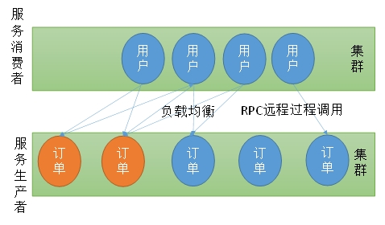
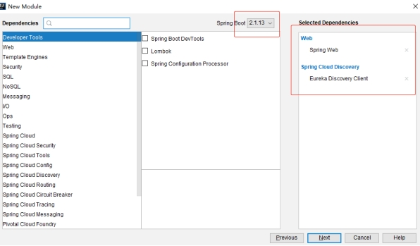
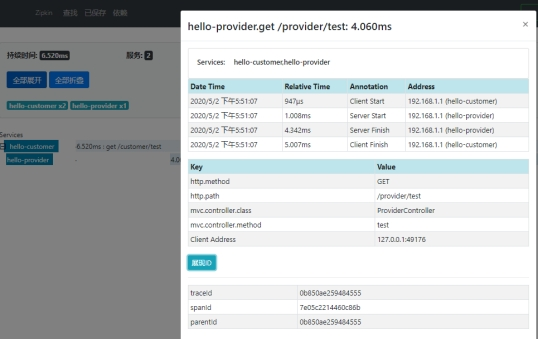

# SpringCloud介绍

## 微服务理论

- the microservice architectural style 【架构风格】[1] is an approach to developing a single application as a suite of small services【独立应用变成一套小服务】, each running in its own process and communicating with lightweight(轻量级沟通) mechanisms(每一个都运行在自己的进程内（容器）), often an HTTP resource API(用HTTP，将功能写成能接受请求). These services are built around business capabilities （独立业务能力）and independently deployable by fully automated deployment machinery（应该自动化独立部署）. There is a bare minimum of centralized management of these services（应该有一个能管理这些服务的中心）, which may be written in different programming languages (独立开发语言)and use different data storage technologies（独立的数据存储）.

<https://www.martinfowler.com/articles/microservices.html> 

<http://blog.cuicc.com/blog/2015/07/22/microservices/>

## 分布式概念

- 《分布式系统原理与范型》定义：“分布式系统是若干独立计算机的集合，这些计算机对于用户来说就像单个相关系统”。
- 分布式系统（distributed system）是建立在网络之上的软件系统。

## 软件架构演变


**单一应用架构**

- 当网站流量很小时，只需一个应用，将所有功能都部署在一起，以减少部署节点和成本。此时，用于简化增删改查工作量的**数据访问框架(ORM)是关键**。


**垂直应用架构**

- 当访问量逐渐增大，单一应用增加机器带来的加速度越来越小，将应用拆成互不相干的几个应用，以提升效率。此时，用于加速前端页面开发的**Web框架(MVC)是关键**。


**分布式服务架构**

- 当垂直应用越来越多，应用之间交互不可避免，将核心业务抽取出来，作为独立的服务，逐渐形成稳定的服务中心，使前端应用能更快速的响应多变的市场需求。此时，用于提高业务复用及整合的**分布式服务框架(RPC)是关键**。


**流动计算架构**

- 当服务越来越多，容量的评估，小服务资源的浪费等问题逐渐显现，此时需增加**一个调度中心**基于访问压力实时管理集群容量，提高集群利用率。此时，用于提高机器利用率的**资源调度和治理中心(SOA)是关键**。


注：RPC【Remote Procedure Call】是指远程过程调用，是一种进程间通信方式，他是一种技术的思想，而不是规范。它允许程序调用另一个地址空间（通常是共享网络的另一台机器上）的过程或函数，而不用程序员显式编码这个远程调用的细节。即程序员无论是调用本地的还是远程的函数，本质上编写的调用代码基本相同。

服务之间常见的交互方式有两种：

1、RPC(Netty[socket]+自定义序列化)

2、RestAPI(HTTP+JSON)

## 分布式相关概念

**高并发**

1) 通过设计保证系统可以并行处理很多请求。应对大量流量与请求

- Tomcat最多支持并发多少用户？

  Tomcat 默认配置的最大请求数是 150，也就是说同时支持 150 个并发，如果到达500并发已经到达性能会非常低 ，当并发到250以上的时候，应考虑应用服务器的集群。并发能力受硬件的配置限制，CPU 越多性能越高，分配给 JVM 的内存越多性能也就越高，但也会加重 GC 的负担。

- 操作系统对于进程中的线程数有一定的限制：

  Windows 每个进程中的线程数不允许超过 2000

  Linux 每个进程中的线程数不允许超过 1000

  另外，在 Java 中每开启一个线程需要耗用 1MB 的 JVM 内存空间用于作为线程栈之用。

  Tomcat 默认的 HTTP 实现是采用阻塞式的 Socket 通信，每个请求都需要创建一个线程处理。这种模式下的并发量受到线程数的限制，但对于 Tomcat 来说几乎没有 BUG 存在了。

  Tomcat 还可以配置 NIO 方式的 Socket 通信，在性能上高于阻塞式的，每个请求也不需要创建一个线程进行处理，并发能力比前者高。但没有阻塞式的成熟。

  这个并发能力还与应用的逻辑密切相关，如果逻辑很复杂需要大量的计算，那并发能力势必会下降。如果每个请求都含有很多的数据库操作，那么对于数据库的性能也是非常高的。

  对于单台数据库服务器来说，允许客户端的连接数量是有限制的。

  并发能力问题涉及整个系统架构和业务逻辑。

  系统环境不同，Tomcat版本不同、JDK版本不同、以及修改的设定参数不同。并发量的差异还是满大的。

  maxThreads="1000" 最大并发数 

  minSpareThreads="100"//初始化时创建的线程数

​	maxSpareThreads="500"//一旦创建的线程超过这个值，Tomcat就会关闭不再需要的socket线程。

​	acceptCount="700"// 指定当所有可以使用的处理请求的线程数都被使用时，可以放到处理队列中的请求数，超过这个数的请求将不予处理

**高并发衡量指标**

- 响应时间(RT) 
  - 请求做出响应的时间，即一个http请求返回所用的时间

- 吞吐量
  - 系统在单位时间内处理请求的数量

- QPS(Query/Request Per Second)、 TPS（Transaction Per Second） 

  - 每秒查询（请求）数、每秒事务数
- 专业的测试工具

  - Apache ab
  - Apache JMeter
- 并发用户数

- 承载的正常使用系统功能的用户的数量

**高可用**

服务集群部署

数据库主从+双机热备

- 主-备方式（Active-Standby方式）

  主-备方式即指的是一台服务器处于某种业务的激活状态（即Active状态），另一台服务器处于该业务的备用状态（即Standby状态)。

- 双主机方式（Active-Active方式）

  双主机方式即指两种不同业务分别在两台服务器上互为主备状态（即Active-Standby和Standby-Active状态）

**注册中心**

保存某个服务所在地址等信息，方便调用者实时获取其他服务信息

- 服务注册
  - 服务提供者

- 服务发现
  - 服务消费者

**负载均衡**

- 动态将请求派发给比较闲的服务器

1) 策略：

2) 轮询(Round Robin)

3) 加权轮询(Weighted Round Robin)

4) 随机Random

5) 哈希Hash

6) 最小连接数LC

7) 最短响应时间LRT



**服务雪崩**

服务之间复杂调用，一个服务不可用，导致整个系统受影响不可用


**熔断**

某个服务频繁超时，直接将其短路，快速返回mock（模拟/虚拟）值


**限流**

限制某个服务每秒的调用本服务的频率


**API网关**

API网关要做很多工作，它作为一个系统的后端总入口，承载着所有服务的组合路由转换等工作，除此之外，我们一般也会把安全，限流，缓存，日志，监控，重试，熔断等放到 API 网关来做

**服务跟踪**

追踪服务的调用链,记录整个系统执行请求过程。如：请求响应时间，判断链中的哪些服务属于慢服务（可能存在问题，需要改善）。

**弹性云**

Elastic Compute Service（ECS）弹性计算服务

动态扩容，压榨服务器闲时能力

例如：双11,618，高峰时多配置些服务器，平时减少多余的服务器配置（用于其他服务应用），避免资源浪费


Spring Cloud是一系列框架的有序集合。它利用Spring Boot的开发便利性巧妙地简化了分布式系统基础设施的开发，如服务发现注册、配置中心、消息总线、负载均衡、断路器、数据监控等，都可以用Spring Boot的开发风格做到一键启动和部署。Spring并没有重复制造轮子，它只是将目前各家公司开发的比较成熟、经得起实际考验的服务框架组合起来，通过Spring Boot风格进行再封装屏蔽掉了复杂的配置和实现原理，最终给开发者留出了一套简单易懂、易部署和易维护的分布式系统**开发工具包**。

“微服务架构”在这几年非常的火热，以至于关于微服务架构相关的开源产品被反复的提及（比如：netflix、dubbo），Spring Cloud也因Spring社区的强大知名度和影响力也被广大架构师与开发者备受关注。

那么什么是“微服务架构”呢？简单的说，微服务架构就是将一个完整的应用从数据存储开始垂直拆分成多个不同的服务，每个服务都能独立部署、独立维护、独立扩展，服务与服务间通过诸如RESTful API的方式互相调用。

分布式架构主要涉及三个角色：

- 服务提供者

- 服务消费者

- 注册中心

各个微服务在启动时，将自己的网络地址等信息注册到注册中心，注册中心存储这些数据。

服务消费者从注册中心查询服务提供者的地址，并通过该地址调用服务提供者的接口。

各个微服务与注册中心使用一定机制（例如心跳）通信。如果注册中心与某微服务长时间无法通信，就会注销该实例。

微服务网络地址发送变化（例如实例增加或IP变动等）时，会重新注册到注册中心。这样，服务消费者就无需人工修改提供者的网络地址了。

## 为什么使用Spring Cloud？

- Spring Cloud对于中小型互联网公司来说是一种福音，因为这类公司往往没有实力或者没有足够的资金投入去开发自己的分布式系统基础设施，使用Spring Cloud一站式解决方案能在从容应对业务发展的同时大大减少开发成本。同时，随着近几年微服务架构和Docker容器概念的火爆，也会让Spring Cloud在未来越来越“云”化的软件开发风格中立有一席之地，尤其是在目前五花八门的分布式解决方案中提供了标准化的、全站式的技术方案，意义可能会堪比当前Servlet规范的诞生，有效推进服务端软件系统技术水平的进步。

## Spring Cloud相关模块

Spring Cloud Netflix项目是Spring Cloud的子项目之一，主要内容是对Netflix公司一系列开源产品的包装，它为Spring Boot应用提供了自配置的Netflix OSS整合。通过一些简单的注解，开发者就可以快速的在应用中配置一下常用模块并构建庞大的分布式系统。它主要提供的模块包括：服务发现（Eureka），断路器（Hystrix），智能路由（Zuul），客户端负载均衡（Ribbon）等。

## Spring Cloud版本

- Cloud命名规则

Spring Cloud采用了英国伦敦地铁站的名称来命名，并由地铁站名称字母A-Z依次类推的形式来发布迭代版本。

Spring Cloud 是一个由许多子项目组成的综合项目，各子项目有不同的发布节奏。为了管理SpringCloud与各子项目的版本依赖关系，发布了一个清单，其中包括了某个SpringCloud版本对应的子项目版本。为了避免SpringCloud版本号与子项目版本号混淆，SpringCloud版本采用了名称而非版本号的命名，这些版本的名字采用了伦敦地铁站的名字，根据字母表的顺序来应对版本时间顺序。例如Angel是第一个版本，Brixton是第二个版本。当SpringCloud的发布内容积累到临界点或者一个重大BUG被解决后，会发布一个"service releases"版本，简称SRX版本，比如Greenwich.SR2就是SpringCloud发布的Greenwich版本的第二个SRX版本。


## 官网

<http://spring.io/projects>

[https://projects.spring.io/spring-cloud/#quick-start](#quick-start)

<https://springcloud.cc/>

# SpringCloud-HelloWorld架构图

## 案例图解

需求：电影查询系统

用户访问用户服务可以查询用户信息或者查询用户信息+电影信息

​		电影服务可以查询电影信息


## 注册中心

常见的注册中心：

\1. Eureka（原生，2.0遇到性能瓶颈，停止维护）

\2. Zookeeper（支持，专业的独立产品。例如：dubbo）

\3. Consul（原生，GO语言开发，已经不授权中国地区使用）

\4. Nacos (阿里研发，国内近年最流行)


配置Region和Zone


Region和Zone就相当于大区和机房，一个Region（大区）可以有很多的Zone（机房）。在Spring Cloud中，服务消费者会优先查找在同一个Zone的服务，之后在去查找其他的服务。如果该项配置使用的好，那么项目请求的响应时间将大大缩短！

# SpringCloud-HelloWorld案例开发-注册中心

**注册中心**

（Eureka , jar工程）cloud-eureka-registry-center

**引入eureka-server**


**编写application.yml**

```yaml
spring:
  application:
    name: cloud-eureka-registry-center
server:
  port: 8761
eureka:
  instance:
    hostname: localhost
  client:
    register-with-eureka: false #自己就是注册中心，不用注册自己
    fetch-registry: false #要不要去注册中心获取其他服务的地址
    service-url:
      defaultZone: http://${eureka.instance.hostname}:${server.port}/eureka/
```

**开启Eureka注册中心功能；**

在主程序类名上添加注解：  @EnableEurekaServer

**测试**

启动项目，访问http://localhost:8761

# SpringCloud-HelloWorld案例开发-电影服务

**电影服务**

（提供查询电影功能）cloud-provider-movie

**引入eureka-Discovery、web模块**



```xml
<dependency>
    <groupId>org.springframework.boot</groupId>
    <artifactId>spring-boot-starter-web</artifactId>
</dependency>
<dependency>
    <groupId>org.springframework.cloud</groupId>
    <artifactId>spring-cloud-starter-netflix-eureka-client</artifactId>
</dependency>
```

**创建Movie实体类,增加id,movieName属性**

```java
public class Movie {
    private Integer id;
    private String movieName;
    public Integer getId() {
        return id;
    }
    public void setId(Integer id) {
        this.id = id;
    }
    public String getMovieName() {
        return movieName;
    }
    public void setMovieName(String movieName) {
        this.movieName = movieName;
    }
}
```

**创建MovieDao** 

```java
@Repository
public class MovieDao {
    public Movie getNewMovie(){
        Movie movie = new Movie();
        movie.setId(1);
        movie.setMovieName("战狼");
        return movie;
    }
}
```

**创建MovieService**

```java
@Service
public class MovieService {
    @Autowired
    MovieDao movieDao;
    public Movie getNewMovie(){
        return movieDao.getNewMovie();
    }
}
```

**创建MovieController**

```java
@RestController
public class MovieController {
    @Autowired
    MovieService movieService;
    /**
     * 获取最新电影
     */
    @GetMapping("/movie")
    public Movie getNewMovie(){
        return movieService.getNewMovie();
    }
}
```

**编写application.yml**

```yaml
spring:
  application:
    name: cloud-provider-movie
server:
  port: 8000
# 指定注册到哪个注册中心
eureka:
  client:
    service-url:
      defaultZone: http://localhost:8761/eureka/
  instance:
    prefer-ip-address: true #注册时使用ip的方式
```

**将自己自动注册到注册中心**

在主程序类名上添加注解：@EnableDiscoveryClient

**启动注册中心和服务**

查看注册中心，访问服务 <http://localhost:8000>

# SpringCloud-HelloWorld案例开发-用户服务

**用户服务**

（jar工程，提供查询用户，查询电影票功能）cloud-consumer-user

**引入eureka-Discovery、web模块**

创建User实体类,增加id,userName属性

```java
public class User {
    private Integer id;
    private String userName;

    public Integer getId() {
        return id;
    }
    public void setId(Integer id) {
        this.id = id;
    }
    public String getUserName() {
        return userName;
    }
    public void setUserName(String userName) {
        this.userName = userName;
    }
}
```

**创建UserDao** 

```java
@Repository
public class UserDao {
    public User getUser(Integer id){
        User user = new User();
        user.setId(id);
        user.setUserName("张三");
        return user;
    }
}
```

**创建UserService**

```java
@Service
public class UserService {
    @Autowired
    UserDao userDao;
    public User getUserById(Integer id){
        User user = userDao.getUser(id);
        return user;
    }
    /**
     * 根据用户id查询用户和最新的电影票
     */
    public Map<String, Object> getUserAndMovie (Integer id){
        Map<String, Object>  result = new HashMap<>();
        //1、查询用户信息
        User user = getUserById(id);
        //2、查到最新电影票
        result.put("user", user);
        result.put("movie", null);//暂时为null
        return result;
    }
}
```

**创建UserController**

```java
@RestController
public class UserController {
    @Autowired
    UserService userService;
    @GetMapping("/user")
    public User getUser(@RequestParam("id")Integer id){
        User user = userService.getUserById(id);
        return user;
    }
    @GetMapping("/getMovie")
    public Map<String, Object> buyMovie(@RequestParam("id")Integer userid){
        Map<String, Object> map = userService.getUserAndMovie(userid);
        return map;
    }
}
```

**编写application.yml**

```java
spring:
  application:
    name: cloud-consumer-user
server:
  port: 9000
eureka:
  client:
    service-url:
      defaultZone: http://localhost:8761/eureka/
  instance:
    prefer-ip-address: true #注册中心保存我的ip
```

将自己自动注册到注册中心@EnableDiscoveryClient

启动注册中心和服务，查看注册中心，访问服务

<http://localhost:9000/user?id=1> 

<http://localhost:9000/buyMovie?id=1>

# SpringCloud-HelloWorld案例开发-Ribbon-RestTemplate-负载均衡

Ribbon负载均衡，可以用于远程调用（用户服务 调用  电影服务 项目）

Spring Cloud Ribbon是基于Netflix Ribbon实现的一套客户端负载均衡的工具。简单的说，Ribbon是Netflix发布的开源项目，主要功能是提供客户端的软件负载均衡算法和服务调用。Ribbon客户端组件提供一系列完善的配置项，如：连接超时，重试等。简单的说，就是在配置文件中列出Load Balancer(简称LB)后面所有的机器，Ribbon会自动的帮助你基于某种规则（如简单轮询，随机连接等）去连接这些机器。我们很容易使用Ribbon实现自定义的负载均衡算法。

 如何使用Ribbon

1）、引入Ribbon的Starter

2）、配置使用Ribbon功能；底层使用 RestTemplate 的工具来给远程发送请求

**用户服务项目中引入Ribbon**

```xml
<!-- 引入ribbon实现远程调用和负载均衡功能 -->
<dependency>
    <groupId>org.springframework.cloud</groupId>
    <artifactId>spring-cloud-starter-netflix-ribbon</artifactId>
</dependency>
```

**RestTemplate**

给容器中注入一个RestTemplate并使用Ribbon进行负载均衡调用

```java
@LoadBalanced   //负载均衡
@Bean
public RestTemplate restTemplate(){
	return new RestTemplate();
}
```

**使用RestTemplate远程调用（UserService中完善代码）**

拷贝电影服务中的Movie到用户服务中

```java
@Autowired
RestTemplate restTemplate;
/**
 * 购买最新的电影票
 * 传入用户id
 */
public Map<String, Object> buyMovie(Integer id){
Map<String, Object>  result = new HashMap<>();
//1、查询用户信息
User user = getUserById(id);
//2、查到最新电影票  restTemplate使用java代码来模拟发请求
Movie movie = restTemplate.getForObject("http://CLOUD-PROVIDER-MOVIE/movie", Movie.class);
result.put("user", user);
result.put("movie", movie);
return result;
}
```

启动注册中心和服务，访问服务

<http://localhost:9000/buyMovie?id=1>  显示用户和电影信息

在电影服务（MovieService 类）中打印服务端口，方便监控服务执行情况。

```java
@Value("${server.port}")
private String port;
 
public Movie getNewMovie(){
    System.out.println("当前电影服务的端口："+port);
    return movieDao.getNewMovie();
}
```

电影服务多实例启动，测试负载均衡

 <http://localhost:9000/buyMovie?id=1>

- 多实例启动方式1：打jar包方式运行 
  - java -jar xxx.jar --server.port=8000
  - java -jar xxx.jar --server.port=8001
  - java -jar xxx.jar --server.port=8002

- 多实例启动方式2：IDE工具中方式运行


**Ribbon负载均衡原理**

RoundRobinRule类


# SpringCloud-HelloWorld案例开发-Feign-声明式调用

**Feign声明式调用**

- Feign是一个声明式的web服务客户端，让编写web服务客户端变得非常容易，只需创建一个接口并在接口上添加注解即可

- SpringCloud对Feign进行了封装，使其支持了SpringMVC标准注解和HttpMessageConverters。Feign可以与Eureka和Ribbon组合使用以支持负载均衡。

- Openfeign是在Feign的基础上支持了SpringMVC注解(例如@RequestMapping等)，通过动态代理的方式实现负载均衡调用其他服务。

创建新User项目cloud-consumer-user-feign，引入eureka-Discovery、web、Feign模块

```xml
<dependency>
    <groupId>org.springframework.cloud</groupId>
    <artifactId>spring-cloud-starter-openfeign</artifactId>
</dependency>
```

服务发现

```java
/**
 * 1、引入feign的starter
 * 2、写一个接口，和被调用的服务关联起来
 * 3、开启Feign功能;@EnableFeignClients
 */
@EnableFeignClients
@EnableDiscoveryClient 
@SpringBootApplication
public class CloudConsumerUserFeignApplication {
    public static void main(String[] args) {
    	SpringApplication.run(CloudConsumerUserFeignApplication.class, args);
    }
}
```

编写application.yml

```yaml
spring:
  application:
    name: cloud-consumer-user-feign
   
server:
  port: 7000
  
eureka:
  client:
    service-url:
      defaultZone: http://localhost:8761/eureka/
```

复制用户服务项目的代码：实体类，Dao，Service，Controller

将RestTemplate方式改成Feign方式进行远程调用

```java
/**
 * 调用指定服务名称 “CLOUD-PROVIDER-MOVIE” 的 @GetMapping("/movie") 映射方法
 * 这个方法声明与电影服务端Controller映射的方法声明一致即可。
 */
@FeignClient(value="CLOUD-PROVIDER-MOVIE") //与被调用端的服务名称一致
public interface MovieServiceFeign { 
    @GetMapping("/movie")
    public Movie getNewMovie(); //与被调用服务端的映射方法一致 
}
```

修改UserService 代码

```java
@Service
public class UserService {

    @Autowired
    UserDao userDao;
 
    //面向接口编程
    @Autowired
    MovieServiceFeign movieServiceFeign; //调用Feign接口；其实就是调用远程服务
 
	/**
	 * 购买最新的电影票
	 * 传入用户id
   */
	public Map<String, Object> buyMovie(Integer id){
    Map<String, Object>  result = new HashMap<>();
    //1、查询用户信息
    User userById = getUserById(id);
    //2、查到最新电影票  Feign方式发起远程调用
    Movie movie = movieServiceFeign.getNewMovie();
    result.put("user", userById);
    result.put("movie", movie);
    return result;
	}
}
```

**开启Feign功能@EnableFeignClients**

测试调用与负载均衡效果

<http://localhost:7000/buyMovie?id=1> 

**OpenFeign日志打印功能**

- Feign提供了日志打印功能，我们可以通过配置来调整日志级别，从而了解Feign中Http请求的细节。

1、在配置类中配置Feign的Logger.Level

```java
@Bean
public Logger.Level feignLoggerLevel(){
    //NONE：默认不显示日志
    //BASIC: 仅显示请求方法、RUL、响应状态码及执行时间
    // HEADERS：除了BASIC中定义的信息之外，还包括请求和响应的头信息
    // FULL: 除了HEADERS中定义的信息之外，还有请求和响应的正文及元数据
    return Logger.Level.FULL;
}
```

2、在yml中设置feign客户端的日志级别

```yaml
logging:
  level:
    com:
      atguigu:
        springcloud:
          hello:
            customer:
              service:
                ProviderFeignClient: debug
```

效果：


# SpringCloud-HelloWorld案例开发-Ribbon+Hystrix组合

**Hystrix短路器**

Hystrix是一个用于处理分布式系统的延迟和容错的开源库，在分布式系统里，许多依赖不可避免的会调用失败，比如超时、异常等，

Hystrix能够保证在一个依赖出问题的情况下，不会导致整体服务失败，避免级联故障，以提高分布式系统的弹性。

“断路器”本身是一种开关装置，当某个服务单元发生故障之后，通过断路器的故障监控（类似熔断保险丝），向调用方返回一个符合预期的、可处理的备选响应（Fallback），而不是长时间的等待或者抛出调用方无法处理的异常，这样就保证了服务调用方的线程不会被长时间、不必要地占用，从而避免了故障在分布式系统中的蔓延，乃至雪崩。

目前情况：如果集群的三个电影服务都挂了，会怎样？

| 服务刚刚都挂掉                                               | 服务挂掉有一会了                                             |      |
| ------------------------------------------------------------ | ------------------------------------------------------------ | ---- |
|  |  |      |
| 解决：                                                       | 返回默认数据，会提示错误消息                                 |      |

**Hystrix重要概念**

服务降级Fallback

- 服务器忙，请稍候再试，不让客户端等待并立刻返回一个友好提示

- 哪些情况会触发降级
  - 程序运行异常
  - 超时自动降级
  - 服务熔断触发服务降级
  - 线程池/信号量打满也会导致服务降级
  - 人工降级

**服务熔断Breaker**

- 类比保险丝达到最大服务访问后，直接拒绝访问，拉闸限电，然后调用服务降级的方法并返回友好提示

- 就是保险丝
  - 服务的降级->进而熔断->恢复调用链路

**服务限流Flowlimit**

秒杀高并发等操作，严禁一窝蜂的过来拥挤，大家排队，一秒钟N个，有序进行

使用Ribbon+Hystrix组合：cloud-consumer-user

引入Hystrix

```xml
<!--  引入hystrix进行服务熔断 -->
<dependency>
    <groupId>org.springframework.cloud</groupId>
    <artifactId>spring-cloud-starter-netflix-hystrix</artifactId>
</dependency>
```

开启断路保护功能@EnableCircuitBreaker

通过@HystrixCommand(fallbackMethod="xxx")来指定出错时调用xx方法

```java
/**
 * 购买最新的电影票
 * 传入用户id
 */
@HystrixCommand(fallbackMethod="hystrix")
public Map<String, Object> buyMovie(Integer id){
    Map<String, Object>  result = new HashMap<>();
    //1、查询用户信息
    User userById = getUserById(id);
    //2、查到最新电影票  restTemplate使用java代码来模拟发请求
    Movie movie = restTemplate.getForObject("http://CLOUD-PROVIDER-MOVIE/movie", Movie.class);

    result.put("user", userById);
    result.put("movie", movie);
    return result;
}
```

在本类编写xxx方法，方法的参数和原来一样即可

```java
public Map<String, Object> hystrix(Integer id){
    User user = new User();
    user.setId(-1);
    user.setUserName("未知用户");
    Movie movie = new Movie();
    movie.setId(-100);
    movie.setMovieName("无此电影");
    Map<String, Object>  result = new HashMap<>();
    result.put("user", user);
    result.put("movie", movie);
    return result;
}
```

测试正常调用&停止user服务，测试异常调用&启动user服务过一段时间测试是否正常

 <http://localhost:9000/buyMovie?id=1>


**熔断器原理**


我们悄悄的启动一个服务，刷刷浏览器会怎样?让子弹飞一分钟再看结果

使用Feign+Hystrix组合：cloud-consumer-user-feign

引入Hystrix

```xml
<!--  引入hystrix进行服务熔断 -->
<dependency>
    <groupId>org.springframework.cloud</groupId>
    <artifactId>spring-cloud-starter-netflix-hystrix</artifactId>
</dependency>
```

开启断路保护功能@EnableCircuitBreaker

开启Feign对Hystrix支持

```yaml
feign:
  hystrix:
    enabled: true #默认false
```

Feign已经集成了Hystrix，使用起来非常简单@FeignClient(name="provider-user",fallback="异常处理类")

```java
 /*使用Hystrix进行服务的熔断
 * 1）、引入Hystrix的starter
 * 2）、开启xxx功能 ：@EnableCircuitBreaker
 * 3）、@FeignClient(value="CLOUD-PROVIDER-MOVIE",fallback=指定这个接口的异常处理类（异常处理类必须实现这个接口）)
 */
@FeignClient(value="CLOUD-PROVIDER-MOVIE",fallback=MovieFeignExceptionHandlerService.class)
public interface MovieServiceFeign {
//  未来这个接口就会调用很多方法，定制每一个方法远程出错如何返回兜底mock数据；
@GetMapping("/movie")
public Movie getNewMovie();
}
```

fallback="异常处理类"指定的异常处理类实现这个类的接口即可，并且放在容器中

```java
package com.atguigu.feign.exception;	
import org.springframework.stereotype.Component;
import com.atguigu.bean.Movie;
import com.atguigu.feign.MovieServiceFeign;
@Component
public class MovieFeignExceptionHandlerService implements MovieServiceFeign{
/**
 * 远程这个方法调用出问题就会调用此方法
 */
@Override
public Movie getNewMovie() {
Movie movie = new Movie();
movie.setId(-100);
movie.setMovieName("无此电影呀...");
return movie;
}
}
```

测试正常调用&停止电影服务，测试异常调用&启动user服务过一段时间测试是否正常

<http://localhost:7000/buyMovie?id=1>


# SpringCloud-HelloWorld案例开发-Hystrix Dashboard

除了隔离依赖服务的调用以外，Hystrix还提供了近实时的监控，Hystrix会实时、累加地记录所有关于HystrixCommand的执行信息，包括每秒执行多少请求，多少成功，多少失败等。Netflix通过hystrix-metrics-event-stream项目实现了对以上指标的监控

引入actuator（cloud-consumer-user-feign）

```xml
<dependency>
        <groupId>org.springframework.boot</groupId>
        <artifactId>spring-boot-starter-actuator</artifactId>
</dependency>
```

actuator是用来监控SpringBoot服务的，注意路径问题，具体的版本可能不一样，参考启动日志


可提供的监控服务为


 **修改配置文件，暴露数据监控流**

```yaml
management:
  endpoints:
    web:
      exposure:
        include: hystrix.stream # 访问/actuator/hystrix.stream能看到不断更新的监控流
```

访问/actuator/hystrix.stream 可以看到打印

**引入HystrixDashboard**

@EnableHystrixDashboard

@EnableHystrix

访问当前项目/hystrix，将Hystrix的stream地址输入(http://localhost:7000/actuator/hystrix.stream )，点击monitor按钮即可监控


监控中，服务器正常


监控中，服务器重新启动，断路器打开


# Gateway网关

**简介**

不同的微服务一般有不同的网络地址，而外部的客户端可能需要调用多个服务的接口才能完成一个业务需求。比如一个电影购票的手机APP，可能会调用电影分类微服务，用户微服务，支付微服务等。如果客户端直接和微服务进行通信，会存在以下问题：

Ø 客户端会多次请求不同微服务，增加客户端的复杂性

Ø 存在跨域请求，在一定场景下处理相对复杂

Ø 认证复杂，每一个服务都需要独立认证

Ø 难以重构，随着项目的迭代，可能需要重新划分微服务，如果客户端直接和微服务通信，那么重构会难以实施

Ø 某些微服务可能使用了其他协议，直接访问有一定困难

网关包含了对请求的路由和过滤两个最主要的功能：

其中路由功能负责将外部请求转发到具体的微服务实例上，是实现外部访问统一入口的基础而过滤器功能则负责对请求的处理过程进行干预，是实现请求校验、服务聚合等功能的基础，以后的访问微服务都是通过网关跳转后获得。

总体来说，网关提供了代理、路由、断言和过滤的功能。

springCloud  1.x版本中都是采用的Zuul网关，2.x版本中，SpringCloud自己研发了一个网关代替Zuul,那就是SpringCloud Geteway


微服务架构图：


**Gateway工作流程**


客户端向Spring Cloud Gateway发出请求。然后在Gateway Handler Mapping中找到与请求匹配的路由，将其发送到Gateway Web Handler.

Handler再通过指定的过滤器链来将请求发送给我们实际的服务执行业务逻辑，然后返回。

过滤器之间用虚线分开是因为过滤器可能会在发送代理请求之前（"pre"）或之后("post")执行业务逻辑。

Filter在**"pre"类型**的过滤器可以做参数校验、权限校验、流量监控、日志输出、协议转换等，在**"post"类型**的过滤器中可以做响应内容、响应头的修改，日志的输出，流量控制等有着非常重要的作用。

官网：

<https://cloud.spring.io/spring-cloud-static/spring-cloud-gateway/2.2.1.RELEASE/reference/html/#gateway-how-it-works>

**使用Gateway**

创建Gateway工程

Springcloud项目：cloud-gateway ,引入gateway、eureka client模块
引入后依赖如下：

创建并配置application.yml文件：

```java
server:
  port: 9527
eureka:
  instance:
    hostname: hello-cloud-gateway
  client:
    service-url:
      register-with-eureka: true
      fetch-registry: true
      defaultZone: http://localhost:8761/eureka
```

 yml配置方式-通过路径匹配路由

Yml路由配置

```yaml
spring:
  cloud:
    gateway:
      routes:
        - id: hello-customer #路由的ID，没有固定规则但要求唯一，建议配合服务名
          uri: http://localhost:8000   #匹配后提供服务的路由地址
          predicates:
            - Path=/customer/*   #断言,路径相匹配的进行路由
        - id: hello-provider
          uri: http://localhost:9000
          predicates:
            - Path=/provider/*   #断言,路径相匹配的进行路由
```

访问测试

<http://localhost:9527/customer/test>

<http://localhost:8000/customer/test>

<http://localhost:9527/provider/test>

<http://localhost:9000/provider/test>

 yml配置方式-通过服务名匹配路由

Yml路由配置

```yaml
spring:
  cloud:
    gateway:
      discovery:
        locator:
          enabled: true # 启用从注册中心拉取服务列表动态路由功能
      routes:
        - id: hello-customer #路由的ID，没有固定规则但要求唯一，建议配合服务名
          uri: lb://hello-customer   #匹配后提供服务的路由地址
          predicates:
            - Path=/customer/*,/user/*   #断言,路径相匹配的进行路由
        - id: hello-provider
          uri: lb://hello-provider
          predicates:
            - Path=/provider/*   #断言,路径相匹配的进行路由
```

访问测试

<http://localhost:9527/customer/test>

<http://localhost:8000/customer/test>

<http://localhost:9527/provider/test>

<http://localhost:9000/provider/test>

配置类配置方式

编写配置类

```java
@Configuration
public class GatewayConfig {
    @Bean
    public RouteLocator getRouteLocator(RouteLocatorBuilder routeLocatorBuilder){
        RouteLocatorBuilder.Builder routes = routeLocatorBuilder.routes();
        routes.route("atguigu", new Function<PredicateSpec, Route.AsyncBuilder>() {
            @Override
            public Route.AsyncBuilder apply(PredicateSpec predicateSpec) {
                Route.AsyncBuilder builder =predicateSpec.path("/baidu/**").uri("http://news.baidu.com");
                return builder;
            }
        });
        //routes.route("", r->r.path("/guonei").uri("http://news.baidu.com/guonei")).build();
        return routes.build();
    }
}
```

访问测试

<http://localhost:9527/baidu> 

**路由断言Predicate**

简介

Spring Cloud Gateway 通过Predicate来匹配来自用户的请求

Spring Cloud Gateway 使用spring webflux的Handler Mapping为基础结构实现路由功能。

Spring Cloud Gateway创建Route对象时，使用RoutePredicateFactory创建Predicate对象。

Spring Cloud Gateway包含许多内置的路由断言Factories。这些断言都匹配HTTP请求的不同属性。多个路由断言Factories可以通过 and 组合使用

查看网关项目启动日志可以看到断言工厂加载过程：


**常用的RoutePredicate配置**

```yaml
spring:
  cloud:
    gateway:
      discovery:
        locator:
          enabled: true # 启用从注册中心拉取服务列表动态路由功能
      routes:
        - id: hello-customer #路由的ID，没有固定规则但要求唯一，建议配合服务名
          uri: lb://hello-customer   #匹配后提供服务的路由地址
          predicates:
            - Path=/customer/*,/user/*   #断言,路径相匹配的进行路由
            - After=2020-05-01T08:00:00.0+08:00 # 断言，在此时间后请求才会被匹配
            - Before=2020-05-01T09:08+08:00 # 断言，在此时间前请求才会被匹配
            - Between=2020-05-01T08:00:00.0+08:00,2020-05-02T09:10+08:00 # 断言，在此时间区间内访问的请求才会被匹配
            - Cookie=username,atguigu # 断言，请求头中携带Cookie: username=atguigu才可以匹配
            - Cookie=id,9527
            - Header=X-Request-Id,\d+ # 断言，请求头中要有X-Request-Id属性并且值为整数的正则表达式
            - Method=POST # 断言，请求方式为post方式才会被匹配
            - Query=pwd,[a-z0-9_-]{6} # 断言，请求参数中包含pwd并且值长度为6才会被匹配
```

Cookie、请求头和请求方式相关的使用postman测试


**过滤功能：Filter**

简介

网关包含路由和过滤两大功能，过滤是通过Filter实现。SpringCloud Gateway内置了多种路由过滤器，他们都由GatewayFilter的工厂类来产生。
根据过滤时机不同，分两种类型Filter：一种是”pre”类型，在路由之前过滤请求，可以进行参数校验、权限校验、流量监控、日志输出、协议转换等。另一种是”post”类型，在返回响应之后过滤请求，可以进行响应内容、响应头的修改，日志的输出，流量监控等。
根据作用范围不同，也可以分为两种Filter：一种是”GatewayFilter”, 应用到单个路由或者一个分组的路由上。另外一种是”GlobalFilter”, 应用到所有的路由上。

GatewayFilter

Gateway自带了多个GatewayFilter，在yml指定route下配置需要使用的GatewayFilter工厂类类名即可使用：


案例：在网关项目的yml文件中配置filter

```yaml
routes:
  - id: hello-customer #路由的ID，没有固定规则但要求唯一，建议配合服务名
    uri: lb://hello-customer   #匹配后提供服务的路由地址
    filters:
      - AddResponseHeader=school,atguigu # 在匹配的请求的响应头中添加一对响应头
      - AddRequestParameter=id,10001 # 在匹配请求的请求参数中添加一对请求参数
```

**GlobalFilter**

全局过滤器，通过GatewayFilterAdapter包装成GatewayFilterChain可识别的过滤器，它为请求业务以及路由的URI转换为真实业务服务的请求地址的核心过滤器，不需要配置，系统初始化时加载，作用在每个路由上。


使用GlobalFilter时，一般逻辑较多，可以使用自定义GlobalFilter 来处理，自定义GlobalFilter需要实现GlobalFilter、Ordered 两个接口。

案例：使用自定义GlobalFilter实现token校验功能

```java
@Component
public class MyTokenFilter implements GlobalFilter, Ordered {
    @Override
    public Mono<Void> filter(ServerWebExchange exchange, GatewayFilterChain chain) {
        ServerHttpRequest request = exchange.getRequest();
        //获取请求参数Map
        MultiValueMap<String, String> queryParams = request.getQueryParams();
        //获取请求参数token值
        String token = queryParams.getFirst("token");
        System.out.println("token"+token);
        if (StringUtils.isEmpty(token)) {
            //拦截，响应401未授权
            exchange.getResponse().setStatusCode(HttpStatus.UNAUTHORIZED);
            //拦截结束请求
            return exchange.getResponse().setComplete();
        }
        //放行
        return chain.filter(exchange);
    }
    @Override
    public int getOrder() {
        return 0;
    }
}
```

# SpringCloud Sleuth分布式链路请求跟踪

简介

在分布式系统中，微服务有多个，服务之间调用关系也比较复杂，如果有的微服务网络或者服务器出现问题会导致服务提供失败，如何快速便捷的去定位出现问题的微服务，SpringCloud Sleuth 给我们提供了解决方案，它集成了Zipkin、HTrace 链路追踪工具，用服务链路追踪来快速定位问题。Zipkin使用较多。Zipkin 主要由四部分构成：收集器、数据存储、查询以及 Web 界面。Zipkin 的收集器负责将各系统报告过来的追踪数据进行接收；而数据存储默认使用 Cassandra，也可以替换为 MySQL；查询服务用来向其他服务提供数据查询的能力，而 Web 服务是官方默认提供的一个图形用户界面。

 **Sleuth Zipkin下载启动** 

下载Zipkin-server

<https://dl.bintray.com/openzipkin/maven/io/zipkin/java/zipkin-server/>

zipkin-server-2.12.9-exec.jar

**运行zipkin-server-2.12.9-exec**

java -jar zipkin-server-2.12.9-exec.jar


**访问Zipkin控制台**

Zipkin默认端口号9411

<http://localhost:9411/zipkin/>


由于之前开发的项目没有整合Zipkin，所有Zipkin控制台没有要进行追踪的微服务。

**Zipkin术语**


Span：基本工作单元，例如，在一个新建的span中发送一个RPC等同于发送一个回应请求给RPC，span通过一个64位ID唯一标识，trace以另一个64位ID表示，span还有其他数据信息，比如摘要、时间戳事件、关键值注释(tags)、span的ID、以及进度ID(通常是IP地址)，span在不断的启动和停止，同时记录了时间信息，当你创建了一个span，你必须在未来的某个时刻停止它。 可以简单理解为一次请求到响应的信息

Trace：一系列spans组成的一个树状结构，例如，如果你正在跑一个分布式大数据工程，你可能需要创建一个trace。 

Annotation：用来及时记录一个事件的存在，一些核心annotations用来定义一个请求的开始和结束 :

Client Sent -客户端发起一个请求，这个annotion描述了这个span的开始。Server Received -服务端获得请求并准备开始处理它，如果将其sr减去cs时间戳便可得到网络延迟。

Server Sent -注解表明请求处理的完成(当请求返回客户端)，如果ss减去sr时间戳便可得到服务端需要的处理请求时间

Client Received -表明span的结束，客户端成功接收到服务端的回复，如果cr减去cs时间戳便可得到客户端从服务端获取回复的所有所需时间

**SpringCloud-Helloworld整合Zipkin**

电影服务整合Zipkin

pom文件添加Zipkin依赖

```xml
<!--包含了sleuth+zipkin-->
<dependency>
       <groupId>org.springframework.cloud</groupId>
        <artifactId>spring-cloud-starter-zipkin</artifactId>
</dependency>
```

yml文件配置zipkin

```yaml
spring  
zipkin:
    base-url: http://localhost:9411
  sleuth:
    sampler:
      #采样率值介于0~1之间，1表示全部采样
      probability: 1
```

**用户服务整合Zipkin** 

步骤配置和电影服务整合Zipkin一样

**测试Zipkin**

重启电影服务和用户服务，然后访问用户服务(用户服务远程调用电影服务)

访问：<http://localhost:9411> 查看Zipkin控制台服务链路追踪




