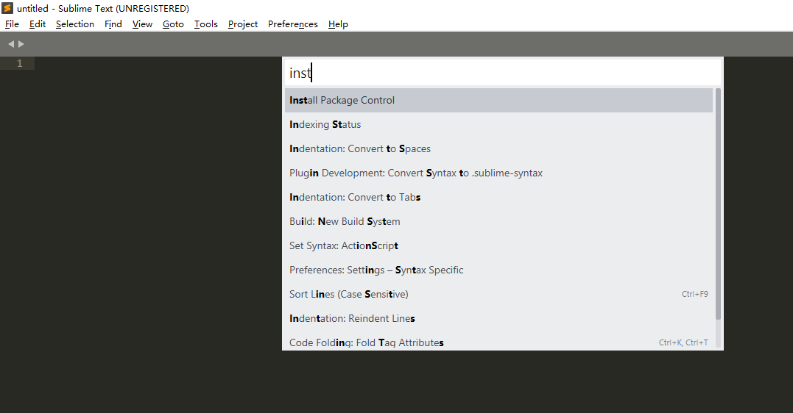
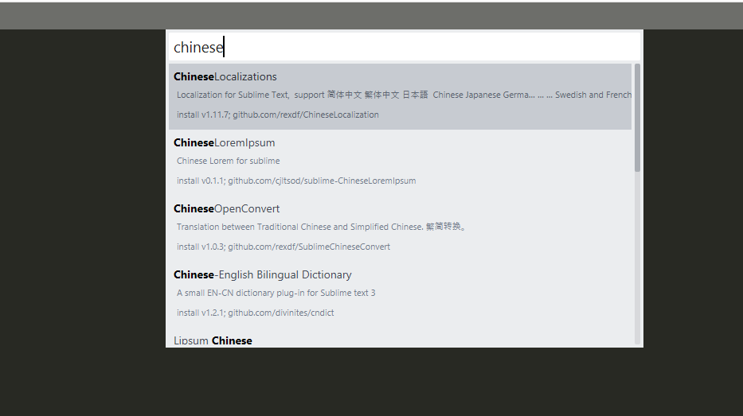
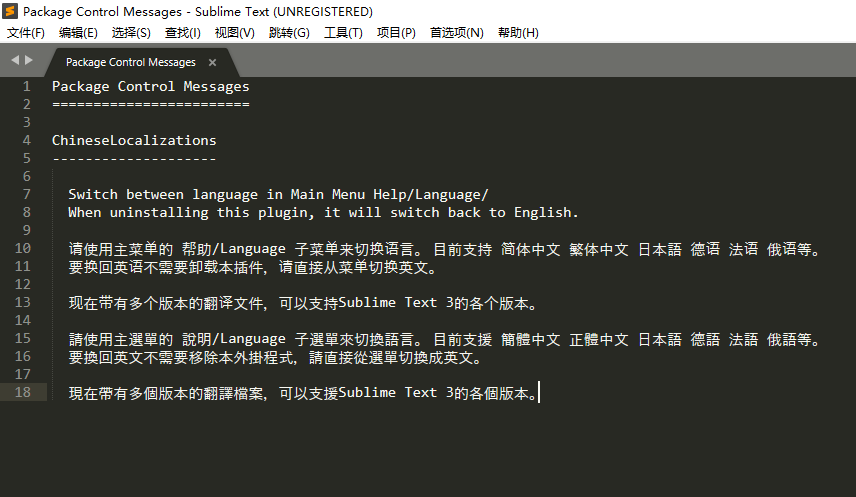
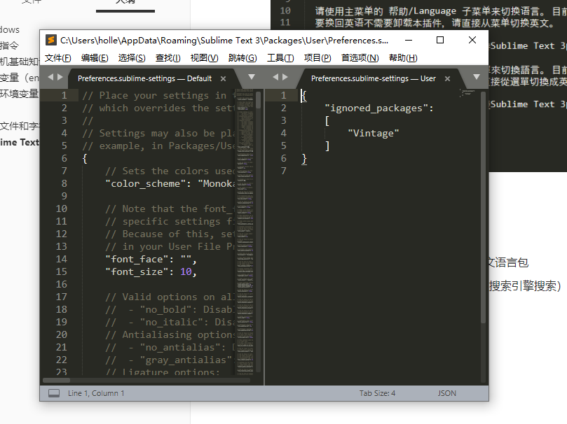
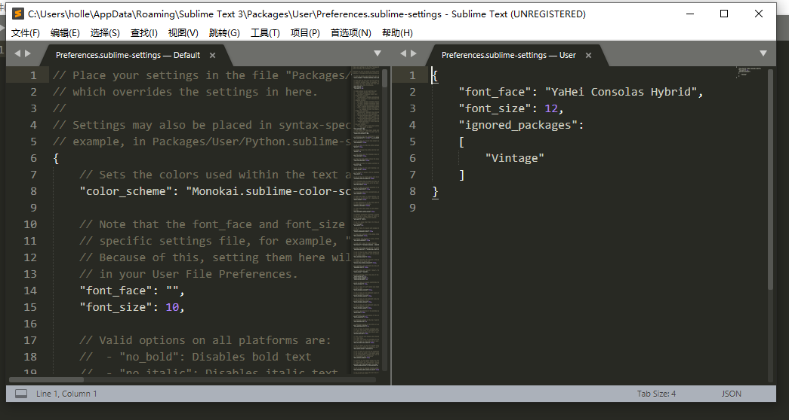

# Windows

# 常用指令

查看本机ip地址：

```
ipconfig
```

查看当前目录下：

```
dir
```
运行exe文件：

```
start  xxx.exe
```

进入指定目录：

```
cd 
. 表示当前目录
..表示上一级目录
```

创建一个目录：

```
md
```

删除一个目录：

```
rd
```

删除一个文件：

```
del
```

清除屏幕：

```
cls
```

小技巧：

- 方向键上下，查看命令的历史记录
- tab键自动补全命令 

# 计算机基础知识 

**计算机的组成**

计算机由两部分组成：硬件 和 软件

- 硬件包含：键盘、鼠标、显示器、CPU、主板、内存、硬盘 等等；硬件是看的见摸得着的。
- 软件包含：系统软件（windows、macOS、Linux）和应用软件（office 、QQ、绝地求生）；软件是看的见摸不着的，软件负责控制计算机中的硬件。

**计算机的使用方式**

- 我们必须要通过软件来对计算机完成各种操作，
  - 但是注意，软件中并不是所有的功能都会对用户开放，
    - 用户需要调用软件提 供的接口（Interface 交互界面）来操作计算机。

- 用户界面分成两种：TUI（文本交互界面）和 GUI（图形化交互界面）

- 命令行就是文本交互界面，通过命令行可以使用一个一个的指令来操作计算机

- 任何的计算机的操作系统中都包含有命令行（windows、linux、macOS）

- 命令行有多个不同的名字：

  ​	命令行、命令行窗口、DOS窗口、命令提示符、CMD窗口、Shell、终端、Terminal

  ​	快捷键：win+R

# 环境变量（environment variable）

- 环境变量指的就是操作系统当中的一些变量。
- 可以通过修改环境变量，来对计算机进行配置（主要是来配置一些路径的）
  1. 查看环境变量
         > 右键 计算机（此电脑），选择属性
         > 系统界面左侧选择 高级系统设置
         > 选择环境变量
         环境变量界面分成了两个部分，上边是用户环境变量，下边是系统环境变量
             建议只修改用户的环境变量，不要修改系统的环境变量

2. 添加环境变量
       > 通过新建按钮添加环境变量
       > 一个环境变量可以由多个值，值与值之间使用;（英文）隔开

3. 修改环境变量
       > 通过编辑按钮来修改环境变量

4. 删除环境变量
       > 通过删除按钮来删除环境变量

# path环境变量

- path环境变量中保存的是一个一个的路径。
- 当我们在命令行中输入一个命令（或访问一个文件时），系统会首先在当前目录下寻找，如果找到了则直接执行或打开；如果没有找到，则会依次去path环境变量的路径中去寻找，直到找到为止；如果path环境变量中的路径都没有找到，则报错—— 'xxx' 不是内部或外部命令，也不是可运行的程序或批处理文件。
- 我们可以将一些经常需要访问到的文件会程序的路径，添加到path环境变量中，这样我们就可以在任意的位置访问到这些文件了。

注意事项：
    1.如果环境变量中没有path，可以手动添加
    2.path环境变量不区分大小写 PATH Path path   
    3.修改完环境变量必须重新启动命令行窗口
    4.多个路径之间使用;隔开

# 进制

```
- 十进制（最常用的进制）
    - 十进制就是满十进一的进制
    - 十进制当中一共有10个数字
        0 1 2 3 4 5 6 7 8 9
    - 十进制如何计数
        0 1 2 3 4 5 6 7 8 9 10 11 12 。。。 19 20 。。。29 30

- 二进制（计算机底层使用的进制）
    - 满二进一
    - 二进制中一共有2个数字
        0 1
    - 二进制如何计数
        0 1 10 11 100 101 110 111 1000
    - 所有的数据在计算机底层都是以二进制的形式保存的，计算机只认二进制
    - 可以将内存想象为一个一个的小格子，小格子中可以存储一个0或一个1
    - 内存中的每一个小格子，我们称为1bit（位）    
        bit是计算机中的最小的单位
        byte是我们最小的可操作的单位
        8bit = 1byte（字节）    
        1024byte = 1kb（千字节） 
        1024kb = 1mb（兆字节）
        1024mb = 1gb（吉字节）
        1024gb = 1tb（太字节）
        。。。
- 八进制（一般不用）
    - 满八进一
    - 八进制中一共有8个数字
        0 1 2 3 4 5 6 7
    - 八进制如何计数
        0 1 2 3 4 5 6 7 10 11 。。。 17 20 。。。27 30

- 十六进制
    - 满十六进一
    - 十六进制中一共有16个数字
        由于十六进制是满16才进位，
            所以十六进制中引入了a b c d e f来表示 10 11 12 13 14 15   
        0 1 2 3 4 5 6 7 8 9 a b c d e f 
    - 十六进制如何计数    
        0 1 2 3 4 5 6 7 8 9 a b c d e f 10 11 12 。。。 1a 1b 1c 1d 1e 1f
        20 21 22 。。。 2a 2b 2c 2d 2e 2f 30    
    - 我们在查看二进制数据时，一般会以十六进制的形式显示
```

# 文本文件和字符集

```
- 文本分成两种，一种叫做纯文本，还有一种叫做富文本
- 纯文本中只能保存单一的文本内容，无法保存内容无关的东西（字体、颜色、图片。。。）
- 富文本中可以保存文本以外的内容（word文档）
- 在开发时，编写程序使用的全都是纯文本！
- 纯文本在计算机底层也会转换为二进制保存，
    将字符转换为二进制码的过程，我们称为编码
    将二进制码转换为字符的过程，我们称为解码
    编码和解码时所采用的规则，我们称为字符集
- 常见的字符集：
    ASCII
        - 美国人编码，使用7位来对美国常用的字符进行编码
        - 包含128个字符
    ISO-8859-1
        - 欧洲的编码，使用8位
        - 包含256个字符
    GB2312
    GBK
        国标码，中国的编码
    Unicode   
        万国码，包含世界上所有的语言和符号，编写程序时一般都会使用Unicode编码
        Unicode编码有多种实现，UTF-8 UTF-16 UTF-32
        最常用的就是UTF-8
- 乱码
    编写程序时，如果发现程序代码出现乱码的情况，就要马上去检查字符集是否正确  
```

# Sublime Text 3

- Sublime Text3是一个纯文本编辑器。
- Package Control（Sublime的包管理器）
  - Sublime Text3中的插件，通过该插件可以向Sublime中安装新的包

## 安装包管理器

- 使用快捷键ctrl+shift+p，在搜素框中输入`install Package Control`回车即可。
- 在`install Package Control`里最常用的就是install package 和remove package。



- 点击Preferences,如果看到Package Control代表安装成功。
- 安装完毕之后，最好关掉软件，重启一下。

## 安装中文语言包

- 点击Package Control，在搜索框中搜索`chineseLocalizations`回车之后，英文变中文即安装成功。





练习：

1. 安装Sublime Text3
2. 在Sublime中安装Package Control
3. 通过Package Control安装Sublime的中文语言包
4. 尝试为你的Sublime安装新的主题（通过搜索引擎搜索）


## 字体大小和字体类型

- 在首选项-》设置里面，可以对默认设置进行修改



如下是配置字体大小和字体类型：



需要注意font_face里所选的字体要求必须在你电脑上安装了的。若没安装，则先去下载安装。


## 主题

ctrl+shift+p，在install package 里面搜索ayu，回车即可下载安装。

安装完以后，在首选项里面选择主题，找到你想要的即可。

## 改变编辑器

首选项里面选择配色方案，然后选择ayu-light即可。