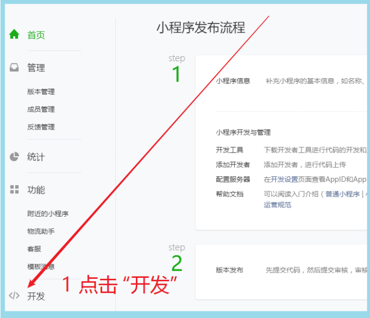
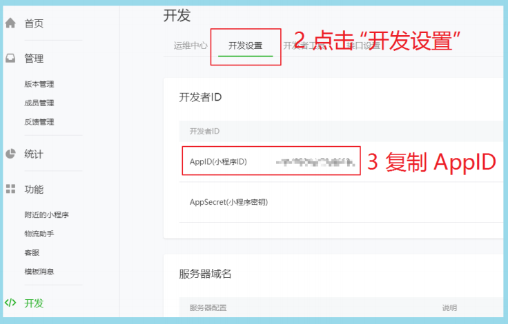
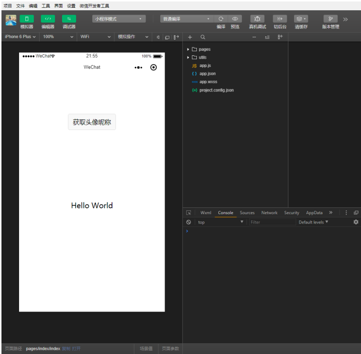
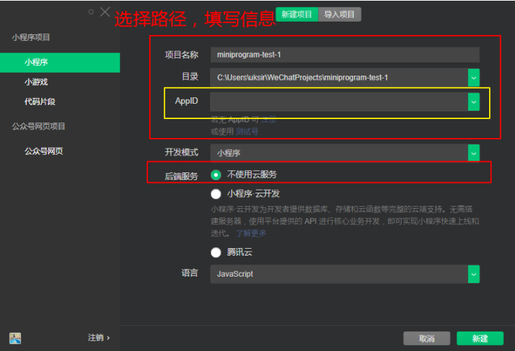
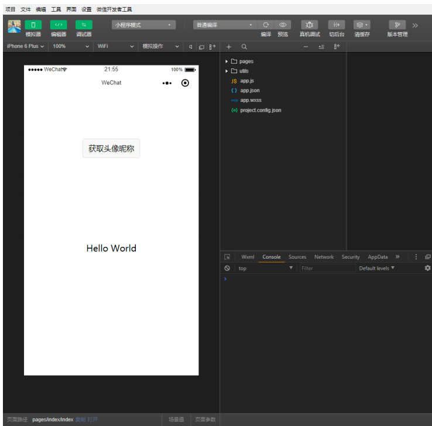
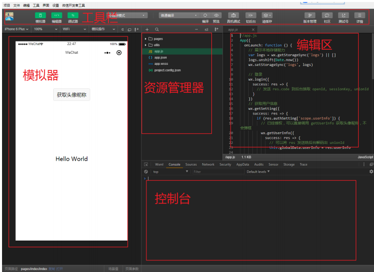
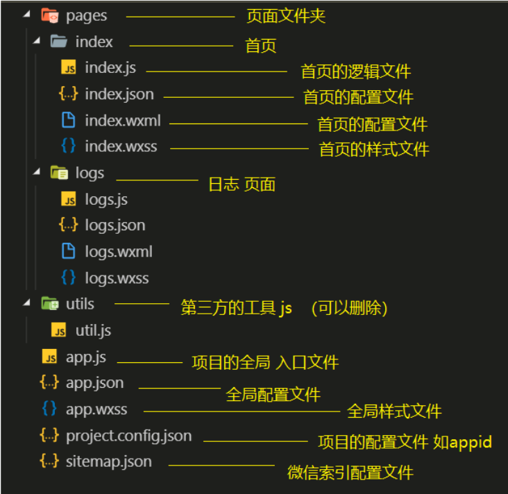
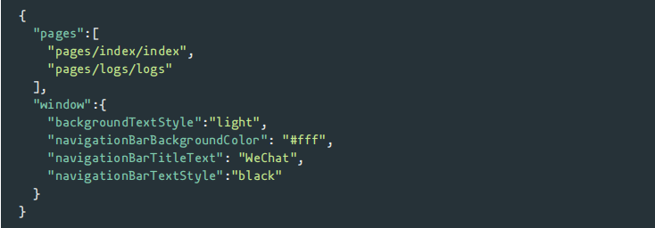
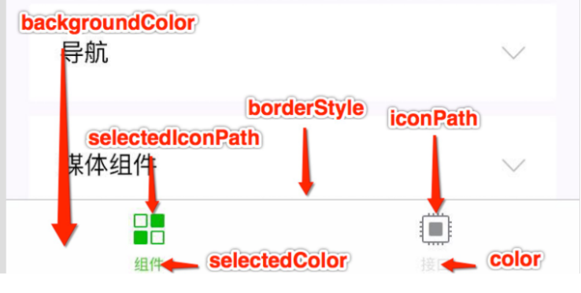
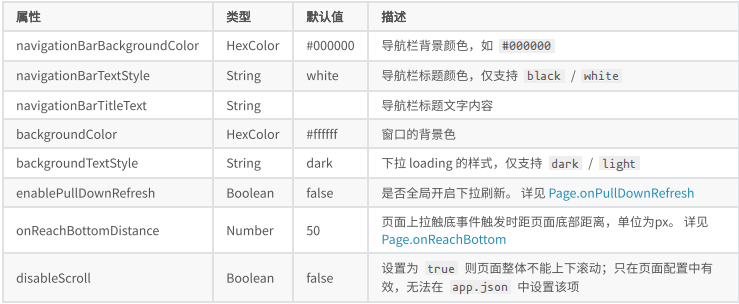

# 微信小程序介绍

​		微信⼩程序，简称⼩程序，英⽂名 Mini Program ，是⼀种不需要下载安装即可使⽤的应⽤，它实现 了应⽤“触⼿可及”的梦想，⽤⼾扫⼀扫或搜⼀下即可打开应⽤。

## 为什么是微信⼩程序 ？ 

1. 微信有海量⽤⼾，⽽且粘性很⾼，在微信⾥开发产品更容易触达⽤⼾； 

2. 推⼴app 或公众号的成本太⾼。 

3. 开发适配成本低。 

4. 容易⼩规模试错，然后快速迭代。 

5. 跨平台。

## 微信⼩程序历史

- 2016年1⽉11⽇，微信之⽗张⼩⻰时隔多年的公开亮相，解读了微信的四⼤价值观。张⼩⻰指出， 越来越多产品通过公众号来做，因为这⾥开发、获取⽤⼾和传播成本更低。拆分出来的服务号并没有提供更好的服务，所以微信内部正在研究新的形态，叫「微信⼩程序」 需要注意的是，之前是叫做应⽤号 

- 2016年9⽉21⽇，微信⼩程序正式开启内测。在微信⽣态下，触⼿可及、⽤完即⾛的微信⼩程序引起⼴泛关注。腾讯云正式上线微信⼩程序解决⽅案，提供⼩程序在云端服务器的技术⽅案。 

- 2017年1⽉9⽇，微信推出的“⼩程序”正式上线。“⼩程序”是⼀种⽆需安装，即可使⽤的⼿机“应⽤”。不需要像往常⼀样下载App，⽤⼾在微信中“⽤完即⾛”。

## 疯狂的微信⼩程序 

1. 微信⽉活已经达到10.82亿。其中55岁以上的⽤⼾也达到6300万 

2. 信息传达数达到450亿，较去年增⻓18%;视频通话4.1亿次,增⻓100% 

3. ⼩程序覆盖超过200+⾏业，交易额增⻓超过6倍，服务1000亿+⼈次,创造出了5000亿+的商业价值

##  还有其他的⼩程序 不容忽视

1. ⽀付宝⼩程序 

2. 百度⼩程序 

3. QQ⼩程序 

4. 今⽇头条 + 抖⾳⼩程序 

## 体验 

### 官⽅微信⼩程序体验 

### 其他优秀的第三⽅⼩程序 

拼多多

滴滴出⾏ 

欢乐⽃地主 

智⾏⽕⻋票 

唯品会

。。。

# 环境准备

开发微信⼩程序之前，必须要准备好相应的环境

## 注册账号

建议使用全新的邮箱，没有注册过其他小程序或者公众号的。

访问注册⻚⾯，耐⼼完成注册即可。 

## 获取APPID 

由于后期调⽤微信⼩程序的接⼝等功能，需要索取开发者的⼩程序中的 APPID ，所以在注册成功后， 可登录，然后获取APPID。 

登录，成功后可看到如下界⾯。然后复制你的APPID,悄悄的保存起来，不要给别⼈看到😄。

## 开发⼯具 

微信⼩程序⾃带开发者⼯具，集 开发 预览 调试 发布 于⼀⾝的 完整环境。 

但是由于编码的体验不算好，因此 建议使⽤ vs code + 微信小程序编辑工具 来实现编码

vs code 负责敲代码， 微信编辑工具负责预览 

# 第⼀个微信⼩程序 

## 打开微信开发者⼯具 

注意 第⼀次登录的时候 需要扫码登录

## 新建⼩程序项⽬

## 填写项⽬信息

## 成功

# 微信开发者⼯具介绍

详细的使⽤，可以查看官⽹

# ⼩程序结构⽬录 

⼩程序框架的⽬标是通过尽可能简单、⾼效的⽅式让开发者可以在微信中开发具有原⽣APP体验的服务。

⼩程序框架提供了⾃⼰的视图层描述语⾔ WXML和 WXSS，以及 JavaScript，并在视图层与逻辑层间提供了数据传输和事件系统，让开发者能够专注于数据与逻辑。 

## ⼩程序⽂件结构和传统web对⽐

| 结构 | 传统web    | 微信小程序 |
| ---- | ---------- | ---------- |
| 结构 | HTML       | WXML       |
| 样式 | CSS        | WXSS       |
| 逻辑 | Javascript | Javascript |
| 配置 | 无         | JSON       |

通过以上对⽐得出，传统web 是三层结构。⽽微信⼩程序 是四层结构，多了⼀层 配置.json 

## 基本的项⽬⽬录

# ⼩程序配置⽂件

⼀个⼩程序应⽤程序会包括最基本的两种配置⽂件。⼀种是全局的 app.json和 ⻚⾯⾃⼰的page.json

注意：配置文件中不能出现注释

##  全局配置app.json

app.json 是当前⼩程序的全局配置，包括了⼩程序的所有⻚⾯路径、界⾯表现、⽹络超时时间、底部 tab 等。普通快速启动项⽬⾥边的 app.json 配置。

字段的含义 

1. pages字段⸺⽤于描述当前⼩程序所有⻚⾯路径，这是为了让微信客⼾端知道当前你的⼩程序⻚⾯定义在哪个⽬录。 
2. window字段⸺定义⼩程序所有⻚⾯的顶部背景颜⾊，⽂字颜⾊定义等。 
3. 完整的配置信息请参考 app.json配置 

### tabbar 

## ⻚⾯配置page.json 

这⾥的 page.json其实⽤来表⽰⻚⾯⽬录下的 page.json这类和⼩程序⻚⾯相关的配置。开发者可以独⽴定义每个⻚⾯的⼀些属性，如顶部颜⾊、是否允许下拉刷新等等。

⻚⾯的配置只能设置 app.json中部分 window配置项的内容，⻚⾯中配置项会覆盖 app.json的 window中相同的配置项。 

## sitemap 配置-了解即可 

⼩程序根⽬录下的 sitemap.json⽂件⽤于配置⼩程序及其⻚⾯是否允许被微信索引。 

# 模板语法

WXML（WeiXin Markup Language）是框架设计的⼀套标签语⾔，结合基础组件、事件系统，可以构建出⻚⾯的结构。

