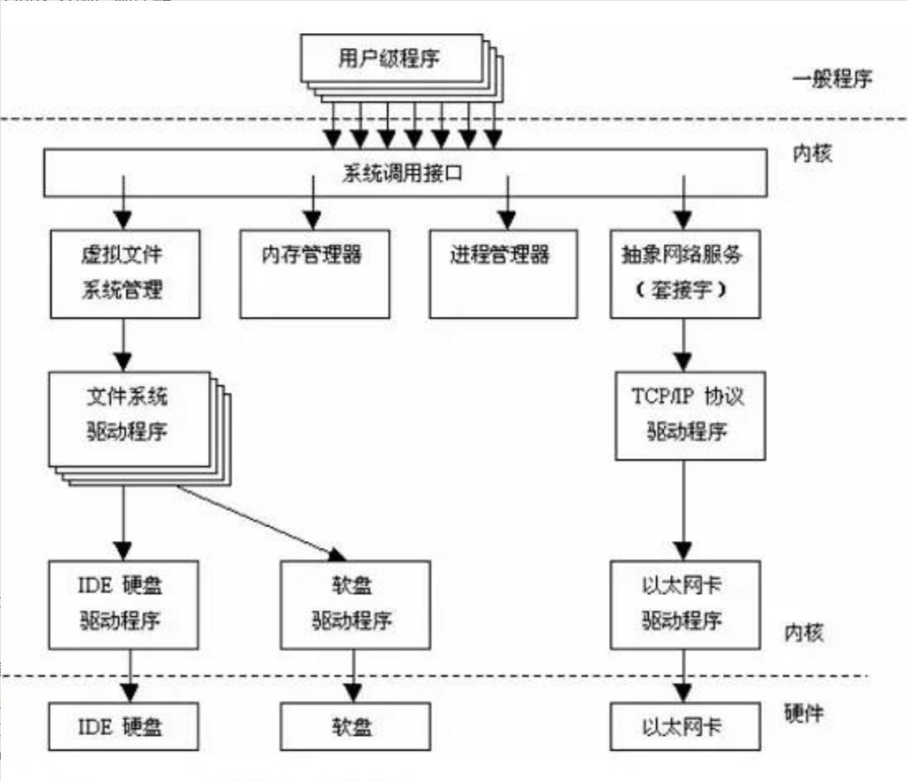

# 第一章 操作系统概述

## 什么是操作系统？

​		在硬件的基础之上，计算机安装了一层软件，这层软件通过响应用户输入的指令达到控制硬件的效果，从而满足用户需求，这种软件称之为操作系统。

- 常见的操作系统有：Windows、Linux、FreeBSD、或OS X。

- 带有图形界面的操作系统称为图形用户界面（Graphical User Interface, GUI）。而基于文本、命令行的通常称为shell。

- 大部分计算机有两种运行模式：内核态和用户态。软件中最基础的部分是操作系统，它运行在内核态中，内核态也称为管态和核心态。操作系统具有硬件的访问权，可以执行机器能够运行的任何指令。软件的其余部分运行在用户态下。

## 内核

- 内核是应用连接硬件设备的桥梁。
- 内核具有的能力：
  1. 管理进程、线程，决定哪个进程、线程使用CPU，即进程调度能力
  2. 管理内存，决定内存的分配和回收，即内存管理能力
  3. 管理硬件设备，为进程与硬件设备之间提供通信能力，即硬件通信能力
  4. 提供系统调用，如果应用程序要运行更高权限的服务，那么需要系统调用，它是用户程序与操作系统之间的接口。

- 内核具有很高的权限，应用程序具有的权限很小。因此大多数操作系统把内存分成了两个区域：
  1. 内核空间：只有内核程序可以访问
  2. 用户空间：专门给应用程序使用
- 用户空间的代码只能访问一个局部的内存空间，而内核空间的代码可以访问所有内存空间。
- 因此，当程序使用用户空间时，我们常说该程序在**用户态**执行，而当程序使内核空间时，程序则在**内核态**执行。

应用程序如果需要进入内核空间，就需要通过「系统调用」，下面来看看系统调用的过程：

​		内核程序执行在内核态，用户程序执行在用户态。当应用程序使用系统调用时，会产生一个中断。发生中断后， CPU 会中断当前在执行的用户程序，转而跳转到中断处理程序，也就是开始执行内核程序。内核处理完后，主动触发中断，把 CPU 执行权限交回给用户程序，回到用户态继续工作。

Linux 内核由如下几部分组成：内存管理、进程管理、设备驱动程序、文件系统和网络管理等。如图：

- 当今 Windows 7、Windows 10 使⽤的内核叫 Windows NT，NT 全称叫 New Technology。
- 下图是 Windows NT 的结构图⽚：

## 计算机启动过程

当你轻轻按下计算机的启动按钮时，你的主板就加上电了。

主板一般为矩形电路板，上面安装了组成计算机的主要电路系统，一般有 BIOS 芯片、I/O 控制芯片、键盘和面板控制开关接口、指示灯插接件、扩充插槽、主板及插卡的直流电源供电接插件等元件。

在主板上，有一个东西叫**ROM**（Read Only Memory，只读存储器）。这和咱们平常说的内存**RAM**（Random Access Memory，随机存取存储器）不同。

咱们平时买的内存条是可读可写的，这样才能保存计算结果。而 ROM 是只读的，上面早就固化了一些初始化的程序，也就是**BIOS**（Basic Input and Output System，基本输入输出系统）。

如果你自己安装过操作系统，刚启动的时候，按某个组合键，显示器会弹出一个蓝色的界面。能够调整启动顺序的系统，就是我说的 BIOS，然后我们就可以先执行它。

​		然后操作系统会询问 BIOS 获取配置信息。对于每个设备来说，会检查是否有设备驱动程序。如果没有，则会向用户询问是否需要插入 `CD-ROM` 驱动（由设备制造商提供）或者从 Internet 上下载。一旦有了设备驱动程序，操作系统会把它们加载到内核中，然后初始化表，创建所需的后台进程，并启动登录程序或GUI。

## 系统调用

# 第二章 内存管理

