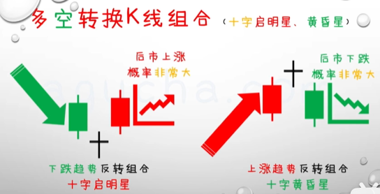

[TOC]

# 股票K线图

## K线的参数、构成与分类

参数：最高价、最低价、开盘价、收盘价

构成：上影线、下影线、实体

分类：阴线、阳性

## 阳线参数及类型延展

## 阴线参数及类型延展

# K线组合之多空吞噬线

## 多空转换K线组合（多、空吞噬）

## 多头吞噬

## 空头吞噬

# K线组合之多空母子

## 多头母子线

## 空头母子线

## 特殊母子线

# K线组合之锤子线、上吊线

上吊线又叫吊人线。

锤子线和上吊线有一个统称叫做伞形线，它是由一条K线构成。

# K线组合之启明星、黄昏星

## 启明星

## 黄昏星

## 十字启明星、十字黄昏星

# K线组合之倒锤子线、流星线

## 倒锤子线

## 流星线

## 特殊倒锤子、特殊流星

## 倒锤子、流星延展

