[TOC]

# 第1章 计算机的发展历史

## 早期的计算器

### 算盘

在计算机没有制造出来时，计算器是最早的计算工具。早期的计算器为纯手动式，如算盘、算筹等。算盘通常是以滑动的珠子制成。在西方，算盘在印度阿拉伯数字流行前使用了数个世纪，且在近代中国的记帐与商务上仍广泛使用。后来出现机械计算器。

**算盘，西亚人的发明**

和一般人想象的不同，算盘并非中国人的发明。最早的算盘出现在公元前2700年到2300年左右的苏美尔文明（**人类已知的最早文明**），最初只是一个有横隔的泥板，摆上泥丸或者石子，按位累加，放满清空，并在下一列加1——这就是进位制的最初起源。

> 苏美尔文明，是比传统四大古文明更加久远甚至先进的文明。苏美尔文明，指的是苏美尔地区以苏美尔语文献为主要标志的文明。古代地名苏美尔，位于今伊拉克东南部幼发拉底河和底格里斯河下游。苏美尔文明的时间大致是始于公元前4000-5500年，距今六千到七千年前，比古埃及更早，是目前考古能确认的最早的人类文明。苏美尔文明拥有今天考古学家所能确定的最早的五大城市。其中Eridu（考古遗迹位于伊拉克）建成于公元前5400年，距今七千年历史。

很难说中国的算盘是否是独立发明的，它与西方算盘非常类似，**很可能是丝绸之路东西交流的产物**。

中国算盘最早见载于东汉末年的《数术记遗》，是像罗马算盘一样的游珠算盘，到唐代改良为现在的串珠算盘；而现存最早的算盘图像见于北宋张择端的《清明上河图》，卷左赵太丞家药铺柜台上有一个十五档一四算盘，和现代会计算盘几乎一样。

### 算筹

算筹，是第一种有进位的10进制记数法。

> 它最早出现在何时，已经不可查考了，但是到春秋战国，算筹的使用已经非常普遍了。算筹在中国的起
>
> 源很早，中国著名科学家 祖冲之（429-500）借助算筹为计算工具，计算出圆周率在  3.1415926 到
>
> 3.1415927 之间，成为了世界上最早把圆周率数值算到 7 位数字以上的科学家
>
> 这种计数系统经过南北朝、宋朝的改进，能够标明小数和正负数，是当时最为先进的计数系统之一。

它的领先到了什么程度？印度-阿拉伯数字传入古代中国时，根本不受重视，因为它的功能在中国人看来，没什么新鲜的。

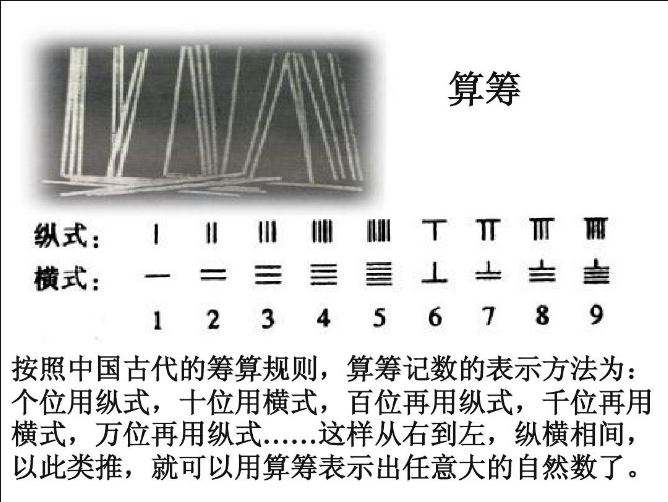

### 纳皮尔算筹

17世纪初，西方国家的计算工具有了较大的发展，英国数学家纳皮尔发明的"纳皮尔算筹"。

这套工具主要用来计算乘除法，计算时先用算码凑成一个因数，再根据行号读出与另一个因数每一位的乘积，最后在纸上相加，本质上就是一副活字九九表，如果加入其它扩充的算码还可以用来开方。

之后的三个多世纪里，它不断改良，是近代早期欧洲最流行的计算工具，并曾东传中国，被清代数学家当作筹算的分支

### 计算尺

但约翰•纳皮尔的数学贡献不只是一副“骨头”，他还是对数概念的提出人，这直接引出了另一种沿用至今的计算工具——计算尺。

17世纪的大不列颠开始对外殖民扩张，航海、测绘、天文定位都出现了难以完成的计算需求，而对数可以化幂运算为乘除法、化乘除法为加减法，法国数学家和天文学家拉普拉斯（Pierre Simon Laplace，1749-1827）曾赞叹：“对数，可以缩短计算时间，在实效上等于把天文学家的寿命延长了许多倍。”

1620年到1630年间，牛津大学和剑桥大学根据**纳皮尔的对数原理**，发明了更方便的滑尺，分直形和圆形两种，可通过对齐尺子上的刻度查询计算结果——这就是中文“对数”一词的由来。

随后的两个世纪里，工程师和数学家不断为计算尺引入新的刻度，并添加了滑动的游标，发展成现代的多相算尺，可以进行加减法之外所有的算术运算，以及三角函数等超越计算，不同工程领域还常常研发出自己的专业型号。

20世纪70年代出现电子科学计算器以前，计算尺都是工程师的身份象征。

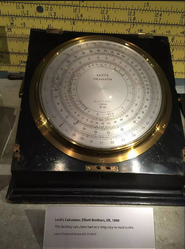

## 机械计算机

### 契克卡德计算钟（1623年）

**1623 年**，德国科学家 契克卡德(W.Schickard) 制造了人类有史以来的第一台机械式计算机，这台计算机能

够进行六位数的加减乘除运算，它比帕斯卡机的诞生早了约20年。

契克卡德这台传说中的机器后来被称为Rechenuhr，德语中Rechnen表示「算术」，uhr表示「时钟」，Rechenuhr便通常译为「计算钟」。跟「钟」有什么关系呢？因为当计算结果溢出（超出6位数）时，机器会发出响铃警告，这样的设计在当时可谓相当智能。

契克卡德的手稿被辨认之后，图宾根大学一位名叫布鲁诺·冯·弗雷塔格-洛林霍夫（Bruno von Freytag-Löringhoff）的学者立刻开展了相关研究，并于1960年做出了计算钟的复制品。

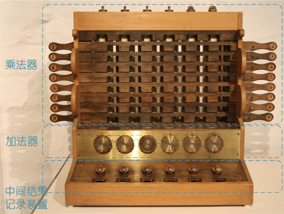

契克卡德计算钟复制品，我标注了组成部件，方便下面解说。（原图来自维基「Wilhelm Schickard」词条）

计算钟支持六位整数计算，主要分为加法器、乘法器和中间结果记录装置三部分，它们虽然集成在同一台机器上，但相互之间没有任何物理关联。位于机器底座的中间结果记录装置是一组简单的置数旋钮，主要是为了省去计算过程中笔和纸的参与

### 帕斯卡计算器（1642年）

钟表指针的齿轮转动天然地具有进位功能。**1642年**，法国数学家、物理学家和化学家帕斯卡（Blaise Pascal，1623-1662）借此设计了一台“帕斯卡计算器”（Pascal&# 39;s calculator）。长方形的黄铜盒子上开有一列读数窗，下面对应着一行带辐条和指针的齿轮。操作时先像拨盘电话一样逐位输入一个加数，这将显示在上方的读数窗里；再用同样的方式输入另一个加数，读数窗里就会显示出和了。

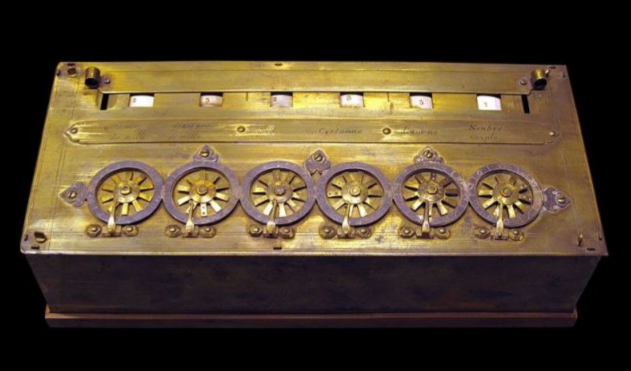

帕斯卡计算器虽然在功能上远远不及算筹和算盘，却是一次彻底的革命——算筹和算盘本身不包含任何算法，只能存储计算的中间结果，操作依赖熟记指令的人，本质上只是寄存器。帕斯卡计算器却用内部的齿轮机构预存了算法，操作者完全不需要知道计算方法就能操作。

这才是真正的计算器，而不止是计算用的工具。

尽管占有许多历史第一，但帕斯卡的计算器并没有充分推广，他的设计初衷只是帮助父亲计算税收，造价非常高昂，最后沦为有钱人的机械玩具，前后只卖出约20件。

### 莱布尼兹步进计算器（1674 年）

与帕斯卡类似，德国大数学家、哲学家莱布尼兹（Gottfried Wilhelm Leibniz，1646-1716）也对机械化的计算工具颇有兴趣，他在1672年到1694年之间发明了一种“步进计算器”（Stepped Reckoner），采用了他独创的“莱布尼兹轮”（Leibniz wheel），可以控制齿轮只转动需要的角度。这产生了相当复杂的运算能力，除了普通的加减法意外，还能将两个8位数字相乘为一个16位数字，或者用一个16位的数字除以一个8位数字。

保存在德意志博物馆的步进计算器复制品（图片来自维基「Stepped reckoner」词条）

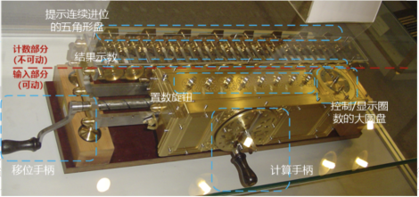

步进计算器是有史以来第一台具有完整的四则运算能力的机械式计算机，「步进（stepped）」这个名字，来自于其乘除法的实现原理。

最开始的时候，莱布尼茨尝试在帕斯卡那台只能做加减运算的算术机上进行改进，但很快发现，现有的结构实在无法实现他心目中的自动化，只好重新设计。

### 查尔斯·巴贝奇：现代计算机真正的鼻祖

机械计算时代，却仅仅在和加、减、乘、除——简单到不能再简单的基本运算打交道。难道机器只能用来做运算吗？为了解决一个数学问题，人们往往需要将多步运算串联起来，每一次串联不过是将上一步的运算结果直接或经过简单处理后交给下一步而已，而既然运算可以由机器完成，为什么步骤就不可以呢？

#### 差分思想

差分机这个名字，源自其所使用的算法，是帕斯卡在1654年提出的差分思想：n次多项式的n次数值差分为同一常数。这句话概括性高，不太好理解，让我们用几个例子来详细说明。

选用经典数字1024，构造一次函数F(x)：

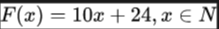

同时定义差分∆F(x)：

在x取0～6时，F(x)及∆F(x)的值如下表所示：

不难发现，对于一次多项式，每个相邻的x所对应的F(x)之差都是一个常数，这个常数正是x的系数。那么二次多项式呢？

构造二次函数F(x)：

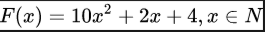

同时定义一次差分与二次差分：

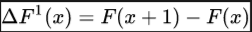

在x取0～6时，F(x)及其一次、二次差分的值如下表所示：

对于二次多项式，每个相邻的x所对应的一次差分之差（即二次差分）是一个常数。

一次多项式和二次多项式的规律如此，三次、四次，乃至任意多次的多项式都遵循这样的差分规律——n次多项式的n次差分为常数。

差分规律是一项伟大的发现，有了差分，在计算多项式时就可以用加法代替乘法，我们只需要准备好x=0时F(x)及各次差分的值，后面任意x所对应的F(x)值均可通过加法得出。只要有了第1列F(0)、和的值，第2列的F(1)即可通过得到、可通过得到，同理，第3列的F(2)和也可根据第2列的数据得到，以此类推，任意列的数据都可通过前一列的数据得到。意即，求解F(n)，只需前n列数据的不断迭代。而这整个过程，只涉及加法。

这可了不得！要知道，许多常见的函数在数学上称为解析函数，它们都可以用多项式逼近（幂级数展开），常用的三角函数、对数函数都可以转换为多项式。借助差分思想，这些函数可以进一步转换为重复的加法。而加法运算正是机械计算器的“拿手好戏”，这样一来，绝大部分数学运算就都可以交给机器了。

#### 差分机（1822年）：一种高度自动化的计算机器

1822年6月14日，查尔斯·巴贝奇（Charles Babbage）向皇家天文学会递交了一篇名为《论机械在天文及数学用表计算中的应用》的论文，差分机的概念正式问世。

与论文一起亮相的，是一台简单的原型机——差分机0号。英国政府对它很有兴趣，并于次年拨款1700英镑，希望巴贝奇能做出实用产品，彻底解决制表难题。

拿到启动资金的巴贝奇如鱼得水，立即着手差分机1号的研制，并宣称只需两三年就能完成任务。谁知实行起来要比想象中困难得多，那个时代的机械制造水平实在满足不了差分机的精密要求，巴贝奇跑遍整个欧洲也没找到多少能用的零件，于是在制造机器之前，还要先考虑怎么制造各类零件。在当时一位顶尖的英国机械师约瑟夫·克莱门特（Joseph Clement）的帮助下，巴贝奇不但做出了差分机能用的零件，还培养出大批优秀的技师。

也正因如此，他们无意间将一个项目的摊子铺到了一个行业的尺度，尽管实施的过程精雕细琢、尽善尽美，却没能交付一件满足要求的产品。1832年，项目启动10年过去了，巴贝奇却只完成了设计稿的七分之一——一台支持6位数、2次差分的小模型（设计稿为20位数、6次差分）。

差分机1号的七分之一模型（图片来自维基百科）

巴贝奇作为差分机的鼻祖，反倒没有留下实际可用的机器。1846～1849年，他升级了设计，提出支持31位、7次差分的差分机2号（Difference Engine No.2）方案，但没了政府的资助，只能停留于稿纸。于是，巴贝奇的设计是否真的可行，其人作为“差分机之父”是否名副其实，成为学术界长久以来的一大争论。直到1985～1991年，伦敦科学博物馆为了纪念巴贝奇诞辰200周年，根据其1849年的设计，用纯19世纪的技术成功造出了差分机2号，才彻底巩固了他的历史地位。（博物馆发现，巴贝奇的设计稿中仅存在少量错误，而且基本可以断定它们是巴贝奇刻意设置的防盗措施。）

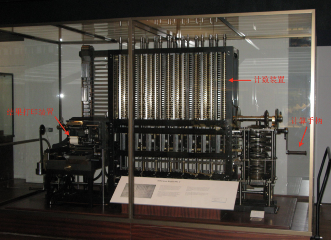

伦敦科学博物馆的差分机2号（图片来自维基百科）

#### 分析机（1833年）

差分机的建造虽然夭折了，但巴贝奇从未停止过对设计稿的改进。直到有一天，一个惊人的想法从他脑中掠过，如同神祇，如同有史以来所有人类对计算的诉求结晶——差分机固然强大，但终究只能计算多项式而已，何不建造一台可以解决所有计算问题的通用机器呢！

1833年，巴贝奇就着手开始了这种通用机器的设计，并不断改进直至离世。这台被他称作分析机（Analytical Engine）的机器，直接将机械计算的理念从地表推上云天。

**组成结构**

巴贝奇将分析机划分为5大部分：

1. 由差分机的计数装置改进而来的数据存储器，可存储1000个40位十进制数；
2. 支持四则运算、比较大小和开平方根的算术单元，巴贝奇称之为“工厂”（mill）；

3. 实现逻辑控制的圆柱形“控制筒”，身周固定着许多销钉，随着“控制筒”的旋转，通过销钉推动杠杆实现控制；

4. 3种用于输入的读卡装置，其一输入运算指令，其二输入常量数据，其三输入控制数据（在存储器和算术单元之间）传输的指令，承载这些输入信息的是一种名为穿孔卡片（punched card/punch card）的经典载体，3种读卡装置分别识别3种类型（运算、数据和控制）的穿孔卡片；

5. 4种输出装置，其一为打印装置，其二为曲线绘图仪，其三为响铃，其四为打孔机，用于制造穿孔卡片。

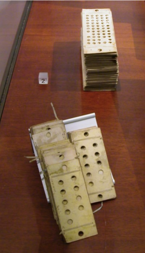

分析机使用的穿孔卡片——上：数据类卡片｜下：运算类卡片（图片来自维基百科）

后人惊讶地发现，这种组成结构竟和现代计算机如出一辙（现代计算机的五大组成部件是由冯·诺依曼在1945年才明确提出的）。

5大部件的协作过程大体是这样的：读卡装置从穿孔卡片上读取数据和运算指令，数据进入存储器，随后被传送至“工厂”进行处理，处理结果进入存储器并通过输出装置呈现给用户。在控制类穿孔卡片的指引下，“控制筒”可以实现顺序、循环、条件等多种控制逻辑，读取数据的读卡装置则不但可以按照正常顺序读卡，还可以反序读卡，乃至跳过部分卡片。

巴贝奇首次将运行步骤从机器身上剥离，靠随时可以替换的穿孔卡片来指挥机器，成就了机器的可编程性。这其中，穿孔卡片的引入功不可没。这种经典的数据载体跨越了机械、机电和电子3个时代，一直沿用至20世纪80年代中期。

仿佛是老天爷一个玩笑式的魔咒，分析机的研制不幸步了差分机的后尘，巴贝奇付出了几十年的努力，却仍只建成了它的一小部分。

巴贝奇抱憾而终，留给后世的仅仅只有小小的模型和两千多张图纸。

#### 第一位程序员：艾达·洛芙莱斯（Ada Lovelace）

1840年，巴贝奇应邀来到意大利都灵大学分享分析机的设计，当时一位年轻的工程师、后来的意大利首相路易吉·费德里科·梅纳布雷亚（Luigi Federico Menabrea）用法语记下了详细的笔记并于1842年整理出版。1843年，著名诗人乔治·戈登·拜伦（George Gordon Byron）的女儿艾达·洛芙莱斯（Ada Lovelace）将这份笔记译成英文，并在巴贝奇的提议下扩充了许多自己的理解。此时的艾达其实已经对分析机痴迷了8年，结果她留下的注解篇幅足有译文本身的2倍！其中一处在分析机上计算伯努利数的描述被后人视为史上第一个计算机程序，这篇名为《关于巴贝奇先生发明的分析机简讯》的译文被视为程序设计方面的第一篇著作，艾达其人则被视为第一位程序员，尽管当时连编程语言都没有，连实物机器都没有。

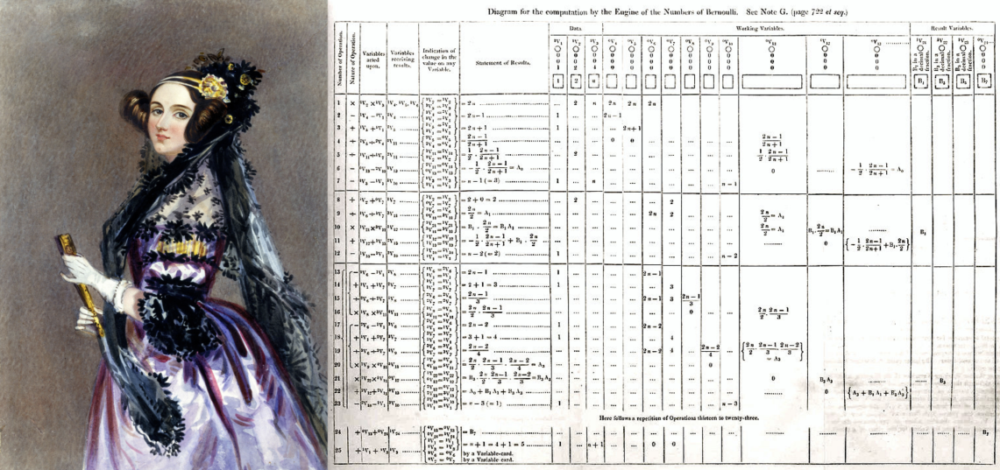

纵观整个机械时期，巴贝奇的思想远远超出了其他几位先驱者，他如同一个从20世纪穿越回去的先知，把一百年后的思想“剧透”给了世人。唯一缺憾的，是不论差分机还是分析机，巴贝奇都终究没能实现。人类的技术发展错过了一次“跳级”的机会，巴贝奇在计算机领域的成就逐渐没入历史的浓雾，等待百年之后再被另一批天才重新发明。

## 穿孔制表机（1884）

穿孔卡是早期计算机输入信息的设备，通常可以储存80列数据。它是一种很薄的纸片，面积为190×84毫米。首次使用穿孔卡技术的数据处理机器，是美国统计专家霍列瑞斯博士（H.Hollerith）的伟大发明。Hollerith机(Hollerith Machine)，是美国人口普查催生的计算器。1880年以前，美国的人口普查都是人工做的。1880的普查完成之后，美国人意识到按照当时的人口增长速度，下一次1890年的普查十年也不可能完成统计，而美国的法律规定必须在十年内完成。于是招标寻找解决办法。Herman Hollerith设计了这种在纸板上打孔(punched card)的技术，帮助解决了统计局的难题。但是他本人并没有赚到钱。1896年他成立了一个公司(TabulatingMachine Company)，向其它国家卖他的产品。后来在他老了以后，他把公司卖给了手下的一个主管。最后成了成立IBM的三家公司之一。

**制表机**

他发明的机器叫制表机（tabulator/tabulating machine），顾名思义，就是专门用来制作数据统计表的机器。制表机主要由示数装置、穿孔机、读卡装置和分类箱组成。

示数装置包含4行、10列共40个示数表盘，每个盘面被均匀地分成100格，并装有两根指针，和钟表十分相像，“分针”转一圈可计100，“时针”转一圈则计10000。可见，整个示数装置可以表达很庞大的数据。

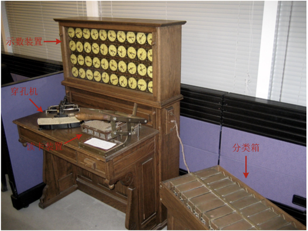

制表机（原图来自维基百科）

制表机的工作是围绕穿孔卡片展开的：操作员先使用穿孔机制作穿孔卡片，再使用读卡装置识别卡片上的信息，机器自动完成统计并在示数表盘上实时显示结果，最后，将卡片投入分类箱的某一格中，进行分类存放，以供下次统计使用。

**穿孔卡片的应用**

此前的某一天，霍尔瑞斯正在火车站排队检票，目光不经意落到检票员手中咔咔直响的打孔机上。他发现，检票员会特意根据乘客的性别和年龄段，在车票的不同地方打孔。越来越多的人过检，他进一步确认了这个规律。一个灵感朝他袭来：如果有一张更大的卡，上面有更多的位置可以打孔，就可以用来表示更多的身份信息，包括国籍、人种、性别、生日等等。

这就是用在1890年人口普查中的穿孔卡片，一张卡片记录一个居民的信息。卡片设计长约18.73cm，宽约8.26cm，正好是当时一张美元纸币的尺寸，因为霍尔瑞斯直接用财政部装钱的盒子来装卡片。

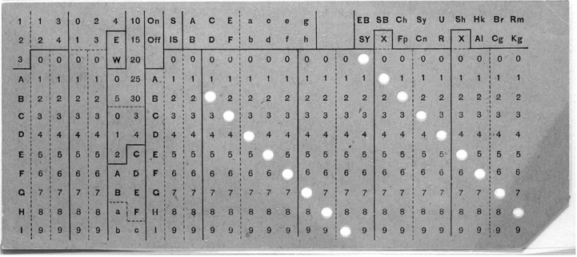

霍尔瑞斯的穿孔卡片（图片来自维基百科）

卡片设有300多个孔位，与雅卡尔和巴贝奇的做法一样，靠每个孔位打孔与否来表示信息。尽管这种形式颇有几分二进制的意味，但当时的设计还远不够成熟，并没有用到二进制真正的价值。举个例子，我们现在一般用1位数据就可以表示性别，比如1表示男性，0表示女性，而霍尔瑞斯在卡片上用了两个孔位，表示男性就其中一处打孔，表示女性就在另一处打孔。其实性别还凑合，表示日期时浪费得就多了，12个月需要12个孔位，而常规的二进制编码只需要4位。当然，这样的局限也与制表机中简单的电路实现有关。

是霍尔瑞斯将穿孔卡片作为数据存储介质推广了开来，并开启了一个崭新的数据处理纪元。后来人们也把这类卡片称为霍尔瑞斯卡片，穿孔卡片和穿孔纸带作为输入输出载体，统治了计算领域整整一个世纪。

## 图灵机：计算机世界的理论基石

艾伦·麦席森·图灵（Alan Mathison Turing），1912-1954，英国数学家、计算机学家、逻辑学家、密码学家、哲学家、理论生物学家。（图片来自维基百科）

**图灵机**工作原理

图灵机是图灵受打字机的启发而假想出来的一种抽象机器，其处理对象是一条无限长的一维纸带。纸带被划分为一个个大小相等的小方格，每个小方格可以存放一个符号（可以是数字、字母或其他符号）。有个贴近纸带的读写头，可以对单个小方格进行读取、擦除和打印操作。为了让读写头能访问到纸带上的所有小方格，可以固定纸带，让读写头沿着纸带左右移动，每次移动一格，或者固定读写头，让纸带左右移动——后一种方式类似当时穿孔带以及后来磁带和磁盘的做法，但在纯理论讨论时为了方便说明，我们通常选用前一种方式。

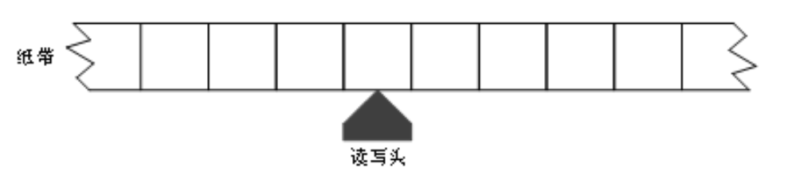

图灵机纸带示意图
那么读写头该如何移动，移动之前或移动之后又该作何操作呢？这取决于机器当前的状态，以及读写头当前所指小方格中的内容，机器中有着一张应对各种情况的策略表。这就好比有一只小猫，你往它碗里放些食物，它会根据自己饿不饿以及食物的类别判断吃还是不吃，我们可以大体列出一张策略表：

小猫进食策略表
在这个例子中，小猫就好比图灵机，碗就是纸带上的小方格，食物就是小方格中的符号。当然这只是一个简化的类比，也有很多不挑食的小猫会吃白米饭，或者贪食的小猫即使吃饱了看见鱼还是会继续吃。在理想情况下，当我们提供一排足够多的碗，并在碗中放置更多种类的食物和玩具，猫在碗与碗间来回走动，就更像一台图灵机了。

为了更精确地说明，我们构造一台简单的图灵机，实现对纸带上所有3位二进制数的+1操作（超过3位的进位将被丢弃），相邻两个二进制数之间通过一个空的小方格隔开，形如下图所示，读写头从最右侧二进制数的最低位开始扫描，遇到连续2个空方格时认为已处理完所有数，机器停机。

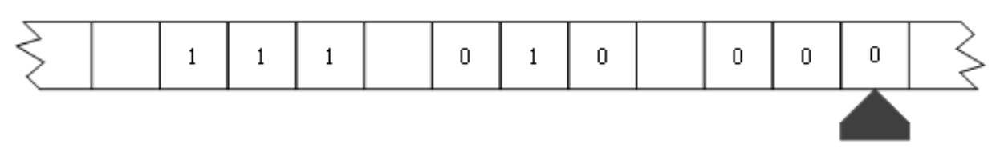

图灵机示例纸带

策略表如下表所示，其中E表示擦除、P表示打印、L表示左移。

图灵机示例策略表
该图灵机有3种工作状态：

1. S1是+1状态，也是机器的初始状态。如果读写头遇到的是0，则直接将0改为1即完成了+1任务，左移一格后进入状态S2；如果遇到的是1，则将1改为0，由于需要进位，即对下一位+1，左移一格后仍留在状态S1；如果遇到的是一个空方格，即使当前需要进位，也不做处理（将进位丢弃），左移一格后进入状态S3。
2. S2是左移状态，此时已实现当前二进制数的+1，需要将读写头移到下一个数的最低位。如果遇到0或1，说明读写头还在当前二进制数上，继续左移；如果遇到空方格，后面等着它的可能是下一个二进制数，也可能是永无止境的空方格，左移一格之后进入状态S3。
3. S3是判断状态，根据情况判断是否还有二进制数要处理。如果读写头遇到的是0或1，说明当前位置是一个新的二进数的最低位，直接交给S1处理；如果遇到的仍是空方格，说明后续不再有数据，停机。
  根据以上策略，该图灵机处理纸带的过程为：

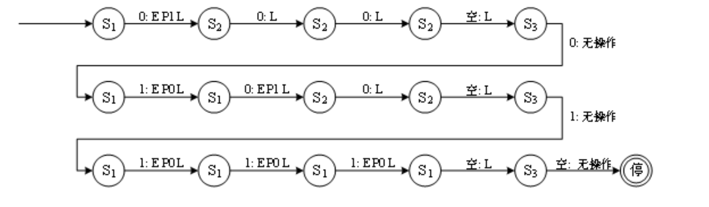

如法炮制，我们可以设计出具有各种功能的图灵机，而策略表的制定则类似于编程。图灵想到，如果把策略表中的信息以统一的格式写成符号串（比如上表可以表达成S1/0/EP1L/S2 S1/1/EP0L/S1 S1//L/S3 ……），然后放在纸带的头部，再设计一台能在运行伊始时从纸带上读取这些策略的图灵机，那么针对不同的任务，就不需要设计不同的图灵机，而只需改变纸带上的策略即可。这种能靠纸带定制策略的图灵机，称为通用图灵机UTM（universal Turing machine）。

不单是策略表，其实用于描述图灵机的所有信息（包括所使用的符号、初始状态等）都可以表达成纸带上的符号串。这就意味着，一台图灵机可以成为另一台图灵机的输入。

**深远的意义**

从图灵开始，计算机有了真正坚实的理论基础，更多人开始投身计算机的理论研究，而不仅是尝试构建一台机器。从如今的应用来看，图灵机之于计算机领域的价值远高于数学领域，计算机的原始公式，只有图灵机这一个。

如今的所有通用计算机都是图灵机的一种实现，两者的能力是等价的。当一个计算系统可以模拟任意图灵机（或者说通用图灵机）时，我们称其是图灵完备的（Turing complete）；当一个图灵完备的系统可以被图灵机模拟时，我们称其是图灵等效的（Turing equivalent）。图灵完备和图灵等效成为衡量计算机和编程语言能力的基础指标，如今几乎所有的编程语言也都是图灵完备的，这意味着它们可以相互取代，一款语言能写出的程序用另一款也照样可以实现

1966年，美国计算机协会ACM（Association for Computing Machinery）设立计算机领域的最高奖项，命名为图灵奖。图灵奖素有“计算机界的诺贝尔奖”之称，图灵的名字当之无愧。

## ENIAC（1945年）：第一台通用电子计算机

在20世纪40年代，由于当时进行的二战急需高速准确的计算工具，来解决弹道计算问题，在美国陆军部的主持下，美国宾夕法尼亚大学莫尔学院的莫克利、艾克特等人于1945年年底设计制造了世界上第一台电子计算机ENIAC，并为美国军方使用。

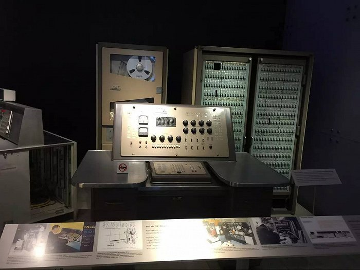

ENIAC（中文名：埃尼阿克）计算器使用了17840支电子管，大小为80英尺×8英尺，重达28t（吨），功耗为170kW，其运算速度为每秒5000次的加法运算，造价约为487000美元。ENIAC的问世具有划时代的意义，表明电子计算机时代的到来。

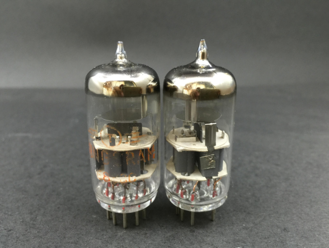

电子管

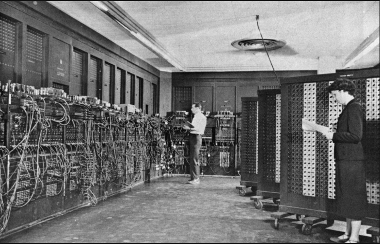

## 冯·诺依曼结构：现代计算机的诞生

二战期间，冯·诺依曼加入曼哈顿计划，此时的他已经拥有极高的学术地位。原子弹的研制涉及大量运算，洛斯·阿拉莫斯国家实验室在体验过机电计算机Harvard Mark I之后，对ENIAC寄予了更高的期望。1944年的夏天，冯·诺依曼作为顾问加入ENIAC项目，提出了许多建设性意见，并深度参与到EDVAC的讨论中。

这期间，冯·诺依曼在EDVAC上投入了许多思考，他愈发觉得，EDVAC不单是一个平凡的计算机项目，它潜藏着更深的理论意义。他想起图灵的论文，通用图灵机能够根据纸带上的策略信息模拟任意图灵机的行为，纸带是它是存储器[1]，策略信息就是程序，这正是存储程序最早的思想萌芽。而他们现在所尝试的，正是用电子管将它变成现实！1945年6月，在一趟返回洛斯·阿拉莫斯国家实验室的列车上，完整的EDVAC已在冯·诺依曼脑中清晰可见，他奋笔疾书，写出了那篇长达101页，影响计算机历史走向的《EDVAC报告书的第一份草案》。

草案不仅详述了EDVAC的设计，还为现代计算机的发展指明了道路：

1. 机器内部使用二进制表示数据；
2. 像存储数据一样存储程序；

3. 计算机由运算器、控制器、存储器、输入模块和输出模块5部分组成。

这些在现在看来似乎是理所应当的原则，在当时却是一次划时代的总结。这份草案与其说是冯·诺依曼对EDVAC的设计描述，不如说是他对当时全世界计算机建造经验集大成式的高度提炼。

冯·诺依曼将计算机与神经细胞类比，运算器、控制器和存储器相当于联络神经元，输入模块和输出模块相当于感觉神经元和运动神经元。通俗地讲，就好比人拥有可以思考（处理信息）的大脑，并通过“感觉”获取来自世界的信息，通过“运动”去改变世界。计算机同样需要这样一个世界，那就是当时的穿孔介质、开关、旋钮、接插件，等等，统称外部记录媒体。

这种基于存储程序思想的计算机结构，后来被称为冯·诺依曼结构。冯诺依曼结构奠定了现代计算机的基调，放到今天，运算器和控制器就是CPU的主要组成部分，存储器主要对应为内存，输入和输出模块也被芯片化后集成到主板，外部记录媒体变得丰富多样，比如鼠标、键盘、显示器、触屏、手柄、硬盘、U盘、音箱、话筒，等等。

如果说图灵描绘了计算机的灵魂，那么冯·诺依曼则框定了计算机的骨架，后人所做的只是不断丰富计算机的血肉罢了。

## 第二代电子计算机

50年代后期，随着晶体管技术的成熟，各个计算机制造公司开始纷纷淘汰电子管，大量地生产各种型号的晶体管计算机，即第二代电子计算机。

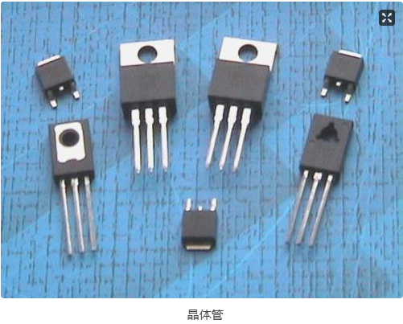

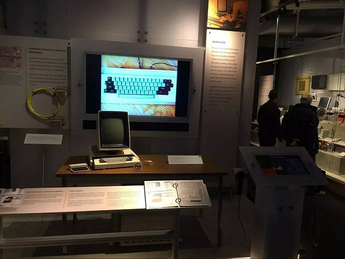

## 第三代集成电路计算机（1964年）

1964年，IBM公司成功地研制出大型集成电路通用计算机IBM360，拉开了第三代集成电路计算机的序幕，IBM360计算机推出的系列化、通用性和标准化极大地影响了世界各国计算机工业的发展，成为计算机产业发展史上的一个重要里程碑。

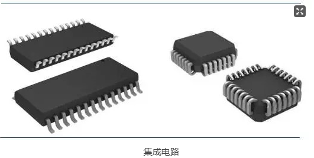

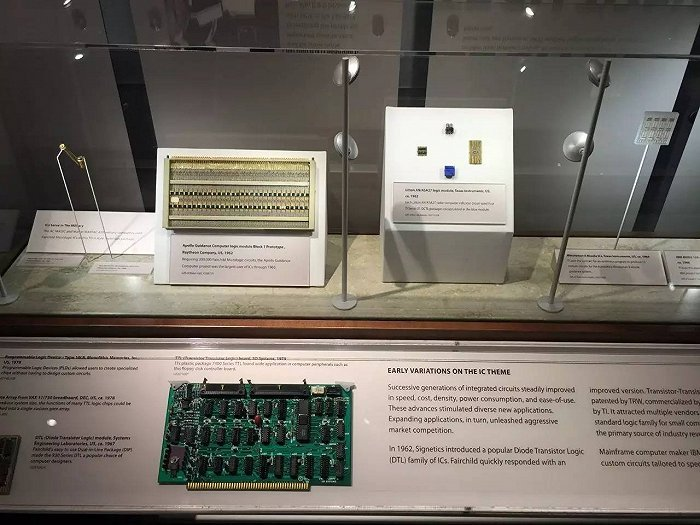

## 第 4 代大规模集成电路计算机(1971 - 至今)

大规模、超大规模的半导体集成电路的发展，使电子计算机在速度上不断地提高，体积不断地缩小、价格逐年地下降。随着电子计算机硬件技术进一步成熟，速度越来越快、通用性越来越好的计算机在各个行业被广泛应用。

## 私人电脑

对于数百万电游玩家而言，个人电脑现在首先是将他们与虚幻世界相联系的一个平台。这个世界充斥着来自世界各地的对手和盟友。

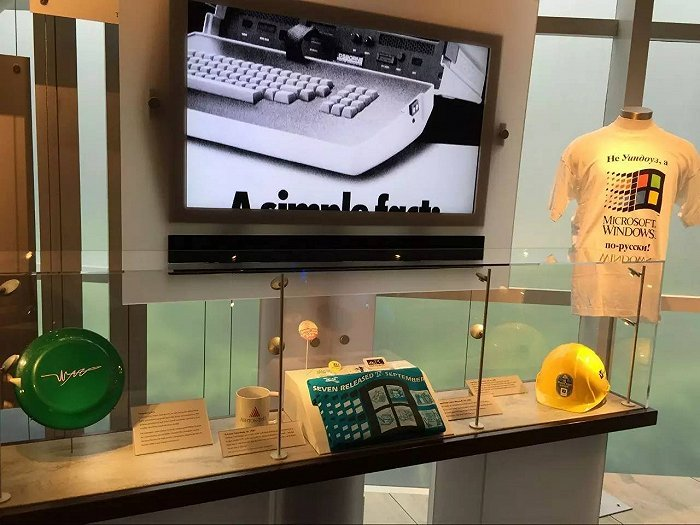

## 移动计算机

移动计算是随着移动通信、互联网、数据库、分布式计算等技术的发展而兴起的新技术。移动计算技术将使计算机或其它信息智能终端设备在无线环境下实现数据传输及资源共享。它的作用是将有用、准确、及时的信息提供给任何时间、任何地点的任何客户。这将极大地改变人们的生活方式和工作方式。

在这个技术下诞生了我们现在生活中不可缺少的移动手机。

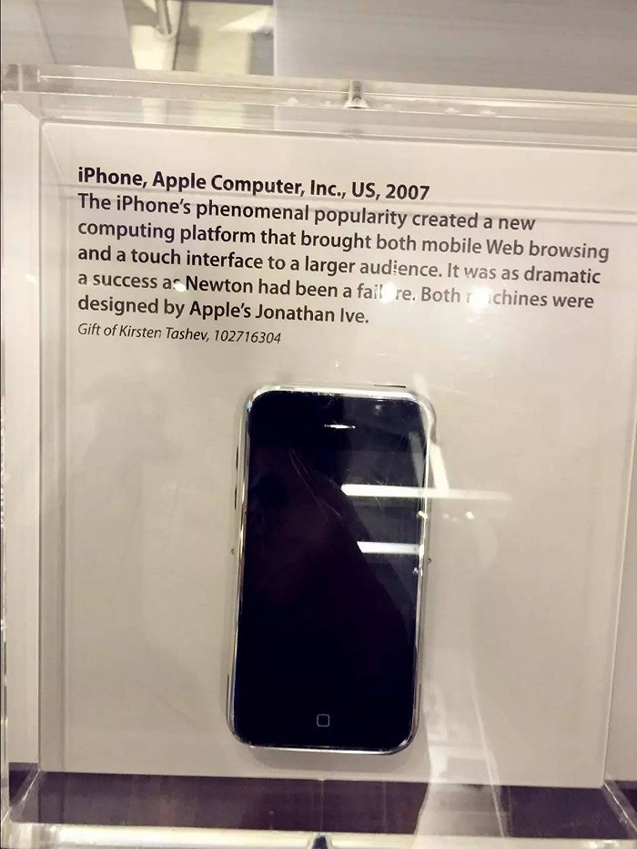

（2007年第一代iPhone面市）

## 云计算

云计算是基于互联网的相关服务的增加、使用和交付模式，通常涉及通过互联网来提供动态易扩展且经常是虚拟化的资源，是继1980年代大型计算机到客户端-服务器的大转变之后的又一种巨变。

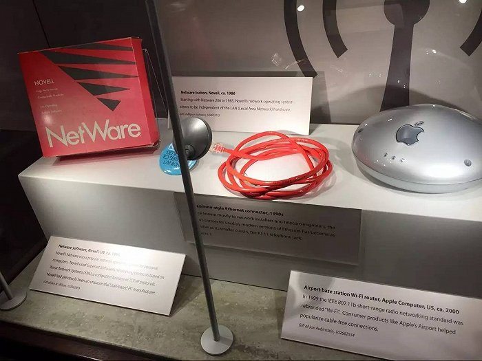

分布式计算（Distributed Computing）、并行计算（Parallel Computing）、效用计算（Utility Computing）、网络存储（Network Storage Technologies）、虚拟化（Virtualization）、负载均衡（Load Balance）、热备份冗余（High Available）等传统计算机和网络技术发展相互融合产生了云计算。

2006年8月9日，Google首席执行官埃里克·施密特（Eric Schmidt）在搜索引擎大会（SES San Jose 2006）首次提出“云计算”的概念，而Google“云端计算”源于Google工程师克里斯托弗·比希利亚所做的“Google 101”项目。

# **第2章 计算机基本组成**

## 计算机的基本硬件组成

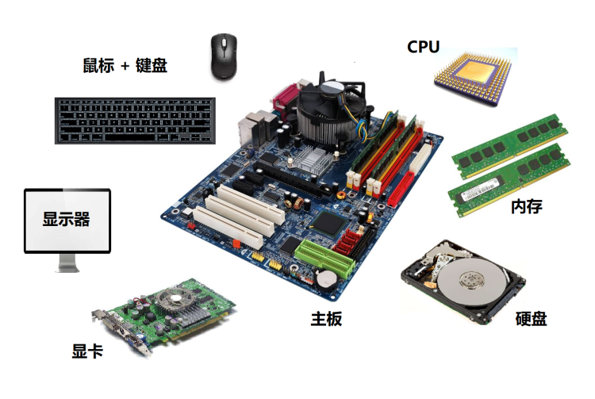

CPU相当于人的大脑，总指挥人体的各项功能；内存、硬盘相当于大脑中的记忆板块，记录、存储信息的，主板相当于人的神经系统，将人体各部分链接起来；显卡相当于人的眼睛，心脏则是计算机的电源，开通电源才能发起一切活动。

### CPU

CPU 的全称是 `Central Processing Unit`，它是你的电脑中最`硬核`的组件，这种说法一点不为过。CPU 是能够让你的计算机叫`计算机`的核心组件，但是它却不能代表你的电脑，CPU 与计算机的关系就相当于大脑和人的关系。CPU 的核心是从程序或应用程序获取指令并执行计算。此过程可以分为三个关键阶段：**提取，解码和执行**。CPU从系统的主存中提取指令，然后解码该指令的实际内容，然后再由 CPU 的相关部分执行该指令。

### 内存

内存（Memory）是计算机中最重要的部件之一，它是程序与CPU进行沟通的桥梁。计算机中所有程序的运行都是在内存中进行的，因此内存对计算机的影响非常大，内存又被称为`主存`，其作用是存放 CPU 中的运算数据，以及与硬盘等外部存储设备交换的数据。只要计算机在运行中，CPU 就会把需要运算的数据调到主存中进行运算，当运算完成后CPU再将结果传送出来，主存的运行也决定了计算机的稳定运行。

### 主板

主板上集成了各种电子元件、插槽和接口等，为CPU、内存和各种功能卡，如声卡、网卡等提供了安装插槽，为各种多媒体和通信设备提供了接口。如下图所示为主板的结构图。

下面将对主板的各元件、插槽和接口分别进行介绍。

北桥芯片：北桥芯片是主板芯片组中最重要的一块芯片。电脑中的CPU、内存和显卡都是由北桥芯片控制，因此北桥芯片的优劣在一定程度上决定了主板的性能。由于北桥芯片处理的数据较多，为降低其工作时散发出的热量，一般情况下还会在其上方安装散热片。

北桥芯片

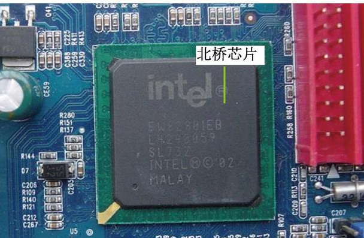

南桥芯片：南桥芯片是主板的第二大芯片（第一大芯片是北桥芯片）。南桥芯片控制了输入/输出设备和外部设备，如USB设备、IDE设备、SATA设备、音频控制器、键盘控制器、实时时钟控制器和高级电源管理等设备。

南桥芯片

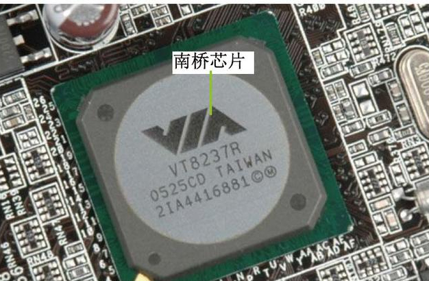

主板是一个有着各种各样，有时候多达数十乃至上百个插槽的配件。我们的 CPU 要插在主板上，内存也要插在主板上。主板的**芯片组**（Chipset）和**总线**（Bus）解决了 CPU 和内存之间如何通信的问题。芯片组控制了数据传输的流转，也就是数据从哪里到哪里的问题。总线则是实际数据传输的高速公路。因此，**总线速度**（Bus Speed）决定了数据能传输得多快。

系统总线和IO总线

一般主机板芯片组有分北桥与南桥， 北桥的系统总线称为系统总线，因为是CPU、内存、显卡传输的主要通道，所以速度较快。南桥就是所谓的输入输出(I/O)总线，主要在联系硬盘、USB、网络卡等周边设备，最常见的是PCI总线。这两条总线之间用桥接的芯片或者说电路连接起来。

 

举个形象的例子，就好比一个城市里，有两条主干道，一条属于行政区，一条属于商业区，中间有个环岛，将两条主干道连接到了一起，系统总线就好比行政区里的主干道，而I/O总线就好比商业区的主干道。系统总线和I/O总线的带宽的单位都是以Gbyte来记，但是显而易见的是，行政区的主干道和商业区的主干道相比的话，前者肯定更“核心”，更宽，更顺畅，设计的要求也高  

**CPU总线的功能**

[CPU](https://baike.baidu.com/item/CPU/120556)总线，又称为FSB（[前端总线](https://baike.baidu.com/item/%E5%89%8D%E7%AB%AF%E6%80%BB%E7%BA%BF/103633)，Front Side Bus），是PC系统中最快的总线，也是芯片组与主板的核心

通常，总线可分为三类：数据总线，地址总线，控制总线，当然这也适合于CPU总线。在微型机中，CPU作为总线主控，通过控制总线，向各个部件发送控制信号，通过地址总线用地址信号指定其需要访问的部件，如存储器，数据总线上传送数据信息，数据总线是双向的，即，数据信息可由CPU至其它部件（写），也可由其它部件至CPU（读）。CPU总线处于芯片组与CPU之间，负责CPU与外界所有部件的通信，因为CPU是通过芯片组联系各个部件的。此外，CPU总线还负责CPU与Cache之间的通信。正如前面所说，CPU总线像一条主干道，数据和信号从这主干道上流到各个部件和外部设备，也从各个部件流回CPU（主要是数据）。

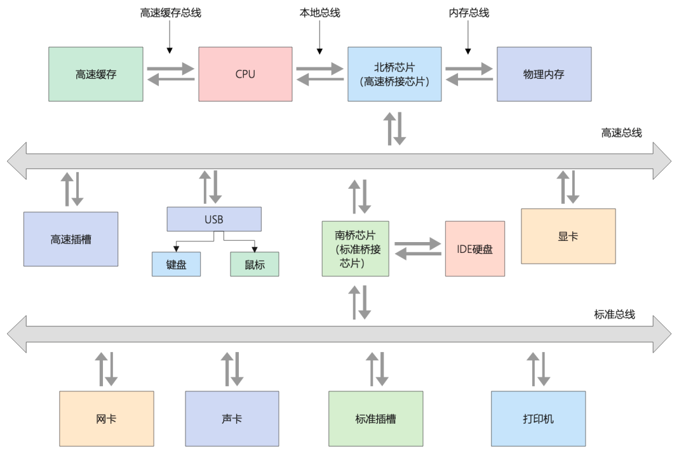

### I/O 设备

有了三大件，只要配上**电源**供电，计算机差不多就可以跑起来了。但是现在还缺少各类输入（Input）/ 输出（Output）设备，也就是我们常说的**I/O 设备**。如果你用的是自己的个人电脑，那显示器肯定必不可少，只有有了显示器我们才能看到计算机输出的各种图像、文字，这也就是所谓的**输出设备**。

同样的，鼠标和键盘也都是必不可少的配件。这样我才能输入文本，写下这篇文章。它们也就是所谓的**输入设备**。

### 显卡

还有一个很特殊的设备，就是**显卡**（Graphics Card）。现在，使用图形界面操作系统的计算机，无论是 Windows、Mac OS 还是 Linux，显卡都是必不可少的。有人可能要说了，我装机的时候没有买显卡，计算机一样可以正常跑起来啊！那是因为，现在的主板都带了内置的显卡。如果你用计算机玩游戏，做图形渲染或者跑深度学习应用，你多半就需要买一张单独的显卡，插在主板上。显卡之所以特殊，是因为显卡里有除了 CPU 之外的另一个“处理器”，也就是**GPU**（Graphics Processing Unit，图形处理器），GPU 一样可以做各种“计算”的工作。

## 冯若依曼和哈佛

### 冯·诺依曼体系结构概述

数学家冯·诺依曼提出了计算机制造的三个基本原则（采用二进制、程序存储、顺序执行），以及计算机的五个组成部分（运算器、控制器、存储器、输入设备、输出设备），这套理论被称为冯·诺依曼体系结构，根据这一原理制造的计算机被称为冯·诺依曼结构计算机。

冯·诺依曼最先提出程序存储的思想，并成功将其运用在计算机的设计之中。冯·诺伊曼体系结构是现代计算机的基础，现在大多计算机仍是冯·诺伊曼计算机的组织结构，因此冯·诺依曼又被称为“现代计算机之父”。

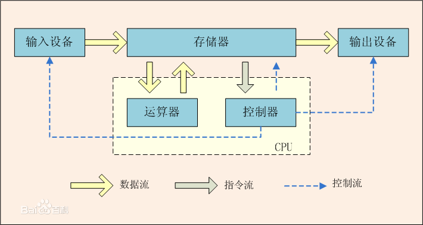

**冯·诺依曼体系结构特点：**

（1）计算机处理的数据和指令一律用二进制数表示。

（2）指令和数据不加区别混合存储在同一个 存储器 中（硬盘）

（3）顺序执行程序的每一条指令。(重点是“顺序”)

**冯·诺依曼体系结构的计算机必须具备功能：**

（1）把需要的程序和数据送至计算机中（复制）

（2）必须具有长期记忆程序、数据、中间结果及最终运算结果的能力（硬盘）

（3）能够完成各种算术、逻辑运算和数据传送等数据加工处理的能力（ALU）

（4）能够根据需要控制程序的走向，并能根据指令控制机器的各部件协调操作。

（5）能够按照要求将处理的结果输出给用户。

### 冯·诺依曼体系工作原理（CPU工作原理）

程序的执行过程实际上是不断地取出指令、分析指令、执行指令的过程。冯·诺依曼型计算机从本质上讲是采用串行顺序处理的工作机制，即使有关数据已经准备好了，也必须逐条执行指令序列，如下图所示：

具体过程：

（1）预先把指挥计算机如何进行操作的指令序列（就是程序）和原始数据输入到计算机内存中（拷贝），每条指令中明确规定了计算机从哪个地址取数，进行什么操作，然后送到什么地方去等步骤。

（2）计算机在执行时，先从内存中取出第一条指令，通过控制器的译码器接收指令的要求，再从存储器中取出数据进行指定的运算和逻辑操作等，然后再按地址把结果送到内存中，如果需要向硬盘等存储设备存储数据，还需要将内存中的该数据存储到硬盘中。接下来取出第2条指令，在控制器的指挥下完成规定操作，依次进行下去，直到遇到停止指令。

（3）计算机中基本上有两股信息在流动，一种是数据，即各种原始数据、中间结果和程序等，另一种信息是控制信息，它控制机器的各种部件执行指令规定的各种操作。

### 哈佛结构

哈佛结构是一种将程序指令存储和数据存储分开的存储器结构，它的主要特点是将程序和数据存储在不同的存储空间中，即程序存储器和数据存储器是两个独立的存储器，每个存储器独立编址、独立访问，目的是为了减轻程序运行时的访存瓶颈。

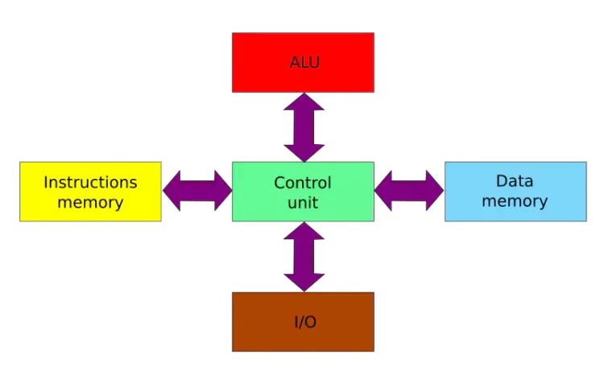

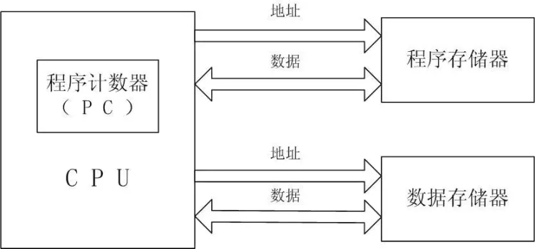

### 哈佛结构和冯诺依曼结构区别

**哈佛结构和冯诺依曼结构主要区别在是否区分指令与数据**。实际上在内存里，指令和数据是在一起的。而在CPU内的缓存中，还是会区分指令缓存和数据缓存，最终执行的时候，指令和数据是从两个不同的地方出来的。在CPU外部，采用的是冯诺依曼模型，而在CPU内部用的是哈佛结构。大部分的DSP都没有缓存，因而直接就是哈佛结构。哈佛结构设计复杂，但效率高。冯诺依曼结构则比较简单，但也比较慢。CPU厂商为了提高处理速度，在CPU内增加了高速缓存。也基于同样的目的，区分了指令缓存和数据缓存。

